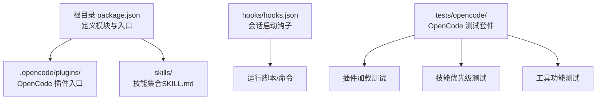
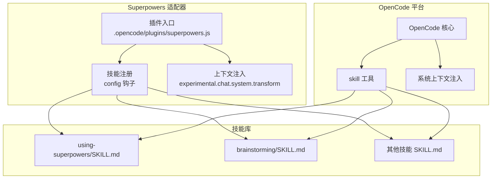
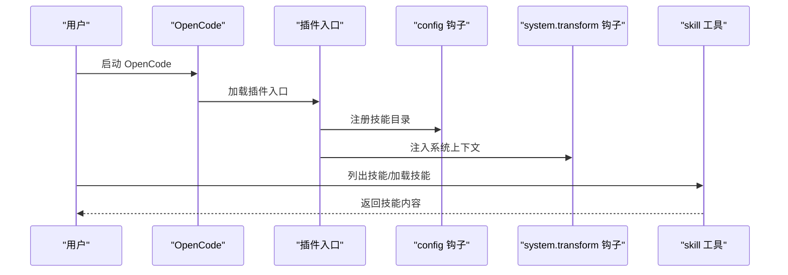
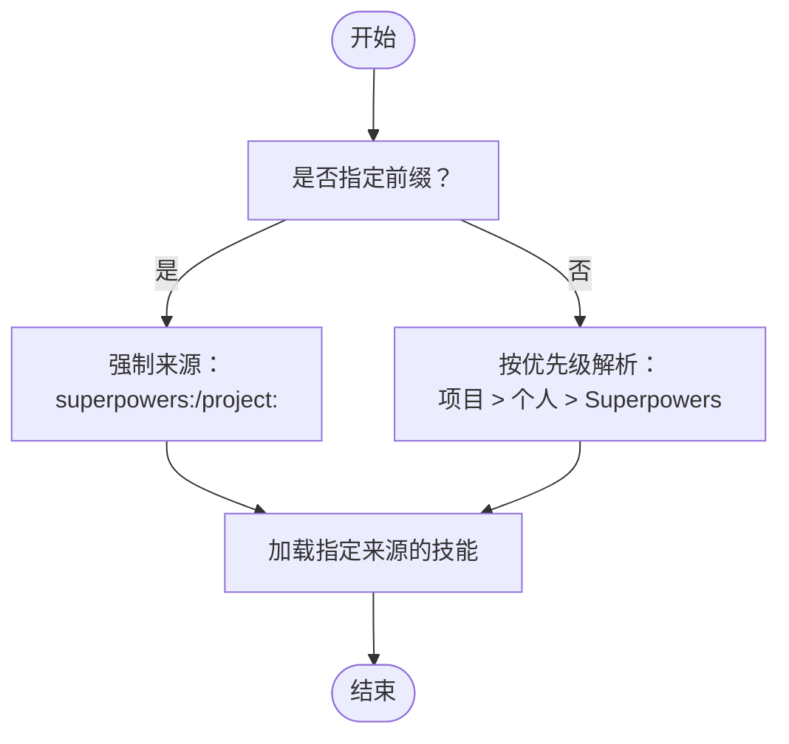
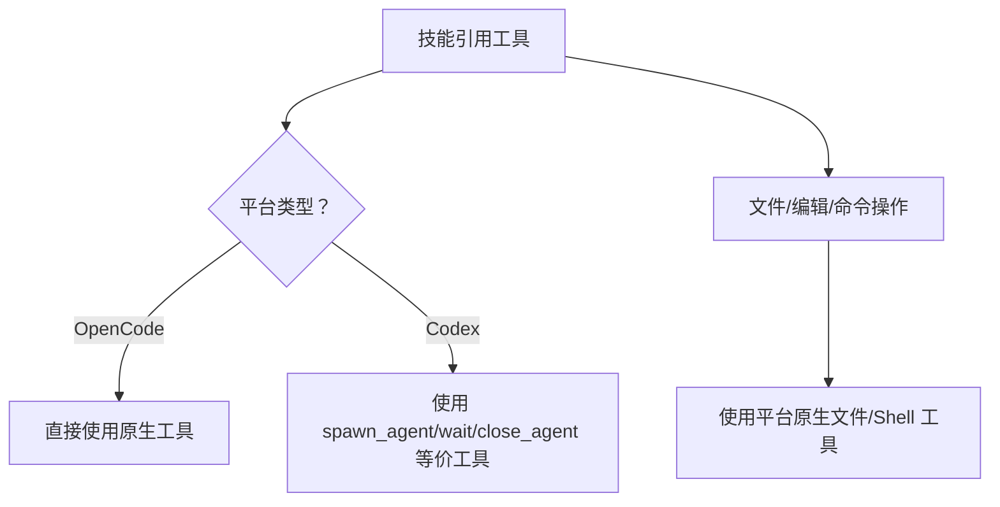
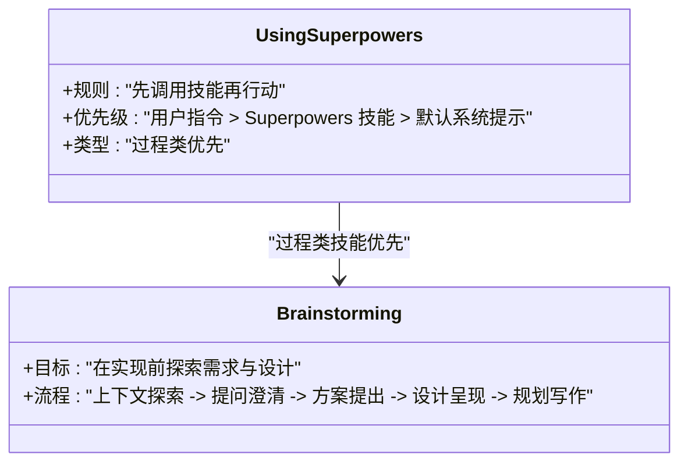

# OpenCode 平台适配器

<cite>
**本文档引用的文件**
- [README.opencode.md](file://docs/README.opencode.md)
- [.opencode/INSTALL.md](file://.opencode/INSTALL.md)
- [package.json](file://package.json)
- [hooks.json](file://hooks/hooks.json)
- [hooks-cursor.json](file://hooks/hooks-cursor.json)
- [using-superpowers/SKILL.md](file://skills/using-superpowers/SKILL.md)
- [brainstorming/SKILL.md](file://skills/brainstorming/SKILL.md)
- [codex-tools.md](file://skills/using-superpowers/references/codex-tools.md)
- [test-plugin-loading.sh](file://tests/opencode/test-plugin-loading.sh)
- [test-priority.sh](file://tests/opencode/test-priority.sh)
- [test-tools.sh](file://tests/opencode/test-tools.sh)
</cite>

## 目录
1. [简介](#简介)
2. [项目结构](#项目结构)
3. [核心组件](#核心组件)
4. [架构总览](#架构总览)
5. [详细组件分析](#详细组件分析)
6. [依赖关系分析](#依赖关系分析)
7. [性能考虑](#性能考虑)
8. [故障排除指南](#故障排除指南)
9. [结论](#结论)
10. [附录](#附录)

## 简介
本文件面向 OpenCode 平台的 Superpowers 适配器，系统性阐述其插件架构、工具映射与平台适配机制，覆盖插件加载、工具调用、状态管理、技能优先级、兼容性与配置选项，并提供安装部署、开发与扩展指南。该适配器通过 OpenCode 原生能力自动注册技能并注入上下文，实现对 Claude Code 技能的无缝迁移与跨平台使用。

## 项目结构
- 根级 package.json 指定模块类型与入口文件，指向 OpenCode 插件主文件路径，确保 OpenCode 能正确解析插件入口。
- .opencode 目录包含安装说明与插件目录占位，用于在 OpenCode 配置中注册插件。
- skills 目录下包含多个技能（如 brainstorming、using-superpowers 等），每个技能以 SKILL.md 作为元数据与内容载体。
- hooks 目录提供会话启动等钩子配置，支持在特定事件触发时执行脚本或命令。
- tests/opencode 目录包含针对 OpenCode 的端到端测试，验证插件加载、技能优先级与工具可用性。

**图表来源**
- [package.json:1-7](file://package.json#L1-L7)
- [.opencode/INSTALL.md:1-84](file://.opencode/INSTALL.md#L1-L84)
- [hooks.json:1-17](file://hooks/hooks.json#L1-L17)

**章节来源**
- [package.json:1-7](file://package.json#L1-L7)
- [.opencode/INSTALL.md:1-84](file://.opencode/INSTALL.md#L1-L84)
- [hooks.json:1-17](file://hooks/hooks.json#L1-L17)

## 核心组件
- 插件入口与注册
  - 通过 package.json 的 main 字段指向 OpenCode 插件入口文件，OpenCode 启动时自动加载并注册插件。
  - 安装后重启 OpenCode，插件通过原生机制自动安装并通过钩子注册技能目录，无需手动配置。
- 技能系统
  - skills 目录下的每个技能以 SKILL.md 作为元数据与内容载体，包含名称、描述与技能正文。
  - 使用 OpenCode 原生 skill 工具列出与加载技能；支持前缀强制指定来源（如 superpowers:、project:）。
- 工具映射与平台适配
  - 将 Claude Code 技能中的工具名称映射为 OpenCode 可用的等价工具或行为，例如 TodoWrite 映射为 todowrite、Task 子代理调度映射为 @mention 系统等。
- 上下文注入
  - 通过 experimental.chat.system.transform 钩子向每次对话注入 Superpowers 的上下文信息，使模型理解如何发现与使用技能。

**章节来源**
- [README.opencode.md:91-106](file://docs/README.opencode.md#L91-L106)
- [using-superpowers/SKILL.md:1-118](file://skills/using-superpowers/SKILL.md#L1-L118)
- [codex-tools.md:1-101](file://skills/using-superpowers/references/codex-tools.md#L1-L101)

## 架构总览
OpenCode 适配器采用“插件 + 技能 + 工具映射”的三层架构：
- 插件层：负责注册与生命周期管理，注入系统上下文，暴露技能目录给 OpenCode。
- 技能层：以 SKILL.md 为单位组织技能，提供可复用的工作流与指导。
- 工具层：将平台无关的技能工具映射为 OpenCode 原生工具或行为，保证跨平台一致性。

**图表来源**
- [README.opencode.md:91-106](file://docs/README.opencode.md#L91-L106)
- [using-superpowers/SKILL.md:1-118](file://skills/using-superpowers/SKILL.md#L1-L118)
- [brainstorming/SKILL.md:1-165](file://skills/brainstorming/SKILL.md#L1-L165)

## 详细组件分析

### 组件一：插件加载与注册流程
- 加载阶段
  - OpenCode 启动时读取 package.json 中的 main 字段，定位插件入口文件。
  - 插件通过 config 钩子注册 skills 目录，使 OpenCode 自动发现所有 Superpowers 技能。
- 注入阶段
  - 通过 experimental.chat.system.transform 钩子向系统提示词注入 Superpowers 的使用规则与优先级，确保模型在会话开始即具备上下文。
- 验证点
  - 插件文件存在且语法有效；技能目录包含至少一个 SKILL.md；关键引导技能（如 using-superpowers）存在。

**图表来源**
- [README.opencode.md:91-106](file://docs/README.opencode.md#L91-L106)
- [test-plugin-loading.sh:18-52](file://tests/opencode/test-plugin-loading.sh#L18-L52)

**章节来源**
- [README.opencode.md:91-106](file://docs/README.opencode.md#L91-L106)
- [test-plugin-loading.sh:18-52](file://tests/opencode/test-plugin-loading.sh#L18-L52)

### 组件二：技能优先级与解析机制
- 优先级规则
  - 项目技能 > 个人技能 > Superpowers 技能；可通过前缀强制覆盖：superpowers: 强制使用 Superpowers 版本，project: 在项目上下文中强制使用项目版本。
- 解析流程
  - 当用户请求加载某技能时，OpenCode 先按优先级查找；若未显式指定前缀，则选择最高优先级的同名技能；若显式指定前缀，则忽略优先级直接加载对应来源的技能。
- 验证点
  - 在不同工作目录（HOME 与项目目录）下分别验证优先级；验证前缀强制行为。

**图表来源**
- [test-priority.sh:99-174](file://tests/opencode/test-priority.sh#L99-L174)

**章节来源**
- [test-priority.sh:99-174](file://tests/opencode/test-priority.sh#L99-L174)

### 组件三：工具映射与平台适配
- 工具映射策略
  - TodoWrite → todowrite：任务跟踪与待办生成。
  - Task（子代理调度）→ @mention 系统：通过提及机制实现多角色协作。
  - Skill 工具 → OpenCode 原生 skill 工具：技能发现与加载。
  - 文件操作 → 原生文件工具：根据平台特性使用本地文件系统工具。
- 适配要点
  - 对于不支持的工具（如多代理），需通过平台提供的替代方案（如 spawn_agent/wait/close_agent）实现等价行为。
  - 对于环境检测（如 Git 工作树、分离头指针），需使用只读命令进行环境判断后再决定后续动作。

**图表来源**
- [codex-tools.md:1-101](file://skills/using-superpowers/references/codex-tools.md#L1-L101)
- [README.opencode.md:98-106](file://docs/README.opencode.md#L98-L106)

**章节来源**
- [codex-tools.md:1-101](file://skills/using-superpowers/references/codex-tools.md#L1-L101)
- [README.opencode.md:98-106](file://docs/README.opencode.md#L98-L106)

### 组件四：技能内容与使用规则
- 使用规则
  - 在任何对话开始时，应先检查是否存在适用技能，再进行响应或行动；即使有 1% 的可能性适用也必须调用技能。
  - 用户显式指令优先于 Superpowers 技能，Superpowers 技能优先于默认系统提示。
- 技能类型与顺序
  - 过程类技能（如 brainstorming、debugging）优先于实现类技能；完成过程类技能后，再进入实现类技能。
- 内容结构
  - 每个技能以 SKILL.md 为载体，包含 YAML 头部（name/description）、正文与流程图等。

**图表来源**
- [using-superpowers/SKILL.md:18-118](file://skills/using-superpowers/SKILL.md#L18-L118)
- [brainstorming/SKILL.md:34-64](file://skills/brainstorming/SKILL.md#L34-L64)

**章节来源**
- [using-superpowers/SKILL.md:18-118](file://skills/using-superpowers/SKILL.md#L18-L118)
- [brainstorming/SKILL.md:34-64](file://skills/brainstorming/SKILL.md#L34-L64)

## 依赖关系分析
- 插件入口依赖 OpenCode 的钩子系统（config/system.transform）实现自动注册与上下文注入。
- 技能依赖 OpenCode 的 skill 工具进行发现与加载。
- 工具映射依赖平台提供的原生工具能力（如 spawn_agent/wait/close_agent、文件/Shell 工具）。

**图表来源**
- [README.opencode.md:91-106](file://docs/README.opencode.md#L91-L106)
- [hooks.json:1-17](file://hooks/hooks.json#L1-L17)

**章节来源**
- [README.opencode.md:91-106](file://docs/README.opencode.md#L91-L106)
- [hooks.json:1-17](file://hooks/hooks.json#L1-L17)

## 性能考虑
- 插件加载与注册
  - 通过自动安装与注册减少人工干预，避免重复加载导致的资源浪费。
- 技能优先级解析
  - 优先级解析逻辑简单明确，避免复杂查询带来的延迟。
- 工具映射
  - 使用平台原生工具减少跨层封装开销，提升执行效率。
- 日志与诊断
  - 通过 OpenCode 日志输出与超时控制，快速定位问题，降低调试成本。

## 故障排除指南
- 插件未加载
  - 检查 OpenCode 日志中关于 Superpowers 的条目；确认 opencode.json 中的插件行正确；确保使用较新的 OpenCode 版本。
- 技能未找到
  - 使用 OpenCode 的 skill 工具列出已发现的技能；确认插件已成功加载；检查 SKILL.md 的 YAML 头部是否完整。
- 引导信息未出现
  - 确认 OpenCode 版本支持 experimental.chat.system.transform 钩子；修改配置后重启 OpenCode。
- 工具功能异常
  - 验证 skill 工具与 find_skills 工具是否正常返回预期结果；在项目目录与 HOME 目录分别测试优先级行为。

**章节来源**
- [README.opencode.md:107-131](file://docs/README.opencode.md#L107-L131)
- [test-plugin-loading.sh:107-123](file://tests/opencode/test-plugin-loading.sh#L107-L123)
- [test-tools.sh:24-77](file://tests/opencode/test-tools.sh#L24-L77)

## 结论
Superpowers 在 OpenCode 平台的适配器通过简洁的插件入口、自动化的技能注册与上下文注入，以及清晰的工具映射策略，实现了对 Claude Code 技能的无缝迁移。结合明确的技能优先级与前缀强制机制，用户可在不同场景下灵活选择技能来源，获得一致的使用体验。测试套件覆盖了插件加载、技能优先级与工具功能的关键路径，为稳定性提供了保障。

## 附录

### 安装与部署
- 安装步骤
  - 在全局或项目级 opencode.json 的 plugin 数组中添加 Superpowers 插件条目。
  - 重启 OpenCode，插件自动通过包管理器安装并注册所有技能。
  - 通过询问“Tell me about your superpowers”验证安装。
- 迁移旧版安装
  - 移除旧的符号链接与克隆仓库；清理 opencode.json 中的 skills.paths 配置；按新方式重新安装。

**章节来源**
- [.opencode/INSTALL.md:7-36](file://.opencode/INSTALL.md#L7-L36)
- [README.opencode.md:5-34](file://docs/README.opencode.md#L5-L34)

### 开发与扩展指南
- 新增技能
  - 在 skills 目录下创建新技能目录并在其中编写 SKILL.md；遵循 YAML 头部规范与内容结构。
  - 使用 skill 工具验证技能可见性与加载行为。
- 修改工具映射
  - 在对应平台的参考文档中更新工具映射；确保与 OpenCode 原生工具等价。
- 扩展钩子
  - 如需扩展生命周期行为，可在 hooks.json 中添加新的钩子配置，指向相应脚本或命令。

**章节来源**
- [hooks.json:1-17](file://hooks/hooks.json#L1-L17)
- [codex-tools.md:1-101](file://skills/using-superpowers/references/codex-tools.md#L1-L101)

### 测试与验证
- 插件加载测试
  - 验证插件文件存在与语法正确；确认技能目录非空；检查引导技能是否存在；验证个人测试技能创建。
- 技能优先级测试
  - 在 HOME 与项目目录分别验证优先级；测试前缀强制行为（superpowers:/project:）。
- 工具功能测试
  - 使用 find_skills 与 use_skill 工具验证技能发现与加载；在不同前缀下验证加载结果。

**章节来源**
- [test-plugin-loading.sh:1-83](file://tests/opencode/test-plugin-loading.sh#L1-L83)
- [test-priority.sh:1-199](file://tests/opencode/test-priority.sh#L1-L199)
- [test-tools.sh:1-105](file://tests/opencode/test-tools.sh#L1-L105)