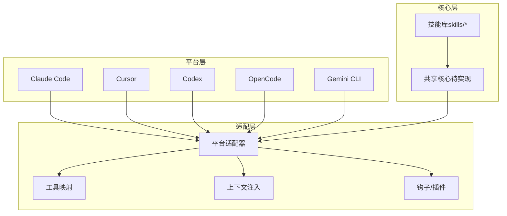
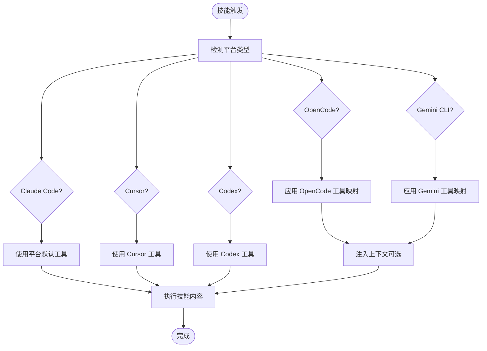
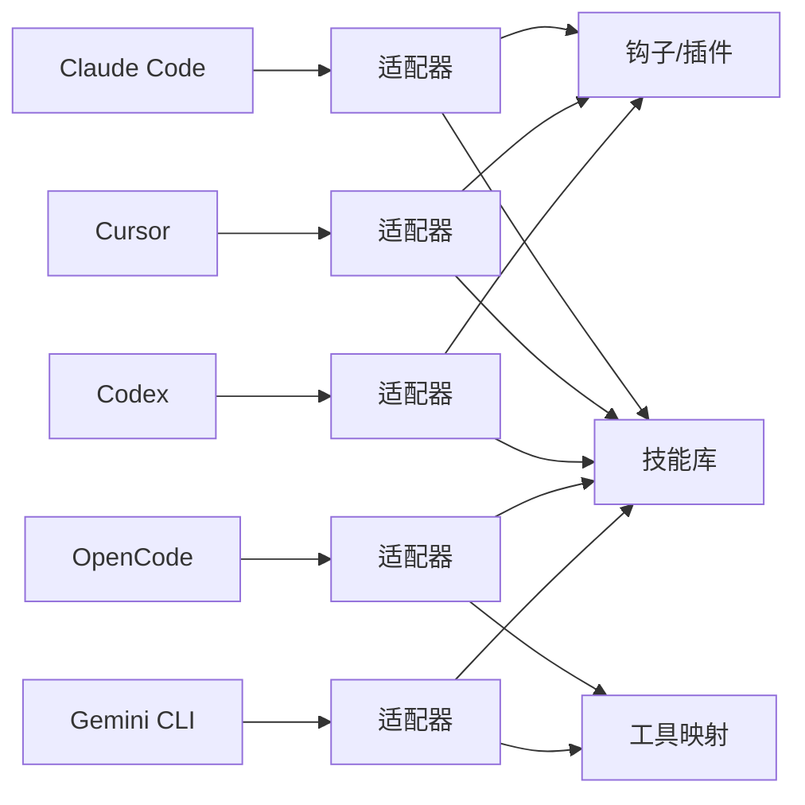

# 平台适配层组件

<cite>
**本文引用的文件**
- [README.md](file://README.md)
- [docs/README.codex.md](file://docs/README.codex.md)
- [docs/README.opencode.md](file://docs/README.opencode.md)
- [docs/testing.md](file://docs/testing.md)
- [hooks/hooks.json](file://hooks/hooks.json)
- [hooks/hooks-cursor.json](file://hooks/hooks-cursor.json)
- [gemini-extension.json](file://gemini-extension.json)
- [package.json](file://package.json)
- [skills/using-superpowers/SKILL.md](file://skills/using-superpowers/SKILL.md)
- [GEMINI.md](file://GEMINI.md)
- [docs/plans/2025-11-22-opencode-support-design.md](file://docs/plans/2025-11-22-opencode-support-design.md)
- [docs/plans/2025-11-22-opencode-support-implementation.md](file://docs/plans/2025-11-22-opencode-support-implementation.md)
</cite>

## 目录
1. [简介](#简介)
2. [项目结构](#项目结构)
3. [核心组件](#核心组件)
4. [架构总览](#架构总览)
5. [详细组件分析](#详细组件分析)
6. [依赖关系分析](#依赖关系分析)
7. [性能考量](#性能考量)
8. [故障排查指南](#故障排查指南)
9. [结论](#结论)
10. [附录](#附录)

## 简介
本文件面向 Superpowers 的“平台适配层”组件，系统化阐述其架构设计与实现要点，重点覆盖以下方面：
- 统一接口抽象：通过“技能（Skill）”作为统一能力边界，屏蔽平台工具差异。
- 平台特定适配器与 API 转换：针对不同平台（Claude Code、Cursor、Codex、OpenCode、Gemini）采用工具映射与上下文注入策略，确保同一技能在多平台一致可用。
- 差异处理与兼容性：以“工具名映射 + 会话上下文增强 + 插件/钩子机制”实现跨平台一致性。
- 开发指南与测试：提供新增平台支持的步骤、验证方法与部署流程。
- 扩展机制：定义“共享核心 + 平台适配器”的演进路径，便于后续扩展 Cursor、Windsurf 等平台。

## 项目结构
Superpowers 将“技能库”置于仓库根目录的 skills 子树中，并通过各平台的插件或钩子机制完成加载与适配。平台相关配置与安装说明集中在 docs 与各平台专用目录中；测试与运行时钩子位于 tests 与 hooks 目录。

```mermaid
graph TB
A["仓库根目录"] --> B["skills/"]
A --> C["docs/"]
A --> D["tests/"]
A --> E["hooks/"]
A --> F[".codex/"]
A --> G[".opencode/"]
A --> H[".cursor-plugin/"]
A --> I[".claude-plugin/"]
B --> B1["using-superpowers/"]
B --> B2["brainstorming/"]
B --> B3["systematic-debugging/"]
B --> B4["subagent-driven-development/"]
B --> B5["test-driven-development/"]
B --> B6["executing-plans/"]
B --> B7["dispatching-parallel-agents/"]
B --> B8["writing-plans/"]
B --> B9["requesting-code-review/"]
B --> B10["receiving-code-review/"]
B --> B11["finishing-a-development-branch/"]
B --> B12["verification-before-completion/"]
B --> B13["using-git-worktrees/"]
B --> B14["writing-skills/"]
C --> C1["README.codex.md"]
C --> C2["README.opencode.md"]
C --> C3["testing.md"]
C --> C4["plans/"]
D --> D1["claude-code/"]
D --> D2["explicit-skill-requests/"]
D --> D3["skill-triggering/"]
D --> D4["subagent-driven-dev/"]
E --> E1["hooks.json"]
E --> E2["hooks-cursor.json"]
E --> E3["run-hook.cmd"]
```

图表来源
- [README.md:1-191](file://README.md#L1-L191)
- [docs/README.codex.md:1-127](file://docs/README.codex.md#L1-L127)
- [docs/README.opencode.md:1-131](file://docs/README.opencode.md#L1-L131)
- [hooks/hooks.json:1-17](file://hooks/hooks.json#L1-L17)
- [hooks/hooks-cursor.json:1-11](file://hooks/hooks-cursor.json#L1-L11)

章节来源
- [README.md:27-106](file://README.md#L27-L106)
- [docs/README.codex.md:1-127](file://docs/README.codex.md#L1-L127)
- [docs/README.opencode.md:1-131](file://docs/README.opencode.md#L1-L131)
- [hooks/hooks.json:1-17](file://hooks/hooks.json#L1-L17)
- [hooks/hooks-cursor.json:1-11](file://hooks/hooks-cursor.json#L1-L11)

## 核心组件
- 技能（Skill）：以 SKILL.md 为入口的可发现能力单元，包含 YAML 前言元数据与正文内容，由各平台按约定加载与执行。
- 平台适配器（Platform Adapter）：以“工具映射 + 上下文注入 + 钩子/插件”为核心的适配层，负责将通用技能语义转换为具体平台的工具调用与会话行为。
- 共享核心（Shared Core）：在 OpenCode 支持计划中明确的“共享技能发现与解析核心”，用于减少重复逻辑，提升维护性与一致性。
- 测试与验证（Tests & Validation）：通过真实会话运行与日志解析、令牌用量分析等手段，验证技能在目标平台的行为正确性。

章节来源
- [skills/using-superpowers/SKILL.md:1-118](file://skills/using-superpowers/SKILL.md#L1-L118)
- [docs/plans/2025-11-22-opencode-support-design.md:254-295](file://docs/plans/2025-11-22-opencode-support-design.md#L254-L295)
- [docs/testing.md:1-304](file://docs/testing.md#L1-L304)

## 架构总览
平台适配层围绕“统一技能接口 + 平台差异化适配 + 自动化测试验证”展开，整体架构如下：

图表来源
- [README.md:27-106](file://README.md#L27-L106)
- [docs/README.codex.md:50-58](file://docs/README.codex.md#L50-L58)
- [docs/README.opencode.md:91-106](file://docs/README.opencode.md#L91-L106)
- [hooks/hooks.json:1-17](file://hooks/hooks.json#L1-L17)
- [hooks/hooks-cursor.json:1-11](file://hooks/hooks-cursor.json#L1-L11)
- [gemini-extension.json:1-7](file://gemini-extension.json#L1-L7)
- [package.json:1-7](file://package.json#L1-L7)

## 详细组件分析

### 统一接口抽象：技能（Skill）
- 触发方式：用户显式请求或由“using-superpowers”技能自动判定后触发。
- 内容加载：各平台通过各自的工具或系统钩子加载 SKILL.md 的正文内容并执行。
- 优先级与约束：用户指令优先于技能；技能内部定义刚性/柔性两类，指导执行方式。

章节来源
- [skills/using-superpowers/SKILL.md:28-41](file://skills/using-superpowers/SKILL.md#L28-L41)
- [skills/using-superpowers/SKILL.md:97-118](file://skills/using-superpowers/SKILL.md#L97-L118)

### 平台特定适配器与 API 转换

#### Claude Code
- 安装与市场：支持官方市场与自建市场两种安装方式。
- 技能加载：使用内置的 Skill 工具加载技能内容；会话上下文与工具调用遵循 Claude Code 的工具体系。
- 钩子机制：通过 hooks.json 中的 SessionStart 钩子在会话开始时执行命令，辅助初始化或环境准备。

章节来源
- [README.md:31-63](file://README.md#L31-L63)
- [hooks/hooks.json:1-17](file://hooks/hooks.json#L1-L17)

#### Cursor
- 安装与市场：通过插件市场安装；会话开始钩子配置在 hooks-cursor.json 中。
- 适配策略：基于 Cursor 的会话生命周期与工具集，将通用技能映射到 Cursor 的工具链。

章节来源
- [README.md:55-63](file://README.md#L55-L63)
- [hooks/hooks-cursor.json:1-11](file://hooks/hooks-cursor.json#L1-L11)

#### Codex
- 安装与发现：通过符号链接将 skills 目录暴露给 Codex，使其在启动时扫描并加载技能。
- 多代理支持：部分高级技能需要 Codex 的多代理特性开启后方可使用。

章节来源
- [docs/README.codex.md:13-40](file://docs/README.codex.md#L13-L40)
- [docs/README.codex.md:50-58](file://docs/README.codex.md#L50-L58)

#### OpenCode
- 安装与注册：通过 opencode.json 的 plugin 数组声明，Bun 自动安装并在每次启动时重新注册技能。
- 工具映射：将 Claude Code 的工具名称自动映射为 OpenCode 的原生工具（如 TodoWrite → todowrite、Skill → skill 等）。
- 上下文注入：通过 experimental.chat.system.transform 钩子向会话注入 Superpowers 的上下文。

章节来源
- [docs/README.opencode.md:5-18](file://docs/README.opencode.md#L5-L18)
- [docs/README.opencode.md:91-106](file://docs/README.opencode.md#L91-L106)

#### Gemini CLI
- 安装与上下文：通过 gemini-extension.json 指定上下文文件（GEMINI.md），在会话开始时加载工具映射。
- 技能激活：使用 activate_skill 工具按需加载技能内容。

章节来源
- [gemini-extension.json:1-7](file://gemini-extension.json#L1-L7)
- [GEMINI.md:1-3](file://GEMINI.md#L1-L3)
- [skills/using-superpowers/SKILL.md:34](file://skills/using-superpowers/SKILL.md#L34-L34)

### 工具映射与 API 转换流程

图表来源
- [docs/README.opencode.md:98-106](file://docs/README.opencode.md#L98-L106)
- [skills/using-superpowers/SKILL.md:34](file://skills/using-superpowers/SKILL.md#L34-L34)
- [hooks/hooks.json:1-17](file://hooks/hooks.json#L1-L17)
- [hooks/hooks-cursor.json:1-11](file://hooks/hooks-cursor.json#L1-L11)

### 平台差异处理与兼容性保证
- 差异点识别：工具命名差异（如 TodoWrite/todowrite）、会话上下文注入方式差异（hooks vs extension）、安装与加载机制差异（marketplace/symlink/plugin）。
- 兼容性策略：
  - 以“工具映射表”和“上下文注入钩子”为适配基线，确保同一技能在不同平台呈现一致行为。
  - 对于需要多代理或特殊功能的技能，提供平台特定的启用条件与配置指引。
  - 通过共享核心模块（如技能发现与解析）降低重复实现，提升一致性与可维护性。

章节来源
- [docs/README.opencode.md:98-106](file://docs/README.opencode.md#L98-L106)
- [docs/README.codex.md:35-40](file://docs/README.codex.md#L35-L40)
- [docs/plans/2025-11-22-opencode-support-design.md:288-294](file://docs/plans/2025-11-22-opencode-support-design.md#L288-L294)

### 开发指南：新增平台支持
- 步骤概览（参考 OpenCode 支持计划）：
  1) 创建共享核心模块（如技能发现与解析），统一处理 frontmatter 与目录扫描。
  2) 在目标平台实现适配器：工具映射、上下文注入、插件/钩子集成。
  3) 编写平台特定安装与更新流程文档。
  4) 进行端到端集成测试，验证技能加载、工具调用与会话行为。
  5) 文档与发布：更新主 README 与平台文档，补充变更日志与发行说明。

章节来源
- [docs/plans/2025-11-22-opencode-support-implementation.md:21-103](file://docs/plans/2025-11-22-opencode-support-implementation.md#L21-L103)
- [docs/plans/2025-11-22-opencode-support-design.md:254-295](file://docs/plans/2025-11-22-opencode-support-design.md#L254-L295)

### 测试方法与验证
- 集成测试：在目标平台以无头模式运行真实会话，解析 .jsonl 日志，断言技能调用、子代理分发、任务跟踪、文件生成与测试通过情况。
- 令牌用量分析：通过 Python 工具统计主会话与子代理的输入/输出令牌与缓存读取，评估成本与效率。
- 常见问题定位：检查工作目录、权限模式、会话文件位置与插件启用状态。

章节来源
- [docs/testing.md:20-136](file://docs/testing.md#L20-L136)
- [docs/testing.md:178-264](file://docs/testing.md#L178-L264)

### 部署流程
- Claude Code/Cursor：通过各自插件市场安装；必要时配置会话开始钩子。
- Codex：建立符号链接至 skills 目录；如需多代理，启用相应配置项。
- OpenCode：在 opencode.json 中添加插件条目；重启后自动安装与注册。
- Gemini CLI：通过扩展配置指定上下文文件；会话开始时加载工具映射。

章节来源
- [README.md:27-106](file://README.md#L27-L106)
- [docs/README.codex.md:13-40](file://docs/README.codex.md#L13-L40)
- [docs/README.opencode.md:5-18](file://docs/README.opencode.md#L5-L18)
- [gemini-extension.json:1-7](file://gemini-extension.json#L1-L7)

## 依赖关系分析
- 平台到适配器：各平台通过自身插件/钩子机制与适配器交互，适配器再对接共享核心与技能库。
- 适配器到技能库：适配器负责解析与加载 SKILL.md，执行技能内容。
- 适配器到平台工具：通过工具映射与上下文注入，将通用技能语义转换为平台原生工具调用。

图表来源
- [README.md:27-106](file://README.md#L27-L106)
- [docs/README.opencode.md:91-106](file://docs/README.opencode.md#L91-L106)
- [hooks/hooks.json:1-17](file://hooks/hooks.json#L1-L17)
- [hooks/hooks-cursor.json:1-11](file://hooks/hooks-cursor.json#L1-L11)

章节来源
- [README.md:27-106](file://README.md#L27-L106)
- [docs/README.opencode.md:91-106](file://docs/README.opencode.md#L91-L106)
- [hooks/hooks.json:1-17](file://hooks/hooks.json#L1-L17)
- [hooks/hooks-cursor.json:1-11](file://hooks/hooks-cursor.json#L1-L11)

## 性能考量
- 令牌与成本：通过令牌用量分析工具监控主会话与子代理的输入/输出令牌与缓存读取，合理控制任务复杂度与子代理数量。
- 缓存利用：高缓存读取是预期行为，有助于降低成本；避免不必要的重复计算与冗余工具调用。
- 会话时长：集成测试可能耗时较长，建议设置合理的超时与资源限制，同时排查潜在的无限循环或阻塞逻辑。

章节来源
- [docs/testing.md:137-177](file://docs/testing.md#L137-L177)
- [docs/testing.md:198-206](file://docs/testing.md#L198-L206)

## 故障排查指南
- 技能未加载：确认在正确的工作目录运行、平台已启用插件或市场、技能文件存在且前言元数据有效。
- 权限问题：在无头测试中使用 bypassPermissions 与 --add-dir 授予访问权限。
- 会话文件缺失：根据工作目录编码路径查找最近的 .jsonl 文件，或使用 find 命令定位。
- 平台特定问题：Codex 需要多代理配置；OpenCode 需要实验性钩子支持；Gemini 需要上下文文件配置。

章节来源
- [docs/testing.md:178-215](file://docs/testing.md#L178-L215)
- [docs/README.codex.md:35-40](file://docs/README.codex.md#L35-L40)
- [docs/README.opencode.md:107-125](file://docs/README.opencode.md#L107-L125)
- [GEMINI.md:1-3](file://GEMINI.md#L1-L3)

## 结论
Superpowers 的平台适配层通过“统一技能接口 + 工具映射 + 上下文注入 + 钩子/插件”的组合，实现了对 Claude Code、Cursor、Codex、OpenCode、Gemini CLI 的一致化支持。借助共享核心与严格的测试验证流程，适配层在保证功能一致性的同时，具备良好的可维护性与扩展性，能够平滑引入新平台。

## 附录
- 新增平台支持清单（基于 OpenCode 计划）：
  - 实现共享核心（技能发现与解析）
  - 平台适配器（工具映射、上下文注入、插件/钩子）
  - 平台安装与更新文档
  - 集成测试与回归测试
  - 更新主文档与发行说明

章节来源
- [docs/plans/2025-11-22-opencode-support-design.md:254-295](file://docs/plans/2025-11-22-opencode-support-design.md#L254-L295)
- [docs/plans/2025-11-22-opencode-support-implementation.md:21-103](file://docs/plans/2025-11-22-opencode-support-implementation.md#L21-L103)