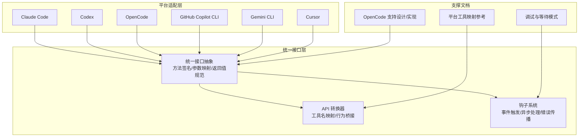
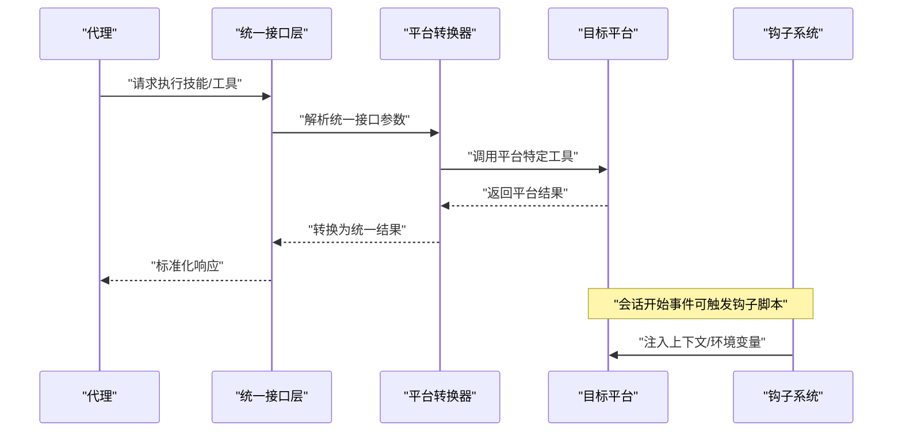
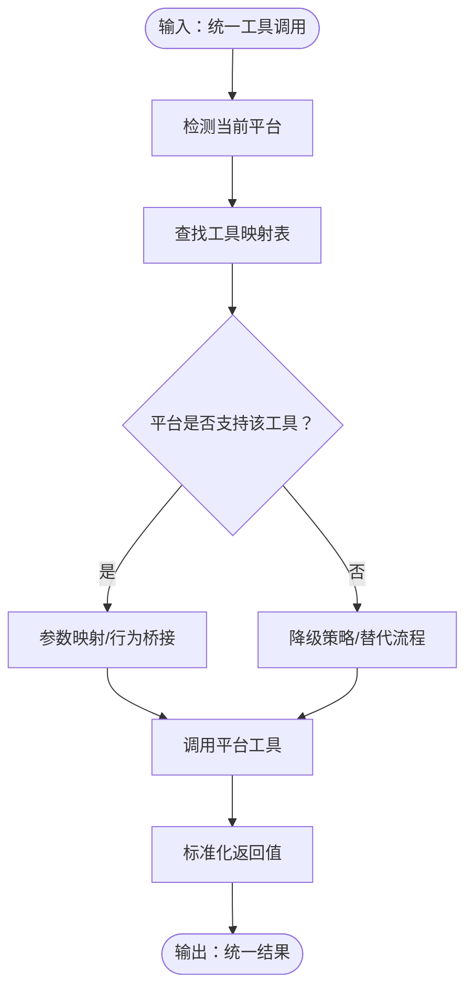
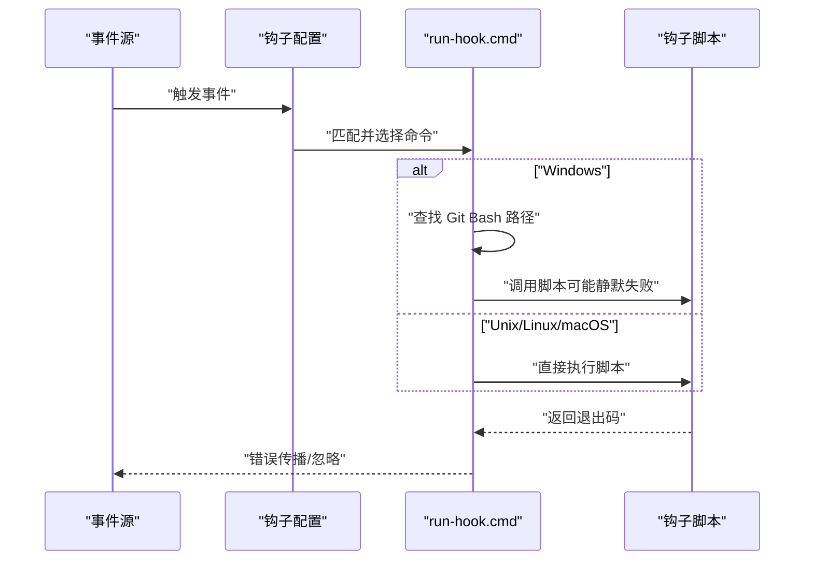
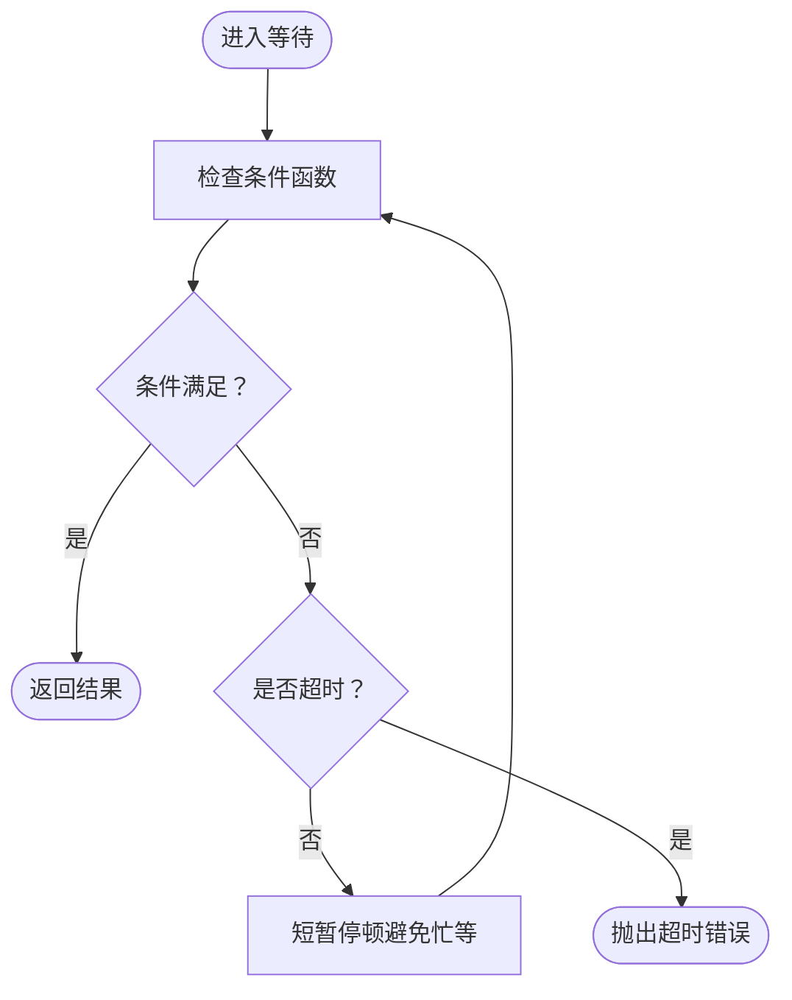
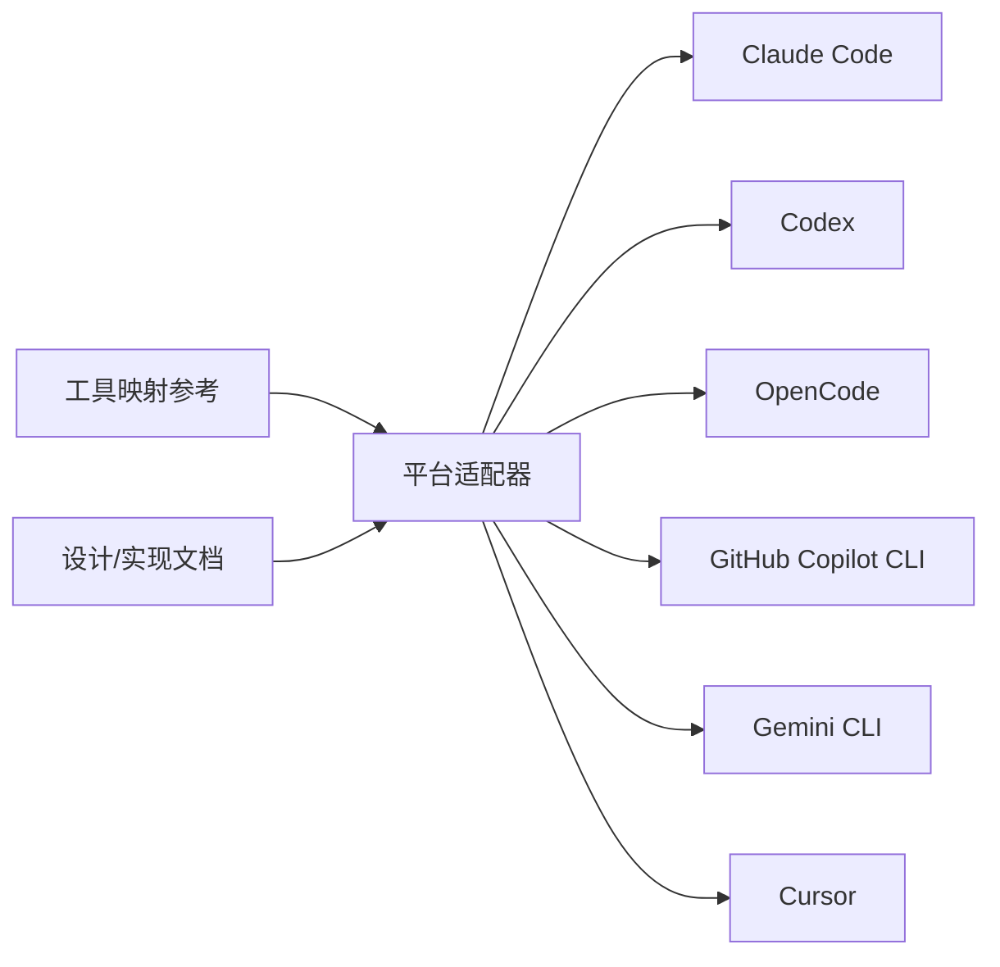

# 统一接口层

<cite>
**本文档引用的文件**
- [README.md](file://README.md)
- [hooks.json](file://hooks/hooks.json)
- [hooks-cursor.json](file://hooks/hooks-cursor.json)
- [run-hook.cmd](file://hooks/run-hook.cmd)
- [codex-tools.md](file://skills/using-superpowers/references/codex-tools.md)
- [copilot-tools.md](file://skills/using-superpowers/references/copilot-tools.md)
- [gemini-tools.md](file://skills/using-superpowers/references/gemini-tools.md)
- [2025-11-22-opencode-support-design.md](file://docs/plans/2025-11-22-opencode-support-design.md)
- [2025-11-22-opencode-support-implementation.md](file://docs/plans/2025-11-22-opencode-support-implementation.md)
- [2025-11-28-skills-improvements-from-user-feedback.md](file://docs/plans/2025-11-28-skills-improvements-from-user-feedback.md)
- [condition-based-waiting.md](file://skills/systematic-debugging/condition-based-waiting.md)
- [condition-based-waiting-example.ts](file://skills/systematic-debugging/condition-based-waiting-example.ts)
- [platform_support.md](file://.github/ISSUE_TEMPLATE/platform_support.md)
</cite>

## 目录
1. [简介](#简介)
2. [项目结构](#项目结构)
3. [核心组件](#核心组件)
4. [架构总览](#架构总览)
5. [详细组件分析](#详细组件分析)
6. [依赖关系分析](#依赖关系分析)
7. [性能考虑](#性能考虑)
8. [故障排除指南](#故障排除指南)
9. [结论](#结论)
10. [附录](#附录)

## 简介
本文件面向统一接口层（UI Layer）的技术文档，聚焦平台适配层（Platform Adapter Layer）的设计与实现，涵盖以下主题：
- 统一接口抽象：如何在不同平台（Claude Code、Codex、OpenCode、GitHub Copilot CLI、Gemini CLI、Cursor 等）上提供一致的技能调用与工具使用体验
- API 转换机制：将平台特定的工具名称与行为映射到统一的抽象接口
- 跨平台兼容性保证：通过工具映射表、钩子系统与条件等待等机制确保一致性
- 接口标准化策略：方法签名统一、参数映射与返回值规范化
- 钩子系统实现：事件触发、异步处理与错误传播
- 扩展指南、测试方法与性能优化策略

## 项目结构
该仓库围绕“技能”（skills）与“平台适配”组织内容，统一接口层的关键位置如下：
- 平台工具映射参考：位于 skills/using-superpowers/references 下，分别针对 Codex、Copilot CLI、Gemini CLI 提供工具等价映射
- 钩子系统：hooks 目录包含配置与跨平台执行脚本，支持会话开始等事件触发
- 设计与实现文档：docs/plans 中记录了 OpenCode 支持的设计与实现步骤，体现统一接口层的演进过程
- 工程实践：systematic-debugging 中的条件等待模式体现了统一接口层对异步行为的处理策略

**图表来源**
- [README.md:27-84](file://README.md#L27-L84)
- [codex-tools.md:1-101](file://skills/using-superpowers/references/codex-tools.md#L1-L101)
- [copilot-tools.md:1-53](file://skills/using-superpowers/references/copilot-tools.md#L1-L53)
- [gemini-tools.md:1-34](file://skills/using-superpowers/references/gemini-tools.md#L1-L34)
- [2025-11-22-opencode-support-design.md:254-295](file://docs/plans/2025-11-22-opencode-support-design.md#L254-L295)
- [2025-11-22-opencode-support-implementation.md:21-185](file://docs/plans/2025-11-22-opencode-support-implementation.md#L21-L185)
- [condition-based-waiting.md:48-102](file://skills/systematic-debugging/condition-based-waiting.md#L48-L102)

**章节来源**
- [README.md:27-84](file://README.md#L27-L84)
- [README.md:108-151](file://README.md#L108-L151)

## 核心组件
- 统一接口抽象
  - 定义跨平台通用的技能调用与工具操作契约，屏蔽平台差异
  - 方法签名统一：如任务派发、文件读写、命令执行、搜索与结果获取等
  - 参数映射：将平台特定参数名与语义映射到统一键值
  - 返回值规范化：统一状态码、错误格式与数据结构
- API 转换机制
  - 基于工具映射表进行动态转换，确保同一语义在不同平台表现一致
  - 对于不支持的能力（如 Gemini CLI 的子代理），提供降级策略或替代流程
- 钩子系统
  - 以事件驱动的方式注入上下文（如会话开始）
  - 支持跨平台脚本执行与错误传播控制
- 调试与等待模式
  - 条件等待用于处理异步事件，避免任意超时导致的脆弱性
  - 通过轮询与超时控制保障稳定性

**章节来源**
- [codex-tools.md:1-101](file://skills/using-superpowers/references/codex-tools.md#L1-L101)
- [copilot-tools.md:1-53](file://skills/using-superpowers/references/copilot-tools.md#L1-L53)
- [gemini-tools.md:1-34](file://skills/using-superpowers/references/gemini-tools.md#L1-L34)
- [condition-based-waiting.md:48-102](file://skills/systematic-debugging/condition-based-waiting.md#L48-L102)

## 架构总览
统一接口层通过“抽象 + 转换 + 钩子 + 调试”的组合实现跨平台一致性：

**图表来源**
- [hooks.json:1-17](file://hooks/hooks.json#L1-L17)
- [run-hook.cmd:1-47](file://hooks/run-hook.cmd#L1-L47)
- [codex-tools.md:16-25](file://skills/using-superpowers/references/codex-tools.md#L16-L25)
- [gemini-tools.md:19-22](file://skills/using-superpowers/references/gemini-tools.md#L19-L22)

## 详细组件分析

### 平台工具映射与 API 转换
- 目标
  - 将技能中使用的“统一工具名”映射到各平台的实际工具
  - 对于不支持的功能提供降级或替代方案
- 实现要点
  - 使用表格化映射（工具名、参数、行为）作为转换规则
  - 在运行时根据当前平台选择对应映射并执行转换
  - 对于多代理能力缺失的平台，采用单会话执行或批处理替代
- 典型场景
  - 子代理派发：Codex/Copilot CLI 支持命名代理；Gemini CLI 不支持，需回退到执行计划
  - 文件读写与编辑：不同平台的工具名不同，但语义一致
  - 异步 Shell 会话：仅 Copilot CLI 支持，其他平台需同步模拟

**图表来源**
- [codex-tools.md:1-101](file://skills/using-superpowers/references/codex-tools.md#L1-L101)
- [copilot-tools.md:1-53](file://skills/using-superpowers/references/copilot-tools.md#L1-L53)
- [gemini-tools.md:1-34](file://skills/using-superpowers/references/gemini-tools.md#L1-L34)

**章节来源**
- [codex-tools.md:16-25](file://skills/using-superpowers/references/codex-tools.md#L16-L25)
- [codex-tools.md:27-72](file://skills/using-superpowers/references/codex-tools.md#L27-L72)
- [copilot-tools.md:22-53](file://skills/using-superpowers/references/copilot-tools.md#L22-L53)
- [gemini-tools.md:19-22](file://skills/using-superpowers/references/gemini-tools.md#L19-L22)

### 钩子系统实现机制
- 事件触发
  - 通过配置定义事件（如会话开始）与匹配规则
  - 匹配成功后按顺序执行命令列表
- 异步处理
  - 支持同步阻塞与异步执行两种模式
  - 脚本跨平台执行：Windows 使用批处理包装，Unix 直接执行
- 错误传播
  - 当无法找到可用的 Bash 环境时，静默退出而不影响主流程
  - 可通过配置项控制是否允许失败传播

**图表来源**
- [hooks.json:1-17](file://hooks/hooks.json#L1-L17)
- [run-hook.cmd:1-47](file://hooks/run-hook.cmd#L1-L47)
- [hooks-cursor.json:1-11](file://hooks/hooks-cursor.json#L1-L11)

**章节来源**
- [hooks.json:1-17](file://hooks/hooks.json#L1-L17)
- [run-hook.cmd:1-47](file://hooks/run-hook.cmd#L1-L47)
- [hooks-cursor.json:1-11](file://hooks/hooks-cursor.json#L1-L11)

### 异步处理与错误传播（基于条件等待）
- 目标
  - 在不支持原生异步工具的平台上，通过条件等待实现可靠的状态同步
- 关键点
  - 轮询条件函数，避免过快轮询造成资源浪费
  - 明确超时时间与错误信息，便于定位问题
  - 使用领域特定的等待辅助函数（如事件计数、匹配条件）

**图表来源**
- [condition-based-waiting.md:60-80](file://skills/systematic-debugging/condition-based-waiting.md#L60-L80)

**章节来源**
- [condition-based-waiting.md:48-102](file://skills/systematic-debugging/condition-based-waiting.md#L48-L102)
- [condition-based-waiting-example.ts:134-158](file://skills/systematic-debugging/condition-based-waiting-example.ts#L134-L158)

### 接口标准化策略
- 方法签名统一
  - 为常用操作（任务派发、文件读写、命令执行、搜索）定义统一的方法名与参数结构
- 参数映射
  - 建立“统一键名 ↔ 平台键名”的映射表，自动完成参数转换
- 返回值规范化
  - 统一状态码、错误对象结构与数据字段，便于上层逻辑处理

**章节来源**
- [2025-11-28-skills-improvements-from-user-feedback.md:108-128](file://docs/plans/2025-11-28-skills-improvements-from-user-feedback.md#L108-L128)

## 依赖关系分析
- 平台依赖
  - Codex：支持多代理与命名代理，需启用相关特性
  - Copilot CLI：支持异步 Shell 会话与丰富的工具集
  - Gemini CLI：不支持子代理，需降级策略
  - Cursor/OpenCode：通过插件系统集成，遵循各自事件模型
- 文档依赖
  - 工具映射文档为 API 转换提供权威依据
  - 设计与实现文档指导统一接口层的演进路径

**图表来源**
- [codex-tools.md:1-101](file://skills/using-superpowers/references/codex-tools.md#L1-L101)
- [copilot-tools.md:1-53](file://skills/using-superpowers/references/copilot-tools.md#L1-L53)
- [gemini-tools.md:1-34](file://skills/using-superpowers/references/gemini-tools.md#L1-L34)
- [2025-11-22-opencode-support-design.md:254-295](file://docs/plans/2025-11-22-opencode-support-design.md#L254-L295)

**章节来源**
- [README.md:27-84](file://README.md#L27-L84)
- [2025-11-22-opencode-support-design.md:254-295](file://docs/plans/2025-11-22-opencode-support-design.md#L254-L295)

## 性能考虑
- 减少不必要的轮询
  - 合理设置轮询间隔，避免频繁 I/O 或进程调用
- 优先使用平台原生能力
  - 在支持的平台上优先使用异步会话、多代理等原生特性
- 缓存与复用
  - 对工具映射与平台能力探测结果进行缓存，减少重复计算
- 降级策略
  - 在不支持的平台上采用轻量级替代方案，避免阻塞主线程

## 故障排除指南
- 钩子脚本未执行
  - 检查 run-hook.cmd 是否能找到 Bash 环境
  - 确认脚本路径与权限正确
- 平台工具不可用
  - 查看工具映射表，确认目标平台是否支持该功能
  - 对于不支持的功能，采用降级策略
- 异步等待不稳定
  - 使用条件等待模式，避免固定超时
  - 为等待条件添加明确的超时与错误提示

**章节来源**
- [run-hook.cmd:18-39](file://hooks/run-hook.cmd#L18-L39)
- [condition-based-waiting.md:84-102](file://skills/systematic-debugging/condition-based-waiting.md#L84-L102)

## 结论
统一接口层通过“抽象 + 转换 + 钩子 + 调试”的体系，在多平台环境下实现了稳定的技能执行与工具调用体验。借助工具映射表与降级策略，系统能够在不同平台能力差异下保持一致性；通过钩子系统与条件等待，进一步增强了事件驱动与异步处理的可靠性。未来可继续扩展平台支持，并持续完善接口标准化与性能优化。

## 附录
- 扩展指南
  - 新增平台支持时，先在工具映射参考中补充等价映射，再在适配器中实现转换逻辑
  - 为新平台编写钩子配置与跨平台执行脚本
- 测试方法
  - 单元测试：覆盖工具映射与转换逻辑
  - 集成测试：验证多平台下的技能执行流程
  - 回归测试：确保平台变更不影响现有功能
- 平台支持请求
  - 如需新增平台，请参考平台支持模板提交 Issue

**章节来源**
- [platform_support.md:1-24](file://.github/ISSUE_TEMPLATE/platform_support.md#L1-L24)
- [README.md:161-171](file://README.md#L161-L171)