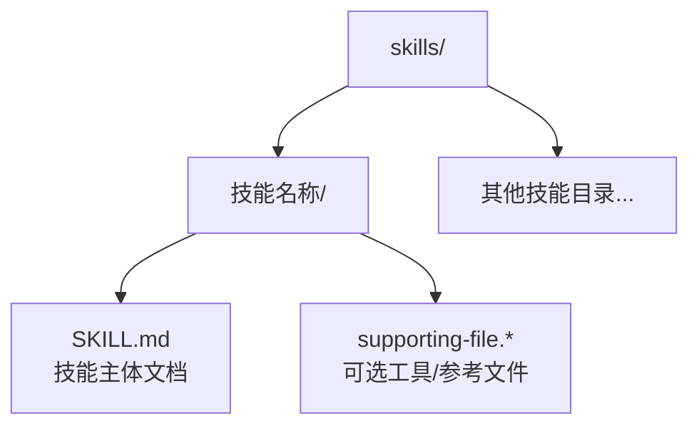
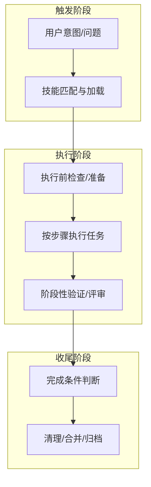
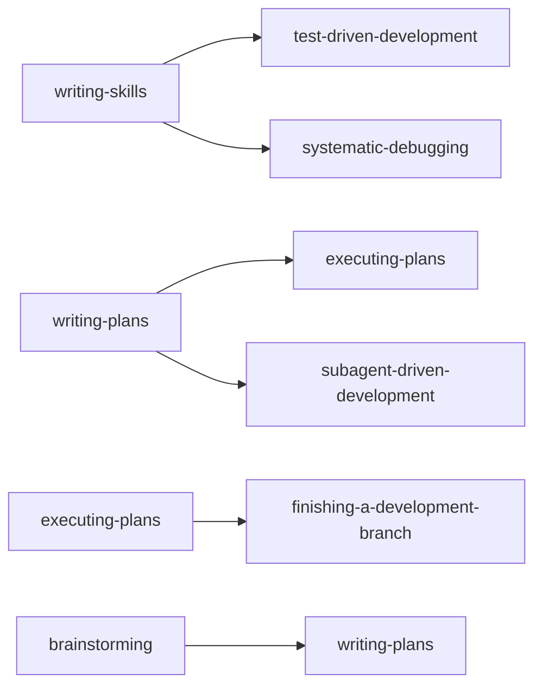

# 技能定义格式

<cite>
**本文引用的文件**
- [README.md](file://README.md)
- [skills/brainstorming/SKILL.md](file://skills/brainstorming/SKILL.md)
- [skills/dispatching-parallel-agents/SKILL.md](file://skills/dispatching-parallel-agents/SKILL.md)
- [skills/executing-plans/SKILL.md](file://skills/executing-plans/SKILL.md)
- [skills/writing-skills/SKILL.md](file://skills/writing-skills/SKILL.md)
- [skills/systematic-debugging/SKILL.md](file://skills/systematic-debugging/SKILL.md)
- [skills/test-driven-development/SKILL.md](file://skills/test-driven-development/SKILL.md)
- [skills/writing-plans/SKILL.md](file://skills/writing-plans/SKILL.md)
- [skills/systematic-debugging/root-cause-tracing.md](file://skills/systematic-debugging/root-cause-tracing.md)
- [skills/systematic-debugging/condition-based-waiting.md](file://skills/systematic-debugging/condition-based-waiting.md)
- [skills/test-driven-development/testing-anti-patterns.md](file://skills/test-driven-development/testing-anti-patterns.md)
</cite>

## 目录
1. [简介](#简介)
2. [项目结构](#项目结构)
3. [核心组件](#核心组件)
4. [架构总览](#架构总览)
5. [详细组件分析](#详细组件分析)
6. [依赖关系分析](#依赖关系分析)
7. [性能考量](#性能考量)
8. [故障排查指南](#故障排查指南)
9. [结论](#结论)
10. [附录](#附录)

## 简介
本文件系统化阐述 Superpowers 技能定义格式与规范，聚焦 SKILL.md 的标准结构、YAML 头部配置、指令优先级与技能类型分类（刚性技能 vs 灵活技能），并覆盖技能生命周期（创建、注册、触发、执行）与元数据规范（依赖声明、参数与返回值约定）。同时提供最佳实践示例，包括提示词设计原则、错误处理机制与性能优化建议，帮助作者与使用者高效构建与使用高质量技能。

## 项目结构
Superpowers 将“技能”作为可组合的工作流单元，每个技能以独立目录下的 SKILL.md 文档形式存在，配合少量工具文件与配套文档，形成“轻量、可测试、可发现”的技能生态。

图表来源
- [skills/brainstorming/SKILL.md:1-165](file://skills/brainstorming/SKILL.md#L1-L165)
- [skills/writing-skills/SKILL.md:72-92](file://skills/writing-skills/SKILL.md#L72-L92)

章节来源
- [README.md:126-151](file://README.md#L126-L151)
- [skills/brainstorming/SKILL.md:1-165](file://skills/brainstorming/SKILL.md#L1-L165)
- [skills/writing-skills/SKILL.md:72-92](file://skills/writing-skills/SKILL.md#L72-L92)

## 核心组件
- YAML 头部：name、description 为必需字段；描述应聚焦“何时触发”，而非“做什么”。长度与命名有约束。
- 结构化正文：Overview、When to Use、Implementation、Common Mistakes、Quick Reference 等模块化组织。
- 决策图与流程图：在必要时用 Graphviz dot 流程图表达非显而易见的决策分支或循环。
- 元数据与依赖：通过“必需子技能/背景技能”等声明式方式标注依赖关系。
- 执行与验证：强调“先测试后实现”的 TDD 原则，以及压力场景下的鲁棒性校验。

章节来源
- [skills/writing-skills/SKILL.md:95-137](file://skills/writing-skills/SKILL.md#L95-L137)
- [skills/writing-skills/SKILL.md:290-317](file://skills/writing-skills/SKILL.md#L290-L317)
- [skills/writing-skills/SKILL.md:278-290](file://skills/writing-skills/SKILL.md#L278-L290)

## 架构总览
Superpowers 技能体系遵循“触发-执行-验证-收尾”的闭环流程。技能之间通过“必需子技能/背景技能”建立依赖，确保工作流的强制性顺序与一致性。

图表来源
- [skills/executing-plans/SKILL.md:16-71](file://skills/executing-plans/SKILL.md#L16-L71)
- [skills/writing-plans/SKILL.md:134-153](file://skills/writing-plans/SKILL.md#L134-L153)

## 详细组件分析

### YAML 头部配置规范
- 必填字段
  - name：仅允许字母、数字与连字符，用于技能唯一标识与搜索。
  - description：第三人称，聚焦“触发条件与症状”，不总结流程。
- 长度与风格
  - 总长度限制，建议尽量简洁。
  - 使用“Use when...”开头，明确触发语境。
- 示例路径
  - 参考：[skills/brainstorming/SKILL.md:1-4](file://skills/brainstorming/SKILL.md#L1-L4)
  - 参考：[skills/writing-skills/SKILL.md:95-104](file://skills/writing-skills/SKILL.md#L95-L104)

章节来源
- [skills/brainstorming/SKILL.md:1-4](file://skills/brainstorming/SKILL.md#L1-L4)
- [skills/writing-skills/SKILL.md:95-104](file://skills/writing-skills/SKILL.md#L95-L104)

### 指令优先级规则
- 触发优先级
  - 技能描述决定是否加载与执行，需避免在描述中总结流程，防止 Claude 跳过全文直接按描述行动。
  - 描述应只包含触发条件与症状，保持技术无关性（除非技能本身是技术特定）。
- 执行优先级
  - 刚性技能（如 TDD、系统性调试）要求严格顺序与强制性步骤，违反即“删除代码，重新开始”。
  - 灵活技能（如头脑风暴、写计划）允许在框架内迭代与回退，但必须遵循其核心流程与检查点。

章节来源
- [skills/writing-skills/SKILL.md:140-198](file://skills/writing-skills/SKILL.md#L140-L198)
- [skills/test-driven-development/SKILL.md:31-46](file://skills/test-driven-development/SKILL.md#L31-L46)
- [skills/systematic-debugging/SKILL.md:16-23](file://skills/systematic-debugging/SKILL.md#L16-L23)

### 技能类型分类：刚性技能 vs 灵活技能
- 刚性技能
  - 特征：严格的流程、不可跳过的步骤、明确的“红灯/停止”信号。
  - 代表：TDD、系统性调试、验证前完成。
  - 违反后果：立即“删除代码，重新开始”，直至满足所有约束。
- 灵活技能
  - 特征：允许探索、迭代与回退，但需遵循核心流程与检查点。
  - 代表：头脑风暴、写计划、并行派发代理。
  - 关键：在每个阶段设置“批准/自检/评审”节点，确保输出质量。

章节来源
- [skills/test-driven-development/SKILL.md:31-46](file://skills/test-driven-development/SKILL.md#L31-L46)
- [skills/systematic-debugging/SKILL.md:16-23](file://skills/systematic-debugging/SKILL.md#L16-L23)
- [skills/brainstorming/SKILL.md:138-146](file://skills/brainstorming/SKILL.md#L138-L146)
- [skills/writing-plans/SKILL.md:36-44](file://skills/writing-plans/SKILL.md#L36-L44)

### 技能生命周期管理
- 创建
  - 使用“写作技能”技能进行 TDD 式创作：先写压力场景（基线）→ 写最小技能（绿灯）→ 重构漏洞（反复迭代）。
  - 必须先运行未加载技能的基线，记录代理如何规避规则，再针对性补强。
- 注册
  - 将 SKILL.md 放入 skills/<技能名>/ 目录，确保 YAML 头部正确、命名与关键词符合搜索优化。
- 触发
  - 平台根据技能描述与上下文自动匹配并加载技能；描述越精准，命中率越高。
- 执行
  - 刚性技能：严格按步骤执行，出现“红灯”即刻停止并重来。
  - 灵活技能：在流程图/检查点间迭代，确保每一步都有明确产出与验证。
- 收尾
  - 完成条件达成后，进入清理、合并、归档或转交下一技能。

章节来源
- [skills/writing-skills/SKILL.md:374-394](file://skills/writing-skills/SKILL.md#L374-L394)
- [skills/writing-skills/SKILL.md:533-561](file://skills/writing-skills/SKILL.md#L533-L561)
- [skills/executing-plans/SKILL.md:16-71](file://skills/executing-plans/SKILL.md#L16-L71)

### 元数据规范
- 依赖关系声明
  - 使用“必需子技能/背景技能”声明式标注，例如：
    - “REQUIRED SUB-SKILL: 使用 superpowers:subagent-driven-development”
    - “REQUIRED BACKGROUND: 你必须理解 superpowers:systematic-debugging”
  - 避免使用强制加载的 @ 语法，以免消耗大量上下文。
- 参数与返回值
  - 对于需要外部输入的技能，应在“Implementation”或“Quick Reference”中明确列出：
    - 输入：文件路径、命令、配置项、触发条件
    - 输出：中间产物（如设计文档、计划文件）、最终产物（如提交、PR）
  - 返回值格式建议采用“清单+步骤”的结构化输出，便于自动化执行与人工复核。
- 关键字与搜索优化
  - 在描述与正文多处嵌入关键词（错误信息、症状、工具名），提升检索命中率。
  - 使用“Claude 搜索优化（CSO）”原则：描述只写触发条件，正文写要点与流程。

章节来源
- [skills/writing-skills/SKILL.md:278-290](file://skills/writing-skills/SKILL.md#L278-L290)
- [skills/writing-skills/SKILL.md:140-198](file://skills/writing-skills/SKILL.md#L140-L198)
- [skills/writing-plans/SKILL.md:134-153](file://skills/writing-plans/SKILL.md#L134-L153)

### 最佳实践示例

#### 提示词设计原则
- 描述聚焦触发条件，不总结流程
  - 反例：描述中总结了“两阶段评审”流程
  - 正例：仅描述“当前会话中存在独立任务”等触发条件
- 使用“小而精”的流程图
  - 仅在非显而易见的决策点使用流程图，避免将参考材料、代码示例、线性步骤用流程图表达
- 关键词覆盖
  - 错误消息、症状、工具名、文件类型等高频词要自然出现在描述与正文中

章节来源
- [skills/writing-skills/SKILL.md:140-198](file://skills/writing-skills/SKILL.md#L140-L198)
- [skills/writing-skills/SKILL.md:290-317](file://skills/writing-skills/SKILL.md#L290-L317)

#### 错误处理机制
- 刚性技能的“红灯”信号
  - 明确列出“停止并重来”的触发条件，如“代码先于测试实现”“测试通过后才实现”等
  - 一旦触发，立即删除相关代码并从头开始
- 灵活技能的“回退点”
  - 在流程图中标注“修订/回退”分支，确保每次迭代都有明确的检查点
- 压力场景测试
  - 组合时间压力、沉没成本、权威压力等，验证技能在高压下仍能遵守规则

章节来源
- [skills/test-driven-development/SKILL.md:272-289](file://skills/test-driven-development/SKILL.md#L272-L289)
- [skills/brainstorming/SKILL.md:138-146](file://skills/brainstorming/SKILL.md#L138-L146)
- [skills/writing-skills/SKILL.md:444-458](file://skills/writing-skills/SKILL.md#L444-L458)

#### 性能优化建议
- 文档体积控制
  - 频繁加载的技能建议 <200 字，其他技能 <500 字；将细节移至工具文件或交叉引用
- 图表渲染
  - 使用 render-graphs.js 将流程图导出为 SVG，便于人类阅读与分享
- 令牌效率
  - 避免重复内容，减少冗余示例，压缩语言种类，突出一个代表性示例

章节来源
- [skills/writing-skills/SKILL.md:213-277](file://skills/writing-skills/SKILL.md#L213-L277)
- [skills/writing-skills/SKILL.md:318-323](file://skills/writing-skills/SKILL.md#L318-L323)

## 依赖关系分析
技能之间的依赖通过“必需子技能/背景技能”声明，形成强制性执行链路，确保工作流的完整性与一致性。

图表来源
- [skills/writing-skills/SKILL.md:283-287](file://skills/writing-skills/SKILL.md#L283-L287)
- [skills/writing-plans/SKILL.md:134-153](file://skills/writing-plans/SKILL.md#L134-L153)
- [skills/executing-plans/SKILL.md:65-71](file://skills/executing-plans/SKILL.md#L65-L71)
- [README.md:108-125](file://README.md#L108-L125)

章节来源
- [skills/writing-skills/SKILL.md:283-287](file://skills/writing-skills/SKILL.md#L283-L287)
- [skills/writing-plans/SKILL.md:134-153](file://skills/writing-plans/SKILL.md#L134-L153)
- [skills/executing-plans/SKILL.md:65-71](file://skills/executing-plans/SKILL.md#L65-L71)
- [README.md:108-125](file://README.md#L108-L125)

## 性能考量
- 上下文占用
  - 避免使用强制加载的 @ 语法，防止一次性加载过多内容导致上下文膨胀
- 文档体积
  - 控制 SKILL.md 字数，将复杂细节下沉到工具文件或参考文档
- 流程图渲染
  - 使用 render-graphs.js 将流程图导出为 SVG，便于展示与传播

章节来源
- [skills/writing-skills/SKILL.md:288-290](file://skills/writing-skills/SKILL.md#L288-L290)
- [skills/writing-skills/SKILL.md:213-277](file://skills/writing-skills/SKILL.md#L213-L277)
- [skills/writing-skills/SKILL.md:318-323](file://skills/writing-skills/SKILL.md#L318-L323)

## 故障排查指南
- 常见违规与修复
  - 测试后实现：删除代码，重新按 TDD 循环执行
  - 测试仅覆盖 mock 行为：改测真实行为或取消 mock
  - 生产类中添加测试专用方法：移至测试工具模块
  - 不完整 mock：补齐真实 API 的全部字段
- 系统性调试中的“红灯”
  - 出现“快速修复”“多个变更同时进行”等念头时，立即回到根因调查阶段
- 条件等待与超时
  - 避免任意超时；若确需超时，必须注明原因与依据

章节来源
- [skills/test-driven-development/testing-anti-patterns.md:13-19](file://skills/test-driven-development/testing-anti-patterns.md#L13-L19)
- [skills/test-driven-development/testing-anti-patterns.md:251-262](file://skills/test-driven-development/testing-anti-patterns.md#L251-L262)
- [skills/systematic-debugging/SKILL.md:215-233](file://skills/systematic-debugging/SKILL.md#L215-L233)
- [skills/systematic-debugging/condition-based-waiting.md:95-108](file://skills/systematic-debugging/condition-based-waiting.md#L95-L108)

## 结论
Superpowers 的技能定义格式以“触发条件明确、流程可验证、依赖可声明、文档可发现”为核心，辅以 TDD 与系统性调试的工程化方法论，确保技能在不同平台与场景下稳定可用。遵循本文规范，可显著提升技能的可维护性、可测试性与可协作性。

## 附录

### 技能类型与适用场景速查
- 刚性技能
  - TDD：任何功能/缺陷修复前，必须先写失败测试
  - 系统性调试：遇到任何 bug/失败，先根因调查再修复
  - 验证前完成：确认问题已解决且无回归
- 灵活技能
  - 头脑风暴：在实现前进行设计与验证
  - 写计划：将需求拆解为可执行的任务清单
  - 并行派发代理：独立问题并发调查与修复

章节来源
- [skills/test-driven-development/SKILL.md:16-30](file://skills/test-driven-development/SKILL.md#L16-L30)
- [skills/systematic-debugging/SKILL.md:24-45](file://skills/systematic-debugging/SKILL.md#L24-L45)
- [skills/brainstorming/SKILL.md:6-16](file://skills/brainstorming/SKILL.md#L6-L16)
- [skills/writing-plans/SKILL.md:8-14](file://skills/writing-plans/SKILL.md#L8-L14)
- [skills/dispatching-parallel-agents/SKILL.md:8-16](file://skills/dispatching-parallel-agents/SKILL.md#L8-L16)