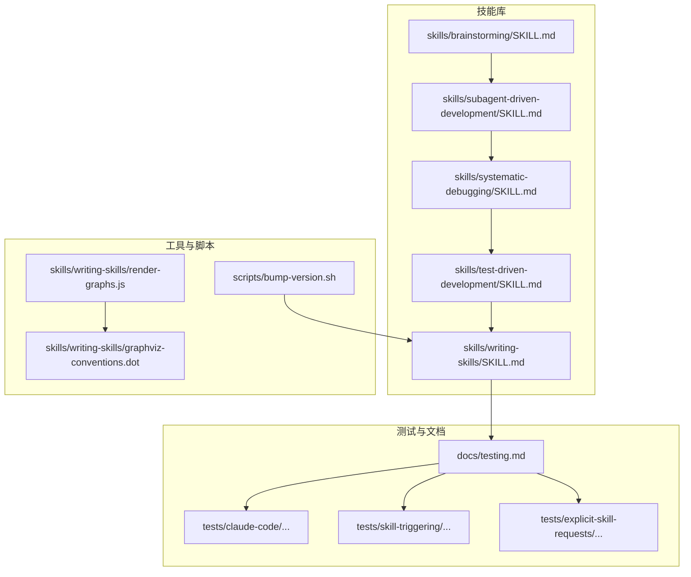
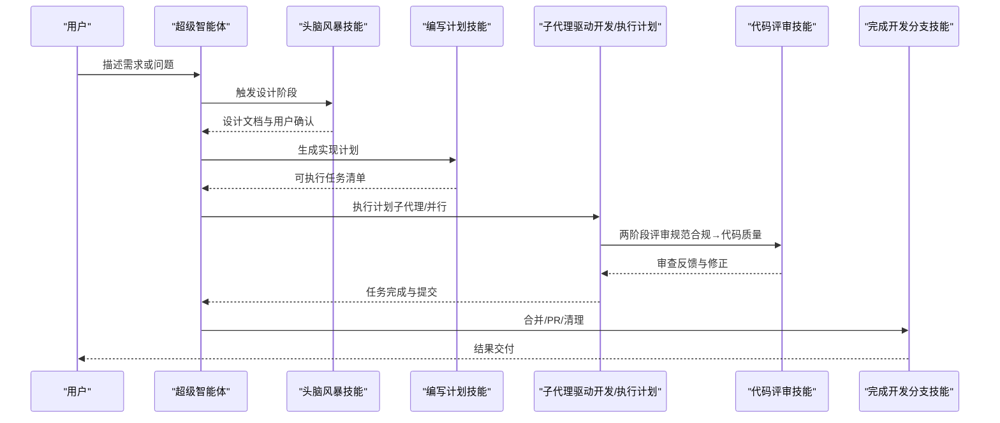
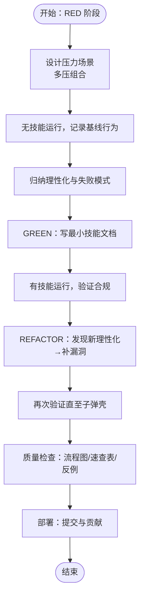
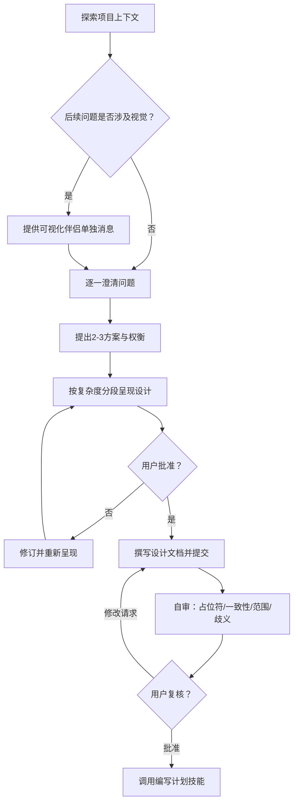
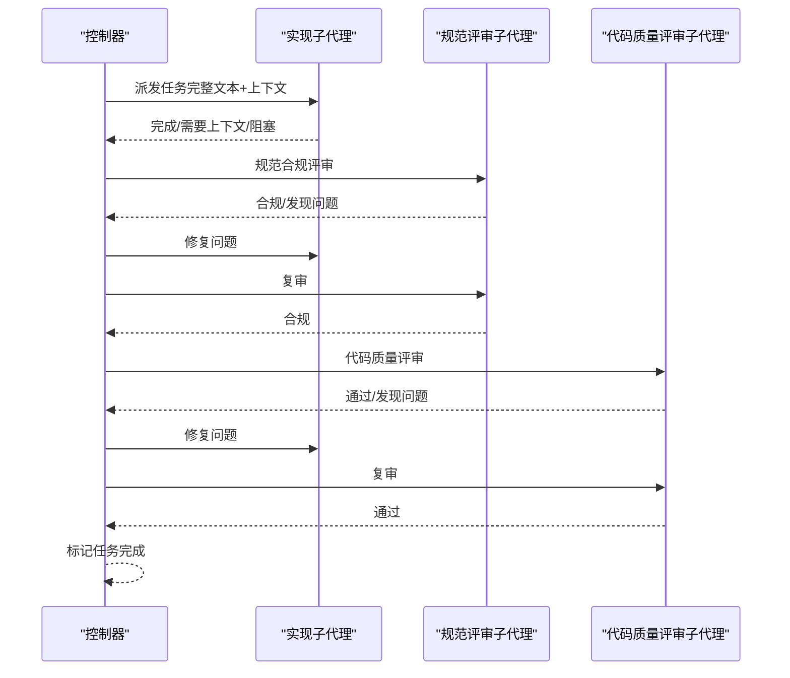
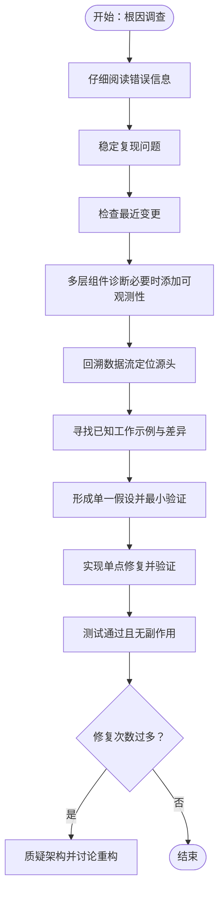
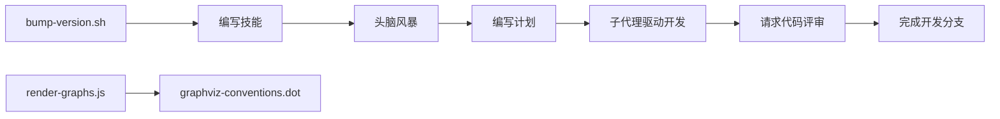

# 技能开发指南

<cite>
**本文引用的文件**
- [README.md](file://README.md)
- [docs/testing.md](file://docs/testing.md)
- [skills/writing-skills/SKILL.md](file://skills/writing-skills/SKILL.md)
- [skills/writing-skills/anthropic-best-practices.md](file://skills/writing-skills/anthropic-best-practices.md)
- [skills/writing-skills/render-graphs.js](file://skills/writing-skills/render-graphs.js)
- [skills/writing-skills/graphviz-conventions.dot](file://skills/writing-skills/graphviz-conventions.dot)
- [skills/brainstorming/SKILL.md](file://skills/brainstorming/SKILL.md)
- [skills/subagent-driven-development/SKILL.md](file://skills/subagent-driven-development/SKILL.md)
- [skills/systematic-debugging/SKILL.md](file://skills/systematic-debugging/SKILL.md)
- [skills/test-driven-development/SKILL.md](file://skills/test-driven-development/SKILL.md)
- [scripts/bump-version.sh](file://scripts/bump-version.sh)
- [CHANGELOG.md](file://CHANGELOG.md)
- [RELEASE-NOTES.md](file://RELEASE-NOTES.md)
</cite>

## 目录
1. [简介](#简介)
2. [项目结构](#项目结构)
3. [核心组件](#核心组件)
4. [架构总览](#架构总览)
5. [详细组件分析](#详细组件分析)
6. [依赖关系分析](#依赖关系分析)
7. [性能考量](#性能考量)
8. [故障排查指南](#故障排查指南)
9. [结论](#结论)
10. [附录](#附录)

## 简介
本指南面向 Superpowers 技能开发者，系统阐述从需求分析到实现、测试与发布的全流程方法论，覆盖技能质量标准、测试策略、工具链与辅助资源，并给出版本管理与发布流程建议。目标是帮助你在不同平台（Claude Code、Cursor、Codex、OpenCode、Gemini CLI）上高效、可重复地构建高质量技能。

## 项目结构
Superpowers 以“可组合技能”为核心，围绕“设计-计划-执行-收尾”的闭环工作流组织技能集合。技能以独立目录形式存在，每个技能包含一个 SKILL.md 主文档及按需拆分的支持文件。测试体系覆盖单元、集成与端到端场景，文档与脚本共同支撑质量保障与发布流程。

图表来源
- [README.md:126-151](file://README.md#L126-L151)
- [docs/testing.md:9-18](file://docs/testing.md#L9-L18)
- [skills/writing-skills/SKILL.md:72-92](file://skills/writing-skills/SKILL.md#L72-L92)
- [skills/writing-skills/render-graphs.js:1-169](file://skills/writing-skills/render-graphs.js#L1-L169)
- [skills/writing-skills/graphviz-conventions.dot:1-172](file://skills/writing-skills/graphviz-conventions.dot#L1-L172)
- [scripts/bump-version.sh:1-221](file://scripts/bump-version.sh#L1-L221)

章节来源
- [README.md:126-151](file://README.md#L126-L151)
- [docs/testing.md:9-18](file://docs/testing.md#L9-L18)

## 核心组件
- 设计与触发：通过“头脑风暴”技能进行需求澄清与设计产出，确保在实现前完成设计评审与用户确认。
- 计划与执行：使用“编写计划”生成可执行任务清单；在具备子代理能力的平台上采用“子代理驱动开发”，否则采用“执行计划”。
- 质量与调试：以“系统化调试”定位根因，“测试驱动开发”保证实现质量。
- 技能创作：以“编写技能”为方法论，将过程文档化并以 TDD 方式验证。

章节来源
- [skills/brainstorming/SKILL.md:1-165](file://skills/brainstorming/SKILL.md#L1-L165)
- [skills/subagent-driven-development/SKILL.md:1-278](file://skills/subagent-driven-development/SKILL.md#L1-L278)
- [skills/systematic-debugging/SKILL.md:1-297](file://skills/systematic-debugging/SKILL.md#L1-L297)
- [skills/test-driven-development/SKILL.md:1-372](file://skills/test-driven-development/SKILL.md#L1-L372)
- [skills/writing-skills/SKILL.md:30-46](file://skills/writing-skills/SKILL.md#L30-L46)

## 架构总览
Superpowers 的技能系统遵循“描述即触发”的原则：技能的 description 字段仅用于触发条件，正文提供实现细节。技能之间通过“必需/推荐”引用形成工作流闭环，测试用例通过会话转录解析验证行为一致性。

图表来源
- [skills/brainstorming/SKILL.md:34-66](file://skills/brainstorming/SKILL.md#L34-L66)
- [skills/subagent-driven-development/SKILL.md:40-84](file://skills/subagent-driven-development/SKILL.md#L40-L84)
- [README.md:108-125](file://README.md#L108-L125)

## 详细组件分析

### 组件一：编写技能（技能创作方法论）
- 目标：将过程文档化并以 TDD 验证，确保技能在真实压力下仍有效。
- 关键点：
  - 先写“失败测试”（baseline），再写技能内容，最后重构补漏洞。
  - description 仅描述触发条件，不总结流程；关键词覆盖搜索；命名采用动名词；内容压缩与交叉引用。
  - 不同类型技能采用差异化测试：纪律型（规则）、技术型（应用）、模式型（识别）、参考型（检索）。
  - 建立“理性化表格”与“红灯清单”，主动堵住常见规避路径。
- 输出：最小可用技能文档，配套测试与图示。

图表来源
- [skills/writing-skills/SKILL.md:533-561](file://skills/writing-skills/SKILL.md#L533-L561)
- [skills/writing-skills/SKILL.md:395-443](file://skills/writing-skills/SKILL.md#L395-L443)

章节来源
- [skills/writing-skills/SKILL.md:30-46](file://skills/writing-skills/SKILL.md#L30-L46)
- [skills/writing-skills/SKILL.md:395-443](file://skills/writing-skills/SKILL.md#L395-L443)
- [skills/writing-skills/SKILL.md:459-524](file://skills/writing-skills/SKILL.md#L459-L524)
- [skills/writing-skills/SKILL.md:596-634](file://skills/writing-skills/SKILL.md#L596-L634)

### 组件二：头脑风暴（需求分析与设计）
- 目标：在实现前完成需求澄清、方案对比与设计产出，避免“简单项目”陷阱。
- 关键点：
  - 硬性门禁：未获得用户对设计的批准前不得进入实现。
  - 流程图明确“探索上下文→视觉问题→澄清问题→提出方案→呈现设计→撰写文档→自审→用户复核→转入计划”。
  - 设计应模块化、边界清晰、可独立测试与演进。
- 输出：经用户确认的设计文档，保存至统一位置。

图表来源
- [skills/brainstorming/SKILL.md:34-66](file://skills/brainstorming/SKILL.md#L34-L66)
- [skills/brainstorming/SKILL.md:107-137](file://skills/brainstorming/SKILL.md#L107-L137)

章节来源
- [skills/brainstorming/SKILL.md:12-14](file://skills/brainstorming/SKILL.md#L12-L14)
- [skills/brainstorming/SKILL.md:20-32](file://skills/brainstorming/SKILL.md#L20-L32)
- [skills/brainstorming/SKILL.md:138-165](file://skills/brainstorming/SKILL.md#L138-L165)

### 组件三：子代理驱动开发（执行与评审）
- 目标：以“每任务一个子代理 + 两阶段评审”实现高质快速迭代。
- 关键点：
  - 每个任务派发全新子代理，提供完整任务文本与上下文，避免上下文污染。
  - 两阶段评审顺序固定：先“规范合规”，后“代码质量”；评审循环确保修复有效。
  - 模型选择：机械实现用廉价模型，集成判断用标准模型，架构与评审用最强模型。
  - 实施状态处理：DONE/DONE_WITH_CONCERNS/NEEDS_CONTEXT/BLOCKED 分类处置。
- 输出：任务完成、评审通过、最终审查与分支收尾。

图表来源
- [skills/subagent-driven-development/SKILL.md:42-84](file://skills/subagent-driven-development/SKILL.md#L42-L84)
- [skills/subagent-driven-development/SKILL.md:102-118](file://skills/subagent-driven-development/SKILL.md#L102-L118)
- [skills/subagent-driven-development/SKILL.md:265-278](file://skills/subagent-driven-development/SKILL.md#L265-L278)

章节来源
- [skills/subagent-driven-development/SKILL.md:87-101](file://skills/subagent-driven-development/SKILL.md#L87-L101)
- [skills/subagent-driven-development/SKILL.md:234-249](file://skills/subagent-driven-development/SKILL.md#L234-L249)

### 组件四：系统化调试（根因定位与修复）
- 目标：在任何技术问题出现时，先定位根因再提出修复，避免症状式修复。
- 关键点：
  - 四阶段：根因调查→模式分析→假设与最小验证→实现与验证。
  - 若多次修复无效，应质疑架构而非继续修补。
  - 强制“先写失败测试，再修复”的 TDD 流程。
- 输出：可自动化的失败测试用例与修复方案。

图表来源
- [skills/systematic-debugging/SKILL.md:50-121](file://skills/systematic-debugging/SKILL.md#L50-L121)
- [skills/systematic-debugging/SKILL.md:145-197](file://skills/systematic-debugging/SKILL.md#L145-L197)

章节来源
- [skills/systematic-debugging/SKILL.md:16-22](file://skills/systematic-debugging/SKILL.md#L16-L22)
- [skills/systematic-debugging/SKILL.md:215-232](file://skills/systematic-debugging/SKILL.md#L215-L232)

### 组件五：测试驱动开发（实现质量保障）
- 目标：在实现前写失败测试，再写最小实现，最后重构优化。
- 关键点：
  - “先失败，再通过，再重构”的循环不可跳过。
  - 严禁“测试后实现”“删除代码后重写”等理性化。
  - 用“红灯清单”与“理性化表格”约束行为。
- 输出：通过的自动化测试与可维护的实现。

章节来源
- [skills/test-driven-development/SKILL.md:31-46](file://skills/test-driven-development/SKILL.md#L31-L46)
- [skills/test-driven-development/SKILL.md:113-129](file://skills/test-driven-development/SKILL.md#L113-L129)
- [skills/test-driven-development/SKILL.md:272-288](file://skills/test-driven-development/SKILL.md#L272-L288)

## 依赖关系分析
- 技能间依赖：设计（头脑风暴）→ 计划（编写计划）→ 执行（子代理驱动开发/执行计划）→ 评审（请求代码评审）→ 收尾（完成开发分支）。
- 工具与脚本：Graphviz 渲染工具用于将 DOT 图转换为 SVG；版本提升脚本用于跨文件版本同步与审计。
- 平台适配：不同平台（Claude Code、Cursor、Codex、OpenCode、Gemini CLI）通过各自的会话钩子与工具映射实现一致体验。

图表来源
- [README.md:108-125](file://README.md#L108-L125)
- [skills/writing-skills/render-graphs.js:1-169](file://skills/writing-skills/render-graphs.js#L1-L169)
- [skills/writing-skills/graphviz-conventions.dot:1-172](file://skills/writing-skills/graphviz-conventions.dot#L1-L172)
- [scripts/bump-version.sh:1-221](file://scripts/bump-version.sh#L1-L221)

章节来源
- [README.md:108-125](file://README.md#L108-L125)
- [skills/writing-skills/render-graphs.js:1-169](file://skills/writing-skills/render-graphs.js#L1-L169)
- [scripts/bump-version.sh:1-221](file://scripts/bump-version.sh#L1-L221)

## 性能考量
- 上下文窗口与加载成本：技能描述与正文均计入上下文，应保持简洁；常用技能控制在 200 字以内。
- 子代理成本：两阶段评审与多轮次复审会增加 token 使用，应合理选择模型能力与任务粒度。
- 会话转录分析：通过 token 使用分析工具评估成本与效率，指导模型选择与任务拆分。

章节来源
- [docs/testing.md:137-177](file://docs/testing.md#L137-L177)
- [skills/subagent-driven-development/SKILL.md:228-233](file://skills/subagent-driven-development/SKILL.md#L228-L233)

## 故障排查指南
- 技能未加载：确认在插件目录内运行、启用本地开发市场、技能存在于 skills/ 目录。
- 权限问题：使用权限绕过标志与目录授权；检查临时目录权限。
- 超时：延长超时时间、检查技能逻辑中的死循环、降低子代理任务复杂度。
- 会话文件缺失：检查项目目录编码、查找最近会话、确认测试确实执行。
- Graphviz 渲染失败：安装 graphviz（dot），确保 dot 可用。

章节来源
- [docs/testing.md:178-215](file://docs/testing.md#L178-L215)
- [skills/writing-skills/render-graphs.js:110-118](file://skills/writing-skills/render-graphs.js#L110-L118)

## 结论
Superpowers 的技能开发以“编写技能”为方法论，结合“头脑风暴”“编写计划”“子代理驱动开发”“系统化调试”“测试驱动开发”等核心技能，形成从需求到实现再到质量保障的闭环。通过严格的测试与图示化流程、工具链支持与版本管理，可确保技能在多平台环境下稳定、可重复地交付价值。

## 附录

### A. 开发最佳实践清单
- 提示词设计原则
  - description 仅触发条件，不总结流程；关键词覆盖搜索；命名采用动名词；内容压缩与交叉引用。
- 参数传递模式
  - 子代理任务：提供完整任务文本与上下文，避免让子代理读取文件；实施状态分类处理。
- 结果处理策略
  - 两阶段评审顺序固定；评审循环确保修复有效；最终审查与分支收尾。
- 质量标准
  - 无技能前不写实现；测试先行；红绿重构循环；红灯清单与理性化表格。

章节来源
- [skills/writing-skills/SKILL.md:140-198](file://skills/writing-skills/SKILL.md#L140-L198)
- [skills/subagent-driven-development/SKILL.md:102-118](file://skills/subagent-driven-development/SKILL.md#L102-L118)
- [skills/test-driven-development/SKILL.md:31-46](file://skills/test-driven-development/SKILL.md#L31-L46)

### B. 测试方法与工具
- 单元测试：针对技能行为的学术问题与压力场景，验证规则遵守与技巧应用。
- 集成测试：使用 Claude Code 头模式运行真实会话，解析 JSONL 转录验证技能调用、子代理派发、任务跟踪、文件创建、测试通过与提交历史。
- 性能验证：使用 token 分析工具评估各子代理成本与总体开销。
- 自动化脚本：Graphviz 渲染 DOT 到 SVG；版本提升与审计。

章节来源
- [docs/testing.md:20-33](file://docs/testing.md#L20-L33)
- [docs/testing.md:137-177](file://docs/testing.md#L137-L177)
- [skills/writing-skills/render-graphs.js:1-169](file://skills/writing-skills/render-graphs.js#L1-L169)
- [scripts/bump-version.sh:1-221](file://scripts/bump-version.sh#L1-L221)

### C. 版本管理与发布流程
- 版本提升：使用版本提升脚本批量更新声明文件中的版本号，检测漂移并审计仓库中未声明的版本字符串。
- 发布说明：关注重大变更、兼容性影响与平台适配改进，确保迁移路径清晰。
- 变更日志：记录修复、变更与回归测试结果，便于追溯与回归验证。

章节来源
- [scripts/bump-version.sh:54-92](file://scripts/bump-version.sh#L54-L92)
- [scripts/bump-version.sh:94-164](file://scripts/bump-version.sh#L94-L164)
- [CHANGELOG.md:1-14](file://CHANGELOG.md#L1-L14)
- [RELEASE-NOTES.md:1-800](file://RELEASE-NOTES.md#L1-L800)