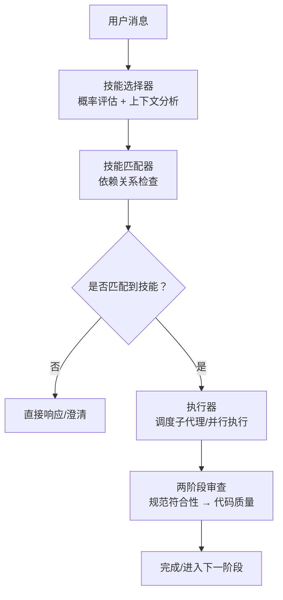
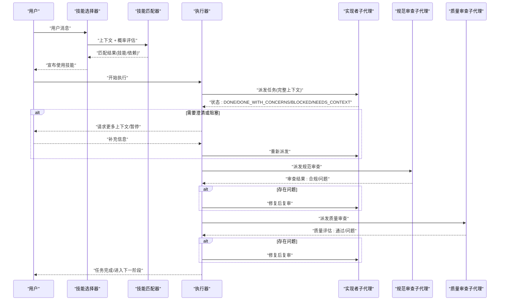
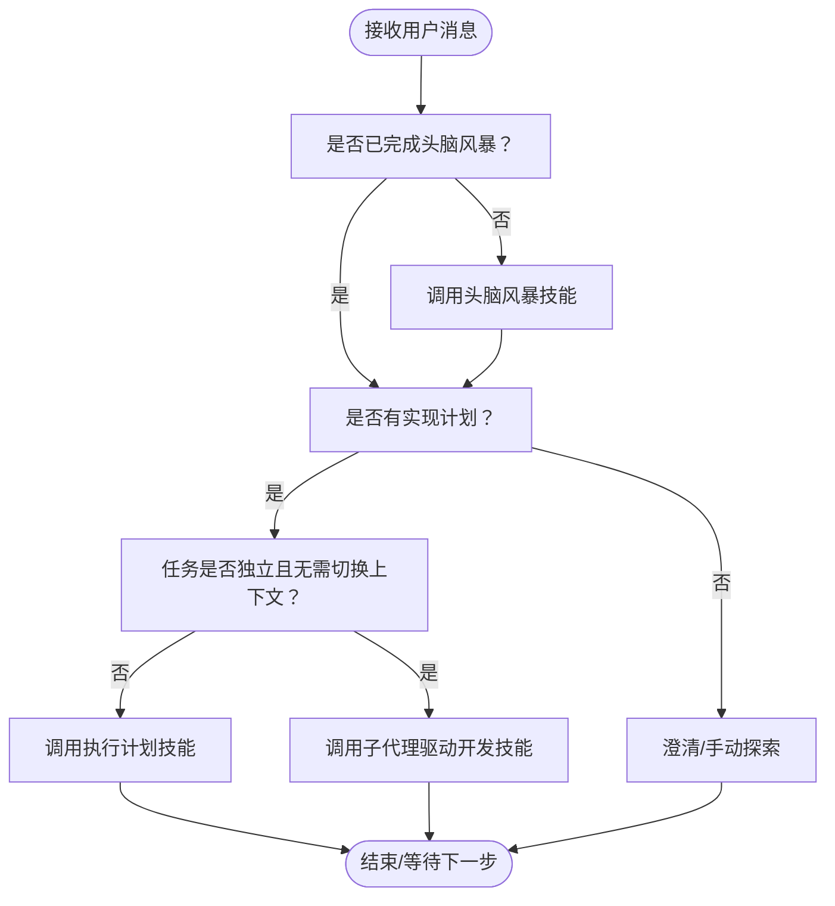
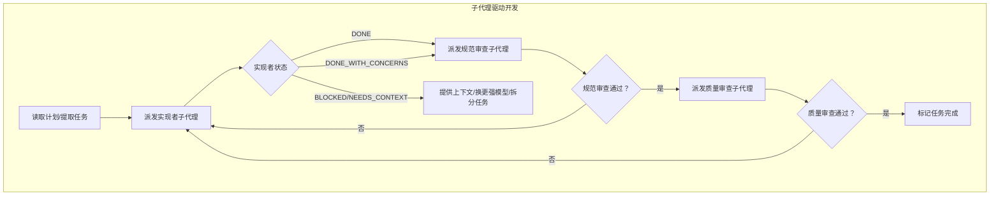
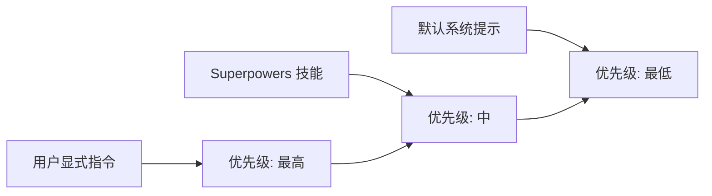
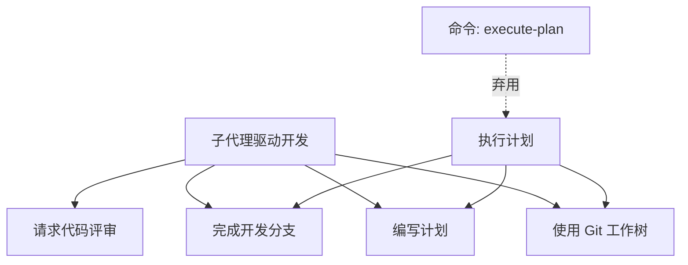

# 技能执行算法

<cite>
**本文引用的文件**
- [README.md](file://README.md)
- [using-superpowers/SKILL.md](file://skills/using-superpowers/SKILL.md)
- [subagent-driven-development/SKILL.md](file://skills/subagent-driven-development/SKILL.md)
- [executing-plans/SKILL.md](file://skills/executing-plans/SKILL.md)
- [dispatching-parallel-agents/SKILL.md](file://skills/dispatching-parallel-agents/SKILL.md)
- [subagent-driven-development/implementer-prompt.md](file://skills/subagent-driven-development/implementer-prompt.md)
- [subagent-driven-development/spec-reviewer-prompt.md](file://skills/subagent-driven-development/spec-reviewer-prompt.md)
- [subagent-driven-development/code-quality-reviewer-prompt.md](file://skills/subagent-driven-development/code-quality-reviewer-prompt.md)
- [test-priority.sh](file://tests/opencode/test-priority.sh)
- [execute-plan.md](file://commands/execute-plan.md)
</cite>

## 目录
1. [简介](#简介)
2. [项目结构](#项目结构)
3. [核心组件](#核心组件)
4. [架构总览](#架构总览)
5. [详细组件分析](#详细组件分析)
6. [依赖关系分析](#依赖关系分析)
7. [性能考虑](#性能考虑)
8. [故障排查指南](#故障排查指南)
9. [结论](#结论)

## 简介
本文件系统性阐述 Superpowers 的“技能执行算法”，覆盖以下方面：
- 技能选择与匹配：概率评估、上下文分析、依赖关系检查
- 调度策略与并发执行：子代理分配与资源管理
- 优先级排序规则：处理技能优先于实现技能
- 监控与日志：执行状态跟踪与性能指标采集

Superpowers 将软件开发流程拆解为可组合的“技能”，在对话触发时自动选择最合适的技能，并通过两阶段审查（规范符合性 → 代码质量）保障高质量交付。

## 项目结构
Superpowers 的技能体系以“技能目录”为核心组织方式，每个技能由一个 SKILL.md 描述其目标、流程与集成关系；同时配套子代理提示词模板，用于具体角色的职责划分。

图中节点映射到实际文件：
- 技能选择与匹配：基于使用指南与优先级规则
- 执行器：子代理驱动与并行调度
- 审查：规范符合性与代码质量审查

章节来源
- [README.md:108-125](file://README.md#L108-L125)
- [using-superpowers/SKILL.md:44-76](file://skills/using-superpowers/SKILL.md#L44-L76)

## 核心组件
- 技能选择器：根据用户意图、会话状态与可用技能进行概率评估与上下文匹配
- 技能匹配器：检查技能前置条件与依赖关系，确保执行顺序正确
- 执行器：负责子代理调度、任务分发与并发控制
- 审查器：两阶段审查（规范符合性 → 代码质量），保证质量门禁
- 监控与日志：执行状态跟踪、错误上报与性能指标采集

章节来源
- [using-superpowers/SKILL.md:97-106](file://skills/using-superpowers/SKILL.md#L97-L106)
- [subagent-driven-development/SKILL.md:40-85](file://skills/subagent-driven-development/SKILL.md#L40-L85)

## 架构总览
下图展示从“用户消息”到“技能执行”的端到端流程，以及子代理在其中的角色分工。

图表来源
- [using-superpowers/SKILL.md:48-76](file://skills/using-superpowers/SKILL.md#L48-L76)
- [subagent-driven-development/SKILL.md:42-84](file://skills/subagent-driven-development/SKILL.md#L42-L84)

## 详细组件分析

### 技能选择与匹配算法
- 概率评估
  - 触发条件：当存在“1%可能性”适用某技能时，必须调用技能工具进行验证
  - 评估维度：任务类型、会话阶段（如是否已进行头脑风暴）、计划是否存在等
- 上下文分析
  - 已头脑风暴？是否有实现计划？任务是否独立且无需切换上下文？
  - 使用决策图指导选择：是否先进行头脑风暴？是否已有计划？任务是否独立且可在当前会话执行？
- 依赖关系检查
  - 必需前置技能：如使用子代理执行前需先使用“使用 Git 工作树”建立隔离工作区
  - 互斥与顺序：规范审查必须在质量审查之前完成

图表来源
- [using-superpowers/SKILL.md:48-76](file://skills/using-superpowers/SKILL.md#L48-L76)
- [subagent-driven-development/SKILL.md:14-32](file://skills/subagent-driven-development/SKILL.md#L14-L32)
- [executing-plans/SKILL.md:16-38](file://skills/executing-plans/SKILL.md#L16-L38)

章节来源
- [using-superpowers/SKILL.md:44-76](file://skills/using-superpowers/SKILL.md#L44-L76)
- [subagent-driven-development/SKILL.md:14-32](file://skills/subagent-driven-development/SKILL.md#L14-L32)
- [executing-plans/SKILL.md:16-38](file://skills/executing-plans/SKILL.md#L16-L38)

### 调度策略与并发执行
- 单会话内子代理驱动
  - 每个任务派发一个全新子代理，避免上下文污染
  - 两阶段审查：先规范符合性审查，再质量审查
  - 实现者状态管理：DONE、DONE_WITH_CONCERNS、BLOCKED、NEEDS_CONTEXT
- 并行代理调度
  - 当多个独立失败域并存时，按领域分组并行派发
  - 每个代理聚焦单一测试文件或子系统，避免共享状态冲突
- 资源管理
  - 模型选择：机械实现用低成本模型，集成判断用标准模型，设计审查用最强模型
  - 任务复杂度信号：单文件小任务 → 低成本模型；多文件集成 → 标准模型；架构判断 → 最强模型

图表来源
- [subagent-driven-development/SKILL.md:42-84](file://skills/subagent-driven-development/SKILL.md#L42-L84)
- [subagent-driven-development/implementer-prompt.md:1-114](file://skills/subagent-driven-development/implementer-prompt.md#L1-L114)
- [subagent-driven-development/spec-reviewer-prompt.md:1-62](file://skills/subagent-driven-development/spec-reviewer-prompt.md#L1-L62)
- [subagent-driven-development/code-quality-reviewer-prompt.md:1-27](file://skills/subagent-driven-development/code-quality-reviewer-prompt.md#L1-L27)

章节来源
- [subagent-driven-development/SKILL.md:87-101](file://skills/subagent-driven-development/SKILL.md#L87-L101)
- [dispatching-parallel-agents/SKILL.md:16-46](file://skills/dispatching-parallel-agents/SKILL.md#L16-L46)

### 优先级排序规则
- 用户指令优先于技能，技能优先于默认系统提示
- 多技能可同时存在时，按“过程类技能优先于实现类技能”的原则排序
- 具体场景：
  - “让我们构建X” → 先头脑风暴，再执行实现类技能
  - “修复这个bug” → 先系统化调试，再执行领域特定技能

图表来源
- [using-superpowers/SKILL.md:18-27](file://skills/using-superpowers/SKILL.md#L18-L27)
- [using-superpowers/SKILL.md:97-106](file://skills/using-superpowers/SKILL.md#L97-L106)

章节来源
- [using-superpowers/SKILL.md:18-27](file://skills/using-superpowers/SKILL.md#L18-L27)
- [using-superpowers/SKILL.md:97-106](file://skills/using-superpowers/SKILL.md#L97-L106)

### 监控与日志机制
- 执行状态跟踪
  - 子代理报告状态：DONE、DONE_WITH_CONCERNS、BLOCKED、NEEDS_CONTEXT
  - 两阶段审查闭环：每次发现问题均需修复并复审
- 日志与审计
  - 建议在平台侧启用“打印日志”模式，以便捕获技能加载与执行详情
  - 可结合测试脚本中的超时与输出截断能力，定位长时间无响应的环节
- 性能指标
  - 任务完成时间、审查循环次数、模型调用成本
  - 通过对比不同模型配置与任务规模，优化模型选择策略

章节来源
- [subagent-driven-development/SKILL.md:102-119](file://skills/subagent-driven-development/SKILL.md#L102-L119)
- [test-priority.sh:1-199](file://tests/opencode/test-priority.sh#L1-L199)

## 依赖关系分析
- 技能间依赖
  - 子代理驱动开发依赖：使用 Git 工作树、编写计划、请求代码评审、完成开发分支
  - 执行计划技能依赖：使用 Git 工作树、编写计划、完成开发分支
- 平台与工具
  - 不同平台对“技能工具”的映射不同，但语义一致
  - 命令 execute-plan 已弃用，应改用对应技能

图表来源
- [subagent-driven-development/SKILL.md:265-278](file://skills/subagent-driven-development/SKILL.md#L265-L278)
- [executing-plans/SKILL.md:65-71](file://skills/executing-plans/SKILL.md#L65-L71)
- [execute-plan.md:1-6](file://commands/execute-plan.md#L1-L6)

章节来源
- [subagent-driven-development/SKILL.md:265-278](file://skills/subagent-driven-development/SKILL.md#L265-L278)
- [executing-plans/SKILL.md:65-71](file://skills/executing-plans/SKILL.md#L65-L71)
- [execute-plan.md:1-6](file://commands/execute-plan.md#L1-L6)

## 性能考虑
- 模型选择与成本
  - 机械实现任务使用低成本模型，减少调用次数与费用
  - 集成与判断类任务使用标准模型，平衡速度与准确性
  - 设计与审查类任务使用最强模型，确保质量
- 并发与吞吐
  - 子代理并行执行可显著缩短总耗时，但需避免共享状态冲突
  - 两阶段审查增加迭代次数，应在早期发现并解决问题以降低总体时间
- 资源占用
  - 子代理隔离上下文，避免重复读取文件与上下文切换开销
  - 控制器提前提取完整任务文本与上下文，减少子代理的探索成本

章节来源
- [subagent-driven-development/SKILL.md:87-101](file://skills/subagent-driven-development/SKILL.md#L87-L101)
- [dispatching-parallel-agents/SKILL.md:160-166](file://skills/dispatching-parallel-agents/SKILL.md#L160-L166)

## 故障排查指南
- 子代理状态异常
  - BLOCKED：评估阻塞原因，必要时提升模型能力、拆分任务或提供更多信息
  - NEEDS_CONTEXT：立即补充缺失上下文，避免静默失败
  - DONE_WITH_CONCERNS：审慎处理实现者的担忧，必要时回退到规范审查
- 审查未通过
  - 规范审查：逐项对照需求，修复缺失与多余功能
  - 质量审查：关注可维护性、测试覆盖与接口清晰度
- 技能加载优先级问题
  - 使用 project: 或 superpowers: 前缀强制指定版本
  - 在项目目录内使用 project: 前缀可强制加载项目本地技能

章节来源
- [subagent-driven-development/SKILL.md:102-119](file://skills/subagent-driven-development/SKILL.md#L102-L119)
- [subagent-driven-development/SKILL.md:234-260](file://skills/subagent-driven-development/SKILL.md#L234-L260)
- [test-priority.sh:154-195](file://tests/opencode/test-priority.sh#L154-L195)

## 结论
Superpowers 的技能执行算法以“可组合技能 + 子代理协作 + 两阶段审查”为核心，通过明确的优先级规则、严格的依赖检查与稳健的并发调度，实现了高质量、高效率的自动化开发流程。建议在实践中持续优化模型选择策略与审查阈值，结合日志与指标完善可观测性，以进一步提升整体吞吐与稳定性。