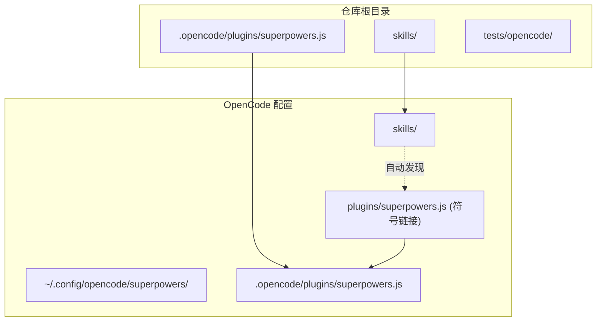
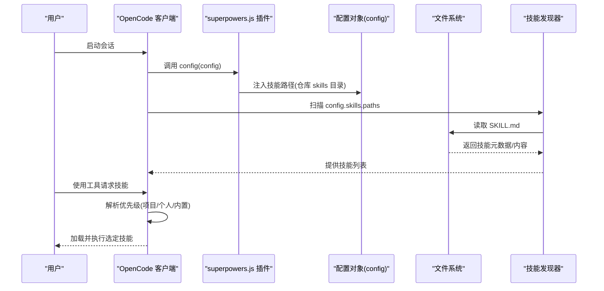
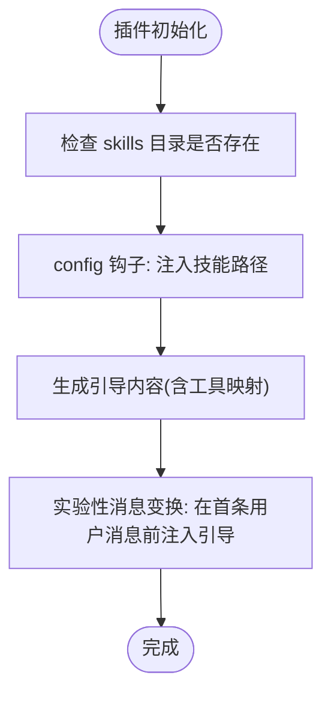
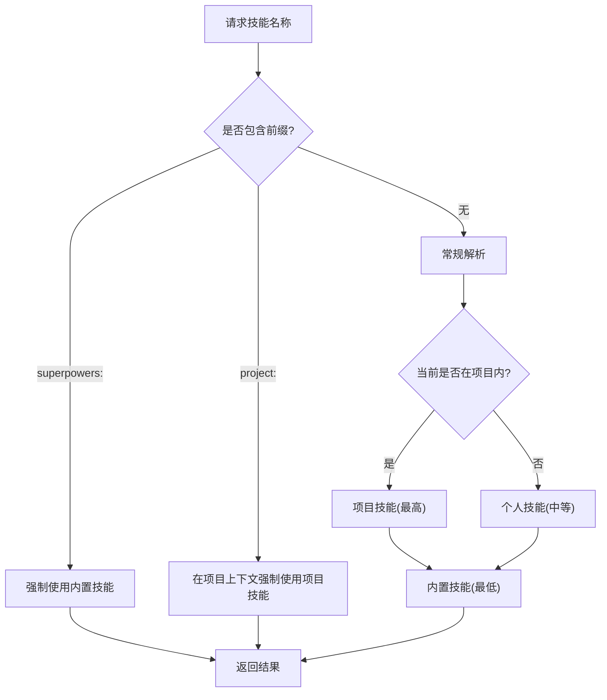
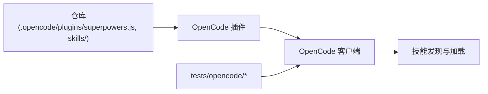

# 技能注册机制

<cite>
**本文引用的文件**
- [hooks.json](file://hooks/hooks.json)
- [hooks-cursor.json](file://hooks/hooks-cursor.json)
- [superpowers.js](file://.opencode/plugins/superpowers.js)
- [package.json](file://package.json)
- [README.md](file://README.md)
- [using-superpowers.md](file://skills/using-superpowers/SKILL.md)
- [brainstorming.md](file://skills/brainstorming/SKILL.md)
- [systematic-debugging.md](file://skills/systematic-debugging/SKILL.md)
- [test-plugin-loading.sh](file://tests/opencode/test-plugin-loading.sh)
- [test-tools.sh](file://tests/opencode/test-tools.sh)
- [test-priority.sh](file://tests/opencode/test-priority.sh)
- [setup.sh](file://tests/opencode/setup.sh)
- [run-tests.sh](file://tests/opencode/run-tests.sh)
</cite>

## 目录
1. [简介](#简介)
2. [项目结构](#项目结构)
3. [核心组件](#核心组件)
4. [架构总览](#架构总览)
5. [详细组件分析](#详细组件分析)
6. [依赖关系分析](#依赖关系分析)
7. [性能考虑](#性能考虑)
8. [故障排除指南](#故障排除指南)
9. [结论](#结论)
10. [附录](#附录)

## 简介
本文件面向 Superpowers 技能注册机制，系统性阐述技能的自动发现、注册与加载顺序，平台适配器（OpenCode 插件）如何注入技能路径、如何进行技能扫描与解析，以及内置技能与个人/项目技能的优先级规则。同时提供 hooks.json 的配置要点、工具适配说明、调试方法与常见问题排查建议。

## 项目结构
仓库采用按功能域组织的目录结构：核心插件位于 .opencode/plugins，技能资源位于 skills，平台钩子位于 hooks，测试用例位于 tests/opencode。OpenCode 平台通过插件动态注入技能路径，实现“无需手动链接”的自动发现。

图表来源
- [superpowers.js:89-95](file://.opencode/plugins/superpowers.js#L89-L95)
- [setup.sh:16-36](file://tests/opencode/setup.sh#L16-L36)

章节来源
- [superpowers.js:1-113](file://.opencode/plugins/superpowers.js#L1-L113)
- [setup.sh:1-38](file://tests/opencode/setup.sh#L1-L38)

## 核心组件
- OpenCode 插件入口：负责在运行时向配置注入技能路径、在会话首条用户消息中注入引导内容。
- 技能目录：skills 目录下包含各技能的 SKILL.md 及配套资源。
- 测试套件：验证插件安装、工具可用性、技能优先级解析等。

章节来源
- [superpowers.js:49-112](file://.opencode/plugins/superpowers.js#L49-L112)
- [README.md:27-83](file://README.md#L27-L83)

## 架构总览
OpenCode 插件通过 config 钩子将仓库中的 skills 目录加入到配置的技能路径集合；随后由平台的技能发现机制扫描这些路径，识别 SKILL.md 文件并构建技能索引。使用阶段，用户通过工具调用加载具体技能，平台根据优先级规则选择最终使用的版本。

图表来源
- [superpowers.js:89-95](file://.opencode/plugins/superpowers.js#L89-L95)
- [test-tools.sh:24-46](file://tests/opencode/test-tools.sh#L24-L46)
- [test-priority.sh:125-152](file://tests/opencode/test-priority.sh#L125-L152)

## 详细组件分析

### OpenCode 插件：自动注入与引导
- 注入技能路径：在 config 钩子中将仓库 skills 目录追加到 config.skills.paths，确保平台懒加载时可发现技能。
- 引导内容注入：在首次用户消息前插入引导文本，避免系统消息重复带来的令牌开销与兼容性问题。
- 工具映射：在引导中提供 OpenCode 等价工具说明，帮助非 CC 平台正确使用技能。

图表来源
- [superpowers.js:49-112](file://.opencode/plugins/superpowers.js#L49-L112)

章节来源
- [superpowers.js:89-110](file://.opencode/plugins/superpowers.js#L89-L110)

### 技能扫描与解析
- 扫描范围：平台从 config.skills.paths 中读取所有技能路径，递归扫描目录下的 SKILL.md。
- 解析规则：每个 SKILL.md 以 YAML 前言定义元信息（如 name、description），正文为技能内容。
- 工具接口：平台提供 find_skills 与 use_skill 等工具，用于列出与加载技能。

章节来源
- [test-tools.sh:24-46](file://tests/opencode/test-tools.sh#L24-L46)
- [test-tools.sh:55-77](file://tests/opencode/test-tools.sh#L55-L77)

### 技能加载顺序与优先级
优先级规则（从高到低）：
1) 项目技能：位于工作区内的 .opencode/skills 下，优先级最高。
2) 个人技能：位于用户配置目录下的 skills 下，优先级中等。
3) 内置技能：来自插件自带的 skills 目录，优先级最低。

显式前缀可强制指定来源：
- superpowers: 前缀强制使用内置技能。
- project: 前缀仅在项目上下文中有效，否则可能报错或回退。

图表来源
- [test-priority.sh:154-174](file://tests/opencode/test-priority.sh#L154-L174)
- [test-priority.sh:176-195](file://tests/opencode/test-priority.sh#L176-L195)

章节来源
- [test-priority.sh:1-199](file://tests/opencode/test-priority.sh#L1-L199)

### 平台适配器与钩子
- OpenCode 适配器：通过 .opencode/plugins/superpowers.js 注入技能路径与引导内容。
- 其他平台钩子：hooks.json 与 hooks-cursor.json 展示了不同平台的钩子配置风格，体现平台差异。

章节来源
- [hooks.json:1-17](file://hooks/hooks.json#L1-L17)
- [hooks-cursor.json:1-11](file://hooks/hooks-cursor.json#L1-L11)
- [superpowers.js:89-95](file://.opencode/plugins/superpowers.js#L89-L95)

### 配置文件与工具适配
- hooks.json：定义平台事件触发的命令或脚本，用于启动会话或执行辅助任务。
- 工具适配：不同平台的工具名称存在差异，需参考平台文档或内置引导中的映射说明。

章节来源
- [hooks.json:1-17](file://hooks/hooks.json#L1-L17)
- [using-superpowers.md:38-40](file://skills/using-superpowers/SKILL.md#L38-L40)

## 依赖关系分析
- 插件对仓库的依赖：插件通过相对路径定位仓库根目录下的 skills 目录。
- 平台对插件的依赖：OpenCode 通过插件钩子扩展配置，实现技能路径注入。
- 测试对环境的依赖：集成测试需要安装 OpenCode 并在隔离环境中运行。

图表来源
- [superpowers.js:49-95](file://.opencode/plugins/superpowers.js#L49-L95)
- [run-tests.sh:59-68](file://tests/opencode/run-tests.sh#L59-L68)

章节来源
- [run-tests.sh:17-68](file://tests/opencode/run-tests.sh#L17-L68)

## 性能考虑
- 懒加载策略：平台在首次需要时才扫描技能路径，减少启动开销。
- 引导注入位置：将引导内容注入首条用户消息而非系统消息，避免重复系统消息导致的令牌浪费与兼容性问题。
- 路径去重：插件仅在未包含时追加技能路径，避免重复注入。

章节来源
- [superpowers.js:89-110](file://.opencode/plugins/superpowers.js#L89-L110)

## 故障排除指南
- 插件未被识别
  - 检查插件文件是否存在且可被 OpenCode 读取。
  - 确认符号链接指向正确，且 OpenCode 配置目录下存在对应链接。
  - 参考：[test-plugin-loading.sh:18-33](file://tests/opencode/test-plugin-loading.sh#L18-L33)

- 技能未被发现
  - 确认插件已成功注入 skills 路径。
  - 检查 SKILL.md 是否位于正确的目录层级。
  - 参考：[test-plugin-loading.sh:35-52](file://tests/opencode/test-plugin-loading.sh#L35-L52)

- 工具不可用
  - 使用 find_skills 列出可用技能，确认内置技能是否出现。
  - 使用 use_skill 加载个人技能，验证内容是否正确。
  - 参考：[test-tools.sh:24-46](file://tests/opencode/test-tools.sh#L24-L46), [test-tools.sh:55-77](file://tests/opencode/test-tools.sh#L55-L77)

- 优先级不生效
  - 在项目外使用 personal 技能应高于内置技能。
  - 在项目内使用 project 技能应高于 personal 与内置技能。
  - 使用 superpowers: 前缀可强制内置技能。
  - 参考：[test-priority.sh:99-152](file://tests/opencode/test-priority.sh#L99-L152), [test-priority.sh:154-174](file://tests/opencode/test-priority.sh#L154-L174)

- 会话引导缺失
  - 确保插件已注入引导内容，且首条用户消息存在。
  - 参考：[superpowers.js:97-110](file://.opencode/plugins/superpowers.js#L97-L110)

章节来源
- [test-plugin-loading.sh:1-82](file://tests/opencode/test-plugin-loading.sh#L1-L82)
- [test-tools.sh:1-105](file://tests/opencode/test-tools.sh#L1-L105)
- [test-priority.sh:1-199](file://tests/opencode/test-priority.sh#L1-L199)
- [superpowers.js:97-110](file://.opencode/plugins/superpowers.js#L97-L110)

## 结论
Superpowers 的技能注册机制通过 OpenCode 插件在运行时注入技能路径，结合平台的懒加载与扫描能力，实现了“即装即用”的技能发现。内置技能与个人/项目技能遵循明确的优先级规则，并支持显式前缀覆盖。配合完善的测试用例，可快速定位并解决注册与加载问题。

## 附录

### 技能示例与用途
- 使用技能：介绍如何访问与使用技能，包含优先级与注意事项。
- 头脑风暴：在实现前进行设计与规范制定。
- 系统化调试：严格遵循四阶段调试流程，先溯源再修复。

章节来源
- [using-superpowers.md:1-118](file://skills/using-superpowers/SKILL.md#L1-L118)
- [brainstorming.md:1-165](file://skills/brainstorming/SKILL.md#L1-L165)
- [systematic-debugging.md:1-297](file://skills/systematic-debugging/SKILL.md#L1-L297)