# 技能系统组件

<cite>
**本文档引用的文件**
- [README.md](file://README.md)
- [CLAUDE.md](file://CLAUDE.md)
- [package.json](file://package.json)
- [skills/brainstorming/SKILL.md](file://skills/brainstorming/SKILL.md)
- [skills/writing-skills/SKILL.md](file://skills/writing-skills/SKILL.md)
- [skills/subagent-driven-development/SKILL.md](file://skills/subagent-driven-development/SKILL.md)
- [skills/systematic-debugging/SKILL.md](file://skills/systematic-debugging/SKILL.md)
- [skills/requesting-code-review/SKILL.md](file://skills/requesting-code-review/SKILL.md)
- [skills/executing-plans/SKILL.md](file://skills/executing-plans/SKILL.md)
- [skills/writing-plans/SKILL.md](file://skills/writing-plans/SKILL.md)
- [skills/test-driven-development/SKILL.md](file://skills/test-driven-development/SKILL.md)
- [skills/verification-before-completion/SKILL.md](file://skills/verification-before-completion/SKILL.md)
- [skills/using-git-worktrees/SKILL.md](file://skills/using-git-worktrees/SKILL.md)
- [tests/skill-triggering/run-all.sh](file://tests/skill-triggering/run-all.sh)
- [tests/explicit-skill-requests/run-all.sh](file://tests/explicit-skill-requests/run-all.sh)
</cite>

## 目录
1. [简介](#简介)
2. [项目结构](#项目结构)
3. [核心组件](#核心组件)
4. [架构总览](#架构总览)
5. [详细组件分析](#详细组件分析)
6. [依赖分析](#依赖分析)
7. [性能考虑](#性能考虑)
8. [故障排除指南](#故障排除指南)
9. [结论](#结论)
10. [附录](#附录)

## 简介
本文件面向 Superpowers 的技能系统组件，系统性阐述其模块化设计、可组合性原理与生命周期管理，解析技能定义格式（SKILL.md）、技能注册机制与技能调度算法，并深入说明技能间依赖关系、优先级管理与并发执行策略。同时提供技能开发最佳实践（提示词设计、参数传递与结果处理），记录扩展点与自定义能力，以及与其他组件的集成接口。

## 项目结构
Superpowers 将“技能”作为可组合的工作流单元，围绕“设计-计划-执行-验证”的闭环组织技能集合。核心工作流由以下技能构成：
- 设计阶段：brainstorming
- 工作区隔离：using-git-worktrees
- 计划阶段：writing-plans
- 执行阶段：subagent-driven-development 或 executing-plans
- 质量保障：test-driven-development、requesting-code-review、verification-before-completion
- 收尾阶段：finishing-a-development-branch（在 README 中提及）

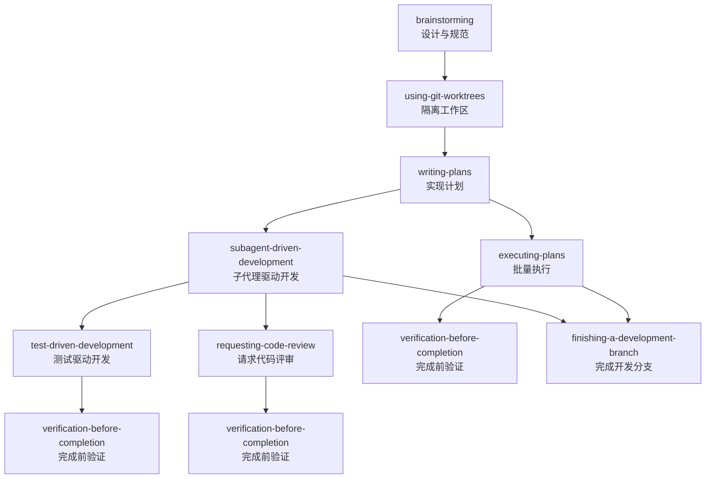

图表来源
- [README.md:108-125](file://README.md#L108-L125)
- [skills/brainstorming/SKILL.md:1-165](file://skills/brainstorming/SKILL.md#L1-L165)
- [skills/using-git-worktrees/SKILL.md:1-219](file://skills/using-git-worktrees/SKILL.md#L1-L219)
- [skills/writing-plans/SKILL.md:1-153](file://skills/writing-plans/SKILL.md#L1-L153)
- [skills/subagent-driven-development/SKILL.md:1-278](file://skills/subagent-driven-development/SKILL.md#L1-L278)
- [skills/executing-plans/SKILL.md:1-71](file://skills/executing-plans/SKILL.md#L1-L71)
- [skills/test-driven-development/SKILL.md:1-372](file://skills/test-driven-development/SKILL.md#L1-L372)
- [skills/requesting-code-review/SKILL.md:1-106](file://skills/requesting-code-review/SKILL.md#L1-L106)
- [skills/verification-before-completion/SKILL.md:1-140](file://skills/verification-before-completion/SKILL.md#L1-L140)

章节来源
- [README.md:108-125](file://README.md#L108-L125)

## 核心组件
- SKILL.md 定义规范：每个技能以 YAML frontmatter 开头，包含 name 与 description；正文采用结构化 Markdown，支持流程图、快速参考与常见错误等模块。
- 技能注册与发现：通过文件系统中的 skills/<skill-name>/SKILL.md 自动注册，平台加载时扫描该目录树，按名称与触发条件进行匹配。
- 调度与生命周期：平台在任务开始前检查相关技能，按工作流顺序自动调用；技能内部通过“前置条件判断-流程执行-后置验证”形成闭环。
- 可组合性：技能之间通过“必需子技能”（REQUIRED SUB-SKILL）与“集成技能”（Integration）声明依赖，形成可替换的执行路径（如并行或串行执行）。

章节来源
- [skills/writing-skills/SKILL.md:93-137](file://skills/writing-skills/SKILL.md#L93-L137)
- [skills/writing-skills/SKILL.md:278-290](file://skills/writing-skills/SKILL.md#L278-L290)
- [README.md:108-125](file://README.md#L108-L125)

## 架构总览
技能系统采用“工作流编排 + 子代理执行 + 质量门禁”的三层架构：
- 编排层：负责技能选择、顺序控制与上下文传递（如计划文件、提交 SHA）。
- 执行层：通过子代理（subagent）执行具体任务，每任务独立上下文，避免污染。
- 质量层：两阶段评审（规范符合性 → 代码质量）与完成前验证，确保交付物符合要求。

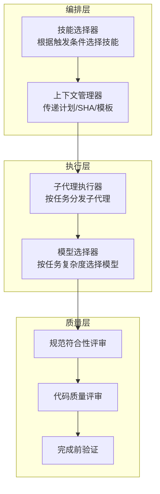

图表来源
- [skills/subagent-driven-development/SKILL.md:42-84](file://skills/subagent-driven-development/SKILL.md#L42-L84)
- [skills/using-git-worktrees/SKILL.md:144-155](file://skills/using-git-worktrees/SKILL.md#L144-L155)
- [skills/requesting-code-review/SKILL.md:24-48](file://skills/requesting-code-review/SKILL.md#L24-L48)
- [skills/verification-before-completion/SKILL.md:24-38](file://skills/verification-before-completion/SKILL.md#L24-L38)

## 详细组件分析

### 组件 A：设计与规范（brainstorming）
- 模块化设计：强调“先设计再实现”，通过可视化伴侶（Visual Companion）辅助理解，严格禁止在设计完成前调用实现类技能。
- 流程图：使用 Graphviz 描述“探索上下文 → 视觉问题判定 → 提问澄清 → 提出方案 → 分段呈现设计 → 写规范 → 自审 → 用户审阅 → 进入计划”的闭环。
- 生命周期：终端状态为调用 writing-plans，确保设计与计划衔接。

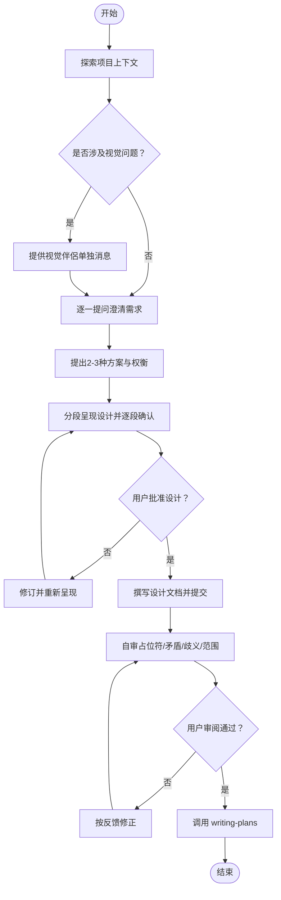

图表来源
- [skills/brainstorming/SKILL.md:34-66](file://skills/brainstorming/SKILL.md#L34-L66)

章节来源
- [skills/brainstorming/SKILL.md:1-165](file://skills/brainstorming/SKILL.md#L1-L165)

### 组件 B：实现计划（writing-plans）
- 文件结构：强制保存到 docs/superpowers/plans/YYYY-MM-DD-<feature-name>.md，任务粒度为“可执行步骤（2-5分钟）”。
- 任务分解：明确“创建/修改/测试”的文件清单与每步的命令与预期输出，杜绝占位符。
- 执行交接：完成后提供两种执行选项（子代理驱动 vs 批量执行），并声明必需子技能。

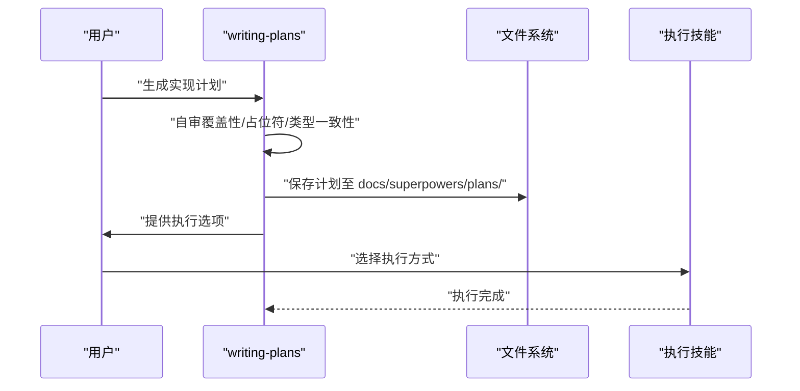

图表来源
- [skills/writing-plans/SKILL.md:45-104](file://skills/writing-plans/SKILL.md#L45-L104)
- [skills/writing-plans/SKILL.md:134-153](file://skills/writing-plans/SKILL.md#L134-L153)

章节来源
- [skills/writing-plans/SKILL.md:1-153](file://skills/writing-plans/SKILL.md#L1-L153)

### 组件 C：子代理驱动开发（subagent-driven-development）
- 并发与隔离：每任务派发全新子代理，避免会话历史污染；任务间并行安全，但同一时刻仅一个实现子代理在线。
- 两阶段评审：先“规范符合性评审”，再“代码质量评审”，评审不通过需修复并复审。
- 模型选择：根据任务复杂度选择不同能力模型，降低成本并提升速度。

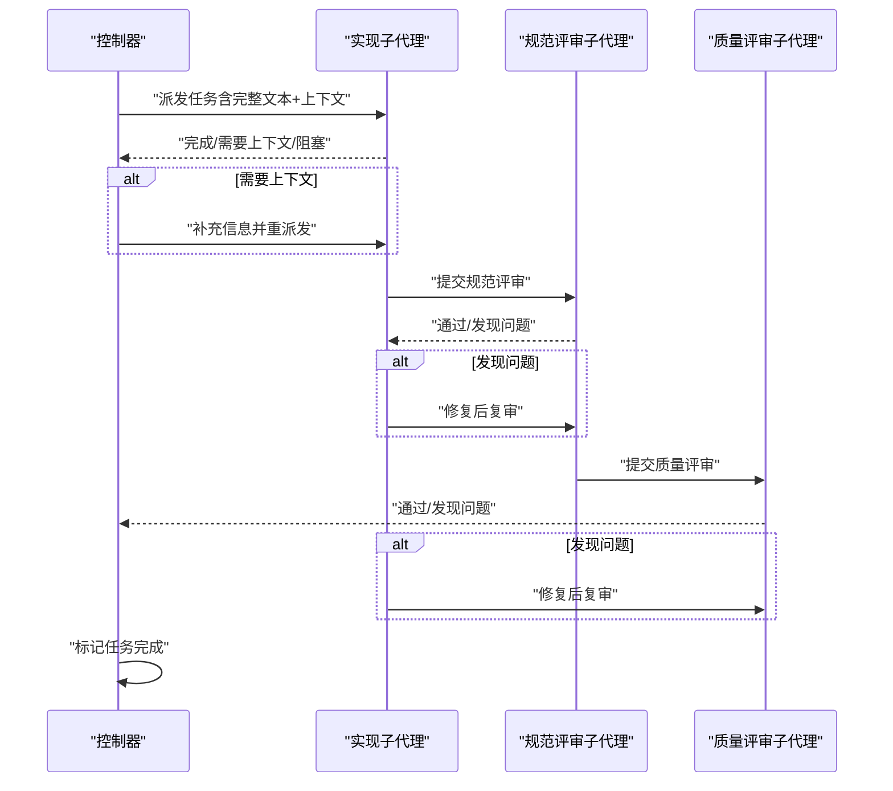

图表来源
- [skills/subagent-driven-development/SKILL.md:42-84](file://skills/subagent-driven-development/SKILL.md#L42-L84)
- [skills/subagent-driven-development/SKILL.md:87-101](file://skills/subagent-driven-development/SKILL.md#L87-L101)

章节来源
- [skills/subagent-driven-development/SKILL.md:1-278](file://skills/subagent-driven-development/SKILL.md#L1-L278)

### 组件 D：批量执行（executing-plans）
- 适用场景：在分离会话中执行计划，适合无子代理平台或大规模批处理。
- 关键点：先批判性审查计划，再按步骤执行与验证，最后调用 finishing-a-development-branch 完成收尾。

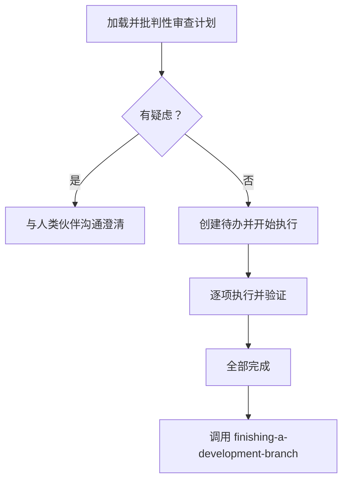

图表来源
- [skills/executing-plans/SKILL.md:16-38](file://skills/executing-plans/SKILL.md#L16-L38)

章节来源
- [skills/executing-plans/SKILL.md:1-71](file://skills/executing-plans/SKILL.md#L1-L71)

### 组件 E：测试驱动开发（test-driven-development）
- 铁律：无失败测试不写生产代码；严格遵循 RED-GREEN-REFACTOR 循环。
- 常见自欺：测试后写、凭经验验证、删除已花费时间等；均属“精神而非仪式”的借口，必须停止并重来。

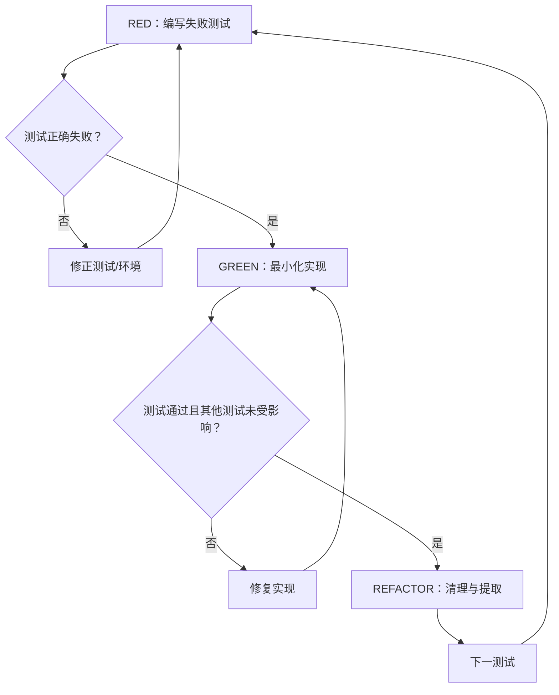

图表来源
- [skills/test-driven-development/SKILL.md:47-69](file://skills/test-driven-development/SKILL.md#L47-L69)

章节来源
- [skills/test-driven-development/SKILL.md:1-372](file://skills/test-driven-development/SKILL.md#L1-L372)

### 组件 F：系统化调试（systematic-debugging）
- 四阶段：根因调查 → 模式分析 → 假设与测试 → 实施修复；任何阶段不得跳过。
- 多层系统诊断：在组件边界添加诊断仪器，定位失败层后再深入调查。

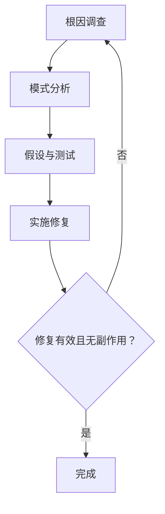

图表来源
- [skills/systematic-debugging/SKILL.md:46-197](file://skills/systematic-debugging/SKILL.md#L46-L197)

章节来源
- [skills/systematic-debugging/SKILL.md:1-297](file://skills/systematic-debugging/SKILL.md#L1-L297)

### 组件 G：请求代码评审（requesting-code-review）
- 触发时机：任务完成后、重大功能完成后、合并前。
- 参数传递：BASE_SHA/HEAD_SHA/WHAT_WAS_IMPLEMENTED/PLAN_OR_REQUIREMENTS/DESCRIPTION 等占位符由控制器填充。
- 结果处理：按严重级别处理问题，必要时回退并重新评审。

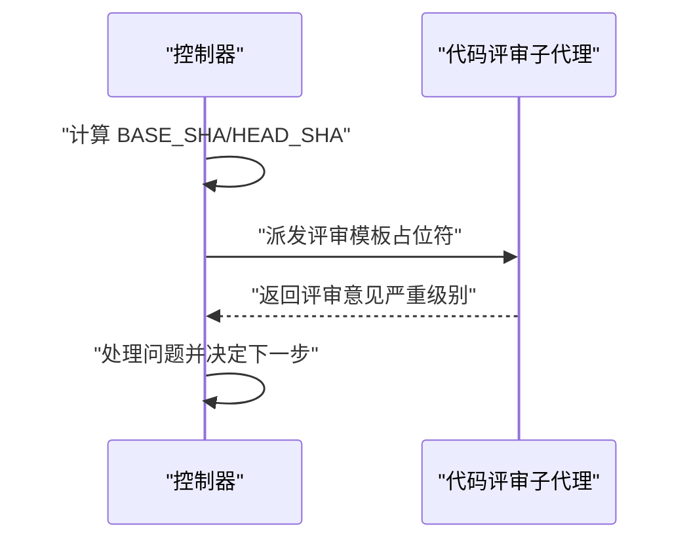

图表来源
- [skills/requesting-code-review/SKILL.md:24-48](file://skills/requesting-code-review/SKILL.md#L24-L48)

章节来源
- [skills/requesting-code-review/SKILL.md:1-106](file://skills/requesting-code-review/SKILL.md#L1-L106)

### 组件 H：完成前验证（verification-before-completion）
- 铁律：无新鲜证据不宣称完成；必须运行完整命令、读取完整输出、确认退出码与失败数。
- 通用范式：测试/构建/回归/需求/代理委托均遵循“证据在先”。

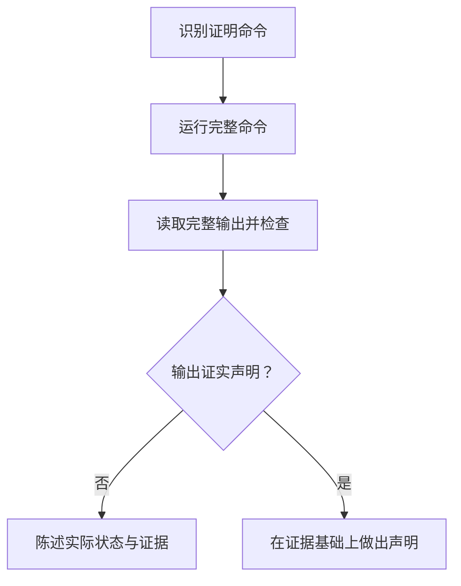

图表来源
- [skills/verification-before-completion/SKILL.md:24-38](file://skills/verification-before-completion/SKILL.md#L24-L38)

章节来源
- [skills/verification-before-completion/SKILL.md:1-140](file://skills/verification-before-completion/SKILL.md#L1-L140)

### 组件 I：使用 Git Worktrees（using-git-worktrees）
- 目录选择优先级：.worktrees/ > worktrees/ > CLAUDE.md 配置 > 用户选择。
- 安全校验：项目本地工作树必须被忽略，否则先加入 .gitignore 并提交。
- 快速参考：提供常见情境下的行动清单与红灯清单。

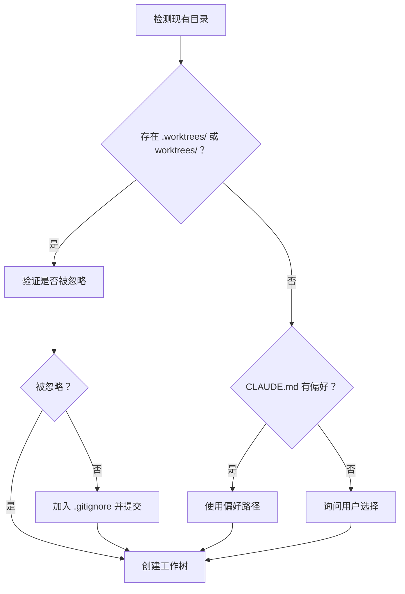

图表来源
- [skills/using-git-worktrees/SKILL.md:16-50](file://skills/using-git-worktrees/SKILL.md#L16-L50)
- [skills/using-git-worktrees/SKILL.md:51-75](file://skills/using-git-worktrees/SKILL.md#L51-L75)

章节来源
- [skills/using-git-worktrees/SKILL.md:1-219](file://skills/using-git-worktrees/SKILL.md#L1-L219)

### 组件 J：技能创作（writing-skills）
- TDD 化技能：以压力场景（子代理）为测试，先观察基线行为，再写技能文档，最后重构漏洞。
- CSO（Claude 搜索优化）：描述字段只写触发条件，关键词覆盖症状与工具，命名采用动词优先。
- 流程图使用：仅用于非显而易见的决策点与循环过程。

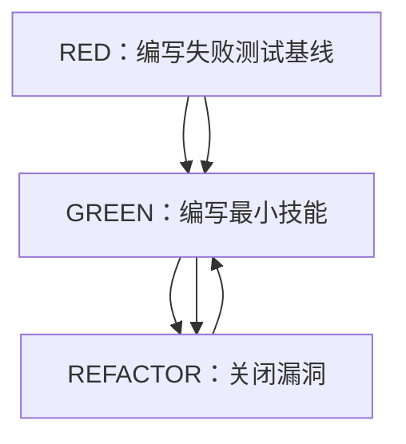

图表来源
- [skills/writing-skills/SKILL.md:30-45](file://skills/writing-skills/SKILL.md#L30-L45)
- [skills/writing-skills/SKILL.md:533-556](file://skills/writing-skills/SKILL.md#L533-L556)

章节来源
- [skills/writing-skills/SKILL.md:1-656](file://skills/writing-skills/SKILL.md#L1-L656)

## 依赖分析
- 必需子技能（REQUIRED SUB-SKILL）：多数技能在执行前声明必需的前置技能，确保工作流完整性。
- 集成技能（Integration）：技能间通过“集成”声明协作关系，如子代理驱动开发与 finishing-a-development-branch 的配合。
- 触发链路：README 中列出的“基本工作流”即为默认触发链路，平台在任务开始前检查并按顺序激活相关技能。

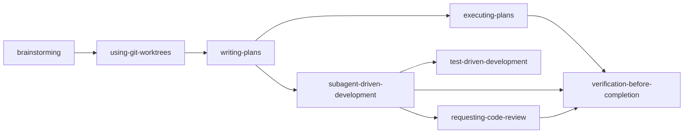

图表来源
- [README.md:108-125](file://README.md#L108-L125)
- [skills/subagent-driven-development/SKILL.md:265-278](file://skills/subagent-driven-development/SKILL.md#L265-L278)
- [skills/executing-plans/SKILL.md:65-71](file://skills/executing-plans/SKILL.md#L65-L71)

章节来源
- [README.md:108-125](file://README.md#L108-L125)

## 性能考虑
- 子代理模型选择：根据任务复杂度选择模型，降低总体成本；机械实现任务可用低成本模型，设计与评审任务使用高能力模型。
- 上下文传递：控制器一次性提供完整任务文本与上下文，减少子代理往返与重复读取开销。
- 评审循环：两阶段评审与复审确保早期发现与修复问题，避免后期调试成本上升。
- 并发策略：同一时刻仅一个实现子代理在线，避免资源冲突；评审阶段可并行但需严格顺序控制。

章节来源
- [skills/subagent-driven-development/SKILL.md:87-101](file://skills/subagent-driven-development/SKILL.md#L87-L101)
- [skills/subagent-driven-development/SKILL.md:228-233](file://skills/subagent-driven-development/SKILL.md#L228-L233)

## 故障排除指南
- 子代理状态处理：DONE、DONE_WITH_CONCERNS、NEEDS_CONTEXT、BLOCKED 四种状态需分别处理，不可忽略升级或强制重试。
- 评审问题：规范不符合需先修复再复审；质量评审问题需修复后复审，直至通过。
- 完成前验证：严禁在未运行验证命令的情况下宣称成功，必须基于新鲜证据做出声明。
- 目录与安全：工作树目录必须被忽略，否则先修复忽略规则再创建；基线测试失败需报告并征询是否继续。

章节来源
- [skills/subagent-driven-development/SKILL.md:102-119](file://skills/subagent-driven-development/SKILL.md#L102-L119)
- [skills/verification-before-completion/SKILL.md:52-62](file://skills/verification-before-completion/SKILL.md#L52-L62)
- [skills/using-git-worktrees/SKILL.md:194-208](file://skills/using-git-worktrees/SKILL.md#L194-L208)

## 结论
Superpowers 技能系统通过模块化设计与可组合性原则，实现了从设计到交付的自动化闭环。SKILL.md 格式确保技能可发现、可测试、可演进；调度与生命周期管理保证了执行的确定性与质量；并发与隔离策略提升了规模化执行效率。建议在新技能开发中遵循 writing-skills 的 TDD 方法与 CSO 原则，持续通过压力测试完善技能内容。

## 附录
- 测试脚本：仓库提供了技能触发与显式请求的测试脚本，用于验证技能在不同触发场景下的行为一致性。
- 贡献指南：贡献者需遵循严格的 PR 要求与评估流程，技能变更需经压力测试与效果评估。

章节来源
- [tests/skill-triggering/run-all.sh:1-61](file://tests/skill-triggering/run-all.sh#L1-L61)
- [tests/explicit-skill-requests/run-all.sh:1-71](file://tests/explicit-skill-requests/run-all.sh#L1-L71)
- [CLAUDE.md:67-86](file://CLAUDE.md#L67-L86)
- [package.json:1-7](file://package.json#L1-L7)