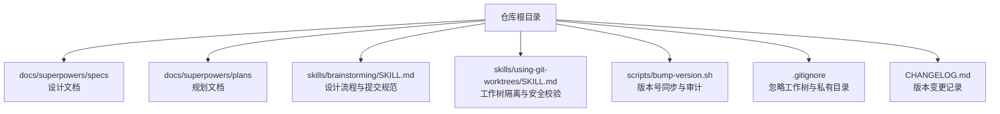
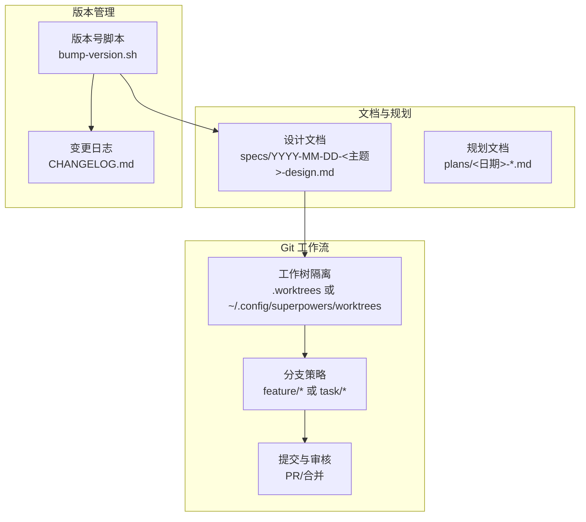
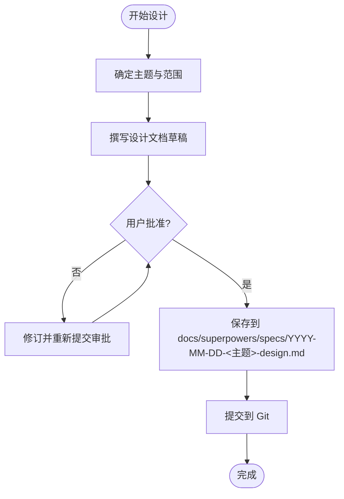
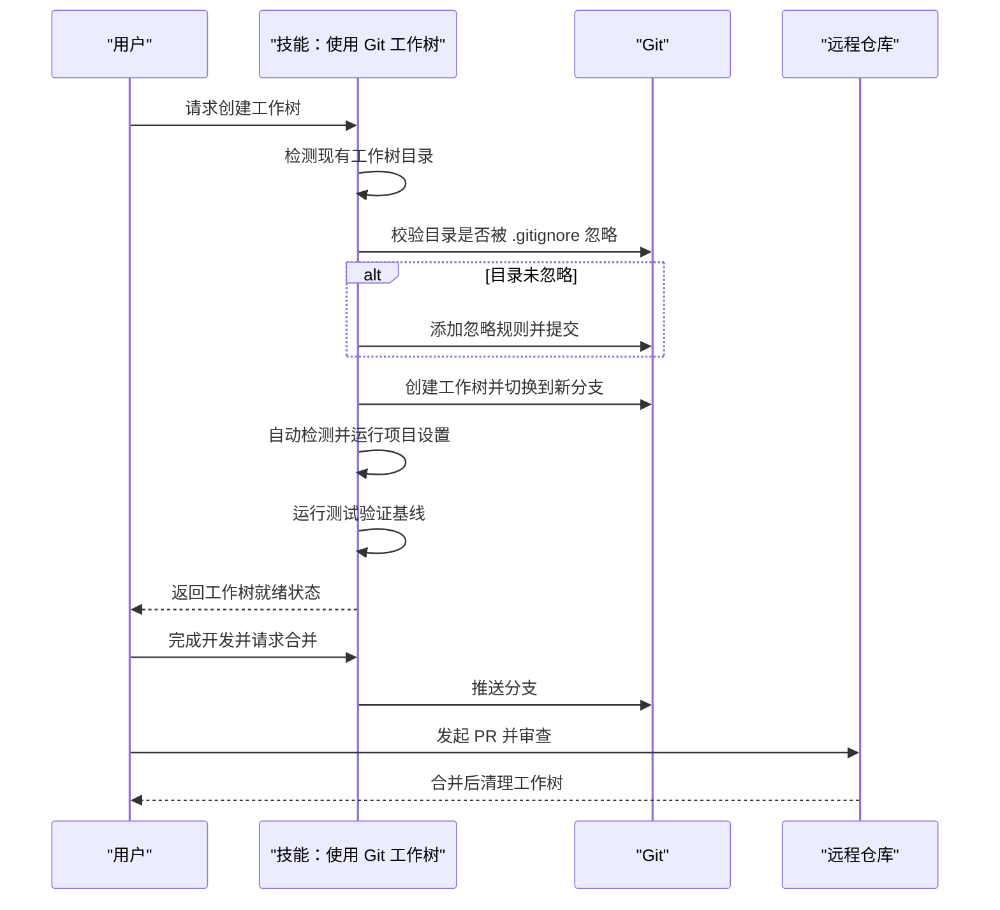
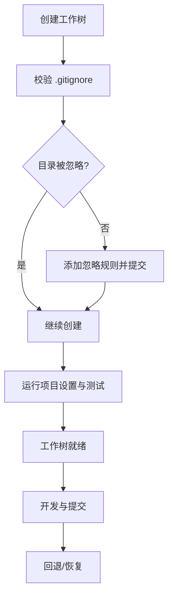
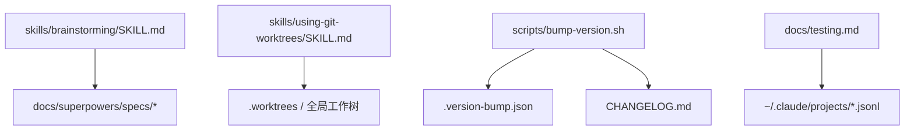

# 文档存储与版本控制

<cite>
**本文引用的文件**
- [README.md](file://README.md)
- [package.json](file://package.json)
- [.gitignore](file://.gitignore)
- [.github/PULL_REQUEST_TEMPLATE.md](file://.github/PULL_REQUEST_TEMPLATE.md)
- [scripts/bump-version.sh](file://scripts/bump-version.sh)
- [skills/brainstorming/visual-companion.md](file://skills/brainstorming/visual-companion.md)
- [skills/brainstorming/spec-document-reviewer-prompt.md](file://skills/brainstorming/spec-document-reviewer-prompt.md)
- [skills/brainstorming/SKILL.md](file://skills/brainstorming/SKILL.md)
- [skills/using-git-worktrees/SKILL.md](file://skills/using-git-worktrees/SKILL.md)
- [skills/test-driven-development/SKILL.md](file://skills/test-driven-development/SKILL.md)
- [docs/testing.md](file://docs/testing.md)
- [CHANGELOG.md](file://CHANGELOG.md)
</cite>

## 目录
1. [简介](#简介)
2. [项目结构](#项目结构)
3. [核心组件](#核心组件)
4. [架构总览](#架构总览)
5. [详细组件分析](#详细组件分析)
6. [依赖关系分析](#依赖关系分析)
7. [性能考虑](#性能考虑)
8. [故障排查指南](#故障排查指南)
9. [结论](#结论)
10. [附录](#附录)

## 简介
本文件面向“文档存储与版本控制系统”的技术文档，聚焦于以下方面：
- 文档存储架构：以 Git 为核心版本控制，结合本地工作树隔离与规范化目录结构。
- 命名规范与目录结构：统一的设计文档与规划文档命名与存放路径约定。
- 版本控制机制：Git 集成、分支策略与合并流程。
- 备份与恢复：基于 Git 的历史回溯与工作树隔离，确保可恢复性与数据完整性。
- 性能优化与缓存：利用 Git 工作树减少切换成本，结合测试基线验证提升稳定性。
- 访问控制：通过权限模式与目录白名单降低误操作风险。
- 扩展能力：支持自定义存储后端（如云存储）与版本管理插件。

## 项目结构
仓库采用“技能（skills）+ 文档（docs）+ 脚本（scripts）+ 测试（tests）”的分层组织方式，文档相关的关键位置如下：
- 设计与规划文档集中存放于 docs/superpowers/plans 与 docs/superpowers/specs
- 技能文档中包含文档生成与提交的流程约束
- 版本号管理脚本与变更日志用于发布与审计
- Git 忽略规则与工作树目录约定确保文档与工作树不被意外提交

图表来源
- [skills/brainstorming/SKILL.md:109-114](file://skills/brainstorming/SKILL.md#L109-L114)
- [skills/using-git-worktrees/SKILL.md:16-155](file://skills/using-git-worktrees/SKILL.md#L16-L155)
- [scripts/bump-version.sh:170-194](file://scripts/bump-version.sh#L170-L194)
- [.gitignore:1-8](file://.gitignore#L1-L8)
- [CHANGELOG.md:1-14](file://CHANGELOG.md#L1-L14)

章节来源
- [README.md:108-125](file://README.md#L108-L125)
- [skills/brainstorming/SKILL.md:109-114](file://skills/brainstorming/SKILL.md#L109-L114)
- [skills/using-git-worktrees/SKILL.md:16-155](file://skills/using-git-worktrees/SKILL.md#L16-L155)
- [scripts/bump-version.sh:170-194](file://scripts/bump-version.sh#L170-L194)
- [.gitignore:1-8](file://.gitignore#L1-L8)
- [CHANGELOG.md:1-14](file://CHANGELOG.md#L1-L14)

## 核心组件
- 文档生成与提交流程：由“头脑风暴”技能在设计获批后生成设计文档，并提交到 Git，确保所有设计变更可追溯。
- 工作树隔离：使用 Git 工作树在独立工作空间中进行功能开发，避免污染主分支，同时进行测试基线验证。
- 版本号同步与审计：通过版本号脚本统一更新多处版本信息，并扫描仓库查找未声明的版本字符串，防止版本漂移。
- 测试与会话记录：通过真实会话转录文件解析验证技能行为，结合令牌用量分析评估成本与性能。

章节来源
- [skills/brainstorming/SKILL.md:109-114](file://skills/brainstorming/SKILL.md#L109-L114)
- [skills/using-git-worktrees/SKILL.md:75-142](file://skills/using-git-worktrees/SKILL.md#L75-L142)
- [scripts/bump-version.sh:56-92](file://scripts/bump-version.sh#L56-L92)
- [docs/testing.md:20-33](file://docs/testing.md#L20-L33)

## 架构总览
下图展示了文档从“设计—工作树隔离—实现—测试—提交”的完整流程，以及版本号管理与变更记录的作用点。

图表来源
- [skills/brainstorming/SKILL.md:109-114](file://skills/brainstorming/SKILL.md#L109-L114)
- [skills/using-git-worktrees/SKILL.md:75-142](file://skills/using-git-worktrees/SKILL.md#L75-L142)
- [scripts/bump-version.sh:166-194](file://scripts/bump-version.sh#L166-L194)
- [CHANGELOG.md:1-14](file://CHANGELOG.md#L1-L14)

## 详细组件分析

### 组件一：文档命名规范与目录结构
- 设计文档命名：采用“YYYY-MM-DD-<主题>-design.md”，便于按时间排序与检索。
- 规划文档命名：采用“YYYY-MM-DD-<任务或主题>.md”，保持与设计文档一致的时间前缀风格。
- 存放位置：
  - 设计文档：docs/superpowers/specs
  - 规划文档：docs/superpowers/plans
- 提交要求：设计文档在写入后即提交至 Git，确保可追溯性与协作一致性。

图表来源
- [skills/brainstorming/SKILL.md:109-114](file://skills/brainstorming/SKILL.md#L109-L114)

章节来源
- [skills/brainstorming/SKILL.md:109-114](file://skills/brainstorming/SKILL.md#L109-L114)

### 组件二：版本控制机制（Git 集成、分支策略与合并流程）
- Git 集成：
  - 使用工作树隔离：在 .worktrees 或全局目录创建独立工作空间，避免主分支污染。
  - 安全校验：对项目本地工作树目录执行 .gitignore 校验，防止误提交。
  - 自动化设置：根据项目类型自动检测并运行安装命令（如 npm install、cargo build 等）。
- 分支策略：
  - 建议使用 feature/* 或 task/* 前缀，与工作树名称保持一致，便于追踪。
- 合并流程：
  - 在完成测试与评审后，通过 PR 进行合并；合并后清理工作树，保持环境整洁。

图表来源
- [skills/using-git-worktrees/SKILL.md:51-142](file://skills/using-git-worktrees/SKILL.md#L51-L142)

章节来源
- [skills/using-git-worktrees/SKILL.md:51-142](file://skills/using-git-worktrees/SKILL.md#L51-L142)

### 组件三：备份策略、恢复机制与数据完整性
- 基于 Git 的备份与恢复：
  - 工作树隔离天然提供“快照式备份”，可在任意时刻回退到上一个稳定工作树。
  - 通过分支与提交历史可恢复到任意已知正确版本。
- 数据完整性保证：
  - 工作树创建前的 .gitignore 校验，避免将工作树内容误提交。
  - 测试基线验证：在工作树初始化时运行测试，确保从干净状态开始，减少回归风险。
- 变更审计：
  - 版本号脚本扫描仓库中的版本字符串，识别未声明的版本引用，防止遗漏。

图表来源
- [skills/using-git-worktrees/SKILL.md:51-142](file://skills/using-git-worktrees/SKILL.md#L51-L142)
- [scripts/bump-version.sh:94-164](file://scripts/bump-version.sh#L94-L164)

章节来源
- [skills/using-git-worktrees/SKILL.md:51-142](file://skills/using-git-worktrees/SKILL.md#L51-L142)
- [scripts/bump-version.sh:94-164](file://scripts/bump-version.sh#L94-L164)

### 组件四：性能优化、缓存策略与访问控制
- 性能优化：
  - 工作树隔离减少分支切换开销，提高迭代效率。
  - 测试基线验证在工作树初始化阶段完成，避免后续反复调试。
- 缓存策略：
  - 利用平台的提示缓存（Prompt Caching）降低重复输入成本，测试文档提供了令牌用量分析工具。
- 访问控制：
  - 通过权限模式与目录白名单限制文件系统访问，降低误操作风险。

图表来源
- [docs/testing.md:137-177](file://docs/testing.md#L137-L177)
- [docs/testing.md:189-206](file://docs/testing.md#L189-L206)

章节来源
- [docs/testing.md:137-177](file://docs/testing.md#L137-L177)
- [docs/testing.md:189-206](file://docs/testing.md#L189-L206)

### 组件五：扩展能力（自定义存储后端与版本管理插件）
- 自定义存储后端：
  - 可将设计文档与规划文档迁移到外部存储（如对象存储、知识库），但需保留与 Git 的映射关系以便审计与回溯。
- 版本管理插件：
  - 可通过版本号脚本扩展支持新的配置文件或字段，确保版本号同步与审计覆盖所有目标文件。

章节来源
- [scripts/bump-version.sh:43-53](file://scripts/bump-version.sh#L43-L53)
- [scripts/bump-version.sh:166-194](file://scripts/bump-version.sh#L166-L194)

## 依赖关系分析
- 文档生成依赖“头脑风暴”技能的流程约束与提交规范。
- 工作树隔离依赖 Git 与 .gitignore 配置，确保目录安全与测试基线。
- 版本号同步依赖配置文件与审计脚本，确保仓库内版本一致性。
- 测试与会话记录依赖真实会话转录文件解析与令牌用量分析工具。

图表来源
- [skills/brainstorming/SKILL.md:109-114](file://skills/brainstorming/SKILL.md#L109-L114)
- [skills/using-git-worktrees/SKILL.md:75-142](file://skills/using-git-worktrees/SKILL.md#L75-L142)
- [scripts/bump-version.sh:43-53](file://scripts/bump-version.sh#L43-L53)
- [CHANGELOG.md:1-14](file://CHANGELOG.md#L1-L14)
- [docs/testing.md:265-304](file://docs/testing.md#L265-L304)

章节来源
- [skills/brainstorming/SKILL.md:109-114](file://skills/brainstorming/SKILL.md#L109-L114)
- [skills/using-git-worktrees/SKILL.md:75-142](file://skills/using-git-worktrees/SKILL.md#L75-L142)
- [scripts/bump-version.sh:43-53](file://scripts/bump-version.sh#L43-L53)
- [CHANGELOG.md:1-14](file://CHANGELOG.md#L1-L14)
- [docs/testing.md:265-304](file://docs/testing.md#L265-L304)

## 性能考虑
- 使用工作树隔离减少分支切换与上下文切换成本，适合高频迭代场景。
- 在工作树初始化阶段完成测试基线验证，避免后续反复调试带来的延迟。
- 利用提示缓存与令牌用量分析工具，量化每次交互的成本，指导优化。

## 故障排查指南
- 工作树目录未被忽略导致误提交：
  - 解决：在创建工作树前执行 .gitignore 校验，必要时添加忽略规则并提交。
- 测试基线失败：
  - 解决：报告失败原因并征询是否继续；仅在确认无预置问题后再继续开发。
- 版本号漂移：
  - 解决：使用版本号脚本检查与审计，识别未声明的版本字符串并补充到配置文件。
- 会话文件缺失：
  - 解决：确认正确的项目目录与最近会话文件，必要时增加超时或检查测试逻辑。

章节来源
- [skills/using-git-worktrees/SKILL.md:51-142](file://skills/using-git-worktrees/SKILL.md#L51-L142)
- [scripts/bump-version.sh:94-164](file://scripts/bump-version.sh#L94-L164)
- [docs/testing.md:178-215](file://docs/testing.md#L178-L215)

## 结论
该系统以 Git 为核心构建文档存储与版本控制体系，结合工作树隔离、测试基线验证与版本号同步审计，实现了高可靠性的文档生命周期管理。通过明确的命名规范与目录结构、严格的分支与合并流程，以及完善的备份与恢复机制，确保文档的可追溯性与可维护性。同时，借助提示缓存与令牌用量分析工具，系统具备良好的性能可观测性与成本控制能力。未来可进一步扩展自定义存储后端与版本管理插件，以适配更广泛的协作与部署场景。

## 附录
- 相关文件路径与用途概览：
  - docs/superpowers/specs：设计文档存放目录
  - docs/superpowers/plans：规划文档存放目录
  - skills/brainstorming/SKILL.md：设计流程与提交规范
  - skills/using-git-worktrees/SKILL.md：工作树隔离与安全校验
  - scripts/bump-version.sh：版本号同步与审计
  - CHANGELOG.md：版本变更记录
  - docs/testing.md：测试与会话记录解析