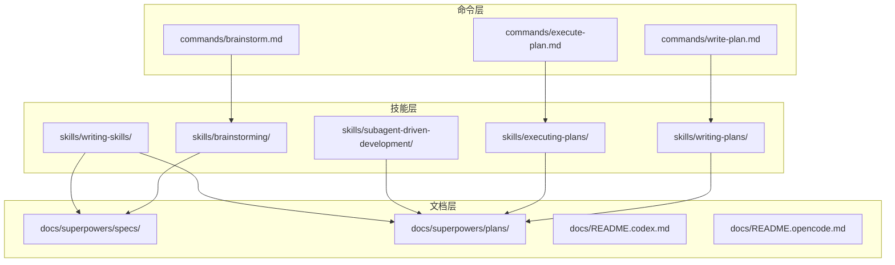
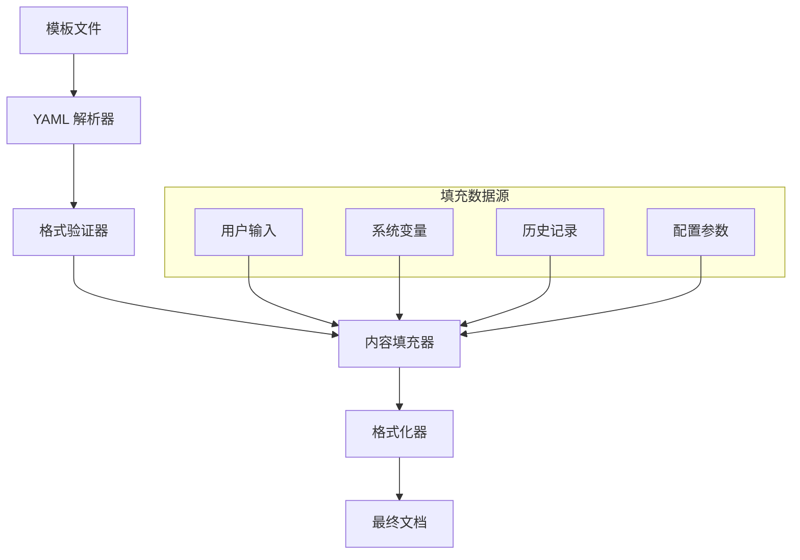
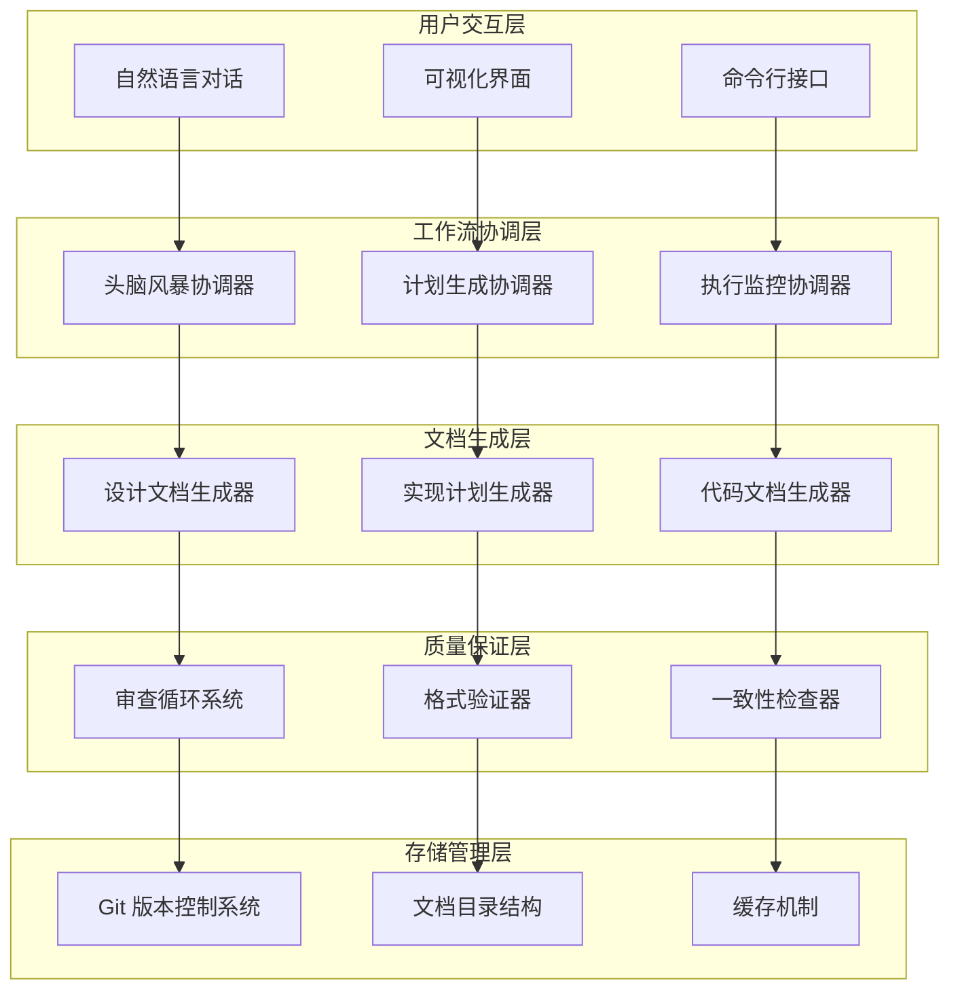
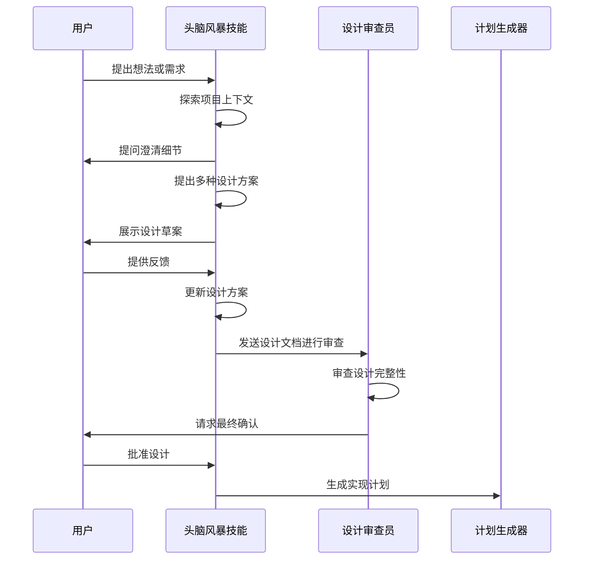
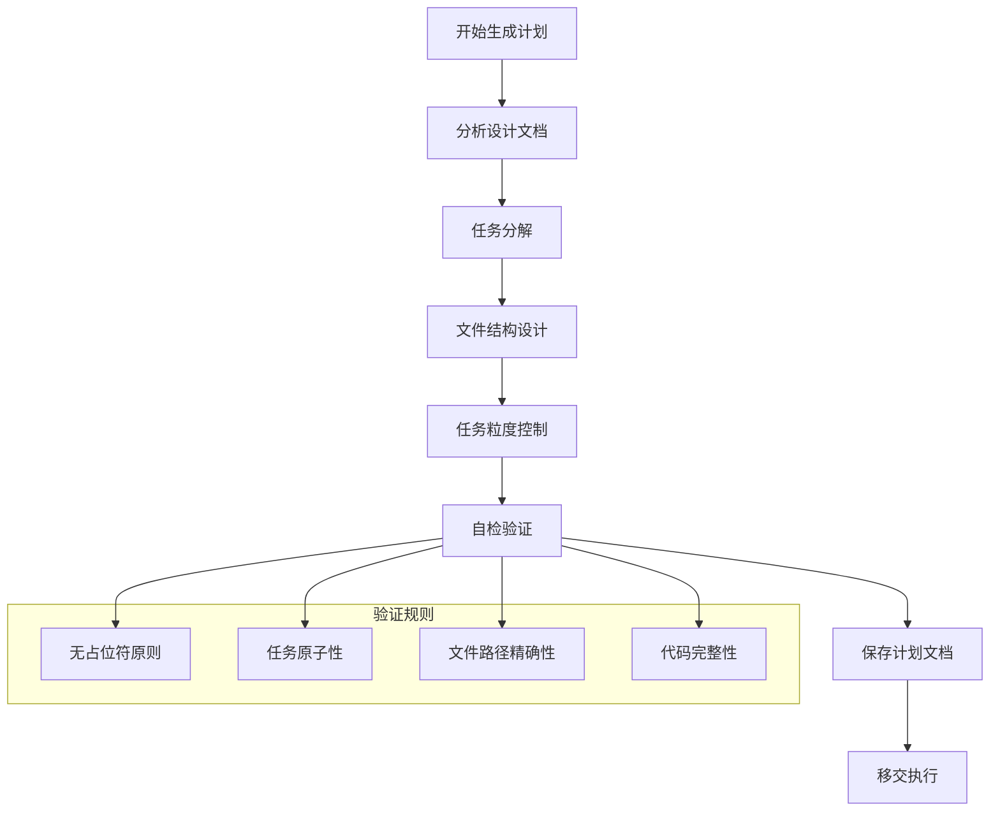
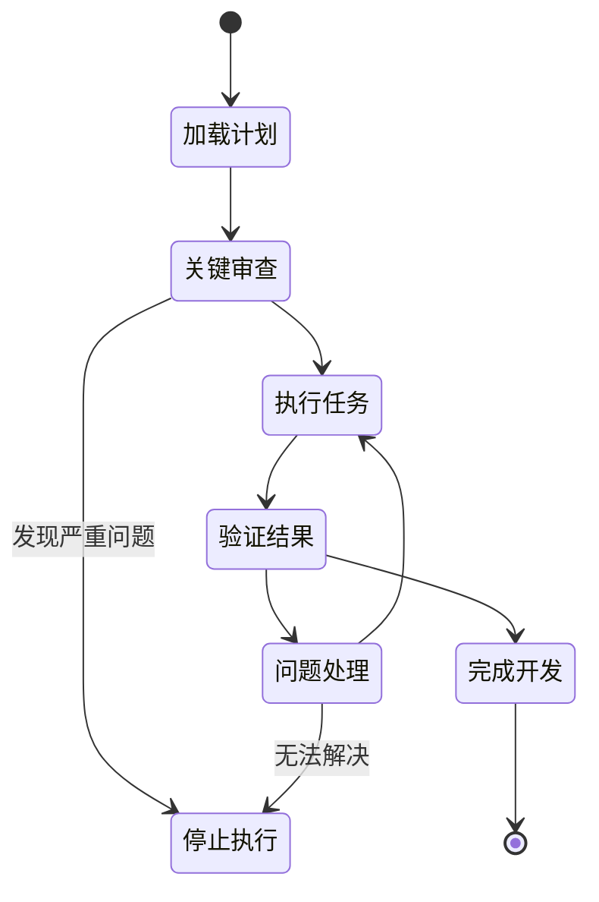
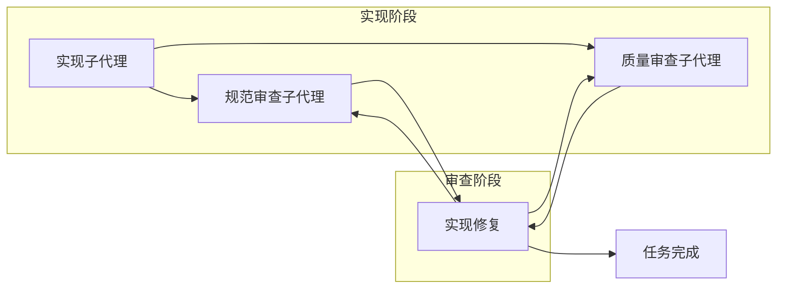
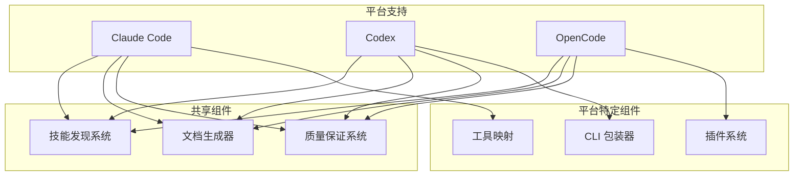
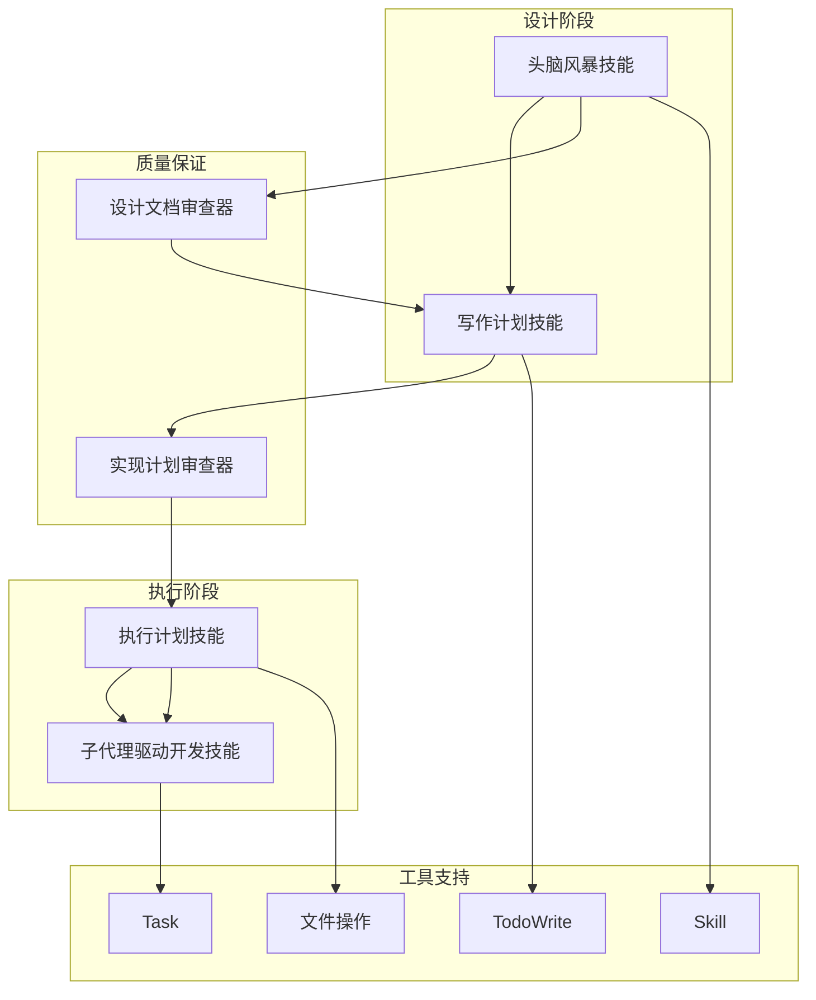

# 文档生成工作流

<cite>
**本文档引用的文件**
- [commands/brainstorm.md](file://commands/brainstorm.md)
- [commands/write-plan.md](file://commands/write-plan.md)
- [commands/execute-plan.md](file://commands/execute-plan.md)
- [skills/brainstorming/SKILL.md](file://skills/brainstorming/SKILL.md)
- [skills/writing-plans/SKILL.md](file://skills/writing-plans/SKILL.md)
- [skills/executing-plans/SKILL.md](file://skills/executing-plans/SKILL.md)
- [skills/subagent-driven-development/SKILL.md](file://skills/subagent-driven-development/SKILL.md)
- [skills/writing-skills/SKILL.md](file://skills/writing-skills/SKILL.md)
- [skills/brainstorming/scripts/frame-template.html](file://skills/brainstorming/scripts/frame-template.html)
- [skills/writing-skills/render-graphs.js](file://skills/writing-skills/render-graphs.js)
- [docs/README.codex.md](file://docs/README.codex.md)
- [docs/README.opencode.md](file://docs/README.opencode.md)
- [docs/plans/2025-11-22-opencode-support-design.md](file://docs/plans/2025-11-22-opencode-support-design.md)
- [docs/superpowers/specs/2026-01-22-document-review-system-design.md](file://docs/superpowers/specs/2026-01-22-document-review-system-design.md)
</cite>

## 目录
1. [简介](#简介)
2. [项目结构](#项目结构)
3. [核心组件](#核心组件)
4. [架构概览](#架构概览)
5. [详细组件分析](#详细组件分析)
6. [依赖关系分析](#依赖关系分析)
7. [性能考虑](#性能考虑)
8. [故障排除指南](#故障排除指南)
9. [结论](#结论)

## 简介

Superpowers 是一个面向多平台的智能体技能框架，专注于文档生成工作流的自动化和标准化。该工作流通过"头脑风暴设计文档 → 实现计划文档 → 最终代码文档"的三阶段流程，确保每个开发任务都经过充分的设计验证和质量保证。

本系统的核心价值在于：
- **标准化文档生成流程**：从需求收集到最终实现的完整生命周期管理
- **多平台兼容性**：支持 Claude Code、Codex 和 OpenCode 等不同平台
- **自动化质量控制**：通过审查循环确保文档质量和一致性
- **可扩展模板系统**：支持自定义模板和扩展点

## 项目结构

Superpowers 采用模块化的项目结构，围绕文档生成工作流组织各个组件：



**图表来源**
- [commands/brainstorm.md:1-6](file://commands/brainstorm.md#L1-L6)
- [skills/brainstorming/SKILL.md:1-165](file://skills/brainstorming/SKILL.md#L1-L165)
- [skills/writing-plans/SKILL.md:1-153](file://skills/writing-plans/SKILL.md#L1-L153)

**章节来源**
- [commands/brainstorm.md:1-6](file://commands/brainstorm.md#L1-L6)
- [commands/write-plan.md:1-6](file://commands/write-plan.md#L1-L6)
- [commands/execute-plan.md:1-6](file://commands/execute-plan.md#L1-L6)

## 核心组件

### 文档生成工作流引擎

文档生成工作流由五个核心技能组成，每个技能都有明确的职责和输出规范：

| 技能名称 | 职责 | 输出类型 | 触发条件 |
|---------|------|----------|----------|
| brainstorming | 需求分析和设计验证 | 设计文档 | 需要新功能或修改时 |
| writing-plans | 实现计划制定 | 实施计划文档 | 设计获得批准后 |
| executing-plans | 计划执行监督 | 工作进度报告 | 计划文档完成时 |
| subagent-driven-development | 子代理驱动开发 | 代码实现 | 有具体实现任务时 |
| writing-skills | 技能文档编写 | 技能参考文档 | 需要创建新技能时 |

### 模板系统架构

系统采用基于 YAML 前言标记的模板系统，支持动态内容填充和格式化：



**图表来源**
- [skills/writing-skills/SKILL.md:95-137](file://skills/writing-skills/SKILL.md#L95-L137)

**章节来源**
- [skills/writing-skills/SKILL.md:93-137](file://skills/writing-skills/SKILL.md#L93-L137)

## 架构概览

Superpowers 的文档生成架构采用分层设计，确保各组件间的松耦合和高内聚：



**图表来源**
- [skills/brainstorming/SKILL.md:34-66](file://skills/brainstorming/SKILL.md#L34-L66)
- [skills/writing-plans/SKILL.md:134-153](file://skills/writing-plans/SKILL.md#L134-L153)

## 详细组件分析

### 头脑风暴设计文档生成器

头脑风暴技能是整个文档生成工作流的起点，负责将用户的想法转化为正式的设计文档。

#### 核心流程



**图表来源**
- [skills/brainstorming/SKILL.md:20-32](file://skills/brainstorming/SKILL.md#L20-L32)
- [skills/brainstorming/SKILL.md:133-136](file://skills/brainstorming/SKILL.md#L133-L136)

#### 设计文档模板

设计文档采用标准化的 YAML 前言标记格式：

```yaml
---
title: "功能名称设计"
date: YYYY-MM-DD
author: 作者
status: 设计状态
---

# 功能名称设计

## 概述

简要描述功能目标和预期成果。

## 背景

说明需求产生的背景和原因。

## 架构

描述系统的整体架构和组件关系。

## 实现方案

列出多个可选的实现方案及其优缺点。

## 决策

记录最终选择的方案和决策依据。

## 后续步骤

规划下一步的工作安排。
```

**章节来源**
- [skills/brainstorming/SKILL.md:107-131](file://skills/brainstorming/SKILL.md#L107-L131)

### 实现计划文档生成器

实现计划技能将设计文档转化为可执行的实施计划，确保每个任务都有明确的交付标准。

#### 计划文档结构



**图表来源**
- [skills/writing-plans/SKILL.md:63-104](file://skills/writing-plans/SKILL.md#L63-L104)

#### 任务模板

每个任务都遵循严格的模板格式：

```markdown
### 任务编号: 组件名称

**文件:**
- 创建: `文件路径`
- 修改: `文件路径:行号范围`
- 测试: `测试文件路径`

- [ ] **步骤 1: 具体操作描述**

```代码语言
# 完整的代码示例
```

- [ ] **步骤 2: 验证操作**

运行: `验证命令`
期望: `预期结果`
```

**章节来源**
- [skills/writing-plans/SKILL.md:63-104](file://skills/writing-plans/SKILL.md#L63-L104)

### 执行监控协调器

执行监控技能负责监督计划的执行过程，确保每个任务都按要求完成。

#### 执行流程



**图表来源**
- [skills/executing-plans/SKILL.md:16-38](file://skills/executing-plans/SKILL.md#L16-L38)

**章节来源**
- [skills/executing-plans/SKILL.md:16-38](file://skills/executing-plans/SKILL.md#L16-L38)

### 子代理驱动开发系统

子代理驱动开发技能利用多个专门的子代理来并行执行不同的开发任务，提高效率和质量。

#### 子代理协作模式



**图表来源**
- [skills/subagent-driven-development/SKILL.md:42-84](file://skills/subagent-driven-development/SKILL.md#L42-L84)

**章节来源**
- [skills/subagent-driven-development/SKILL.md:42-84](file://skills/subagent-driven-development/SKILL.md#L42-L84)

### 技能文档编写器

技能文档编写器专门用于创建和维护技能参考文档，确保技能的可发现性和可用性。

#### 技能文档标准

技能文档遵循严格的标准格式：

```markdown
---
name: 技能名称
description: 使用条件 - 技能作用
---

# 技能名称

## 概述

技能的核心原理和适用场景。

## 使用条件

- 条件 1
- 条件 2
- 条件 3

## 核心模式

对比实现前后的代码示例。

## 快速参考

表格或要点形式的常用操作。

## 实现

简单模式的内联代码
或指向工具文件的链接

## 常见错误

可能的问题和解决方案。

## 实际影响

具体的成果和收益。
```

**章节来源**
- [skills/writing-skills/SKILL.md:93-137](file://skills/writing-skills/SKILL.md#L93-L137)

## 依赖关系分析

### 平台集成依赖

Superpowers 支持多个平台，每个平台都有特定的集成要求：



**图表来源**
- [docs/README.codex.md:50-58](file://docs/README.codex.md#L50-L58)
- [docs/README.opencode.md:91-106](file://docs/README.opencode.md#L91-L106)

### 技能间依赖关系

各个技能之间存在明确的依赖关系和调用顺序：



**图表来源**
- [docs/superpowers/specs/2026-01-22-document-review-system-design.md:81-85](file://docs/superpowers/specs/2026-01-22-document-review-system-design.md#L81-L85)

**章节来源**
- [docs/superpowers/specs/2026-01-22-document-review-system-design.md:81-85](file://docs/superpowers/specs/2026-01-22-document-review-system-design.md#L81-L85)

## 性能考虑

### 文档生成性能优化

系统在文档生成过程中采用了多项性能优化策略：

1. **增量生成**：只重新生成变更的部分，避免全量重建
2. **并行处理**：子代理系统支持并行执行多个任务
3. **缓存机制**：重复使用的模板和配置进行缓存
4. **内存管理**：大型文档分块处理，避免内存溢出

### 平台性能差异

不同平台在文档生成性能上存在差异：

| 平台特性 | 性能特点 | 优化建议 |
|----------|----------|----------|
| Claude Code | 高性能，支持子代理 | 充分利用子代理能力 |
| Codex | 基于 CLI，轻量级 | 优化命令执行效率 |
| OpenCode | 插件系统，功能丰富 | 利用原生工具减少转换 |

## 故障排除指南

### 常见问题及解决方案

#### 文档生成失败

**问题症状**：文档生成过程中出现错误或中断

**可能原因**：
1. 模板语法错误
2. 缺少必要的前置条件
3. 平台兼容性问题
4. 内存不足

**解决步骤**：
1. 检查模板文件的 YAML 前言标记
2. 验证前置技能是否正确执行
3. 确认平台支持情况
4. 增加系统内存或优化模板复杂度

#### 审查循环卡住

**问题症状**：设计或计划审查循环无法正常结束

**解决方法**：
1. 检查审查器输出格式是否符合预期
2. 验证问题修复的有效性
3. 设置合理的迭代上限
4. 在必要时人工介入决策

#### 平台集成问题

**问题症状**：技能在特定平台上无法正常工作

**排查步骤**：
1. 验证平台的技能发现机制
2. 检查工具映射配置
3. 确认权限设置
4. 查看平台日志信息

**章节来源**
- [docs/README.codex.md:111-127](file://docs/README.codex.md#L111-L127)
- [docs/README.opencode.md:107-131](file://docs/README.opencode.md#L107-L131)

## 结论

Superpowers 的文档生成工作流通过标准化的设计、实现和质量保证流程，为多平台环境下的文档生成提供了完整的解决方案。该系统的核心优势包括：

1. **完整的生命周期管理**：从需求收集到最终实现的全流程覆盖
2. **高质量保证**：通过多层次的审查和验证确保文档质量
3. **平台无关性**：统一的架构设计支持多个平台的无缝集成
4. **可扩展性**：模块化的组件设计便于功能扩展和定制

未来的发展方向包括：
- 进一步优化性能和资源利用率
- 增强 AI 辅助的智能文档生成
- 扩展更多平台的支持
- 提供更丰富的模板和自定义选项

通过持续的改进和完善，Superpowers 将成为文档生成领域的重要工具和参考标准。