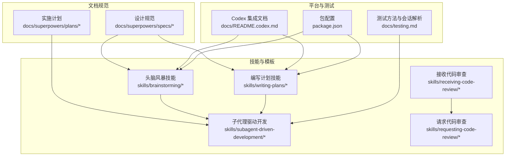
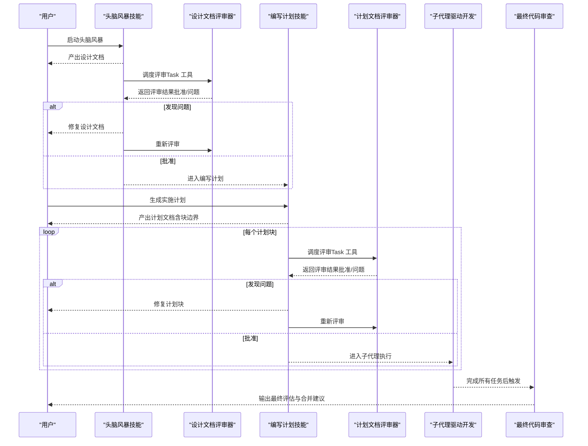
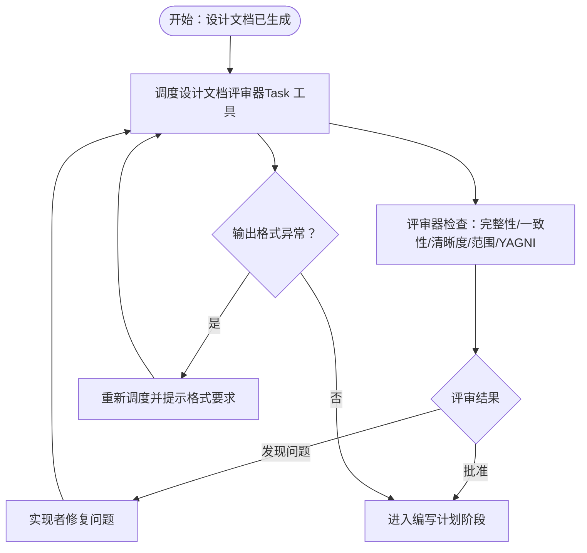
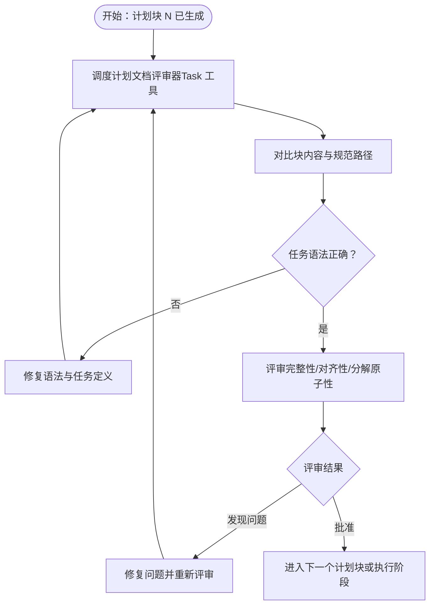
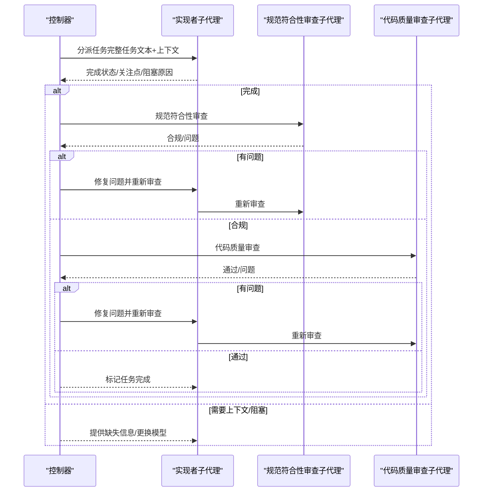
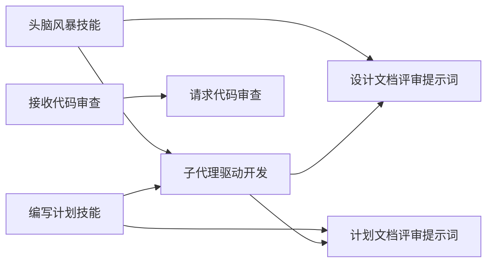

# 文档管理系统

<cite>
**本文档中引用的文件**
- [2026-01-22-document-review-system-design.md](file://docs/superpowers/specs/2026-01-22-document-review-system-design.md)
- [spec-document-reviewer-prompt.md](file://skills/brainstorming/spec-document-reviewer-prompt.md)
- [plan-document-reviewer-prompt.md](file://skills/writing-plans/plan-document-reviewer-prompt.md)
- [2026-01-22-document-review-system.md](file://docs/superpowers/plans/2026-01-22-document-review-system.md)
- [SKILL.md（头脑风暴）](file://skills/brainstorming/SKILL.md)
- [SKILL.md（编写计划）](file://skills/writing-plans/SKILL.md)
- [SKILL.md（子代理驱动开发）](file://skills/subagent-driven-development/SKILL.md)
- [SKILL.md（接收代码审查）](file://skills/receiving-code-review/SKILL.md)
- [code-reviewer.md](file://skills/requesting-code-review/code-reviewer.md)
- [2026-01-22-document-review-system.md（计划）](file://docs/superpowers/plans/2026-01-22-document-review-system.md)
- [README.md（项目总览）](file://README.md)
- [README.codex.md](file://docs/README.codex.md)
- [testing.md](file://docs/testing.md)
- [package.json](file://package.json)
</cite>

## 目录
1. [简介](#简介)
2. [项目结构](#项目结构)
3. [核心组件](#核心组件)
4. [架构概览](#架构概览)
5. [详细组件分析](#详细组件分析)
6. [依赖分析](#依赖分析)
7. [性能考虑](#性能考虑)
8. [故障排除指南](#故障排除指南)
9. [结论](#结论)
10. [附录](#附录)

## 简介
本文件面向 Superpowers 的文档管理系统，聚焦“设计文档、实现计划与评审文档”的生成、存储与版本控制机制；系统化阐述文档模板体系、文档生成流程、文档审查机制以及文档间引用关系、依赖管理与一致性校验；同时给出 API 接口、数据模型与存储策略建议，并记录系统的扩展能力（自定义模板与审查规则）。

Superpowers 的文档管理以“技能（Skill）”为核心载体，通过 Markdown 技能文件组织知识与流程，结合子代理（Subagent）与任务工具（Task tool）完成文档的自动化生成、迭代与审查闭环。文档生命周期贯穿“头脑风暴 → 设计文档 → 规划评审 → 实施计划 → 计划评审 → 实施执行 → 最终审查”。

## 项目结构
- 文档规范与计划
  - 设计规范：docs/superpowers/specs 下存放设计文档，如“文档评审系统设计”
  - 实施计划：docs/superpowers/plans 下存放可执行计划，如“文档评审系统实施计划”
- 技能与评审模板
  - 头脑风暴技能：skills/brainstorming，包含设计文档评审提示词模板
  - 编写计划技能：skills/writing-plans，包含计划文档评审提示词模板
  - 子代理驱动开发：skills/subagent-driven-development，负责按任务调度子代理进行两阶段审查
  - 接收代码审查：skills/receiving-code-review，规范外部反馈处理流程
  - 请求代码审查：skills/requesting-code-review，提供代码审查模板
- 平台集成与测试
  - Codex 集成文档：docs/README.codex.md
  - 测试方法与会话解析：docs/testing.md
  - 包配置：package.json

图表来源
- [2026-01-22-document-review-system-design.md:1-137](file://docs/superpowers/specs/2026-01-22-document-review-system-design.md#L1-L137)
- [spec-document-reviewer-prompt.md:1-50](file://skills/brainstorming/spec-document-reviewer-prompt.md#L1-L50)
- [plan-document-reviewer-prompt.md:1-50](file://skills/writing-plans/plan-document-reviewer-prompt.md#L1-L50)
- [2026-01-22-document-review-system.md:1-302](file://docs/superpowers/plans/2026-01-22-document-review-system.md#L1-L302)
- [SKILL.md（头脑风暴）:1-165](file://skills/brainstorming/SKILL.md#L1-L165)
- [SKILL.md（编写计划）:1-153](file://skills/writing-plans/SKILL.md#L1-L153)
- [SKILL.md（子代理驱动开发）:1-278](file://skills/subagent-driven-development/SKILL.md#L1-L278)
- [SKILL.md（接收代码审查）:1-214](file://skills/receiving-code-review/SKILL.md#L1-L214)
- [code-reviewer.md:1-147](file://skills/requesting-code-review/code-reviewer.md#L1-L147)
- [README.codex.md:1-127](file://docs/README.codex.md#L1-L127)
- [testing.md:1-304](file://docs/testing.md#L1-L304)
- [package.json:1-7](file://package.json#L1-L7)

章节来源
- [README.md（项目总览）:1-191](file://README.md#L1-L191)
- [README.codex.md:1-127](file://docs/README.codex.md#L1-L127)
- [testing.md:1-304](file://docs/testing.md#L1-L304)
- [package.json:1-7](file://package.json#L1-L7)

## 核心组件
- 设计文档评审器（头脑风暴技能）
  - 作用：在设计文档完成后进行完整性、一致性、清晰度与范围检查，确保进入规划阶段前的设计质量
  - 关键点：使用 Task 工具以 general-purpose 子代理执行评审；支持评审循环直至批准；输出包含状态、问题清单与建议
- 计划文档评审器（编写计划技能）
  - 作用：在每个计划“块”（Chunk）完成后进行完整性、与规范对齐性、任务分解原子性与语法正确性检查
  - 关键点：计划块以“## Chunk N: <name>”分隔；评审器读取当前块与规范路径进行比对；支持块级评审循环
- 子代理驱动开发（两阶段审查）
  - 作用：每项任务后先进行“规范符合性审查”，再进行“代码质量审查”，形成快速迭代闭环
  - 关键点：实现者子代理完成后进行自我审查；规范审查独立于实现报告；质量审查决定是否批准进入下一任务
- 接收代码审查与请求代码审查
  - 作用：规范化外部反馈处理与代码审查输出格式，确保技术严谨性与可追溯性
- 文档生成与存储
  - 作用：通过技能文件生成设计与计划文档，遵循统一命名与目录结构，便于版本控制与检索

章节来源
- [2026-01-22-document-review-system-design.md:1-137](file://docs/superpowers/specs/2026-01-22-document-review-system-design.md#L1-L137)
- [spec-document-reviewer-prompt.md:1-50](file://skills/brainstorming/spec-document-reviewer-prompt.md#L1-L50)
- [plan-document-reviewer-prompt.md:1-50](file://skills/writing-plans/plan-document-reviewer-prompt.md#L1-L50)
- [SKILL.md（子代理驱动开发）:1-278](file://skills/subagent-driven-development/SKILL.md#L1-L278)
- [SKILL.md（接收代码审查）:1-214](file://skills/receiving-code-review/SKILL.md#L1-L214)
- [code-reviewer.md:1-147](file://skills/requesting-code-review/code-reviewer.md#L1-L147)

## 架构概览
文档管理采用“技能即流程”的架构，围绕以下关键流程展开：

图表来源
- [2026-01-22-document-review-system-design.md:81-98](file://docs/superpowers/specs/2026-01-22-document-review-system-design.md#L81-L98)
- [spec-document-reviewer-prompt.md:9-47](file://skills/brainstorming/spec-document-reviewer-prompt.md#L9-L47)
- [plan-document-reviewer-prompt.md:9-46](file://skills/writing-plans/plan-document-reviewer-prompt.md#L9-L46)
- [SKILL.md（编写计划）:223-237](file://skills/writing-plans/SKILL.md#L223-L237)
- [SKILL.md（子代理驱动开发）:42-84](file://skills/subagent-driven-development/SKILL.md#L42-L84)

## 详细组件分析

### 组件A：设计文档评审器（头脑风暴技能）
- 功能职责
  - 在设计文档完成后进行完整性、覆盖度、一致性、清晰度与范围检查
  - 使用 Task 工具以 general-purpose 子代理执行评审
  - 支持评审循环：发现问题 → 修复 → 重新评审 → 直至批准
- 输出格式
  - 状态：批准或发现问题
  - 问题清单：定位到具体章节与影响说明
  - 建议：非阻塞性改进建议
- 错误处理
  - 循环超过阈值时向上游人类用户汇报
  - 对评审器输出格式异常进行验证与重发
  - 当出现持续分歧时，允许实现者解释并必要时升级至人类裁决

图表来源
- [2026-01-22-document-review-system-design.md:111-127](file://docs/superpowers/specs/2026-01-22-document-review-system-design.md#L111-L127)
- [spec-document-reviewer-prompt.md:9-47](file://skills/brainstorming/spec-document-reviewer-prompt.md#L9-L47)

章节来源
- [2026-01-22-document-review-system-design.md:12-41](file://docs/superpowers/specs/2026-01-22-document-review-system-design.md#L12-L41)
- [spec-document-reviewer-prompt.md:1-50](file://skills/brainstorming/spec-document-reviewer-prompt.md#L1-L50)

### 组件B：计划文档评审器（编写计划技能）
- 功能职责
  - 在每个计划块完成后进行完整性、与规范对齐性、任务分解原子性与语法正确性检查
  - 评审器同时接收当前块内容与规范路径，进行对照验证
  - 支持块级评审循环：发现问题 → 修复 → 重新评审 → 直至批准
- 块边界与大小
  - 使用“## Chunk N: <name>”作为逻辑分隔符
  - 每个块应自包含且不超过指定行数（例如 1000 行）
- 输出格式
  - 状态：批准或发现问题
  - 问题清单：定位到具体任务与步骤
  - 建议：非阻塞性改进建议

图表来源
- [2026-01-22-document-review-system-design.md:71-77](file://docs/superpowers/specs/2026-01-22-document-review-system-design.md#L71-L77)
- [plan-document-reviewer-prompt.md:9-46](file://skills/writing-plans/plan-document-reviewer-prompt.md#L9-L46)
- [SKILL.md（编写计划）:223-237](file://skills/writing-plans/SKILL.md#L223-L237)

章节来源
- [2026-01-22-document-review-system-design.md:45-78](file://docs/superpowers/specs/2026-01-22-document-review-system-design.md#L45-L78)
- [plan-document-reviewer-prompt.md:1-50](file://skills/writing-plans/plan-document-reviewer-prompt.md#L1-L50)
- [SKILL.md（编写计划）:223-237](file://skills/writing-plans/SKILL.md#L223-L237)

### 组件C：子代理驱动开发（两阶段审查）
- 功能职责
  - 每个任务完成后先进行“规范符合性审查”，再进行“代码质量审查”
  - 实现者子代理完成任务后进行自我审查；规范审查独立于实现报告
  - 支持审查循环：发现问题 → 实现者修复 → 重新审查 → 直至批准
- 模型选择
  - 根据任务复杂度选择不同能力级别的模型，以平衡成本与速度
- 风险控制
  - 严禁跳过任一审查阶段；若实现者状态异常需调整上下文或模型
  - 严格禁止并行实现多个子代理（避免冲突）

图表来源
- [SKILL.md（子代理驱动开发）:42-84](file://skills/subagent-driven-development/SKILL.md#L42-L84)
- [SKILL.md（子代理驱动开发）:102-118](file://skills/subagent-driven-development/SKILL.md#L102-L118)

章节来源
- [SKILL.md（子代理驱动开发）:1-278](file://skills/subagent-driven-development/SKILL.md#L1-L278)

### 组件D：接收与请求代码审查
- 接收代码审查
  - 强调“验证优先、技术优先”，对外部反馈进行系统性评估
  - 明确不可接受的响应模式，建立澄清与验证流程
- 请求代码审查
  - 提供标准化输出格式，涵盖优势、问题（按严重程度分级）、建议与评估结论
  - 强调可验证性与可追溯性（文件:行引用、修复方案）

章节来源
- [SKILL.md（接收代码审查）:1-214](file://skills/receiving-code-review/SKILL.md#L1-L214)
- [code-reviewer.md:1-147](file://skills/requesting-code-review/code-reviewer.md#L1-L147)

### 组件E：文档生成与存储策略
- 生成位置与命名
  - 设计文档：docs/superpowers/specs/YYYY-MM-DD-<topic>-design.md
  - 实施计划：docs/superpowers/plans/YYYY-MM-DD-<feature-name>.md
- 版本控制
  - 每次生成与修复均提交到 Git，保留完整历史
  - Codex 平台通过符号链接实现技能发现与自动更新
- 一致性检查
  - 设计文档自审清单：占位符扫描、内部一致性、范围检查、歧义检查
  - 计划文档自审清单：规范覆盖、占位符扫描、类型一致性

章节来源
- [SKILL.md（头脑风暴）:109-131](file://skills/brainstorming/SKILL.md#L109-L131)
- [SKILL.md（编写计划）:122-132](file://skills/writing-plans/SKILL.md#L122-L132)
- [README.codex.md:50-58](file://docs/README.codex.md#L50-L58)

## 依赖分析
- 技能内聚与耦合
  - 设计文档评审器与编写计划评审器分别位于不同技能目录，职责清晰、低耦合
  - 子代理驱动开发作为执行层，依赖评审器提供的输入与输出约定
- 外部依赖
  - 平台：Codex 通过符号链接加载技能；Claude Code/其他平台通过插件市场或本地安装
  - 工具：Task 工具用于子代理调度；Git 用于版本控制与工作树隔离
- 可能的循环依赖
  - 评审器仅读取文档内容与规范路径，不直接修改其他技能文件，避免循环依赖

图表来源
- [spec-document-reviewer-prompt.md:1-50](file://skills/brainstorming/spec-document-reviewer-prompt.md#L1-L50)
- [plan-document-reviewer-prompt.md:1-50](file://skills/writing-plans/plan-document-reviewer-prompt.md#L1-L50)
- [SKILL.md（子代理驱动开发）:120-125](file://skills/subagent-driven-development/SKILL.md#L120-L125)

章节来源
- [README.md（项目总览）:108-125](file://README.md#L108-L125)
- [README.codex.md:50-58](file://docs/README.codex.md#L50-L58)

## 性能考虑
- 成本优化
  - 根据任务复杂度选择模型等级，避免过度计算
  - 评审循环尽早暴露问题，降低后期返工成本
- 效率提升
  - 子代理一次性提供完整任务文本与上下文，减少重复读取
  - 两阶段审查自动触发，减少人工干预
- 可观测性
  - 会话转储与令牌分析工具可用于成本与性能监控

章节来源
- [SKILL.md（子代理驱动开发）:87-101](file://skills/subagent-driven-development/SKILL.md#L87-L101)
- [docs/testing.md:137-177](file://docs/testing.md#L137-L177)

## 故障排除指南
- 评审循环无进展
  - 检查评审器输出格式是否符合预期；必要时重新调度并提示格式要求
  - 若循环超过阈值，向上游人类用户汇报并寻求决策
- 子代理状态异常
  - NEEDS_CONTEXT：补充缺失上下文后重新分派
  - BLOCKED：根据阻塞原因调整模型或拆分任务
- 外部反馈处理
  - 对不确定或技术上不正确的建议进行验证后再实施
  - 必要时与人类伙伴讨论架构一致性

章节来源
- [2026-01-22-document-review-system-design.md:111-127](file://docs/superpowers/specs/2026-01-22-document-review-system-design.md#L111-L127)
- [SKILL.md（子代理驱动开发）:102-118](file://skills/subagent-driven-development/SKILL.md#L102-L118)
- [SKILL.md（接收代码审查）:68-86](file://skills/receiving-code-review/SKILL.md#L68-L86)

## 结论
Superpowers 的文档管理系统通过“技能即流程”的方式，将设计文档与实施计划的生成、评审与执行整合为可自动化、可审计、可扩展的工作流。评审器以标准化提示词与输出格式保障质量一致性，子代理驱动开发提供高效的两阶段审查闭环。配合版本控制与平台集成，系统实现了从创意到交付的全链路文档治理。

## 附录

### API 接口与数据模型（建议）
- 接口建议
  - 文档生成接口：POST /api/docs/generate（输入：技能名称、上下文、模板参数；输出：生成的文档路径）
  - 文档评审接口：POST /api/docs/review（输入：文档路径、评审类型、参考规范；输出：评审结果与问题清单）
  - 评审循环接口：POST /api/docs/review-loop（输入：文档路径、评审类型、修复后的文档；输出：最终批准或问题列表）
- 数据模型
  - 文档实体：包含标题、作者、创建时间、最后修改时间、状态（草稿/待审/批准）、关联规范路径
  - 评审实体：包含评审类型、评审者、状态（通过/未通过）、问题清单、建议、输出格式
  - 任务实体：用于计划文档中的任务与步骤，支持复选框语法与文件引用

### 存储策略
- 文件系统存储
  - 设计文档与计划文档按日期与主题命名，统一存放在 docs/superpowers/specs 与 docs/superpowers/plans
  - 技能提示词与说明文档存放在对应技能目录下
- 版本控制
  - 每次生成与修复均提交到 Git，保留完整历史
  - 工作树隔离用于并行开发与评审

### 扩展能力
- 自定义模板
  - 新增评审提示词：在相应技能目录下创建新的提示词文件，遵循现有输出格式
  - 新增评审规则：在评审器提示词中增加检查项与校准说明
- 审查规则
  - 可通过修改提示词中的“检查项”与“校准”部分，调整审查重点与容忍度
  - 支持针对不同领域（如安全性、性能、可维护性）定制专项评审器

章节来源
- [2026-01-22-document-review-system.md（计划）:1-302](file://docs/superpowers/plans/2026-01-22-document-review-system.md#L1-L302)
- [spec-document-reviewer-prompt.md:1-50](file://skills/brainstorming/spec-document-reviewer-prompt.md#L1-L50)
- [plan-document-reviewer-prompt.md:1-50](file://skills/writing-plans/plan-document-reviewer-prompt.md#L1-L50)