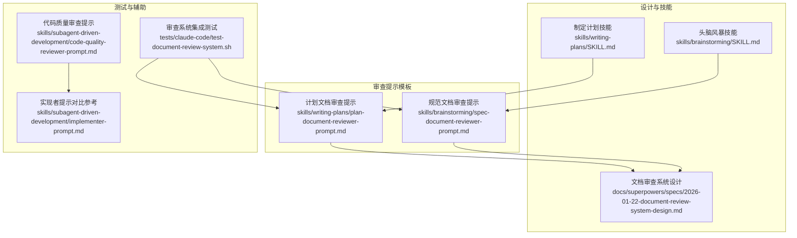
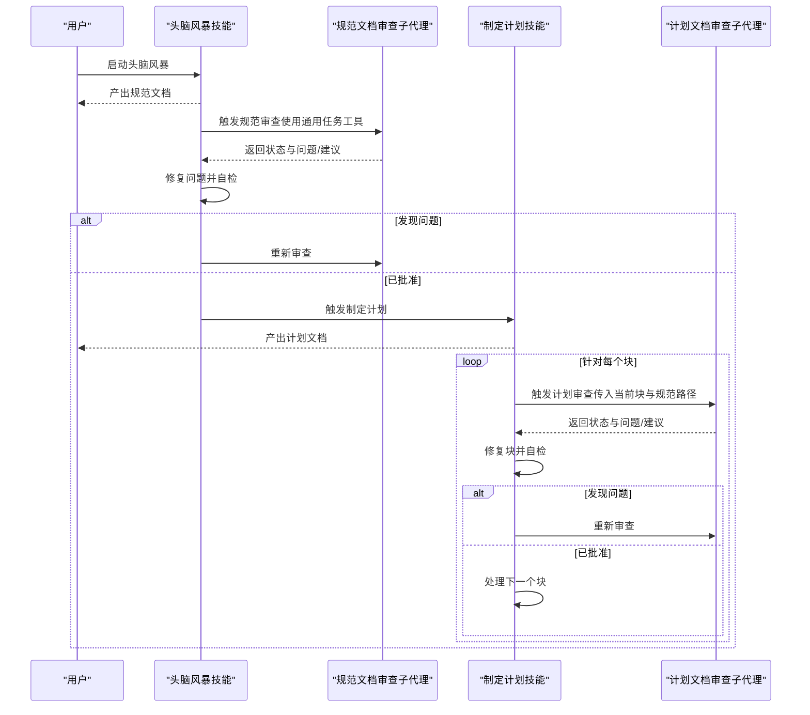
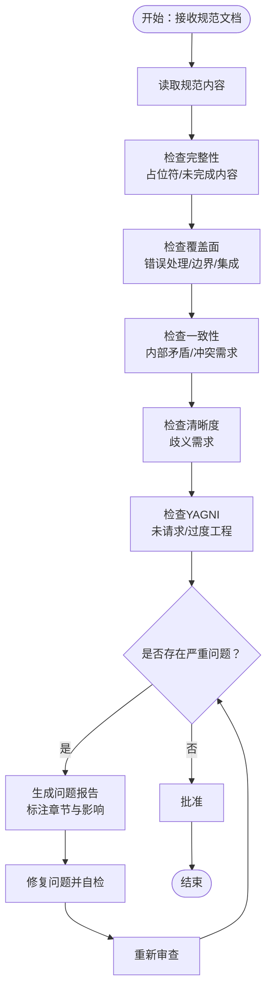
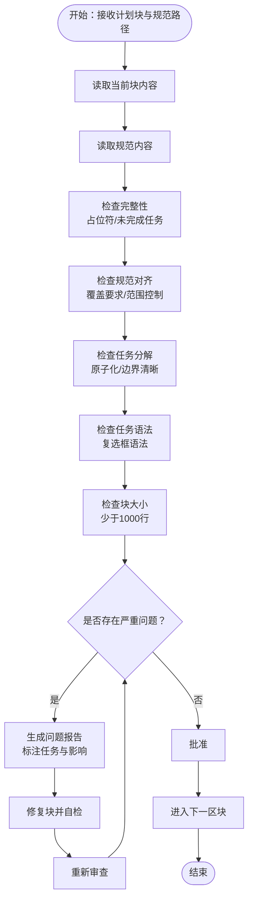
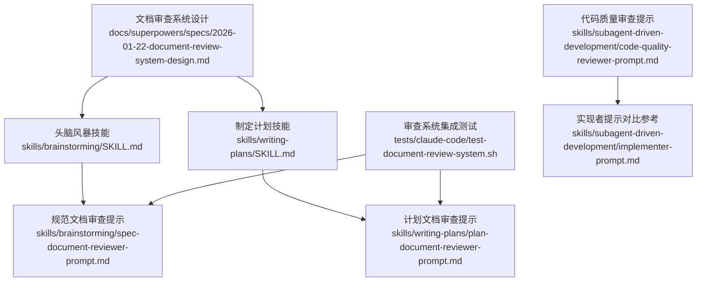

# 规范文档审查系统

<cite>
**本文档引用的文件**
- [spec-document-reviewer-prompt.md](file://skills/brainstorming/spec-document-reviewer-prompt.md)
- [plan-document-reviewer-prompt.md](file://skills/writing-plans/plan-document-reviewer-prompt.md)
- [2026-01-22-document-review-system-design.md](file://docs/superpowers/specs/2026-01-22-document-review-system-design.md)
- [SKILL.md（头脑风暴）](file://skills/brainstorming/SKILL.md)
- [SKILL.md（制定计划）](file://skills/writing-plans/SKILL.md)
- [test-document-review-system.sh](file://tests/claude-code/test-document-review-system.sh)
- [code-quality-reviewer-prompt.md](file://skills/subagent-driven-development/code-quality-reviewer-prompt.md)
- [implementer-prompt.md](file://skills/subagent-driven-development/implementer-prompt.md)
- [2026-01-22-document-review-system-design.md](file://docs/superpowers/specs/2026-01-22-document-review-system-design.md)
- [code-reviewer.md](file://agents/code-reviewer.md)
</cite>

## 目录
1. [简介](#简介)
2. [项目结构](#项目结构)
3. [核心组件](#核心组件)
4. [架构概览](#架构概览)
5. [详细组件分析](#详细组件分析)
6. [依赖关系分析](#依赖关系分析)
7. [性能考虑](#性能考虑)
8. [故障排除指南](#故障排除指南)
9. [结论](#结论)
10. [附录](#附录)

## 简介
本文件为规范文档审查系统的完整技术文档，面向希望在 Superpowers 工作流中引入两阶段文档审查（规范文档审查与计划文档审查）的团队与个人。系统通过子代理（Subagent）驱动的自动化流程，确保设计与实现前的规范性、一致性与可执行性，降低返工风险并提升交付质量。

系统目标：
- 在“头脑风暴”后增加“规范文档审查”，确保设计完整、一致且可规划
- 在“制定计划”后增加“计划文档审查”，确保计划可执行、任务边界清晰、与规范对齐
- 建立可迭代的审查循环：发现问题 → 修复 → 再审查 → 直至批准
- 提供标准化输出格式与质量评估机制，便于后续处理与归档

## 项目结构
该系统由以下关键部分组成：
- 审查提示模板：分别定义规范文档审查与计划文档审查的职责、检查清单与输出格式
- 设计文档：明确审查流程、错误处理策略与工作流集成点
- 技能文档：定义头脑风暴与制定计划技能中的审查触发点与后续动作
- 测试脚本：验证审查器能否正确识别占位符、延迟实现与格式问题
- 子代理提示模板：为实现阶段的规范符合性与代码质量审查提供指导

图表来源
- [spec-document-reviewer-prompt.md:1-50](file://skills/brainstorming/spec-document-reviewer-prompt.md#L1-L50)
- [plan-document-reviewer-prompt.md:1-50](file://skills/writing-plans/plan-document-reviewer-prompt.md#L1-L50)
- [2026-01-22-document-review-system-design.md:1-137](file://docs/superpowers/specs/2026-01-22-document-review-system-design.md#L1-L137)
- [SKILL.md（头脑风暴）:1-165](file://skills/brainstorming/SKILL.md#L1-L165)
- [SKILL.md（制定计划）:1-153](file://skills/writing-plans/SKILL.md#L1-L153)
- [test-document-review-system.sh:1-178](file://tests/claude-code/test-document-review-system.sh#L1-L178)
- [code-quality-reviewer-prompt.md:1-27](file://skills/subagent-driven-development/code-quality-reviewer-prompt.md#L1-L27)
- [implementer-prompt.md:1-114](file://skills/subagent-driven-development/implementer-prompt.md#L1-L114)

章节来源
- [2026-01-22-document-review-system-design.md:1-137](file://docs/superpowers/specs/2026-01-22-document-review-system-design.md#L1-L137)
- [SKILL.md（头脑风暴）:1-165](file://skills/brainstorming/SKILL.md#L1-L165)
- [SKILL.md（制定计划）:1-153](file://skills/writing-plans/SKILL.md#L1-L153)

## 核心组件
- 规范文档审查子代理
  - 职责：验证规范是否完整、一致且可规划
  - 检查清单：完整性（占位符、未完成内容）、覆盖面（错误处理、边界情况、集成点）、一致性（内部矛盾、冲突需求）、清晰度（歧义）、YAGNI（未请求功能、过度工程）
  - 输出格式：状态（已批准/发现问题）、问题列表（含定位与影响说明）、建议（不阻塞批准）
  - 迭代机制：发现问题 → 头脑风暴代理修复 → 重新审查 → 直到批准
- 计划文档审查子代理
  - 职责：验证计划是否完整、与规范对齐、任务分解合理
  - 检查清单：完整性（占位符、未完成任务）、规范对齐（覆盖规范要求、无范围蔓延）、任务分解（原子化、清晰边界）、任务语法（复选框语法）、块大小（每块少于1000行）
  - 块级审查：以“## Chunk N: 名称”为界，逐块审查与修复
  - 输出格式：与规范审查一致，但范围限定在当前块
  - 迭代机制：发现问题 → 制定计划代理修复块 → 重新审查 → 直到全部块批准
- 错误处理与争议解决
  - 循环终止：无硬性迭代上限；超过5轮迭代需人工介入
  - 争议处理：审查员为顾问角色，若代理认为反馈有误，应解释原因；持续分歧超过3轮需人工仲裁
  - 输出格式校验：控制器验证审查输出包含必需字段；格式错误超过2次需人工介入

章节来源
- [spec-document-reviewer-prompt.md:1-50](file://skills/brainstorming/spec-document-reviewer-prompt.md#L1-L50)
- [plan-document-reviewer-prompt.md:1-50](file://skills/writing-plans/plan-document-reviewer-prompt.md#L1-L50)
- [2026-01-22-document-review-system-design.md:111-127](file://docs/superpowers/specs/2026-01-22-document-review-system-design.md#L111-L127)

## 架构概览
审查系统采用“子代理 + 可迭代审查循环”的架构，贯穿设计与实现两个阶段：

图表来源
- [2026-01-22-document-review-system-design.md:81-98](file://docs/superpowers/specs/2026-01-22-document-review-system-design.md#L81-L98)
- [spec-document-reviewer-prompt.md:1-50](file://skills/brainstorming/spec-document-reviewer-prompt.md#L1-L50)
- [plan-document-reviewer-prompt.md:1-50](file://skills/writing-plans/plan-document-reviewer-prompt.md#L1-L50)

## 详细组件分析

### 组件A：规范文档审查子代理
- 工作原理
  - 任务分配：通过通用任务工具分发，子代理类型为“general-purpose”
  - 审查逻辑：依据检查清单逐项核对，仅标记会阻碍实施规划的真实问题
  - 输出格式：标准化标题、状态、问题与建议
- 审查标准分类体系
  - 完整性：占位符、未完成内容、缺失章节
  - 覆盖面：错误处理、边界情况、集成点
  - 一致性：内部矛盾、冲突需求
  - 清晰度：需求歧义导致可能构建错误实现
  - YAGNI：未请求功能、过度工程
- 问题识别与标记
  - 关键词检测：如“TODO”、“待定”、“稍后指定”等
  - 结构化定位：问题标注具体章节或区域，说明对规划的影响
- 输出格式与后续处理
  - 标准化字段：状态、问题列表、建议
  - 后续处理：修复后重新提交审查，直至批准

图表来源
- [spec-document-reviewer-prompt.md:17-46](file://skills/brainstorming/spec-document-reviewer-prompt.md#L17-L46)
- [2026-01-22-document-review-system-design.md:18-41](file://docs/superpowers/specs/2026-01-22-document-review-system-design.md#L18-L41)

章节来源
- [spec-document-reviewer-prompt.md:1-50](file://skills/brainstorming/spec-document-reviewer-prompt.md#L1-L50)
- [2026-01-22-document-review-system-design.md:18-41](file://docs/superpowers/specs/2026-01-22-document-review-system-design.md#L18-L41)

### 组件B：计划文档审查子代理
- 工作原理
  - 任务分配：通过通用任务工具分发，子代理类型为“general-purpose”
  - 审查逻辑：对比计划与规范，检查任务分解、语法与可执行性
  - 块级审查：按“## Chunk N: 名称”划分，逐块独立审查
- 审查标准分类体系
  - 完整性：占位符、未完成任务、缺失步骤
  - 规范对齐：覆盖规范要求、无范围蔓延
  - 任务分解：原子化、清晰边界
  - 任务语法：复选框语法
  - 块大小：每块少于1000行
- 问题识别与标记
  - 明确定位：标注“任务X，步骤Y”，说明对实施的影响
  - 与规范对照：指出缺失或多余的规范要求
- 输出格式与后续处理
  - 标准化字段：状态、问题列表、建议
  - 后续处理：修复块后重新审查，直至所有块批准

图表来源
- [plan-document-reviewer-prompt.md:18-46](file://skills/writing-plans/plan-document-reviewer-prompt.md#L18-L46)
- [2026-01-22-document-review-system-design.md:61-78](file://docs/superpowers/specs/2026-01-22-document-review-system-design.md#L61-L78)

章节来源
- [plan-document-reviewer-prompt.md:1-50](file://skills/writing-plans/plan-document-reviewer-prompt.md#L1-L50)
- [2026-01-22-document-review-system-design.md:51-78](file://docs/superpowers/specs/2026-01-22-document-review-system-design.md#L51-L78)

### 组件C：审查流程配置与扩展机制
- 配置选项
  - 审查触发点：头脑风暴完成后触发规范审查；计划完成后逐块触发计划审查
  - 输出格式：统一的“状态、问题、建议”三段式结构
  - 任务语法：计划任务使用复选框语法，便于跟踪与自动化
- 自定义规则
  - 可在审查提示模板中调整检查清单与校准语句，以适配不同项目或领域
  - 可扩展块级审查的命名约定与边界划分策略
- 扩展机制
  - 新增审查子代理：遵循现有提示模板结构，使用通用任务工具分发
  - 与实现阶段审查联动：规范审查通过后才进入计划审查，计划审查通过后才进入实现阶段

章节来源
- [2026-01-22-document-review-system-design.md:81-98](file://docs/superpowers/specs/2026-01-22-document-review-system-design.md#L81-L98)
- [spec-document-reviewer-prompt.md:36-46](file://skills/brainstorming/spec-document-reviewer-prompt.md#L36-L46)
- [plan-document-reviewer-prompt.md:36-46](file://skills/writing-plans/plan-document-reviewer-prompt.md#L36-L46)

### 组件D：审查结果数据格式与后续处理
- 数据格式
  - 规范审查：状态（已批准/发现问题）、问题列表（章节定位与影响说明）、建议（非阻塞性）
  - 计划审查：状态（已批准/发现问题）、问题列表（任务与步骤定位与影响说明）、建议（非阻塞性）
- 后续处理流程
  - 修复与再审查：根据问题列表逐项修复，修复后重新提交审查
  - 人工介入：超过5轮迭代或格式错误超过2次时，需人工决策
  - 争议仲裁：持续分歧超过3轮时，由人工仲裁决定最终状态

章节来源
- [2026-01-22-document-review-system-design.md:111-127](file://docs/superpowers/specs/2026-01-22-document-review-system-design.md#L111-L127)
- [spec-document-reviewer-prompt.md:36-46](file://skills/brainstorming/spec-document-reviewer-prompt.md#L36-L46)
- [plan-document-reviewer-prompt.md:36-46](file://skills/writing-plans/plan-document-reviewer-prompt.md#L36-L46)

## 依赖关系分析
审查系统与现有技能与测试的关系如下：

图表来源
- [SKILL.md（头脑风暴）:1-165](file://skills/brainstorming/SKILL.md#L1-L165)
- [SKILL.md（制定计划）:1-153](file://skills/writing-plans/SKILL.md#L1-L153)
- [2026-01-22-document-review-system-design.md:1-137](file://docs/superpowers/specs/2026-01-22-document-review-system-design.md#L1-L137)
- [test-document-review-system.sh:1-178](file://tests/claude-code/test-document-review-system.sh#L1-L178)
- [code-quality-reviewer-prompt.md:1-27](file://skills/subagent-driven-development/code-quality-reviewer-prompt.md#L1-L27)
- [implementer-prompt.md:1-114](file://skills/subagent-driven-development/implementer-prompt.md#L1-L114)

章节来源
- [2026-01-22-document-review-system-design.md:81-98](file://docs/superpowers/specs/2026-01-22-document-review-system-design.md#L81-L98)
- [test-document-review-system.sh:1-178](file://tests/claude-code/test-document-review-system.sh#L1-L178)

## 性能考虑
- 审查效率
  - 使用块级审查减少单次审查体量，提高可读性与可执行性
  - 标准化输出格式便于自动化解析与归档
- 资源占用
  - 通用任务工具分发子代理，避免重复加载模型
  - 控制器一次性读取计划文件，减少重复IO
- 可扩展性
  - 通过提示模板扩展检查维度，适应不同项目复杂度
  - 支持人工介入阈值与争议仲裁，平衡自动化与可控性

## 故障排除指南
- 审查器未识别占位符或延迟实现
  - 检查审查提示模板中的关键词与上下文匹配
  - 确认测试用例覆盖常见占位符与延迟表述
- 审查输出格式不符合预期
  - 校验控制器对“状态、问题、建议”字段的验证逻辑
  - 若出现格式错误，重新分发审查并提示期望格式
- 审查循环过长或停滞
  - 设置人工介入阈值（如超过5轮迭代）
  - 对持续分歧进行仲裁，必要时回退到上一版本并简化问题

章节来源
- [test-document-review-system.sh:111-150](file://tests/claude-code/test-document-review-system.sh#L111-L150)
- [2026-01-22-document-review-system-design.md:111-127](file://docs/superpowers/specs/2026-01-22-document-review-system-design.md#L111-L127)

## 结论
规范文档审查系统通过“规范审查 + 计划审查”的双阶段自动化流程，结合可迭代的审查循环与标准化输出格式，有效提升了设计与实现前的质量门槛。系统以子代理为核心，配合控制器的分发与校验机制，既保证了自动化效率，又保留了人工干预与争议仲裁的空间。通过测试脚本与设计文档的协同，系统具备良好的可维护性与可扩展性，适合在多类项目中推广使用。

## 附录
- 审查标准分类体系速查
  - 完整性：占位符、未完成内容、缺失章节
  - 覆盖面：错误处理、边界情况、集成点
  - 一致性：内部矛盾、冲突需求
  - 清晰度：需求歧义导致可能构建错误实现
  - YAGNI：未请求功能、过度工程
- 审查输出字段速查
  - 状态：已批准 / 发现问题
  - 问题：章节/任务定位 + 影响说明
  - 建议：非阻塞性改进建议