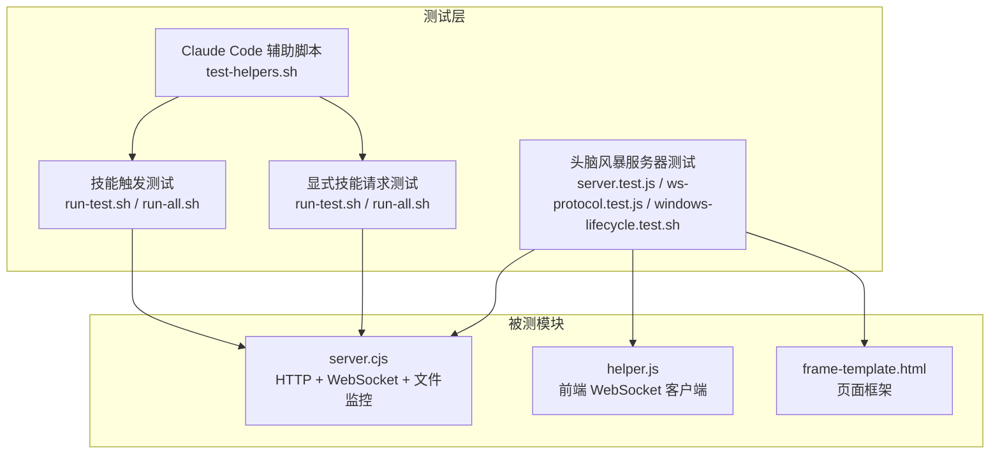
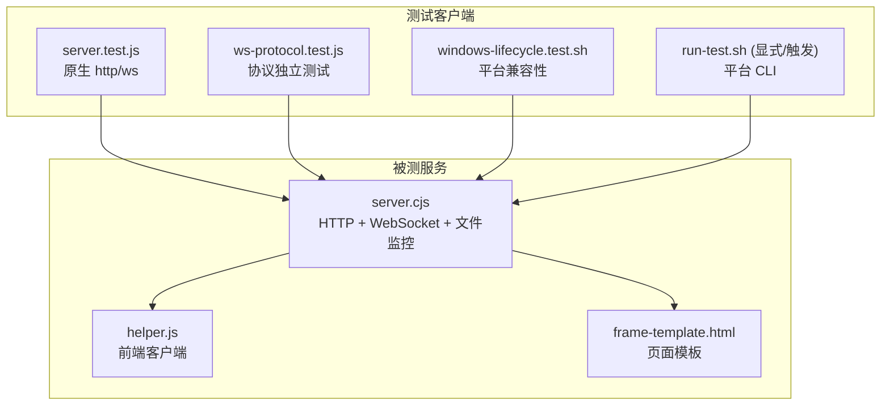
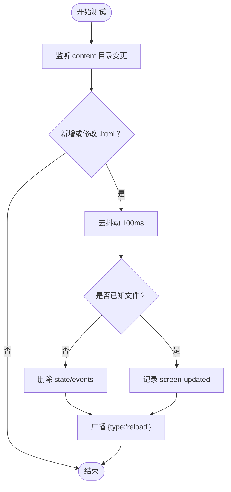
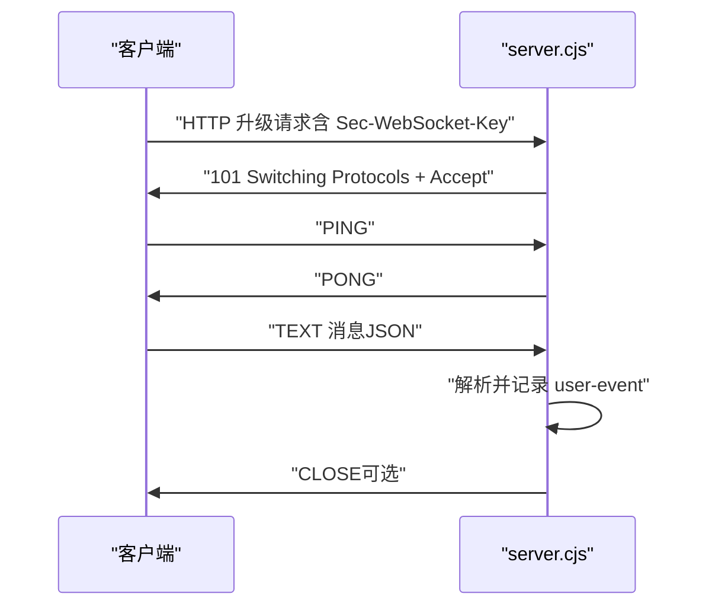
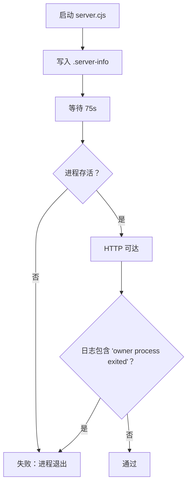
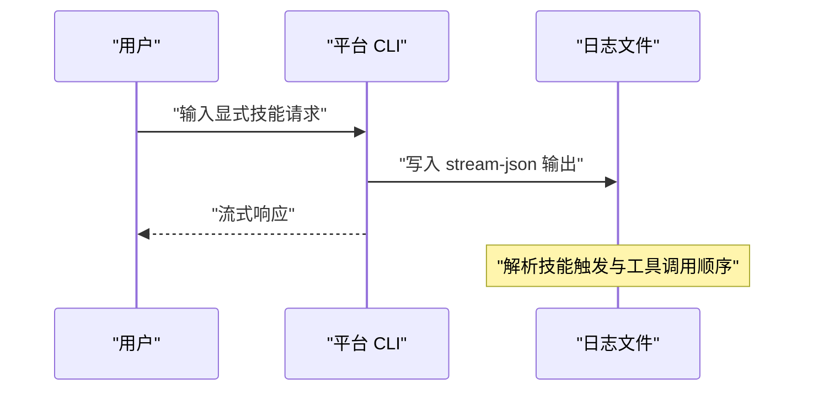
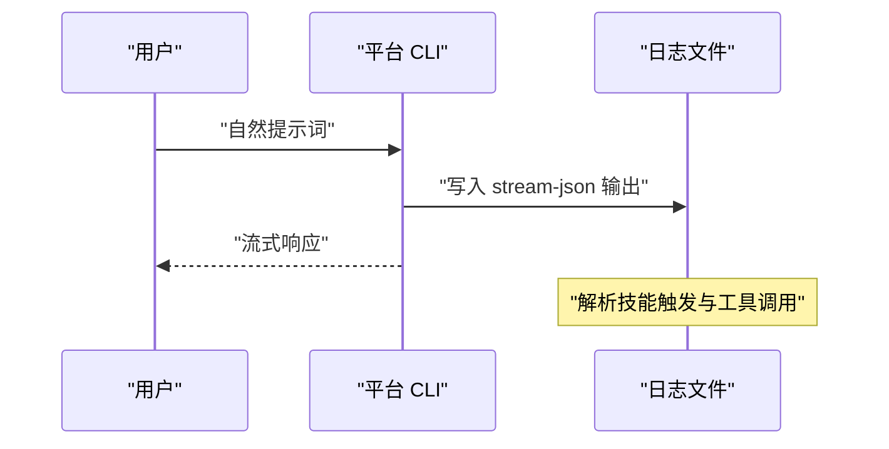
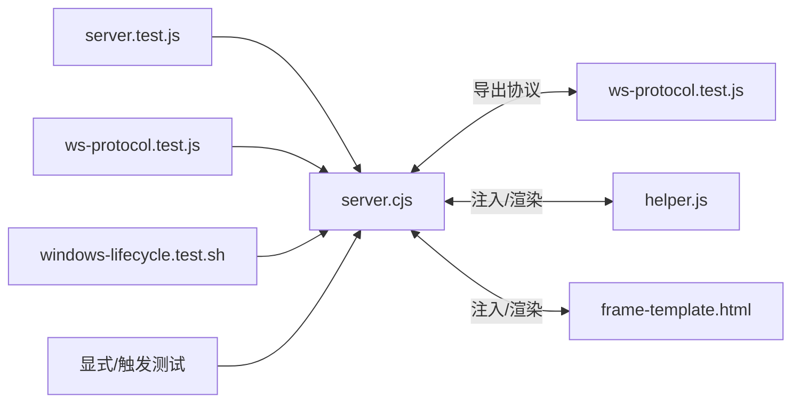

# 单元测试

<cite>
**本文引用的文件**   
- [tests/brainstorm-server/server.test.js](file://tests/brainstorm-server/server.test.js)
- [tests/brainstorm-server/ws-protocol.test.js](file://tests/brainstorm-server/ws-protocol.test.js)
- [tests/brainstorm-server/package.json](file://tests/brainstorm-server/package.json)
- [tests/brainstorm-server/windows-lifecycle.test.sh](file://tests/brainstorm-server/windows-lifecycle.test.sh)
- [skills/brainstorming/scripts/server.cjs](file://skills/brainstorming/scripts/server.cjs)
- [skills/brainstorming/scripts/helper.js](file://skills/brainstorming/scripts/helper.js)
- [skills/brainstorming/scripts/frame-template.html](file://skills/brainstorming/scripts/frame-template.html)
- [tests/explicit-skill-requests/run-test.sh](file://tests/explicit-skill-requests/run-test.sh)
- [tests/explicit-skill-requests/run-all.sh](file://tests/explicit-skill-requests/run-all.sh)
- [tests/explicit-skill-requests/prompts/use-systematic-debugging.txt](file://tests/explicit-skill-requests/prompts/use-systematic-debugging.txt)
- [tests/skill-triggering/run-test.sh](file://tests/skill-triggering/run-test.sh)
- [tests/skill-triggering/run-all.sh](file://tests/skill-triggering/run-all.sh)
- [tests/skill-triggering/prompts/systematic-debugging.txt](file://tests/skill-triggering/prompts/systematic-debugging.txt)
- [tests/claude-code/test-helpers.sh](file://tests/claude-code/test-helpers.sh)
</cite>

## 目录
1. [简介](#简介)
2. [项目结构](#项目结构)
3. [核心组件](#核心组件)
4. [架构总览](#架构总览)
5. [详细组件分析](#详细组件分析)
6. [依赖分析](#依赖分析)
7. [性能考虑](#性能考虑)
8. [故障排查指南](#故障排查指南)
9. [结论](#结论)
10. [附录](#附录)

## 简介
本文件系统性梳理 Superpowers 的单元测试与集成测试体系，覆盖以下主题：
- 头脑风暴服务器测试：端到端验证 HTTP 服务、WebSocket 协议、文件监控与广播、跨平台生命周期行为。
- 显式技能请求测试：验证用户直接命名技能时，平台是否正确触发对应技能（如“systematic-debugging”）。
- 技能触发测试：验证在自然对话场景下，平台能否自动识别并触发相应技能（如“systematic-debugging”、“test-driven-development”等）。
- 测试框架与配置：Node.js 原生断言与 Bash 脚本组合，无外部 JavaScript 测试框架（如 Mocha/Chai）。
- 测试数据与模拟：通过临时目录、子进程、文件系统事件与 WebSocket 客户端进行真实环境模拟。
- 断言与期望：基于 assert、字符串匹配与日志解析，确保协议与行为符合预期。
- 测试覆盖率与报告：当前仓库未集成覆盖率工具；建议在后续引入 Istanbul 或 nyc。
- 最佳实践与调试：超时控制、日志提取、失败定位与跨平台兼容性处理。

## 项目结构
测试相关文件主要分布在 tests 目录中，并与 skills 子模块紧密耦合：
- tests/brainstorm-server：头脑风暴服务器的端到端与协议级测试，包含 Node.js 测试脚本与 Bash 生命周期测试。
- tests/explicit-skill-requests：显式技能请求测试，通过调用平台 CLI 并解析输出判断技能是否被触发。
- tests/skill-triggering：技能触发测试，针对自然提示词触发技能，校验工具调用序列。
- tests/claude-code：通用测试辅助脚本，提供断言与项目模板创建能力。
- skills/brainstorming/scripts：被测模块（server.cjs）、前端注入脚本（helper.js）与页面模板（frame-template.html）。

图表来源
- [tests/brainstorm-server/server.test.js:1-428](file://tests/brainstorm-server/server.test.js#L1-L428)
- [tests/brainstorm-server/ws-protocol.test.js:1-393](file://tests/brainstorm-server/ws-protocol.test.js#L1-L393)
- [tests/brainstorm-server/windows-lifecycle.test.sh:1-352](file://tests/brainstorm-server/windows-lifecycle.test.sh#L1-L352)
- [skills/brainstorming/scripts/server.cjs:1-355](file://skills/brainstorming/scripts/server.cjs#L1-L355)
- [skills/brainstorming/scripts/helper.js:1-89](file://skills/brainstorming/scripts/helper.js#L1-L89)
- [skills/brainstorming/scripts/frame-template.html:1-215](file://skills/brainstorming/scripts/frame-template.html#L1-L215)
- [tests/explicit-skill-requests/run-test.sh:1-137](file://tests/explicit-skill-requests/run-test.sh#L1-L137)
- [tests/skill-triggering/run-test.sh:1-89](file://tests/skill-triggering/run-test.sh#L1-L89)
- [tests/claude-code/test-helpers.sh:1-203](file://tests/claude-code/test-helpers.sh#L1-L203)

章节来源
- [tests/brainstorm-server/server.test.js:1-428](file://tests/brainstorm-server/server.test.js#L1-L428)
- [tests/brainstorm-server/ws-protocol.test.js:1-393](file://tests/brainstorm-server/ws-protocol.test.js#L1-L393)
- [tests/brainstorm-server/windows-lifecycle.test.sh:1-352](file://tests/brainstorm-server/windows-lifecycle.test.sh#L1-L352)
- [skills/brainstorming/scripts/server.cjs:1-355](file://skills/brainstorming/scripts/server.cjs#L1-L355)
- [skills/brainstorming/scripts/helper.js:1-89](file://skills/brainstorming/scripts/helper.js#L1-L89)
- [skills/brainstorming/scripts/frame-template.html:1-215](file://skills/brainstorming/scripts/frame-template.html#L1-L215)
- [tests/explicit-skill-requests/run-test.sh:1-137](file://tests/explicit-skill-requests/run-test.sh#L1-L137)
- [tests/skill-triggering/run-test.sh:1-89](file://tests/skill-triggering/run-test.sh#L1-L89)
- [tests/claude-code/test-helpers.sh:1-203](file://tests/claude-code/test-helpers.sh#L1-L203)

## 核心组件
- 头脑风暴服务器（server.cjs）
  - 提供 HTTP 服务：根路径返回等待页或最新 HTML 屏幕，支持静态资源访问。
  - 提供 WebSocket 升级：握手、帧编解码、心跳与关闭处理。
  - 文件监控：监听 content 目录变化，向所有客户端广播 reload。
  - 生命周期管理：基于 owner 进程与空闲超时的自清理。
- 前端助手脚本（helper.js）
  - 自动连接 WebSocket，发送用户交互事件（click、choice），接收 reload 指令刷新页面。
  - 提供 UI 选择状态与指示栏更新。
- 页面模板（frame-template.html）
  - 统一的视觉框架与样式，用于包装非完整文档的片段内容。
- 显式技能请求测试（run-test.sh）
  - 使用平台 CLI 在隔离环境中运行，解析输出中的工具调用与技能名，断言技能被触发且顺序合理。
- 技能触发测试（run-test.sh）
  - 针对自然提示词，断言平台自动触发目标技能。
- 协议与集成测试（server.test.js / ws-protocol.test.js）
  - server.test.js：启动 server.cjs 子进程，使用原生 http 与 ws 包进行端到端验证。
  - ws-protocol.test.js：独立测试 RFC 6455 协议实现，不依赖 HTTP 服务器。
- Windows 生命周期测试（windows-lifecycle.test.sh）
  - 验证在 Windows/MSYS2 环境下，owner PID 解析、前台模式检测与长生命周期稳定性。

章节来源
- [skills/brainstorming/scripts/server.cjs:1-355](file://skills/brainstorming/scripts/server.cjs#L1-L355)
- [skills/brainstorming/scripts/helper.js:1-89](file://skills/brainstorming/scripts/helper.js#L1-L89)
- [skills/brainstorming/scripts/frame-template.html:1-215](file://skills/brainstorming/scripts/frame-template.html#L1-L215)
- [tests/brainstorm-server/server.test.js:1-428](file://tests/brainstorm-server/server.test.js#L1-L428)
- [tests/brainstorm-server/ws-protocol.test.js:1-393](file://tests/brainstorm-server/ws-protocol.test.js#L1-L393)
- [tests/brainstorm-server/windows-lifecycle.test.sh:1-352](file://tests/brainstorm-server/windows-lifecycle.test.sh#L1-L352)
- [tests/explicit-skill-requests/run-test.sh:1-137](file://tests/explicit-skill-requests/run-test.sh#L1-L137)
- [tests/skill-triggering/run-test.sh:1-89](file://tests/skill-triggering/run-test.sh#L1-L89)

## 架构总览
下图展示了测试与被测模块之间的交互关系，以及关键数据流（HTTP 请求、WebSocket 消息、文件监控事件）：

图表来源
- [tests/brainstorm-server/server.test.js:1-428](file://tests/brainstorm-server/server.test.js#L1-L428)
- [tests/brainstorm-server/ws-protocol.test.js:1-393](file://tests/brainstorm-server/ws-protocol.test.js#L1-L393)
- [tests/brainstorm-server/windows-lifecycle.test.sh:1-352](file://tests/brainstorm-server/windows-lifecycle.test.sh#L1-L352)
- [tests/explicit-skill-requests/run-test.sh:1-137](file://tests/explicit-skill-requests/run-test.sh#L1-L137)
- [tests/skill-triggering/run-test.sh:1-89](file://tests/skill-triggering/run-test.sh#L1-L89)
- [skills/brainstorming/scripts/server.cjs:1-355](file://skills/brainstorming/scripts/server.cjs#L1-L355)
- [skills/brainstorming/scripts/helper.js:1-89](file://skills/brainstorming/scripts/helper.js#L1-L89)
- [skills/brainstorming/scripts/frame-template.html:1-215](file://skills/brainstorming/scripts/frame-template.html#L1-L215)

## 详细组件分析

### 头脑风暴服务器测试（server.test.js）
- 测试范围
  - 启动阶段：输出 server-started 结构、写入 state/server-info。
  - HTTP 服务：等待页、注入 helper.js、Content-Type、完整文档与片段差异、按 mtime 选择最新文件、忽略非 HTML、非根路径 404。
  - WebSocket：升级成功、转发用户事件、choice 写入 state/events、非 choice 不写入、并发客户端、断线清理、异常 JSON 处理。
  - 文件监控：新增/修改 .html 触发 reload、非 .html 不触发、新屏幕清空 state/events、日志 screen-added/screen-updated。
  - 前端与模板：helper.js API 定义、frame-template 结构完整性。
- 断言策略
  - assert 对比 JSON 字段与文件存在性。
  - 通过 http.get 与 WebSocket 发送/接收消息验证行为。
  - 通过 fs.watch 事件后延时读取文件与 stdout 日志确认副作用。
- 关键流程图（文件监控与广播）

图表来源
- [tests/brainstorm-server/server.test.js:276-298](file://tests/brainstorm-server/server.test.js#L276-L298)
- [skills/brainstorming/scripts/server.cjs:276-298](file://skills/brainstorming/scripts/server.cjs#L276-L298)

章节来源
- [tests/brainstorm-server/server.test.js:1-428](file://tests/brainstorm-server/server.test.js#L1-L428)
- [skills/brainstorming/scripts/server.cjs:1-355](file://skills/brainstorming/scripts/server.cjs#L1-L355)

### WebSocket 协议测试（ws-protocol.test.js）
- 测试范围
  - 握手：computeAcceptKey 符合 RFC 6455。
  - 编码：小/中/大帧（<126、126-65535、>65535）长度标记与掩码位。
  - 解码：小/中/大帧、多帧缓冲、未屏蔽客户端帧拒绝、掩码还原正确。
  - 关闭帧：状态码与原因解析。
  - JSON 往返：编码后负载可被正确解析。
- 断言策略
  - 使用 assert 验证字节与长度边界。
  - 使用 makeClientFrame 构造不同长度与掩码的帧，确保健壮性。
- 序列图（握手与心跳）

图表来源
- [tests/brainstorm-server/ws-protocol.test.js:47-67](file://tests/brainstorm-server/ws-protocol.test.js#L47-L67)
- [tests/brainstorm-server/ws-protocol.test.js:145-295](file://tests/brainstorm-server/ws-protocol.test.js#L145-L295)
- [skills/brainstorming/scripts/server.cjs:167-222](file://skills/brainstorming/scripts/server.cjs#L167-L222)

章节来源
- [tests/brainstorm-server/ws-protocol.test.js:1-393](file://tests/brainstorm-server/ws-protocol.test.js#L1-L393)
- [skills/brainstorming/scripts/server.cjs:1-355](file://skills/brainstorming/scripts/server.cjs#L1-L355)

### Windows 生命周期测试（windows-lifecycle.test.sh）
- 测试范围
  - Windows 平台下 OWNER_PID 清空逻辑、start-server.sh 传递空值、前台模式自动检测。
  - 服务器在 75 秒后仍存活且 HTTP 可达，避免误判 owner 退出。
  - 控制用例：错误 owner PID 导致自停并记录日志。
  - stop-server.sh 干净停止服务器进程。
- 断言策略
  - 通过 .server-info 与端口探测验证启动与存活。
  - 通过日志关键字与进程存活状态判断结果。
- 流程图（生命周期检查）

图表来源
- [tests/brainstorm-server/windows-lifecycle.test.sh:203-255](file://tests/brainstorm-server/windows-lifecycle.test.sh#L203-L255)
- [tests/brainstorm-server/windows-lifecycle.test.sh:257-302](file://tests/brainstorm-server/windows-lifecycle.test.sh#L257-L302)
- [tests/brainstorm-server/windows-lifecycle.test.sh:307-341](file://tests/brainstorm-server/windows-lifecycle.test.sh#L307-L341)

章节来源
- [tests/brainstorm-server/windows-lifecycle.test.sh:1-352](file://tests/brainstorm-server/windows-lifecycle.test.sh#L1-L352)

### 显式技能请求测试（run-test.sh）
- 测试目标
  - 用户直接命名技能（如 “use systematic-debugging”）时，平台应触发对应技能。
- 测试流程
  - 准备输出目录与最小项目结构，复制提示词。
  - 使用平台 CLI 在隔离环境下运行，捕获 stream-json 输出。
  - 解析输出：查找 “name”:”Skill” 与 “skill”:”...” 模式，断言技能被触发。
  - 检查是否存在“先行动后加载技能”的提前工具调用（失败模式）。
- 断言方法
  - grep 匹配工具调用与技能名。
  - jq 提取首条助手消息摘要。
- 序列图（显式请求）

图表来源
- [tests/explicit-skill-requests/run-test.sh:62-137](file://tests/explicit-skill-requests/run-test.sh#L62-L137)

章节来源
- [tests/explicit-skill-requests/run-test.sh:1-137](file://tests/explicit-skill-requests/run-test.sh#L1-L137)
- [tests/explicit-skill-requests/prompts/use-systematic-debugging.txt:1-2](file://tests/explicit-skill-requests/prompts/use-systematic-debugging.txt#L1-L2)
- [tests/explicit-skill-requests/run-all.sh:1-71](file://tests/explicit-skill-requests/run-all.sh#L1-L71)

### 技能触发测试（run-test.sh）
- 测试目标
  - 在自然提示词下，平台自动识别并触发技能（如 “systematic-debugging”）。
- 测试流程
  - 读取提示词，运行平台 CLI，捕获输出。
  - 断言包含 “name”:”Skill” 与目标技能名，显示触发的全部技能清单。
- 断言方法
  - 正则匹配技能字段，统计唯一技能列表。
- 序列图（自然触发）

图表来源
- [tests/skill-triggering/run-test.sh:42-89](file://tests/skill-triggering/run-test.sh#L42-L89)

章节来源
- [tests/skill-triggering/run-test.sh:1-89](file://tests/skill-triggering/run-test.sh#L1-L89)
- [tests/skill-triggering/prompts/systematic-debugging.txt:1-11](file://tests/skill-triggering/prompts/systematic-debugging.txt#L1-L11)
- [tests/skill-triggering/run-all.sh:1-61](file://tests/skill-triggering/run-all.sh#L1-L61)

### 测试数据与模拟机制
- 临时目录与文件
  - server.test.js 与 windows-lifecycle.test.sh 使用 /tmp 或系统临时目录存放 content/state 与 .server-info/.server.pid。
- 子进程与环境变量
  - server.test.js 通过 child_process.spawn 启动 server.cjs，并设置 BRAINSTORM_PORT、BRAINSTORM_DIR 等环境变量。
  - windows-lifecycle.test.sh 通过环境变量控制主机、URL 主机、端口与 owner PID。
- WebSocket 客户端
  - server.test.js 使用 ws npm 包作为测试客户端；ws-protocol.test.js 直接 require server.cjs 导出的协议函数。
- 平台 CLI 集成
  - 显式与触发测试通过平台 CLI 执行，输出以 stream-json 格式保存，便于解析与断言。

章节来源
- [tests/brainstorm-server/server.test.js:48-70](file://tests/brainstorm-server/server.test.js#L48-L70)
- [tests/brainstorm-server/server.test.js:18-22](file://tests/brainstorm-server/server.test.js#L18-L22)
- [tests/brainstorm-server/windows-lifecycle.test.sh:212-217](file://tests/brainstorm-server/windows-lifecycle.test.sh#L212-L217)
- [tests/brainstorm-server/ws-protocol.test.js:18-29](file://tests/brainstorm-server/ws-protocol.test.js#L18-L29)

### 断言方法与期望值验证
- assert
  - server.test.js 与 ws-protocol.test.js 使用 Node.js 原生 assert 进行字段与文件存在性断言。
- 字符串匹配与日志解析
  - 显式/触发测试使用 grep 与正则匹配技能字段；jq 提取首条助手消息。
- 期望值
  - server-started 结构、Content-Type、reload 广播、事件写入、日志关键字、进程存活与端口可达。

章节来源
- [tests/brainstorm-server/server.test.js:98-105](file://tests/brainstorm-server/server.test.js#L98-L105)
- [tests/brainstorm-server/ws-protocol.test.js:50-56](file://tests/brainstorm-server/ws-protocol.test.js#L50-L56)
- [tests/explicit-skill-requests/run-test.sh:82-90](file://tests/explicit-skill-requests/run-test.sh#L82-L90)
- [tests/skill-triggering/run-test.sh:61-68](file://tests/skill-triggering/run-test.sh#L61-L68)

## 依赖分析
- 测试到被测模块
  - server.test.js 与 ws-protocol.test.js 直接依赖 server.cjs 的导出接口。
  - helper.js 与 frame-template.html 由 server.cjs 注入与渲染。
  - 显式/触发测试依赖平台 CLI 的输出格式与工具调用约定。
- 外部依赖
  - server.test.js 依赖 ws npm 包作为 WebSocket 客户端。
  - Bash 测试脚本依赖 Node.js、curl/timeout、grep/jq 等系统工具。
- 耦合与内聚
  - 协议测试与 HTTP/WebSocket 服务分离，提升内聚度与可维护性。
  - Bash 测试脚本与 Node 测试脚本互补，分别覆盖平台兼容性与协议细节。

图表来源
- [skills/brainstorming/scripts/server.cjs:354](file://skills/brainstorming/scripts/server.cjs#L354)
- [tests/brainstorm-server/ws-protocol.test.js:18-29](file://tests/brainstorm-server/ws-protocol.test.js#L18-L29)
- [tests/brainstorm-server/server.test.js:18-18](file://tests/brainstorm-server/server.test.js#L18-L18)
- [skills/brainstorming/scripts/helper.js:1-89](file://skills/brainstorming/scripts/helper.js#L1-L89)
- [skills/brainstorming/scripts/frame-template.html:1-215](file://skills/brainstorming/scripts/frame-template.html#L1-L215)
- [tests/explicit-skill-requests/run-test.sh:62-76](file://tests/explicit-skill-requests/run-test.sh#L62-L76)
- [tests/skill-triggering/run-test.sh:42-53](file://tests/skill-triggering/run-test.sh#L42-L53)

章节来源
- [tests/brainstorm-server/package.json:1-11](file://tests/brainstorm-server/package.json#L1-L11)
- [tests/brainstorm-server/server.test.js:11-16](file://tests/brainstorm-server/server.test.js#L11-L16)
- [tests/brainstorm-server/ws-protocol.test.js:14-16](file://tests/brainstorm-server/ws-protocol.test.js#L14-L16)

## 性能考虑
- 文件监控去抖动：100ms 去抖减少频繁广播与重绘。
- 广播优化：仅对已连接客户端写入，异常连接自动清理。
- 生命周期检查：每 60 秒检查一次，避免高频轮询。
- 超时控制：Bash 测试脚本使用 timeout 限制 CLI 执行时间，防止长时间阻塞。
- 建议
  - 引入测试覆盖率工具（如 nyc/Istanbul）以量化覆盖范围。
  - 将部分协议测试迁移至更高效的测试框架（如 Jest）以提升执行速度与报告质量。

## 故障排查指南
- 服务器未启动或未写入 .server-info
  - 检查环境变量（BRAINSTORM_PORT、BRAINSTORM_DIR、BRAINSTORM_HOST、BRAINSTORM_URL_HOST）。
  - 查看日志尾部，确认是否抛出异常。
- WebSocket 握手失败
  - 确认客户端 Key 是否有效，服务端 computeAcceptKey 是否正确。
  - 检查客户端帧是否按 RFC 6455 掩码与长度规则构造。
- 广播未生效
  - 检查客户端集合是否包含断开连接但未清理的句柄。
  - 确认文件监控事件是否触发去抖动与广播。
- Windows 生命周期误判
  - 确认 start-server.sh 中对 OWNER_PID 的清空逻辑是否生效。
  - 检查前台模式检测分支是否被触发。
- 平台 CLI 测试失败
  - 检查 stream-json 输出中 “name”:”Skill” 与 “skill”:”...” 是否存在。
  - 排查是否存在“先行动后加载技能”的提前工具调用。

章节来源
- [tests/brainstorm-server/server.test.js:54-70](file://tests/brainstorm-server/server.test.js#L54-L70)
- [tests/brainstorm-server/ws-protocol.test.js:230-260](file://tests/brainstorm-server/ws-protocol.test.js#L230-L260)
- [tests/brainstorm-server/windows-lifecycle.test.sh:120-143](file://tests/brainstorm-server/windows-lifecycle.test.sh#L120-L143)
- [tests/explicit-skill-requests/run-test.sh:82-121](file://tests/explicit-skill-requests/run-test.sh#L82-L121)
- [tests/skill-triggering/run-test.sh:58-82](file://tests/skill-triggering/run-test.sh#L58-L82)

## 结论
Superpowers 的测试体系采用“原生 Node.js + Bash 脚本”的混合方案，既保证了对底层协议与平台行为的精确控制，又通过平台 CLI 集成测试验证真实工作流。建议在未来引入测试覆盖率工具与更丰富的测试框架，以进一步提升测试效率与可观测性。

## 附录
- 测试运行方式
  - 头脑风暴服务器测试：在 tests/brainstorm-server 目录下执行 Node.js 测试脚本。
  - 协议测试：同上，或单独运行 ws-protocol.test.js。
  - Windows 生命周期测试：在 tests/brainstorm-server 目录下执行 windows-lifecycle.test.sh。
  - 显式技能请求测试：在 tests/explicit-skill-requests 目录下执行 run-test.sh 或 run-all.sh。
  - 技能触发测试：在 tests/skill-triggering 目录下执行 run-test.sh 或 run-all.sh。
- 测试数据准备
  - server.test.js 与 windows-lifecycle.test.sh 自动创建临时目录与文件。
  - 显式/触发测试复制提示词并创建最小项目结构。
- 断言与报告
  - 使用 assert、grep、jq 与日志解析进行断言。
  - Bash 脚本输出通过 tee 记录到 /tmp 目录，便于事后分析。