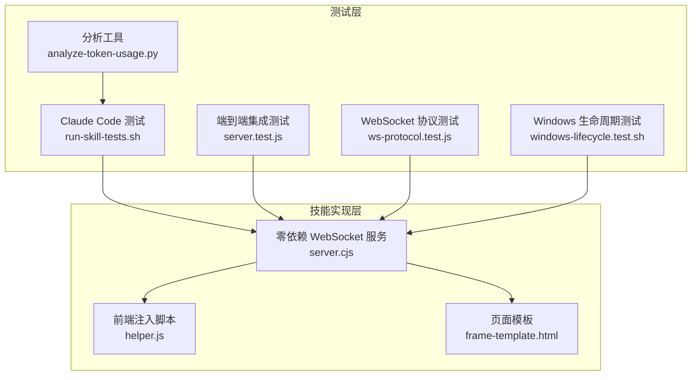
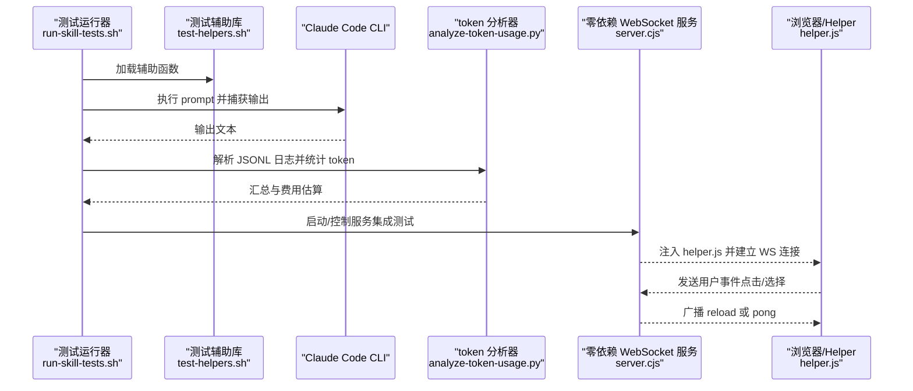
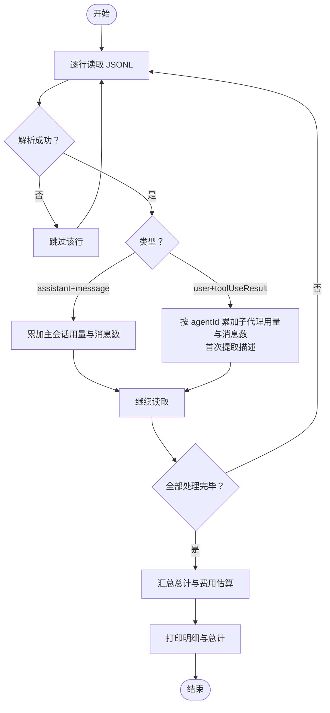
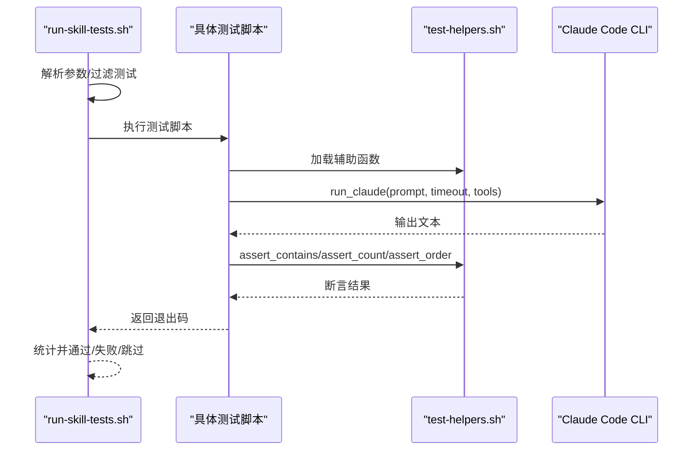
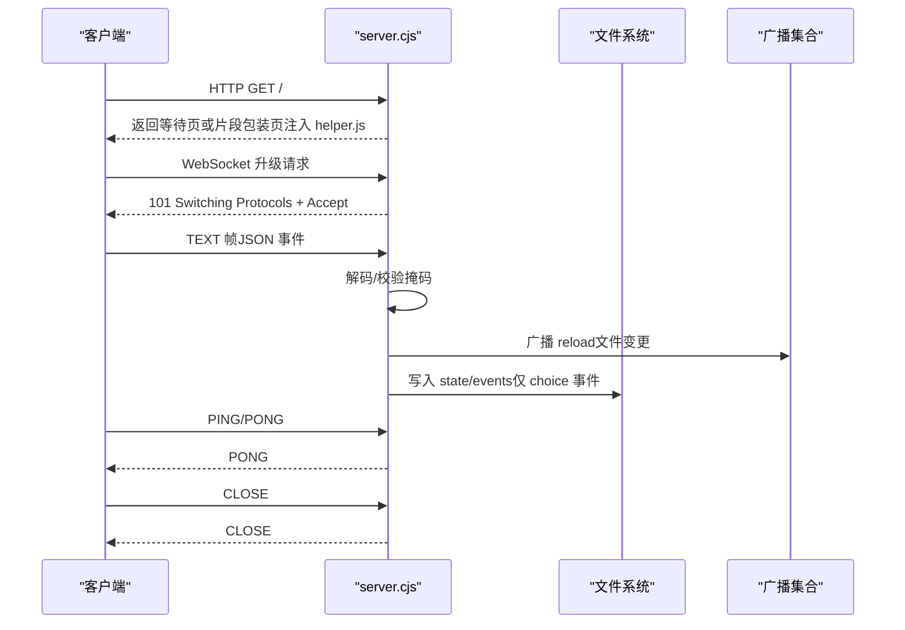
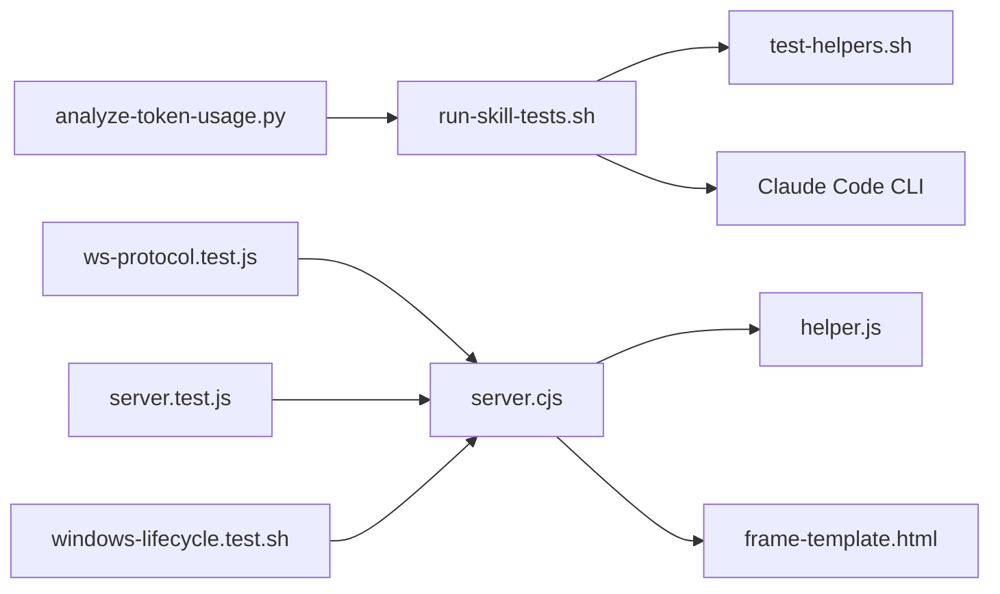

# 测试工具和辅助程序

<cite>
**本文引用的文件**
- [analyze-token-usage.py](file://tests/claude-code/analyze-token-usage.py)
- [test-helpers.sh](file://tests/claude-code/test-helpers.sh)
- [run-skill-tests.sh](file://tests/claude-code/run-skill-tests.sh)
- [test-document-review-system.sh](file://tests/claude-code/test-document-review-system.sh)
- [test-subagent-driven-development.sh](file://tests/claude-code/test-subagent-driven-development.sh)
- [ws-protocol.test.js](file://tests/brainstorm-server/ws-protocol.test.js)
- [server.test.js](file://tests/brainstorm-server/server.test.js)
- [windows-lifecycle.test.sh](file://tests/brainstorm-server/windows-lifecycle.test.sh)
- [server.cjs](file://skills/brainstorming/scripts/server.cjs)
- [helper.js](file://skills/brainstorming/scripts/helper.js)
- [frame-template.html](file://skills/brainstorming/scripts/frame-template.html)
</cite>

## 目录
1. [简介](#简介)
2. [项目结构](#项目结构)
3. [核心组件](#核心组件)
4. [架构总览](#架构总览)
5. [详细组件分析](#详细组件分析)
6. [依赖分析](#依赖分析)
7. [性能考虑](#性能考虑)
8. [故障排查指南](#故障排查指南)
9. [结论](#结论)
10. [附录](#附录)

## 简介
本文件面向 Superpowers 的测试工具与辅助程序，系统化梳理以下内容：
- Claude Code 会话转录的 token 使用分析工具：输入为 JSONL 行式日志，输出按主会话与子代理维度的 token 统计与费用估算。
- Claude Code 技能测试套件：通过命令行调用 Claude Code CLI，结合 Bash 辅助函数进行断言与临时项目管理。
- WebSocket 协议测试：对零依赖 WebSocket 实现（RFC 6455）进行握手、帧编解码、长度边界、掩码校验等单元测试；并进行端到端集成测试（HTTP + WebSocket + 文件监控）。
- 跨平台生命周期测试：在 Windows/MSYS2 环境下验证服务器在 60 秒生命周期检查中的存活行为与停止逻辑。
- 配置项、参数与输出格式：统一的环境变量、CLI 参数、测试报告与日志格式。
- 扩展与自定义：如何新增测试、编写断言、扩展分析工具与协议测试。

## 项目结构
测试相关代码主要位于 tests 目录，技能实现与前端模板位于 skills 目录。整体采用“测试驱动实现”的方式：先写测试，再实现功能。

图表来源
- [run-skill-tests.sh:1-188](file://tests/claude-code/run-skill-tests.sh#L1-L188)
- [analyze-token-usage.py:1-169](file://tests/claude-code/analyze-token-usage.py#L1-L169)
- [ws-protocol.test.js:1-393](file://tests/brainstorm-server/ws-protocol.test.js#L1-L393)
- [server.test.js:1-428](file://tests/brainstorm-server/server.test.js#L1-L428)
- [windows-lifecycle.test.sh:1-352](file://tests/brainstorm-server/windows-lifecycle.test.sh#L1-L352)
- [server.cjs:1-355](file://skills/brainstorming/scripts/server.cjs#L1-L355)
- [helper.js:1-89](file://skills/brainstorming/scripts/helper.js#L1-L89)
- [frame-template.html:1-215](file://skills/brainstorming/scripts/frame-template.html#L1-L215)

章节来源
- [run-skill-tests.sh:1-188](file://tests/claude-code/run-skill-tests.sh#L1-L188)
- [ws-protocol.test.js:1-393](file://tests/brainstorm-server/ws-protocol.test.js#L1-L393)
- [server.test.js:1-428](file://tests/brainstorm-server/server.test.js#L1-L428)
- [windows-lifecycle.test.sh:1-352](file://tests/brainstorm-server/windows-lifecycle.test.sh#L1-L352)
- [server.cjs:1-355](file://skills/brainstorming/scripts/server.cjs#L1-L355)

## 核心组件
- token 使用分析器：从 Claude Code JSONL 日志中解析主会话与子代理的消息用量，汇总输入/输出/缓存读取 token 数量，计算费用并输出表格。
- Claude Code 测试运行器：解析 CLI 参数，调度 Bash 测试脚本，支持超时、详细输出、集成测试开关与结果统计。
- 测试辅助库：封装 run_claude、assert_* 断言、临时项目创建/清理、示例计划生成等通用能力。
- WebSocket 协议测试：覆盖握手、编码/解码、掩码、长度边界、关闭帧状态码、JSON 往返等。
- 端到端集成测试：验证 HTTP 页面服务、helper 注入、文件监控触发 reload、多客户端广播、错误处理与事件落盘。
- Windows 生命周期测试：验证空 OWNER_PID 处理、前台模式自动检测、60 秒生命周期检查后存活、坏 PID 导致自停、stop 脚本干净停止。
- 零依赖 WebSocket 实现：握手计算、帧编码/解码、OPCODE 常量、HTTP 升级、消息处理、广播、活动跟踪、文件监控、生命周期检查、优雅退出。

章节来源
- [analyze-token-usage.py:1-169](file://tests/claude-code/analyze-token-usage.py#L1-L169)
- [run-skill-tests.sh:1-188](file://tests/claude-code/run-skill-tests.sh#L1-L188)
- [test-helpers.sh:1-203](file://tests/claude-code/test-helpers.sh#L1-L203)
- [ws-protocol.test.js:1-393](file://tests/brainstorm-server/ws-protocol.test.js#L1-L393)
- [server.test.js:1-428](file://tests/brainstorm-server/server.test.js#L1-L428)
- [windows-lifecycle.test.sh:1-352](file://tests/brainstorm-server/windows-lifecycle.test.sh#L1-L352)
- [server.cjs:1-355](file://skills/brainstorming/scripts/server.cjs#L1-L355)

## 架构总览
下图展示测试工具与被测系统的交互关系与数据流。

图表来源
- [run-skill-tests.sh:1-188](file://tests/claude-code/run-skill-tests.sh#L1-L188)
- [test-helpers.sh:1-203](file://tests/claude-code/test-helpers.sh#L1-L203)
- [analyze-token-usage.py:1-169](file://tests/claude-code/analyze-token-usage.py#L1-L169)
- [server.cjs:1-355](file://skills/brainstorming/scripts/server.cjs#L1-L355)
- [helper.js:1-89](file://skills/brainstorming/scripts/helper.js#L1-L89)

## 详细组件分析

### Claude Code 会话 token 使用分析器
- 输入：JSONL 行式日志文件，每行是一个 JSON 对象，包含类型与消息/工具结果等字段。
- 主要流程：
  - 逐行解析 JSON。
  - 主会话 assistant 消息：累加 input/output/cache 用量与消息数。
  - 子代理 toolUseResult：按 agentId 聚合用量与消息数，首次出现时从 prompt 提取简短描述。
  - 计算费用：以每百万 token 的输入/输出单价估算。
  - 输出：主会话与各子代理的明细表，以及总计与费用。
- 关键点：
  - 支持多行 JSON，异常行会被忽略。
  - 描述提取：优先取 prompt 首行，去除“你是”前缀，截断长度。
  - 费用模型：输入 = input_tokens + cache_creation_input_tokens + cache_read_input_tokens；输出 = output_tokens；总费用 = 输入单价 + 输出单价。

图表来源
- [analyze-token-usage.py:1-169](file://tests/claude-code/analyze-token-usage.py#L1-L169)

章节来源
- [analyze-token-usage.py:1-169](file://tests/claude-code/analyze-token-usage.py#L1-L169)

### Claude Code 技能测试运行器与辅助库
- 运行器（run-skill-tests.sh）：
  - 解析参数：--verbose、--test、--timeout、--integration、--help。
  - 默认执行快速测试列表，可追加集成测试。
  - 为每个测试设置超时，统计通过/失败/跳过数量并输出摘要。
- 辅助库（test-helpers.sh）：
  - run_claude：以 headless 模式调用 claude，支持超时与允许工具列表。
  - assert_*：包含/不包含/计数/顺序断言，失败时输出差异。
  - 项目管理：创建临时目录、清理、生成示例计划文件。
- 示例测试（test-subagent-driven-development.sh）：
  - 验证技能加载、工作流顺序、自审要求、计划一次性读取、审查员怀疑态度、审查循环、任务上下文提供、前置技能与主分支风险提示。
- 文档评审集成测试（test-document-review-system.sh）：
  - 创建带缺陷的规范文档，调用评审器，断言识别 TODO、延期说明、问题汇总与不批准结论。

图表来源
- [run-skill-tests.sh:1-188](file://tests/claude-code/run-skill-tests.sh#L1-L188)
- [test-helpers.sh:1-203](file://tests/claude-code/test-helpers.sh#L1-L203)
- [test-subagent-driven-development.sh:1-166](file://tests/claude-code/test-subagent-driven-development.sh#L1-L166)
- [test-document-review-system.sh:1-178](file://tests/claude-code/test-document-review-system.sh#L1-L178)

章节来源
- [run-skill-tests.sh:1-188](file://tests/claude-code/run-skill-tests.sh#L1-L188)
- [test-helpers.sh:1-203](file://tests/claude-code/test-helpers.sh#L1-L203)
- [test-subagent-driven-development.sh:1-166](file://tests/claude-code/test-subagent-driven-development.sh#L1-L166)
- [test-document-review-system.sh:1-178](file://tests/claude-code/test-document-review-system.sh#L1-L178)

### WebSocket 协议测试（零依赖实现）
- 单元测试（ws-protocol.test.js）：
  - 握手：RFC 6455 示例 key 与 accept 值校验，随机 key 的 base64 校验。
  - 编码：小/中/大帧长度边界（<126、=126、126-65535、=65536、>65535），CLOSE/PING/PONG 帧。
  - 解码：掩码校验（客户端必须掩码）、不完整帧返回 null、多帧拼接、反掩码正确性。
  - JSON 往返：服务端编码的 JSON 与客户端编码的 JSON 解码一致性。
- 集成测试（server.test.js）：
  - HTTP：等待页、注入 helper.js、全文档直出、片段包裹、最新文件优先、非 HTML 忽略、非根路径 404。
  - WebSocket：升级成功、用户事件转发到 stdout、choice 事件写入 state/events、多客户端广播、关闭清理、异常 JSON 安全。
  - 文件监控：新增/变更 .html 触发 reload，非 .html 不触发，新屏幕清空事件文件，日志记录 screen-added/screen-updated。
  - 模板与脚本：helper.js API（toggleSelect/sendEvent/brainstorm）、frame-template.html 结构校验。
- Windows 生命周期测试（windows-lifecycle.test.sh）：
  - OWNER_PID 在 Windows 清空处理、start-server.sh 传空值、前台模式自动检测。
  - 空 OWNER_PID 下服务器存活超过 75 秒且 HTTP 可达，日志不含“owner process exited”。
  - 坏 PID 导致自停并记录日志；stop-server.sh 能干净停止进程。

图表来源
- [ws-protocol.test.js:1-393](file://tests/brainstorm-server/ws-protocol.test.js#L1-L393)
- [server.test.js:1-428](file://tests/brainstorm-server/server.test.js#L1-L428)
- [windows-lifecycle.test.sh:1-352](file://tests/brainstorm-server/windows-lifecycle.test.sh#L1-L352)
- [server.cjs:1-355](file://skills/brainstorming/scripts/server.cjs#L1-L355)
- [helper.js:1-89](file://skills/brainstorming/scripts/helper.js#L1-L89)

章节来源
- [ws-protocol.test.js:1-393](file://tests/brainstorm-server/ws-protocol.test.js#L1-L393)
- [server.test.js:1-428](file://tests/brainstorm-server/server.test.js#L1-L428)
- [windows-lifecycle.test.sh:1-352](file://tests/brainstorm-server/windows-lifecycle.test.sh#L1-L352)
- [server.cjs:1-355](file://skills/brainstorming/scripts/server.cjs#L1-L355)
- [helper.js:1-89](file://skills/brainstorming/scripts/helper.js#L1-L89)
- [frame-template.html:1-215](file://skills/brainstorming/scripts/frame-template.html#L1-L215)

## 依赖分析
- 测试运行器依赖 Bash 与外部 CLI（claude），并调用 Bash 辅助函数。
- 协议测试直接 require server.cjs 模块，无需外部依赖。
- 集成测试依赖 ws 包作为测试客户端，但不随产品发布。
- server.cjs 依赖 Node 内置模块（crypto/http/fs/path），并读取本地模板与脚本文件。

图表来源
- [run-skill-tests.sh:1-188](file://tests/claude-code/run-skill-tests.sh#L1-L188)
- [test-helpers.sh:1-203](file://tests/claude-code/test-helpers.sh#L1-L203)
- [analyze-token-usage.py:1-169](file://tests/claude-code/analyze-token-usage.py#L1-L169)
- [ws-protocol.test.js:1-393](file://tests/brainstorm-server/ws-protocol.test.js#L1-L393)
- [server.test.js:1-428](file://tests/brainstorm-server/server.test.js#L1-L428)
- [windows-lifecycle.test.sh:1-352](file://tests/brainstorm-server/windows-lifecycle.test.sh#L1-L352)
- [server.cjs:1-355](file://skills/brainstorming/scripts/server.cjs#L1-L355)
- [helper.js:1-89](file://skills/brainstorming/scripts/helper.js#L1-L89)
- [frame-template.html:1-215](file://skills/brainstorming/scripts/frame-template.html#L1-L215)

章节来源
- [run-skill-tests.sh:1-188](file://tests/claude-code/run-skill-tests.sh#L1-L188)
- [ws-protocol.test.js:1-393](file://tests/brainstorm-server/ws-protocol.test.js#L1-L393)
- [server.test.js:1-428](file://tests/brainstorm-server/server.test.js#L1-L428)
- [windows-lifecycle.test.sh:1-352](file://tests/brainstorm-server/windows-lifecycle.test.sh#L1-L352)
- [server.cjs:1-355](file://skills/brainstorming/scripts/server.cjs#L1-L355)

## 性能考虑
- token 分析器：单次线性扫描 JSONL，时间复杂度 O(N)，内存占用与行数线性相关；适合大体量日志。
- Claude Code 测试：默认超时 5 分钟，建议针对长耗时集成测试提升超时；避免在测试中做不必要的 IO。
- WebSocket 服务：文件监控使用去抖（100ms），广播遍历客户端集合；在高并发场景建议评估客户端数量与网络带宽。
- Windows 生命周期：60 秒检查间隔与 30 分钟空闲超时，确保在跨用户/WSL 场景下的稳定性。

## 故障排查指南
- Claude Code 测试未安装或不可用
  - 症状：提示 CLI 不存在或版本查询失败。
  - 排查：确认已安装并加入 PATH；查看版本输出。
  - 参考：[run-skill-tests.sh:18-23](file://tests/claude-code/run-skill-tests.sh#L18-L23)
- 测试超时
  - 症状：输出显示 timeout。
  - 排查：增大 --timeout；检查网络与 Claude 服务可用性。
  - 参考：[run-skill-tests.sh:120-160](file://tests/claude-code/run-skill-tests.sh#L120-L160)
- token 分析器报错或无输出
  - 症状：文件不存在或解析异常。
  - 排查：确认 JSONL 路径正确；检查每行是否为合法 JSON；异常行会被跳过。
  - 参考：[analyze-token-usage.py:83-95](file://tests/claude-code/analyze-token-usage.py#L83-L95)
- WebSocket 握手失败
  - 症状：客户端无法升级。
  - 排查：核对 Sec-WebSocket-Key 是否存在；确认 accept 计算正确。
  - 参考：[ws-protocol.test.js:50-56](file://tests/brainstorm-server/ws-protocol.test.js#L50-L56)
- 客户端帧未掩码
  - 症状：解码抛出异常。
  - 排查：客户端必须对帧掩码位设置；服务端严格校验。
  - 参考：[ws-protocol.test.js:253-260](file://tests/brainstorm-server/ws-protocol.test.js#L253-L260)
- 文件监控未触发 reload
  - 症状：修改 .html 后客户端未收到 reload。
  - 排查：确认文件扩展名为 .html；检查去抖定时器；查看 state/events 是否被清空。
  - 参考：[server.test.js:301-351](file://tests/brainstorm-server/server.test.js#L301-L351)
- Windows 生命周期异常
  - 症状：服务器在 60 秒后意外退出或无法存活。
  - 排查：确认 OWNER_PID 在 Windows 清空；前台模式自动检测；检查日志中是否出现“owner process exited”。
  - 参考：[windows-lifecycle.test.sh:120-255](file://tests/brainstorm-server/windows-lifecycle.test.sh#L120-L255)

章节来源
- [run-skill-tests.sh:18-23](file://tests/claude-code/run-skill-tests.sh#L18-L23)
- [analyze-token-usage.py:83-95](file://tests/claude-code/analyze-token-usage.py#L83-L95)
- [ws-protocol.test.js:50-56](file://tests/brainstorm-server/ws-protocol.test.js#L50-L56)
- [server.test.js:301-351](file://tests/brainstorm-server/server.test.js#L301-L351)
- [windows-lifecycle.test.sh:120-255](file://tests/brainstorm-server/windows-lifecycle.test.sh#L120-L255)

## 结论
本测试体系覆盖了 Claude Code 技能验证、token 使用分析、零依赖 WebSocket 协议与端到端集成，以及 Windows 平台的生命周期稳定性。通过清晰的 CLI 参数、断言工具与日志输出，能够高效定位问题并持续改进 Superpowers 的技能与服务。

## 附录

### 配置选项与参数
- Claude Code 测试运行器
  - --verbose/-v：显示详细输出。
  - --test/-t NAME：运行指定测试。
  - --timeout SECONDS：设置单个测试超时。
  - --integration/-i：追加运行集成测试。
  - --help/-h：显示帮助。
  - 参考：[run-skill-tests.sh:25-72](file://tests/claude-code/run-skill-tests.sh#L25-L72)
- token 分析器
  - 命令行：analyze-token-usage.py <session-file.jsonl>
  - 输出：主会话与子代理明细、总计与费用估算。
  - 参考：[analyze-token-usage.py:83-165](file://tests/claude-code/analyze-token-usage.py#L83-L165)
- WebSocket 服务
  - 环境变量：BRAINSTORM_PORT、BRAINSTORM_HOST、BRAINSTORM_URL_HOST、BRAINSTORM_DIR、BRAINSTORM_OWNER_PID。
  - 参考：[server.cjs:76-82](file://skills/brainstorming/scripts/server.cjs#L76-L82)
- Windows 生命周期测试
  - 平台检测：OSTYPE/MSYSTEM；在 Windows 清空 OWNER_PID。
  - 自动前台检测：通过替换 node 可执行文件验证。
  - 参考：[windows-lifecycle.test.sh:91-201](file://tests/brainstorm-server/windows-lifecycle.test.sh#L91-L201)

### 输出格式
- token 分析器输出
  - 表头：Agent、Description、Msgs、Input、Output、Cache、Cost。
  - 总计行：Total messages、Input tokens、Output tokens、Cache creation tokens、Cache read tokens、Total input、Total tokens、Estimated cost。
  - 参考：[analyze-token-usage.py:105-165](file://tests/claude-code/analyze-token-usage.py#L105-L165)
- Claude Code 测试
  - 成功/失败/跳过计数与摘要；失败时输出测试输出以便调试。
  - 参考：[run-skill-tests.sh:165-187](file://tests/claude-code/run-skill-tests.sh#L165-L187)
- WebSocket 服务
  - 启动日志：server-started（含 port/url/screen_dir/state_dir）。
  - 用户事件：stdout 输出带 source 字段的 JSON。
  - 文件变更：screen-added/screen-updated 日志。
  - 参考：[server.cjs:340-302](file://skills/brainstorming/scripts/server.cjs#L340-L302)

### 扩展与自定义指南
- 新增 Claude Code 测试
  - 创建 test-<skill>.sh，source test-helpers.sh，使用 run_claude 与 assert_* 断言。
  - 在 run-skill-tests.sh 中添加到测试列表并赋予执行权限。
  - 参考：[README.md:118-124](file://tests/claude-code/README.md#L118-L124)
- 新增 token 分析维度
  - 在 analyze_main_session 中扩展字段与汇总逻辑；更新输出表头与格式化函数。
  - 参考：[analyze-token-usage.py:12-70](file://tests/claude-code/analyze-token-usage.py#L12-L70)
- 扩展 WebSocket 协议测试
  - 在 ws-protocol.test.js 中增加新场景（如特定掩码序列、异常帧类型）。
  - 参考：[ws-protocol.test.js:357-385](file://tests/brainstorm-server/ws-protocol.test.js#L357-L385)
- 新增集成测试
  - 在 server.test.js 中添加新的 HTTP/WS/文件监控场景，保持断言风格一致。
  - 参考：[server.test.js:94-422](file://tests/brainstorm-server/server.test.js#L94-L422)