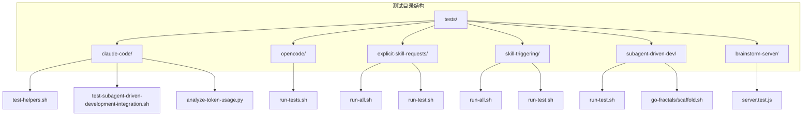
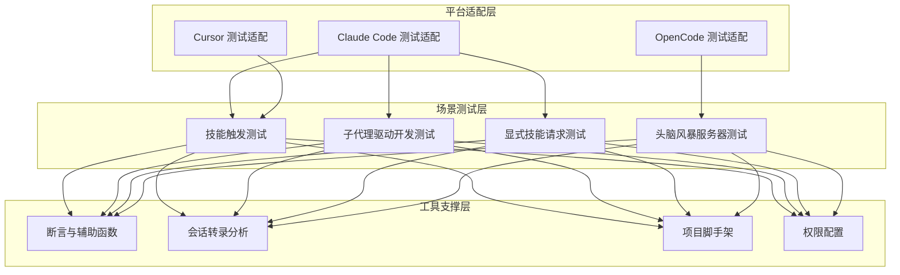
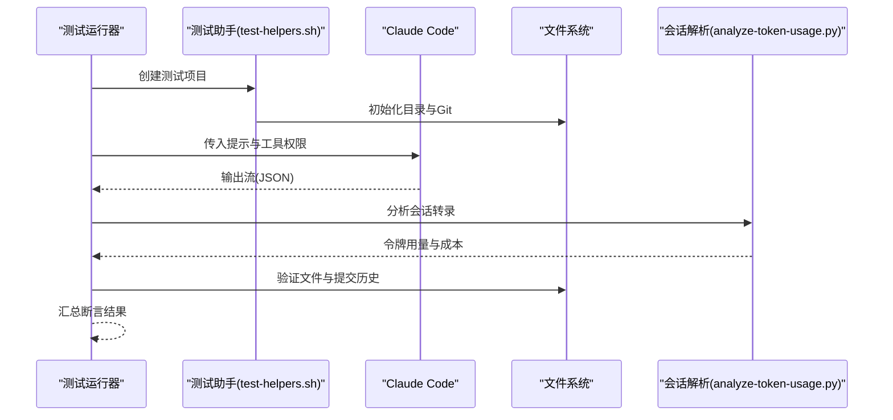
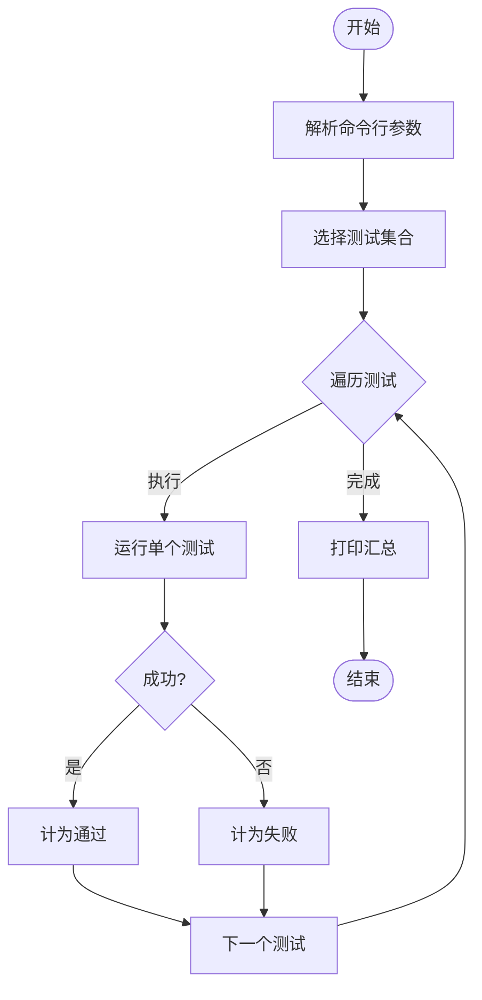
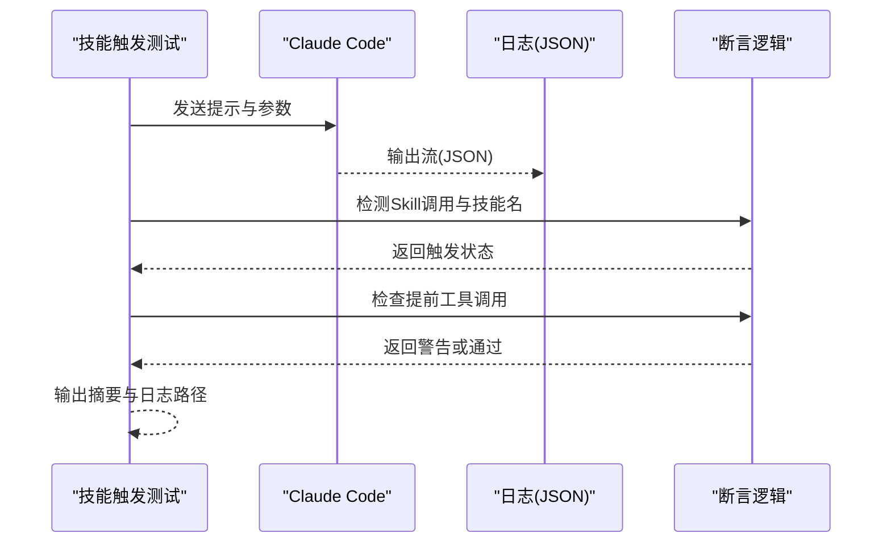
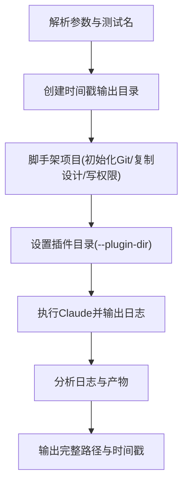
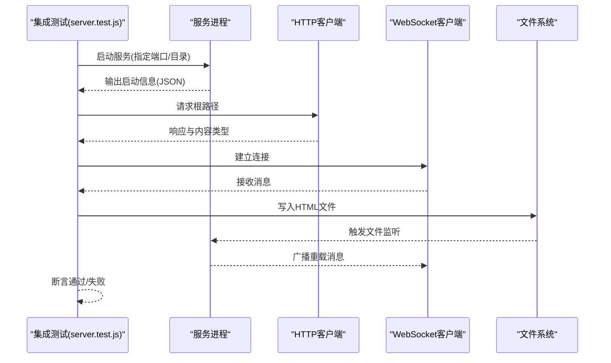
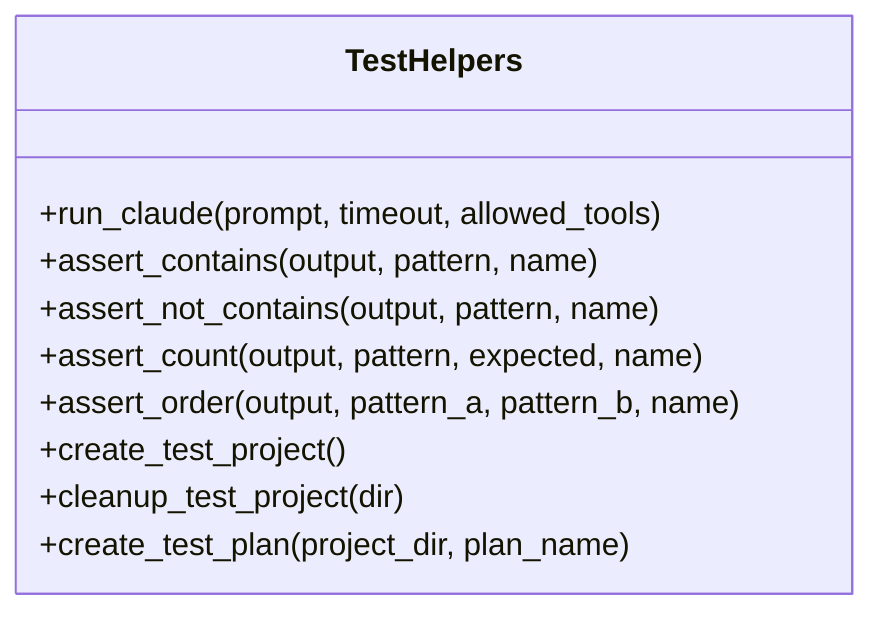
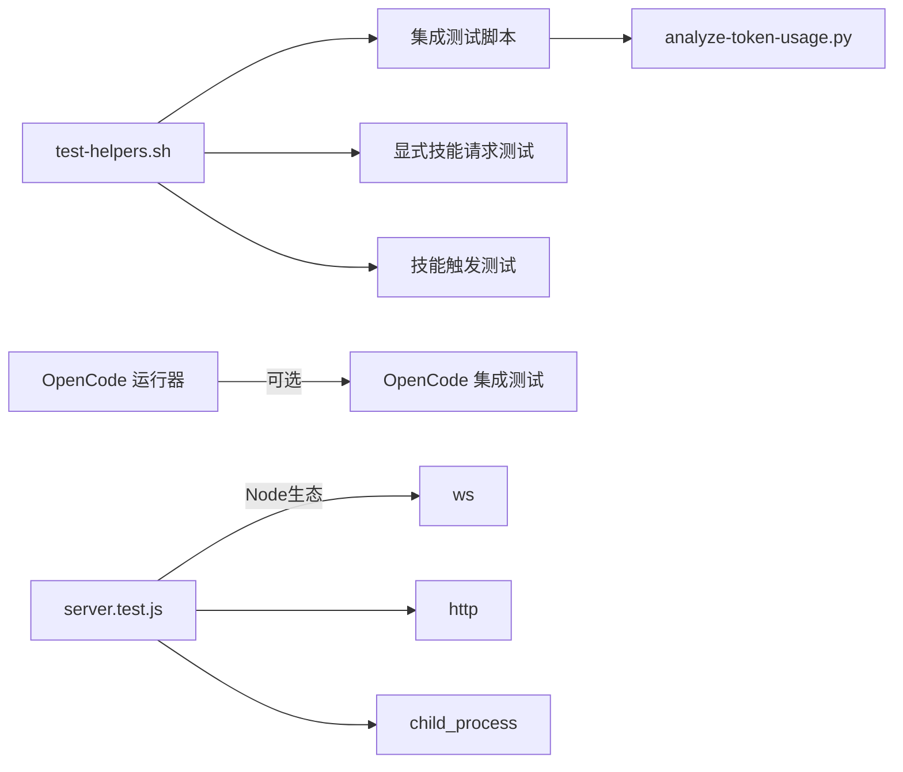

# 测试框架组件

<cite>
**本文档引用的文件**
- [docs/testing.md](file://docs/testing.md)
- [README.md](file://README.md)
- [tests/claude-code/test-helpers.sh](file://tests/claude-code/test-helpers.sh)
- [tests/claude-code/test-subagent-driven-development-integration.sh](file://tests/claude-code/test-subagent-driven-development-integration.sh)
- [tests/claude-code/analyze-token-usage.py](file://tests/claude-code/analyze-token-usage.py)
- [tests/explicit-skill-requests/run-all.sh](file://tests/explicit-skill-requests/run-all.sh)
- [tests/explicit-skill-requests/run-test.sh](file://tests/explicit-skill-requests/run-test.sh)
- [tests/opencode/run-tests.sh](file://tests/opencode/run-tests.sh)
- [tests/brainstorm-server/server.test.js](file://tests/brainstorm-server/server.test.js)
- [tests/skill-triggering/run-all.sh](file://tests/skill-triggering/run-all.sh)
- [tests/skill-triggering/run-test.sh](file://tests/skill-triggering/run-test.sh)
- [tests/subagent-driven-dev/run-test.sh](file://tests/subagent-driven-dev/run-test.sh)
- [tests/subagent-driven-dev/go-fractals/scaffold.sh](file://tests/subagent-driven-dev/go-fractals/scaffold.sh)
- [skills/test-driven-development/testing-anti-patterns.md](file://skills/test-driven-development/testing-anti-patterns.md)
- [skills/systematic-debugging/root-cause-tracing.md](file://skills/systematic-debugging/root-cause-tracing.md)
</cite>

## 目录
1. [简介](#简介)
2. [项目结构](#项目结构)
3. [核心组件](#核心组件)
4. [架构总览](#架构总览)
5. [详细组件分析](#详细组件分析)
6. [依赖关系分析](#依赖关系分析)
7. [性能考虑](#性能考虑)
8. [故障排除指南](#故障排除指南)
9. [结论](#结论)
10. [附录](#附录)

## 简介
本文件系统性梳理 Superpowers 的测试框架组件，覆盖单元测试、集成测试与跨平台测试的组织结构，测试用例设计模式、测试数据管理与断言机制，测试执行流程、并行测试与结果分析，并提供扩展能力（自定义测试工具、测试报告生成、持续集成支持）、配置选项、性能监控与调试工具等实践指南。目标是帮助开发者快速理解并高效使用该测试体系。

## 项目结构
测试相关代码主要分布在 tests 目录下，按平台与场景划分：
- 平台适配：Claude Code、OpenCode、Cursor 等平台的测试脚本与运行器
- 场景测试：头脑风暴服务器、技能触发、子代理驱动开发、显式技能请求等
- 工具与辅助：会话转录解析、测试助手函数、项目脚手架等

图表来源
- [tests/claude-code/test-helpers.sh:1-203](file://tests/claude-code/test-helpers.sh#L1-L203)
- [tests/claude-code/test-subagent-driven-development-integration.sh:1-315](file://tests/claude-code/test-subagent-driven-development-integration.sh#L1-L315)
- [tests/claude-code/analyze-token-usage.py:1-169](file://tests/claude-code/analyze-token-usage.py#L1-L169)
- [tests/opencode/run-tests.sh:1-164](file://tests/opencode/run-tests.sh#L1-L164)
- [tests/explicit-skill-requests/run-all.sh:1-71](file://tests/explicit-skill-requests/run-all.sh#L1-L71)
- [tests/explicit-skill-requests/run-test.sh:1-137](file://tests/explicit-skill-requests/run-test.sh#L1-L137)
- [tests/skill-triggering/run-all.sh:1-61](file://tests/skill-triggering/run-all.sh#L1-L61)
- [tests/skill-triggering/run-test.sh:1-89](file://tests/skill-triggering/run-test.sh#L1-L89)
- [tests/subagent-driven-dev/run-test.sh:1-59](file://tests/subagent-driven-dev/run-test.sh#L1-L59)
- [tests/subagent-driven-dev/go-fractals/scaffold.sh:1-46](file://tests/subagent-driven-dev/go-fractals/scaffold.sh#L1-L46)
- [tests/brainstorm-server/server.test.js:1-428](file://tests/brainstorm-server/server.test.js#L1-L428)

章节来源
- [README.md:126-151](file://README.md#L126-L151)
- [docs/testing.md:11-18](file://docs/testing.md#L11-L18)

## 核心组件
- 测试助手库（Bash）：封装 Claude Code 调用、断言、项目脚手架与计划文件生成，统一断言风格与资源清理。
- 集成测试套件：以真实会话执行复杂工作流，解析会话转录进行验证，包含令牌用量分析。
- 平台测试运行器：OpenCode 测试套件提供参数化运行、过滤与统计输出。
- 前端/服务端集成测试：Node.js + ws 的端到端测试，覆盖 HTTP 服务、WebSocket 通信与文件监听。
- 技能触发测试：验证自然语言提示与显式技能名称触发行为，确保技能加载顺序正确。
- 子代理驱动开发测试：通过脚手架创建最小工程，验证两阶段评审与任务分发流程。
- 文档与知识库：测试反模式与系统化调试方法论，指导测试设计与问题定位。

章节来源
- [tests/claude-code/test-helpers.sh:4-29](file://tests/claude-code/test-helpers.sh#L4-L29)
- [tests/claude-code/test-helpers.sh:31-123](file://tests/claude-code/test-helpers.sh#L31-L123)
- [tests/claude-code/test-helpers.sh:125-203](file://tests/claude-code/test-helpers.sh#L125-L203)
- [tests/claude-code/analyze-token-usage.py:12-70](file://tests/claude-code/analyze-token-usage.py#L12-L70)
- [tests/opencode/run-tests.sh:17-78](file://tests/opencode/run-tests.sh#L17-L78)
- [tests/brainstorm-server/server.test.js:72-428](file://tests/brainstorm-server/server.test.js#L72-L428)
- [tests/explicit-skill-requests/run-test.sh:82-121](file://tests/explicit-skill-requests/run-test.sh#L82-L121)
- [tests/skill-triggering/run-test.sh:58-68](file://tests/skill-triggering/run-test.sh#L58-L68)
- [tests/subagent-driven-dev/run-test.sh:35-59](file://tests/subagent-driven-dev/run-test.sh#L35-L59)

## 架构总览
测试框架采用“平台适配层 + 场景测试层 + 工具支撑层”的分层架构：
- 平台适配层：针对不同客户端（Claude Code、OpenCode、Cursor）提供统一的测试入口与参数传递。
- 场景测试层：围绕具体技能或功能场景编写测试脚本，调用平台适配层与工具层。
- 工具支撑层：断言函数、会话转录解析、项目脚手架、权限配置等通用能力。

图表来源
- [tests/claude-code/test-helpers.sh:1-203](file://tests/claude-code/test-helpers.sh#L1-L203)
- [tests/claude-code/analyze-token-usage.py:1-169](file://tests/claude-code/analyze-token-usage.py#L1-L169)
- [tests/opencode/run-tests.sh:1-164](file://tests/opencode/run-tests.sh#L1-L164)
- [tests/explicit-skill-requests/run-test.sh:1-137](file://tests/explicit-skill-requests/run-test.sh#L1-L137)
- [tests/skill-triggering/run-test.sh:1-89](file://tests/skill-triggering/run-test.sh#L1-L89)
- [tests/subagent-driven-dev/run-test.sh:1-59](file://tests/subagent-driven-dev/run-test.sh#L1-L59)
- [tests/brainstorm-server/server.test.js:1-428](file://tests/brainstorm-server/server.test.js#L1-L428)

## 详细组件分析

### 组件A：Claude Code 集成测试框架
- 设计模式：模板化测试脚本 + 会话转录解析 + 令牌用量分析
- 测试数据管理：临时项目目录、最小化工程结构、Git 初始化、权限配置
- 断言机制：基于 grep 的模式匹配、计数断言、顺序断言、文件存在性断言
- 执行流程：创建项目 → 生成计划 → 运行 Claude → 解析会话 → 验证文件与提交 → 令牌分析 → 汇总结果
- 性能监控：令牌用量统计、成本估算、消息数量统计

图表来源
- [tests/claude-code/test-subagent-driven-development-integration.sh:1-315](file://tests/claude-code/test-subagent-driven-development-integration.sh#L1-L315)
- [tests/claude-code/test-helpers.sh:125-203](file://tests/claude-code/test-helpers.sh#L125-L203)
- [tests/claude-code/analyze-token-usage.py:83-169](file://tests/claude-code/analyze-token-usage.py#L83-L169)

章节来源
- [docs/testing.md:20-33](file://docs/testing.md#L20-L33)
- [docs/testing.md:40-135](file://docs/testing.md#L40-L135)
- [docs/testing.md:137-177](file://docs/testing.md#L137-L177)

### 组件B：OpenCode 测试运行器
- 设计模式：命令行参数解析 + 条件集成测试 + 结果统计
- 测试数据管理：按需选择测试集（基础测试/集成测试）
- 断言机制：通过退出码与输出统计 PASS/FAIL/SKIP
- 执行流程：解析参数 → 选择测试集 → 逐项执行 → 统计时长与结果 → 输出摘要

图表来源
- [tests/opencode/run-tests.sh:17-164](file://tests/opencode/run-tests.sh#L17-L164)

章节来源
- [tests/opencode/run-tests.sh:17-164](file://tests/opencode/run-tests.sh#L17-L164)

### 组件C：技能触发测试（自然语言与显式请求）
- 设计模式：提示文件驱动 + 流式日志解析 + 技能匹配断言
- 测试数据管理：提示文件、最小化工程、计划文件
- 断言机制：Skill 工具调用检测、技能名匹配、提前动作检测
- 执行流程：读取提示 → 运行 Claude → 解析流式日志 → 匹配技能调用 → 检查提前动作 → 输出摘要

图表来源
- [tests/explicit-skill-requests/run-test.sh:82-121](file://tests/explicit-skill-requests/run-test.sh#L82-L121)
- [tests/skill-triggering/run-test.sh:58-68](file://tests/skill-triggering/run-test.sh#L58-L68)

章节来源
- [tests/explicit-skill-requests/run-all.sh:17-61](file://tests/explicit-skill-requests/run-all.sh#L17-L61)
- [tests/explicit-skill-requests/run-test.sh:82-121](file://tests/explicit-skill-requests/run-test.sh#L82-L121)
- [tests/skill-triggering/run-all.sh:26-47](file://tests/skill-triggering/run-all.sh#L26-L47)
- [tests/skill-triggering/run-test.sh:58-68](file://tests/skill-triggering/run-test.sh#L58-L68)

### 组件D：子代理驱动开发测试
- 设计模式：脚手架生成最小工程 → 指定插件目录 → 执行计划
- 测试数据管理：设计文档、实现计划、权限配置文件
- 断言机制：项目脚手架完整性、初始提交、执行后产物
- 执行流程：解析参数 → 选择测试 → 脚手架项目 → 设置权限 → 执行计划 → 输出结果

图表来源
- [tests/subagent-driven-dev/run-test.sh:11-59](file://tests/subagent-driven-dev/run-test.sh#L11-L59)
- [tests/subagent-driven-dev/go-fractals/scaffold.sh:14-40](file://tests/subagent-driven-dev/go-fractals/scaffold.sh#L14-L40)

章节来源
- [tests/subagent-driven-dev/run-test.sh:35-59](file://tests/subagent-driven-dev/run-test.sh#L35-L59)
- [tests/subagent-driven-dev/go-fractals/scaffold.sh:14-40](file://tests/subagent-driven-dev/go-fractals/scaffold.sh#L14-L40)

### 组件E：头脑风暴服务器集成测试
- 设计模式：Node.js + ws + child_process 启动服务 → HTTP/WS 验证 → 文件监听与广播
- 测试数据管理：临时目录、内容文件、状态文件
- 断言机制：HTTP 响应、WebSocket 升级、事件注入、文件变更广播、错误处理
- 执行流程：启动服务 → 等待启动信号 → 逐项断言 → 清理资源

图表来源
- [tests/brainstorm-server/server.test.js:48-428](file://tests/brainstorm-server/server.test.js#L48-L428)

章节来源
- [tests/brainstorm-server/server.test.js:72-428](file://tests/brainstorm-server/server.test.js#L72-L428)

### 组件F：测试助手与断言库
- 断言函数族：包含/不包含、计数、顺序、项目创建/清理、计划生成
- 使用约定：统一返回码与标准输出格式，便于在 Bash 中组合使用
- 复用性：集中导出供各测试脚本复用

图表来源
- [tests/claude-code/test-helpers.sh:4-203](file://tests/claude-code/test-helpers.sh#L4-L203)

章节来源
- [tests/claude-code/test-helpers.sh:4-203](file://tests/claude-code/test-helpers.sh#L4-L203)

## 依赖关系分析
- 组件耦合
  - 集成测试依赖测试助手库（断言、项目脚手架、计划生成）
  - OpenCode 运行器独立于平台特定实现，仅依赖 Bash 与外部工具
  - 技能触发测试依赖 Claude Code 的流式日志格式与技能工具调用规范
  - 服务器测试依赖 Node.js 生态（child_process、ws、http、fs）
- 外部依赖
  - Claude Code CLI（headless 模式、工具权限、会话转录）
  - Python（令牌分析脚本）
  - Node.js（服务器测试）
  - OpenCode（集成测试可选）

图表来源
- [tests/claude-code/test-helpers.sh:194-203](file://tests/claude-code/test-helpers.sh#L194-L203)
- [tests/claude-code/analyze-token-usage.py:1-10](file://tests/claude-code/analyze-token-usage.py#L1-L10)
- [tests/brainstorm-server/server.test.js:11-16](file://tests/brainstorm-server/server.test.js#L11-L16)
- [tests/opencode/run-tests.sh:1-164](file://tests/opencode/run-tests.sh#L1-L164)

章节来源
- [tests/claude-code/test-helpers.sh:194-203](file://tests/claude-code/test-helpers.sh#L194-L203)
- [tests/brainstorm-server/server.test.js:11-16](file://tests/brainstorm-server/server.test.js#L11-L16)
- [tests/opencode/run-tests.sh:1-164](file://tests/opencode/run-tests.sh#L1-L164)

## 性能考虑
- 令牌用量分析：通过解析会话转录中的 usage 字段，统计输入/输出/缓存读取令牌与消息数，估算成本，用于成本控制与优化。
- 超时与并发：集成测试默认较长超时（如 30 分钟），建议在 CI 中合理设置并行度；Bash 层面可通过 timeout 控制单个测试耗时。
- 日志与存储：流式日志与临时目录清理策略减少磁盘占用；建议在 CI 中定期清理旧日志。
- 依赖加载：技能加载与工具权限配置影响首开性能，建议在本地开发环境预热。

章节来源
- [docs/testing.md:100-135](file://docs/testing.md#L100-L135)
- [tests/claude-code/test-subagent-driven-development-integration.sh:150-157](file://tests/claude-code/test-subagent-driven-development-integration.sh#L150-L157)

## 故障排除指南
- 技能未加载
  - 确认从插件目录运行测试（本地开发技能需要）
  - 检查设置中启用插件与市场配置
- 权限错误
  - 使用绕过权限模式与目录授权参数
  - 检查测试目录权限
- 超时问题
  - 增加超时时间（如 30 分钟）
  - 排查子代理任务复杂度与循环逻辑
- 会话文件缺失
  - 检查工作目录编码路径与最近会话查找
  - 确认测试确实执行并输出日志

章节来源
- [docs/testing.md:178-215](file://docs/testing.md#L178-L215)

## 结论
Superpowers 的测试框架以 Bash 与 Node.js 为核心，结合 Claude Code 的会话转录与令牌用量分析，构建了覆盖单元、集成与跨平台的测试体系。通过统一的测试助手库、清晰的断言模式与可扩展的运行器，开发者可以高效验证技能触发、工作流执行与平台兼容性。配合性能监控与故障排除指南，可在本地与 CI 环境稳定运行。

## 附录

### 测试用例设计模式
- 模板化脚本：统一创建项目、生成计划、运行与验证流程
- 断言组合：多断言函数组合使用，覆盖行为、产物与顺序
- 会话转录解析：基于 JSONL 的结构化分析，提取令牌与行为证据

章节来源
- [tests/claude-code/test-helpers.sh:31-123](file://tests/claude-code/test-helpers.sh#L31-L123)
- [tests/claude-code/test-subagent-driven-development-integration.sh:187-314](file://tests/claude-code/test-subagent-driven-development-integration.sh#L187-L314)

### 测试数据管理
- 临时目录：自动创建与清理，避免污染
- 最小化工程：包含 package.json、docs/superpowers/plans、Git 初始化
- 权限配置：.claude/settings.local.json 允许读写与 Bash 工具

章节来源
- [tests/claude-code/test-helpers.sh:125-139](file://tests/claude-code/test-helpers.sh#L125-L139)
- [tests/subagent-driven-dev/go-fractals/scaffold.sh:21-36](file://tests/subagent-driven-dev/go-fractals/scaffold.sh#L21-L36)

### 断言机制
- 文本匹配：包含/不包含、计数、顺序
- 文件存在性：产物文件与提交历史
- 会话解析：Skill 工具调用、agentId 关联、usage 字段

章节来源
- [tests/claude-code/test-helpers.sh:31-123](file://tests/claude-code/test-helpers.sh#L31-L123)
- [tests/claude-code/test-subagent-driven-development-integration.sh:187-314](file://tests/claude-code/test-subagent-driven-development-integration.sh#L187-L314)

### 测试执行流程
- 命令行参数：过滤测试、设置超时、选择集成测试
- 逐项执行：记录时长、捕获输出、统计结果
- 汇总输出：通过/失败/跳过计数与状态

章节来源
- [tests/opencode/run-tests.sh:17-164](file://tests/opencode/run-tests.sh#L17-L164)

### 并行测试与结果分析
- 并行：Bash 层面可并行多个独立测试；CI 中建议按平台与场景分组并行
- 结果：通过退出码与统计输出，便于自动化汇总与告警

章节来源
- [tests/opencode/run-tests.sh:85-139](file://tests/opencode/run-tests.sh#L85-L139)

### 扩展能力
- 自定义测试工具：新增 Bash 函数或 Node.js 脚本，复用测试助手库
- 测试报告生成：在运行器中收集日志与统计，输出 JSON 或 HTML 报告
- 持续集成支持：在 CI 中设置超时、并行度与归档日志

章节来源
- [tests/claude-code/test-helpers.sh:194-203](file://tests/claude-code/test-helpers.sh#L194-L203)
- [tests/opencode/run-tests.sh:17-78](file://tests/opencode/run-tests.sh#L17-L78)

### 配置选项
- Claude Code：工具权限、目录授权、绕过权限模式、最大轮次、输出格式
- OpenCode：集成测试开关、详细输出、特定测试过滤
- Node.js：端口、目录、文件监听

章节来源
- [tests/explicit-skill-requests/run-test.sh:71-76](file://tests/explicit-skill-requests/run-test.sh#L71-L76)
- [tests/skill-triggering/run-test.sh:48-53](file://tests/skill-triggering/run-test.sh#L48-L53)
- [tests/opencode/run-tests.sh:17-57](file://tests/opencode/run-tests.sh#L17-L57)
- [tests/brainstorm-server/server.test.js:48-52](file://tests/brainstorm-server/server.test.js#L48-L52)

### 性能监控与调试工具
- 令牌用量分析：按主会话与子代理拆分统计，估算成本
- 系统化调试：根因追踪、堆栈注入、污染者定位脚本
- 测试反模式：避免测试 mock 行为、测试专用方法、不完整 mock 等

章节来源
- [tests/claude-code/analyze-token-usage.py:12-169](file://tests/claude-code/analyze-token-usage.py#L12-L169)
- [skills/systematic-debugging/root-cause-tracing.md:66-107](file://skills/systematic-debugging/root-cause-tracing.md#L66-L107)
- [skills/test-driven-development/testing-anti-patterns.md:1-300](file://skills/test-driven-development/testing-anti-patterns.md#L1-L300)