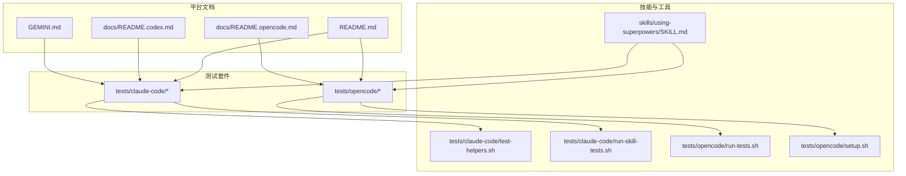
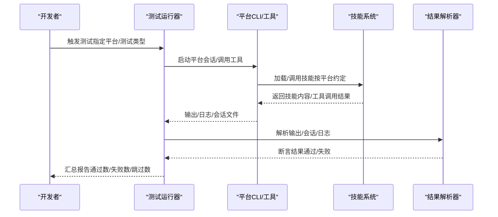
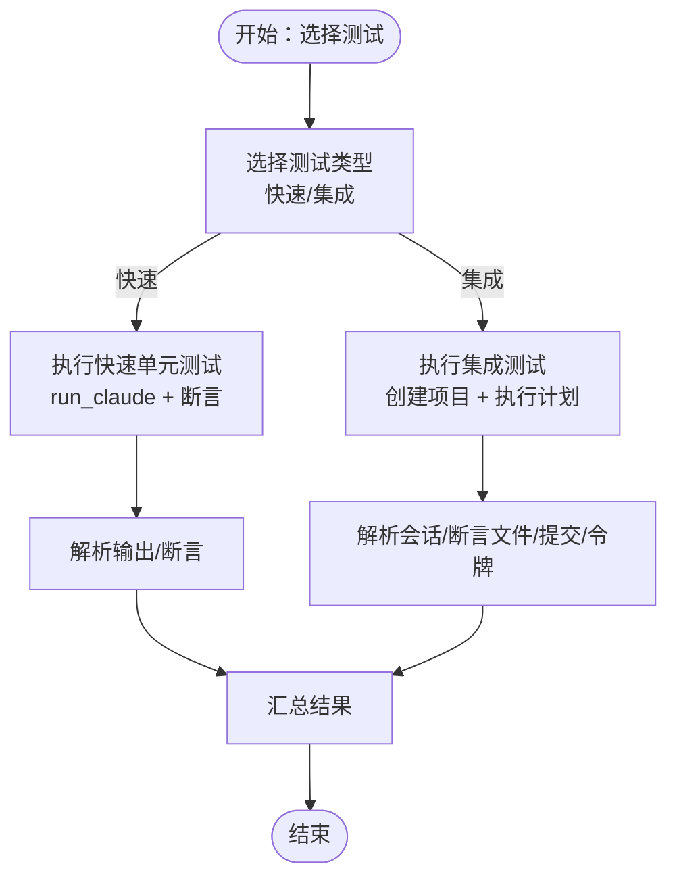
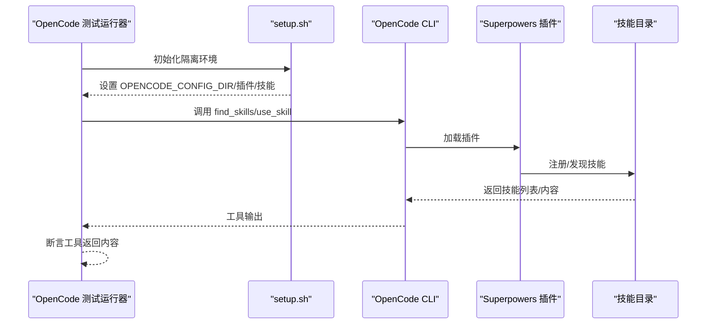
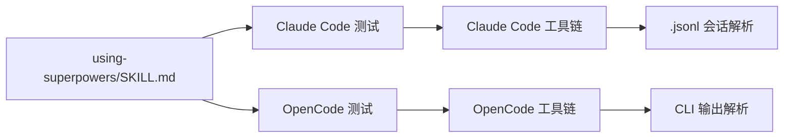

# 跨平台测试

<cite>
**本文引用的文件**
- [README.md](file://README.md)
- [docs/testing.md](file://docs/testing.md)
- [docs/README.codex.md](file://docs/README.codex.md)
- [docs/README.opencode.md](file://docs/README.opencode.md)
- [GEMINI.md](file://GEMINI.md)
- [tests/claude-code/README.md](file://tests/claude-code/README.md)
- [tests/claude-code/run-skill-tests.sh](file://tests/claude-code/run-skill-tests.sh)
- [tests/claude-code/test-helpers.sh](file://tests/claude-code/test-helpers.sh)
- [tests/claude-code/test-subagent-driven-development.sh](file://tests/claude-code/test-subagent-driven-development.sh)
- [tests/claude-code/test-subagent-driven-development-integration.sh](file://tests/claude-code/test-subagent-driven-development-integration.sh)
- [tests/opencode/setup.sh](file://tests/opencode/setup.sh)
- [tests/opencode/run-tests.sh](file://tests/opencode/run-tests.sh)
- [tests/opencode/test-plugin-loading.sh](file://tests/opencode/test-plugin-loading.sh)
- [tests/opencode/test-tools.sh](file://tests/opencode/test-tools.sh)
- [skills/using-superpowers/SKILL.md](file://skills/using-superpowers/SKILL.md)
</cite>

## 目录
1. [简介](#简介)
2. [项目结构](#项目结构)
3. [核心组件](#核心组件)
4. [架构总览](#架构总览)
5. [详细组件分析](#详细组件分析)
6. [依赖关系分析](#依赖关系分析)
7. [性能考量](#性能考量)
8. [故障排查指南](#故障排查指南)
9. [结论](#结论)
10. [附录](#附录)

## 简介
本文件面向 Superpowers 在多 AI 平台（Claude Code、Cursor、Codex、OpenCode、Gemini）上的跨平台一致性测试，系统化阐述测试策略、测试用例设计、平台差异与兼容性验证、测试环境搭建与配置、自动化与持续集成实践，并提供可操作的测试示例与调整策略。

## 项目结构
仓库采用“按平台与能力分层”的组织方式：
- 平台安装与使用文档：docs/README.{codex,opencode}.md、GEMINI.md、README.md
- 测试套件：
  - tests/claude-code：基于 Claude Code CLI 的技能测试与集成测试
  - tests/opencode：基于 OpenCode 插件的加载与工具功能测试
- 技能定义：skills/using-superpowers/SKILL.md 等
- 工具与脚本：tests/*/run-skill-tests.sh、tests/*/test-helpers.sh 等

图表来源
- [README.md:1-191](file://README.md#L1-L191)
- [docs/README.codex.md:1-127](file://docs/README.codex.md#L1-L127)
- [docs/README.opencode.md:1-131](file://docs/README.opencode.md#L1-L131)
- [GEMINI.md:1-3](file://GEMINI.md#L1-L3)
- [tests/claude-code/README.md:1-159](file://tests/claude-code/README.md#L1-L159)
- [tests/opencode/run-tests.sh:1-164](file://tests/opencode/run-tests.sh#L1-L164)
- [tests/opencode/setup.sh:1-89](file://tests/opencode/setup.sh#L1-L89)
- [skills/using-superpowers/SKILL.md:1-118](file://skills/using-superpowers/SKILL.md#L1-L118)

章节来源
- [README.md:1-191](file://README.md#L1-L191)
- [docs/README.codex.md:1-127](file://docs/README.codex.md#L1-L127)
- [docs/README.opencode.md:1-131](file://docs/README.opencode.md#L1-L131)
- [GEMINI.md:1-3](file://GEMINI.md#L1-L3)

## 核心组件
- 测试运行器与辅助函数
  - Claude Code：tests/claude-code/run-skill-tests.sh、tests/claude-code/test-helpers.sh
  - OpenCode：tests/opencode/run-tests.sh、tests/opencode/setup.sh
- 测试用例
  - Claude Code：快速单元测试与集成测试（子代理驱动开发）
  - OpenCode：插件加载、工具可用性与优先级测试
- 平台适配与工具映射
  - skills/using-superpowers/SKILL.md 提供平台工具映射与加载约定
  - GEMINI.md 引入 Gemini 工具映射

章节来源
- [tests/claude-code/run-skill-tests.sh:1-188](file://tests/claude-code/run-skill-tests.sh#L1-L188)
- [tests/claude-code/test-helpers.sh:1-203](file://tests/claude-code/test-helpers.sh#L1-L203)
- [tests/opencode/run-tests.sh:1-164](file://tests/opencode/run-tests.sh#L1-L164)
- [tests/opencode/setup.sh:1-89](file://tests/opencode/setup.sh#L1-L89)
- [skills/using-superpowers/SKILL.md:1-118](file://skills/using-superpowers/SKILL.md#L1-L118)
- [GEMINI.md:1-3](file://GEMINI.md#L1-L3)

## 架构总览
下图展示了跨平台测试的整体流程：测试运行器根据平台选择合适的测试集，调用平台 CLI 或工具，解析会话输出或日志，断言技能行为与工具映射的一致性。

图表来源
- [tests/claude-code/run-skill-tests.sh:1-188](file://tests/claude-code/run-skill-tests.sh#L1-L188)
- [tests/opencode/run-tests.sh:1-164](file://tests/opencode/run-tests.sh#L1-L164)
- [skills/using-superpowers/SKILL.md:1-118](file://skills/using-superpowers/SKILL.md#L1-L118)

## 详细组件分析

### Claude Code 测试体系
- 快速单元测试：验证技能加载、工作流顺序、自审要求、计划读取效率、审查循环、任务上下文提供等
- 集成测试：实际执行实现计划，断言文件生成、测试通过、Git 提交历史、令牌用量分析等
- 运行器与辅助函数：统一命令行参数、超时控制、输出捕获、断言工具、临时项目创建与清理

图表来源
- [tests/claude-code/README.md:1-159](file://tests/claude-code/README.md#L1-L159)
- [tests/claude-code/run-skill-tests.sh:1-188](file://tests/claude-code/run-skill-tests.sh#L1-L188)
- [tests/claude-code/test-helpers.sh:1-203](file://tests/claude-code/test-helpers.sh#L1-L203)
- [tests/claude-code/test-subagent-driven-development.sh:1-166](file://tests/claude-code/test-subagent-driven-development.sh#L1-L166)
- [tests/claude-code/test-subagent-driven-development-integration.sh:1-315](file://tests/claude-code/test-subagent-driven-development-integration.sh#L1-L315)

章节来源
- [tests/claude-code/README.md:1-159](file://tests/claude-code/README.md#L1-L159)
- [tests/claude-code/run-skill-tests.sh:1-188](file://tests/claude-code/run-skill-tests.sh#L1-L188)
- [tests/claude-code/test-helpers.sh:1-203](file://tests/claude-code/test-helpers.sh#L1-L203)
- [tests/claude-code/test-subagent-driven-development.sh:1-166](file://tests/claude-code/test-subagent-driven-development.sh#L1-L166)
- [tests/claude-code/test-subagent-driven-development-integration.sh:1-315](file://tests/claude-code/test-subagent-driven-development-integration.sh#L1-L315)

### OpenCode 测试体系
- 插件加载测试：验证插件注册、技能目录存在、bootstrap 关键技能存在、JS 语法检查、路径引导正确性
- 工具功能测试：find_skills 与 use_skill 工具可用性，个人技能与 Superpowers 技能可见性
- 隔离环境：setup.sh 创建独立 HOME/配置目录，模拟真实安装布局

图表来源
- [tests/opencode/run-tests.sh:1-164](file://tests/opencode/run-tests.sh#L1-L164)
- [tests/opencode/setup.sh:1-89](file://tests/opencode/setup.sh#L1-L89)
- [tests/opencode/test-plugin-loading.sh:1-83](file://tests/opencode/test-plugin-loading.sh#L1-L83)
- [tests/opencode/test-tools.sh:1-105](file://tests/opencode/test-tools.sh#L1-L105)

章节来源
- [tests/opencode/run-tests.sh:1-164](file://tests/opencode/run-tests.sh#L1-L164)
- [tests/opencode/setup.sh:1-89](file://tests/opencode/setup.sh#L1-L89)
- [tests/opencode/test-plugin-loading.sh:1-83](file://tests/opencode/test-plugin-loading.sh#L1-L83)
- [tests/opencode/test-tools.sh:1-105](file://tests/opencode/test-tools.sh#L1-L105)

### 平台差异与兼容性验证
- 工具映射与加载约定
  - 使用技能前必须先调用平台的“技能工具”（Claude Code 的 Skill、Copilot CLI 的 skill、Gemini CLI 的 activate_skill），再遵循技能内容
  - 非 CC 平台需参考 references 下的工具映射文档（Copilot、Codex）
- 会话与输出解析
  - Claude Code：解析 .jsonl 会话文件中的工具调用与使用量
  - OpenCode：解析 CLI 输出，断言工具返回内容
- 权限与目录访问
  - Claude Code 集成测试需要 --add-dir 与 --permission-mode bypassPermissions
  - OpenCode 通过 setup.sh 将测试项目置于受控配置目录中

章节来源
- [skills/using-superpowers/SKILL.md:1-118](file://skills/using-superpowers/SKILL.md#L1-L118)
- [docs/testing.md:1-304](file://docs/testing.md#L1-L304)
- [tests/claude-code/test-subagent-driven-development-integration.sh:1-315](file://tests/claude-code/test-subagent-driven-development-integration.sh#L1-L315)
- [tests/opencode/test-tools.sh:1-105](file://tests/opencode/test-tools.sh#L1-L105)

### 测试用例设计与示例
- Claude Code 快速测试要点
  - 技能识别：确认技能名称与描述被正确识别
  - 工作流顺序：规范先“规范符合性审查”后“代码质量审查”
  - 自审要求：实现者应在上报前完成自审
  - 计划读取：控制器仅在开始时读取一次计划
  - 审查循环：发现问题时进入循环直至合规
  - 任务上下文：直接提供完整任务文本，避免让子代理读取文件
  - 前置技能：需要使用 git worktrees 技能
  - 主分支风险：不建议在主分支直接实施
- Claude Code 集成测试要点
  - 会话中出现 Skill 工具调用
  - 使用 Task 工具派发子代理
  - 使用 TodoWrite 追踪任务
  - 实际生成实现文件与测试文件
  - 测试通过
  - Git 提交历史体现工作流
  - 可选：令牌用量分析
- OpenCode 测试要点
  - 插件注册与 JS 语法检查
  - 技能目录存在且包含关键技能
  - find_skills 能列出 Superpowers 技能
  - use_skill 能加载个人技能与 Superpowers 技能

章节来源
- [tests/claude-code/test-subagent-driven-development.sh:1-166](file://tests/claude-code/test-subagent-driven-development.sh#L1-L166)
- [tests/claude-code/test-subagent-driven-development-integration.sh:1-315](file://tests/claude-code/test-subagent-driven-development-integration.sh#L1-L315)
- [tests/opencode/test-plugin-loading.sh:1-83](file://tests/opencode/test-plugin-loading.sh#L1-L83)
- [tests/opencode/test-tools.sh:1-105](file://tests/opencode/test-tools.sh#L1-L105)

### 测试环境搭建与配置
- Claude Code
  - 安装 Claude Code CLI 并确保在 PATH 中
  - 启用本地开发市场：在设置中开启本地插件
  - 运行测试时从插件根目录执行，以便加载本地技能
  - 集成测试需授予目录权限与工具使用权限
- OpenCode
  - 安装 OpenCode CLI
  - 通过 setup.sh 创建隔离环境，模拟标准安装布局
  - 插件通过符号链接注册到 OpenCode 配置目录
  - 运行工具测试前确保 OpenCode 可用

章节来源
- [tests/claude-code/README.md:1-159](file://tests/claude-code/README.md#L1-L159)
- [docs/testing.md:1-304](file://docs/testing.md#L1-L304)
- [tests/opencode/setup.sh:1-89](file://tests/opencode/setup.sh#L1-L89)

### 平台特定限制与调整策略
- Claude Code
  - 会话文件位置与命名规则固定，需按工作目录转义路径查找
  - 需要显式允许工具使用与目录访问，否则会话会被阻断
  - 集成测试耗时较长，建议在 CI 中增加超时时间
- OpenCode
  - 插件加载依赖正确的配置目录结构与符号链接
  - 工具测试依赖 OpenCode CLI 可用，否则跳过
  - 个人技能与项目技能优先级高于 Superpowers 技能，测试中需注意覆盖范围
- Gemini/Cursor/Copilot
  - 技能内容以 Claude Code 工具名编写，需通过工具映射文档进行平台适配
  - Gemini CLI 通过 GEMINI.md 自动加载工具映射

章节来源
- [docs/testing.md:1-304](file://docs/testing.md#L1-L304)
- [docs/README.opencode.md:1-131](file://docs/README.opencode.md#L1-L131)
- [GEMINI.md:1-3](file://GEMINI.md#L1-L3)
- [skills/using-superpowers/SKILL.md:1-118](file://skills/using-superpowers/SKILL.md#L1-L118)

### 自动化流程与持续集成
- Claude Code
  - run-skill-tests.sh 支持 --integration、--timeout、--verbose、--test 等参数
  - CI 中建议设置更长超时（如 900 秒），并仅运行必要测试
- OpenCode
  - run-tests.sh 支持 --integration、--verbose、--test
  - 工具测试在未安装 OpenCode 时自动跳过
- 建议的 CI 配置要点
  - 分阶段执行：先运行快速测试，再在专用流水线运行集成测试
  - 缓存：缓存平台 CLI 与插件安装产物
  - 日志：启用 --verbose 以保留调试信息
  - 失败重试：对不稳定平台（如网络受限）可增加重试次数

章节来源
- [tests/claude-code/README.md:1-159](file://tests/claude-code/README.md#L1-L159)
- [tests/claude-code/run-skill-tests.sh:1-188](file://tests/claude-code/run-skill-tests.sh#L1-L188)
- [tests/opencode/run-tests.sh:1-164](file://tests/opencode/run-tests.sh#L1-L164)

## 依赖关系分析
- 平台依赖
  - Claude Code：依赖 claude CLI、本地开发市场设置、会话文件解析
  - OpenCode：依赖 opencode CLI、配置目录结构、符号链接注册
- 技能依赖
  - using-superpowers 是关键 bootstrap 技能，决定技能加载与优先级
  - 子代理驱动开发等复杂技能依赖前置技能（如 git worktrees）
- 工具依赖
  - Claude Code：Skill、Task、TodoWrite、会话分析脚本
  - OpenCode：find_skills、use_skill、插件注册

图表来源
- [skills/using-superpowers/SKILL.md:1-118](file://skills/using-superpowers/SKILL.md#L1-L118)
- [tests/claude-code/test-subagent-driven-development-integration.sh:1-315](file://tests/claude-code/test-subagent-driven-development-integration.sh#L1-L315)
- [tests/opencode/test-tools.sh:1-105](file://tests/opencode/test-tools.sh#L1-L105)

章节来源
- [skills/using-superpowers/SKILL.md:1-118](file://skills/using-superpowers/SKILL.md#L1-L118)
- [tests/claude-code/test-subagent-driven-development-integration.sh:1-315](file://tests/claude-code/test-subagent-driven-development-integration.sh#L1-L315)
- [tests/opencode/test-tools.sh:1-105](file://tests/opencode/test-tools.sh#L1-L105)

## 性能考量
- 集成测试耗时
  - Claude Code 集成测试通常 10-30 分钟，应合理设置超时与并行度
- 令牌成本
  - 集成测试包含子代理调用，建议开启令牌分析以监控成本
- CI 成本控制
  - 将集成测试拆分为独立流水线，按需触发
  - 对不稳定平台增加重试与超时上限

## 故障排查指南
- Claude Code
  - 技能未加载：确认在插件根目录运行、本地开发市场已启用、技能文件存在
  - 权限错误：使用 --add-dir 与 --permission-mode bypassPermissions
  - 会话文件缺失：按工作目录转义路径查找最近会话文件
  - 超时：增大超时时间或简化测试任务
- OpenCode
  - 插件未加载：检查符号链接、配置目录结构、JS 语法
  - 工具不可用：确认 OpenCode CLI 可用，工具返回内容是否包含预期技能
  - 优先级问题：确认个人/项目技能优先级高于 Superpowers 技能

章节来源
- [docs/testing.md:1-304](file://docs/testing.md#L1-L304)
- [tests/claude-code/README.md:1-159](file://tests/claude-code/README.md#L1-L159)
- [tests/opencode/test-plugin-loading.sh:1-83](file://tests/opencode/test-plugin-loading.sh#L1-L83)
- [tests/opencode/test-tools.sh:1-105](file://tests/opencode/test-tools.sh#L1-L105)

## 结论
通过统一的测试运行器、平台工具映射与严格的会话/输出解析机制，Superpowers 能够在多平台上保持一致的技能行为。建议在 CI 中分阶段执行快速与集成测试，并针对平台特性（权限、工具、路径）制定明确的测试策略与回退方案。

## 附录
- 平台工具映射与加载约定请参考：
  - [skills/using-superpowers/SKILL.md:1-118](file://skills/using-superpowers/SKILL.md#L1-L118)
  - [GEMINI.md:1-3](file://GEMINI.md#L1-L3)
- 测试运行与参数参考：
  - [tests/claude-code/README.md:1-159](file://tests/claude-code/README.md#L1-L159)
  - [tests/opencode/run-tests.sh:1-164](file://tests/opencode/run-tests.sh#L1-L164)