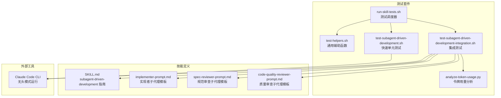
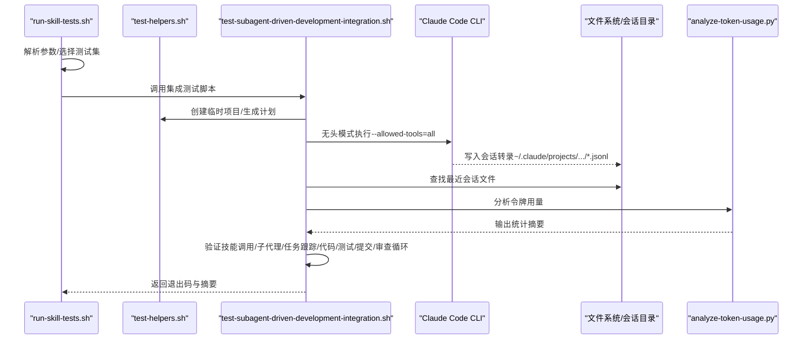
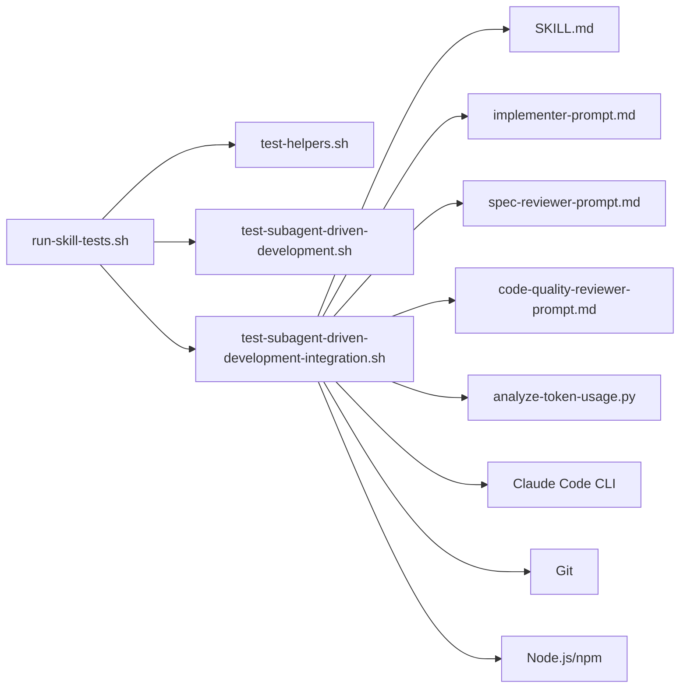
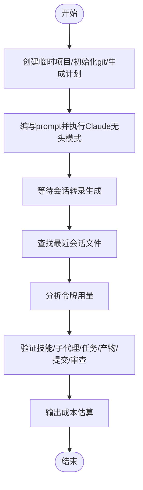

# 集成测试

<cite>
**本文引用的文件**
- [tests/claude-code/README.md](file://tests/claude-code/README.md)
- [tests/claude-code/run-skill-tests.sh](file://tests/claude-code/run-skill-tests.sh)
- [tests/claude-code/test-helpers.sh](file://tests/claude-code/test-helpers.sh)
- [tests/claude-code/test-subagent-driven-development.sh](file://tests/claude-code/test-subagent-driven-development.sh)
- [tests/claude-code/test-subagent-driven-development-integration.sh](file://tests/claude-code/test-subagent-driven-development-integration.sh)
- [tests/claude-code/analyze-token-usage.py](file://tests/claude-code/analyze-token-usage.py)
- [skills/subagent-driven-development/SKILL.md](file://skills/subagent-driven-development/SKILL.md)
- [skills/subagent-driven-development/implementer-prompt.md](file://skills/subagent-driven-development/implementer-prompt.md)
- [skills/subagent-driven-development/spec-reviewer-prompt.md](file://skills/subagent-driven-development/spec-reviewer-prompt.md)
- [skills/subagent-driven-development/code-quality-reviewer-prompt.md](file://skills/subagent-driven-development/code-quality-reviewer-prompt.md)
- [tests/subagent-driven-dev/run-test.sh](file://tests/subagent-driven-dev/run-test.sh)
- [tests/subagent-driven-dev/go-fractals/design.md](file://tests/subagent-driven-dev/go-fractals/design.md)
- [tests/subagent-driven-dev/svelte-todo/design.md](file://tests/subagent-driven-dev/svelte-todo/design.md)
- [tests/subagent-driven-dev/go-fractals/plan.md](file://tests/subagent-driven-dev/go-fractals/plan.md)
- [tests/subagent-driven-dev/svelte-todo/plan.md](file://tests/subagent-driven-dev/svelte-todo/plan.md)
</cite>

## 目录
1. [简介](#简介)
2. [项目结构](#项目结构)
3. [核心组件](#核心组件)
4. [架构总览](#架构总览)
5. [详细组件分析](#详细组件分析)
6. [依赖关系分析](#依赖关系分析)
7. [性能考量](#性能考量)
8. [故障排查指南](#故障排查指南)
9. [结论](#结论)
10. [附录](#附录)

## 简介
本文件面向 Superpowers 的集成测试体系，系统化阐述基于 Claude Code 的端到端测试架构与执行流程。重点覆盖以下方面：
- 在无头模式下运行真实 Claude 会话以验证复杂技能（如 subagent-driven-development）的行为一致性
- 测试项目的创建、临时目录管理与清理机制
- 测试执行的四个阶段：环境准备、运行技能、解析会话转录与验证结果
- 具体用例：subagent-driven-development 集成测试的完整流程
- 测试配置要求、权限设置与超时处理策略
- 常见失败原因与解决建议

## 项目结构
Superpowers 的测试体系由“快速单元测试”和“慢速集成测试”两部分组成，均通过 Bash 脚本驱动，并使用 Python 工具对 Claude 会话进行深入分析。

图表来源
- [tests/claude-code/run-skill-tests.sh:1-188](file://tests/claude-code/run-skill-tests.sh#L1-L188)
- [tests/claude-code/test-helpers.sh:1-203](file://tests/claude-code/test-helpers.sh#L1-L203)
- [tests/claude-code/test-subagent-driven-development.sh:1-166](file://tests/claude-code/test-subagent-driven-development.sh#L1-L166)
- [tests/claude-code/test-subagent-driven-development-integration.sh:1-315](file://tests/claude-code/test-subagent-driven-development-integration.sh#L1-L315)
- [tests/claude-code/analyze-token-usage.py:1-169](file://tests/claude-code/analyze-token-usage.py#L1-L169)
- [skills/subagent-driven-development/SKILL.md:1-278](file://skills/subagent-driven-development/SKILL.md#L1-L278)

章节来源
- [tests/claude-code/README.md:1-159](file://tests/claude-code/README.md#L1-L159)
- [tests/claude-code/run-skill-tests.sh:1-188](file://tests/claude-code/run-skill-tests.sh#L1-L188)

## 核心组件
- 测试调度器：负责解析参数、选择测试集、设置超时、汇总结果并输出状态码
- 辅助库：封装 run_claude、断言工具、临时项目创建与清理、计划文件生成等
- 快速单元测试：验证技能加载、工作流顺序、自审要求、一次性读取计划、审查员怀疑态度、审查循环、任务上下文提供、工作树前置条件与主分支风险提示
- 集成测试：创建真实 Node.js 项目，生成实现计划，调用 Claude 执行完整工作流，解析会话转录并验证产物、提交历史、测试通过情况与令牌用量
- 令牌分析：从会话 JSONL 中统计主会话与各子代理的消息与令牌用量，估算成本

章节来源
- [tests/claude-code/test-helpers.sh:1-203](file://tests/claude-code/test-helpers.sh#L1-L203)
- [tests/claude-code/test-subagent-driven-development.sh:1-166](file://tests/claude-code/test-subagent-driven-development.sh#L1-L166)
- [tests/claude-code/test-subagent-driven-development-integration.sh:1-315](file://tests/claude-code/test-subagent-driven-development-integration.sh#L1-L315)
- [tests/claude-code/analyze-token-usage.py:1-169](file://tests/claude-code/analyze-token-usage.py#L1-L169)

## 架构总览
下图展示从测试调度到 Claude 会话执行、转录解析与结果验证的全链路：

图表来源
- [tests/claude-code/run-skill-tests.sh:1-188](file://tests/claude-code/run-skill-tests.sh#L1-L188)
- [tests/claude-code/test-subagent-driven-development-integration.sh:1-315](file://tests/claude-code/test-subagent-driven-development-integration.sh#L1-L315)
- [tests/claude-code/analyze-token-usage.py:1-169](file://tests/claude-code/analyze-token-usage.py#L1-L169)

## 详细组件分析

### 组件A：测试调度器（run-skill-tests.sh）
- 功能要点
  - 参数解析：支持 --verbose、--test、--timeout、--integration、--help
  - 测试集合：默认仅运行快速单元测试；若传入 --integration 则追加集成测试
  - 超时控制：每个测试在 timeout 包裹下执行，区分 verbose 与非 verbose 输出
  - 结果统计：累计通过/失败/跳过数量，最终输出状态码
- 关键行为
  - 若 Claude CLI 不可用则直接退出
  - 对缺失或不可执行的测试文件进行跳过处理
  - 集成测试默认不运行，需显式开启

章节来源
- [tests/claude-code/run-skill-tests.sh:1-188](file://tests/claude-code/run-skill-tests.sh#L1-L188)

### 组件B：测试辅助库（test-helpers.sh）
- 功能要点
  - run_claude：在无头模式下调用 Claude，支持超时与工具白名单
  - 断言工具：包含/不包含/计数/顺序等断言，用于快速单元测试
  - 项目管理：创建临时目录、清理目录、生成最小实现计划
- 设计原则
  - 将断言封装为可复用的原子能力，便于组合不同维度的验证

章节来源
- [tests/claude-code/test-helpers.sh:1-203](file://tests/claude-code/test-helpers.sh#L1-L203)

### 组件C：快速单元测试（test-subagent-driven-development.sh）
- 验证目标
  - 技能可被识别与加载
  - 工作流顺序：先规范审查后质量审查
  - 实现者需自审，控制器提供完整任务文本
  - 计划只读取一次且在开始时完成
  - 规范审查员持怀疑态度并独立核查
  - 审查循环：发现问题后实现者修复再复审
  - 使用 git worktree 作为前置技能，避免直接在主分支上开发
- 执行方式
  - 通过 run_claude 发送问题，使用断言工具验证响应中是否包含预期关键词或顺序

章节来源
- [tests/claude-code/test-subagent-driven-development.sh:1-166](file://tests/claude-code/test-subagent-driven-development.sh#L1-L166)
- [tests/claude-code/test-helpers.sh:1-203](file://tests/claude-code/test-helpers.sh#L1-L203)

### 组件D：集成测试（test-subagent-driven-development-integration.sh）
- 测试目标
  - 真实执行完整工作流，验证：
    - 技能被正确调用（Skill 工具）
    - 子代理被派发（Task 工具）
    - 任务跟踪（TodoWrite 工具）
    - 产物符合规范：生成 src/math.js 与 test/math.test.js
    - 测试通过（npm test）
    - 提交历史：至少产生多于初始提交的提交
    - 规范审查有效：未出现额外功能
- 执行流程
  - 创建临时 Node.js 项目，初始化 git，生成实现计划
  - 以无头模式调用 Claude Code CLI，允许所有工具并绕过权限限制
  - 保存 Claude 输出至文件，随后查找最近会话转录（~/.claude/projects/.../*.jsonl）
  - 使用 Python 分析令牌用量，最后执行断言验证
- 权限与工具
  - 使用 --allowed-tools=all 与 --permission-mode bypassPermissions 支持自动化执行

章节来源
- [tests/claude-code/test-subagent-driven-development-integration.sh:1-315](file://tests/claude-code/test-subagent-driven-development-integration.sh#L1-L315)
- [tests/claude-code/analyze-token-usage.py:1-169](file://tests/claude-code/analyze-token-usage.py#L1-L169)

### 组件E：令牌用量分析（analyze-token-usage.py）
- 功能要点
  - 解析会话 JSONL，统计主会话与各子代理的消息数与令牌用量
  - 输出主会话与子代理的明细与总计，估算成本
- 使用场景
  - 集成测试结束后自动分析，帮助评估成本与迭代效率

章节来源
- [tests/claude-code/analyze-token-usage.py:1-169](file://tests/claude-code/analyze-token-usage.py#L1-L169)

### 组件F：技能定义与子代理模板
- subagent-driven-development 指南
  - 明确何时使用该技能、两阶段审查流程、模型选择策略、实现者状态处理、集成要求与红绿灯信号
- 子代理模板
  - implementer-prompt.md：实现者职责、自我审查清单、报告格式
  - spec-reviewer-prompt.md：规范审查员怀疑态度、独立核查要求
  - code-quality-reviewer-prompt.md：质量审查前置条件与关注点

章节来源
- [skills/subagent-driven-development/SKILL.md:1-278](file://skills/subagent-driven-development/SKILL.md#L1-L278)
- [skills/subagent-driven-development/implementer-prompt.md:1-114](file://skills/subagent-driven-development/implementer-prompt.md#L1-L114)
- [skills/subagent-driven-development/spec-reviewer-prompt.md:1-62](file://skills/subagent-driven-development/spec-reviewer-prompt.md#L1-L62)
- [skills/subagent-driven-development/code-quality-reviewer-prompt.md:1-27](file://skills/subagent-driven-development/code-quality-reviewer-prompt.md#L1-L27)

### 组件G：子代理驱动开发的端到端测试（tests/subagent-driven-dev）
- 目标
  - 在本地插件目录下，通过 run-test.sh 驱动 Claude 执行指定计划，产出项目与日志，便于人工复核
- 特性
  - 自动创建带时间戳的输出目录
  - 可指定插件目录位置
  - 以 stream-json 输出便于统计令牌用量
  - 提供后续检查命令（查看项目、查看日志、运行测试）

章节来源
- [tests/subagent-driven-dev/run-test.sh:1-107](file://tests/subagent-driven-dev/run-test.sh#L1-L107)

## 依赖关系分析
- 脚本耦合
  - run-skill-tests.sh 依赖 test-helpers.sh 提供的断言与项目管理能力
  - 集成测试依赖技能定义与子代理模板，确保 Claude 的行为与规范一致
- 外部依赖
  - Claude Code CLI：无头模式执行与工具调用
  - Python：用于解析会话转录并统计令牌用量
  - Git：用于提交历史验证
  - Node.js：用于 npm test 验证产物

图表来源
- [tests/claude-code/run-skill-tests.sh:1-188](file://tests/claude-code/run-skill-tests.sh#L1-L188)
- [tests/claude-code/test-helpers.sh:1-203](file://tests/claude-code/test-helpers.sh#L1-L203)
- [tests/claude-code/test-subagent-driven-development-integration.sh:1-315](file://tests/claude-code/test-subagent-driven-development-integration.sh#L1-L315)
- [skills/subagent-driven-development/SKILL.md:1-278](file://skills/subagent-driven-development/SKILL.md#L1-L278)

## 性能考量
- 超时策略
  - 默认每项测试超时 300 秒；集成测试使用更长超时（如 1800 秒）
  - 通过 --timeout 可调整单次测试超时
- 令牌成本
  - analyze-token-usage.py 提供输入/输出令牌与缓存命中统计，估算成本
  - 建议在 CI 环境显式设置超时，避免长时间挂起
- 并发与资源
  - 测试脚本串行执行，避免并发冲突
  - 临时项目清理由 trap 保障，防止磁盘占用

## 故障排查指南
- Claude CLI 未安装或不在 PATH
  - 现象：启动即报错并退出
  - 处理：安装 Claude Code CLI 并确保在 PATH 中
- 测试超时
  - 现象：输出显示 timeout 或耗时过长
  - 处理：增大 --timeout；检查网络与工具权限；确认 --allowed-tools=all 与 --permission-mode bypassPermissions 设置
- 会话转录未找到
  - 现象：集成测试无法定位 ~/.claude/projects/.../*.jsonl
  - 处理：确认 Claude 正常执行；检查当前工作目录与权限；确保在仓库根目录运行
- 规范审查未生效
  - 现象：产物包含额外功能
  - 处理：检查 spec-reviewer-prompt.md 的怀疑态度与独立核查要求是否被遵循；必要时增加审查循环断言
- 测试失败但输出不详尽
  - 现象：非 verbose 模式下仅显示失败摘要
  - 处理：使用 --verbose 查看完整 Claude 输出，结合会话转录定位问题
- 令牌用量异常
  - 现象：输入/输出令牌过高
  - 处理：检查是否多次读取计划、是否遗漏子代理自审、是否提前进入质量审查

章节来源
- [tests/claude-code/README.md:126-159](file://tests/claude-code/README.md#L126-L159)
- [tests/claude-code/test-subagent-driven-development-integration.sh:164-177](file://tests/claude-code/test-subagent-driven-development-integration.sh#L164-L177)

## 结论
Superpowers 的集成测试通过“快速单元测试 + 集成测试”的双轨设计，在保证可重复性的同时覆盖真实工作流的关键路径。借助 Claude Code 的无头模式与会话转录分析，测试能够验证技能的正确性、子代理的协作效果、产物质量与成本控制。建议在 CI 环境中启用较长超时并定期审查令牌用量，以平衡稳定性与成本。

## 附录

### A. subagent-driven-development 集成测试完整流程（步骤化）
- 准备阶段
  - 创建临时 Node.js 项目，初始化 git，生成实现计划
  - 编写 prompt，明确要求：一次性读取计划、提供完整任务文本、先规范审查后质量审查、使用审查循环
- 执行阶段
  - 以无头模式调用 Claude Code CLI，允许所有工具并绕过权限限制
  - 保存 Claude 输出至文件，等待会话转录生成
- 解析阶段
  - 查找最近会话转录（按时间窗口筛选）
  - 使用 analyze-token-usage.py 输出令牌用量统计
- 验证阶段
  - 技能调用：Skill 工具被调用
  - 子代理派发：Task 工具至少两次
  - 任务跟踪：TodoWrite 工具被使用
  - 产物验证：生成 src/math.js 与 test/math.test.js，测试通过
  - 提交历史：提交次数大于初始提交
  - 规范审查：未发现额外功能
  - 成本评估：输出令牌用量与估算成本

图表来源
- [tests/claude-code/test-subagent-driven-development-integration.sh:1-315](file://tests/claude-code/test-subagent-driven-development-integration.sh#L1-L315)
- [tests/claude-code/analyze-token-usage.py:1-169](file://tests/claude-code/analyze-token-usage.py#L1-L169)

### B. 测试配置与权限
- Claude CLI
  - 必须安装并在 PATH 中
  - 集成测试使用 --allowed-tools=all 与 --permission-mode bypassPermissions
- 超时设置
  - 默认 300 秒；可通过 --timeout 调整
  - 集成测试建议更高超时值
- 权限与工具
  - 为支持子代理工具调用与文件操作，需放宽权限限制
- 会话转录
  - 位于用户主目录下的 ~/.claude/projects/.../*.jsonl

章节来源
- [tests/claude-code/README.md:9-39](file://tests/claude-code/README.md#L9-L39)
- [tests/claude-code/test-subagent-driven-development-integration.sh:136-158](file://tests/claude-code/test-subagent-driven-development-integration.sh#L136-L158)

### C. 测试用例示例：Go Fractals 与 Svelte Todo
- Go Fractals
  - 设计文档与实现计划覆盖 CLI 命令、算法实现、测试与验证标准
  - 适合使用 subagent-driven-development 进行端到端执行与验证
- Svelte Todo
  - 设计文档与实现计划覆盖组件拆分、状态管理、持久化与端到端测试
  - 适合使用 subagent-driven-development 进行端到端执行与验证

章节来源
- [tests/subagent-driven-dev/go-fractals/design.md:1-82](file://tests/subagent-driven-dev/go-fractals/design.md#L1-L82)
- [tests/subagent-driven-dev/svelte-todo/design.md:1-71](file://tests/subagent-driven-dev/svelte-todo/design.md#L1-L71)
- [tests/subagent-driven-dev/go-fractals/plan.md:1-173](file://tests/subagent-driven-dev/go-fractals/plan.md#L1-L173)
- [tests/subagent-driven-dev/svelte-todo/plan.md:1-223](file://tests/subagent-driven-dev/svelte-todo/plan.md#L1-L223)