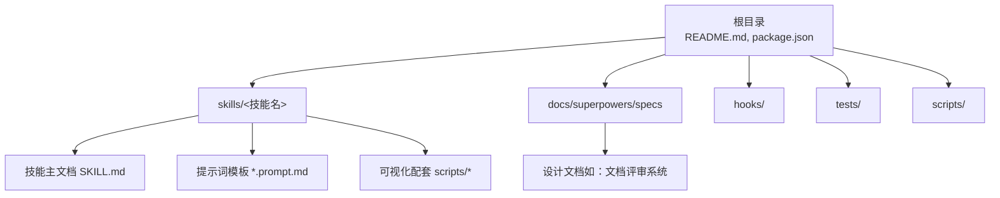
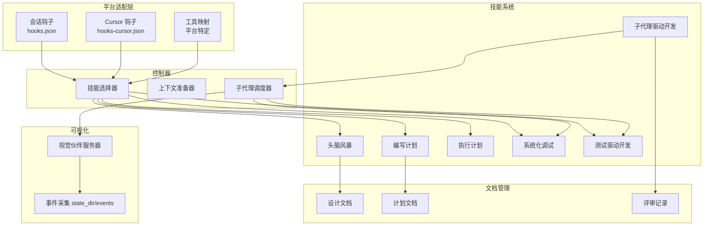
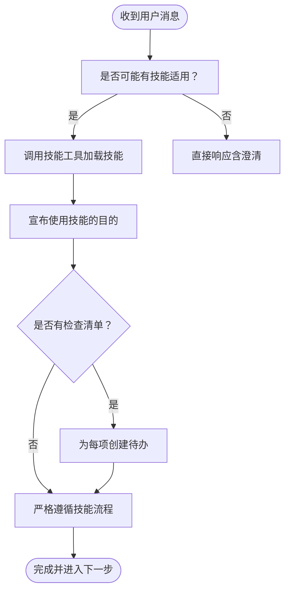
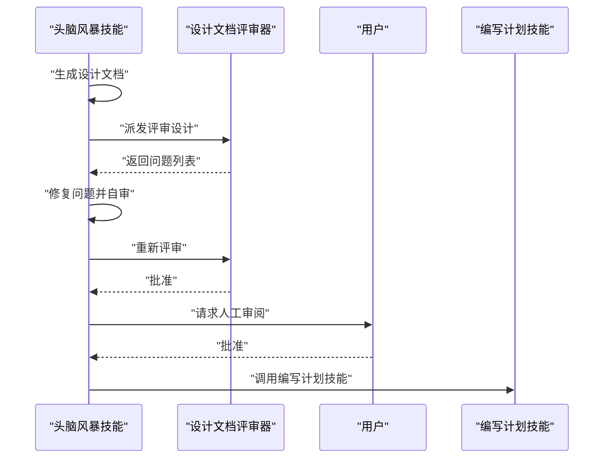
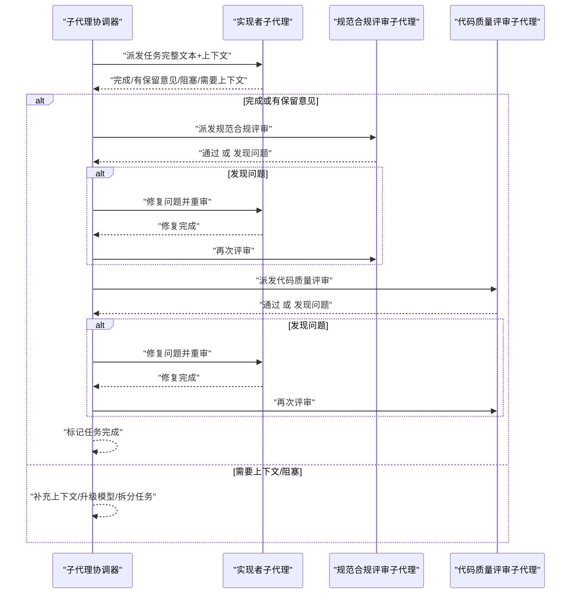
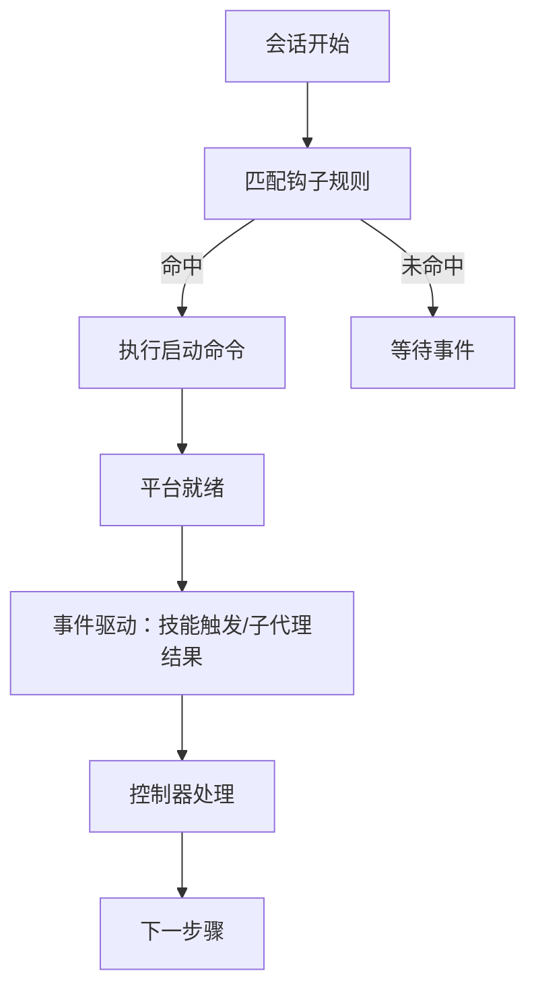
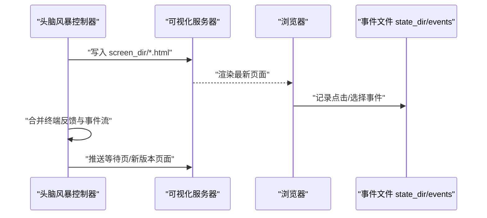
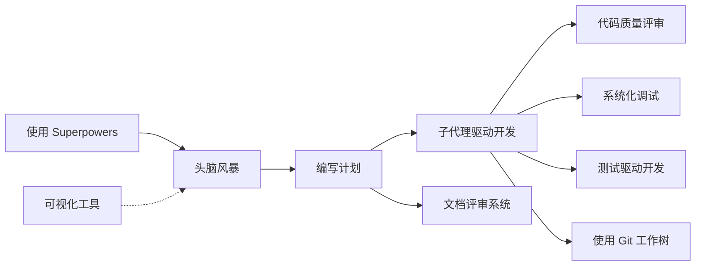

# 组件设计

<cite>
**本文档引用的文件**
- [README.md](file://README.md)
- [package.json](file://package.json)
- [hooks.json](file://hooks/hooks.json)
- [hooks-cursor.json](file://hooks/hooks-cursor.json)
- [SKILL.md（头脑风暴）](file://skills/brainstorming/SKILL.md)
- [visual-companion.md](file://skills/brainstorming/visual-companion.md)
- [spec-document-reviewer-prompt.md](file://skills/brainstorming/spec-document-reviewer-prompt.md)
- [SKILL.md（子代理驱动开发）](file://skills/subagent-driven-development/SKILL.md)
- [implementer-prompt.md](file://skills/subagent-driven-development/implementer-prompt.md)
- [spec-reviewer-prompt.md](file://skills/subagent-driven-development/spec-reviewer-prompt.md)
- [code-quality-reviewer-prompt.md](file://skills/subagent-driven-development/code-quality-reviewer-prompt.md)
- [SKILL.md（编写计划）](file://skills/writing-plans/SKILL.md)
- [SKILL.md（执行计划）](file://skills/executing-plans/SKILL.md)
- [SKILL.md（使用 Superpowers）](file://skills/using-superpowers/SKILL.md)
- [SKILL.md（系统化调试）](file://skills/systematic-debugging/SKILL.md)
- [SKILL.md（测试驱动开发）](file://skills/test-driven-development/SKILL.md)
- [2026-01-22-document-review-system-design.md](file://docs/superpowers/specs/2026-01-22-document-review-system-design.md)
</cite>

## 目录
1. [简介](#简介)
2. [项目结构](#项目结构)
3. [核心组件](#核心组件)
4. [架构总览](#架构总览)
5. [详细组件分析](#详细组件分析)
6. [依赖关系分析](#依赖关系分析)
7. [性能考量](#性能考量)
8. [故障排除指南](#故障排除指南)
9. [结论](#结论)
10. [附录](#附录)

## 简介
本文件面向 Superpowers 的组件设计，系统性阐述其核心组件与职责分工：技能系统、文档管理系统、子代理协调器、平台适配层与可视化工具。文档重点说明各组件的内部结构、接口定义与交互协议，解释组件间的依赖关系与通信机制（事件驱动与钩子系统），并提供组件交互图与数据流图，覆盖不同工作流中的协作方式。同时记录生命周期管理、错误处理策略与性能考虑，帮助读者快速理解并高效使用该系统。

## 项目结构
Superpowers 以“可组合技能”为核心，围绕技能的触发、执行与反馈形成闭环。仓库采用按功能域分层的组织方式：
- skills：技能定义与模板（含提示词模板）
- docs：文档规范与设计说明
- hooks：平台钩子配置
- tests：技能触发与集成测试
- scripts：可视化配套脚本
- 根目录：README、包配置等

图表来源
- [README.md:1-191](file://README.md#L1-L191)
- [package.json:1-7](file://package.json#L1-L7)

章节来源
- [README.md:1-191](file://README.md#L1-L191)
- [package.json:1-7](file://package.json#L1-L7)

## 核心组件
- 技能系统（Skills）：定义可组合的工作流与行为规则，通过触发条件自动或手动激活，确保过程纪律与一致性。
- 文档管理系统（Docs）：规范设计与计划文档的生成、评审与版本化，支持迭代式审查与质量门禁。
- 子代理协调器（Subagent Orchestrator）：在任务级调度子代理，执行两阶段评审（规范符合性 → 代码质量），并管理状态流转与回退。
- 平台适配层（Platform Adapter）：通过钩子与工具映射适配不同平台（Claude Code、Cursor、Copilot、Gemini、Codex、OpenCode），统一入口与生命周期。
- 可视化工具（Visual Companion）：提供浏览器端的可视化协作能力，用于设计与原型展示，支持事件采集与状态同步。

章节来源
- [README.md:108-151](file://README.md#L108-L151)
- [hooks.json:1-17](file://hooks/hooks.json#L1-L17)
- [hooks-cursor.json:1-11](file://hooks/hooks-cursor.json#L1-L11)

## 架构总览
Superpowers 的运行时由“控制器 + 技能 + 子代理 + 平台适配 + 可视化”构成。控制器负责解析用户意图、选择合适技能、准备上下文并调度子代理；技能定义流程与检查点；平台适配层提供工具调用与钩子；可视化工具在需要时提供交互界面。

图表来源
- [hooks.json:1-17](file://hooks/hooks.json#L1-L17)
- [hooks-cursor.json:1-11](file://hooks/hooks-cursor.json#L1-L11)
- [SKILL.md（头脑风暴）:1-165](file://skills/brainstorming/SKILL.md#L1-L165)
- [SKILL.md（编写计划）:1-153](file://skills/writing-plans/SKILL.md#L1-L153)
- [SKILL.md（子代理驱动开发）:1-278](file://skills/subagent-driven-development/SKILL.md#L1-L278)
- [SKILL.md（执行计划）:1-71](file://skills/executing-plans/SKILL.md#L1-L71)
- [SKILL.md（系统化调试）:1-297](file://skills/systematic-debugging/SKILL.md#L1-L297)
- [SKILL.md（测试驱动开发）:1-372](file://skills/test-driven-development/SKILL.md#L1-L372)
- [visual-companion.md:1-288](file://skills/brainstorming/visual-companion.md#L1-L288)

## 详细组件分析

### 技能系统（Skills）
- 职责
  - 定义触发条件与执行流程，确保过程纪律（如 TDD、系统化调试、设计评审）。
  - 提供提示词模板与子技能依赖，保证跨技能的一致性与可复用性。
- 关键接口
  - 触发入口：Skill 工具（平台适配层提供映射）。
  - 检查清单：技能内列出的步骤项，控制器可转换为待办事项。
  - 子技能依赖：通过“必需子技能”声明与其他技能协作。
- 交互协议
  - 先触发技能，再执行具体动作；若技能不适用则跳过。
  - 多个技能可叠加，优先级由类型决定（过程类优先于实现类）。
- 生命周期
  - 加载：平台加载技能元数据与内容。
  - 执行：严格遵循流程与检查点，必要时回滚或重试。
  - 结束：输出阶段性成果（设计、计划、评审意见）。

图表来源
- [SKILL.md（使用 Superpowers）:1-118](file://skills/using-superpowers/SKILL.md#L1-L118)

章节来源
- [SKILL.md（使用 Superpowers）:1-118](file://skills/using-superpowers/SKILL.md#L1-L118)
- [SKILL.md（系统化调试）:1-297](file://skills/systematic-debugging/SKILL.md#L1-L297)
- [SKILL.md（测试驱动开发）:1-372](file://skills/test-driven-development/SKILL.md#L1-L372)

### 文档管理系统（Docs）
- 职责
  - 规范设计与计划文档的格式、保存位置与版本控制。
  - 引入两阶段文档评审：设计文档评审与计划文档评审，采用迭代闭环。
- 关键接口
  - 设计文档：保存至 docs/superpowers/specs/，包含自审与用户审阅。
  - 计划文档：保存至 docs/superpowers/plans/，按模块分块评审。
  - 评审器提示词：分别针对设计与计划的评审模板。
- 交互协议
  - 设计评审：发现问题 → 修改 → 再评审 → 直至批准。
  - 计划评审：按模块分块评审，逐块通过后进入下一块。
- 错误处理
  - 输出格式校验失败：重新派发评审并提示格式要求。
  - 评审循环超过阈值：上报人类决策（继续、批准、中止）。

图表来源
- [2026-01-22-document-review-system-design.md:1-137](file://docs/superpowers/specs/2026-01-22-document-review-system-design.md#L1-L137)
- [spec-document-reviewer-prompt.md:1-50](file://skills/brainstorming/spec-document-reviewer-prompt.md#L1-L50)
- [SKILL.md（编写计划）:1-153](file://skills/writing-plans/SKILL.md#L1-L153)

章节来源
- [2026-01-22-document-review-system-design.md:1-137](file://docs/superpowers/specs/2026-01-22-document-review-system-design.md#L1-L137)
- [spec-document-reviewer-prompt.md:1-50](file://skills/brainstorming/spec-document-reviewer-prompt.md#L1-L50)

### 子代理协调器（Subagent Orchestrator）
- 职责
  - 在任务粒度上调度子代理，执行“实现者 → 规范合规评审 → 代码质量评审”的两阶段评审。
  - 管理子代理状态（完成、有保留意见、阻塞、需要上下文），并进行再调度或升级模型。
- 关键接口
  - 实现者提示词：提供完整任务文本与场景设定，要求先问后做。
  - 规范合规评审提示词：独立验证实现是否“不多不少”。
  - 代码质量评审提示词：基于提交范围进行质量评估。
- 交互协议
  - 每个任务完成后，先进行规范合规评审，通过后再进行代码质量评审。
  - 若发现缺陷，实现者修复后需再次评审，直至通过。
  - 评审顺序不可颠倒（必须先规范后质量）。
- 生命周期
  - 任务提取：从计划中一次性提取所有任务，避免重复读取。
  - 任务执行：逐项推进，标记完成，最终进行整体代码评审并结束。

图表来源
- [SKILL.md（子代理驱动开发）:1-278](file://skills/subagent-driven-development/SKILL.md#L1-L278)
- [implementer-prompt.md:1-114](file://skills/subagent-driven-development/implementer-prompt.md#L1-L114)
- [spec-reviewer-prompt.md:1-62](file://skills/subagent-driven-development/spec-reviewer-prompt.md#L1-L62)
- [code-quality-reviewer-prompt.md:1-27](file://skills/subagent-driven-development/code-quality-reviewer-prompt.md#L1-L27)

章节来源
- [SKILL.md（子代理驱动开发）:1-278](file://skills/subagent-driven-development/SKILL.md#L1-L278)
- [implementer-prompt.md:1-114](file://skills/subagent-driven-development/implementer-prompt.md#L1-L114)
- [spec-reviewer-prompt.md:1-62](file://skills/subagent-driven-development/spec-reviewer-prompt.md#L1-L62)
- [code-quality-reviewer-prompt.md:1-27](file://skills/subagent-driven-development/code-quality-reviewer-prompt.md#L1-L27)

### 平台适配层（Platform Adapter）
- 职责
  - 统一不同平台的工具调用与生命周期钩子，屏蔽平台差异。
  - 提供技能加载、子代理派发与状态同步的抽象。
- 关键接口
  - 钩子：SessionStart 等事件触发初始化逻辑。
  - 工具映射：Skill、Task、Bash 等工具在不同平台的等价物。
- 交互协议
  - 会话开始时根据匹配器触发命令，确保环境就绪。
  - 子代理通过 Task 工具派发，控制器负责上下文注入与结果汇总。
- 生命周期
  - 启动：加载钩子配置，执行启动脚本。
  - 运行：监听事件，派发子代理，收集结果。
  - 结束：清理资源，持久化状态。

图表来源
- [hooks.json:1-17](file://hooks/hooks.json#L1-L17)
- [hooks-cursor.json:1-11](file://hooks/hooks-cursor.json#L1-L11)

章节来源
- [hooks.json:1-17](file://hooks/hooks.json#L1-L17)
- [hooks-cursor.json:1-11](file://hooks/hooks-cursor.json#L1-L11)

### 可视化工具（Visual Companion）
- 职责
  - 在头脑风暴过程中提供浏览器端可视化协作，支持选项选择与事件采集。
- 关键接口
  - 服务端：监控 screen_dir，自动服务最新 HTML 文件。
  - 客户端：helper.js 注入交互能力，state_dir/events 记录用户点击。
- 交互协议
  - 每次写入新文件即刷新页面；用户在浏览器选择后，控制器合并终端反馈与事件流。
  - 无交互时仅依赖终端输入；切换到文本问题时推送“等待”页面清理旧内容。
- 生命周期
  - 启动：根据平台特性选择后台/前台模式，持久化或临时存储。
  - 运行：持续服务最新屏幕，记录交互事件。
  - 停止：清理会话目录，保留项目目录模式下的持久化文件。

图表来源
- [visual-companion.md:1-288](file://skills/brainstorming/visual-companion.md#L1-L288)

章节来源
- [visual-companion.md:1-288](file://skills/brainstorming/visual-companion.md#L1-L288)

## 依赖关系分析
- 技能间依赖
  - 子代理驱动开发依赖：使用 Git 工作树、编写计划、代码评审、分支收尾。
  - 编写计划依赖：文档评审系统（设计与计划评审）。
  - 使用 Superpowers 作为入口，指导何时调用技能与优先级。
- 平台依赖
  - 钩子配置与工具映射决定平台适配层的行为。
- 可视化依赖
  - 仅在需要时启用，通过提示词与事件文件与控制器交互。

图表来源
- [SKILL.md（使用 Superpowers）:1-118](file://skills/using-superpowers/SKILL.md#L1-L118)
- [SKILL.md（头脑风暴）:1-165](file://skills/brainstorming/SKILL.md#L1-L165)
- [SKILL.md（编写计划）:1-153](file://skills/writing-plans/SKILL.md#L1-L153)
- [SKILL.md（子代理驱动开发）:1-278](file://skills/subagent-driven-development/SKILL.md#L1-L278)
- [2026-01-22-document-review-system-design.md:1-137](file://docs/superpowers/specs/2026-01-22-document-review-system-design.md#L1-L137)
- [visual-companion.md:1-288](file://skills/brainstorming/visual-companion.md#L1-L288)

章节来源
- [SKILL.md（使用 Superpowers）:1-118](file://skills/using-superpowers/SKILL.md#L1-L118)
- [SKILL.md（子代理驱动开发）:1-278](file://skills/subagent-driven-development/SKILL.md#L1-L278)
- [SKILL.md（编写计划）:1-153](file://skills/writing-plans/SKILL.md#L1-L153)
- [2026-01-22-document-review-system-design.md:1-137](file://docs/superpowers/specs/2026-01-22-document-review-system-design.md#L1-L137)

## 性能考量
- 子代理成本控制
  - 按任务粒度派发子代理，避免并发冲突；根据任务复杂度选择模型能力，降低推理成本。
- 上下文注入优化
  - 控制器一次性提取完整任务文本与上下文，减少子代理重复读取开销。
- 评审循环效率
  - 两阶段评审前置问题暴露，减少后期返工；通过“有保留意见”与“需要上下文”快速分流。
- 可视化延迟
  - 仅在视觉决策场景启用，避免不必要的网络与渲染开销；事件文件最小化 IO。
- 平台适配
  - 钩子异步执行，避免阻塞主线程；后台进程在支持的平台上保持长驻以减少冷启动。

## 故障排除指南
- 子代理状态异常
  - 阻塞：补充上下文、升级模型或拆分任务；严禁重复同一模型原地重试。
  - 需要上下文：明确缺失信息并补全后重派发。
  - 有保留意见：先自审，再进入评审；若属正确性问题必须修正。
- 评审循环卡住
  - 输出格式不符：重新派发并提示格式要求；连续两次失败上报人类。
  - 循环超过阈值：人类介入决定继续、批准或中止。
- 可视化问题
  - 服务器未启动：检查 state_dir/server-info 是否存在；必要时重启。
  - 事件丢失：确认 events 文件存在且非空；结合终端反馈综合判断。
- 平台适配问题
  - 钩子未触发：检查匹配器与命令路径；确认平台工具可用。
  - 子代理无法派发：核对 Task 工具权限与提示词模板完整性。

章节来源
- [SKILL.md（子代理驱动开发）:102-118](file://skills/subagent-driven-development/SKILL.md#L102-L118)
- [2026-01-22-document-review-system-design.md:111-127](file://docs/superpowers/specs/2026-01-22-document-review-system-design.md#L111-L127)
- [visual-companion.md:94-127](file://skills/brainstorming/visual-companion.md#L94-L127)
- [hooks.json:1-17](file://hooks/hooks.json#L1-L17)

## 结论
Superpowers 通过“技能系统 + 文档管理 + 子代理协调 + 平台适配 + 可视化”的协同，构建了可组合、可审计、可扩展的智能体开发工作流。其关键在于严格的触发与检查点机制、两阶段评审的质量门禁、以及平台无关的适配层与可视化增强。建议在实际部署中重点关注子代理成本控制、评审循环治理与平台钩子稳定性，以获得更高的交付质量与效率。

## 附录
- 相关技能与文档
  - 测试驱动开发：确保实现前有失败测试，遵循红-绿-重构循环。
  - 系统化调试：四阶段根因调查，避免症状修复。
  - 执行计划：在分离会话中加载并执行计划，设置关键检查点。
- 参考文件
  - 平台安装与使用说明、钩子配置、可视化指南与评审系统设计文档。