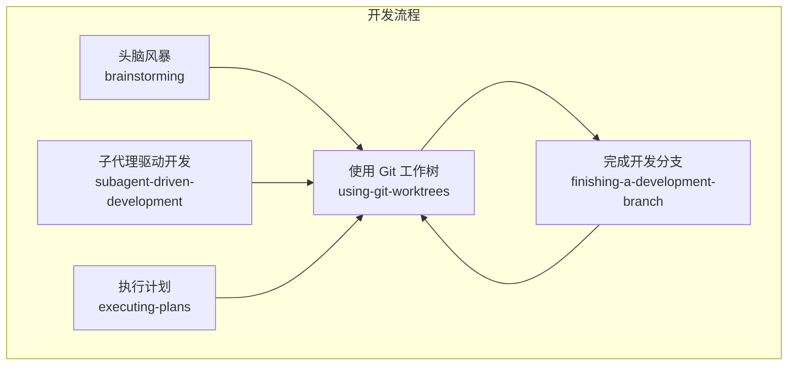
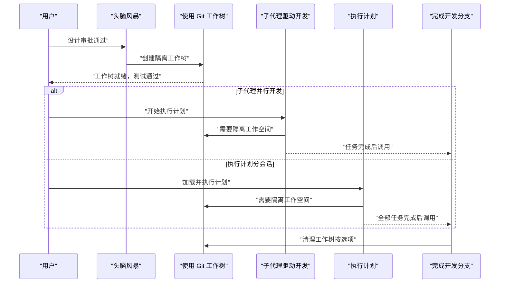
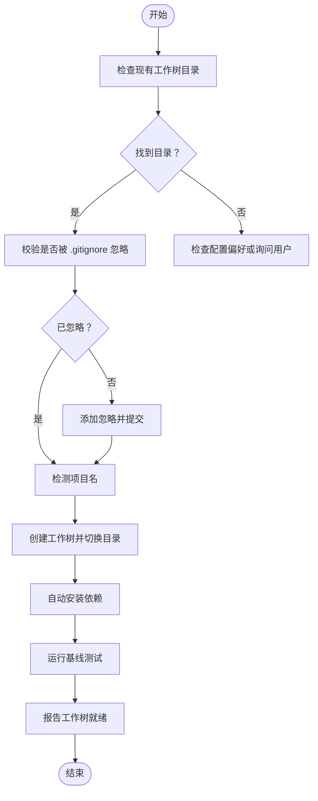
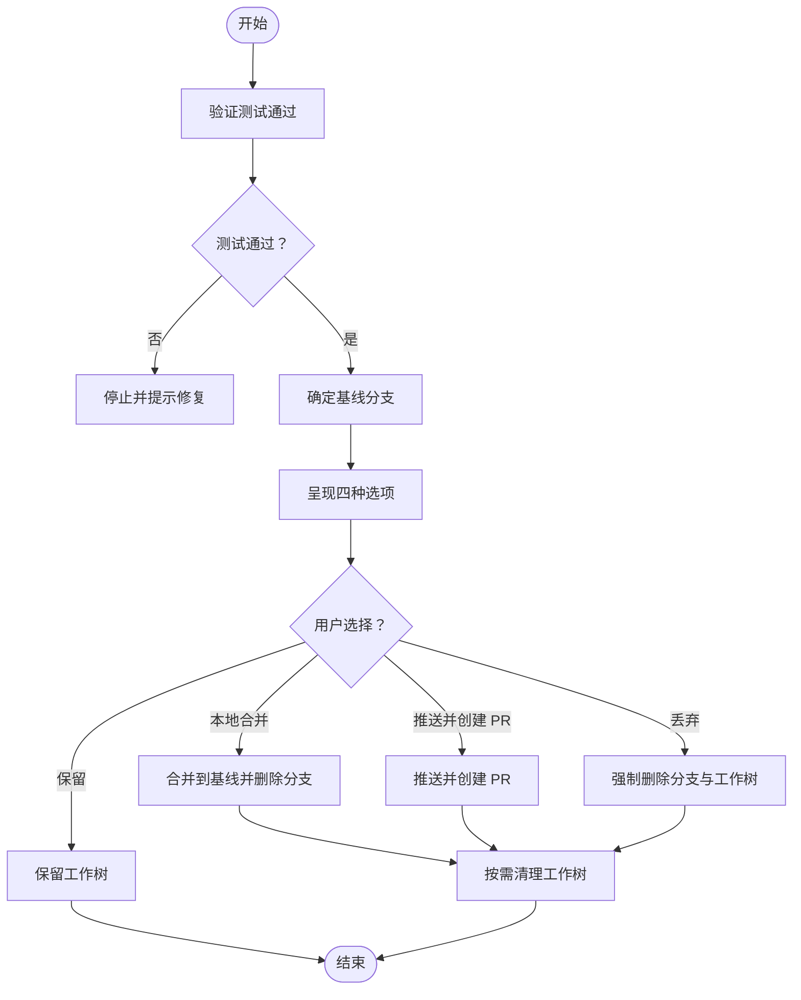
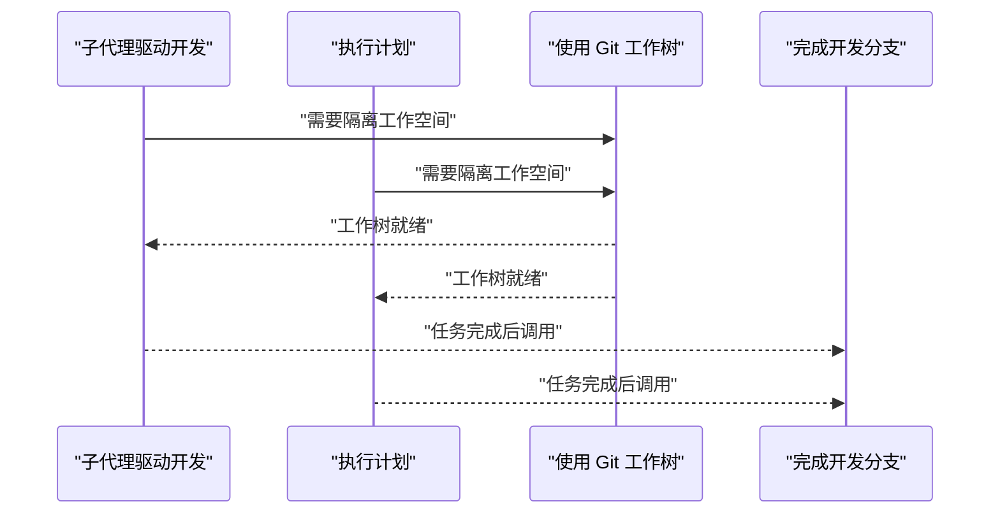
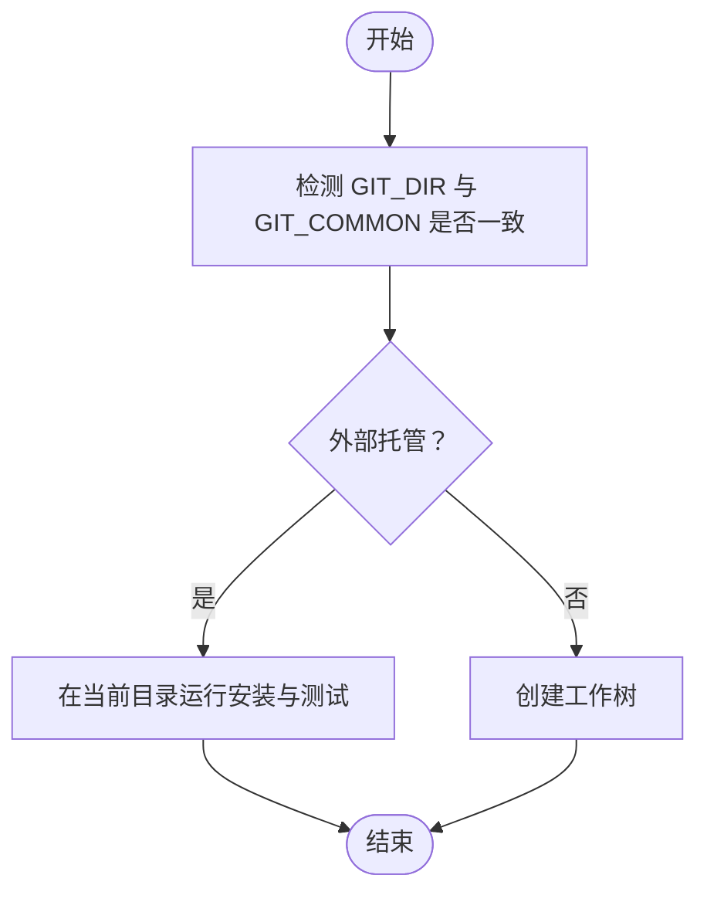
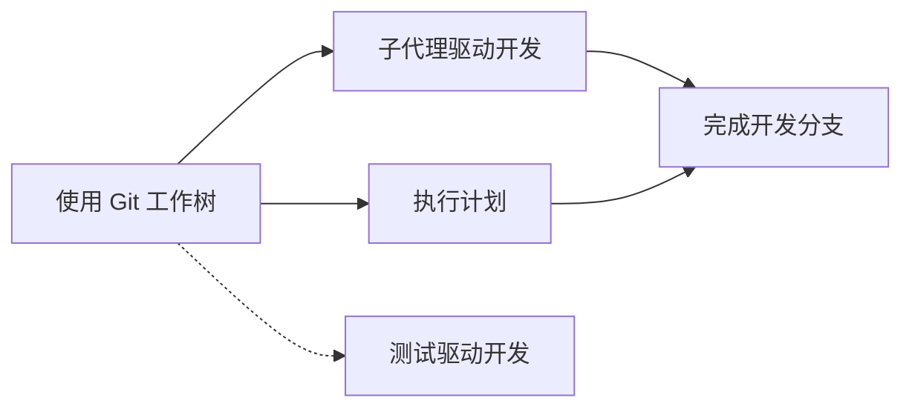

# Git 工作树管理

<cite>
**本文引用的文件**
- [using-git-worktrees 技能](file://skills/using-git-worktrees/SKILL.md)
- [finishing-a-development-branch 技能](file://skills/finishing-a-development-branch/SKILL.md)
- [subagent-driven-development 技能](file://skills/subagent-driven-development/SKILL.md)
- [executing-plans 技能](file://skills/executing-plans/SKILL.md)
- [test-driven-development 技能](file://skills/test-driven-development/SKILL.md)
- [Superpowers 项目总览](file://README.md)
- [测试文档](file://docs/testing.md)
- [Codex 应用兼容性设计规范](file://docs/superpowers/specs/2026-03-23-codex-app-compatibility-design.md)
- [Codex 应用兼容性实施计划](file://docs/superpowers/plans/2026-03-23-codex-app-compatibility.md)
</cite>

## 目录
1. [简介](#简介)
2. [项目结构](#项目结构)
3. [核心组件](#核心组件)
4. [架构概览](#架构概览)
5. [详细组件分析](#详细组件分析)
6. [依赖关系分析](#依赖关系分析)
7. [性能考量](#性能考量)
8. [故障排查指南](#故障排查指南)
9. [结论](#结论)
10. [附录](#附录)

## 简介
本技术文档围绕 Superpowers 中的 Git 工作树（worktree）管理能力展开，系统阐述其在并行开发中的作用、生命周期管理、分支切换与合并策略、以及在 Superpowers 环境中的协作模式与最佳实践。文档同时覆盖与测试驱动开发（TDD）、子代理并行开发、执行计划等技能的集成方式，并提供针对受限环境（如 Codex App 沙箱）的工作树安全检测与降级策略。

## 项目结构
Superpowers 将“技能”作为可组合的开发流程单元，Git 工作树管理是其中一项关键技能，贯穿从“头脑风暴”到“完成分支”的完整开发闭环。下图展示了与工作树相关的技能及其相互关系：

图表来源
- [Superpowers 项目总览:108-125](file://README.md#L108-L125)
- [using-git-worktrees 技能:211-219](file://skills/using-git-worktrees/SKILL.md#L211-L219)
- [finishing-a-development-branch 技能:193-201](file://skills/finishing-a-development-branch/SKILL.md#L193-L201)
- [subagent-driven-development 技能:265-278](file://skills/subagent-driven-development/SKILL.md#L265-L278)
- [executing-plans 技能:65-71](file://skills/executing-plans/SKILL.md#L65-L71)

章节来源
- [Superpowers 项目总览:108-125](file://README.md#L108-L125)

## 核心组件
- 使用 Git 工作树技能：负责创建工作树、选择目录、安全校验、自动安装依赖、基线测试验证与位置报告。
- 完成开发分支技能：负责测试验证、选项决策（合并/推送/保留/丢弃）、清理工作树。
- 子代理驱动开发与执行计划：在开始任务前强制要求隔离工作空间，确保不直接在主分支上开发。
- 测试驱动开发：在实现阶段严格遵循“红-绿-重构”，保证工作树内变更的质量与可回归性。

章节来源
- [using-git-worktrees 技能:1-219](file://skills/using-git-worktrees/SKILL.md#L1-L219)
- [finishing-a-development-branch 技能:1-201](file://skills/finishing-a-development-branch/SKILL.md#L1-L201)
- [subagent-driven-development 技能:265-278](file://skills/subagent-driven-development/SKILL.md#L265-L278)
- [executing-plans 技能:65-71](file://skills/executing-plans/SKILL.md#L65-L71)
- [test-driven-development 技能:1-372](file://skills/test-driven-development/SKILL.md#L1-L372)

## 架构概览
下图展示工作树在 Superpowers 开发流程中的端到端交互：

图表来源
- [Superpowers 项目总览:108-125](file://README.md#L108-L125)
- [using-git-worktrees 技能:211-219](file://skills/using-git-worktrees/SKILL.md#L211-L219)
- [finishing-a-development-branch 技能:193-201](file://skills/finishing-a-development-branch/SKILL.md#L193-L201)
- [subagent-driven-development 技能:265-278](file://skills/subagent-driven-development/SKILL.md#L265-L278)
- [executing-plans 技能:65-71](file://skills/executing-plans/SKILL.md#L65-L71)

## 详细组件分析

### 使用 Git 工作树（技能）
该技能的核心目标是在同一仓库内创建多个隔离的工作区，以支持并行开发与任务隔离。其关键流程如下：
- 目录选择优先级：隐藏目录优先于普通目录；若未指定则询问用户或读取配置偏好。
- 安全校验：对项目本地工作树目录进行忽略检查，避免误提交工作树内容。
- 创建步骤：检测项目名、确定路径、创建新分支的工作树、进入工作树目录。
- 自动安装与基线测试：根据项目文件自动识别语言栈并运行安装与测试命令。
- 报告位置：输出工作树路径、测试状态与准备就绪信息。

图表来源
- [using-git-worktrees 技能:16-143](file://skills/using-git-worktrees/SKILL.md#L16-L143)

章节来源
- [using-git-worktrees 技能:1-219](file://skills/using-git-worktrees/SKILL.md#L1-L219)

### 完成开发分支（技能）
该技能在工作树内的实现完成后，提供标准化的收尾流程：
- 测试验证：在呈现任何选项前必须先验证测试通过。
- 基线分支判定：尝试定位主分支或默认分支。
- 四种选项：本地合并、推送并创建 PR、保留工作树、丢弃工作。
- 清理策略：仅在本地合并与丢弃时移除工作树；保留时保持工作树不变。

图表来源
- [finishing-a-development-branch 技能:16-151](file://skills/finishing-a-development-branch/SKILL.md#L16-L151)

章节来源
- [finishing-a-development-branch 技能:1-201](file://skills/finishing-a-development-branch/SKILL.md#L1-L201)

### 子代理驱动开发与执行计划（技能）
两项技能均将“使用 Git 工作树”作为前置条件，确保所有实现都在隔离工作树中进行，避免污染主分支：
- 子代理驱动开发：在同一会话内调度子代理执行任务，每项任务完成后进行两阶段评审（规范符合性与代码质量），并在结束后调用“完成开发分支”。
- 执行计划：在不同会话中执行计划，同样要求在开始前设置隔离工作树，并在全部任务完成后调用“完成开发分支”。

图表来源
- [subagent-driven-development 技能:265-278](file://skills/subagent-driven-development/SKILL.md#L265-L278)
- [executing-plans 技能:65-71](file://skills/executing-plans/SKILL.md#L65-L71)
- [using-git-worktrees 技能:211-219](file://skills/using-git-worktrees/SKILL.md#L211-L219)

章节来源
- [subagent-driven-development 技能:265-278](file://skills/subagent-driven-development/SKILL.md#L265-L278)
- [executing-plans 技能:65-71](file://skills/executing-plans/SKILL.md#L65-L71)

### 测试驱动开发（技能）
在工作树内实施时，严格遵循“红-绿-重构”循环，确保每次变更都有明确的失败测试作为起点，并在通过后进行重构与回归验证。这与工作树隔离相辅相成，使每个功能点的演进都具备可追溯与可验证的基础。

章节来源
- [test-driven-development 技能:1-372](file://skills/test-driven-development/SKILL.md#L1-L372)

### 受限环境与外部工作树检测
为适配 Codex App 等沙箱环境，新增了“是否已在外部工作树中”的检测逻辑：
- 在开始阶段检测当前工作目录是否由外部托管（例如由宿主环境创建的工作树），若是，则跳过创建工作树，直接在当前目录运行安装与基线测试。
- 若为受限环境导致创建工作树失败，采用降级策略：在当前目录执行安装与测试，报告状态并停止进一步的创建工作树。
- 在清理阶段再次检测外部托管状态，避免错误地移除由宿主管理的工作树。

图表来源
- [Codex 应用兼容性设计规范:68-82](file://docs/superpowers/specs/2026-03-23-codex-app-compatibility-design.md#L68-L82)
- [Codex 应用兼容性实施计划:226-281](file://docs/superpowers/plans/2026-03-23-codex-app-compatibility.md#L226-L281)

章节来源
- [Codex 应用兼容性设计规范:68-147](file://docs/superpowers/specs/2026-03-23-codex-app-compatibility-design.md#L68-L147)
- [Codex 应用兼容性实施计划:4-76](file://docs/superpowers/plans/2026-03-23-codex-app-compatibility.md#L4-L76)

## 依赖关系分析
- 强耦合关系
  - “使用 Git 工作树”是“子代理驱动开发”和“执行计划”的前置技能，确保所有实现都在隔离工作树中进行。
  - “完成开发分支”与“使用 Git 工作树”形成闭环，负责清理工作树与分支。
- 松耦合关系
  - “测试驱动开发”与“使用 Git 工作树”通过工作树内的测试基线共同保障质量。
- 外部依赖
  - Git 工作树命令与 .gitignore 配置。
  - 平台差异（Windows/CMD 与 Unix/bash）下的脚本包装与路径转换。

图表来源
- [using-git-worktrees 技能:211-219](file://skills/using-git-worktrees/SKILL.md#L211-L219)
- [finishing-a-development-branch 技能:193-201](file://skills/finishing-a-development-branch/SKILL.md#L193-L201)
- [subagent-driven-development 技能:265-278](file://skills/subagent-driven-development/SKILL.md#L265-L278)
- [executing-plans 技能:65-71](file://skills/executing-plans/SKILL.md#L65-L71)
- [test-driven-development 技能:1-372](file://skills/test-driven-development/SKILL.md#L1-L372)

章节来源
- [using-git-worktrees 技能:211-219](file://skills/using-git-worktrees/SKILL.md#L211-L219)
- [finishing-a-development-branch 技能:193-201](file://skills/finishing-a-development-branch/SKILL.md#L193-L201)
- [subagent-driven-development 技能:265-278](file://skills/subagent-driven-development/SKILL.md#L265-L278)
- [executing-plans 技能:65-71](file://skills/executing-plans/SKILL.md#L65-L71)
- [test-driven-development 技能:1-372](file://skills/test-driven-development/SKILL.md#L1-L372)

## 性能考量
- 工作树数量与磁盘占用：工作树共享对象数据库，但每个工作树仍占用独立文件系统空间。建议在清理阶段及时移除不再需要的工作树。
- 依赖安装与测试成本：自动安装与基线测试可能带来额外时间开销，建议在 CI 或本地开发环境中缓存依赖以提升速度。
- 脚本跨平台执行：在 Windows 上通过 polyglot 包装器调用 bash，注意路径转换与登录 shell 的设置，避免因环境差异导致的性能问题。

## 故障排查指南
- 工作树未被清理
  - 现象：工作树残留或误删宿主管理的工作树。
  - 排查：确认“完成开发分支”清理阶段的外部托管检测逻辑是否生效；仅在本地合并与丢弃时清理工作树。
  - 参考：[完成开发分支技能:136-151](file://skills/finishing-a-development-branch/SKILL.md#L136-L151)
- 目录未被忽略导致误提交
  - 现象：工作树目录被跟踪到仓库。
  - 排查：在创建项目本地工作树前执行 .gitignore 检查；若未忽略，添加忽略规则并提交。
  - 参考：[使用 Git 工作树技能:51-74](file://skills/using-git-worktrees/SKILL.md#L51-L74)
- 受限环境创建工作树失败
  - 现象：沙箱拒绝权限导致创建工作树失败。
  - 排查：采用降级策略，在当前目录运行安装与测试，报告状态并停止创建工作树。
  - 参考：[Codex 应用兼容性设计规范:78-82](file://docs/superpowers/specs/2026-03-23-codex-app-compatibility-design.md#L78-L82)
- 基线测试失败
  - 现象：工作树初始化即出现测试失败。
  - 排查：记录失败详情并征询是否继续；必要时先修复基础问题再继续开发。
  - 参考：[使用 Git 工作树技能:120-135](file://skills/using-git-worktrees/SKILL.md#L120-L135)

章节来源
- [finishing-a-development-branch 技能:136-151](file://skills/finishing-a-development-branch/SKILL.md#L136-L151)
- [using-git-worktrees 技能:51-74](file://skills/using-git-worktrees/SKILL.md#L51-L74)
- [Codex 应用兼容性设计规范:78-82](file://docs/superpowers/specs/2026-03-23-codex-app-compatibility-design.md#L78-L82)
- [using-git-worktrees 技能:120-135](file://skills/using-git-worktrees/SKILL.md#L120-L135)

## 结论
Superpowers 通过“使用 Git 工作树”技能实现了可靠的并行开发隔离，配合“完成开发分支”技能形成从创建到清理的完整闭环。与“子代理驱动开发”“执行计划”“测试驱动开发”等技能的集成，确保了高质量、可追溯的开发流程。在受限环境下，通过外部托管检测与降级策略，进一步提升了工作树管理的鲁棒性与可移植性。

## 附录
- 实际使用场景与最佳实践
  - 创建工作树：在设计批准后立即创建隔离工作树，自动安装依赖并验证基线测试。
  - 分支切换策略：在工作树内进行功能开发，避免直接在主分支上修改；完成后再通过“完成开发分支”进行合并或丢弃。
  - 合并冲突处理：在“完成开发分支”阶段进行测试验证，确保合并后的结果通过测试；如遇冲突，优先在工作树内解决并重新测试。
  - 协作模式：子代理驱动开发与执行计划均要求隔离工作树，减少上下文污染与冲突。
  - 清理与维护：定期清理不再使用的分支与工作树，保持仓库整洁；在受限环境中遵循外部托管检测与降级策略。

章节来源
- [using-git-worktrees 技能:1-219](file://skills/using-git-worktrees/SKILL.md#L1-L219)
- [finishing-a-development-branch 技能:1-201](file://skills/finishing-a-development-branch/SKILL.md#L1-L201)
- [subagent-driven-development 技能:265-278](file://skills/subagent-driven-development/SKILL.md#L265-L278)
- [executing-plans 技能:65-71](file://skills/executing-plans/SKILL.md#L65-L71)
- [test-driven-development 技能:1-372](file://skills/test-driven-development/SKILL.md#L1-L372)
- [Codex 应用兼容性设计规范:68-147](file://docs/superpowers/specs/2026-03-23-codex-app-compatibility-design.md#L68-L147)