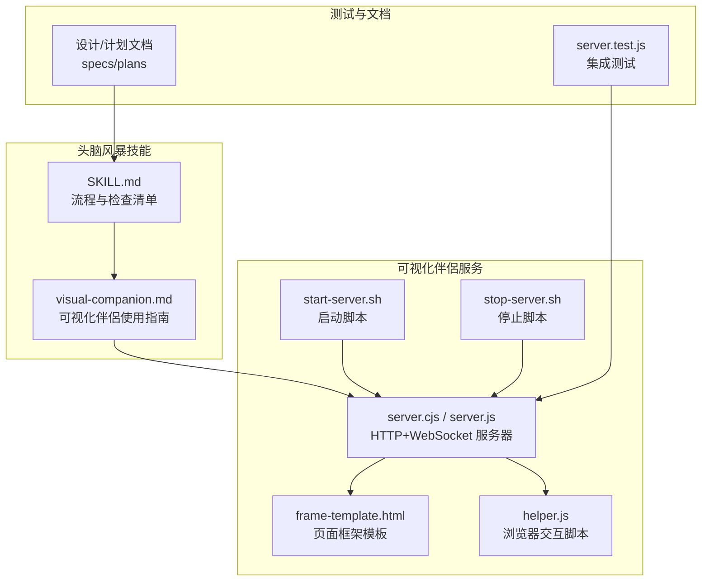
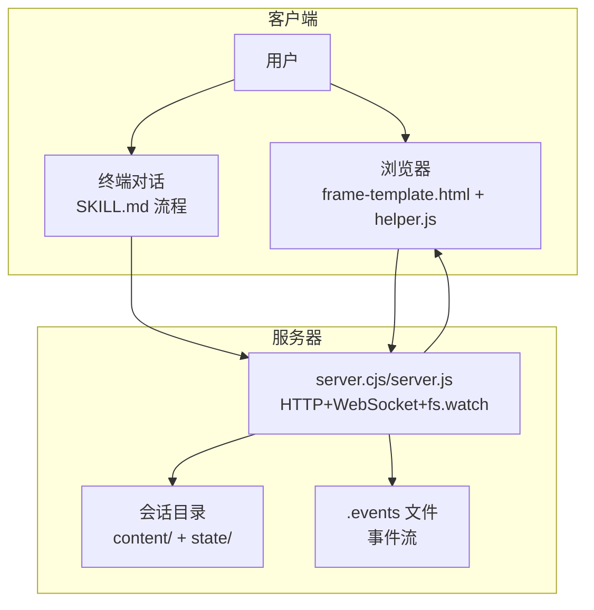
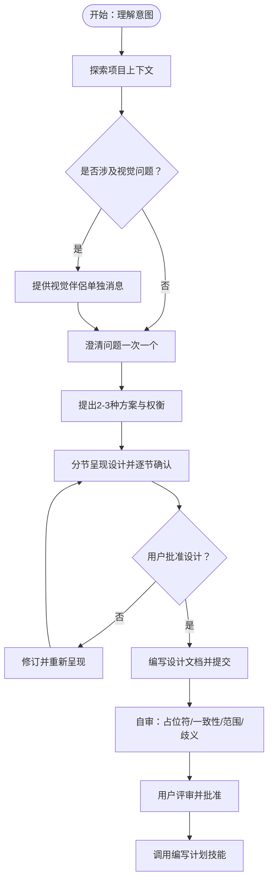
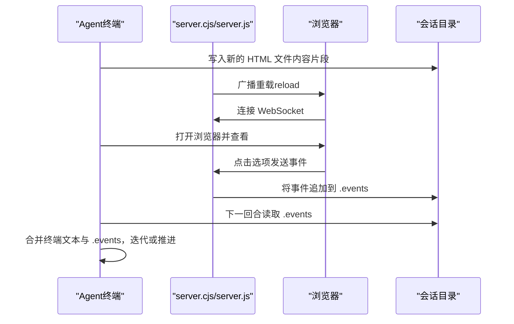
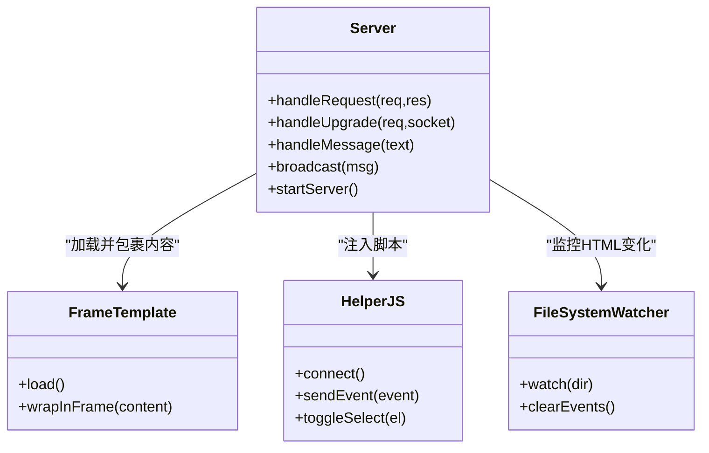
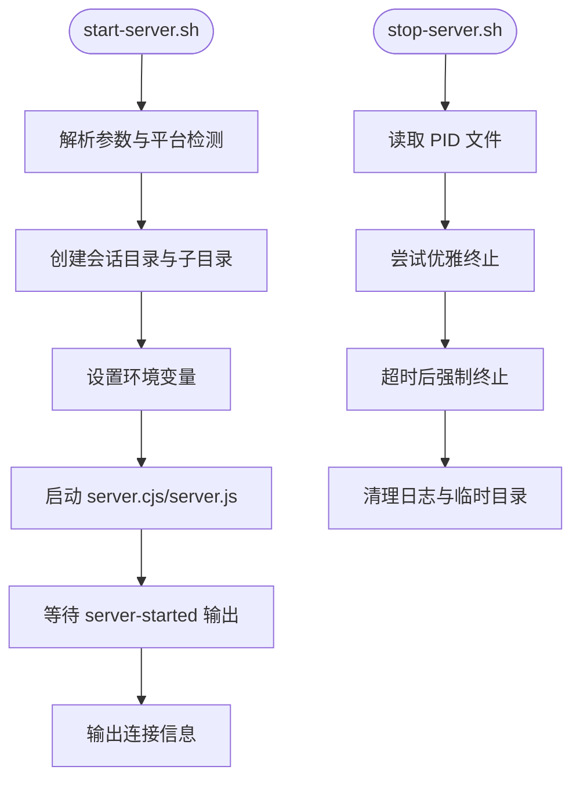
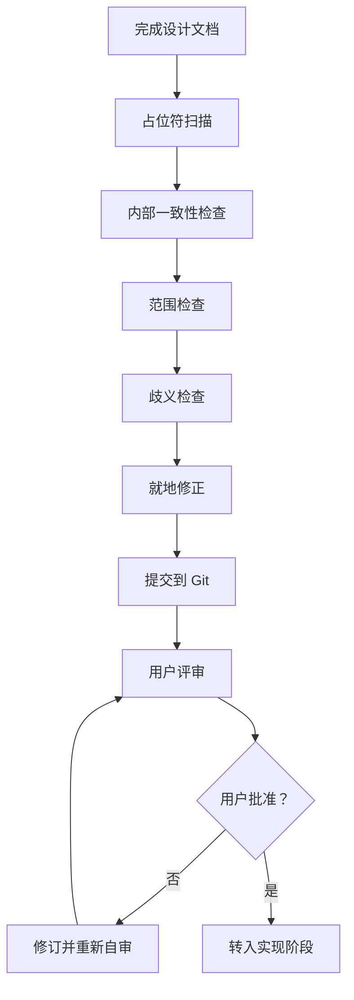
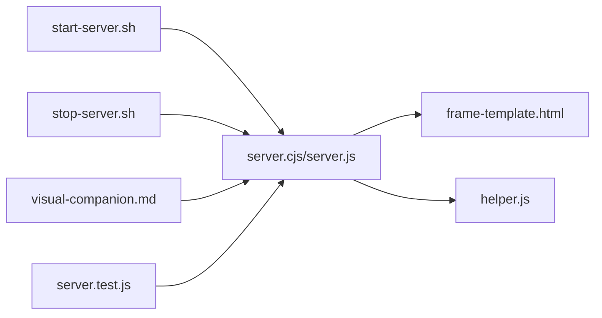

# 头脑风暴设计

<cite>
**本文档引用的文件**
- [skills/brainstorming/SKILL.md](file://skills/brainstorming/SKILL.md)
- [skills/brainstorming/visual-companion.md](file://skills/brainstorming/visual-companion.md)
- [skills/brainstorming/scripts/server.cjs](file://skills/brainstorming/scripts/server.cjs)
- [skills/brainstorming/scripts/server.js](file://skills/brainstorming/scripts/server.js)
- [skills/brainstorming/scripts/start-server.sh](file://skills/brainstorming/scripts/start-server.sh)
- [skills/brainstorming/scripts/stop-server.sh](file://skills/brainstorming/scripts/stop-server.sh)
- [skills/brainstorming/scripts/frame-template.html](file://skills/brainstorming/scripts/frame-template.html)
- [skills/brainstorming/scripts/helper.js](file://skills/brainstorming/scripts/helper.js)
- [docs/superpowers/specs/2026-02-19-visual-brainstorming-refactor-design.md](file://docs/superpowers/specs/2026-02-19-visual-brainstorming-refactor-design.md)
- [docs/superpowers/plans/2026-02-19-visual-brainstorming-refactor.md](file://docs/superpowers/plans/2026-02-19-visual-brainstorming-refactor.md)
- [docs/superpowers/specs/2026-03-11-zero-dep-brainstorm-server-design.md](file://docs/superpowers/specs/2026-03-11-zero-dep-brainstorm-server-design.md)
- [docs/superpowers/plans/2026-03-11-zero-dep-brainstorm-server.md](file://docs/superpowers/plans/2026-03-11-zero-dep-brainstorm-server.md)
- [tests/brainstorm-server/server.test.js](file://tests/brainstorm-server/server.test.js)
- [README.md](file://README.md)
</cite>

## 目录
1. [简介](#简介)
2. [项目结构](#项目结构)
3. [核心组件](#核心组件)
4. [架构总览](#架构总览)
5. [详细组件分析](#详细组件分析)
6. [依赖关系分析](#依赖关系分析)
7. [性能考虑](#性能考虑)
8. [故障排除指南](#故障排除指南)
9. [结论](#结论)
10. [附录](#附录)

## 简介
本文件面向“头脑风暴设计”流程，系统化阐述如何将创意想法转化为完整的设计与规范，覆盖项目上下文探索、视觉伴侶（浏览器）使用、问题澄清、多方案设计、设计文档撰写与评审、以及服务器启动/停止脚本配置与自审流程。文档严格遵循“硬性约束规则”：任何实现类技能（如前端设计、MCP 构建、执行计划等）在设计未获用户批准前不得触发；仅在设计通过后方可调用“编写计划”技能进入实现阶段。

## 项目结构
该仓库采用按技能与功能分层的组织方式，头脑风暴相关能力集中在 skills/brainstorming 目录，并配套测试与设计/计划文档。关键目录与文件如下：
- 技能定义与流程：skills/brainstorming/SKILL.md、skills/brainstorming/visual-companion.md
- 可视化伴侶服务：skills/brainstorming/scripts/server.cjs 或 server.js（零依赖版本）、frame-template.html、helper.js
- 启停脚本：skills/brainstorming/scripts/start-server.sh、skills/brainstorming/scripts/stop-server.sh
- 测试与验证：tests/brainstorm-server/server.test.js
- 设计与重构文档：docs/superpowers/specs/...、docs/superpowers/plans/...

**图表来源**
- [skills/brainstorming/SKILL.md:1-165](file://skills/brainstorming/SKILL.md#L1-L165)
- [skills/brainstorming/visual-companion.md:1-288](file://skills/brainstorming/visual-companion.md#L1-L288)
- [skills/brainstorming/scripts/server.cjs:1-355](file://skills/brainstorming/scripts/server.cjs#L1-L355)
- [skills/brainstorming/scripts/server.js:1-480](file://skills/brainstorming/scripts/server.js#L1-L480)
- [skills/brainstorming/scripts/start-server.sh:1-149](file://skills/brainstorming/scripts/start-server.sh#L1-L149)
- [skills/brainstorming/scripts/stop-server.sh:1-57](file://skills/brainstorming/scripts/stop-server.sh#L1-L57)
- [tests/brainstorm-server/server.test.js:1-428](file://tests/brainstorm-server/server.test.js#L1-L428)

**章节来源**
- [README.md:108-125](file://README.md#L108-L125)
- [skills/brainstorming/SKILL.md:20-66](file://skills/brainstorming/SKILL.md#L20-L66)

## 核心组件
- 头脑风暴技能（SKILL.md）
  - 明确“硬性约束规则”：设计未获批准不得进入实现阶段
  - 提供检查清单与流程图，涵盖上下文探索、视觉伴侶、澄清问题、多方案设计、设计文档、自审、用户评审与转入实现
- 视觉伴侶（visual-companion.md）
  - 指导何时使用浏览器展示、如何写内容片段、事件格式、循环流程与清理
- 可视化伴侶服务（server.cjs/server.js）
  - 提供 HTTP 服务、WebSocket 升级、文件监控、事件记录与浏览器自动刷新
- 启停脚本（start-server.sh/stop-server.sh）
  - 跨平台启动/停止逻辑，支持持久化会话目录与后台/前台模式
- 测试（server.test.js）
  - 验证服务器启动、HTTP 响应、WebSocket 事件、文件监控与事件落盘

**章节来源**
- [skills/brainstorming/SKILL.md:12-14](file://skills/brainstorming/SKILL.md#L12-L14)
- [skills/brainstorming/SKILL.md:20-66](file://skills/brainstorming/SKILL.md#L20-L66)
- [skills/brainstorming/visual-companion.md:33-127](file://skills/brainstorming/visual-companion.md#L33-L127)
- [skills/brainstorming/scripts/server.cjs:262-355](file://skills/brainstorming/scripts/server.cjs#L262-L355)
- [skills/brainstorming/scripts/server.js:342-385](file://skills/brainstorming/scripts/server.js#L342-L385)
- [skills/brainstorming/scripts/start-server.sh:1-149](file://skills/brainstorming/scripts/start-server.sh#L1-L149)
- [skills/brainstorming/scripts/stop-server.sh:1-57](file://skills/brainstorming/scripts/stop-server.sh#L1-L57)
- [tests/brainstorm-server/server.test.js:72-428](file://tests/brainstorm-server/server.test.js#L72-L428)

## 架构总览
可视化伴侶采用“浏览器显示 + 终端命令”的非阻塞模型：浏览器作为交互式展示，终端保持对话通道；服务器监听会话目录中的 HTML 文件变化，自动刷新浏览器；用户在浏览器点击选择后，在终端输入反馈；服务器将用户交互事件写入会话目录下的 .events 文件，供下一轮读取与合并。

**图表来源**
- [skills/brainstorming/scripts/server.cjs:129-161](file://skills/brainstorming/scripts/server.cjs#L129-L161)
- [skills/brainstorming/scripts/server.cjs:224-238](file://skills/brainstorming/scripts/server.cjs#L224-L238)
- [skills/brainstorming/scripts/server.cjs:276-298](file://skills/brainstorming/scripts/server.cjs#L276-L298)
- [skills/brainstorming/scripts/frame-template.html:1-215](file://skills/brainstorming/scripts/frame-template.html#L1-L215)
- [skills/brainstorming/scripts/helper.js:1-89](file://skills/brainstorming/scripts/helper.js#L1-L89)
- [docs/superpowers/specs/2026-02-19-visual-brainstorming-refactor-design.md:13-31](file://docs/superpowers/specs/2026-02-19-visual-brainstorming-refactor-design.md#L13-L31)

## 详细组件分析

### 组件A：头脑风暴流程与检查清单
- 硬性约束规则
  - 在设计未获用户批准前，禁止调用任何实现类技能（如前端设计、MCP 构建、执行计划等），仅允许“编写计划”技能
- 检查清单
  - 探索项目上下文 → 提供视觉伴侶（如涉及视觉问题）→ 澄清问题 → 提出2-3种方案 → 分节呈现设计并逐节获取批准 → 编写设计文档 → 自审 → 用户评审 → 转入实现
- 关键原则
  - 一次只问一个问题、优先多项选择题、YAGNI、探索替代方案、增量验证、灵活回退澄清

**图表来源**
- [skills/brainstorming/SKILL.md:20-66](file://skills/brainstorming/SKILL.md#L20-L66)
- [skills/brainstorming/SKILL.md:138-146](file://skills/brainstorming/SKILL.md#L138-L146)

**章节来源**
- [skills/brainstorming/SKILL.md:12-14](file://skills/brainstorming/SKILL.md#L12-L14)
- [skills/brainstorming/SKILL.md:20-66](file://skills/brainstorming/SKILL.md#L20-L66)
- [skills/brainstorming/SKILL.md:138-146](file://skills/brainstorming/SKILL.md#L138-L146)

### 组件B：可视化伴侶（浏览器显示 + 终端命令）
- 使用场景
  - UI/UX 选项可视化比较、线框图/布局对比、收集结构化反馈（评分/表单）、原型点击交互
- 工作原理
  - 服务器监听会话目录中的 HTML 文件，自动刷新浏览器；用户点击后，事件写入 .events 文件；下一轮从终端输入与 .events 合并反馈
- 内容片段 vs 完整文档
  - 默认写入内容片段（由模板包裹），若以 <!DOCTYPE 或 <html 开头则原样返回
- 事件格式
  - .events 文件每行一条 JSON 对象，包含类型、选择项、文本、时间戳等；新屏幕推送时清空 .events

**图表来源**
- [skills/brainstorming/visual-companion.md:94-127](file://skills/brainstorming/visual-companion.md#L94-L127)
- [skills/brainstorming/visual-companion.md:444-457](file://skills/brainstorming/visual-companion.md#L444-L457)
- [skills/brainstorming/scripts/server.cjs:276-298](file://skills/brainstorming/scripts/server.cjs#L276-L298)
- [skills/brainstorming/scripts/server.js:353-380](file://skills/brainstorming/scripts/server.js#L353-L380)

**章节来源**
- [skills/brainstorming/visual-companion.md:5-26](file://skills/brainstorming/visual-companion.md#L5-L26)
- [skills/brainstorming/visual-companion.md:33-127](file://skills/brainstorming/visual-companion.md#L33-L127)
- [skills/brainstorming/visual-companion.md:444-457](file://skills/brainstorming/visual-companion.md#L444-L457)

### 组件C：可视化伴侶服务（HTTP + WebSocket + 文件监控）
- HTTP 服务
  - GET / 返回最新 HTML（片段自动包裹模板，完整文档原样返回），注入 helper.js；GET /files/* 提供静态资源
- WebSocket
  - 升级处理、帧编解码（RFC 6455 文本帧）、事件广播与心跳
- 文件监控
  - fs.watch 监听会话目录中 .html 的新增/变更，去抖动后广播重载；新增屏幕时清空 .events
- 零依赖重构
  - server.js 使用 Node 内置模块替代第三方依赖，保留相同外部契约与测试

**图表来源**
- [skills/brainstorming/scripts/server.cjs:129-161](file://skills/brainstorming/scripts/server.cjs#L129-L161)
- [skills/brainstorming/scripts/server.cjs:167-222](file://skills/brainstorming/scripts/server.cjs#L167-L222)
- [skills/brainstorming/scripts/server.cjs:276-355](file://skills/brainstorming/scripts/server.cjs#L276-L355)
- [skills/brainstorming/scripts/frame-template.html:1-215](file://skills/brainstorming/scripts/frame-template.html#L1-L215)
- [skills/brainstorming/scripts/helper.js:1-89](file://skills/brainstorming/scripts/helper.js#L1-L89)

**章节来源**
- [skills/brainstorming/scripts/server.cjs:129-161](file://skills/brainstorming/scripts/server.cjs#L129-L161)
- [skills/brainstorming/scripts/server.cjs:167-222](file://skills/brainstorming/scripts/server.cjs#L167-L222)
- [skills/brainstorming/scripts/server.cjs:276-355](file://skills/brainstorming/scripts/server.cjs#L276-L355)
- [skills/brainstorming/scripts/server.js:342-385](file://skills/brainstorming/scripts/server.js#L342-L385)
- [docs/superpowers/specs/2026-03-11-zero-dep-brainstorm-server-design.md:9-119](file://docs/superpowers/specs/2026-03-11-zero-dep-brainstorm-server-design.md#L9-L119)

### 组件D：启停脚本与跨平台支持
- start-server.sh
  - 解析参数（项目目录、绑定主机、URL 主机、前台/后台模式），生成唯一会话目录，设置 BRAINSTORM_* 环境变量，自动检测平台并选择前台/后台模式，等待 server-started 输出
- stop-server.sh
  - 读取 PID 文件，优雅终止进程，清理日志与临时目录，保留项目目录以便复盘

**图表来源**
- [skills/brainstorming/scripts/start-server.sh:1-149](file://skills/brainstorming/scripts/start-server.sh#L1-L149)
- [skills/brainstorming/scripts/stop-server.sh:1-57](file://skills/brainstorming/scripts/stop-server.sh#L1-L57)

**章节来源**
- [skills/brainstorming/scripts/start-server.sh:1-149](file://skills/brainstorming/scripts/start-server.sh#L1-L149)
- [skills/brainstorming/scripts/stop-server.sh:1-57](file://skills/brainstorming/scripts/stop-server.sh#L1-L57)

### 组件E：设计文档自审与用户评审
- 自审清单
  - 占位符扫描：TBD/TODO/不完整段落/模糊需求
  - 内部一致性：各部分不矛盾，架构与功能描述一致
  - 范围检查：聚焦于单一实现计划，避免过度膨胀
  - 歧义检查：明确唯一解释，消除二义性
- 用户评审
  - 设计文档提交后，提示用户评审并等待反馈；如有修改请求，回到自审与修订流程

**图表来源**
- [skills/brainstorming/SKILL.md:116-132](file://skills/brainstorming/SKILL.md#L116-L132)

**章节来源**
- [skills/brainstorming/SKILL.md:116-132](file://skills/brainstorming/SKILL.md#L116-L132)

## 依赖关系分析
- 组件耦合
  - server.cjs/server.js 与 frame-template.html、helper.js 强耦合（模板加载与脚本注入）
  - start-server.sh/stop-server.sh 与 server.cjs/server.js 弱耦合（通过环境变量与文件约定）
  - visual-companion.md 与 server.cjs/server.js 弱耦合（基于 .events 文件约定）
- 外部依赖
  - 重构后 server.js 使用 Node 内置模块，移除 express、ws、chokidar 等第三方依赖
- 循环依赖
  - 无直接循环依赖；测试通过 ws 作为客户端进行集成验证

**图表来源**
- [skills/brainstorming/scripts/start-server.sh:1-149](file://skills/brainstorming/scripts/start-server.sh#L1-L149)
- [skills/brainstorming/scripts/stop-server.sh:1-57](file://skills/brainstorming/scripts/stop-server.sh#L1-L57)
- [skills/brainstorming/scripts/server.cjs:101-103](file://skills/brainstorming/scripts/server.cjs#L101-L103)
- [skills/brainstorming/scripts/server.js:187-189](file://skills/brainstorming/scripts/server.js#L187-L189)
- [tests/brainstorm-server/server.test.js:18-52](file://tests/brainstorm-server/server.test.js#L18-L52)

**章节来源**
- [docs/superpowers/specs/2026-03-11-zero-dep-brainstorm-server-design.md:91-119](file://docs/superpowers/specs/2026-03-11-zero-dep-brainstorm-server-design.md#L91-L119)
- [tests/brainstorm-server/server.test.js:18-52](file://tests/brainstorm-server/server.test.js#L18-L52)

## 性能考虑
- 文件监控去抖动：对同一文件的多次事件进行约 100ms 去抖，减少重复广播
- 事件落盘：仅在用户产生选择事件时写入 .events，避免频繁 IO
- 静态资源：/files/* 路由直接读取会话目录，避免不必要的中间层
- 零依赖：server.js 使用内置模块，减少冷启动与依赖解析开销

[本节为通用指导，无需特定文件来源]

## 故障排除指南
- 服务器未启动或无法连接
  - 检查 start-server.sh 是否输出 server-started JSON；确认端口与 URL 主机配置
  - 若 stdout 被隐藏，读取会话目录下的 .server-info
- 浏览器无法刷新
  - 确认已写入新的 HTML 文件且被 fs.watch 捕获；检查 WebSocket 是否连接成功
- 事件未写入 .events
  - 确认事件包含 choice 字段；确认服务器已监听到文件变更并广播重载
- 启停脚本异常
  - Windows/Git Bash 环境可能强制前台模式；Codex CI 自动前台；必要时显式传入 --foreground

**章节来源**
- [skills/brainstorming/scripts/start-server.sh:124-148](file://skills/brainstorming/scripts/start-server.sh#L124-L148)
- [skills/brainstorming/scripts/server.cjs:301-324](file://skills/brainstorming/scripts/server.cjs#L301-L324)
- [skills/brainstorming/scripts/stop-server.sh:1-57](file://skills/brainstorming/scripts/stop-server.sh#L1-L57)

## 结论
“头脑风暴设计”流程通过严格的检查清单与可视化伴侶，确保设计在进入实现前得到充分验证与用户批准。服务器采用零依赖的 Node 内置模块实现，具备良好的跨平台兼容性与可维护性。遵循硬性约束规则与自审/评审流程，可显著降低实现偏差与返工风险，提升整体交付质量。

[本节为总结，无需特定文件来源]

## 附录

### 实际使用示例与最佳实践
- 示例：UI 布局选择
  - 先在终端澄清目标与约束，再提供布局选项的可视化对比，结合 .events 与终端文本进行综合判断
- 最佳实践
  - 一次只问一个问题，优先多项选择题
  - 选项数量控制在 2-4 个以内，避免认知过载
  - 选项描述清晰，突出关键差异
  - 保持终端作为主要对话通道，浏览器仅用于可视化辅助

**章节来源**
- [skills/brainstorming/SKILL.md:140-146](file://skills/brainstorming/SKILL.md#L140-L146)
- [skills/brainstorming/visual-companion.md:260-268](file://skills/brainstorming/visual-companion.md#L260-L268)

### 关键原则速览
- 一次性问题、优先多项选择
- YAGNI：去除不必要的特性
- 探索替代方案并给出推荐
- 增量验证：设计分节呈现并逐节确认
- 灵活回退：遇到不清晰处及时澄清

**章节来源**
- [skills/brainstorming/SKILL.md:138-146](file://skills/brainstorming/SKILL.md#L138-L146)