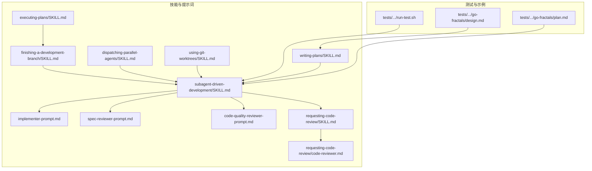
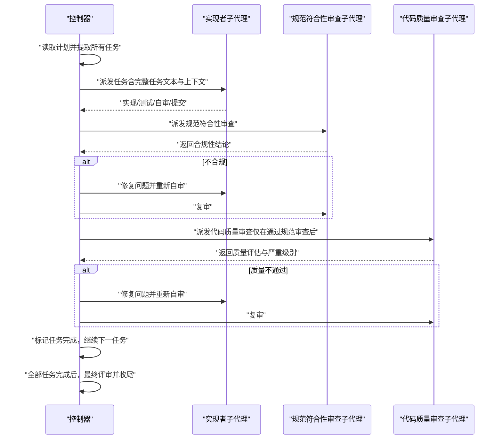
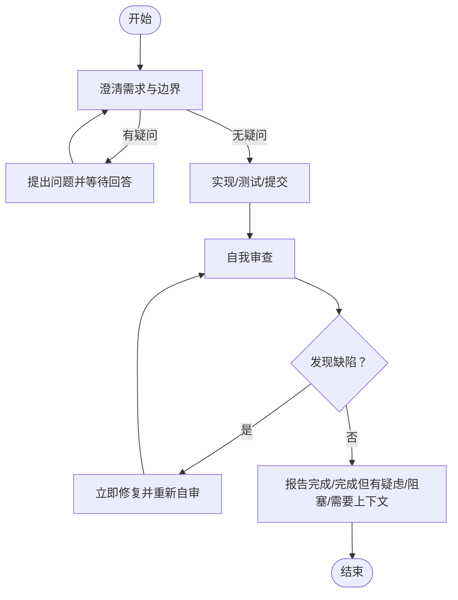
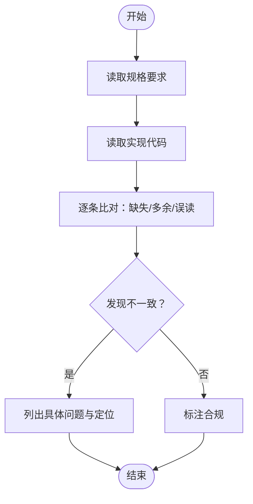
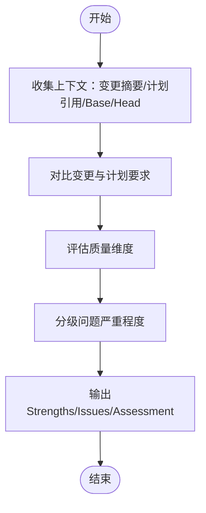
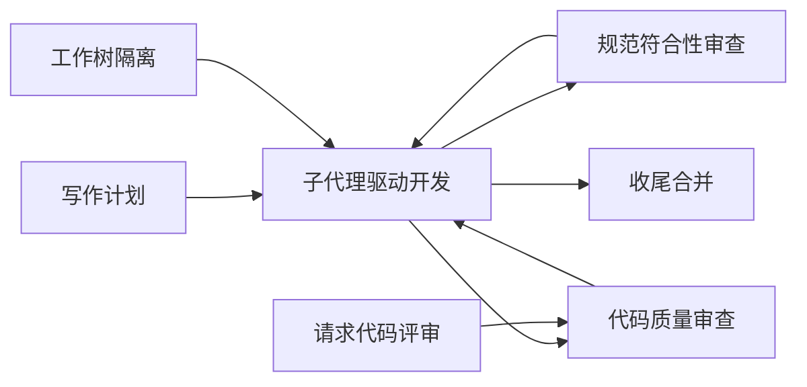

# 子代理驱动开发

<cite>
**本文引用的文件**
- [skills/subagent-driven-development/SKILL.md](file://skills/subagent-driven-development/SKILL.md)
- [skills/subagent-driven-development/implementer-prompt.md](file://skills/subagent-driven-development/implementer-prompt.md)
- [skills/subagent-driven-development/spec-reviewer-prompt.md](file://skills/subagent-driven-development/spec-reviewer-prompt.md)
- [skills/subagent-driven-development/code-quality-reviewer-prompt.md](file://skills/subagent-driven-development/code-quality-reviewer-prompt.md)
- [skills/requesting-code-review/SKILL.md](file://skills/requesting-code-review/SKILL.md)
- [skills/requesting-code-review/code-reviewer.md](file://skills/requesting-code-review/code-reviewer.md)
- [skills/using-git-worktrees/SKILL.md](file://skills/using-git-worktrees/SKILL.md)
- [skills/finishing-a-development-branch/SKILL.md](file://skills/finishing-a-development-branch/SKILL.md)
- [skills/executing-plans/SKILL.md](file://skills/executing-plans/SKILL.md)
- [skills/writing-plans/SKILL.md](file://skills/writing-plans/SKILL.md)
- [skills/dispatching-parallel-agents/SKILL.md](file://skills/dispatching-parallel-agents/SKILL.md)
- [README.md](file://README.md)
- [tests/subagent-driven-dev/run-test.sh](file://tests/subagent-driven-dev/run-test.sh)
- [tests/subagent-driven-dev/go-fractals/design.md](file://tests/subagent-driven-dev/go-fractals/design.md)
- [tests/subagent-driven-dev/go-fractals/plan.md](file://tests/subagent-driven-dev/go-fractals/plan.md)
</cite>

## 目录
1. [简介](#简介)
2. [项目结构](#项目结构)
3. [核心组件](#核心组件)
4. [架构总览](#架构总览)
5. [详细组件分析](#详细组件分析)
6. [依赖关系分析](#依赖关系分析)
7. [性能考量](#性能考量)
8. [故障排查指南](#故障排查指南)
9. [结论](#结论)
10. [附录](#附录)

## 简介
本技术文档围绕“子代理驱动开发”（Subagent-Driven Development）展开，系统阐述其并行开发与双重审查机制：以“规范符合性审查”（Spec Compliance Review）与“代码质量审查”（Code Quality Review）为主线，辅以“实现者子代理”的任务执行与自审流程。文档覆盖提示词模板设计、子代理间协调机制、任务分配策略、进度跟踪方法、实际开发流程示例、提示词使用技巧与质量保证策略，并给出可配置项与扩展路径。

## 项目结构
该仓库采用“技能（Skill）+ 提示词模板 + 测试用例”的组织方式，子代理驱动开发作为核心技能，配合计划写作、并行调度、代码评审、工作树隔离与收尾合并等技能协同完成端到端交付。

**图示来源**
- [skills/subagent-driven-development/SKILL.md:1-278](file://skills/subagent-driven-development/SKILL.md#L1-L278)
- [skills/requesting-code-review/SKILL.md:1-106](file://skills/requesting-code-review/SKILL.md#L1-L106)
- [skills/requesting-code-review/code-reviewer.md:1-147](file://skills/requesting-code-review/code-reviewer.md#L1-L147)
- [skills/writing-plans/SKILL.md:1-153](file://skills/writing-plans/SKILL.md#L1-L153)
- [skills/executing-plans/SKILL.md:1-71](file://skills/executing-plans/SKILL.md#L1-L71)
- [skills/dispatching-parallel-agents/SKILL.md:1-183](file://skills/dispatching-parallel-agents/SKILL.md#L1-L183)
- [skills/using-git-worktrees/SKILL.md:1-219](file://skills/using-git-worktrees/SKILL.md#L1-L219)
- [skills/finishing-a-development-branch/SKILL.md:1-201](file://skills/finishing-a-development-branch/SKILL.md#L1-L201)
- [tests/subagent-driven-dev/run-test.sh:1-107](file://tests/subagent-driven-dev/run-test.sh#L1-L107)
- [tests/subagent-driven-dev/go-fractals/design.md:1-82](file://tests/subagent-driven-dev/go-fractals/design.md#L1-L82)
- [tests/subagent-driven-dev/go-fractals/plan.md:1-173](file://tests/subagent-driven-dev/go-fractals/plan.md#L1-L173)

**章节来源**
- [README.md:108-125](file://README.md#L108-L125)

## 核心组件
- 子代理驱动开发技能：定义“每任务一个新子代理 + 双重审查（规范符合性 → 代码质量）”的执行范式与质量门禁。
- 实现者子代理提示词：明确任务边界、要求、测试与自审流程，支持“先问后干、边做边问”。
- 规范符合性审查子代理提示词：独立验证实现是否“不多不少”，杜绝“报告可信”陷阱。
- 代码质量审查子代理提示词：基于变更范围与计划要求进行质量评估，产出严重等级化反馈。
- 请求代码评审技能与模板：标准化评审上下文占位符与输出格式，支撑跨阶段一致性。
- 工作树隔离技能：在独立工作树中执行，避免污染主分支与上下文污染。
- 收尾合并技能：统一测试验证、选项呈现与清理流程。
- 计划写作技能：产出可执行、可拆分、可验证的任务清单。
- 并行调度技能：在无共享状态前提下，按域并行分发子代理。

**章节来源**
- [skills/subagent-driven-development/SKILL.md:8-125](file://skills/subagent-driven-development/SKILL.md#L8-L125)
- [skills/subagent-driven-development/implementer-prompt.md:1-114](file://skills/subagent-driven-development/implementer-prompt.md#L1-L114)
- [skills/subagent-driven-development/spec-reviewer-prompt.md:1-62](file://skills/subagent-driven-development/spec-reviewer-prompt.md#L1-L62)
- [skills/subagent-driven-development/code-quality-reviewer-prompt.md:1-27](file://skills/subagent-driven-development/code-quality-reviewer-prompt.md#L1-L27)
- [skills/requesting-code-review/SKILL.md:1-106](file://skills/requesting-code-review/SKILL.md#L1-L106)
- [skills/requesting-code-review/code-reviewer.md:1-147](file://skills/requesting-code-review/code-reviewer.md#L1-L147)
- [skills/using-git-worktrees/SKILL.md:1-219](file://skills/using-git-worktrees/SKILL.md#L1-L219)
- [skills/finishing-a-development-branch/SKILL.md:1-201](file://skills/finishing-a-development-branch/SKILL.md#L1-L201)
- [skills/writing-plans/SKILL.md:1-153](file://skills/writing-plans/SKILL.md#L1-L153)
- [skills/executing-plans/SKILL.md:1-71](file://skills/executing-plans/SKILL.md#L1-L71)
- [skills/dispatching-parallel-agents/SKILL.md:1-183](file://skills/dispatching-parallel-agents/SKILL.md#L1-L183)

## 架构总览
子代理驱动开发以“任务级流水线”为核心：每个任务由实现者子代理完成，随后依次经规范符合性审查与代码质量审查，最终标记完成并推进下一个任务；全部完成后进行最终评审与收尾。

**图示来源**
- [skills/subagent-driven-development/SKILL.md:40-85](file://skills/subagent-driven-development/SKILL.md#L40-L85)
- [skills/subagent-driven-development/code-quality-reviewer-prompt.md:7-8](file://skills/subagent-driven-development/code-quality-reviewer-prompt.md#L7-L8)

## 详细组件分析

### 组件一：实现者子代理（Implementer）
职责与流程要点：
- 先问后干：在开始前提出对需求、方法、依赖或假设的疑问，确保理解一致。
- 自审前置：在报告前进行自我审查，涵盖完整性、质量、纪律与测试。
- 任务边界：遵循计划文件结构，保持文件单一职责、接口清晰；若文件过大或已有复杂度，应报告“完成但有疑虑”。
- 无法继续时的升级：当涉及架构决策、超出理解范围或需要重构时，明确“阻塞/需要上下文”并说明原因与求助类型。

**图示来源**
- [skills/subagent-driven-development/implementer-prompt.md:19-113](file://skills/subagent-driven-development/implementer-prompt.md#L19-L113)

**章节来源**
- [skills/subagent-driven-development/implementer-prompt.md:1-114](file://skills/subagent-driven-development/implementer-prompt.md#L1-L114)
- [skills/subagent-driven-development/SKILL.md:102-119](file://skills/subagent-driven-development/SKILL.md#L102-L119)

### 组件二：规范符合性审查子代理（Spec Reviewer）
职责与流程要点：
- 不信任报告：必须独立阅读实现代码，逐条对照规格，检查缺失与多余。
- 关注三类问题：遗漏需求、过度工程、误解需求。
- 输出标准：明确“合规/发现问题（附具体文件与行号）”。

**图示来源**
- [skills/subagent-driven-development/spec-reviewer-prompt.md:10-61](file://skills/subagent-driven-development/spec-reviewer-prompt.md#L10-L61)

**章节来源**
- [skills/subagent-driven-development/spec-reviewer-prompt.md:1-62](file://skills/subagent-driven-development/spec-reviewer-prompt.md#L1-L62)

### 组件三：代码质量审查子代理（Code Quality Reviewer）
职责与流程要点：
- 仅在规范审查通过后派发。
- 基于变更范围与计划要求评估质量，关注文件职责、单元可理解与可测试性、是否遵循计划文件结构、对既有文件规模的影响。
- 输出标准化：Strengths、Issues（Critical/Important/Minor）、Assessment。

**图示来源**
- [skills/subagent-driven-development/code-quality-reviewer-prompt.md:9-27](file://skills/subagent-driven-development/code-quality-reviewer-prompt.md#L9-L27)
- [skills/requesting-code-review/code-reviewer.md:30-93](file://skills/requesting-code-review/code-reviewer.md#L30-L93)

**章节来源**
- [skills/subagent-driven-development/code-quality-reviewer-prompt.md:1-27](file://skills/subagent-driven-development/code-quality-reviewer-prompt.md#L1-L27)
- [skills/requesting-code-review/code-reviewer.md:1-147](file://skills/requesting-code-review/code-reviewer.md#L1-L147)

### 组件四：请求代码评审技能与模板
- 占位符标准化：WHAT_WAS_IMPLEMENTED、PLAN_OR_REQUIREMENTS、BASE_SHA、HEAD_SHA、DESCRIPTION。
- 审查清单：代码质量、架构、测试、需求、生产就绪度。
- 输出格式：Strengths、Issues（Critical/Important/Minor）、Recommendations、Assessment。

**章节来源**
- [skills/requesting-code-review/SKILL.md:24-48](file://skills/requesting-code-review/SKILL.md#L24-L48)
- [skills/requesting-code-review/code-reviewer.md:63-93](file://skills/requesting-code-review/code-reviewer.md#L63-L93)

### 组件五：工作树隔离与收尾合并
- 工作树隔离：优先使用项目内隐藏目录，其次全局目录，创建前校验忽略规则，自动运行项目初始化命令，验证基线测试。
- 收尾合并：测试验证 → 选项呈现（本地合并/推送建PR/保留分支/丢弃）→ 清理工作树。

**章节来源**
- [skills/using-git-worktrees/SKILL.md:16-155](file://skills/using-git-worktrees/SKILL.md#L16-L155)
- [skills/finishing-a-development-branch/SKILL.md:16-192](file://skills/finishing-a-development-branch/SKILL.md#L16-L192)

### 组件六：并行调度与计划执行
- 并行调度：多独立失败域并行调查，每个子代理聚焦单一问题域，约束不改变其他代码，输出根因与修复摘要。
- 执行计划：加载并批判性审查计划，严格按步骤执行与验证，必要时回退到审查阶段。

**章节来源**
- [skills/dispatching-parallel-agents/SKILL.md:16-183](file://skills/dispatching-parallel-agents/SKILL.md#L16-L183)
- [skills/executing-plans/SKILL.md:16-71](file://skills/executing-plans/SKILL.md#L16-L71)

## 依赖关系分析
子代理驱动开发贯穿以下关键依赖链：
- 写计划 → 子代理执行（每任务一个新子代理）→ 规范审查 → 代码质量审查 → 标记完成 → 最终评审 → 收尾合并
- 隔离执行：使用工作树隔离，避免上下文污染与冲突
- 评审模板：统一占位符与输出格式，确保跨阶段一致性

**图示来源**
- [skills/writing-plans/SKILL.md:1-153](file://skills/writing-plans/SKILL.md#L1-L153)
- [skills/using-git-worktrees/SKILL.md:1-219](file://skills/using-git-worktrees/SKILL.md#L1-L219)
- [skills/subagent-driven-development/SKILL.md:1-278](file://skills/subagent-driven-development/SKILL.md#L1-L278)
- [skills/finishing-a-development-branch/SKILL.md:1-201](file://skills/finishing-a-development-branch/SKILL.md#L1-L201)
- [skills/requesting-code-review/SKILL.md:1-106](file://skills/requesting-code-review/SKILL.md#L1-L106)

**章节来源**
- [README.md:108-125](file://README.md#L108-L125)

## 性能考量
- 模型选择策略：机械实现任务用较弱模型，集成判断用标准模型，架构设计与审查用最强模型，依据任务复杂度信号选择。
- 成本与速度权衡：每任务两次审查增加调用次数，但早期发现问题成本更低。
- 上下文管理：实现者子代理不继承会话历史，控制器一次性提供完整上下文，减少重复读取与歧义。

**章节来源**
- [skills/subagent-driven-development/SKILL.md:87-101](file://skills/subagent-driven-development/SKILL.md#L87-L101)
- [skills/subagent-driven-development/SKILL.md:228-233](file://skills/subagent-driven-development/SKILL.md#L228-L233)

## 故障排查指南
常见红灯与处理建议：
- 忽略审查：禁止跳过规范审查或代码质量审查。
- 违反顺序：必须先规范审查再质量审查。
- 复审缺失：发现问题是必须复审，直至批准。
- 任务冲突：同一时间只允许一个实现者子代理在工作树上执行。
- 上下文污染：实现者不应读取计划文件，控制器提供完整文本。
- 问题忽视：对实现者的问题要完整回答，不要催促其直接实现。

**章节来源**
- [skills/subagent-driven-development/SKILL.md:234-264](file://skills/subagent-driven-development/SKILL.md#L234-L264)

## 结论
子代理驱动开发通过“每任务一个新子代理 + 双重审查”实现高质量、高效率的迭代交付。严格的上下文管理、明确的提示词模板与标准化的评审流程，确保实现既“不多也不少”，且“写得好、改得快”。配合工作树隔离与收尾合并，形成从计划到落地的一体化闭环。

## 附录

### A. 实际开发流程示例（Go Fractals CLI）
- 设计与计划：参考示例设计文档与实现计划，明确命令、参数、算法与验收条件。
- 测试驱动：每个任务遵循“写失败测试 → 运行验证失败 → 编写最小实现 → 运行验证通过 → 提交”的循环。
- 子代理执行：控制器读取计划，抽取任务，派发实现者子代理，按流程推进至最终评审与收尾。

**章节来源**
- [tests/subagent-driven-dev/go-fractals/design.md:1-82](file://tests/subagent-driven-dev/go-fractals/design.md#L1-L82)
- [tests/subagent-driven-dev/go-fractals/plan.md:1-173](file://tests/subagent-driven-dev/go-fractals/plan.md#L1-L173)
- [tests/subagent-driven-dev/run-test.sh:56-107](file://tests/subagent-driven-dev/run-test.sh#L56-L107)

### B. 提示词模板使用技巧
- 实现者提示词：强调“先问后干、边做边问”，在“自我审查”环节列出具体检查清单，避免“差不多”。
- 规范审查提示词：明确“不信任报告”，必须“读代码、逐条对照、指出缺失与多余”，并附定位。
- 代码质量提示词：限定“仅在规范审查通过后”派发，关注文件职责、单元可测性与计划一致性，分级输出问题。

**章节来源**
- [skills/subagent-driven-development/implementer-prompt.md:19-113](file://skills/subagent-driven-development/implementer-prompt.md#L19-L113)
- [skills/subagent-driven-development/spec-reviewer-prompt.md:21-61](file://skills/subagent-driven-development/spec-reviewer-prompt.md#L21-L61)
- [skills/subagent-driven-development/code-quality-reviewer-prompt.md:7-27](file://skills/subagent-driven-development/code-quality-reviewer-prompt.md#L7-L27)

### C. 子代理系统的配置选项与扩展方法
- 模型选择：根据任务复杂度信号选择模型，平衡成本与速度。
- 工作树位置：优先项目内隐藏目录，其次用户全局目录；创建前校验忽略规则。
- 评审上下文：统一占位符与输出格式，便于自动化统计与复盘。
- 扩展点：可在“实现者提示词”中加入领域特定的检查清单；在“代码质量审查”中引入静态分析工具占位符；在“收尾合并”中扩展选项（如squash合并、标签打点等）。

**章节来源**
- [skills/using-git-worktrees/SKILL.md:16-155](file://skills/using-git-worktrees/SKILL.md#L16-L155)
- [skills/requesting-code-review/code-reviewer.md:63-93](file://skills/requesting-code-review/code-reviewer.md#L63-L93)
- [skills/finishing-a-development-branch/SKILL.md:49-192](file://skills/finishing-a-development-branch/SKILL.md#L49-L192)