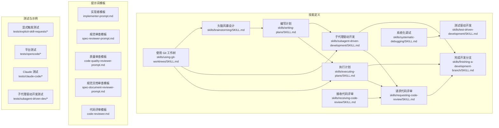
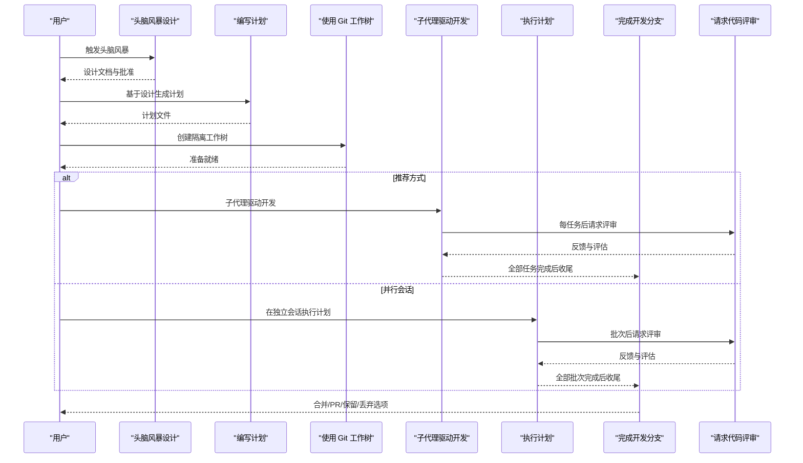
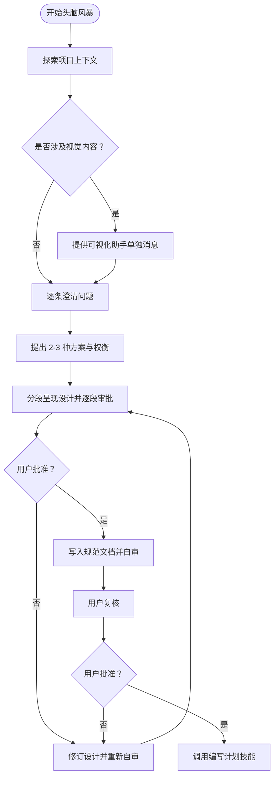
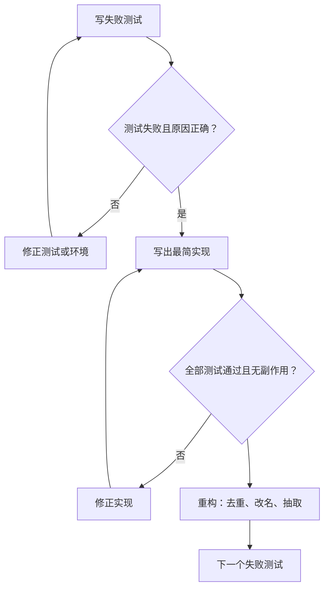
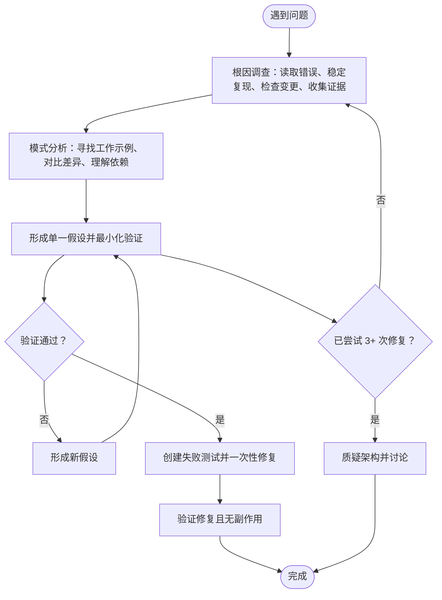
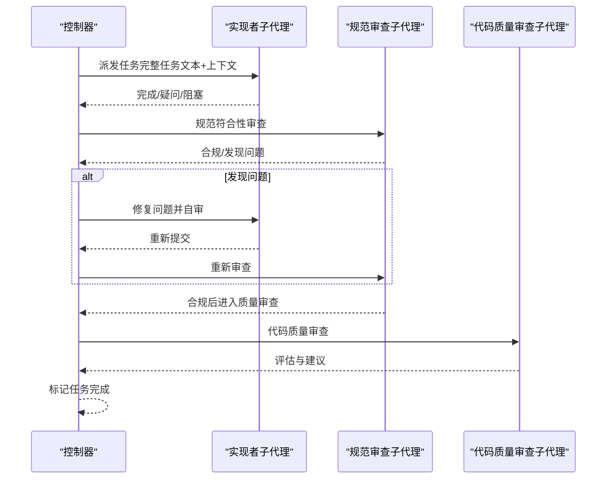
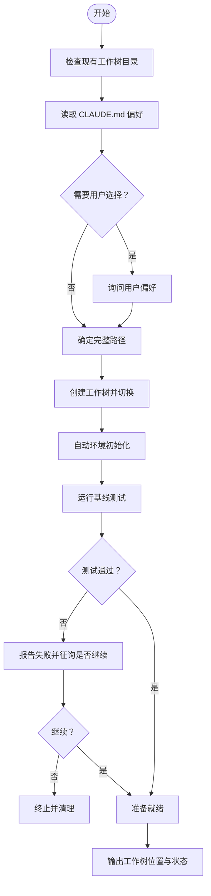
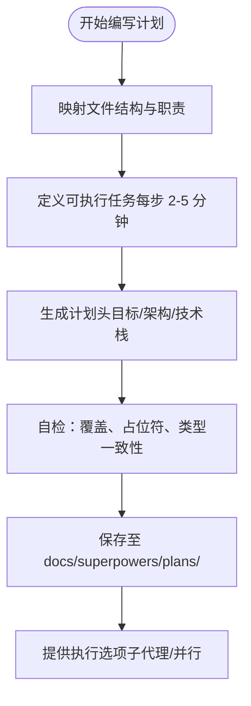
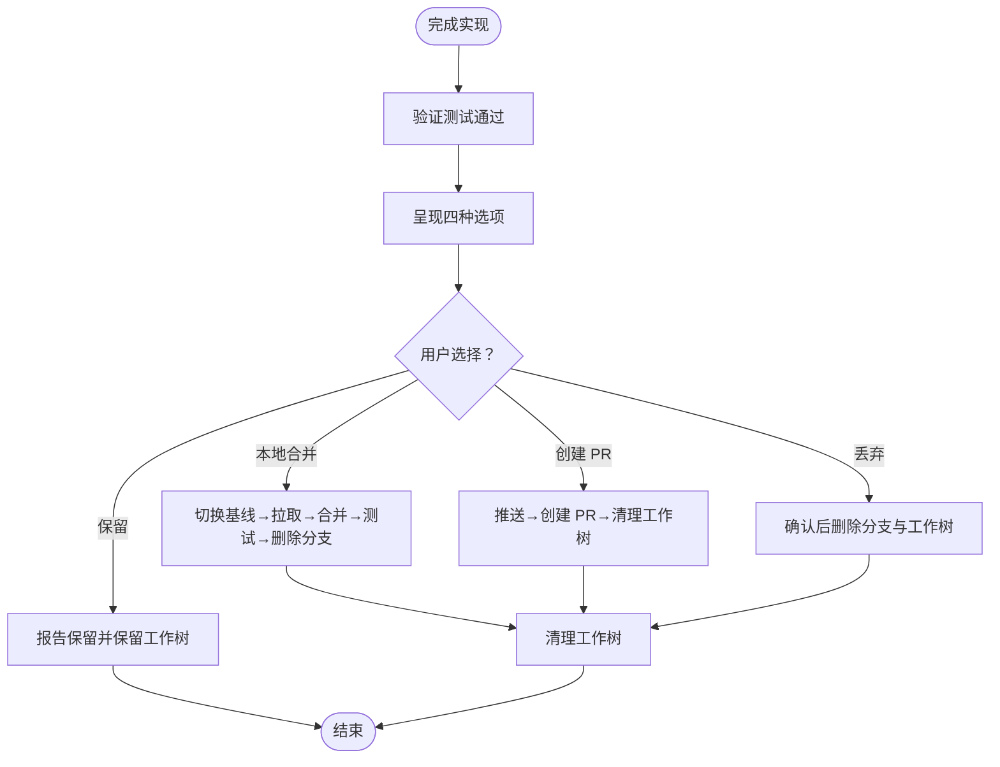
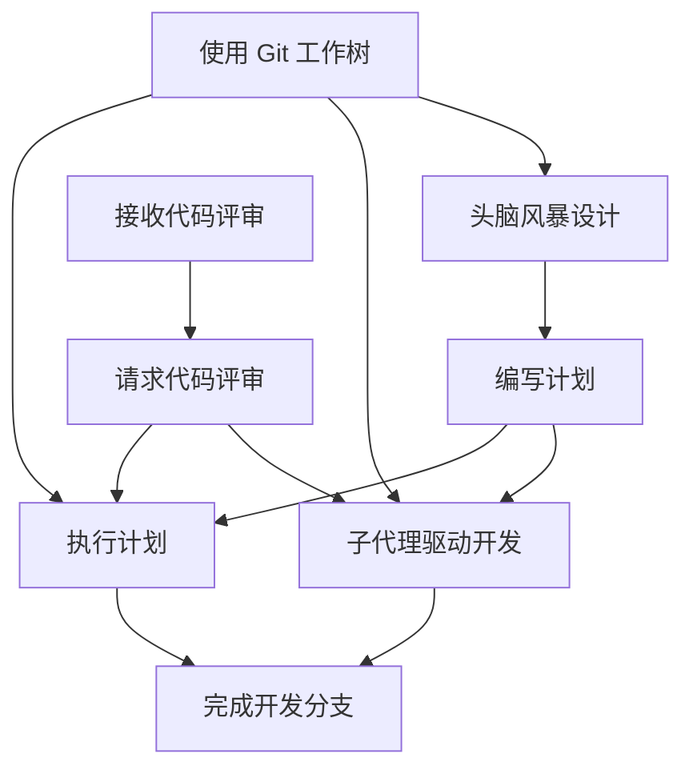

# 核心技能详解

<cite>
**本文引用的文件**
- [skills/brainstorming/SKILL.md](file://skills/brainstorming/SKILL.md)
- [skills/test-driven-development/SKILL.md](file://skills/test-driven-development/SKILL.md)
- [skills/systematic-debugging/SKILL.md](file://skills/systematic-debugging/SKILL.md)
- [skills/subagent-driven-development/SKILL.md](file://skills/subagent-driven-development/SKILL.md)
- [skills/using-git-worktrees/SKILL.md](file://skills/using-git-worktrees/SKILL.md)
- [skills/writing-plans/SKILL.md](file://skills/writing-plans/SKILL.md)
- [skills/executing-plans/SKILL.md](file://skills/executing-plans/SKILL.md)
- [skills/finishing-a-development-branch/SKILL.md](file://skills/finishing-a-development-branch/SKILL.md)
- [skills/requesting-code-review/SKILL.md](file://skills/requesting-code-review/SKILL.md)
- [skills/receiving-code-review/SKILL.md](file://skills/receiving-code-review/SKILL.md)
- [skills/subagent-driven-development/implementer-prompt.md](file://skills/subagent-driven-development/implementer-prompt.md)
- [skills/subagent-driven-development/spec-reviewer-prompt.md](file://skills/subagent-driven-development/spec-reviewer-prompt.md)
- [skills/subagent-driven-development/code-quality-reviewer-prompt.md](file://skills/subagent-driven-development/code-quality-reviewer-prompt.md)
- [skills/brainstorming/spec-document-reviewer-prompt.md](file://skills/brainstorming/spec-document-reviewer-prompt.md)
- [skills/requesting-code-review/code-reviewer.md](file://skills/requesting-code-review/code-reviewer.md)
- [skills/systematic-debugging/root-cause-tracing.md](file://skills/systematic-debugging/root-cause-tracing.md)
- [skills/systematic-debugging/defense-in-depth.md](file://skills/systematic-debugging/defense-in-depth.md)
- [skills/systematic-debugging/condition-based-waiting.md](file://skills/systematic-debugging/condition-based-waiting.md)
- [skills/systematic-debugging/condition-based-waiting-example.ts](file://skills/systematic-debugging/condition-based-waiting-example.ts)
- [skills/systematic-debugging/find-polluter.sh](file://skills/systematic-debugging/find-polluter.sh)
- [skills/systematic-debugging/test-pressure-1.md](file://skills/systematic-debugging/test-pressure-1.md)
- [skills/systematic-debugging/test-pressure-2.md](file://skills/systematic-debugging/test-pressure-2.md)
- [skills/systematic-debugging/test-pressure-3.md](file://skills/systematic-debugging/test-pressure-3.md)
- [skills/systematic-debugging/test-academic.md](file://skills/systematic-debugging/test-academic.md)
- [skills/systematic-debugging/CREATION-LOG.md](file://skills/systematic-debugging/CREATION-LOG.md)
- [tests/explicit-skill-requests/run-all.sh](file://tests/explicit-skill-requests/run-all.sh)
- [tests/explicit-skill-requests/run-test.sh](file://tests/explicit-skill-requests/run-test.sh)
- [tests/skill-triggering/run-all.sh](file://tests/skill-triggering/run-all.sh)
- [tests/skill-triggering/run-test.sh](file://tests/skill-triggering/run-test.sh)
- [tests/claude-code/run-skill-tests.sh](file://tests/claude-code/run-skill-tests.sh)
- [tests/claude-code/test-helpers.sh](file://tests/claude-code/test-helpers.sh)
- [tests/claude-code/test-subagent-driven-development.sh](file://tests/claude-code/test-subagent-driven-development.sh)
- [tests/claude-code/test-subagent-driven-development-integration.sh](file://tests/claude-code/test-subagent-driven-development-integration.sh)
- [tests/opencode/test-plugin-loading.sh](file://tests/opencode/test-plugin-loading.sh)
- [tests/opencode/test-priority.sh](file://tests/opencode/test-priority.sh)
- [tests/opencode/test-tools.sh](file://tests/opencode/test-tools.sh)
- [tests/opencode/run-tests.sh](file://tests/opencode/run-tests.sh)
- [tests/opencode/setup.sh](file://tests/opencode/setup.sh)
- [tests/subagent-driven-dev/run-test.sh](file://tests/subagent-driven-dev/run-test.sh)
- [tests/subagent-driven-dev/go-fractals/design.md](file://tests/subagent-driven-dev/go-fractals/design.md)
- [tests/subagent-driven-dev/go-fractals/plan.md](file://tests/subagent-driven-dev/go-fractals/plan.md)
- [tests/subagent-driven-dev/go-fractals/scaffold.sh](file://tests/subagent-driven-dev/go-fractals/scaffold.sh)
- [tests/subagent-driven-dev/svelte-todo/design.md](file://tests/subagent-driven-dev/svelte-todo/design.md)
- [tests/subagent-driven-dev/svelte-todo/plan.md](file://tests/subagent-driven-dev/svelte-todo/plan.md)
- [tests/subagent-driven-dev/svelte-todo/scaffold.sh](file://tests/subagent-driven-dev/svelte-todo/scaffold.sh)
- [commands/brainstorm.md](file://commands/brainstorm.md)
- [commands/execute-plan.md](file://commands/execute-plan.md)
- [commands/write-plan.md](file://commands/write-plan.md)
- [README.md](file://README.md)
</cite>

## 目录
1. [引言](#引言)
2. [项目结构](#项目结构)
3. [核心组件](#核心组件)
4. [架构总览](#架构总览)
5. [详细组件分析](#详细组件分析)
6. [依赖关系分析](#依赖关系分析)
7. [性能考量](#性能考量)
8. [故障排查指南](#故障排查指南)
9. [结论](#结论)
10. [附录](#附录)

## 引言
本文件面向 Superpowers 的核心技能体系，系统化解析以下技能的实现原理、使用场景与最佳实践：头脑风暴设计、测试驱动开发、系统化调试、子代理驱动开发、Git 工作树管理、计划撰写、执行计划、完成分支、请求代码评审与接收代码评审。文档提供流程图、时序图与类图，帮助读者从概念到落地全面掌握这些技能，并给出可操作的配置要点、参数说明、返回值定义与真实用例路径。

## 项目结构
Superpowers 将“技能”以独立 Markdown 文件组织，配套提示词模板、测试脚本与示例工程，形成“技能定义 + 模板 + 测试”的闭环。核心技能围绕“设计—计划—实现—评审—合并”的流水线展开，Git 工作树贯穿隔离与清理，子代理承担具体任务与两阶段审查。

图表来源
- [skills/brainstorming/SKILL.md:1-165](file://skills/brainstorming/SKILL.md#L1-L165)
- [skills/writing-plans/SKILL.md:1-153](file://skills/writing-plans/SKILL.md#L1-L153)
- [skills/subagent-driven-development/SKILL.md:1-278](file://skills/subagent-driven-development/SKILL.md#L1-L278)
- [skills/executing-plans/SKILL.md:1-71](file://skills/executing-plans/SKILL.md#L1-L71)
- [skills/finishing-a-development-branch/SKILL.md:1-201](file://skills/finishing-a-development-branch/SKILL.md#L1-L201)
- [skills/using-git-worktrees/SKILL.md:1-219](file://skills/using-git-worktrees/SKILL.md#L1-L219)
- [skills/requesting-code-review/SKILL.md:1-106](file://skills/requesting-code-review/SKILL.md#L1-L106)
- [skills/receiving-code-review/SKILL.md:1-214](file://skills/receiving-code-review/SKILL.md#L1-L214)

章节来源
- [README.md](file://README.md)

## 核心组件
- 头脑风暴设计：通过上下文探索、可视化助手、澄清问题、多方案权衡与设计文档产出，确保“先设计后实现”，并强制在进入实现前获得用户批准。
- 测试驱动开发：以“红-绿-重构”为核心循环，强调“先写失败测试”，杜绝“事后补测”，保证行为正确性与可维护性。
- 系统化调试：四阶段根因调查、模式分析、假设验证与修复实施，避免症状性修复与多次无效尝试。
- 子代理驱动开发：每任务派发新鲜子代理，两阶段审查（规范符合性 → 代码质量），提升迭代速度与质量稳定性。
- 使用 Git 工作树：系统化目录选择与安全校验，创建隔离工作区，自动环境初始化与基线测试验证。
- 编写计划：产出可执行的实现计划，明确文件结构、任务粒度与检查点，支持两种执行方式的无缝衔接。
- 执行计划：在独立会话中加载并严格按计划执行，设置审查检查点，完成后移交分支收尾。
- 完成开发分支：统一验证测试、确定基线分支、提供四种处理选项并清理工作树。
- 请求/接收代码评审：标准化评审请求与反馈处理流程，强调技术验证与理性推进。

章节来源
- [skills/brainstorming/SKILL.md:1-165](file://skills/brainstorming/SKILL.md#L1-L165)
- [skills/test-driven-development/SKILL.md:1-372](file://skills/test-driven-development/SKILL.md#L1-L372)
- [skills/systematic-debugging/SKILL.md:1-297](file://skills/systematic-debugging/SKILL.md#L1-L297)
- [skills/subagent-driven-development/SKILL.md:1-278](file://skills/subagent-driven-development/SKILL.md#L1-L278)
- [skills/using-git-worktrees/SKILL.md:1-219](file://skills/using-git-worktrees/SKILL.md#L1-L219)
- [skills/writing-plans/SKILL.md:1-153](file://skills/writing-plans/SKILL.md#L1-L153)
- [skills/executing-plans/SKILL.md:1-71](file://skills/executing-plans/SKILL.md#L1-L71)
- [skills/finishing-a-development-branch/SKILL.md:1-201](file://skills/finishing-a-development-branch/SKILL.md#L1-L201)
- [skills/requesting-code-review/SKILL.md:1-106](file://skills/requesting-code-review/SKILL.md#L1-L106)
- [skills/receiving-code-review/SKILL.md:1-214](file://skills/receiving-code-review/SKILL.md#L1-L214)

## 架构总览
下图展示了从“头脑风暴设计”到“完成开发分支”的端到端流程，以及与“使用 Git 工作树”“请求/接收代码评审”的集成关系。

图表来源
- [skills/brainstorming/SKILL.md:1-165](file://skills/brainstorming/SKILL.md#L1-L165)
- [skills/writing-plans/SKILL.md:1-153](file://skills/writing-plans/SKILL.md#L1-L153)
- [skills/using-git-worktrees/SKILL.md:1-219](file://skills/using-git-worktrees/SKILL.md#L1-L219)
- [skills/subagent-driven-development/SKILL.md:1-278](file://skills/subagent-driven-development/SKILL.md#L1-L278)
- [skills/executing-plans/SKILL.md:1-71](file://skills/executing-plans/SKILL.md#L1-L71)
- [skills/finishing-a-development-branch/SKILL.md:1-201](file://skills/finishing-a-development-branch/SKILL.md#L1-L201)
- [skills/requesting-code-review/SKILL.md:1-106](file://skills/requesting-code-review/SKILL.md#L1-L106)

## 详细组件分析

### 头脑风暴设计（Brainstorming）
- 目标：将创意转化为完整设计与规范，避免“简单项目”陷阱。
- 关键机制：
  - 上下文探索（文件、文档、最近提交）
  - 可视化助手（仅在视觉内容必要时启用）
  - 逐条澄清问题，聚焦目的、约束与成功标准
  - 提出 2-3 种方案与权衡，给出推荐理由
  - 分段呈现设计，按复杂度分级，逐段获取用户批准
  - 写入规范文档并进行自审，再交由用户复核
  - 终止状态：调用“编写计划”技能
- 配置与参数：
  - 可视化助手开关：仅当问题涉及视觉内容时开启
  - 规范文档保存路径：默认位于 docs/superpowers/specs/YYYY-MM-DD-<topic>-design.md
  - 自审清单：占位符扫描、内部一致性、范围检查、歧义消除
- 返回值与状态：
  - 用户批准后进入“编写计划”
  - 用户要求修改则回到设计与自审循环
- 最佳实践：
  - 对大型需求进行子项目拆分，确保单个规范可生成独立实现计划
  - 保持“一个消息一个问题”，优先多选题
  - 严格遵循“先设计后实现”的硬门槛

图表来源
- [skills/brainstorming/SKILL.md:1-165](file://skills/brainstorming/SKILL.md#L1-L165)

章节来源
- [skills/brainstorming/SKILL.md:1-165](file://skills/brainstorming/SKILL.md#L1-L165)
- [skills/brainstorming/spec-document-reviewer-prompt.md:1-50](file://skills/brainstorming/spec-document-reviewer-prompt.md#L1-L50)

### 测试驱动开发（Test-Driven Development）
- 目标：以失败测试驱动实现，确保行为正确、可测试且可维护。
- 关键机制：
  - 红：写一个最小失败测试
  - 绿：写出刚好能通过的最简实现
  - 重构：移除重复、改善命名、提取辅助函数
  - 循环推进下一个失败测试
- 验证清单：
  - 每个新函数/方法都有测试
  - 每个测试在实现前都失败
  - 实现后所有测试通过且输出纯净
  - 使用真实代码（除非不可避免才用模拟）
- 常见误区与对策：
  - “太简单无需测试”→ 30 秒写测试
  - “事后补测”→ 无法证明覆盖了遗漏的边界
  - “删除 X 小时工作更浪费”→ 技术债务远高于重写成本
- 调试集成：
  - 发现缺陷即刻写失败测试，按 TDD 循环修复并防止回归

图表来源
- [skills/test-driven-development/SKILL.md:1-372](file://skills/test-driven-development/SKILL.md#L1-L372)

章节来源
- [skills/test-driven-development/SKILL.md:1-372](file://skills/test-driven-development/SKILL.md#L1-L372)

### 系统化调试（Systematic Debugging）
- 目标：在任何错误、测试失败或异常行为出现时，先定位根因再修复。
- 四阶段流程：
  - 根因调查：仔细阅读错误信息、稳定复现、检查变更、多组件系统收集证据
  - 模式分析：寻找已知工作示例、对比差异、理解依赖
  - 假设与验证：单一假设、最小化验证、验证后再继续
  - 实施：创建失败测试、一次性修复、验证效果；若三次以上无效，质疑架构
- 支持技术：
  - 根因追溯（反向追踪调用栈）
  - 深度防御（多层验证）
  - 条件等待（以条件轮询替代任意超时）

图表来源
- [skills/systematic-debugging/SKILL.md:1-297](file://skills/systematic-debugging/SKILL.md#L1-L297)
- [skills/systematic-debugging/root-cause-tracing.md](file://skills/systematic-debugging/root-cause-tracing.md)
- [skills/systematic-debugging/defense-in-depth.md](file://skills/systematic-debugging/defense-in-depth.md)
- [skills/systematic-debugging/condition-based-waiting.md](file://skills/systematic-debugging/condition-based-waiting.md)

章节来源
- [skills/systematic-debugging/SKILL.md:1-297](file://skills/systematic-debugging/SKILL.md#L1-L297)
- [skills/systematic-debugging/condition-based-waiting-example.ts](file://skills/systematic-debugging/condition-based-waiting-example.ts)

### 子代理驱动开发（Subagent-Driven Development）
- 目标：每任务派发新鲜子代理，两阶段审查（规范符合性 → 代码质量），实现高质量、快速迭代。
- 关键机制：
  - 任务提取与 TodoWrite 管理
  - 实现者子代理：按完整任务文本与上下文执行，自问自答，自审，测试，提交
  - 规范审查子代理：独立核查实现是否“不多不少”
  - 代码质量审查子代理：基于评审模板进行架构、测试、可维护性评估
  - 模型选择：机械任务用便宜模型，集成判断用标准模型，设计审查用最强模型
- 处理实现者状态：
  - DONE：进入规范审查
  - DONE_WITH_CONCERNS：审阅疑虑后再进入审查
  - NEEDS_CONTEXT：补充上下文后重派发
  - BLOCKED：调整模型、拆分任务或升级到人类介入
- 与工作流集成：
  - 必需前置：使用 Git 工作树
  - 可选后续：最终代码审查与分支收尾

图表来源
- [skills/subagent-driven-development/SKILL.md:1-278](file://skills/subagent-driven-development/SKILL.md#L1-L278)
- [skills/subagent-driven-development/implementer-prompt.md:1-114](file://skills/subagent-driven-development/implementer-prompt.md#L1-L114)
- [skills/subagent-driven-development/spec-reviewer-prompt.md:1-62](file://skills/subagent-driven-development/spec-reviewer-prompt.md#L1-L62)
- [skills/subagent-driven-development/code-quality-reviewer-prompt.md:1-27](file://skills/subagent-driven-development/code-quality-reviewer-prompt.md#L1-L27)
- [skills/requesting-code-review/code-reviewer.md:1-147](file://skills/requesting-code-review/code-reviewer.md#L1-L147)

章节来源
- [skills/subagent-driven-development/SKILL.md:1-278](file://skills/subagent-driven-development/SKILL.md#L1-L278)
- [skills/subagent-driven-development/implementer-prompt.md:1-114](file://skills/subagent-driven-development/implementer-prompt.md#L1-L114)
- [skills/subagent-driven-development/spec-reviewer-prompt.md:1-62](file://skills/subagent-driven-development/spec-reviewer-prompt.md#L1-L62)
- [skills/subagent-driven-development/code-quality-reviewer-prompt.md:1-27](file://skills/subagent-driven-development/code-quality-reviewer-prompt.md#L1-L27)
- [skills/requesting-code-review/code-reviewer.md:1-147](file://skills/requesting-code-review/code-reviewer.md#L1-L147)

### 使用 Git 工作树（Using Git Worktrees）
- 目标：系统化目录选择与安全校验，创建隔离工作空间，避免污染主分支。
- 关键机制：
  - 目录优先级：已有目录 > CLAUDE.md 配置 > 用户选择
  - 安全校验：项目本地目录必须被忽略，否则立即添加 .gitignore 并提交
  - 工作树创建：检测项目名，确定路径，创建并切换
  - 自动环境初始化：根据项目文件自动安装依赖或构建
  - 基线测试验证：运行项目测试，失败时询问是否继续
  - 报告位置：输出完整路径、测试结果与准备状态
- 常见错误与修复：
  - 跳过忽略校验 → 强制校验并通过
  - 假设目录位置 → 严格遵循优先级
  - 继续失败基线 → 明确许可后再继续
  - 硬编码安装命令 → 自动检测项目类型

图表来源
- [skills/using-git-worktrees/SKILL.md:1-219](file://skills/using-git-worktrees/SKILL.md#L1-L219)

章节来源
- [skills/using-git-worktrees/SKILL.md:1-219](file://skills/using-git-worktrees/SKILL.md#L1-L219)

### 编写计划（Writing Plans）
- 目标：产出可执行的实现计划，确保“零上下文工程师”也能按步骤完成。
- 关键机制：
  - 文件结构映射：明确每个文件职责，保持高内聚低耦合
  - 任务粒度：每步 2-5 分钟，包含“写失败测试→运行验证→实现→测试→提交”
  - 计划头：包含目标、架构、技术栈与执行选项提示
  - 自检清单：规范覆盖、无占位符、类型一致
  - 执行交接：提供子代理驱动与并行执行两种选项
- 最佳实践：
  - DRY、YAGNI、TDD、频繁提交
  - 严禁占位符与“稍后实现”语句
  - 类型、方法签名、属性名前后一致

图表来源
- [skills/writing-plans/SKILL.md:1-153](file://skills/writing-plans/SKILL.md#L1-L153)

章节来源
- [skills/writing-plans/SKILL.md:1-153](file://skills/writing-plans/SKILL.md#L1-L153)

### 执行计划（Executing Plans）
- 目标：在独立会话中加载并严格按计划执行，设置审查检查点，完成后移交分支收尾。
- 关键机制：
  - 加载与批判性审查计划，识别问题与担忧
  - 每任务标记进行中，严格遵循步骤与验证
  - 完成后调用“完成开发分支”技能
- 阻力处理：
  - 遇到阻塞、指令不清、验证反复失败时立即停止并寻求澄清
  - 计划重大偏差时回退到审查阶段

章节来源
- [skills/executing-plans/SKILL.md:1-71](file://skills/executing-plans/SKILL.md#L1-L71)

### 完成开发分支（Finishing a Development Branch）
- 目标：统一验证测试、确定基线分支、提供四种处理选项并清理工作树。
- 四种选项：
  - 本地合并回基线分支
  - 推送并创建 Pull Request
  - 保留分支（稍后处理）
  - 丢弃工作（需确认）
- 清理策略：
  - 仅在本地合并与丢弃时清理工作树
  - 保留分支时不清理工作树

图表来源
- [skills/finishing-a-development-branch/SKILL.md:1-201](file://skills/finishing-a-development-branch/SKILL.md#L1-L201)

章节来源
- [skills/finishing-a-development-branch/SKILL.md:1-201](file://skills/finishing-a-development-branch/SKILL.md#L1-L201)

### 请求代码评审（Requesting Code Review）
- 目标：在关键节点请求子代理评审，早期发现问题，避免问题累积。
- 关键机制：
  - 获取基线与 HEAD 提交 SHA
  - 使用评审模板填充占位符并派发子代理
  - 按严重级别处理反馈：关键立即修复，重要在继续前修复，次要延后
- 集成：
  - 子代理驱动开发：每任务后请求评审
  - 执行计划：每批次后请求评审

章节来源
- [skills/requesting-code-review/SKILL.md:1-106](file://skills/requesting-code-review/SKILL.md#L1-L106)
- [skills/requesting-code-review/code-reviewer.md:1-147](file://skills/requesting-code-review/code-reviewer.md#L1-L147)

### 接收代码评审（Receiving Code Review）
- 目标：对评审反馈进行技术验证与理性响应，不盲从，不表演性认同。
- 关键机制：
  - 读取→理解→验证→评估→响应→实施
  - 不清晰项先澄清，再实施
  - 对外部评审进行技术正确性验证，必要时与人类伙伴讨论
- 最佳实践：
  - 以动作代替感谢，代码即反馈
  - 对不合理的建议进行技术性反驳并提供证据

章节来源
- [skills/receiving-code-review/SKILL.md:1-214](file://skills/receiving-code-review/SKILL.md#L1-L214)

## 依赖关系分析
- 技能间依赖：
  - 头脑风暴设计 → 编写计划（强制）
  - 编写计划 → 子代理驱动开发 或 执行计划（可选其一）
  - 子代理驱动开发/执行计划 → 完成开发分支
  - 使用 Git 工作树 → 头脑风暴设计、子代理驱动开发、执行计划
  - 请求/接收代码评审 → 子代理驱动开发、执行计划、完成开发分支
- 模板依赖：
  - 子代理驱动开发依赖实现者、规范审查、代码质量审查模板
  - 请求代码评审依赖通用评审模板

图表来源
- [skills/brainstorming/SKILL.md:1-165](file://skills/brainstorming/SKILL.md#L1-L165)
- [skills/writing-plans/SKILL.md:1-153](file://skills/writing-plans/SKILL.md#L1-L153)
- [skills/subagent-driven-development/SKILL.md:1-278](file://skills/subagent-driven-development/SKILL.md#L1-L278)
- [skills/executing-plans/SKILL.md:1-71](file://skills/executing-plans/SKILL.md#L1-L71)
- [skills/finishing-a-development-branch/SKILL.md:1-201](file://skills/finishing-a-development-branch/SKILL.md#L1-L201)
- [skills/using-git-worktrees/SKILL.md:1-219](file://skills/using-git-worktrees/SKILL.md#L1-L219)
- [skills/requesting-code-review/SKILL.md:1-106](file://skills/requesting-code-review/SKILL.md#L1-L106)
- [skills/receiving-code-review/SKILL.md:1-214](file://skills/receiving-code-review/SKILL.md#L1-L214)

章节来源
- [skills/subagent-driven-development/implementer-prompt.md:1-114](file://skills/subagent-driven-development/implementer-prompt.md#L1-L114)
- [skills/subagent-driven-development/spec-reviewer-prompt.md:1-62](file://skills/subagent-driven-development/spec-reviewer-prompt.md#L1-L62)
- [skills/subagent-driven-development/code-quality-reviewer-prompt.md:1-27](file://skills/subagent-driven-development/code-quality-reviewer-prompt.md#L1-L27)
- [skills/requesting-code-review/code-reviewer.md:1-147](file://skills/requesting-code-review/code-reviewer.md#L1-L147)

## 性能考量
- 子代理驱动开发通过“新鲜上下文 + 两阶段审查”减少返工，提高首次修复率与质量稳定性。
- 使用 Git 工作树隔离实现，避免主分支污染与冲突，降低合并成本。
- 测试驱动开发在早期发现缺陷，减少后期调试时间与回归风险。
- 系统化调试以科学方法定位根因，避免无效尝试与架构性缺陷放大。

## 故障排查指南
- 头脑风暴设计
  - 症状：设计未获批准即进入实现
  - 处理：回到设计与自审循环，直至用户批准
  - 参考：[skills/brainstorming/SKILL.md:1-165](file://skills/brainstorming/SKILL.md#L1-L165)
- 测试驱动开发
  - 症状：测试通过但未先失败
  - 处理：删除实现代码，先写失败测试
  - 参考：[skills/test-driven-development/SKILL.md:1-372](file://skills/test-driven-development/SKILL.md#L1-L372)
- 系统化调试
  - 症状：多次无效修复
  - 处理：停止并质疑架构，与人类伙伴讨论
  - 参考：[skills/systematic-debugging/SKILL.md:1-297](file://skills/systematic-debugging/SKILL.md#L1-L297)
- 子代理驱动开发
  - 症状：实现者 BLOCKED
  - 处理：调整模型、拆分任务或升级到人类介入
  - 参考：[skills/subagent-driven-development/SKILL.md:1-278](file://skills/subagent-driven-development/SKILL.md#L1-L278)
- 使用 Git 工作树
  - 症状：工作树内容被跟踪
  - 处理：添加 .gitignore 并提交，重新创建工作树
  - 参考：[skills/using-git-worktrees/SKILL.md:1-219](file://skills/using-git-worktrees/SKILL.md#L1-L219)
- 完成开发分支
  - 症状：测试失败仍要合并
  - 处理：先修复测试，再提供选项
  - 参考：[skills/finishing-a-development-branch/SKILL.md:1-201](file://skills/finishing-a-development-branch/SKILL.md#L1-L201)

章节来源
- [skills/brainstorming/SKILL.md:1-165](file://skills/brainstorming/SKILL.md#L1-L165)
- [skills/test-driven-development/SKILL.md:1-372](file://skills/test-driven-development/SKILL.md#L1-L372)
- [skills/systematic-debugging/SKILL.md:1-297](file://skills/systematic-debugging/SKILL.md#L1-L297)
- [skills/subagent-driven-development/SKILL.md:1-278](file://skills/subagent-driven-development/SKILL.md#L1-L278)
- [skills/using-git-worktrees/SKILL.md:1-219](file://skills/using-git-worktrees/SKILL.md#L1-L219)
- [skills/finishing-a-development-branch/SKILL.md:1-201](file://skills/finishing-a-development-branch/SKILL.md#L1-L201)

## 结论
Superpowers 的核心技能围绕“先设计、后计划、再实现、评审与收尾”的闭环构建，辅以 Git 工作树隔离与子代理两阶段审查，形成高可靠、可扩展且可审计的开发流程。通过严格的规则与模板，团队可在复杂项目中保持一致性与高质量交付。

## 附录
- 实际用例与测试参考：
  - 显式触发测试：tests/explicit-skill-requests/*
  - 平台测试（OpenCode）：tests/opencode/*
  - Claude 平台测试：tests/claude-code/*
  - 子代理驱动开发测试：tests/subagent-driven-dev/*
- 命令入口：
  - 头脑风暴：commands/brainstorm.md
  - 编写计划：commands/write-plan.md
  - 执行计划：commands/execute-plan.md

章节来源
- [tests/explicit-skill-requests/run-all.sh](file://tests/explicit-skill-requests/run-all.sh)
- [tests/explicit-skill-requests/run-test.sh](file://tests/explicit-skill-requests/run-test.sh)
- [tests/opencode/run-tests.sh](file://tests/opencode/run-tests.sh)
- [tests/opencode/test-plugin-loading.sh](file://tests/opencode/test-plugin-loading.sh)
- [tests/opencode/test-priority.sh](file://tests/opencode/test-priority.sh)
- [tests/opencode/test-tools.sh](file://tests/opencode/test-tools.sh)
- [tests/claude-code/run-skill-tests.sh](file://tests/claude-code/run-skill-tests.sh)
- [tests/claude-code/test-helpers.sh](file://tests/claude-code/test-helpers.sh)
- [tests/claude-code/test-subagent-driven-development.sh](file://tests/claude-code/test-subagent-driven-development.sh)
- [tests/claude-code/test-subagent-driven-development-integration.sh](file://tests/claude-code/test-subagent-driven-development-integration.sh)
- [tests/subagent-driven-dev/run-test.sh](file://tests/subagent-driven-dev/run-test.sh)
- [tests/subagent-driven-dev/go-fractals/design.md](file://tests/subagent-driven-dev/go-fractals/design.md)
- [tests/subagent-driven-dev/go-fractals/plan.md](file://tests/subagent-driven-dev/go-fractals/plan.md)
- [tests/subagent-driven-dev/go-fractals/scaffold.sh](file://tests/subagent-driven-dev/go-fractals/scaffold.sh)
- [tests/subagent-driven-dev/svelte-todo/design.md](file://tests/subagent-driven-dev/svelte-todo/design.md)
- [tests/subagent-driven-dev/svelte-todo/plan.md](file://tests/subagent-driven-dev/svelte-todo/plan.md)
- [tests/subagent-driven-dev/svelte-todo/scaffold.sh](file://tests/subagent-driven-dev/svelte-todo/scaffold.sh)
- [commands/brainstorm.md](file://commands/brainstorm.md)
- [commands/write-plan.md](file://commands/write-plan.md)
- [commands/execute-plan.md](file://commands/execute-plan.md)