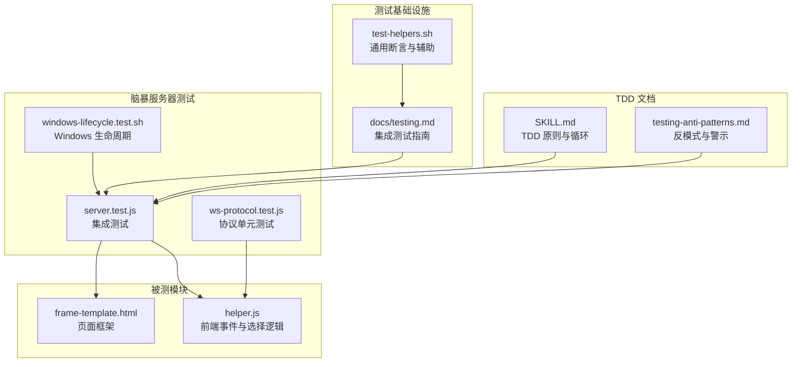
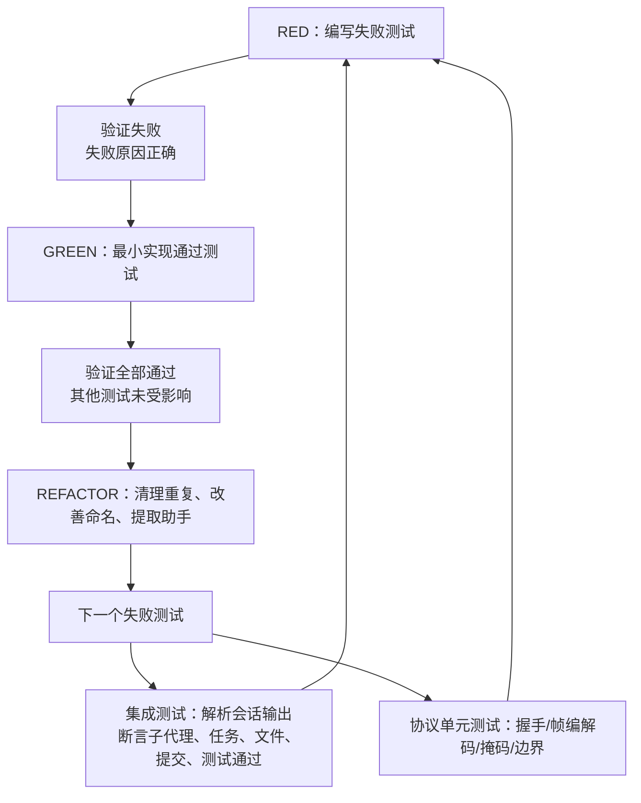
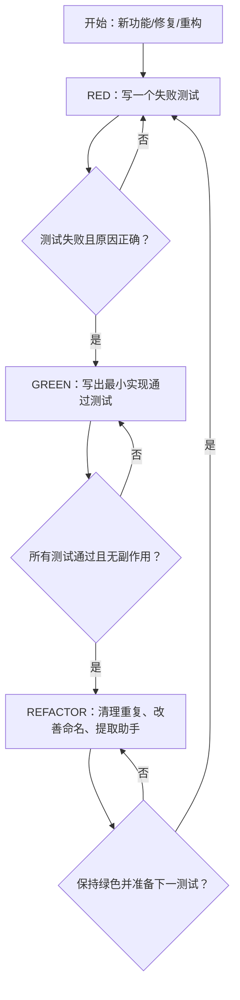
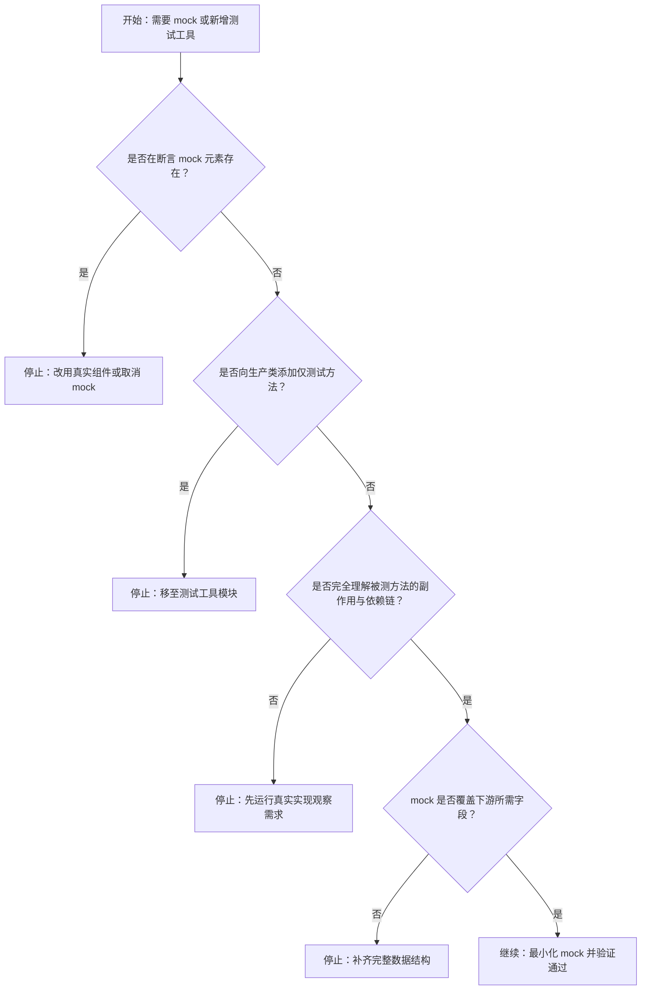
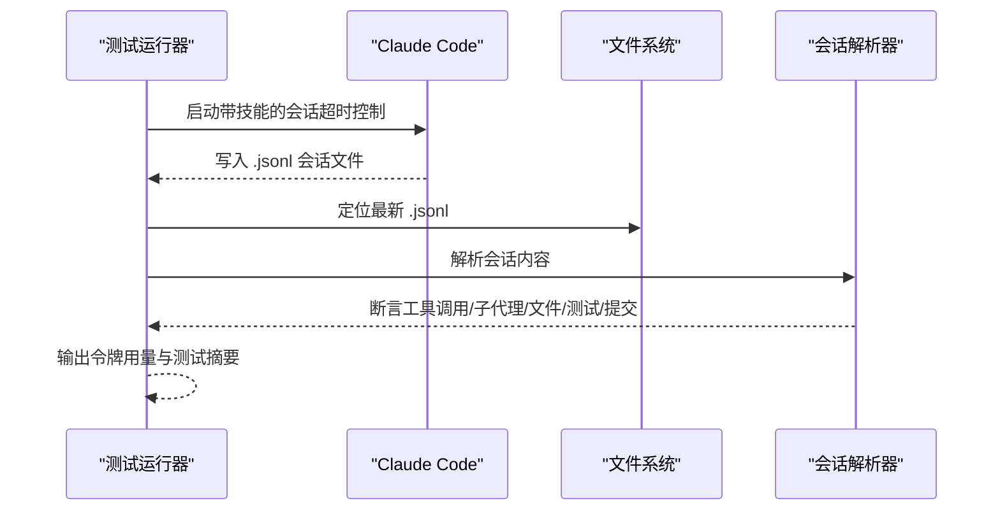
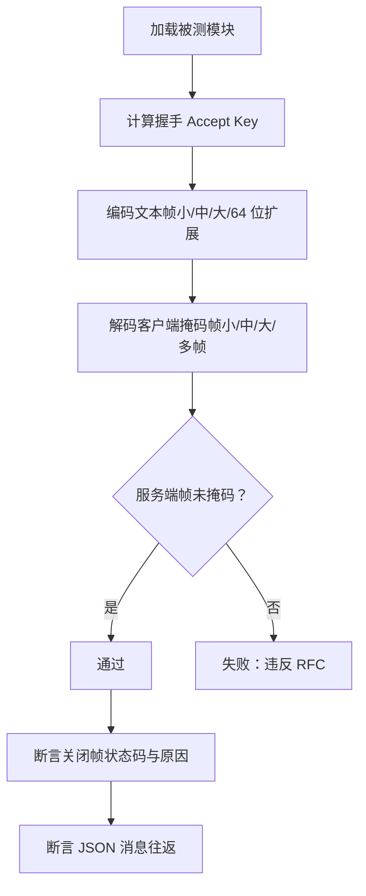
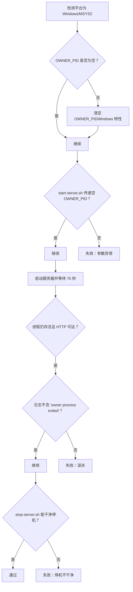
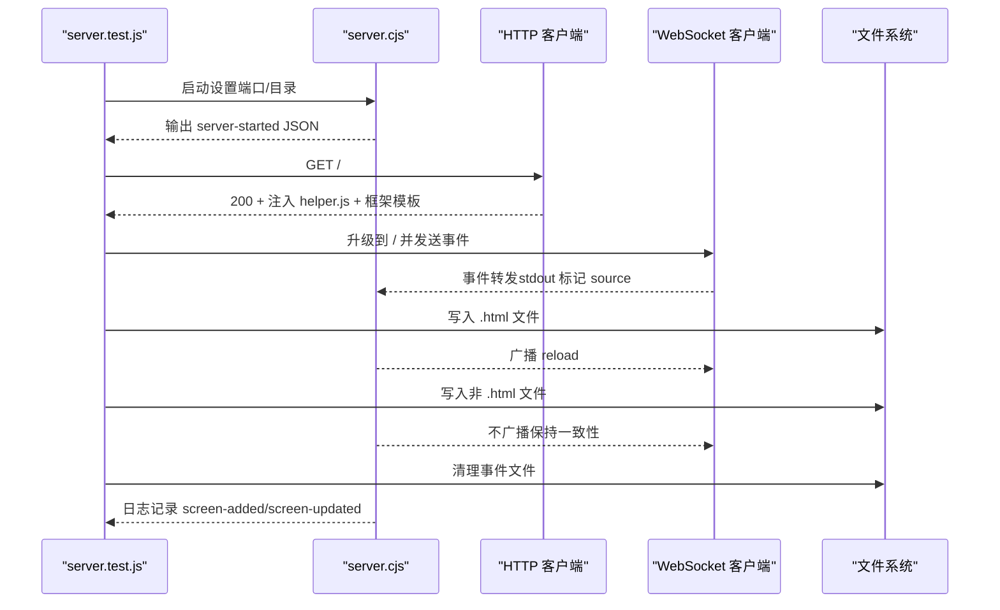
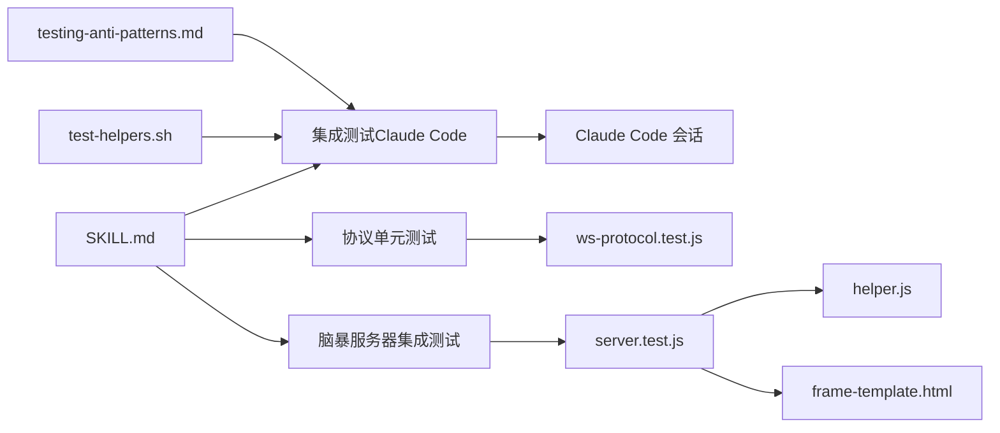

# 测试驱动开发

<cite>
**本文引用的文件**
- [技能：测试驱动开发（SKILL.md）](file://skills/test-driven-development/SKILL.md)
- [测试反模式与常见陷阱（testing-anti-patterns.md）](file://skills/test-driven-development/testing-anti-patterns.md)
- [测试超级能力技能（testing.md）](file://docs/testing.md)
- [脑暴服务器集成测试（server.test.js）](file://tests/brainstorm-server/server.test.js)
- [零依赖 WebSocket 协议单元测试（ws-protocol.test.js）](file://tests/brainstorm-server/ws-protocol.test.js)
- [Windows 生命周期测试（windows-lifecycle.test.sh）](file://tests/brainstorm-server/windows-lifecycle.test.sh)
- [测试辅助工具（test-helpers.sh）](file://tests/claude-code/test-helpers.sh)
- [脑暴脚本：helper.js](file://skills/brainstorming/scripts/helper.js)
- [脑暴脚本：frame-template.html](file://skills/brainstorming/scripts/frame-template.html)
- [包配置（package.json）](file://package.json)
</cite>

## 目录
1. [引言](#引言)
2. [项目结构](#项目结构)
3. [核心组件](#核心组件)
4. [架构总览](#架构总览)
5. [详细组件分析](#详细组件分析)
6. [依赖关系分析](#依赖关系分析)
7. [性能考量](#性能考量)
8. [故障排查指南](#故障排查指南)
9. [结论](#结论)
10. [附录](#附录)

## 引言
本文件面向希望系统掌握测试驱动开发（TDD）的读者，结合仓库中现有的 TDD 技能文档、测试反模式清单以及多类测试用例（单元、集成、端到端），深入阐述 RED-GREEN-REFACTOR 循环的完整流程，包括编写失败测试、实现最小代码让测试通过、重构改进代码等三个阶段；同时总结测试反模式与常见陷阱，给出最佳实践与在 AI 开发环境中的应用策略，并提供可复用的测试基础设施参考。

## 项目结构
该仓库围绕“测试超级能力”组织了丰富的测试资源，涵盖：
- TDD 技能与反模式：提供 TDD 原则、循环图、检查清单与常见误区
- 多层次测试：从协议级单元测试到端到端集成测试
- 脑暴服务器：HTTP/WebSocket 文件监听与交互式 UI 的完整测试套件
- Claude Code 集成测试：以真实会话解析输出验证复杂工作流

**图表来源**
- [技能：测试驱动开发（SKILL.md）:1-372](file://skills/test-driven-development/SKILL.md#L1-L372)
- [测试反模式与常见陷阱（testing-anti-patterns.md）:1-300](file://skills/test-driven-development/testing-anti-patterns.md#L1-L300)
- [测试超级能力技能（testing.md）:1-304](file://docs/testing.md#L1-L304)
- [脑暴服务器集成测试（server.test.js）:1-428](file://tests/brainstorm-server/server.test.js#L1-L428)
- [零依赖 WebSocket 协议单元测试（ws-protocol.test.js）:1-393](file://tests/brainstorm-server/ws-protocol.test.js#L1-L393)
- [Windows 生命周期测试（windows-lifecycle.test.sh）:1-352](file://tests/brainstorm-server/windows-lifecycle.test.sh#L1-L352)
- [测试辅助工具（test-helpers.sh）:1-203](file://tests/claude-code/test-helpers.sh#L1-L203)
- [脑暴脚本：helper.js:1-89](file://skills/brainstorming/scripts/helper.js#L1-L89)
- [脑暴脚本：frame-template.html:1-215](file://skills/brainstorming/scripts/frame-template.html#L1-L215)

**章节来源**
- [技能：测试驱动开发（SKILL.md）:1-372](file://skills/test-driven-development/SKILL.md#L1-L372)
- [测试超级能力技能（testing.md）:1-304](file://docs/testing.md#L1-L304)

## 核心组件
- TDD 循环与原则：明确“先写失败测试”的铁律，强调“看到失败才证明测试有效”
- 红绿重构流程：RED（失败测试）→ GREEN（最小实现）→ REFACTOR（清理与提取）
- 测试反模式清单：禁止测试 mock 行为、禁止生产类添加仅测试方法、禁止无依赖理解的 mock、禁止不完整的 mock、禁止把集成测试当作事后补丁
- 集成测试范式：以 Claude Code 会话为载体，解析 JSONL 输出进行断言，覆盖子代理调度、任务跟踪、Git 提交、测试执行与成本分析
- 协议级单元测试：独立于 HTTP 层，验证握手计算、帧编解码、掩码处理与边界条件
- 跨平台生命周期测试：针对 Windows 平台的生命周期检查与前台模式检测

**章节来源**
- [技能：测试驱动开发（SKILL.md）:47-197](file://skills/test-driven-development/SKILL.md#L47-L197)
- [测试反模式与常见陷阱（testing-anti-patterns.md）:13-175](file://skills/test-driven-development/testing-anti-patterns.md#L13-L175)
- [测试超级能力技能（testing.md）:1-304](file://docs/testing.md#L1-L304)
- [零依赖 WebSocket 协议单元测试（ws-protocol.test.js）:1-393](file://tests/brainstorm-server/ws-protocol.test.js#L1-L393)
- [Windows 生命周期测试（windows-lifecycle.test.sh）:1-352](file://tests/brainstorm-server/windows-lifecycle.test.sh#L1-L352)

## 架构总览
下图展示 TDD 在本仓库中的落地路径：从“失败测试”出发，经由“最小实现”，再到“重构与清理”，并在“集成测试”中验证端到端行为，最终在“协议单元测试”中确保底层通信正确性。

**图表来源**
- [技能：测试驱动开发（SKILL.md）:113-197](file://skills/test-driven-development/SKILL.md#L113-L197)
- [测试超级能力技能（testing.md）:40-135](file://docs/testing.md#L40-L135)
- [零依赖 WebSocket 协议单元测试（ws-protocol.test.js）:47-393](file://tests/brainstorm-server/ws-protocol.test.js#L47-L393)

## 详细组件分析

### 组件一：TDD 循环与检查清单
- 核心循环：RED → GREEN → REFACTOR，每个阶段都有强制性验证点
- 检查清单：是否每个新函数都有测试、是否看到失败、是否最小实现、是否使用真实代码、是否覆盖边界与错误
- 常见误区：测试后实现、测试立即通过、用“手动测试”替代自动化、删除已有实现却保留测试

**图表来源**
- [技能：测试驱动开发（SKILL.md）:113-197](file://skills/test-driven-development/SKILL.md#L113-L197)

**章节来源**
- [技能：测试驱动开发（SKILL.md）:113-197](file://skills/test-driven-development/SKILL.md#L113-L197)
- [技能：测试驱动开发（SKILL.md）:327-341](file://skills/test-driven-development/SKILL.md#L327-L341)

### 组件二：测试反模式与最佳实践
- 反模式一：测试 mock 行为而非真实行为（例如断言 mock 元素存在）
- 反模式二：在生产类中添加仅测试方法（污染生产 API）
- 反模式三：无依赖理解地进行 mock（破坏测试逻辑依赖）
- 反模式四：不完整的 mock（遗漏下游可能使用的字段）
- 反模式五：把集成测试当作事后补丁（测试应贯穿实现全过程）

**图表来源**
- [测试反模式与常见陷阱（testing-anti-patterns.md）:21-175](file://skills/test-driven-development/testing-anti-patterns.md#L21-L175)

**章节来源**
- [测试反模式与常见陷阱（testing-anti-patterns.md）:1-300](file://skills/test-driven-development/testing-anti-patterns.md#L1-L300)

### 组件三：集成测试（Claude Code 会话解析）
- 目标：验证复杂技能（如子代理驱动开发）在真实会话中的行为
- 方法：启动 Claude Code 会话，解析 JSONL 输出，断言工具调用、子代理分发、任务跟踪、文件生成、测试通过、Git 提交与令牌用量
- 关键点：必须从插件目录运行、授予权限、解析 .jsonl 而非用户输出、包含令牌分析

**图表来源**
- [测试超级能力技能（testing.md）:20-135](file://docs/testing.md#L20-L135)
- [测试辅助工具（test-helpers.sh）:1-203](file://tests/claude-code/test-helpers.sh#L1-L203)

**章节来源**
- [测试超级能力技能（testing.md）:1-304](file://docs/testing.md#L1-L304)
- [测试辅助工具（test-helpers.sh）:1-203](file://tests/claude-code/test-helpers.sh#L1-L203)

### 组件四：协议单元测试（WebSocket 零依赖实现）
- 目标：在不依赖 HTTP 层的情况下，验证握手计算、帧编码/解码、掩码处理、边界长度与关闭帧状态码
- 方法：直接加载被测模块，构造客户端帧（含掩码），断言服务端编码/解码结果与边界条件
- 关键点：服务端帧不得掩码；拒绝未掩码客户端帧；支持小/中/大帧与多帧拼接

**图表来源**
- [零依赖 WebSocket 协议单元测试（ws-protocol.test.js）:47-393](file://tests/brainstorm-server/ws-protocol.test.js#L47-L393)

**章节来源**
- [零依赖 WebSocket 协议单元测试（ws-protocol.test.js）:1-393](file://tests/brainstorm-server/ws-protocol.test.js#L1-L393)

### 组件五：跨平台生命周期测试（Windows）
- 目标：验证在 Windows/MSYS2 环境下，服务器在 60 秒生命周期检查后仍存活，且前台模式可自动检测
- 方法：在 Windows 条件下，清空 OWNER_PID、模拟 node 输出捕获、启动服务器并断言日志与 HTTP 响应
- 关键点：Windows 下清除 OWNER_PID 避免误杀；前台模式自动检测；stop-server.sh 应干净停机

**图表来源**
- [Windows 生命周期测试（windows-lifecycle.test.sh）:120-352](file://tests/brainstorm-server/windows-lifecycle.test.sh#L120-L352)

**章节来源**
- [Windows 生命周期测试（windows-lifecycle.test.sh）:1-352](file://tests/brainstorm-server/windows-lifecycle.test.sh#L1-L352)

### 组件六：脑暴服务器集成测试（HTTP/WebSocket/文件监听）
- 目标：验证服务器启动、状态写入、等待页注入、HTML 服务、WebSocket 升级、事件转发、并发客户端、文件变更广播、事件持久化与清理
- 方法：启动被测 server.cjs，使用原生 http/ws 与文件系统断言，覆盖边界与错误场景
- 关键点：注入 helper.js 与框架模板；仅对 .html 文件广播；非选择事件不写入事件文件；异常 JSON 不崩溃

**图表来源**
- [脑暴服务器集成测试（server.test.js）:72-428](file://tests/brainstorm-server/server.test.js#L72-L428)
- [脑暴脚本：helper.js:1-89](file://skills/brainstorming/scripts/helper.js#L1-L89)
- [脑暴脚本：frame-template.html:1-215](file://skills/brainstorming/scripts/frame-template.html#L1-L215)

**章节来源**
- [脑暴服务器集成测试（server.test.js）:1-428](file://tests/brainstorm-server/server.test.js#L1-L428)
- [脑暴脚本：helper.js:1-89](file://skills/brainstorming/scripts/helper.js#L1-L89)
- [脑暴脚本：frame-template.html:1-215](file://skills/brainstorming/scripts/frame-template.html#L1-L215)

## 依赖关系分析
- TDD 文档与测试反模式共同构成“测试心智模型”，指导 RED-GREEN-REFACTOR 的每一步
- 集成测试依赖 Claude Code 运行时与会话输出解析，要求运行环境与权限配置
- 协议单元测试独立于 HTTP 层，直接依赖被测模块导出的握手/编解码 API
- 脑暴服务器测试依赖 Node 子进程、原生 http/ws 与文件系统，覆盖 UI 注入与事件广播

**图表来源**
- [技能：测试驱动开发（SKILL.md）:1-372](file://skills/test-driven-development/SKILL.md#L1-L372)
- [测试反模式与常见陷阱（testing-anti-patterns.md）:1-300](file://skills/test-driven-development/testing-anti-patterns.md#L1-L300)
- [测试超级能力技能（testing.md）:1-304](file://docs/testing.md#L1-L304)
- [测试辅助工具（test-helpers.sh）:1-203](file://tests/claude-code/test-helpers.sh#L1-L203)
- [零依赖 WebSocket 协议单元测试（ws-protocol.test.js）:1-393](file://tests/brainstorm-server/ws-protocol.test.js#L1-L393)
- [脑暴服务器集成测试（server.test.js）:1-428](file://tests/brainstorm-server/server.test.js#L1-L428)
- [脑暴脚本：helper.js:1-89](file://skills/brainstorming/scripts/helper.js#L1-L89)
- [脑暴脚本：frame-template.html:1-215](file://skills/brainstorming/scripts/frame-template.html#L1-L215)

**章节来源**
- [技能：测试驱动开发（SKILL.md）:1-372](file://skills/test-driven-development/SKILL.md#L1-L372)
- [测试超级能力技能（testing.md）:1-304](file://docs/testing.md#L1-L304)
- [零依赖 WebSocket 协议单元测试（ws-protocol.test.js）:1-393](file://tests/brainstorm-server/ws-protocol.test.js#L1-L393)
- [脑暴服务器集成测试（server.test.js）:1-428](file://tests/brainstorm-server/server.test.js#L1-L428)

## 性能考量
- 集成测试成本：Claude Code 会话耗时较长，建议在 CI 中按需运行或拆分为快速/慢速套件
- 令牌用量：集成测试包含令牌分析工具，便于成本控制与优化
- 协议测试：协议层单元测试无需外部依赖，执行快、稳定，适合高频回归
- 脑暴服务器：文件监听与并发 WebSocket 客户端测试需关注 I/O 与内存占用，避免长时挂起

[本节为通用指导，不直接分析具体文件]

## 故障排查指南
- 集成测试问题
  - 技能未加载：确认从插件目录运行、启用开发插件开关、检查技能存在
  - 权限错误：使用旁路权限模式与目录授权
  - 超时：适当增加超时时间，检查子代理任务复杂度
  - 会话文件缺失：核对工作目录编码、查找最近会话文件
- 协议测试问题
  - 握手/编解码失败：对照 RFC 6455，检查长度标记与掩码位
  - 多帧拼接：确保 bytesConsumed 正确推进
- 脑暴服务器问题
  - WebSocket 升级失败：确认路径与端口
  - 事件未广播：检查文件类型与变更时机
  - Windows 生命周期：确认 OWNER_PID 清空与前台模式自动检测

**章节来源**
- [测试超级能力技能（testing.md）:178-264](file://docs/testing.md#L178-L264)
- [零依赖 WebSocket 协议单元测试（ws-protocol.test.js）:230-260](file://tests/brainstorm-server/ws-protocol.test.js#L230-L260)
- [Windows 生命周期测试（windows-lifecycle.test.sh）:120-352](file://tests/brainstorm-server/windows-lifecycle.test.sh#L120-L352)
- [脑暴服务器集成测试（server.test.js）:187-296](file://tests/brainstorm-server/server.test.js#L187-L296)

## 结论
本仓库以 TDD 为核心方法论，辅以严格的测试反模式清单与多层次测试体系（协议单元、集成、端到端、跨平台），在 AI 开发环境中实现了“测试优先”的工程实践。遵循 RED-GREEN-REFACTOR 循环、坚持真实行为测试、最小化 mock、及时重构，可在保证质量的同时提升交付效率与可维护性。

[本节为总结性内容，不直接分析具体文件]

## 附录
- 包配置：仓库采用 ES Module 主入口，便于在不同测试环境中统一导入与运行

**章节来源**
- [包配置（package.json）:1-7](file://package.json#L1-L7)