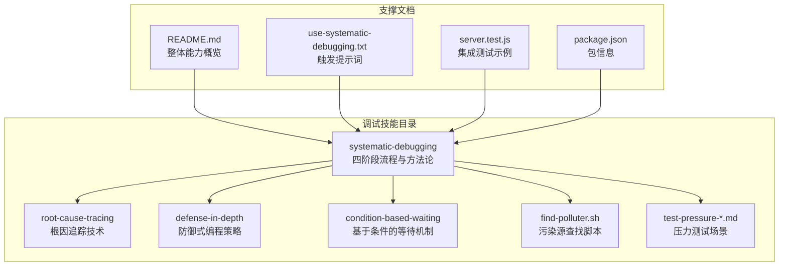
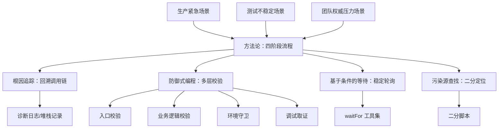
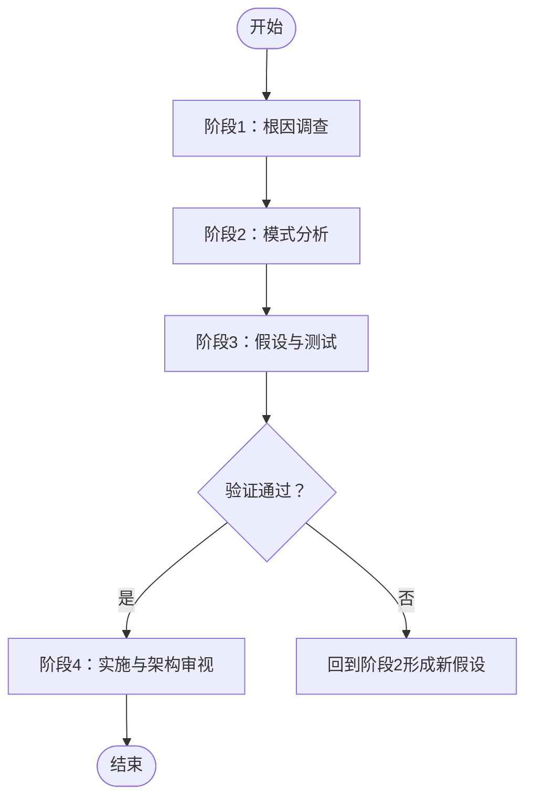
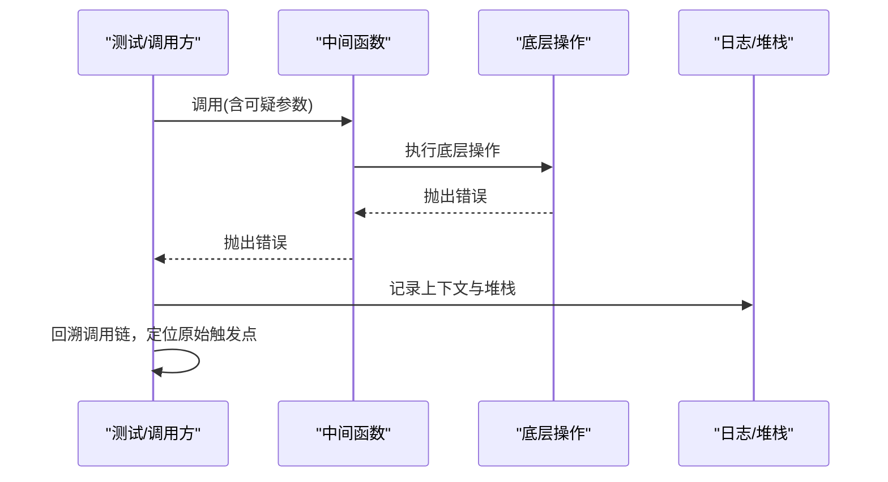
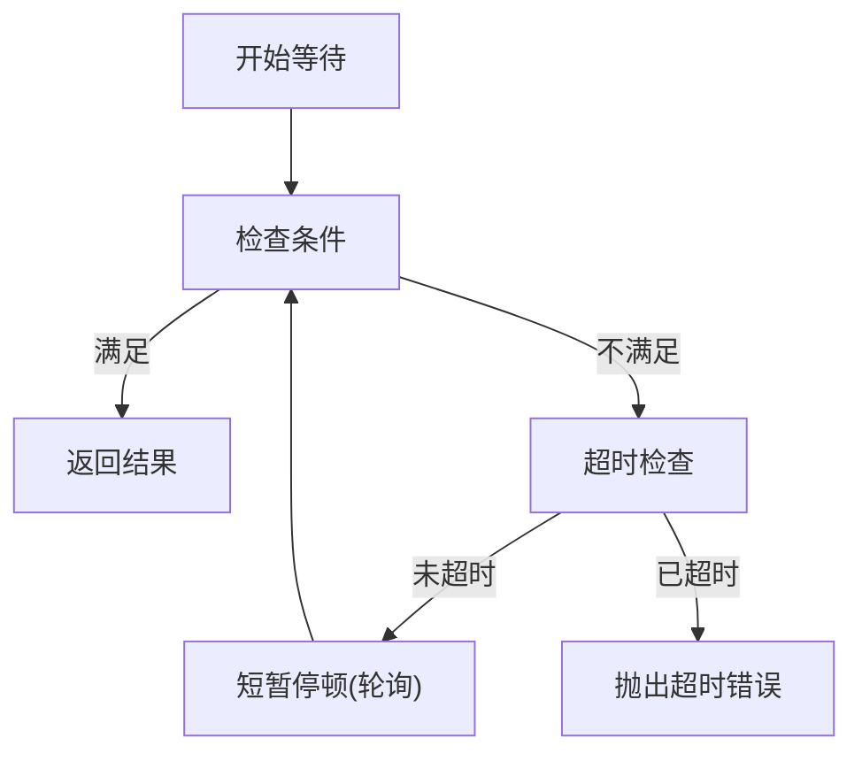
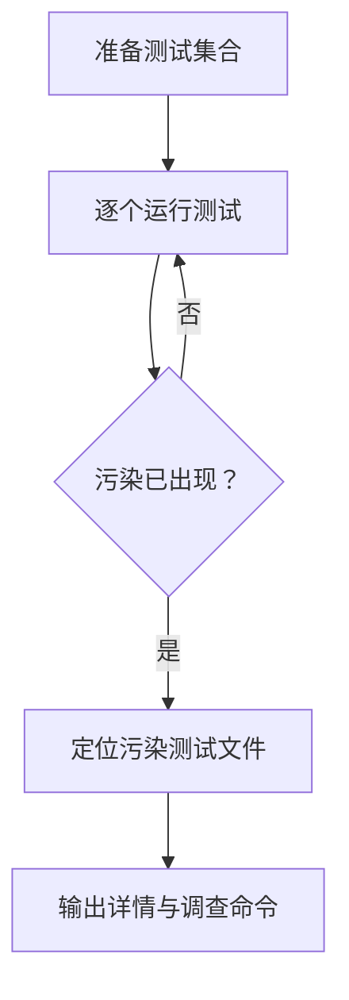
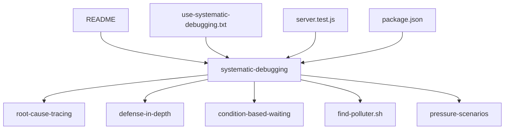

# 系统化调试

<cite>
**本文引用的文件**
- [skills/systematic-debugging/SKILL.md](file://skills/systematic-debugging/SKILL.md)
- [skills/systematic-debugging/root-cause-tracing.md](file://skills/systematic-debugging/root-cause-tracing.md)
- [skills/systematic-debugging/defense-in-depth.md](file://skills/systematic-debugging/defense-in-depth.md)
- [skills/systematic-debugging/condition-based-waiting.md](file://skills/systematic-debugging/condition-based-waiting.md)
- [skills/systematic-debugging/condition-based-waiting-example.ts](file://skills/systematic-debugging/condition-based-waiting-example.ts)
- [skills/systematic-debugging/find-polluter.sh](file://skills/systematic-debugging/find-polluter.sh)
- [skills/systematic-debugging/test-pressure-1.md](file://skills/systematic-debugging/test-pressure-1.md)
- [skills/systematic-debugging/test-pressure-2.md](file://skills/systematic-debugging/test-pressure-2.md)
- [skills/systematic-debugging/test-pressure-3.md](file://skills/systematic-debugging/test-pressure-3.md)
- [README.md](file://README.md)
- [tests/explicit-skill-requests/prompts/use-systematic-debugging.txt](file://tests/explicit-skill-requests/prompts/use-systematic-debugging.txt)
- [tests/brainstorm-server/server.test.js](file://tests/brainstorm-server/server.test.js)
- [package.json](file://package.json)
</cite>

## 目录
1. [简介](#简介)
2. [项目结构](#项目结构)
3. [核心组件](#核心组件)
4. [架构总览](#架构总览)
5. [详细组件分析](#详细组件分析)
6. [依赖分析](#依赖分析)
7. [性能考虑](#性能考虑)
8. [故障排查指南](#故障排查指南)
9. [结论](#结论)
10. [附录](#附录)

## 简介
本文件系统化梳理“系统化调试”技能，围绕四阶段调试流程（问题识别、假设形成、实验验证、根因追踪与解决方案实施）展开，结合根因追踪技术、防御式编程策略、基于条件的等待机制等核心技术，提供压力测试场景下的决策框架与实战工具链。目标是帮助你在复杂系统中稳定、可重复地定位问题根源，并建立多层次的错误防护机制。

## 项目结构
该仓库以“技能”为中心组织能力模块，系统化调试作为独立技能，配套文档、脚本与示例，贯穿从问题发现到修复闭环的全过程。

图表来源
- [skills/systematic-debugging/SKILL.md](file://skills/systematic-debugging/SKILL.md)
- [README.md](file://README.md)
- [tests/explicit-skill-requests/prompts/use-systematic-debugging.txt](file://tests/explicit-skill-requests/prompts/use-systematic-debugging.txt)
- [tests/brainstorm-server/server.test.js](file://tests/brainstorm-server/server.test.js)
- [package.json](file://package.json)

章节来源
- [README.md](file://README.md)
- [package.json](file://package.json)

## 核心组件
- 四阶段调试流程：强调“先溯源、后修复”，通过证据收集、模式对比、最小化验证与架构审视，避免症状性修复。
- 根因追踪：从调用栈末端回溯至原始触发点，必要时添加诊断日志与堆栈记录。
- 防御式编程：在多层边界进行校验与保护，使缺陷结构上不可重现。
- 基于条件的等待：替代任意超时，按真实条件轮询，提升稳定性与可维护性。
- 污染源查找：对测试环境中的异常状态进行二分定位，快速锁定引发副作用的测试文件。
- 压力测试场景：在紧急、疲劳、权威压力下，坚持系统化流程，做出可解释、可复现的决策。

章节来源
- [skills/systematic-debugging/SKILL.md](file://skills/systematic-debugging/SKILL.md)
- [skills/systematic-debugging/root-cause-tracing.md](file://skills/systematic-debugging/root-cause-tracing.md)
- [skills/systematic-debugging/defense-in-depth.md](file://skills/systematic-debugging/defense-in-depth.md)
- [skills/systematic-debugging/condition-based-waiting.md](file://skills/systematic-debugging/condition-based-waiting.md)
- [skills/systematic-debugging/find-polluter.sh](file://skills/systematic-debugging/find-polluter.sh)
- [skills/systematic-debugging/test-pressure-1.md](file://skills/systematic-debugging/test-pressure-1.md)
- [skills/systematic-debugging/test-pressure-2.md](file://skills/systematic-debugging/test-pressure-2.md)
- [skills/systematic-debugging/test-pressure-3.md](file://skills/systematic-debugging/test-pressure-3.md)

## 架构总览
系统化调试的“方法论-工具-场景”三层架构：

图表来源
- [skills/systematic-debugging/SKILL.md](file://skills/systematic-debugging/SKILL.md)
- [skills/systematic-debugging/root-cause-tracing.md](file://skills/systematic-debugging/root-cause-tracing.md)
- [skills/systematic-debugging/defense-in-depth.md](file://skills/systematic-debugging/defense-in-depth.md)
- [skills/systematic-debugging/condition-based-waiting.md](file://skills/systematic-debugging/condition-based-waiting.md)
- [skills/systematic-debugging/find-polluter.sh](file://skills/systematic-debugging/find-polluter.sh)

## 详细组件分析

### 组件一：四阶段调试流程
- 阶段1：根因调查
  - 仔细阅读错误与堆栈，记录关键上下文
  - 可重复性验证与最近变更审查
  - 多组件系统中，在各边界采集输入/输出证据，定位失败层
  - 对深层调用栈采用根因追踪，找到原始触发点
- 阶段2：模式分析
  - 寻找相似工作实现，完整对照参考
  - 列举差异点，不放过微小差异
  - 明确依赖关系与前置条件
- 阶段3：假设与测试
  - 单一明确假设，最小化改动验证
  - 未通过则形成新假设，不叠加多个修复
  - 不懂即问，及时求助与补充研究
- 阶段4：实施与架构审视
  - 先写可复现实验（可自动化）
  - 一次性修复根因，验证通过且不破坏其他测试
  - 若连续多次修复均无法根治，停止修复，审视架构设计

图表来源
- [skills/systematic-debugging/SKILL.md](file://skills/systematic-debugging/SKILL.md)

章节来源
- [skills/systematic-debugging/SKILL.md](file://skills/systematic-debugging/SKILL.md)

### 组件二：根因追踪（Backward Tracing）
- 适用场景：错误出现在深层调用栈、难以直接定位源头
- 关键步骤：
  - 观察症状与错误信息
  - 定位直接调用点，向上追溯调用链
  - 追溯参数来源，确认初始值是否异常
  - 找到最原始触发点，修复而非仅处理症状
  - 必要时添加诊断日志与堆栈记录，捕获上下文
- 实战要点：在测试中使用标准输出打印调试信息；记录目录、cwd、环境变量与堆栈；通过二分脚本定位污染测试

图表来源
- [skills/systematic-debugging/root-cause-tracing.md](file://skills/systematic-debugging/root-cause-tracing.md)

章节来源
- [skills/systematic-debugging/root-cause-tracing.md](file://skills/systematic-debugging/root-cause-tracing.md)
- [skills/systematic-debugging/find-polluter.sh](file://skills/systematic-debugging/find-polluter.sh)

### 组件三：防御式编程（Defense-in-Depth）
- 核心思想：在数据流经的每一层都进行校验，使缺陷结构上不可重现
- 四层策略：
  - 入口校验：拒绝明显非法输入
  - 业务逻辑校验：确保数据对当前操作有效
  - 环境守卫：在特定上下文中阻止危险操作
  - 调试取证：记录上下文便于事后分析
- 实践建议：逐层测试绕过情况，确保每层都能捕获问题

图表来源
- [skills/systematic-debugging/defense-in-depth.md](file://skills/systematic-debugging/defense-in-depth.md)

章节来源
- [skills/systematic-debugging/defense-in-depth.md](file://skills/systematic-debugging/defense-in-depth.md)

### 组件四：基于条件的等待（Condition-Based Waiting）
- 问题背景：随机超时导致竞态与不稳定，尤其在并行或负载环境下
- 解决方案：等待真实条件满足，而非猜测耗时
- 通用模式：
  - 等待事件出现
  - 等待状态变化
  - 等待计数达标
  - 等待文件存在
  - 复合条件判断
- 实现要点：固定轮询间隔、设置超时、在循环内读取最新状态、必要时保留文档说明

图表来源
- [skills/systematic-debugging/condition-based-waiting.md](file://skills/systematic-debugging/condition-based-waiting.md)
- [skills/systematic-debugging/condition-based-waiting-example.ts](file://skills/systematic-debugging/condition-based-waiting-example.ts)

章节来源
- [skills/systematic-debugging/condition-based-waiting.md](file://skills/systematic-debugging/condition-based-waiting.md)
- [skills/systematic-debugging/condition-based-waiting-example.ts](file://skills/systematic-debugging/condition-based-waiting-example.ts)

### 组件五：污染源查找脚本（Bisection Finder）
- 适用场景：测试运行后产生意外文件/状态，但不确定具体由哪个测试引起
- 工作原理：对测试文件列表进行二分搜索，逐一运行并检测污染是否出现
- 使用方式：指定被污染对象与测试匹配模式，自动定位首个污染者并给出调查指引

图表来源
- [skills/systematic-debugging/find-polluter.sh](file://skills/systematic-debugging/find-polluter.sh)

章节来源
- [skills/systematic-debugging/find-polluter.sh](file://skills/systematic-debugging/find-polluter.sh)

### 组件六：压力测试场景（1-3级）
- 场景1：紧急生产修复
  - 面临高损失与高压，需在系统化调查与快速止损之间权衡
  - 建议：在可接受范围内做最小化验证后再部署，同时记录后续根因调查计划
- 场景2：疲劳与沉没成本
  - 长时间无效尝试后，容易陷入“够用就好”的妥协
  - 建议：删除无效超时代码，回到阶段1重新溯源；若仍无头绪，采用“快速调查+临时方案”的折中
- 场景3：权威与社交压力
  - 高经验者提出方案，团队希望快速推进
  - 建议：坚持“先理解再修复”，至少完成参考实现的完整阅读与对比，再决定是否采纳

章节来源
- [skills/systematic-debugging/test-pressure-1.md](file://skills/systematic-debugging/test-pressure-1.md)
- [skills/systematic-debugging/test-pressure-2.md](file://skills/systematic-debugging/test-pressure-2.md)
- [skills/systematic-debugging/test-pressure-3.md](file://skills/systematic-debugging/test-pressure-3.md)

## 依赖分析
- 方法论依赖工具：根因追踪依赖诊断日志与堆栈；防御式编程依赖多层校验；条件等待依赖轮询与超时控制；污染源查找依赖测试集合与二分策略。
- 文档与测试协同：README概述能力，触发提示词引导使用，集成测试展示系统行为，共同构成“可验证”的调试闭环。

图表来源
- [README.md](file://README.md)
- [tests/explicit-skill-requests/prompts/use-systematic-debugging.txt](file://tests/explicit-skill-requests/prompts/use-systematic-debugging.txt)
- [tests/brainstorm-server/server.test.js](file://tests/brainstorm-server/server.test.js)
- [package.json](file://package.json)

章节来源
- [README.md](file://README.md)
- [tests/explicit-skill-requests/prompts/use-systematic-debugging.txt](file://tests/explicit-skill-requests/prompts/use-systematic-debugging.txt)
- [tests/brainstorm-server/server.test.js](file://tests/brainstorm-server/server.test.js)
- [package.json](file://package.json)

## 性能考虑
- 条件等待的轮询频率应适中，避免过度占用CPU；超时必须明确，防止无限等待。
- 防御式编程的校验应尽量轻量，避免在热路径引入昂贵开销。
- 在紧急场景下，最小化验证与快速止损的权衡应有明确记录与回退预案，避免长期技术债。

## 故障排查指南
- 常见误区
  - “症状修复”而非根因修复
  - 多处同时修改，无法定位有效解
  - 任意超时掩盖竞态条件
  - 忽视环境差异与最近变更
- 排查清单
  - 是否完整阅读错误与堆栈？
  - 是否能稳定复现？复现步骤是否一致？
  - 最近变更与依赖是否影响当前行为？
  - 是否在组件边界采集了输入/输出证据？
  - 是否通过根因追踪找到原始触发点？
  - 是否在多层边界增加校验与守卫？
  - 是否用条件等待替代任意超时？
  - 是否使用二分脚本定位污染测试？

章节来源
- [skills/systematic-debugging/SKILL.md](file://skills/systematic-debugging/SKILL.md)
- [skills/systematic-debugging/root-cause-tracing.md](file://skills/systematic-debugging/root-cause-tracing.md)
- [skills/systematic-debugging/condition-based-waiting.md](file://skills/systematic-debugging/condition-based-waiting.md)
- [skills/systematic-debugging/find-polluter.sh](file://skills/systematic-debugging/find-polluter.sh)

## 结论
系统化调试不是额外流程，而是稳定交付的保障。通过四阶段流程、根因追踪、防御式编程与条件等待，可以在复杂系统中可靠地定位并解决问题；配合污染源查找与压力测试场景下的决策框架，既能应对紧急状况，又能避免长期技术债。坚持“先溯源、后修复”，才能获得更高的首次修复率与更低的回归风险。

## 附录
- 实际调试案例与工具使用建议
  - 根因追踪：在测试中使用标准输出记录上下文与堆栈，结合二分脚本定位污染测试。
  - 防御式编程：在入口、业务逻辑、环境守卫与调试取证四层分别增加校验，逐层验证绕过情况。
  - 条件等待：优先使用基于条件的轮询，避免任意超时；为每个等待场景提供清晰描述与超时上限。
  - 压力测试：在紧急、疲劳与权威压力下，坚持最小化验证与可解释决策，必要时记录后续根因调查计划。

章节来源
- [skills/systematic-debugging/root-cause-tracing.md](file://skills/systematic-debugging/root-cause-tracing.md)
- [skills/systematic-debugging/defense-in-depth.md](file://skills/systematic-debugging/defense-in-depth.md)
- [skills/systematic-debugging/condition-based-waiting.md](file://skills/systematic-debugging/condition-based-waiting.md)
- [skills/systematic-debugging/find-polluter.sh](file://skills/systematic-debugging/find-polluter.sh)
- [skills/systematic-debugging/test-pressure-1.md](file://skills/systematic-debugging/test-pressure-1.md)
- [skills/systematic-debugging/test-pressure-2.md](file://skills/systematic-debugging/test-pressure-2.md)
- [skills/systematic-debugging/test-pressure-3.md](file://skills/systematic-debugging/test-pressure-3.md)