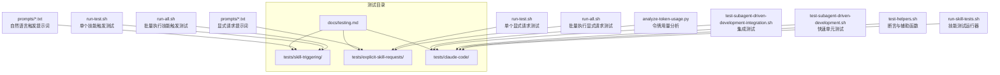
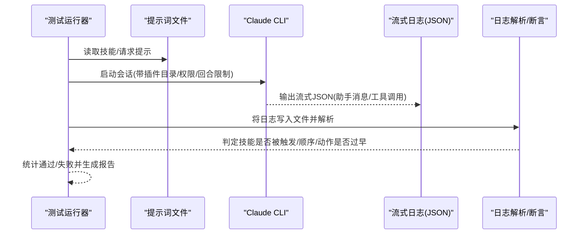
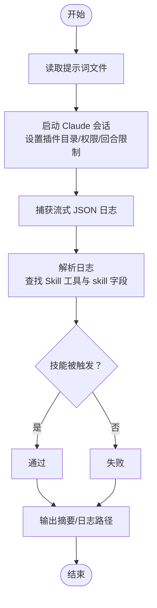
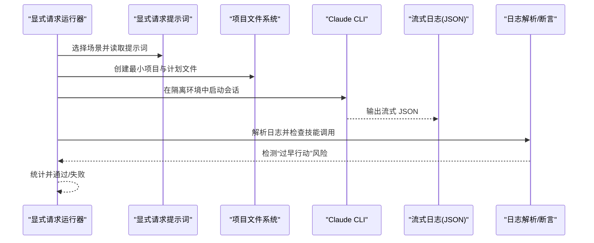
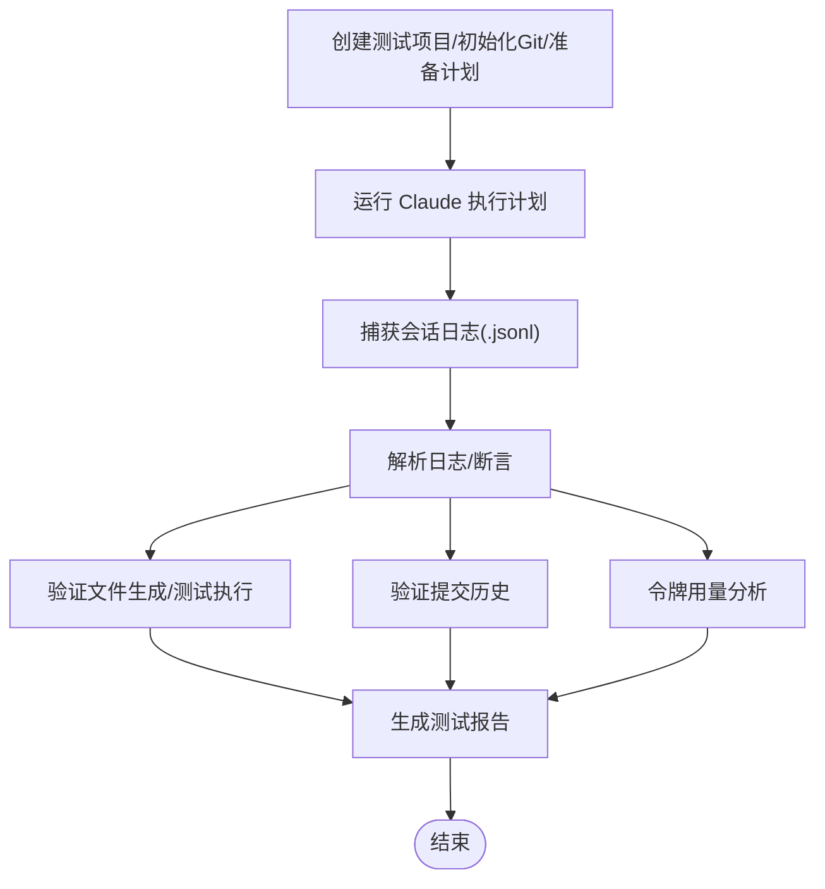
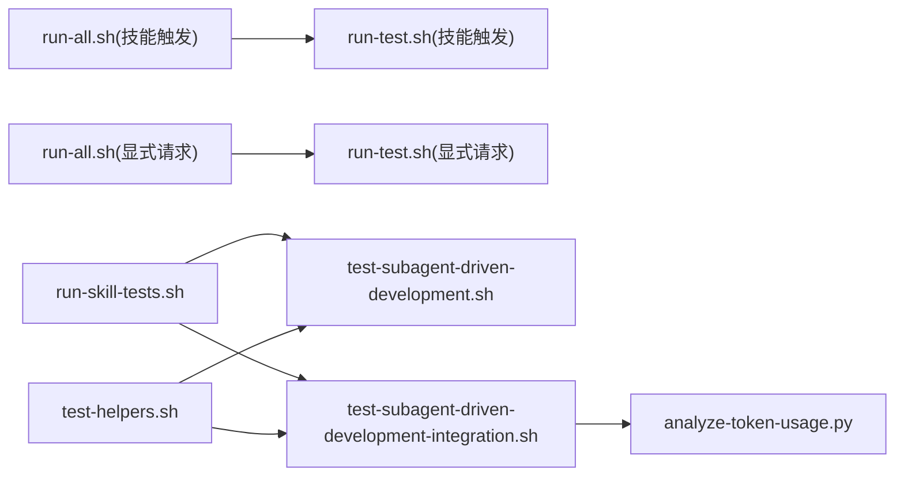

# 单元测试

<cite>
**本文引用的文件**
- [tests/skill-triggering/run-all.sh](file://tests/skill-triggering/run-all.sh)
- [tests/skill-triggering/run-test.sh](file://tests/skill-triggering/run-test.sh)
- [tests/skill-triggering/prompts/systematic-debugging.txt](file://tests/skill-triggering/prompts/systematic-debugging.txt)
- [tests/skill-triggering/prompts/writing-plans.txt](file://tests/skill-triggering/prompts/writing-plans.txt)
- [tests/explicit-skill-requests/run-all.sh](file://tests/explicit-skill-requests/run-all.sh)
- [tests/explicit-skill-requests/run-test.sh](file://tests/explicit-skill-requests/run-test.sh)
- [tests/explicit-skill-requests/prompts/subagent-driven-development-please.txt](file://tests/explicit-skill-requests/prompts/subagent-driven-development-please.txt)
- [tests/explicit-skill-requests/prompts/please-use-brainstorming.txt](file://tests/explicit-skill-requests/prompts/please-use-brainstorming.txt)
- [tests/claude-code/run-skill-tests.sh](file://tests/claude-code/run-skill-tests.sh)
- [tests/claude-code/test-helpers.sh](file://tests/claude-code/test-helpers.sh)
- [tests/claude-code/test-subagent-driven-development.sh](file://tests/claude-code/test-subagent-driven-development.sh)
- [tests/claude-code/test-subagent-driven-development-integration.sh](file://tests/claude-code/test-subagent-driven-development-integration.sh)
- [tests/claude-code/analyze-token-usage.py](file://tests/claude-code/analyze-token-usage.py)
- [docs/testing.md](file://docs/testing.md)
</cite>

## 目录
1. [简介](#简介)
2. [项目结构](#项目结构)
3. [核心组件](#核心组件)
4. [架构总览](#架构总览)
5. [详细组件分析](#详细组件分析)
6. [依赖关系分析](#依赖关系分析)
7. [性能考量](#性能考量)
8. [故障排查指南](#故障排查指南)
9. [结论](#结论)
10. [附录](#附录)

## 简介
本文件面向 Superpowers 的单元与集成测试体系，系统化阐述技能触发与显式技能请求两类测试的设计理念、实现方法与最佳实践。重点覆盖以下方面：
- 技能触发测试：验证自然语言提示是否能正确触发目标技能（无需用户明确命名技能）。
- 显式技能请求测试：验证用户直接命名技能时，Claude 是否按预期调用该技能并避免“过早行动”等错误模式。
- 提示词测试：通过解析会话日志与工具调用记录，验证技能调用、子代理分发、任务跟踪、文件生成与提交历史等行为。
- 测试自动化流程：统一的测试运行器、超时控制、输出归档与统计汇总。
- 最佳实践与常见问题：从测试设计、数据准备到结果验证的全流程建议。

## 项目结构
Superpowers 的测试目录组织清晰，围绕“技能触发”“显式技能请求”“Claude Code 集成测试”三大维度展开，辅以通用测试工具与文档说明。

图表来源
- [tests/skill-triggering/run-all.sh:1-61](file://tests/skill-triggering/run-all.sh#L1-L61)
- [tests/skill-triggering/run-test.sh:1-89](file://tests/skill-triggering/run-test.sh#L1-L89)
- [tests/explicit-skill-requests/run-all.sh:1-71](file://tests/explicit-skill-requests/run-all.sh#L1-L71)
- [tests/explicit-skill-requests/run-test.sh:1-137](file://tests/explicit-skill-requests/run-test.sh#L1-L137)
- [tests/claude-code/run-skill-tests.sh:1-188](file://tests/claude-code/run-skill-tests.sh#L1-L188)
- [tests/claude-code/test-helpers.sh:1-203](file://tests/claude-code/test-helpers.sh#L1-L203)
- [tests/claude-code/test-subagent-driven-development.sh:1-166](file://tests/claude-code/test-subagent-driven-development.sh#L1-L166)
- [tests/claude-code/test-subagent-driven-development-integration.sh:1-315](file://tests/claude-code/test-subagent-driven-development-integration.sh#L1-L315)
- [tests/claude-code/analyze-token-usage.py:1-169](file://tests/claude-code/analyze-token-usage.py#L1-L169)
- [docs/testing.md:1-304](file://docs/testing.md#L1-L304)

章节来源
- [tests/skill-triggering/run-all.sh:1-61](file://tests/skill-triggering/run-all.sh#L1-L61)
- [tests/explicit-skill-requests/run-all.sh:1-71](file://tests/explicit-skill-requests/run-all.sh#L1-L71)
- [tests/claude-code/run-skill-tests.sh:1-188](file://tests/claude-code/run-skill-tests.sh#L1-L188)
- [docs/testing.md:1-304](file://docs/testing.md#L1-L304)

## 核心组件
- 技能触发测试运行器：遍历预定义技能列表，逐个执行触发测试，收集通过/失败统计。
- 显式技能请求测试运行器：按顺序执行多个显式请求场景，检测技能调用与“过早行动”风险。
- Claude Code 测试运行器：统一调度快速与集成测试，支持超时、过滤与摘要输出。
- 通用测试工具：提供断言函数（包含/不包含/计数/顺序）、临时项目创建与清理、计划文件生成等。
- 令牌用量分析：解析会话日志，按主会话与子代理维度统计输入/输出/缓存读取令牌与成本估算。

章节来源
- [tests/skill-triggering/run-all.sh:10-17](file://tests/skill-triggering/run-all.sh#L10-L17)
- [tests/explicit-skill-requests/run-all.sh:17-60](file://tests/explicit-skill-requests/run-all.sh#L17-L60)
- [tests/claude-code/run-skill-tests.sh:74-87](file://tests/claude-code/run-skill-tests.sh#L74-L87)
- [tests/claude-code/test-helpers.sh:6-29](file://tests/claude-code/test-helpers.sh#L6-L29)
- [tests/claude-code/analyze-token-usage.py:12-70](file://tests/claude-code/analyze-token-usage.py#L12-L70)

## 架构总览
下图展示两类测试的端到端流程：从提示词到 Claude 执行，再到日志解析与结果判定。

图表来源
- [tests/skill-triggering/run-test.sh:48-83](file://tests/skill-triggering/run-test.sh#L48-L83)
- [tests/explicit-skill-requests/run-test.sh:71-130](file://tests/explicit-skill-requests/run-test.sh#L71-L130)
- [tests/claude-code/test-subagent-driven-development-integration.sh:150-157](file://tests/claude-code/test-subagent-driven-development-integration.sh#L150-L157)

## 详细组件分析

### 技能触发测试（Skill Triggering）
设计理念
- 使用自然语言提示，不直接提及技能名称，验证 Claude 能否根据上下文正确识别并调用目标技能。
- 通过流式日志解析工具调用，确保匹配“Skill 工具”与具体“skill 字段”。

关键实现要点
- 运行器遍历技能清单，逐个执行测试脚本。
- 测试脚本读取提示词文件，调用 Claude 并将流式 JSON 写入日志文件。
- 解析逻辑检查是否存在“Skill 工具调用”以及“skill 字段”是否匹配目标技能（支持命名空间前缀）。
- 输出首次助手回复摘要与完整日志路径，便于人工复核。

图表来源
- [tests/skill-triggering/run-all.sh:26-47](file://tests/skill-triggering/run-all.sh#L26-L47)
- [tests/skill-triggering/run-test.sh:48-83](file://tests/skill-triggering/run-test.sh#L48-L83)

章节来源
- [tests/skill-triggering/run-all.sh:10-17](file://tests/skill-triggering/run-all.sh#L10-L17)
- [tests/skill-triggering/run-test.sh:29-83](file://tests/skill-triggering/run-test.sh#L29-L83)
- [tests/skill-triggering/prompts/systematic-debugging.txt:1-11](file://tests/skill-triggering/prompts/systematic-debugging.txt#L1-L11)
- [tests/skill-triggering/prompts/writing-plans.txt:1-10](file://tests/skill-triggering/prompts/writing-plans.txt#L1-L10)

### 显式技能请求测试（Explicit Skill Requests）
设计理念
- 用户直接命名技能，验证 Claude 是否正确调用该技能，并防止在加载技能之前就开始执行其他工具（“过早行动”）。
- 对多轮对话场景进行支持，例如在已有计划文件的情况下发起“执行计划”的请求。

关键实现要点
- 运行器按固定顺序执行多个显式请求场景，每个场景对应一个提示词文件。
- 测试脚本创建最小化项目目录与必要计划文件，隔离环境变量，避免用户上下文干扰。
- 解析逻辑同样检查“Skill 工具调用”与“skill 字段”，并检测在第一个 Skill 调用之前是否存在非 Skill 工具调用。
- 输出首次助手回复摘要与完整日志路径，便于人工复核。

图表来源
- [tests/explicit-skill-requests/run-all.sh:17-60](file://tests/explicit-skill-requests/run-all.sh#L17-L60)
- [tests/explicit-skill-requests/run-test.sh:44-130](file://tests/explicit-skill-requests/run-test.sh#L44-L130)

章节来源
- [tests/explicit-skill-requests/run-all.sh:17-60](file://tests/explicit-skill-requests/run-all.sh#L17-L60)
- [tests/explicit-skill-requests/run-test.sh:44-130](file://tests/explicit-skill-requests/run-test.sh#L44-L130)
- [tests/explicit-skill-requests/prompts/subagent-driven-development-please.txt:1-2](file://tests/explicit-skill-requests/prompts/subagent-driven-development-please.txt#L1-L2)
- [tests/explicit-skill-requests/prompts/please-use-brainstorming.txt:1-2](file://tests/explicit-skill-requests/prompts/please-use-brainstorming.txt#L1-L2)

### Claude Code 集成测试（Subagent-Driven Development）
设计理念
- 通过真实会话执行完整工作流，验证技能在复杂场景下的行为一致性：计划一次性加载、任务文本直接提供、自审、审查顺序、审查循环、独立验证与 Git 提交历史。
- 使用会话日志解析与文件系统验证相结合的方式，确保输出可验证且可重复。

关键实现要点
- 快速单元测试：通过问答方式验证技能描述、工作流顺序、自审要求、计划读取策略、审查者态度、审查循环、任务上下文提供方式、前置技能与主分支风险提示。
- 集成测试：创建最小 Node.js 项目，初始化 Git，编写实现计划，使用 Claude 执行计划，解析会话日志并验证技能调用、子代理分发、任务跟踪、文件生成与测试执行、Git 提交历史、规格符合性等。
- 令牌用量分析：解析会话日志，按主会话与子代理维度统计令牌与成本，帮助评估工作负载与成本控制。

图表来源
- [tests/claude-code/test-subagent-driven-development-integration.sh:24-112](file://tests/claude-code/test-subagent-driven-development-integration.sh#L24-L112)
- [tests/claude-code/test-subagent-driven-development-integration.sh:187-314](file://tests/claude-code/test-subagent-driven-development-integration.sh#L187-L314)
- [tests/claude-code/analyze-token-usage.py:12-70](file://tests/claude-code/analyze-token-usage.py#L12-L70)

章节来源
- [tests/claude-code/test-helpers.sh:6-29](file://tests/claude-code/test-helpers.sh#L6-L29)
- [tests/claude-code/test-subagent-driven-development.sh:12-165](file://tests/claude-code/test-subagent-driven-development.sh#L12-L165)
- [tests/claude-code/test-subagent-driven-development-integration.sh:187-314](file://tests/claude-code/test-subagent-driven-development-integration.sh#L187-L314)
- [tests/claude-code/analyze-token-usage.py:83-169](file://tests/claude-code/analyze-token-usage.py#L83-L169)
- [docs/testing.md:40-135](file://docs/testing.md#L40-L135)

## 依赖关系分析
- 测试运行器依赖于 Bash 脚本与 Claude CLI；显式请求测试还依赖隔离环境与最小项目结构。
- 日志解析依赖流式 JSON 结构中的“工具调用”字段与“技能字段”；集成测试依赖会话日志中的“agentId”“usage”等字段。
- 断言工具提供统一的匹配与顺序判断能力，减少重复逻辑。
- 令牌分析脚本独立于主测试逻辑，但与集成测试强关联。

图表来源
- [tests/skill-triggering/run-all.sh:26-47](file://tests/skill-triggering/run-all.sh#L26-L47)
- [tests/explicit-skill-requests/run-all.sh:17-60](file://tests/explicit-skill-requests/run-all.sh#L17-L60)
- [tests/claude-code/run-skill-tests.sh:100-163](file://tests/claude-code/run-skill-tests.sh#L100-L163)
- [tests/claude-code/test-helpers.sh:194-202](file://tests/claude-code/test-helpers.sh#L194-L202)
- [tests/claude-code/analyze-token-usage.py:1-169](file://tests/claude-code/analyze-token-usage.py#L1-L169)

章节来源
- [tests/skill-triggering/run-all.sh:1-61](file://tests/skill-triggering/run-all.sh#L1-L61)
- [tests/explicit-skill-requests/run-all.sh:1-71](file://tests/explicit-skill-requests/run-all.sh#L1-L71)
- [tests/claude-code/run-skill-tests.sh:1-188](file://tests/claude-code/run-skill-tests.sh#L1-L188)
- [tests/claude-code/test-helpers.sh:1-203](file://tests/claude-code/test-helpers.sh#L1-L203)
- [tests/claude-code/analyze-token-usage.py:1-169](file://tests/claude-code/analyze-token-usage.py#L1-L169)

## 性能考量
- 超时控制：所有测试均设置超时，避免长时间阻塞；集成测试使用更长超时时间。
- 令牌用量：通过分析脚本统计输入/输出/缓存读取令牌与成本，帮助优化提示词长度与工具调用频率。
- 日志解析效率：仅解析必要字段，避免全量扫描；对大型日志采用流式处理思路。
- 文件系统操作：最小化临时文件与目录，测试结束后及时清理。

## 故障排查指南
常见问题与解决建议
- 技能未加载或未找到
  - 确保从插件根目录运行测试，启用本地开发市场配置。
  - 检查技能文件是否存在且命名正确。
- 权限错误
  - 使用“绕过权限”模式与添加目录参数，授予 Claude 访问测试目录的权限。
- 测试超时
  - 增加超时时间；检查是否存在无限循环或子代理任务复杂度过高。
- 会话文件缺失
  - 按工作目录编码路径在用户目录中查找最近的会话文件；确认测试确实执行成功。
- “过早行动”风险
  - 检查在第一个 Skill 工具调用之前是否存在非 Skill 工具调用；调整提示词引导 Claude 先加载技能再执行任务。

章节来源
- [docs/testing.md:178-215](file://docs/testing.md#L178-L215)
- [tests/explicit-skill-requests/run-test.sh:104-121](file://tests/explicit-skill-requests/run-test.sh#L104-L121)

## 结论
Superpowers 的测试体系通过“自然语言触发 + 显式请求 + 集成验证 + 令牌分析”的组合，全面覆盖了技能行为的正确性、稳定性与成本可控性。借助统一的运行器与断言工具，测试具备良好的可维护性与扩展性。建议在新增技能时同步补充触发与请求测试，并在集成测试中加入令牌用量监控，持续优化工作流效率与成本表现。

## 附录

### 测试用例编写方法与最佳实践
- 触发测试
  - 准备自然语言提示词，聚焦于上下文线索而非技能名称。
  - 使用流式日志解析“Skill 工具调用”与“skill 字段”，确保匹配目标技能。
  - 输出首次助手回复摘要与完整日志路径，便于复核。
- 显式请求测试
  - 为多轮场景准备最小化项目与计划文件，隔离用户上下文。
  - 关注“过早行动”检测，确保 Claude 先加载技能再执行任务。
- 集成测试
  - 使用会话日志解析与文件系统验证双保险，覆盖技能调用、子代理分发、任务跟踪、文件生成、测试执行与 Git 提交历史。
  - 定期运行令牌用量分析，评估成本与优化空间。

章节来源
- [tests/skill-triggering/run-test.sh:58-83](file://tests/skill-triggering/run-test.sh#L58-L83)
- [tests/explicit-skill-requests/run-test.sh:81-121](file://tests/explicit-skill-requests/run-test.sh#L81-L121)
- [tests/claude-code/test-subagent-driven-development-integration.sh:187-314](file://tests/claude-code/test-subagent-driven-development-integration.sh#L187-L314)
- [docs/testing.md:216-264](file://docs/testing.md#L216-L264)