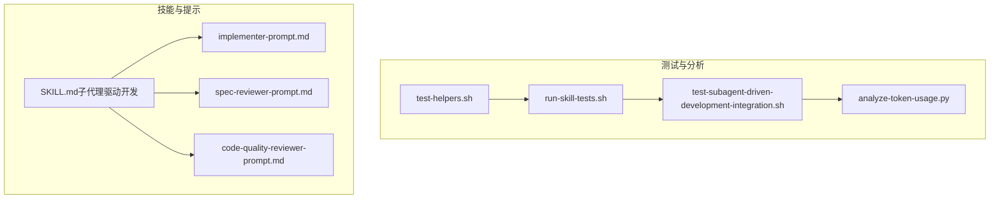
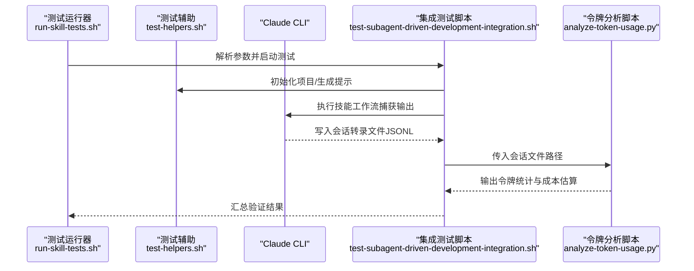
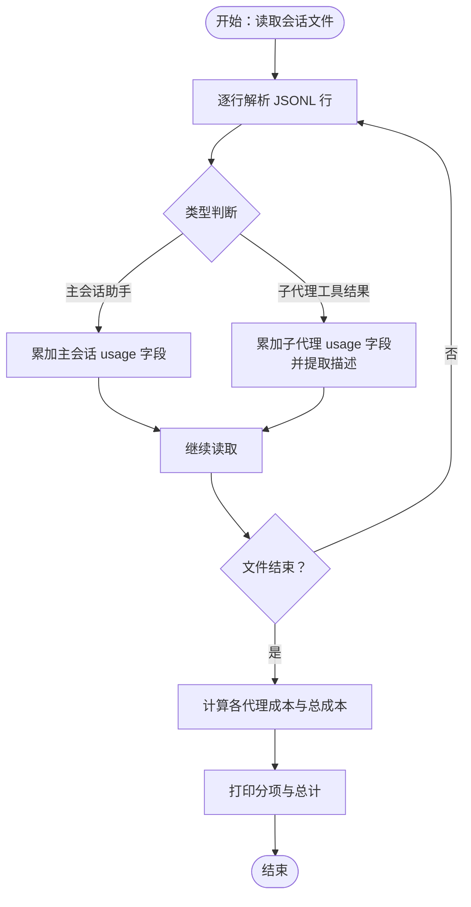
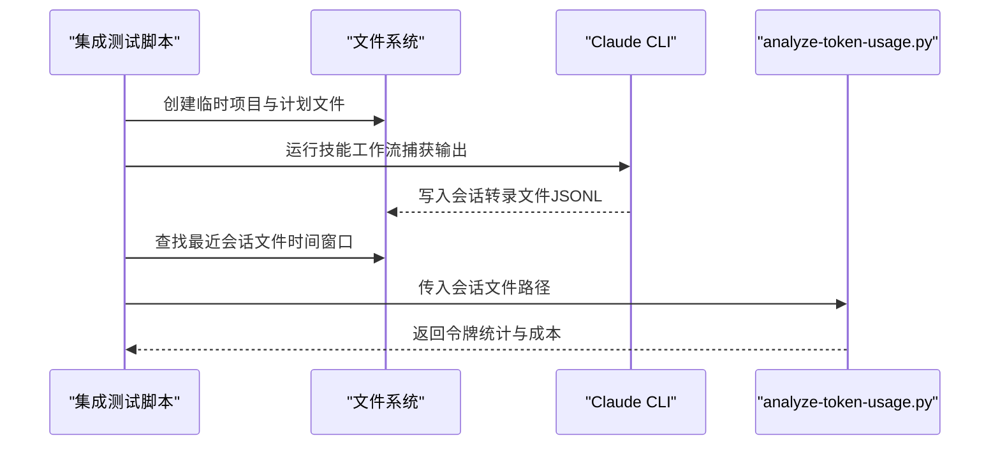
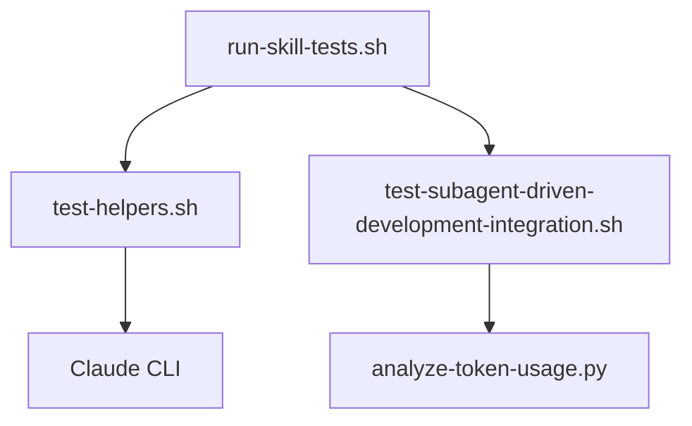
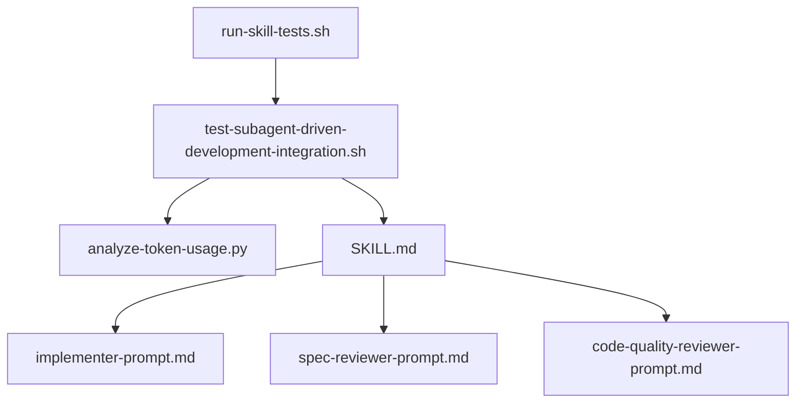

# 性能分析

<cite>
**本文引用的文件**
- [analyze-token-usage.py](file://tests/claude-code/analyze-token-usage.py)
- [README.md（Claude Code 技能测试）](file://tests/claude-code/README.md)
- [run-skill-tests.sh](file://tests/claude-code/run-skill-tests.sh)
- [test-helpers.sh](file://tests/claude-code/test-helpers.sh)
- [test-subagent-driven-development-integration.sh](file://tests/claude-code/test-subagent-driven-development-integration.sh)
- [SKILL.md（子代理驱动开发）](file://skills/subagent-driven-development/SKILL.md)
- [implementer-prompt.md](file://skills/subagent-driven-development/implementer-prompt.md)
- [spec-reviewer-prompt.md](file://skills/subagent-driven-development/spec-reviewer-prompt.md)
- [code-quality-reviewer-prompt.md](file://skills/subagent-driven-development/code-quality-reviewer-prompt.md)
</cite>

## 目录
1. [简介](#简介)
2. [项目结构](#项目结构)
3. [核心组件](#核心组件)
4. [架构总览](#架构总览)
5. [详细组件分析](#详细组件分析)
6. [依赖关系分析](#依赖关系分析)
7. [性能考量](#性能考量)
8. [故障排查指南](#故障排查指南)
9. [结论](#结论)
10. [附录](#附录)

## 简介
本文件面向 Superpowers 的性能分析工具，聚焦“令牌使用分析”能力，帮助用户理解并正确使用该工具对 Claude Code 会话进行令牌消耗与成本估算分析。内容涵盖：
- 会话转录文件的解析方法与数据来源
- 令牌使用统计的含义与成本计算公式
- 基于仓库中集成测试脚本的使用流程
- 性能优化与成本控制最佳实践

## 项目结构
与性能分析直接相关的核心文件位于 tests/claude-code 目录，围绕“令牌使用分析脚本 + 测试运行器 + 辅助函数”的组合展开；同时，技能文档与提示模板为理解会话结构与子代理行为提供上下文。

图表来源
- [analyze-token-usage.py](file://tests/claude-code/analyze-token-usage.py)
- [run-skill-tests.sh](file://tests/claude-code/run-skill-tests.sh)
- [test-helpers.sh](file://tests/claude-code/test-helpers.sh)
- [test-subagent-driven-development-integration.sh](file://tests/claude-code/test-subagent-driven-development-integration.sh)
- [SKILL.md（子代理驱动开发）](file://skills/subagent-driven-development/SKILL.md)
- [implementer-prompt.md](file://skills/subagent-driven-development/implementer-prompt.md)
- [spec-reviewer-prompt.md](file://skills/subagent-driven-development/spec-reviewer-prompt.md)
- [code-quality-reviewer-prompt.md](file://skills/subagent-driven-development/code-quality-reviewer-prompt.md)

章节来源
- [README.md（Claude Code 技能测试）](file://tests/claude-code/README.md)
- [run-skill-tests.sh](file://tests/claude-code/run-skill-tests.sh)
- [test-helpers.sh](file://tests/claude-code/test-helpers.sh)
- [test-subagent-driven-development-integration.sh](file://tests/claude-code/test-subagent-driven-development-integration.sh)

## 核心组件
- 令牌使用分析脚本：从 Claude Code 会话转录 JSONL 文件中提取主会话与子代理的令牌用量，并输出分项统计与总成本估算。
- 集成测试脚本：执行完整工作流，捕获会话转录文件，随后调用分析脚本进行令牌统计。
- 测试辅助函数：封装 Claude CLI 调用、断言与项目初始化等通用逻辑，便于测试运行器统一调度。
- 技能与提示模板：定义子代理工作流、审查顺序与上下文传递方式，决定会话结构与令牌消耗模式。

章节来源
- [analyze-token-usage.py](file://tests/claude-code/analyze-token-usage.py)
- [test-subagent-driven-development-integration.sh](file://tests/claude-code/test-subagent-driven-development-integration.sh)
- [test-helpers.sh](file://tests/claude-code/test-helpers.sh)
- [SKILL.md（子代理驱动开发）](file://skills/subagent-driven-development/SKILL.md)

## 架构总览
下图展示从“执行集成测试”到“分析令牌使用”的端到端流程，以及关键组件之间的交互关系。

图表来源
- [run-skill-tests.sh](file://tests/claude-code/run-skill-tests.sh)
- [test-helpers.sh](file://tests/claude-code/test-helpers.sh)
- [test-subagent-driven-development-integration.sh](file://tests/claude-code/test-subagent-driven-development-integration.sh)
- [analyze-token-usage.py](file://tests/claude-code/analyze-token-usage.py)

## 详细组件分析

### 令牌使用分析脚本（analyze-token-usage.py）
- 功能概述
  - 逐行读取 Claude Code 会话转录 JSONL 文件
  - 统计主会话助手消息的输入/输出令牌、缓存创建/读取令牌与消息数
  - 统计每个子代理工具调用的结果中的令牌用量与消息数，并尝试从提示首行提取描述
  - 计算每类代理的成本（按每百万令牌的输入/输出单价），并汇总总成本
- 数据来源与字段
  - 主会话：来自“assistant”类型消息中的 usage 字段
  - 子代理：来自“user”类型且包含“toolUseResult”的记录中的 usage 字段
- 成本计算
  - 输入成本 = （输入令牌 + 缓存创建令牌 + 缓存读取令牌）× 单价_input / 1,000,000
  - 输出成本 = 输出令牌 × 单价_output / 1,000,000
  - 总成本 = 输入成本 + 输出成本
- 输出格式
  - 分别列出主会话与各子代理的“消息数、输入、输出、缓存读取、成本”
  - 最后输出总计“消息数、输入、输出、缓存创建、缓存读取、总输入、总令牌、估算成本”

图表来源
- [analyze-token-usage.py](file://tests/claude-code/analyze-token-usage.py)

章节来源
- [analyze-token-usage.py](file://tests/claude-code/analyze-token-usage.py)

### 集成测试脚本（test-subagent-driven-development-integration.sh）
- 作用
  - 创建最小化 Node.js 项目，生成实现计划，执行子代理驱动开发工作流
  - 在执行过程中捕获 Claude CLI 输出，并在结束后查找最近的会话转录文件
  - 调用分析脚本对会话进行令牌统计与成本估算
- 关键步骤
  - 生成提示并以 headless 模式运行 Claude CLI
  - 定位会话目录与最新会话文件（基于时间窗口）
  - 调用分析脚本并打印结果
- 会话转录定位
  - 会话文件位于用户主目录下的特定子目录，按工作目录路径转义后定位
  - 使用时间窗口筛选最近生成的文件，避免误选历史会话

图表来源
- [test-subagent-driven-development-integration.sh](file://tests/claude-code/test-subagent-driven-development-integration.sh)
- [analyze-token-usage.py](file://tests/claude-code/analyze-token-usage.py)

章节来源
- [test-subagent-driven-development-integration.sh](file://tests/claude-code/test-subagent-driven-development-integration.sh)

### 测试运行器与辅助函数（run-skill-tests.sh、test-helpers.sh）
- 测试运行器
  - 支持可选参数：详细输出、指定测试、超时、集成测试开关
  - 统一调度测试脚本，统计通过/失败/跳过数量
- 测试辅助函数
  - 封装 Claude CLI 调用（支持超时、允许工具、输出重定向）
  - 提供断言工具（包含/不包含、出现次数、先后顺序）
  - 提供项目初始化与计划文件生成等通用能力

图表来源
- [run-skill-tests.sh](file://tests/claude-code/run-skill-tests.sh)
- [test-helpers.sh](file://tests/claude-code/test-helpers.sh)
- [test-subagent-driven-development-integration.sh](file://tests/claude-code/test-subagent-driven-development-integration.sh)
- [analyze-token-usage.py](file://tests/claude-code/analyze-token-usage.py)

章节来源
- [run-skill-tests.sh](file://tests/claude-code/run-skill-tests.sh)
- [test-helpers.sh](file://tests/claude-code/test-helpers.sh)

### 技能与提示模板（SKILL.md、implementer-prompt.md、spec-reviewer-prompt.md、code-quality-reviewer-prompt.md）
- 技能文档
  - 明确“子代理驱动开发”的工作流、两阶段审查顺序、模型选择策略与质量门禁
  - 为令牌分析提供背景：子代理越多、审查循环越频繁，通常导致更高的令牌消耗
- 提示模板
  - 实现者子代理：要求一次性提供完整任务文本，减少后续上下文传递与重复读取
  - 规格审查子代理：强调独立验证代码，避免“仅凭报告信任”的低效沟通
  - 质量审查子代理：在规格通过后再进行，确保“先符合规格，再追求质量”

章节来源
- [SKILL.md（子代理驱动开发）](file://skills/subagent-driven-development/SKILL.md)
- [implementer-prompt.md](file://skills/subagent-driven-development/implementer-prompt.md)
- [spec-reviewer-prompt.md](file://skills/subagent-driven-development/spec-reviewer-prompt.md)
- [code-quality-reviewer-prompt.md](file://skills/subagent-driven-development/code-quality-reviewer-prompt.md)

## 依赖关系分析
- 组件耦合
  - 集成测试脚本依赖测试运行器与分析脚本；分析脚本独立处理 JSONL 文件
  - 技能与提示模板为分析提供语义边界：明确哪些交互会产生令牌消耗（如子代理工具调用）
- 外部依赖
  - Claude CLI 版本信息由测试运行器打印，用于环境确认
  - 会话转录文件位置受操作系统与用户配置影响，需注意跨平台差异

图表来源
- [run-skill-tests.sh](file://tests/claude-code/run-skill-tests.sh)
- [test-subagent-driven-development-integration.sh](file://tests/claude-code/test-subagent-driven-development-integration.sh)
- [analyze-token-usage.py](file://tests/claude-code/analyze-token-usage.py)
- [SKILL.md（子代理驱动开发）](file://skills/subagent-driven-development/SKILL.md)
- [implementer-prompt.md](file://skills/subagent-driven-development/implementer-prompt.md)
- [spec-reviewer-prompt.md](file://skills/subagent-driven-development/spec-reviewer-prompt.md)
- [code-quality-reviewer-prompt.md](file://skills/subagent-driven-development/code-quality-reviewer-prompt.md)

章节来源
- [run-skill-tests.sh](file://tests/claude-code/run-skill-tests.sh)
- [test-subagent-driven-development-integration.sh](file://tests/claude-code/test-subagent-driven-development-integration.sh)
- [analyze-token-usage.py](file://tests/claude-code/analyze-token-usage.py)

## 性能考量
- 令牌消耗的主要驱动因素
  - 子代理数量与调用频率：每次子代理工具调用都会产生 usage 信息
  - 审查循环：规格审查与质量审查均可能触发多次迭代
  - 上下文传递：一次性提供完整任务文本可减少重复读取与上下文切换
- 成本控制策略
  - 合理选择模型：机械实现任务使用较便宜模型，设计与审查使用更强大模型
  - 减少不必要的子代理：仅在必要时创建子代理，避免并行冲突
  - 优化提示长度：在保证清晰的前提下精简提示，降低输入令牌
  - 利用缓存：合理利用缓存读取与创建，平衡成本与效果
- 性能优化建议
  - 在工作流早期进行规格审查，尽早发现偏差，减少后期返工
  - 严格遵循“先规格、后质量”的顺序，避免无效迭代
  - 对高频子代理场景，优先采用“一次性上下文传递 + 自我审查”的模式

## 故障排查指南
- 无法找到会话转录文件
  - 检查会话目录是否存在、文件是否在时间窗口内生成
  - 确认 Claude CLI 是否正常写入转录文件
- 分析脚本报错或无输出
  - 确认传入的会话文件路径有效
  - 检查 JSONL 行是否可被解析（逐行 try-except 已覆盖异常）
- 成本估算与预期不符
  - 核对单价设置（输入/输出每百万令牌单价）
  - 确认是否包含缓存创建与缓存读取令牌
- 测试运行器超时
  - 调整超时参数，或减少测试复杂度
  - 在详细模式下查看 Claude CLI 输出，定位瓶颈

章节来源
- [test-subagent-driven-development-integration.sh](file://tests/claude-code/test-subagent-driven-development-integration.sh)
- [analyze-token-usage.py](file://tests/claude-code/analyze-token-usage.py)
- [run-skill-tests.sh](file://tests/claude-code/run-skill-tests.sh)

## 结论
Superpowers 的性能分析工具通过解析 Claude Code 会话转录文件，将主会话与子代理的令牌使用情况进行拆解，并提供成本估算。结合技能与提示模板的上下文，用户可以：
- 明确令牌消耗的来源与驱动因素
- 基于成本估算制定优化与预算策略
- 在工作流层面实施性能优化与成本控制

## 附录

### 使用方法速查
- 运行集成测试以生成会话转录文件
  - 参考：[run-skill-tests.sh](file://tests/claude-code/run-skill-tests.sh)
  - 参考：[test-helpers.sh](file://tests/claude-code/test-helpers.sh)
- 执行令牌分析
  - 参考：[analyze-token-usage.py](file://tests/claude-code/analyze-token-usage.py)
- 会话转录定位
  - 参考：[test-subagent-driven-development-integration.sh](file://tests/claude-code/test-subagent-driven-development-integration.sh)

### 令牌统计与成本计算要点
- 统计维度
  - 主会话：输入令牌、输出令牌、缓存创建令牌、缓存读取令牌、消息数
  - 子代理：按 agentId 分组，统计上述指标与消息数，并尝试提取描述
- 成本公式
  - 输入成本 = （输入 + 缓存创建 + 缓存读取）× 单价_input / 1,000,000
  - 输出成本 = 输出 × 单价_output / 1,000,000
  - 总成本 = 输入成本 + 输出成本

章节来源
- [analyze-token-usage.py](file://tests/claude-code/analyze-token-usage.py)
- [test-subagent-driven-development-integration.sh](file://tests/claude-code/test-subagent-driven-development-integration.sh)