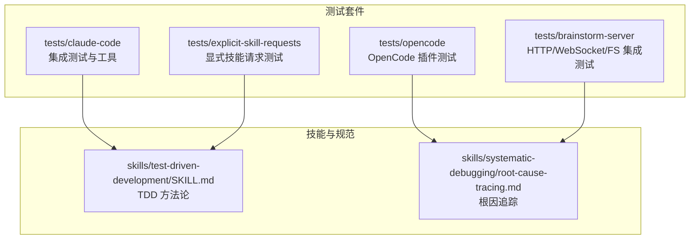
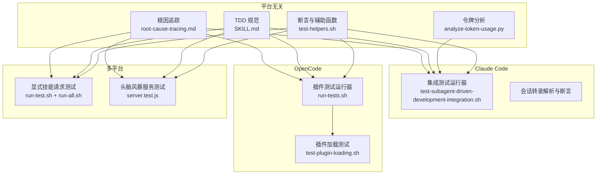
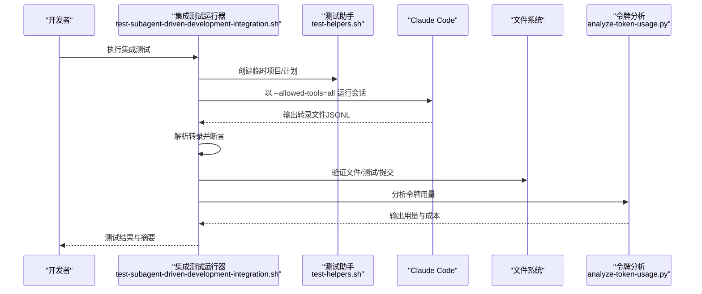
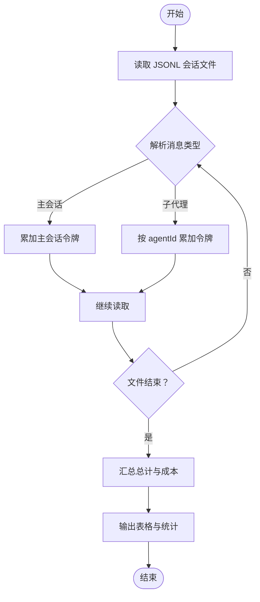
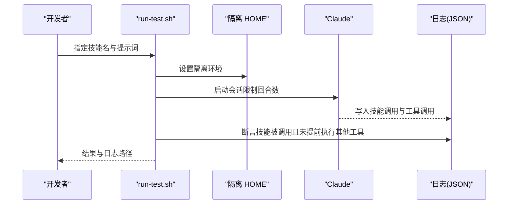
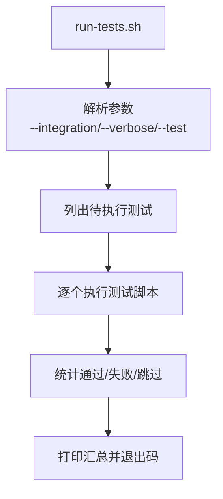
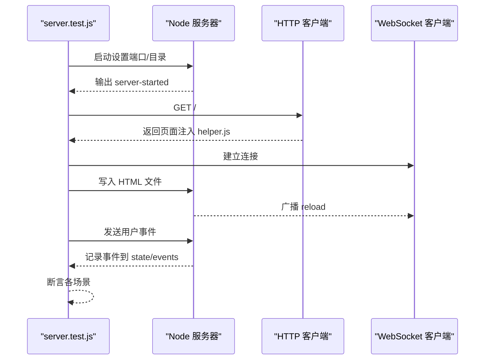
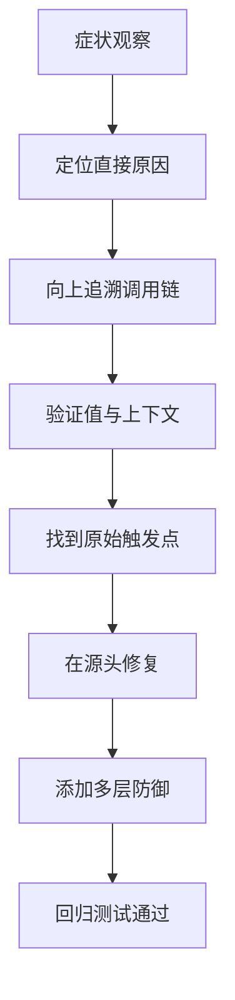
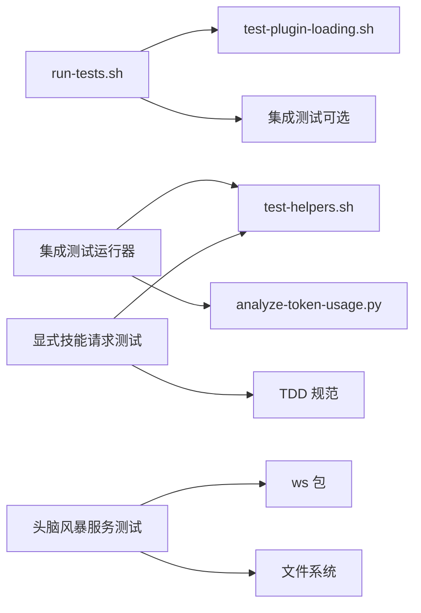

# 测试框架

<cite>
**本文引用的文件**
- [docs/testing.md](file://docs/testing.md)
- [README.md](file://README.md)
- [package.json](file://package.json)
- [tests/claude-code/test-helpers.sh](file://tests/claude-code/test-helpers.sh)
- [tests/claude-code/test-subagent-driven-development-integration.sh](file://tests/claude-code/test-subagent-driven-development-integration.sh)
- [tests/claude-code/analyze-token-usage.py](file://tests/claude-code/analyze-token-usage.py)
- [tests/explicit-skill-requests/run-all.sh](file://tests/explicit-skill-requests/run-all.sh)
- [tests/explicit-skill-requests/run-test.sh](file://tests/explicit-skill-requests/run-test.sh)
- [tests/opencode/run-tests.sh](file://tests/opencode/run-tests.sh)
- [tests/opencode/test-plugin-loading.sh](file://tests/opencode/test-plugin-loading.sh)
- [tests/brainstorm-server/server.test.js](file://tests/brainstorm-server/server.test.js)
- [skills/test-driven-development/SKILL.md](file://skills/test-driven-development/SKILL.md)
- [skills/systematic-debugging/root-cause-tracing.md](file://skills/systematic-debugging/root-cause-tracing.md)
</cite>

## 目录
1. [简介](#简介)
2. [项目结构](#项目结构)
3. [核心组件](#核心组件)
4. [架构总览](#架构总览)
5. [详细组件分析](#详细组件分析)
6. [依赖关系分析](#依赖关系分析)
7. [性能考量](#性能考量)
8. [故障排查指南](#故障排查指南)
9. [结论](#结论)
10. [附录](#附录)

## 简介
本文件系统化阐述 Superpowers 的测试框架设计与实现，覆盖单元测试、集成测试、跨平台测试与性能分析的完整方法论与实践路径。测试框架围绕以下目标构建：
- 以可重复、可验证的方式评估技能在真实会话中的行为
- 通过会话转录（JSONL）解析与断言，确保子代理工作流、评审循环与任务执行符合规范
- 提供跨平台（Claude Code、OpenCode、Cursor 等）的测试运行器与环境隔离策略
- 基于令牌用量分析的成本与效率度量，支撑持续优化

## 项目结构
测试相关代码主要分布在 tests 目录下，并与技能文档（skills）协同工作：
- tests/claude-code：面向 Claude Code 的端到端集成测试与辅助工具
- tests/explicit-skill-requests：显式技能请求触发测试
- tests/opencode：OpenCode 插件加载与工具链集成测试
- tests/brainstorm-server：头脑风暴服务的 HTTP/WebSocket/文件监控集成测试
- skills/*：技能规范与测试方法论文档，指导编写高质量测试

**图表来源**
- [tests/claude-code/test-subagent-driven-development-integration.sh:1-315](file://tests/claude-code/test-subagent-driven-development-integration.sh#L1-L315)
- [tests/explicit-skill-requests/run-all.sh:1-71](file://tests/explicit-skill-requests/run-all.sh#L1-L71)
- [tests/opencode/run-tests.sh:1-164](file://tests/opencode/run-tests.sh#L1-L164)
- [tests/brainstorm-server/server.test.js:1-428](file://tests/brainstorm-server/server.test.js#L1-L428)
- [skills/test-driven-development/SKILL.md:1-372](file://skills/test-driven-development/SKILL.md#L1-L372)
- [skills/systematic-debugging/root-cause-tracing.md:1-170](file://skills/systematic-debugging/root-cause-tracing.md#L1-L170)

**章节来源**
- [README.md:108-151](file://README.md#L108-L151)
- [docs/testing.md:1-304](file://docs/testing.md#L1-L304)

## 核心组件
- 测试运行器与辅助库
  - Claude Code 集成测试运行器与断言工具：提供会话运行、输出断言、计数断言、顺序断言、临时项目创建与清理等能力
  - OpenCode 插件测试运行器：统一管理测试清单、过滤与统计，支持集成测试开关
  - 显式技能请求测试运行器：隔离 HOME 环境，验证用户直接命名技能时的行为
  - 头脑风暴服务集成测试：基于 Node 子进程启动服务器，使用 HTTP 与 WebSocket 客户端进行端到端验证
- 令牌用量分析工具
  - 解析 Claude Code 会话转录，按主会话与子代理维度统计输入/输出/缓存读取令牌与成本估算
- 技能规范与测试方法论
  - TDD 循环与反模式：明确红-绿-重构流程与常见陷阱
  - 系统性调试与根因追踪：提供从症状回溯到原始触发点的方法与脚本

**章节来源**
- [tests/claude-code/test-helpers.sh:1-203](file://tests/claude-code/test-helpers.sh#L1-L203)
- [tests/claude-code/test-subagent-driven-development-integration.sh:1-315](file://tests/claude-code/test-subagent-driven-development-integration.sh#L1-L315)
- [tests/claude-code/analyze-token-usage.py:1-169](file://tests/claude-code/analyze-token-usage.py#L1-L169)
- [tests/opencode/run-tests.sh:1-164](file://tests/opencode/run-tests.sh#L1-L164)
- [tests/explicit-skill-requests/run-test.sh:1-137](file://tests/explicit-skill-requests/run-test.sh#L1-L137)
- [tests/brainstorm-server/server.test.js:1-428](file://tests/brainstorm-server/server.test.js#L1-L428)
- [skills/test-driven-development/SKILL.md:1-372](file://skills/test-driven-development/SKILL.md#L1-L372)
- [skills/systematic-debugging/root-cause-tracing.md:1-170](file://skills/systematic-debugging/root-cause-tracing.md#L1-L170)

## 架构总览
测试框架采用“平台无关的测试逻辑 + 平台特定的运行器”架构：
- 平台无关层：断言工具、会话转录解析、令牌分析
- 平台适配层：Claude Code 会话运行与权限控制、OpenCode 插件加载与工具链、Node 服务器与 WebSocket 客户端
- 质量保障层：TDD 规范、系统性调试与根因追踪、显式技能请求验证

**图表来源**
- [tests/claude-code/test-helpers.sh:1-203](file://tests/claude-code/test-helpers.sh#L1-L203)
- [tests/claude-code/test-subagent-driven-development-integration.sh:1-315](file://tests/claude-code/test-subagent-driven-development-integration.sh#L1-L315)
- [tests/claude-code/analyze-token-usage.py:1-169](file://tests/claude-code/analyze-token-usage.py#L1-L169)
- [tests/explicit-skill-requests/run-all.sh:1-71](file://tests/explicit-skill-requests/run-all.sh#L1-L71)
- [tests/explicit-skill-requests/run-test.sh:1-137](file://tests/explicit-skill-requests/run-test.sh#L1-L137)
- [tests/opencode/run-tests.sh:1-164](file://tests/opencode/run-tests.sh#L1-L164)
- [tests/opencode/test-plugin-loading.sh:1-83](file://tests/opencode/test-plugin-loading.sh#L1-L83)
- [tests/brainstorm-server/server.test.js:1-428](file://tests/brainstorm-server/server.test.js#L1-L428)
- [skills/test-driven-development/SKILL.md:1-372](file://skills/test-driven-development/SKILL.md#L1-L372)
- [skills/systematic-debugging/root-cause-tracing.md:1-170](file://skills/systematic-debugging/root-cause-tracing.md#L1-L170)

## 详细组件分析

### 组件一：Claude Code 集成测试（子代理驱动开发）
该组件通过在无头模式下运行 Claude Code，执行实现计划并解析会话转录，验证子代理调度、任务跟踪、文件生成、测试执行与提交历史等关键行为。

**图表来源**
- [tests/claude-code/test-subagent-driven-development-integration.sh:1-315](file://tests/claude-code/test-subagent-driven-development-integration.sh#L1-L315)
- [tests/claude-code/test-helpers.sh:1-203](file://tests/claude-code/test-helpers.sh#L1-L203)
- [tests/claude-code/analyze-token-usage.py:1-169](file://tests/claude-code/analyze-token-usage.py#L1-L169)

**章节来源**
- [docs/testing.md:20-135](file://docs/testing.md#L20-L135)
- [tests/claude-code/test-subagent-driven-development-integration.sh:1-315](file://tests/claude-code/test-subagent-driven-development-integration.sh#L1-L315)

### 组件二：令牌用量分析工具
该工具解析会话转录，按主会话与子代理维度统计令牌用量与成本，帮助评估工作负载与优化提示词缓存策略。

**图表来源**
- [tests/claude-code/analyze-token-usage.py:1-169](file://tests/claude-code/analyze-token-usage.py#L1-L169)

**章节来源**
- [docs/testing.md:137-177](file://docs/testing.md#L137-L177)
- [tests/claude-code/analyze-token-usage.py:1-169](file://tests/claude-code/analyze-token-usage.py#L1-L169)

### 组件三：显式技能请求测试
该组件验证当用户直接请求某个技能名称时，Claude 是否正确加载并调用该技能，而非提前执行其他工具。

**图表来源**
- [tests/explicit-skill-requests/run-test.sh:1-137](file://tests/explicit-skill-requests/run-test.sh#L1-L137)

**章节来源**
- [tests/explicit-skill-requests/run-all.sh:1-71](file://tests/explicit-skill-requests/run-all.sh#L1-L71)
- [tests/explicit-skill-requests/run-test.sh:1-137](file://tests/explicit-skill-requests/run-test.sh#L1-L137)

### 组件四：OpenCode 插件测试
该组件负责验证插件安装、技能目录加载、JavaScript 语法与引导文本等基础能力，并可选择运行需要 OpenCode 的集成测试。

**图表来源**
- [tests/opencode/run-tests.sh:1-164](file://tests/opencode/run-tests.sh#L1-L164)

**章节来源**
- [tests/opencode/run-tests.sh:1-164](file://tests/opencode/run-tests.sh#L1-L164)
- [tests/opencode/test-plugin-loading.sh:1-83](file://tests/opencode/test-plugin-loading.sh#L1-L83)

### 组件五：头脑风暴服务集成测试
该组件通过 Node 子进程启动服务器，使用 HTTP 与 WebSocket 客户端进行端到端验证，覆盖启动消息、静态页面注入、文件监听与广播等场景。

**图表来源**
- [tests/brainstorm-server/server.test.js:1-428](file://tests/brainstorm-server/server.test.js#L1-L428)

**章节来源**
- [tests/brainstorm-server/server.test.js:1-428](file://tests/brainstorm-server/server.test.js#L1-L428)

### 组件六：测试策略与质量保证
- TDD 循环与反模式：通过明确的红-绿-重构步骤与反模式清单，确保测试先行、最小实现与持续重构
- 系统性调试与根因追踪：提供从症状回溯到原始触发点的流程图与脚本，结合防御式深度（defense-in-depth）降低回归风险

**图表来源**
- [skills/systematic-debugging/root-cause-tracing.md:1-170](file://skills/systematic-debugging/root-cause-tracing.md#L1-L170)

**章节来源**
- [skills/test-driven-development/SKILL.md:1-372](file://skills/test-driven-development/SKILL.md#L1-L372)
- [skills/systematic-debugging/root-cause-tracing.md:1-170](file://skills/systematic-debugging/root-cause-tracing.md#L1-L170)

## 依赖关系分析
- 测试运行器依赖平台工具与外部服务
  - Claude Code：需要本地安装的 claude 命令、启用本地开发市场、允许工具访问与目录权限
  - OpenCode：需要插件链接、技能目录存在、JavaScript 语法检查通过
  - 头脑风暴服务：需要 Node 环境与 ws 包作为测试客户端
- 数据与配置
  - 会话转录（JSONL）用于断言与令牌分析
  - 临时项目目录用于模拟真实工程环境
  - 环境变量（如端口、目录）影响服务器行为

**图表来源**
- [tests/opencode/run-tests.sh:1-164](file://tests/opencode/run-tests.sh#L1-L164)
- [tests/opencode/test-plugin-loading.sh:1-83](file://tests/opencode/test-plugin-loading.sh#L1-L83)
- [tests/claude-code/test-subagent-driven-development-integration.sh:1-315](file://tests/claude-code/test-subagent-driven-development-integration.sh#L1-L315)
- [tests/claude-code/test-helpers.sh:1-203](file://tests/claude-code/test-helpers.sh#L1-L203)
- [tests/brainstorm-server/server.test.js:1-428](file://tests/brainstorm-server/server.test.js#L1-L428)

**章节来源**
- [docs/testing.md:34-40](file://docs/testing.md#L34-L40)
- [tests/opencode/test-plugin-loading.sh:1-83](file://tests/opencode/test-plugin-loading.sh#L1-L83)
- [tests/brainstorm-server/server.test.js:1-428](file://tests/brainstorm-server/server.test.js#L1-L428)

## 性能考量
- 令牌用量与成本
  - 主会话通常承担更多上下文输入，子代理用量相对均衡
  - 高缓存读取令牌表明提示词缓存有效，有助于降低成本
  - 成本估算基于输入/输出令牌单价，便于预算控制
- 会话时长与稳定性
  - 集成测试可能耗时较长，建议合理设置超时与分阶段断言
  - 使用权限模式与目录授权避免文件系统阻塞导致的超时
- 服务器性能
  - 头脑风暴服务需关注并发 WebSocket 客户端的广播与清理
  - 文件变更监听应避免频繁重载带来的抖动

**章节来源**
- [docs/testing.md:100-135](file://docs/testing.md#L100-L135)
- [tests/claude-code/analyze-token-usage.py:76-169](file://tests/claude-code/analyze-token-usage.py#L76-L169)

## 故障排查指南
- 技能未加载
  - 确保在插件目录内运行，启用本地开发市场
  - 检查技能文件是否存在
- 权限错误
  - 使用绕过权限模式与目录授权
  - 校验测试目录权限
- 超时问题
  - 增加超时时间或简化子任务复杂度
  - 排查技能逻辑是否陷入死循环
- 会话文件缺失
  - 在会话目录中查找最近的 JSONL 文件
  - 确认测试确实执行成功

**章节来源**
- [docs/testing.md:178-215](file://docs/testing.md#L178-L215)

## 结论
Superpowers 的测试框架以“真实会话 + 会话转录解析 + 多平台运行器”为核心，结合 TDD 与系统性调试方法论，形成从单元级断言到端到端工作流验证的完整闭环。通过令牌用量分析与严格的环境隔离策略，既能保障功能正确性，又能持续优化成本与性能。

## 附录
- 自动化测试流程建议
  - 在 CI 中分别运行单元测试与集成测试，集成测试按平台拆分
  - 对 Claude Code 集成测试设置超时与重试策略
  - 对 OpenCode 插件测试使用独立配置目录，避免污染
- 最佳实践
  - 始终解析会话转录而非仅依赖用户可见输出
  - 为每个新技能编写显式技能请求测试
  - 使用 TDD 与根因追踪减少回归与技术债