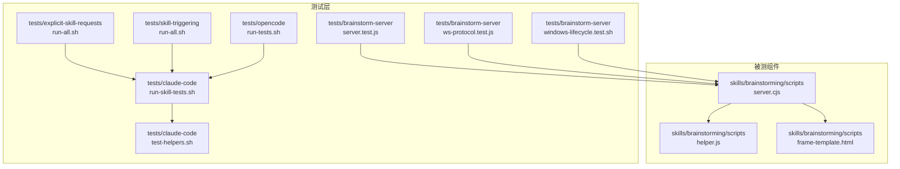
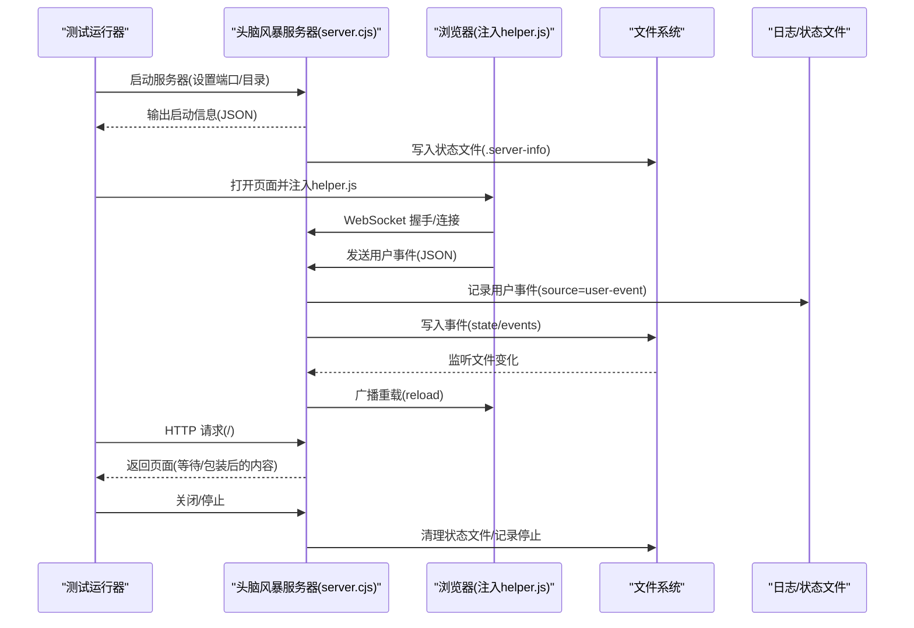
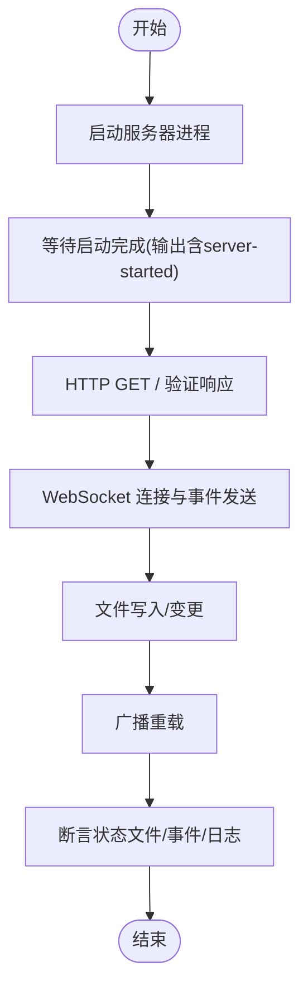
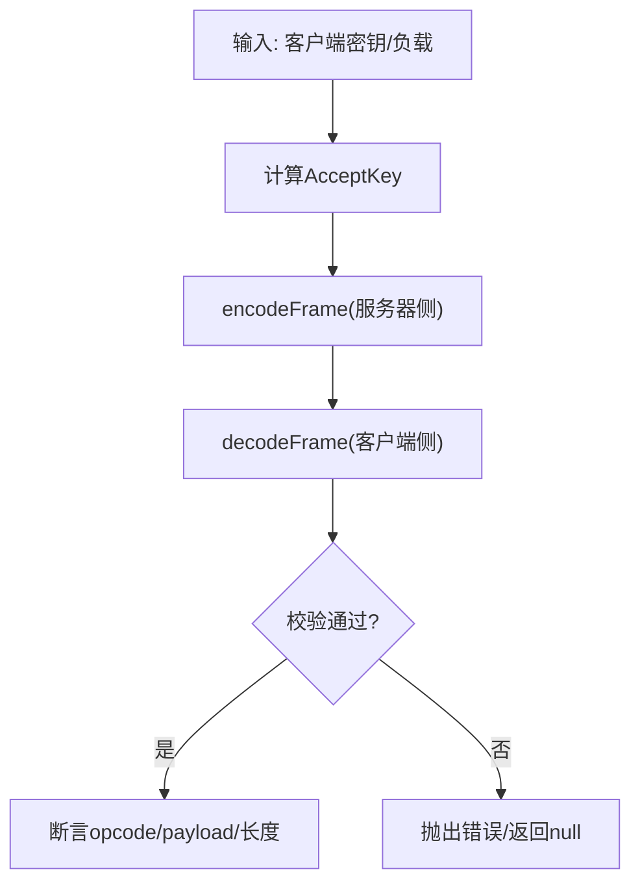
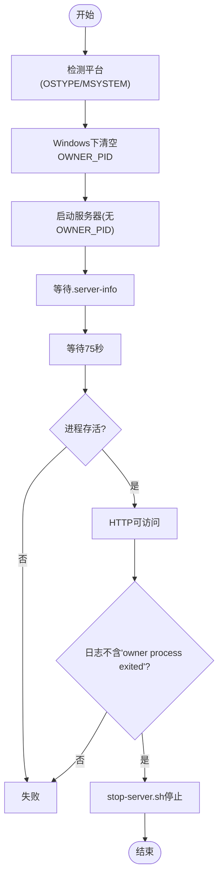
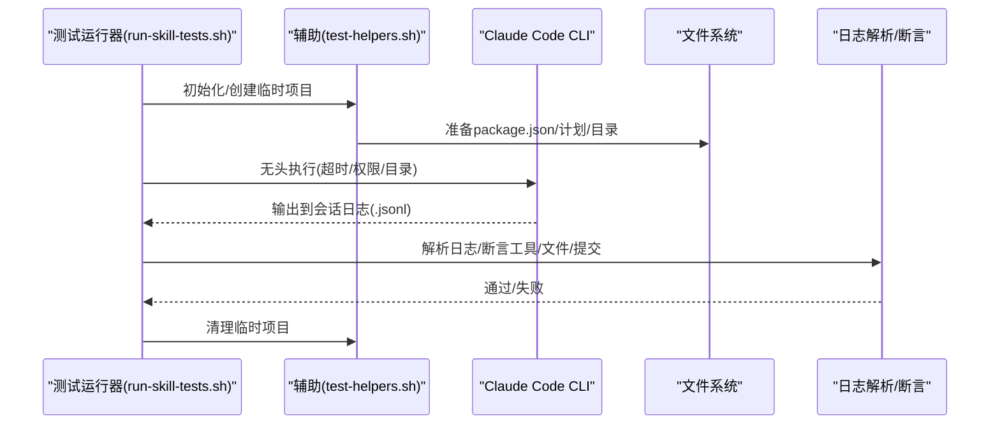
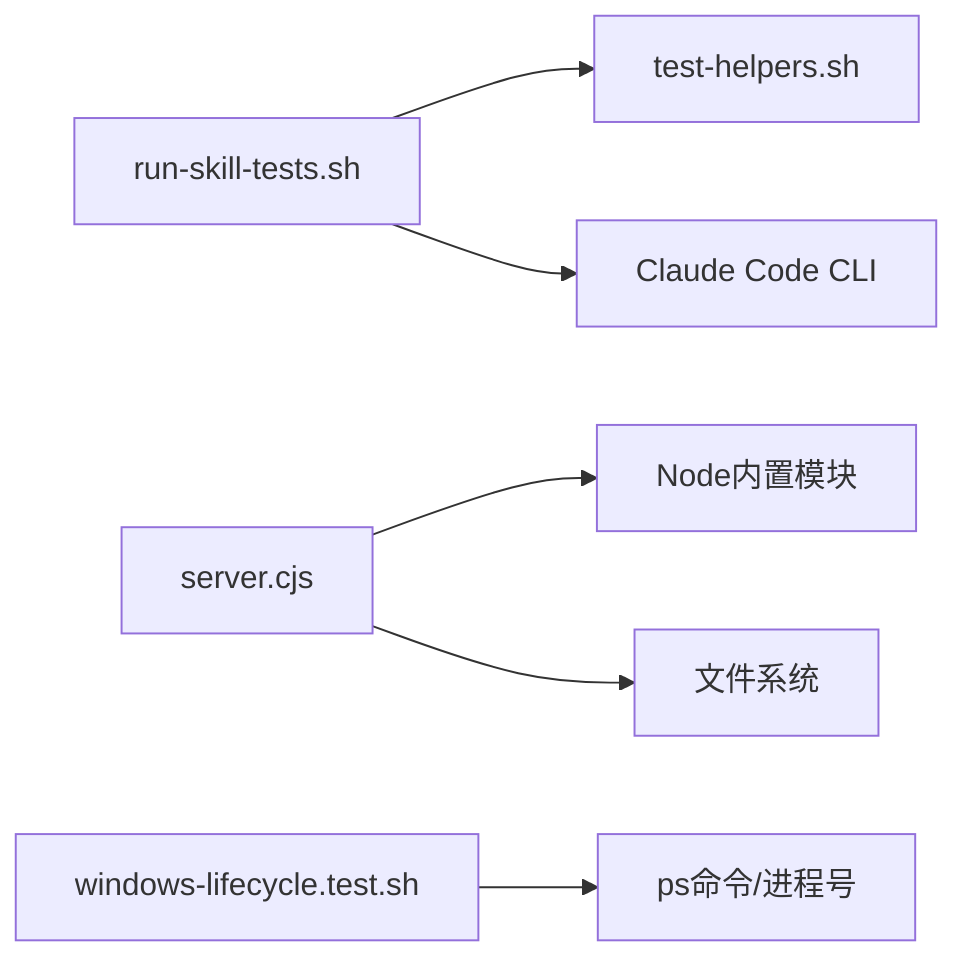

# 测试自动化

<cite>
**本文档引用的文件**
- [server.test.js](file://tests/brainstorm-server/server.test.js)
- [ws-protocol.test.js](file://tests/brainstorm-server/ws-protocol.test.js)
- [windows-lifecycle.test.sh](file://tests/brainstorm-server/windows-lifecycle.test.sh)
- [testing.md](file://docs/testing.md)
- [run-skill-tests.sh](file://tests/claude-code/run-skill-tests.sh)
- [test-helpers.sh](file://tests/claude-code/test-helpers.sh)
- [run-all.sh（显式技能请求）](file://tests/explicit-skill-requests/run-all.sh)
- [run-all.sh（技能触发）](file://tests/skill-triggering/run-all.sh)
- [run-tests.sh（OpenCode）](file://tests/opencode/run-tests.sh)
- [server.cjs](file://skills/brainstorming/scripts/server.cjs)
- [helper.js](file://skills/brainstorming/scripts/helper.js)
- [frame-template.html](file://skills/brainstorming/scripts/frame-template.html)
- [package.json](file://package.json)
</cite>

## 目录
1. [简介](#简介)
2. [项目结构](#项目结构)
3. [核心组件](#核心组件)
4. [架构总览](#架构总览)
5. [详细组件分析](#详细组件分析)
6. [依赖关系分析](#依赖关系分析)
7. [性能考量](#性能考量)
8. [故障排查指南](#故障排查指南)
9. [结论](#结论)
10. [附录](#附录)

## 简介
本文件系统性梳理 Superpowers 的测试自动化体系，覆盖以下方面：
- JavaScript 集成测试：端到端验证“头脑风暴”服务器的 HTTP 服务、WebSocket 协议与文件监听能力
- WebSocket 协议单元测试：独立验证零依赖协议实现（握手、帧编解码、边界处理）
- Windows 生命周期测试：在 Windows/MSYS2 环境下验证服务器在 60 秒生命周期检查中的存活与清理行为
- Claude Code 技能测试：通过真实会话执行与日志解析，验证子代理驱动开发等复杂技能的工作流
- OpenCode 插件测试：验证插件加载、工具可用性与技能优先级解析
- 测试脚本编写、环境配置与结果自动化验证的最佳实践
- 持续集成配置建议（基于现有脚本与工具链）

## 项目结构
测试相关目录与文件分布如下：
- tests/brainstorm-server：头脑风暴服务器的端到端与协议测试
- tests/claude-code：Claude Code 技能测试套件（运行器、辅助函数、集成测试）
- tests/explicit-skill-requests：显式技能请求测试集合
- tests/skill-triggering：技能触发测试集合
- tests/opencode：OpenCode 插件测试套件
- skills/brainstorming/scripts：被测服务端代码、前端注入脚本与模板

**图表来源**
- [server.test.js:1-428](file://tests/brainstorm-server/server.test.js#L1-L428)
- [ws-protocol.test.js:1-393](file://tests/brainstorm-server/ws-protocol.test.js#L1-L393)
- [windows-lifecycle.test.sh:1-352](file://tests/brainstorm-server/windows-lifecycle.test.sh#L1-L352)
- [run-skill-tests.sh:1-188](file://tests/claude-code/run-skill-tests.sh#L1-L188)
- [test-helpers.sh:1-203](file://tests/claude-code/test-helpers.sh#L1-L203)
- [server.cjs:1-355](file://skills/brainstorming/scripts/server.cjs#L1-L355)
- [helper.js:1-89](file://skills/brainstorming/scripts/helper.js#L1-L89)
- [frame-template.html:1-215](file://skills/brainstorming/scripts/frame-template.html#L1-L215)

**章节来源**
- [server.test.js:1-428](file://tests/brainstorm-server/server.test.js#L1-L428)
- [ws-protocol.test.js:1-393](file://tests/brainstorm-server/ws-protocol.test.js#L1-L393)
- [windows-lifecycle.test.sh:1-352](file://tests/brainstorm-server/windows-lifecycle.test.sh#L1-L352)
- [run-skill-tests.sh:1-188](file://tests/claude-code/run-skill-tests.sh#L1-L188)
- [test-helpers.sh:1-203](file://tests/claude-code/test-helpers.sh#L1-L203)
- [server.cjs:1-355](file://skills/brainstorming/scripts/server.cjs#L1-L355)
- [helper.js:1-89](file://skills/brainstorming/scripts/helper.js#L1-L89)
- [frame-template.html:1-215](file://skills/brainstorming/scripts/frame-template.html#L1-L215)

## 核心组件
- 头脑风暴服务器（server.cjs）
  - 实现 HTTP GET 与 WebSocket 升级握手
  - 文件监听与广播刷新
  - 生命周期监控（空闲超时与所有者进程退出检测）
  - 输出状态文件与日志
- 前端注入脚本（helper.js）
  - 连接 WebSocket、发送用户事件
  - 点击选择与指示条更新
  - 暴露窗口 API 供外部调用
- 框架模板（frame-template.html）
  - 提供统一 UI 结构与样式，用于包装内容片段
- 测试运行器与辅助（run-skill-tests.sh、test-helpers.sh）
  - 统一的测试入口、超时控制、结果统计
  - 辅助断言与临时项目管理
- 平台特定测试（windows-lifecycle.test.sh）
  - 验证 Windows/MSYS2 下的生命周期与前台模式检测

**章节来源**
- [server.cjs:1-355](file://skills/brainstorming/scripts/server.cjs#L1-L355)
- [helper.js:1-89](file://skills/brainstorming/scripts/helper.js#L1-L89)
- [frame-template.html:1-215](file://skills/brainstorming/scripts/frame-template.html#L1-L215)
- [run-skill-tests.sh:1-188](file://tests/claude-code/run-skill-tests.sh#L1-L188)
- [test-helpers.sh:1-203](file://tests/claude-code/test-helpers.sh#L1-L203)
- [windows-lifecycle.test.sh:1-352](file://tests/brainstorm-server/windows-lifecycle.test.sh#L1-L352)

## 架构总览
测试自动化由“测试脚本 + 被测组件 + 日志/文件输出 + 解析断言”构成闭环。

**图表来源**
- [server.test.js:72-422](file://tests/brainstorm-server/server.test.js#L72-L422)
- [server.cjs:262-352](file://skills/brainstorming/scripts/server.cjs#L262-L352)
- [helper.js:1-89](file://skills/brainstorming/scripts/helper.js#L1-L89)

## 详细组件分析

### 头脑风暴服务器集成测试（JavaScript 测试）
- 覆盖点
  - 启动阶段：输出启动消息、写入状态文件、包含端口与路径
  - HTTP 服务：等待页、注入 helper.js、返回类型、全文档直出、片段包装、按修改时间选择最新文件、忽略非 HTML、非根路径 404
  - WebSocket：升级成功、转发用户事件、choice 事件写入 state/events、并发客户端广播、关闭清理、异常输入容错
  - 文件监听：新增/变更 HTML 触发重载、非 HTML 不重载、新屏幕清空事件、日志记录 screen-added/screen-updated
  - 前端校验：helper.js API 定义、frame-template 结构完整性
- 断言策略
  - 使用 assert 对 JSON 字段、文件存在性与内容进行断言
  - 通过 HTTP 客户端与 WebSocket 客户端模拟真实交互
  - 通过状态文件与标准输出解析验证行为

**图表来源**
- [server.test.js:48-422](file://tests/brainstorm-server/server.test.js#L48-L422)
- [server.cjs:129-161](file://skills/brainstorming/scripts/server.cjs#L129-L161)
- [server.cjs:167-222](file://skills/brainstorming/scripts/server.cjs#L167-L222)
- [server.cjs:276-298](file://skills/brainstorming/scripts/server.cjs#L276-L298)

**章节来源**
- [server.test.js:1-428](file://tests/brainstorm-server/server.test.js#L1-L428)
- [server.cjs:1-355](file://skills/brainstorming/scripts/server.cjs#L1-L355)

### WebSocket 协议单元测试（零依赖实现）
- 覆盖点
  - 握手：RFC 6455 Accept Key 计算正确性与随机键有效性
  - 编码：小/中/大帧长度、CLOSE/PING/PONG、服务器帧未掩码
  - 解码：小/中/大帧、多帧缓冲、未掩码客户端帧拒绝、掩码还原正确
  - 边界：125/126、65535/65536 字节边界
  - 关闭帧：状态码与原因解析
  - JSON 往返：编码后 payload 可正确解析
- 测试方法
  - 动态构造客户端帧（手动掩码），验证解码结果
  - 使用随机密钥生成器确保健壮性
  - 通过模块导出接口直接测试协议函数

**图表来源**
- [ws-protocol.test.js:31-393](file://tests/brainstorm-server/ws-protocol.test.js#L31-L393)
- [server.cjs:11-72](file://skills/brainstorming/scripts/server.cjs#L11-L72)

**章节来源**
- [ws-protocol.test.js:1-393](file://tests/brainstorm-server/ws-protocol.test.js#L1-L393)
- [server.cjs:1-355](file://skills/brainstorming/scripts/server.cjs#L1-L355)

### Windows 生命周期测试
- 场景
  - Windows/MSYS2 环境下 OWNER_PID 解析为空修复
  - start-server.sh 传递空 BRAINSTORM_OWNER_PID
  - 自动前台模式检测
  - 服务器在 75 秒后仍存活且可 HTTP 访问
  - 坏的 OWNER_PID 导致自停并记录日志
  - stop-server.sh 正常停止
- 方法
  - 通过假的 node 替换 PATH 捕获环境变量
  - 使用 ps 与进程号检测逻辑模拟平台差异
  - 以 .server-info 与 .server.log 作为断言依据

**图表来源**
- [windows-lifecycle.test.sh:120-352](file://tests/brainstorm-server/windows-lifecycle.test.sh#L120-L352)
- [server.cjs:314-337](file://skills/brainstorming/scripts/server.cjs#L314-L337)

**章节来源**
- [windows-lifecycle.test.sh:1-352](file://tests/brainstorm-server/windows-lifecycle.test.sh#L1-L352)
- [server.cjs:1-355](file://skills/brainstorming/scripts/server.cjs#L1-L355)

### Claude Code 技能测试（集成测试）
- 测试目标
  - 子代理驱动开发工作流：计划一次性加载、完整任务文本传递、自审、审查顺序、审查循环、独立验证
- 测试流程
  - 创建临时 Node.js 项目，准备最小化实现计划
  - 在无头模式下运行 Claude Code，允许全部工具并授予目录权限
  - 解析会话日志（.jsonl）验证工具调用、子代理分发、文件创建、测试通过、Git 提交历史
  - 使用 Python 工具分析令牌用量
- 最佳实践
  - 总是从插件目录运行，确保技能加载
  - 使用权限模式与目录授权避免文件系统错误
  - 解析 .jsonl 而非用户输出进行断言
  - 包含令牌分析以便成本控制

**图表来源**
- [run-skill-tests.sh:1-188](file://tests/claude-code/run-skill-tests.sh#L1-L188)
- [test-helpers.sh:1-203](file://tests/claude-code/test-helpers.sh#L1-L203)
- [testing.md:1-304](file://docs/testing.md#L1-L304)

**章节来源**
- [run-skill-tests.sh:1-188](file://tests/claude-code/run-skill-tests.sh#L1-L188)
- [test-helpers.sh:1-203](file://tests/claude-code/test-helpers.sh#L1-L203)
- [testing.md:1-304](file://docs/testing.md#L1-L304)

### OpenCode 插件测试
- 测试范围
  - 插件加载与结构验证
  - use_skill 与 find_skills 工具（集成）
  - 技能优先级解析（集成）
- 运行方式
  - 通过 run-tests.sh 统一调度，支持仅运行加载类测试或启用集成测试

**章节来源**
- [run-tests.sh（OpenCode）:1-164](file://tests/opencode/run-tests.sh#L1-L164)

### 显式技能请求与技能触发测试
- 显式技能请求测试：验证不同提示词触发相应技能的行为
- 技能触发测试：批量验证多个技能的触发与响应

**章节来源**
- [run-all.sh（显式技能请求）:1-71](file://tests/explicit-skill-requests/run-all.sh#L1-L71)
- [run-all.sh（技能触发）:1-61](file://tests/skill-triggering/run-all.sh#L1-L61)

## 依赖关系分析
- 测试运行器依赖
  - run-skill-tests.sh 依赖 test-helpers.sh 提供断言与项目管理
  - Claude Code 集成测试依赖 Claude CLI 可用性与本地市场配置
- 被测组件依赖
  - server.cjs 依赖 Node 内置模块（http/fs/path/crypto），不引入第三方依赖
  - helper.js 依赖浏览器 WebSocket API 与 DOM
- 平台依赖
  - windows-lifecycle.test.sh 依赖 MSYS2/Windows 环境变量与 ps 命令

**图表来源**
- [run-skill-tests.sh:1-188](file://tests/claude-code/run-skill-tests.sh#L1-L188)
- [test-helpers.sh:1-203](file://tests/claude-code/test-helpers.sh#L1-L203)
- [server.cjs:1-355](file://skills/brainstorming/scripts/server.cjs#L1-L355)
- [windows-lifecycle.test.sh:1-352](file://tests/brainstorm-server/windows-lifecycle.test.sh#L1-L352)

**章节来源**
- [run-skill-tests.sh:1-188](file://tests/claude-code/run-skill-tests.sh#L1-L188)
- [test-helpers.sh:1-203](file://tests/claude-code/test-helpers.sh#L1-L203)
- [server.cjs:1-355](file://skills/brainstorming/scripts/server.cjs#L1-L355)
- [windows-lifecycle.test.sh:1-352](file://tests/brainstorm-server/windows-lifecycle.test.sh#L1-L352)

## 性能考量
- 测试超时与资源占用
  - run-skill-tests.sh 默认每测试 300 秒超时，集成测试建议使用 --integration 并配合较长超时
  - Claude Code 集成测试可能耗时 10-30 分钟，需合理安排 CI 作业队列
- I/O 与文件监听
  - server.cjs 使用 fs.watch 监听 content 目录，注意测试中频繁写入对磁盘与 CPU 的影响
- WebSocket 并发
  - server.test.js 验证多客户端并发与广播，测试中应避免过度并发导致的资源争用

[本节为通用指导，无需具体文件来源]

## 故障排查指南
- 技能未加载
  - 确保从插件目录运行，检查本地市场配置与技能存在性
- 权限错误
  - 使用 --permission-mode bypassPermissions 与 --add-dir 授权测试目录
- 会话文件缺失
  - 检查项目目录编码路径与最近会话定位
- 超时问题
  - 增加超时时间，排查子代理任务复杂度与无限循环
- Windows 生命周期异常
  - 确认 MSYS2 环境变量与 ps 行为，验证 .server-info 与 .server.log

**章节来源**
- [testing.md:178-215](file://docs/testing.md#L178-L215)

## 结论
Superpowers 的测试自动化以“脚本化 + 真实会话 + 协议级单元测试”为核心，覆盖了从协议实现到端到端工作流的关键路径。通过统一的测试运行器与断言辅助，结合平台特定的生命周期验证，形成了稳定可靠的自动化测试体系。建议在 CI 中区分快速单元测试与慢速集成测试，并为 Claude Code 测试预留充足的执行时间与资源。

[本节为总结，无需具体文件来源]

## 附录

### 测试脚本编写与最佳实践
- 统一使用 run-skill-tests.sh 作为测试入口，支持超时、过滤与汇总
- 使用 test-helpers.sh 封装断言与项目生命周期管理
- Claude Code 集成测试必须解析 .jsonl 日志而非用户输出
- 为 Windows 环境准备专用测试脚本，关注 OWNER_PID 与前台模式

**章节来源**
- [run-skill-tests.sh:1-188](file://tests/claude-code/run-skill-tests.sh#L1-L188)
- [test-helpers.sh:1-203](file://tests/claude-code/test-helpers.sh#L1-L203)
- [testing.md:216-264](file://docs/testing.md#L216-L264)

### 测试环境配置
- Node.js 与 Bash 环境
- Claude Code CLI 可用（用于技能测试）
- 本地市场启用（用于插件与技能加载）
- Windows/MSYS2（用于生命周期测试）

**章节来源**
- [testing.md:34-39](file://docs/testing.md#L34-L39)
- [windows-lifecycle.test.sh:8-12](file://tests/brainstorm-server/windows-lifecycle.test.sh#L8-L12)

### 持续集成配置建议
- 分层流水线
  - 快速层：协议单元测试、Windows 生命周期测试、OpenCode 加载测试
  - 集成层：Claude Code 技能测试（带长超时）
- 资源隔离
  - 为 Claude Code 测试分配独立工作空间与权限
- 结果可视化
  - 使用 run-skill-tests.sh 的摘要输出与日志归档
- 版本与元数据
  - package.json 提供版本信息，便于追踪测试基线

**章节来源**
- [package.json:1-7](file://package.json#L1-L7)
- [run-skill-tests.sh:165-187](file://tests/claude-code/run-skill-tests.sh#L165-L187)