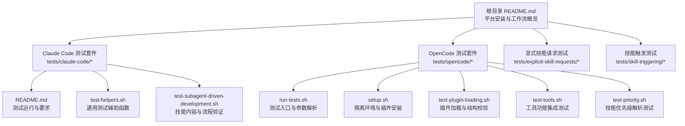
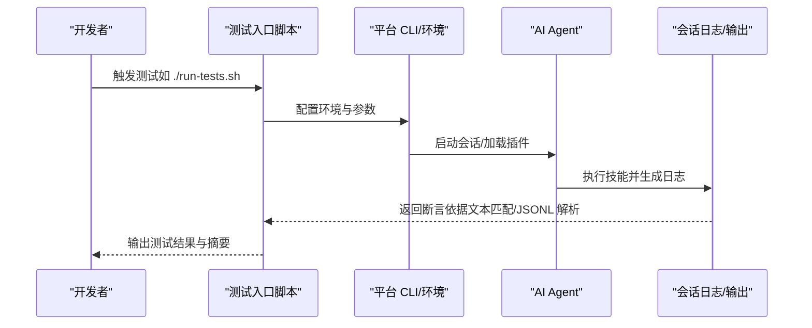
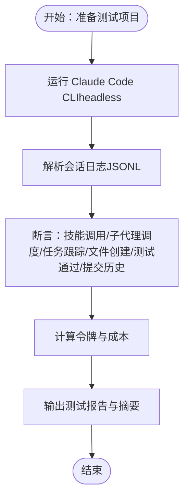
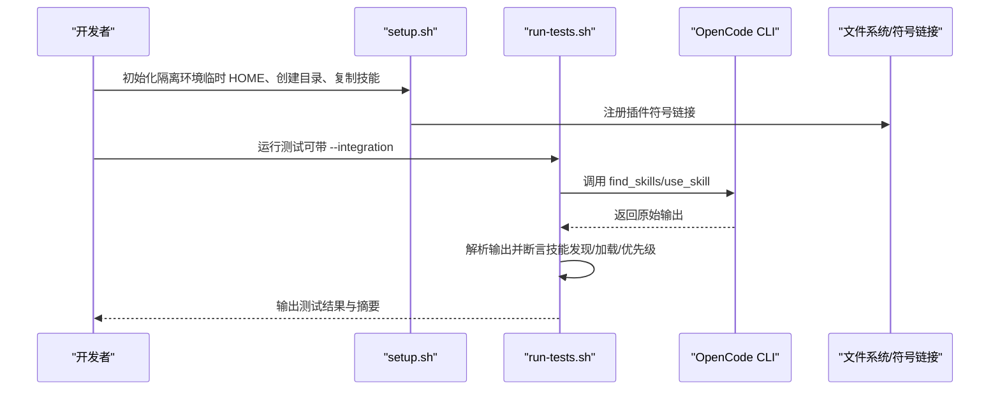
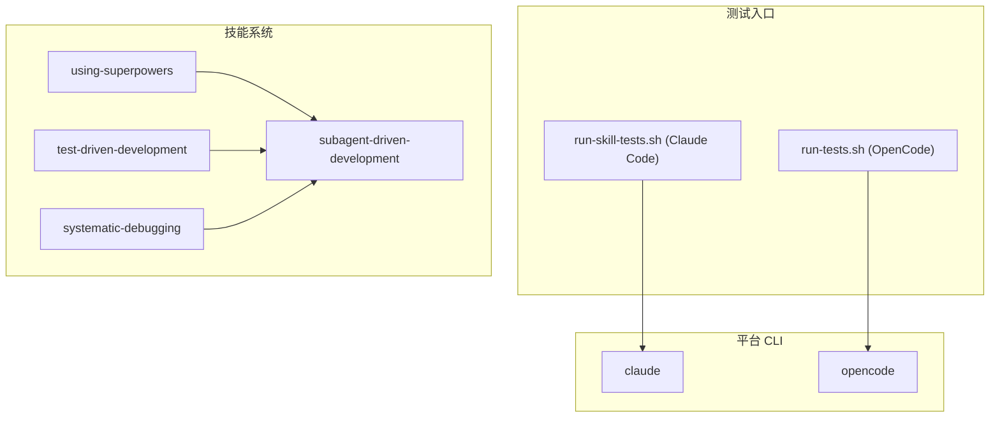

# 跨平台测试

<cite>
**本文引用的文件**
- [README.md](file://README.md)
- [docs/testing.md](file://docs/testing.md)
- [tests/claude-code/README.md](file://tests/claude-code/README.md)
- [tests/claude-code/test-helpers.sh](file://tests/claude-code/test-helpers.sh)
- [tests/claude-code/test-subagent-driven-development.sh](file://tests/claude-code/test-subagent-driven-development.sh)
- [tests/opencode/run-tests.sh](file://tests/opencode/run-tests.sh)
- [tests/opencode/setup.sh](file://tests/opencode/setup.sh)
- [tests/opencode/test-plugin-loading.sh](file://tests/opencode/test-plugin-loading.sh)
- [tests/opencode/test-tools.sh](file://tests/opencode/test-tools.sh)
- [tests/opencode/test-priority.sh](file://tests/opencode/test-priority.sh)
- [tests/explicit-skill-requests/run-all.sh](file://tests/explicit-skill-requests/run-all.sh)
- [tests/skill-triggering/run-all.sh](file://tests/skill-triggering/run-all.sh)
- [skills/using-superpowers/README.md](file://skills/using-superpowers/README.md)
- [skills/using-superpowers/SKILL.md](file://skills/using-superpowers/SKILL.md)
- [skills/subagent-driven-development/SKILL.md](file://skills/subagent-driven-development/SKILL.md)
- [skills/test-driven-development/SKILL.md](file://skills/test-driven-development/SKILL.md)
- [skills/systematic-debugging/SKILL.md](file://skills/systematic-debugging/SKILL.md)
</cite>

## 目录
1. [简介](#简介)
2. [项目结构](#项目结构)
3. [核心组件](#核心组件)
4. [架构总览](#架构总览)
5. [详细组件分析](#详细组件分析)
6. [依赖关系分析](#依赖关系分析)
7. [性能考量](#性能考量)
8. [故障排查指南](#故障排查指南)
9. [结论](#结论)
10. [附录](#附录)

## 简介
本文件面向 Superpowers 的跨平台测试，系统化说明如何在不同 AI 平台（Claude Code、Cursor、Codex、OpenCode、GitHub Copilot CLI、Gemini CLI 等）上进行测试，涵盖测试环境搭建、平台特定测试方法与测试结果比较，并给出平台适配器测试策略、插件加载测试与工具兼容性测试的最佳实践与差异处理方法。文档同时总结了技能系统与测试脚本的组织方式，帮助读者快速定位与扩展测试用例。

## 项目结构
Superpowers 将测试按平台拆分：Claude Code 使用 headless 模式运行并解析会话日志；OpenCode 通过本地安装与符号链接模拟插件注册，验证工具可用性与优先级解析；其他平台（Cursor、Codex、Copilot、Gemini）通过安装与使用说明进行验证。

图表来源
- [README.md:27-106](file://README.md#L27-L106)
- [tests/claude-code/README.md:1-159](file://tests/claude-code/README.md#L1-L159)
- [tests/opencode/run-tests.sh:1-164](file://tests/opencode/run-tests.sh#L1-L164)

章节来源
- [README.md:27-106](file://README.md#L27-L106)
- [tests/claude-code/README.md:1-159](file://tests/claude-code/README.md#L1-L159)
- [tests/opencode/run-tests.sh:1-164](file://tests/opencode/run-tests.sh#L1-L164)

## 核心组件
- 平台适配层
  - Claude Code：通过 CLI 在 headless 模式下运行，解析 JSONL 会话日志以断言行为。
  - OpenCode：通过本地配置目录与符号链接模拟插件注册，验证工具与优先级解析。
  - 其他平台：通过安装说明与工具映射进行验证（参考技能文档中的平台适配说明）。
- 测试执行器
  - Claude Code：run-skill-tests.sh 或直接调用单个测试脚本。
  - OpenCode：run-tests.sh 统一入口，支持集成测试开关与详细输出。
- 技能系统
  - using-superpowers：定义技能访问规则与优先级，确保在各平台正确加载与执行。
  - subagent-driven-development：端到端工作流测试的核心技能。
  - test-driven-development、systematic-debugging：支撑测试与调试的基础技能。

章节来源
- [docs/testing.md:1-304](file://docs/testing.md#L1-L304)
- [skills/using-superpowers/SKILL.md:1-118](file://skills/using-superpowers/SKILL.md#L1-L118)
- [skills/subagent-driven-development/SKILL.md:1-278](file://skills/subagent-driven-development/SKILL.md#L1-L278)
- [skills/test-driven-development/SKILL.md:1-372](file://skills/test-driven-development/SKILL.md#L1-L372)
- [skills/systematic-debugging/SKILL.md:1-297](file://skills/systematic-debugging/SKILL.md#L1-L297)

## 架构总览
下图展示跨平台测试的整体流程：统一由测试入口脚本驱动，针对不同平台选择合适的执行路径与断言策略。

图表来源
- [tests/opencode/run-tests.sh:1-164](file://tests/opencode/run-tests.sh#L1-L164)
- [tests/claude-code/README.md:14-40](file://tests/claude-code/README.md#L14-L40)
- [docs/testing.md:216-264](file://docs/testing.md#L216-L264)

## 详细组件分析

### Claude Code 平台测试
- 测试目标
  - 验证技能加载与描述正确性
  - 验证端到端工作流（subagent-driven-development）的关键要求
  - 分析会话令牌用量与成本
- 关键脚本
  - 测试入口与运行选项：tests/claude-code/README.md
  - 通用辅助函数：tests/claude-code/test-helpers.sh
  - 技能内容验证：tests/claude-code/test-subagent-driven-development.sh
  - 集成测试（端到端工作流）：docs/testing.md 中的说明与示例
- 断言策略
  - 文本匹配：assert_contains/assert_not_contains/assert_count
  - 顺序断言：assert_order
  - 会话日志解析：JSONL 文件中提取工具调用、消息数、输入/输出令牌等
- 令牌分析
  - analyze-token-usage.py 用于统计主会话与子代理的令牌与成本

图表来源
- [tests/claude-code/test-helpers.sh:1-203](file://tests/claude-code/test-helpers.sh#L1-L203)
- [docs/testing.md:137-177](file://docs/testing.md#L137-L177)

章节来源
- [tests/claude-code/README.md:1-159](file://tests/claude-code/README.md#L1-L159)
- [tests/claude-code/test-helpers.sh:1-203](file://tests/claude-code/test-helpers.sh#L1-L203)
- [tests/claude-code/test-subagent-driven-development.sh:1-166](file://tests/claude-code/test-subagent-driven-development.sh#L1-L166)
- [docs/testing.md:1-304](file://docs/testing.md#L1-L304)

### OpenCode 平台测试
- 测试目标
  - 插件加载与结构校验
  - 工具功能（find_skills、use_skill）可用性
  - 技能优先级解析（项目 > 个人 > Superpowers）
- 关键脚本
  - 测试入口：tests/opencode/run-tests.sh
  - 环境设置：tests/opencode/setup.sh（隔离 HOME、注册插件符号链接、创建测试技能）
  - 插件加载测试：tests/opencode/test-plugin-loading.sh
  - 工具功能测试：tests/opencode/test-tools.sh
  - 优先级测试：tests/opencode/test-priority.sh
- 运行方式
  - 默认仅运行非集成测试（无需 OpenCode 安装）
  - 通过 --integration 运行需要 OpenCode 的集成测试
  - 支持 --verbose 输出详细日志
- 断言策略
  - 文件存在性与权限检查
  - 工具输出模式匹配（包含技能名称或内容片段）
  - 优先级解析断言（基于输出中的标记）

图表来源
- [tests/opencode/run-tests.sh:1-164](file://tests/opencode/run-tests.sh#L1-L164)
- [tests/opencode/setup.sh:1-89](file://tests/opencode/setup.sh#L1-L89)
- [tests/opencode/test-plugin-loading.sh:1-83](file://tests/opencode/test-plugin-loading.sh#L1-L83)
- [tests/opencode/test-tools.sh:1-105](file://tests/opencode/test-tools.sh#L1-L105)
- [tests/opencode/test-priority.sh:1-199](file://tests/opencode/test-priority.sh#L1-L199)

章节来源
- [tests/opencode/run-tests.sh:1-164](file://tests/opencode/run-tests.sh#L1-L164)
- [tests/opencode/setup.sh:1-89](file://tests/opencode/setup.sh#L1-L89)
- [tests/opencode/test-plugin-loading.sh:1-83](file://tests/opencode/test-plugin-loading.sh#L1-L83)
- [tests/opencode/test-tools.sh:1-105](file://tests/opencode/test-tools.sh#L1-L105)
- [tests/opencode/test-priority.sh:1-199](file://tests/opencode/test-priority.sh#L1-L199)

### 显式技能请求与技能触发测试
- 显式技能请求测试
  - tests/explicit-skill-requests/run-all.sh：批量运行显式请求场景（如“请使用 subagent-driven-development”）
- 技能触发测试
  - tests/skill-triggering/run-all.sh：遍历多个技能提示，验证是否被正确触发
- 适用平台
  - 适用于所有支持技能加载的平台（Claude Code、OpenCode、Copilot、Gemini 等），通过平台工具映射与技能描述字段实现

章节来源
- [tests/explicit-skill-requests/run-all.sh:1-71](file://tests/explicit-skill-requests/run-all.sh#L1-L71)
- [tests/skill-triggering/run-all.sh:1-61](file://tests/skill-triggering/run-all.sh#L1-L61)

### 平台适配器测试策略
- Claude Code
  - 使用 CLI headless 模式，断言文本与 JSONL 日志
  - 建议：固定超时时间，解析工具调用与令牌用量
- OpenCode
  - 通过符号链接模拟插件注册，断言工具输出与优先级
  - 建议：在隔离环境中运行，避免污染用户配置
- 其他平台（Cursor/Codex/Copilot/Gemini）
  - 参考技能文档中的平台适配说明，使用对应工具名称与能力
  - 建议：统一通过“技能描述字段 + 工具映射”的方式验证触发与执行

章节来源
- [skills/using-superpowers/SKILL.md:38-40](file://skills/using-superpowers/SKILL.md#L38-L40)
- [README.md:29-106](file://README.md#L29-L106)

### 插件加载测试
- OpenCode 插件加载
  - 校验插件符号链接存在且指向有效文件
  - 校验 skills 目录存在且包含必要技能（如 using-superpowers）
  - 校验插件 JS 语法正确，不包含错误的路径声明
- 建议
  - 在隔离 HOME 下运行，测试结束后清理临时目录
  - 对于多平台，统一采用“复制源码 + 符号链接”的方式模拟安装

章节来源
- [tests/opencode/test-plugin-loading.sh:1-83](file://tests/opencode/test-plugin-loading.sh#L1-L83)
- [tests/opencode/setup.sh:1-89](file://tests/opencode/setup.sh#L1-L89)

### 工具兼容性测试
- find_skills 工具
  - 断言返回的技能列表包含 Superpowers 技能与自定义技能
- use_skill 工具
  - 断言加载指定技能后能返回预期内容或启动流程
  - 支持显式前缀（如 superpowers:、project:）强制解析
- 建议
  - 对于未安装平台，跳过集成测试但保留断言逻辑，便于后续补全

章节来源
- [tests/opencode/test-tools.sh:1-105](file://tests/opencode/test-tools.sh#L1-L105)

### 技能优先级测试
- 优先级规则
  - 项目级别技能 > 个人级别技能 > Superpowers 内置技能
  - 显式前缀可覆盖默认优先级（如 superpowers: 强制使用内置）
- 测试方法
  - 在三处创建同名技能并注入不同标记，分别验证加载结果
  - 在项目上下文与非项目上下文中分别测试
- 建议
  - 为每种优先级场景编写独立断言，确保边界条件覆盖

章节来源
- [tests/opencode/test-priority.sh:1-199](file://tests/opencode/test-priority.sh#L1-L199)

## 依赖关系分析
- 测试入口对平台 CLI 的依赖
  - Claude Code：claude 命令、本地开发市场启用
  - OpenCode：opencode 命令、配置目录与符号链接
- 技能系统对工具的依赖
  - using-superpowers：定义技能访问规则与优先级
  - subagent-driven-development：依赖 using-git-worktrees、writing-plans、requesting-code-review、finishing-a-development-branch 等前置技能
- 外部工具
  - analyze-token-usage.py：解析 Claude Code 会话日志并统计令牌与成本

图表来源
- [tests/opencode/run-tests.sh:1-164](file://tests/opencode/run-tests.sh#L1-L164)
- [tests/claude-code/README.md:14-40](file://tests/claude-code/README.md#L14-L40)
- [skills/using-superpowers/SKILL.md:1-118](file://skills/using-superpowers/SKILL.md#L1-L118)
- [skills/subagent-driven-development/SKILL.md:265-278](file://skills/subagent-driven-development/SKILL.md#L265-L278)

章节来源
- [tests/opencode/run-tests.sh:1-164](file://tests/opencode/run-tests.sh#L1-L164)
- [tests/claude-code/README.md:14-40](file://tests/claude-code/README.md#L14-L40)
- [skills/using-superpowers/SKILL.md:1-118](file://skills/using-superpowers/SKILL.md#L1-L118)
- [skills/subagent-driven-development/SKILL.md:265-278](file://skills/subagent-driven-development/SKILL.md#L265-L278)

## 性能考量
- Claude Code 集成测试耗时较长（10-30 分钟），建议：
  - 使用固定超时与分阶段断言，优先验证关键步骤
  - 通过 analyze-token-usage.py 监控令牌与成本，识别高开销环节
- OpenCode 测试：
  - 非集成测试几乎无外部依赖，适合快速验证
  - 集成测试需等待平台响应，建议在 CI 中控制并发与重试

## 故障排查指南
- Claude Code
  - 技能未加载：确认在插件目录内运行、本地开发市场已启用、技能文件存在
  - 权限问题：使用 bypassPermissions 与 --add-dir 授予目录访问
  - 超时：增加超时时间，检查子代理任务复杂度
  - 会话文件缺失：检查项目目录编码、使用最近会话查找命令
- OpenCode
  - 插件未注册：检查符号链接是否存在且指向有效文件
  - 工具不可用：确认 OpenCode 已安装并在 PATH 中
  - 优先级异常：检查项目/个人/内置技能的标记与加载上下文

章节来源
- [docs/testing.md:178-215](file://docs/testing.md#L178-L215)
- [tests/opencode/test-plugin-loading.sh:18-33](file://tests/opencode/test-plugin-loading.sh#L18-L33)
- [tests/opencode/test-tools.sh:17-22](file://tests/opencode/test-tools.sh#L17-L22)
- [tests/opencode/test-priority.sh:89-97](file://tests/opencode/test-priority.sh#L89-L97)

## 结论
Superpowers 的跨平台测试以“平台适配 + 统一断言 + 可观测性”为核心，Claude Code 侧重会话日志解析与令牌成本分析，OpenCode 侧重插件注册与工具可用性及优先级验证。通过标准化测试入口与断言策略，可在多平台上保持一致的质量基线，并为新平台接入提供清晰的扩展路径。

## 附录
- 快速开始
  - Claude Code：在 tests/claude-code 目录下运行 README 中的示例命令
  - OpenCode：在 tests/opencode 目录下运行 run-tests.sh，默认仅运行非集成测试，添加 --integration 运行集成测试
- 最佳实践
  - 在隔离环境中运行 OpenCode 测试，避免污染用户配置
  - 使用 analyze-token-usage.py 监控 Claude Code 成本，识别优化点
  - 对于新平台，先实现工具映射与安装说明，再补充对应测试脚本