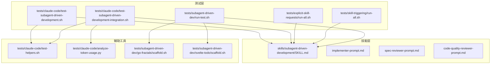
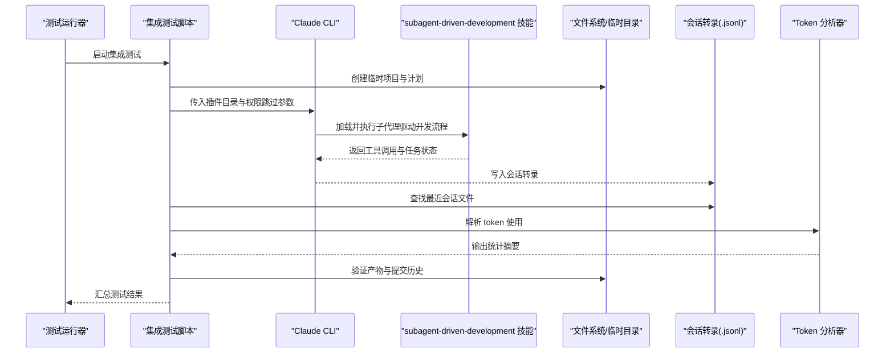
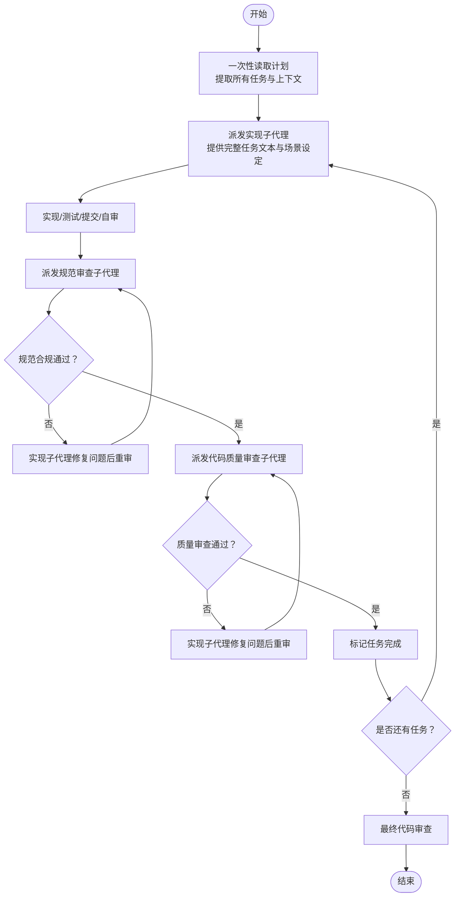
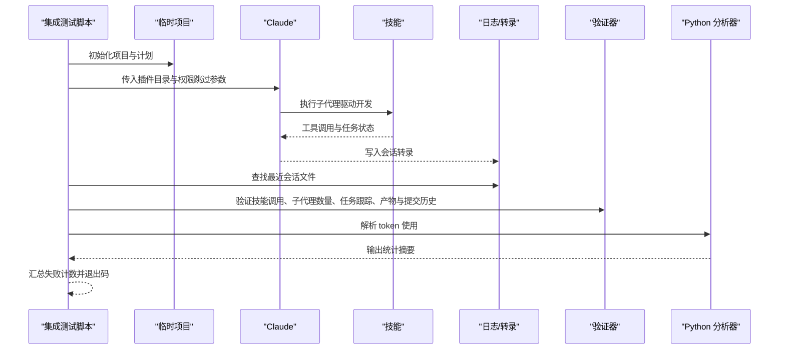
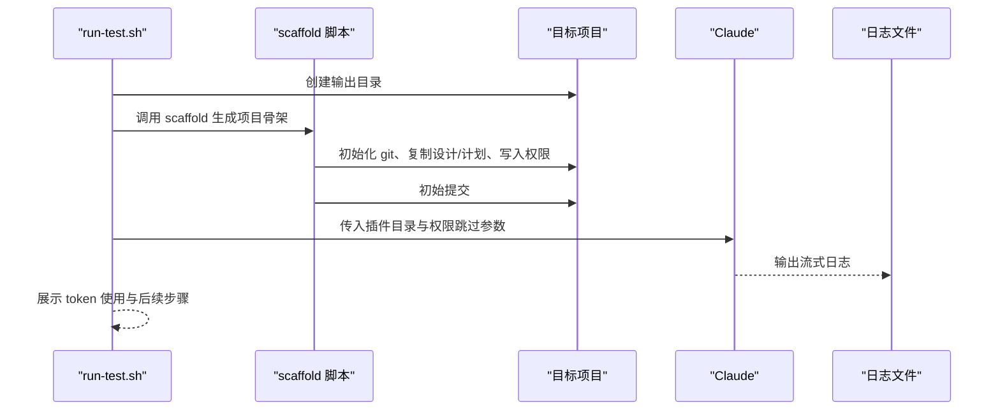
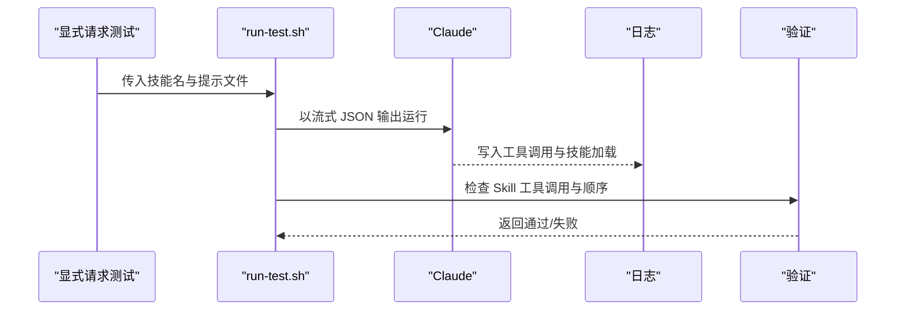
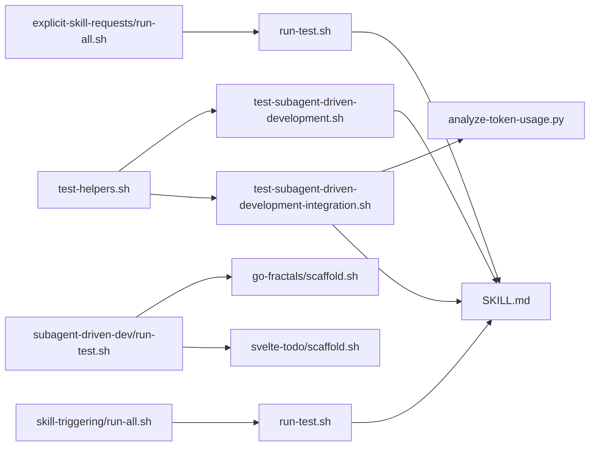

# 集成测试

<cite>
**本文引用的文件**
- [tests/claude-code/test-subagent-driven-development-integration.sh](file://tests/claude-code/test-subagent-driven-development-integration.sh)
- [tests/claude-code/test-subagent-driven-development.sh](file://tests/claude-code/test-subagent-driven-development.sh)
- [tests/claude-code/test-helpers.sh](file://tests/claude-code/test-helpers.sh)
- [tests/claude-code/analyze-token-usage.py](file://tests/claude-code/analyze-token-usage.py)
- [tests/subagent-driven-dev/run-test.sh](file://tests/subagent-driven-dev/run-test.sh)
- [tests/subagent-driven-dev/go-fractals/scaffold.sh](file://tests/subagent-driven-dev/go-fractals/scaffold.sh)
- [tests/subagent-driven-dev/svelte-todo/scaffold.sh](file://tests/subagent-driven-dev/svelte-todo/scaffold.sh)
- [skills/subagent-driven-development/SKILL.md](file://skills/subagent-driven-development/SKILL.md)
- [skills/subagent-driven-development/implementer-prompt.md](file://skills/subagent-driven-development/implementer-prompt.md)
- [skills/subagent-driven-development/spec-reviewer-prompt.md](file://skills/subagent-driven-development/spec-reviewer-prompt.md)
- [skills/subagent-driven-development/code-quality-reviewer-prompt.md](file://skills/subagent-driven-development/code-quality-reviewer-prompt.md)
- [tests/explicit-skill-requests/run-all.sh](file://tests/explicit-skill-requests/run-all.sh)
- [tests/explicit-skill-requests/run-test.sh](file://tests/explicit-skill-requests/run-test.sh)
- [tests/skill-triggering/run-all.sh](file://tests/skill-triggering/run-all.sh)
- [tests/skill-triggering/run-test.sh](file://tests/skill-triggering/run-test.sh)
</cite>

## 目录
1. [简介](#简介)
2. [项目结构](#项目结构)
3. [核心组件](#核心组件)
4. [架构总览](#架构总览)
5. [详细组件分析](#详细组件分析)
6. [依赖分析](#依赖分析)
7. [性能考虑](#性能考虑)
8. [故障排查指南](#故障排查指南)
9. [结论](#结论)
10. [附录](#附录)

## 简介
本文件面向 Superpowers 的集成测试，重点围绕“子代理驱动开发（subagent-driven-development）”这一复杂技能，系统阐述测试设计原理、实现方法与最佳实践。内容涵盖测试环境搭建、会话转录解析、结果验证、临时目录管理、权限配置与超时控制等关键环节，并提供完整测试流程示例，帮助读者在不同语言与工具链环境下稳定复现与扩展测试。

## 项目结构
Superpowers 的测试体系由多类脚本与技能定义组成，主要分布在 tests 与 skills 目录中：
- 测试脚本：tests/claude-code、tests/explicit-skill-requests、tests/skill-triggering、tests/subagent-driven-dev
- 技能定义：skills/subagent-driven-development 及其子模板
- 辅助工具：token 使用分析脚本 analyze-token-usage.py

下图展示测试与技能之间的关系与调用路径：

图表来源
- [tests/claude-code/test-subagent-driven-development.sh:1-166](file://tests/claude-code/test-subagent-driven-development.sh#L1-L166)
- [tests/claude-code/test-subagent-driven-development-integration.sh:1-315](file://tests/claude-code/test-subagent-driven-development-integration.sh#L1-L315)
- [tests/explicit-skill-requests/run-all.sh:1-71](file://tests/explicit-skill-requests/run-all.sh#L1-L71)
- [tests/skill-triggering/run-all.sh:1-61](file://tests/skill-triggering/run-all.sh#L1-L61)
- [tests/subagent-driven-dev/run-test.sh:1-107](file://tests/subagent-driven-dev/run-test.sh#L1-L107)
- [skills/subagent-driven-development/SKILL.md:1-278](file://skills/subagent-driven-development/SKILL.md#L1-L278)
- [tests/claude-code/test-helpers.sh:1-203](file://tests/claude-code/test-helpers.sh#L1-L203)
- [tests/claude-code/analyze-token-usage.py:1-169](file://tests/claude-code/analyze-token-usage.py#L1-L169)
- [tests/subagent-driven-dev/go-fractals/scaffold.sh:1-46](file://tests/subagent-driven-dev/go-fractals/scaffold.sh#L1-L46)
- [tests/subagent-driven-dev/svelte-todo/scaffold.sh:1-47](file://tests/subagent-driven-dev/svelte-todo/scaffold.sh#L1-L47)

章节来源
- [tests/claude-code/test-subagent-driven-development.sh:1-166](file://tests/claude-code/test-subagent-driven-development.sh#L1-L166)
- [tests/claude-code/test-subagent-driven-development-integration.sh:1-315](file://tests/claude-code/test-subagent-driven-development-integration.sh#L1-L315)
- [tests/explicit-skill-requests/run-all.sh:1-71](file://tests/explicit-skill-requests/run-all.sh#L1-L71)
- [tests/skill-triggering/run-all.sh:1-61](file://tests/skill-triggering/run-all.sh#L1-L61)
- [tests/subagent-driven-dev/run-test.sh:1-107](file://tests/subagent-driven-dev/run-test.sh#L1-L107)
- [skills/subagent-driven-development/SKILL.md:1-278](file://skills/subagent-driven-development/SKILL.md#L1-L278)

## 核心组件
- 技能定义与流程规范：subagent-driven-development 的 SKILL.md 明确了“每任务一个子代理 + 两阶段审查（规范合规优先）”的执行原则与质量门禁。
- 子代理提示词模板：implementer-prompt.md、spec-reviewer-prompt.md、code-quality-reviewer-prompt.md 定义了三类子代理的角色职责与交互约束。
- 测试脚本与辅助函数：
  - 单元/概念验证测试：test-subagent-driven-development.sh 检查技能加载、工作流顺序、自审要求、计划读取策略、审查循环、任务上下文提供方式、前置技能与主分支风险提示等。
  - 集成测试：test-subagent-driven-development-integration.sh 创建真实项目、生成实现计划、运行 Claude 执行计划、解析会话转录、验证产物与提交历史、运行单元测试、统计 token 使用。
  - 子代理驱动开发专项测试：subagent-driven-dev 目录下的 run-test.sh 与 scaffold 脚本用于不同语言（Go/Svelte）的端到端验证。
  - 辅助工具：test-helpers.sh 提供 run_claude、断言工具与临时项目管理；analyze-token-usage.py 解析会话转录中的 token 使用并按主会话与子代理拆分统计。
- 技能触发测试：explicit-skill-requests 与 skill-triggering 目录分别验证“显式命名技能请求”和“自然语言触发”的稳定性与正确性。

章节来源
- [skills/subagent-driven-development/SKILL.md:1-278](file://skills/subagent-driven-development/SKILL.md#L1-L278)
- [skills/subagent-driven-development/implementer-prompt.md:1-114](file://skills/subagent-driven-development/implementer-prompt.md#L1-L114)
- [skills/subagent-driven-development/spec-reviewer-prompt.md:1-62](file://skills/subagent-driven-development/spec-reviewer-prompt.md#L1-L62)
- [skills/subagent-driven-development/code-quality-reviewer-prompt.md:1-27](file://skills/subagent-driven-development/code-quality-reviewer-prompt.md#L1-L27)
- [tests/claude-code/test-subagent-driven-development.sh:1-166](file://tests/claude-code/test-subagent-driven-development.sh#L1-L166)
- [tests/claude-code/test-subagent-driven-development-integration.sh:1-315](file://tests/claude-code/test-subagent-driven-development-integration.sh#L1-L315)
- [tests/claude-code/test-helpers.sh:1-203](file://tests/claude-code/test-helpers.sh#L1-L203)
- [tests/claude-code/analyze-token-usage.py:1-169](file://tests/claude-code/analyze-token-usage.py#L1-L169)
- [tests/subagent-driven-dev/run-test.sh:1-107](file://tests/subagent-driven-dev/run-test.sh#L1-L107)
- [tests/subagent-driven-dev/go-fractals/scaffold.sh:1-46](file://tests/subagent-driven-dev/go-fractals/scaffold.sh#L1-L46)
- [tests/subagent-driven-dev/svelte-todo/scaffold.sh:1-47](file://tests/subagent-driven-dev/svelte-todo/scaffold.sh#L1-L47)
- [tests/explicit-skill-requests/run-all.sh:1-71](file://tests/explicit-skill-requests/run-all.sh#L1-L71)
- [tests/skill-triggering/run-all.sh:1-61](file://tests/skill-triggering/run-all.sh#L1-L61)

## 架构总览
下图展示了从测试脚本到技能执行、再到产物与日志输出的整体流程，以及会话转录解析与 token 统计的关键节点。

图表来源
- [tests/claude-code/test-subagent-driven-development-integration.sh:1-315](file://tests/claude-code/test-subagent-driven-development-integration.sh#L1-L315)
- [tests/claude-code/analyze-token-usage.py:1-169](file://tests/claude-code/analyze-token-usage.py#L1-L169)
- [skills/subagent-driven-development/SKILL.md:1-278](file://skills/subagent-driven-development/SKILL.md#L1-L278)

## 详细组件分析

### 组件一：子代理驱动开发技能（概念与流程）
该技能以“每任务一个子代理 + 两阶段审查”为核心，强调：
- 计划一次性读取，任务上下文直接提供给子代理，避免重复读取
- 规范合规审查先于代码质量审查
- 审查循环确保问题被修复并复核
- 子代理独立工作，控制器仅做协调与上下文提供

图表来源
- [skills/subagent-driven-development/SKILL.md:40-85](file://skills/subagent-driven-development/SKILL.md#L40-L85)

章节来源
- [skills/subagent-driven-development/SKILL.md:1-278](file://skills/subagent-driven-development/SKILL.md#L1-L278)

### 组件二：集成测试脚本（执行与验证）
该脚本负责：
- 创建临时项目、初始化最小 Node.js 工程、生成实现计划
- 运行 Claude 并捕获输出与会话转录
- 基于会话转录进行工具调用与行为验证
- 生成并运行单元测试，检查提交历史与产物完整性
- 使用 Python 脚本解析 token 使用并输出统计

图表来源
- [tests/claude-code/test-subagent-driven-development-integration.sh:1-315](file://tests/claude-code/test-subagent-driven-development-integration.sh#L1-L315)
- [tests/claude-code/analyze-token-usage.py:1-169](file://tests/claude-code/analyze-token-usage.py#L1-L169)

章节来源
- [tests/claude-code/test-subagent-driven-development-integration.sh:1-315](file://tests/claude-code/test-subagent-driven-development-integration.sh#L1-L315)

### 组件三：子代理驱动开发专项测试（多语言）
该组件支持不同语言项目的端到端验证：
- run-test.sh：创建时间戳输出目录、调用 scaffold 脚本、准备提示、运行 Claude 并输出 token 统计
- scaffold 脚本：初始化 git 仓库、复制设计与计划、写入 .claude 权限配置、创建初始提交

图表来源
- [tests/subagent-driven-dev/run-test.sh:1-107](file://tests/subagent-driven-dev/run-test.sh#L1-L107)
- [tests/subagent-driven-dev/go-fractals/scaffold.sh:1-46](file://tests/subagent-driven-dev/go-fractals/scaffold.sh#L1-L46)
- [tests/subagent-driven-dev/svelte-todo/scaffold.sh:1-47](file://tests/subagent-driven-dev/svelte-todo/scaffold.sh#L1-L47)

章节来源
- [tests/subagent-driven-dev/run-test.sh:1-107](file://tests/subagent-driven-dev/run-test.sh#L1-L107)
- [tests/subagent-driven-dev/go-fractals/scaffold.sh:1-46](file://tests/subagent-driven-dev/go-fractals/scaffold.sh#L1-L46)
- [tests/subagent-driven-dev/svelte-todo/scaffold.sh:1-47](file://tests/subagent-driven-dev/svelte-todo/scaffold.sh#L1-L47)

### 组件四：技能加载与触发测试
- 显式技能请求：run-all.sh 与 run-test.sh 验证用户显式命名技能时，Claude 正确加载并执行对应技能，且不会在技能加载前执行非技能工具。
- 自然语言触发：skill-triggering 目录验证基于自然语言描述触发技能的稳定性。

图表来源
- [tests/explicit-skill-requests/run-all.sh:1-71](file://tests/explicit-skill-requests/run-all.sh#L1-L71)
- [tests/explicit-skill-requests/run-test.sh:1-137](file://tests/explicit-skill-requests/run-test.sh#L1-L137)
- [tests/skill-triggering/run-all.sh:1-61](file://tests/skill-triggering/run-all.sh#L1-L61)
- [tests/skill-triggering/run-test.sh:1-89](file://tests/skill-triggering/run-test.sh#L1-L89)

章节来源
- [tests/explicit-skill-requests/run-all.sh:1-71](file://tests/explicit-skill-requests/run-all.sh#L1-L71)
- [tests/explicit-skill-requests/run-test.sh:1-137](file://tests/explicit-skill-requests/run-test.sh#L1-L137)
- [tests/skill-triggering/run-all.sh:1-61](file://tests/skill-triggering/run-all.sh#L1-L61)
- [tests/skill-triggering/run-test.sh:1-89](file://tests/skill-triggering/run-test.sh#L1-L89)

## 依赖分析
- 测试脚本对技能定义的依赖：集成测试与概念测试均依赖 SKILL.md 中的工作流与质量门禁规则。
- 子代理提示词模板的依赖：实现子代理、规范审查子代理、代码质量审查子代理分别承担不同职责，共同构成两阶段审查闭环。
- 外部工具依赖：Claude CLI、git、Python（用于 token 分析）、jq（可选，用于解析 token 统计）。
- 文件系统与权限：测试通过 .claude/settings.local.json 配置允许读写与特定命令，确保子代理在隔离目录内安全执行。

图表来源
- [tests/claude-code/test-helpers.sh:1-203](file://tests/claude-code/test-helpers.sh#L1-L203)
- [tests/claude-code/test-subagent-driven-development.sh:1-166](file://tests/claude-code/test-subagent-driven-development.sh#L1-L166)
- [tests/claude-code/test-subagent-driven-development-integration.sh:1-315](file://tests/claude-code/test-subagent-driven-development-integration.sh#L1-L315)
- [tests/claude-code/analyze-token-usage.py:1-169](file://tests/claude-code/analyze-token-usage.py#L1-L169)
- [tests/subagent-driven-dev/run-test.sh:1-107](file://tests/subagent-driven-dev/run-test.sh#L1-L107)
- [tests/subagent-driven-dev/go-fractals/scaffold.sh:1-46](file://tests/subagent-driven-dev/go-fractals/scaffold.sh#L1-L46)
- [tests/subagent-driven-dev/svelte-todo/scaffold.sh:1-47](file://tests/subagent-driven-dev/svelte-todo/scaffold.sh#L1-L47)
- [skills/subagent-driven-development/SKILL.md:1-278](file://skills/subagent-driven-development/SKILL.md#L1-L278)
- [tests/explicit-skill-requests/run-all.sh:1-71](file://tests/explicit-skill-requests/run-all.sh#L1-L71)
- [tests/explicit-skill-requests/run-test.sh:1-137](file://tests/explicit-skill-requests/run-test.sh#L1-L137)
- [tests/skill-triggering/run-all.sh:1-61](file://tests/skill-triggering/run-all.sh#L1-L61)
- [tests/skill-triggering/run-test.sh:1-89](file://tests/skill-triggering/run-test.sh#L1-L89)

章节来源
- [tests/claude-code/test-helpers.sh:1-203](file://tests/claude-code/test-helpers.sh#L1-L203)
- [skills/subagent-driven-development/SKILL.md:1-278](file://skills/subagent-driven-development/SKILL.md#L1-L278)

## 性能考虑
- 超时控制：集成测试使用较长超时（例如 1800 秒），以覆盖多任务与多次审查循环的执行时间。
- token 成本估算：analyze-token-usage.py 将输入/输出 token 与缓存读写纳入成本计算，便于评估不同模型与子代理组合的成本影响。
- 子代理模型选择：根据任务复杂度选择最合适的模型，机械实现任务可用较便宜模型，需要判断的任务使用标准模型，架构与评审任务使用最强模型，有助于平衡速度与成本。
- 会话转录解析：仅解析必要字段，避免全量扫描带来的额外开销。

[本节为通用指导，不直接分析具体文件]

## 故障排查指南
- 未找到会话转录文件
  - 现象：查找最近会话文件失败，返回错误。
  - 排查：确认 Claude 在当前工作目录下运行，且会话转录保存在用户主目录的 projects 目录中；检查时间窗口与权限。
  - 参考
    - [tests/claude-code/test-subagent-driven-development-integration.sh:164-177](file://tests/claude-code/test-subagent-driven-development-integration.sh#L164-L177)
- 技能未被调用或顺序错误
  - 现象：会话转录中未出现 Skill 工具调用，或规范审查在代码质量审查之后。
  - 排查：检查提示词是否明确要求遵循技能顺序；确认 Claude 已正确加载插件与技能。
  - 参考
    - [tests/claude-code/test-subagent-driven-development-integration.sh:187-195](file://tests/claude-code/test-subagent-driven-development-integration.sh#L187-L195)
    - [skills/subagent-driven-development/SKILL.md:247-248](file://skills/subagent-driven-development/SKILL.md#L247-L248)
- 子代理未按预期数量执行
  - 现象：任务数量不足或子代理未被派发。
  - 排查：确认计划包含足够任务；检查 Task 工具调用次数与 TodoWrite 使用情况。
  - 参考
    - [tests/claude-code/test-subagent-driven-development-integration.sh:197-217](file://tests/claude-code/test-subagent-driven-development-integration.sh#L197-L217)
- 产物缺失或测试失败
  - 现象：生成的源文件或测试文件不存在，或 npm test 失败。
  - 排查：检查实现是否符合计划要求；确认测试命令与工具链可用。
  - 参考
    - [tests/claude-code/test-subagent-driven-development-integration.sh:219-257](file://tests/claude-code/test-subagent-driven-development-integration.sh#L219-L257)
- 主分支风险与前置技能
  - 现象：未提示不要在主分支上直接开发。
  - 排查：确认技能描述中关于主分支风险与前置技能（如 using-git-worktrees）的提示。
  - 参考
    - [skills/subagent-driven-development/SKILL.md:234-249](file://skills/subagent-driven-development/SKILL.md#L234-L249)
    - [skills/subagent-driven-development/SKILL.md:267-271](file://skills/subagent-driven-development/SKILL.md#L267-L271)
- 显式技能请求提前执行
  - 现象：在 Skill 工具调用之前出现非技能工具调用。
  - 排查：检查 run-test.sh 对工具调用顺序的检测逻辑，确保 Claude 先加载技能再执行动作。
  - 参考
    - [tests/explicit-skill-requests/run-test.sh:97-121](file://tests/explicit-skill-requests/run-test.sh#L97-L121)

章节来源
- [tests/claude-code/test-subagent-driven-development-integration.sh:164-177](file://tests/claude-code/test-subagent-driven-development-integration.sh#L164-L177)
- [tests/claude-code/test-subagent-driven-development-integration.sh:187-195](file://tests/claude-code/test-subagent-driven-development-integration.sh#L187-L195)
- [tests/claude-code/test-subagent-driven-development-integration.sh:197-217](file://tests/claude-code/test-subagent-driven-development-integration.sh#L197-L217)
- [tests/claude-code/test-subagent-driven-development-integration.sh:219-257](file://tests/claude-code/test-subagent-driven-development-integration.sh#L219-L257)
- [skills/subagent-driven-development/SKILL.md:234-249](file://skills/subagent-driven-development/SKILL.md#L234-L249)
- [skills/subagent-driven-development/SKILL.md:267-271](file://skills/subagent-driven-development/SKILL.md#L267-L271)
- [tests/explicit-skill-requests/run-test.sh:97-121](file://tests/explicit-skill-requests/run-test.sh#L97-L121)

## 结论
Superpowers 的集成测试通过“真实项目 + 实际计划 + 会话转录解析 + 产物与提交历史验证”的组合，全面覆盖子代理驱动开发的核心流程与质量门禁。借助统一的测试辅助函数与 token 分析工具，测试具备良好的可维护性与可观测性。建议在持续集成环境中固定超时与权限配置，结合 token 统计优化模型选择，以获得更优的成本与效率平衡。

[本节为总结性内容，不直接分析具体文件]

## 附录

### A. 设置测试环境与运行步骤（集成测试）
- 准备工作
  - 确保 Claude CLI 可用，具备访问插件目录的权限
  - 准备 Python 环境以运行 token 分析脚本
- 创建测试项目
  - 使用临时目录存放测试工程与会话转录
  - 初始化最小 Node.js 工程与实现计划
- 运行集成测试
  - 执行集成测试脚本，捕获输出与会话转录
  - 使用 Python 脚本解析 token 使用并输出统计
- 验证结果
  - 检查技能调用、子代理数量、任务跟踪、产物与提交历史
  - 运行单元测试验证实现质量

章节来源
- [tests/claude-code/test-subagent-driven-development-integration.sh:24-162](file://tests/claude-code/test-subagent-driven-development-integration.sh#L24-L162)
- [tests/claude-code/analyze-token-usage.py:83-166](file://tests/claude-code/analyze-token-usage.py#L83-L166)

### B. 临时目录与权限配置
- 临时目录管理
  - 使用 mktemp 或时间戳目录存放测试产物
  - 测试结束后清理临时目录，避免残留
- 权限配置
  - 在项目根目录创建 .claude/settings.local.json，允许读写与必要命令
  - 集成测试中使用“跳过权限”参数以便自动化执行

章节来源
- [tests/claude-code/test-helpers.sh:125-139](file://tests/claude-code/test-helpers.sh#L125-L139)
- [tests/subagent-driven-dev/go-fractals/scaffold.sh:21-36](file://tests/subagent-driven-dev/go-fractals/scaffold.sh#L21-L36)
- [tests/subagent-driven-dev/svelte-todo/scaffold.sh:21-36](file://tests/subagent-driven-dev/svelte-todo/scaffold.sh#L21-L36)
- [tests/claude-code/test-subagent-driven-development-integration.sh:150-157](file://tests/claude-code/test-subagent-driven-development-integration.sh#L150-L157)

### C. 超时处理与并发控制
- 超时设置
  - 集成测试使用较长超时以容纳多任务与审查循环
  - 技能触发测试使用较短超时，快速反馈
- 并发控制
  - 子代理并行执行，但同一时间仅有一个实现任务处于活跃状态
  - 通过审查循环与任务完成标记确保串行推进

章节来源
- [tests/claude-code/test-subagent-driven-development-integration.sh:136-157](file://tests/claude-code/test-subagent-driven-development-integration.sh#L136-L157)
- [tests/skill-triggering/run-test.sh:46-53](file://tests/skill-triggering/run-test.sh#L46-L53)

### D. 最佳实践清单
- 在提示词中明确要求“一次性读取计划”“提供完整任务文本”“先规范审查后质量审查”
- 使用 .claude/settings.local.json 明确允许的工具与操作
- 通过 TodoWrite 追踪任务进度，确保每个任务都有明确的完成标记
- 在集成测试中解析会话转录，验证工具调用与顺序
- 使用 token 分析脚本监控成本与迭代次数，优化模型选择
- 对于多语言项目，使用对应的 scaffold 脚本初始化项目骨架与权限

章节来源
- [skills/subagent-driven-development/SKILL.md:120-125](file://skills/subagent-driven-development/SKILL.md#L120-L125)
- [skills/subagent-driven-development/SKILL.md:221-227](file://skills/subagent-driven-development/SKILL.md#L221-L227)
- [tests/claude-code/analyze-token-usage.py:76-81](file://tests/claude-code/analyze-token-usage.py#L76-L81)
- [tests/subagent-driven-dev/go-fractals/scaffold.sh:21-36](file://tests/subagent-driven-dev/go-fractals/scaffold.sh#L21-L36)
- [tests/subagent-driven-dev/svelte-todo/scaffold.sh:21-36](file://tests/subagent-driven-dev/svelte-todo/scaffold.sh#L21-L36)