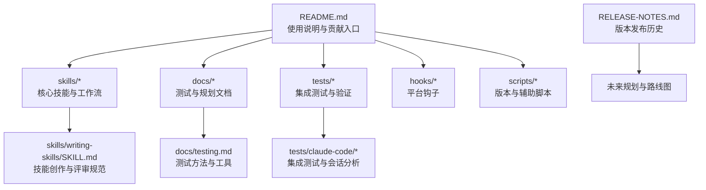
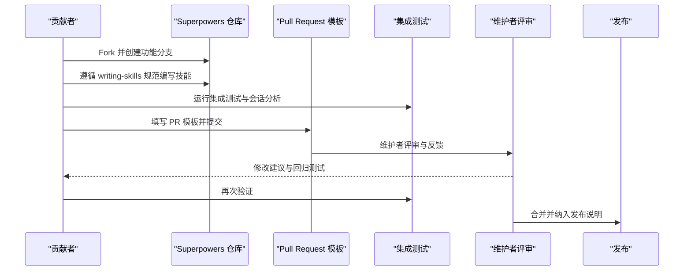
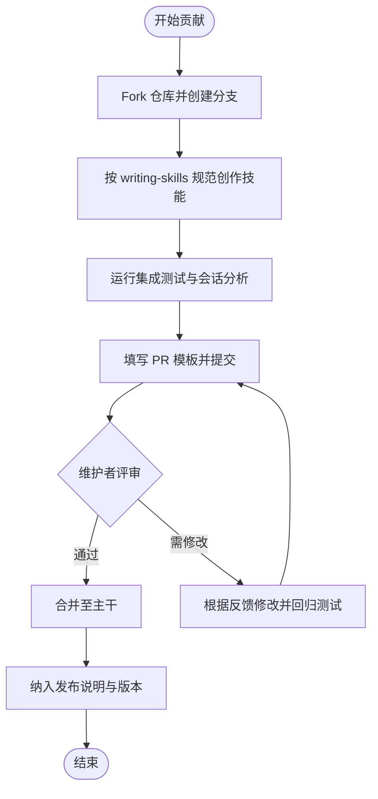
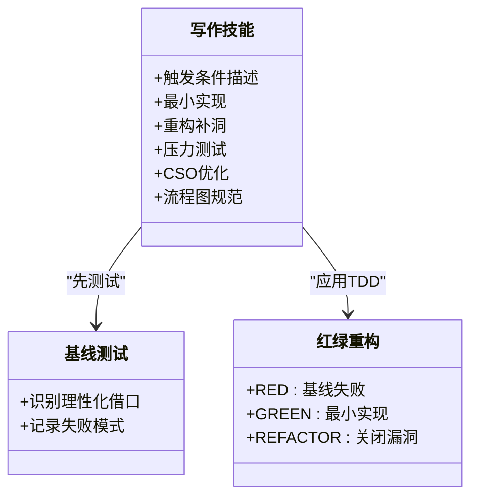
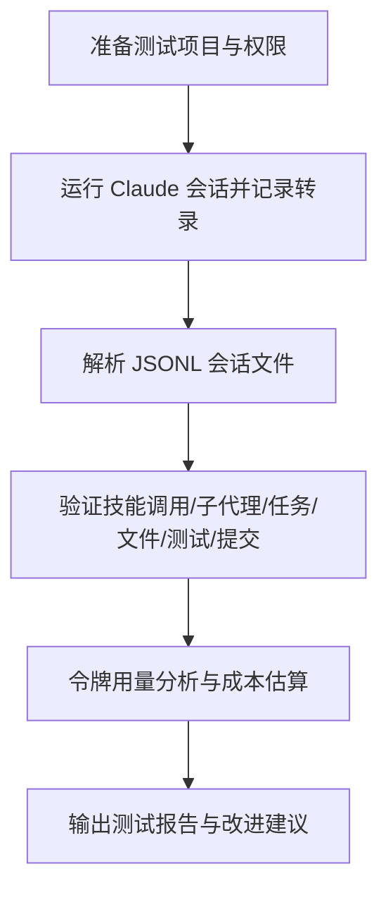
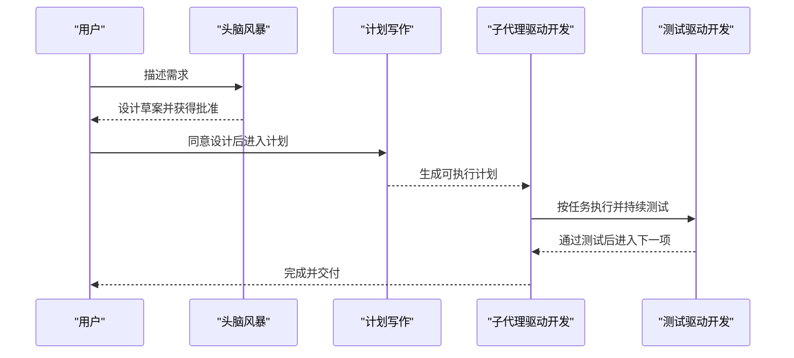
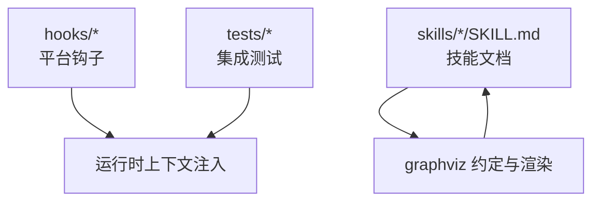

# 社区与贡献

<cite>
**本文引用的文件**
- [README.md](file://README.md)
- [CODE_OF_CONDUCT.md](file://CODE_OF_CONDUCT.md)
- [RELEASE-NOTES.md](file://RELEASE-NOTES.md)
- [.github/PULL_REQUEST_TEMPLATE.md](file://.github/PULL_REQUEST_TEMPLATE.md)
- [.github/FUNDING.yml](file://.github/FUNDING.yml)
- [skills/writing-skills/SKILL.md](file://skills/writing-skills/SKILL.md)
- [docs/testing.md](file://docs/testing.md)
- [skills/brainstorming/SKILL.md](file://skills/brainstorming/SKILL.md)
- [skills/systematic-debugging/SKILL.md](file://skills/systematic-debugging/SKILL.md)
- [skills/test-driven-development/SKILL.md](file://skills/test-driven-development/SKILL.md)
- [skills/writing-skills/examples/CLAUDE_MD_TESTING.md](file://skills/writing-skills/examples/CLAUDE_MD_TESTING.md)
- [skills/writing-skills/graphviz-conventions.dot](file://skills/writing-skills/graphviz-conventions.dot)
- [package.json](file://package.json)
</cite>

## 目录
1. [简介](#简介)
2. [项目结构](#项目结构)
3. [核心组件](#核心组件)
4. [架构总览](#架构总览)
5. [详细组件分析](#详细组件分析)
6. [依赖关系分析](#依赖关系分析)
7. [性能考量](#性能考量)
8. [故障排查指南](#故障排查指南)
9. [结论](#结论)
10. [附录](#附录)

## 简介
本指南面向 Superpowers 项目的社区成员与贡献者，提供从“如何参与贡献”到“如何报告问题与提出功能请求”的全流程说明；涵盖行为准则、社区资源与讨论渠道；明确代码贡献流程、测试与文档标准；并整理版本发布历史、更新日志与未来规划，帮助新老成员高效参与项目开发。

## 项目结构
Superpowers 是一个以“可组合技能（skills）”为核心的软件开发工作流系统，围绕“设计-计划-执行-收尾”的闭环流程组织技能与工具。仓库中包含：
- 核心技能与工作流：如头脑风暴、计划写作、子代理驱动开发、系统化调试、测试驱动开发等
- 测试与验证：集成测试脚本、会话转录解析、令牌用量分析工具
- 文档与规划：发布说明、路线图与设计文档
- 插件与平台支持：Claude Code、Cursor、Codex、OpenCode、Gemini CLI 等

图表来源
- [README.md:1-191](file://README.md#L1-L191)
- [skills/writing-skills/SKILL.md:1-656](file://skills/writing-skills/SKILL.md#L1-L656)
- [docs/testing.md:1-304](file://docs/testing.md#L1-L304)
- [RELEASE-NOTES.md:1-800](file://RELEASE-NOTES.md#L1-L800)

章节来源
- [README.md:1-191](file://README.md#L1-L191)
- [package.json:1-7](file://package.json#L1-L7)

## 核心组件
- 贡献入口与安装：通过不同平台插件市场或手动安装，遵循基本工作流与技能清单
- 行为准则：采用 Contributor Covenant，明确正向行为与违规处理流程
- 贡献流程：Fork 仓库、按技能创作规范创建分支、完成压力测试后提交 PR
- 测试与验证：集成测试、会话转录解析、令牌用量分析
- 发布与版本：发布说明与路线图，记录重大变更与未来方向

章节来源
- [README.md:161-191](file://README.md#L161-L191)
- [CODE_OF_CONDUCT.md:1-129](file://CODE_OF_CONDUCT.md#L1-L129)
- [RELEASE-NOTES.md:1-800](file://RELEASE-NOTES.md#L1-L800)

## 架构总览
Superpowers 的贡献与开发流程由“技能创作-测试-评审-发布”构成闭环，结合多平台钩子与测试工具，确保在真实会话中验证技能的有效性与稳定性。

图表来源
- [.github/PULL_REQUEST_TEMPLATE.md:1-88](file://.github/PULL_REQUEST_TEMPLATE.md#L1-L88)
- [docs/testing.md:1-304](file://docs/testing.md#L1-L304)
- [skills/writing-skills/SKILL.md:1-656](file://skills/writing-skills/SKILL.md#L1-L656)

## 详细组件分析

### 贡献流程与 PR 规范
- 提交前准备：确保 PR 针对单一问题，描述具体失败场景与用户体验，避免批量无关改动
- 适用范围：核心库仅接受通用技能与基础设施；特定领域/工具/工作流应独立发布插件
- 审查要求：必须有人类审查，且 PR 不得包含伪造内容或无证据的改动
- 环境与评估：填写环境信息、评估前后对比、展示对抗性压力测试结果

图表来源
- [.github/PULL_REQUEST_TEMPLATE.md:1-88](file://.github/PULL_REQUEST_TEMPLATE.md#L1-L88)
- [docs/testing.md:1-304](file://docs/testing.md#L1-L304)
- [skills/writing-skills/SKILL.md:1-656](file://skills/writing-skills/SKILL.md#L1-L656)

章节来源
- [.github/PULL_REQUEST_TEMPLATE.md:1-88](file://.github/PULL_REQUEST_TEMPLATE.md#L1-L88)
- [skills/writing-skills/SKILL.md:1-656](file://skills/writing-skills/SKILL.md#L1-L656)

### 问题报告与功能请求
- 问题报告：清晰描述“做了什么、哪里出了问题、模型的失败模式、最好附带会话记录”
- 功能请求：说明“为什么需要该能力”，并与现有技能/工作流的契合度
- 优先级与范围：优先解决影响广泛的问题；特定领域/工具/项目专属需求请发布独立插件

章节来源
- [.github/PULL_REQUEST_TEMPLATE.md:7-16](file://.github/PULL_REQUEST_TEMPLATE.md#L7-L16)
- [README.md:161-170](file://README.md#L161-L170)

### 行为准则与社区治理
- 承诺：营造开放、欢迎、多元、包容与健康的社区
- 正面行为：同理心、尊重差异、接受建设性反馈、承担责任
- 不当行为：骚扰、人身攻击、隐私泄露、不当言论等
- 执行：社区领袖负责澄清与执行标准，必要时移除不当内容并沟通原因
- 适用范围：社区空间与代表社区的公共场合
- 报告渠道：邮件 jesse@primeradiant.com

章节来源
- [CODE_OF_CONDUCT.md:1-129](file://CODE_OF_CONDUCT.md#L1-L129)

### 技能创作与评审规范（writing-skills）
- TDD 思想：先写“压力场景”（基线），再写技能，再重构补漏洞
- 结构与命名：清晰的触发条件描述、简洁的快速参考、必要的流程图与交叉引用
- 搜索优化（CSO）：描述字段聚焦触发症状，关键词覆盖错误、症状、工具名
- 流程图约定：仅用于非显而易见的决策点与循环，遵循统一样式与标签规范
- 压力测试：对抗时间压力、沉没成本、权威、疲惫等情境，记录理性化借口并针对性加固

图表来源
- [skills/writing-skills/SKILL.md:30-656](file://skills/writing-skills/SKILL.md#L30-L656)
- [skills/writing-skills/graphviz-conventions.dot:1-172](file://skills/writing-skills/graphviz-conventions.dot#L1-L172)

章节来源
- [skills/writing-skills/SKILL.md:1-656](file://skills/writing-skills/SKILL.md#L1-L656)
- [skills/writing-skills/examples/CLAUDE_MD_TESTING.md:1-190](file://skills/writing-skills/examples/CLAUDE_MD_TESTING.md#L1-L190)
- [skills/writing-skills/graphviz-conventions.dot:1-172](file://skills/writing-skills/graphviz-conventions.dot#L1-L172)

### 测试方法与工具
- 集成测试：在真实会话中运行复杂工作流，解析会话转录（JSONL）验证技能调用、子代理分发、任务跟踪、文件生成、测试通过与提交历史
- 令牌用量分析：统计主会话与各子代理的消息数、输入/输出令牌、缓存读取与总成本，便于成本控制与性能评估
- 故障排查：技能未加载、权限错误、超时、会话文件缺失等问题的定位与修复步骤

图表来源
- [docs/testing.md:20-304](file://docs/testing.md#L20-L304)

章节来源
- [docs/testing.md:1-304](file://docs/testing.md#L1-L304)

### 工作流与关键技能
- 头脑风暴（brainstorming）：在实现前强制设计与批准，包含硬性闸门、检查清单、自审与用户复核
- 系统化调试（systematic-debugging）：四阶段根因调查与修复，强调一次性修复与架构层面反思
- 测试驱动开发（test-driven-development）：红-绿-重构循环，杜绝“测试之后”与“精神而非仪式”

图表来源
- [skills/brainstorming/SKILL.md:1-165](file://skills/brainstorming/SKILL.md#L1-L165)
- [skills/systematic-debugging/SKILL.md:1-297](file://skills/systematic-debugging/SKILL.md#L1-L297)
- [skills/test-driven-development/SKILL.md:1-372](file://skills/test-driven-development/SKILL.md#L1-L372)

章节来源
- [skills/brainstorming/SKILL.md:1-165](file://skills/brainstorming/SKILL.md#L1-L165)
- [skills/systematic-debugging/SKILL.md:1-297](file://skills/systematic-debugging/SKILL.md#L1-L297)
- [skills/test-driven-development/SKILL.md:1-372](file://skills/test-driven-development/SKILL.md#L1-L372)

### 版本发布历史与未来规划
- 发布历史：涵盖平台支持、性能优化、流程改进、架构调整与重大变更（如强制子代理驱动开发、零依赖服务器、文档评审系统等）
- 未来规划：路线图与设计文档体现视觉头脑风暴、零依赖服务器、兼容性改进与文档评审系统等方向

章节来源
- [RELEASE-NOTES.md:1-800](file://RELEASE-NOTES.md#L1-L800)

## 依赖关系分析
- 平台钩子：hooks/* 适配不同平台的会话启动与上下文注入
- 测试依赖：tests/* 依赖 Claude Code 的 headless 运行与会话转录解析
- 文档与工具：graphviz 图形约定与渲染工具，提升技能流程可视化质量

图表来源
- [skills/writing-skills/graphviz-conventions.dot:1-172](file://skills/writing-skills/graphviz-conventions.dot#L1-L172)

章节来源
- [skills/writing-skills/graphviz-conventions.dot:1-172](file://skills/writing-skills/graphviz-conventions.dot#L1-L172)

## 性能考量
- 子代理评审循环优化：减少不必要的评审轮次与迭代上限，降低令牌消耗与执行时间
- 零依赖服务器：移除外部依赖，提升启动速度与运行稳定性
- 令牌用量分析：通过分析工具监控成本，指导任务复杂度与子代理数量的平衡

章节来源
- [RELEASE-NOTES.md:16-68](file://RELEASE-NOTES.md#L16-L68)
- [docs/testing.md:137-177](file://docs/testing.md#L137-L177)

## 故障排查指南
- 技能未加载：确认在插件目录运行、启用本地开发市场、检查技能存在
- 权限错误：使用绕过权限模式与目录授权，检查测试目录权限
- 超时问题：增加超时时间、检查技能逻辑中的死循环、评估子代理任务复杂度
- 会话文件缺失：在项目目录中查找最近会话、确认测试已实际运行

章节来源
- [docs/testing.md:178-215](file://docs/testing.md#L178-L215)

## 结论
Superpowers 通过“技能即流程”的方式，将测试驱动、系统化调试与协作评审融入自动化工作流。贡献者应遵循行为准则与 PR 规范，严格按技能创作与测试流程推进，确保变更在真实会话中得到验证，并通过发布说明与路线图持续演进。

## 附录
- 社区与讨论渠道：Discord 社区、GitHub Issues、发布通知订阅
- 支持与赞助：GitHub Sponsors
- 安装与更新：各平台插件市场与手动安装说明，更新命令示例

章节来源
- [README.md:184-191](file://README.md#L184-L191)
- [.github/FUNDING.yml:1-4](file://.github/FUNDING.yml#L1-L4)