# 功能特性概览

<cite>
**本文档引用的文件**
- [README.md](file://README.md)
- [skills/test-driven-development/SKILL.md](file://skills/test-driven-development/SKILL.md)
- [skills/systematic-debugging/SKILL.md](file://skills/systematic-debugging/SKILL.md)
- [skills/subagent-driven-development/SKILL.md](file://skills/subagent-driven-development/SKILL.md)
- [skills/brainstorming/SKILL.md](file://skills/brainstorming/SKILL.md)
- [skills/writing-plans/SKILL.md](file://skills/writing-plans/SKILL.md)
- [skills/dispatching-parallel-agents/SKILL.md](file://skills/dispatching-parallel-agents/SKILL.md)
- [skills/using-git-worktrees/SKILL.md](file://skills/using-git-worktrees/SKILL.md)
- [skills/verification-before-completion/SKILL.md](file://skills/verification-before-completion/SKILL.md)
- [skills/executing-plans/SKILL.md](file://skills/executing-plans/SKILL.md)
- [skills/finishing-a-development-branch/SKILL.md](file://skills/finishing-a-development-branch/SKILL.md)
- [skills/writing-skills/SKILL.md](file://skills/writing-skills/SKILL.md)
- [skills/using-superpowers/SKILL.md](file://skills/using-superpowers/SKILL.md)
- [docs/testing.md](file://docs/testing.md)
</cite>

## 目录
1. [简介](#简介)
2. [项目结构](#项目结构)
3. [核心组件](#核心组件)
4. [架构总览](#架构总览)
5. [详细组件分析](#详细组件分析)
6. [依赖关系分析](#依赖关系分析)
7. [性能考量](#性能考量)
8. [故障排除指南](#故障排除指南)
9. [结论](#结论)
10. [附录](#附录)

## 简介
Superpowers 是一套面向代码智能体的可组合“技能”（skills）集合与初始指令体系，旨在让智能体在构建任何功能前先进行系统化思考与规划，而非直接进入编码。其核心目标是通过强制性工作流确保高质量交付：从头脑风暴设计、到并行分支隔离开发、再到子代理驱动的迭代执行与审查，最终以证据驱动的完成验证收尾。

该系统强调“测试优先”“系统化调试”“并行开发分支管理”“子代理驱动开发”“头脑风暴设计”等能力，并通过自动触发机制减少人工干预，使智能体具备“超能力”。

## 项目结构
仓库采用按“技能”组织的模块化结构，每个技能独立成目录，包含技能说明文档与配套资源；同时提供测试框架与文档，支撑端到端集成验证。

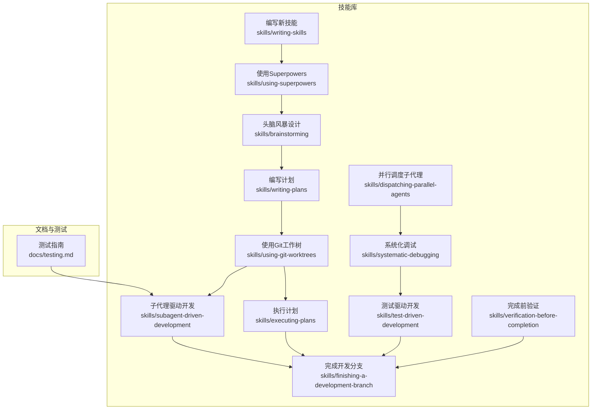

图示来源
- [README.md:108-151](file://README.md#L108-L151)
- [skills/brainstorming/SKILL.md:1-165](file://skills/brainstorming/SKILL.md#L1-L165)
- [skills/writing-plans/SKILL.md:1-153](file://skills/writing-plans/SKILL.md#L1-L153)
- [skills/using-git-worktrees/SKILL.md:1-219](file://skills/using-git-worktrees/SKILL.md#L1-L219)
- [skills/subagent-driven-development/SKILL.md:1-278](file://skills/subagent-driven-development/SKILL.md#L1-L278)
- [skills/executing-plans/SKILL.md:1-71](file://skills/executing-plans/SKILL.md#L1-L71)
- [skills/systematic-debugging/SKILL.md:1-297](file://skills/systematic-debugging/SKILL.md#L1-L297)
- [skills/test-driven-development/SKILL.md:1-372](file://skills/test-driven-development/SKILL.md#L1-L372)
- [skills/finishing-a-development-branch/SKILL.md:1-201](file://skills/finishing-a-development-branch/SKILL.md#L1-L201)
- [skills/verification-before-completion/SKILL.md:1-140](file://skills/verification-before-completion/SKILL.md#L1-L140)
- [skills/dispatching-parallel-agents/SKILL.md:1-183](file://skills/dispatching-parallel-agents/SKILL.md#L1-L183)
- [skills/writing-skills/SKILL.md:1-656](file://skills/writing-skills/SKILL.md#L1-L656)
- [skills/using-superpowers/SKILL.md:1-118](file://skills/using-superpowers/SKILL.md#L1-L118)
- [docs/testing.md:1-304](file://docs/testing.md#L1-L304)

章节来源
- [README.md:108-151](file://README.md#L108-L151)

## 核心组件
本节对 Superpowers 的关键技能进行分层解读，涵盖业务价值、技术优势与适用场景，并给出对比与最佳实践建议。

- 测试驱动开发（TDD）
  - 业务价值：以失败测试为起点，确保行为正确性与可验证性，降低回归风险。
  - 技术优势：严格的红-绿-重构循环，避免“测试后写法”，提升测试质量与代码内聚性。
  - 适用场景：新功能实现、缺陷修复、重构与行为变更。
  - 对比传统方法：传统“测试后补写”易忽略边界与错误路径，TDD以失败验证确保覆盖。
  - 最佳实践：严格遵守“先失败再通过”的原则，测试命名清晰、单一职责，最小实现通过后再重构。

- 系统化调试
  - 业务价值：在修复前先定位根因，避免症状式修复导致的反复与副作用。
  - 技术优势：四阶段流程（根因调查→模式分析→假设验证→实施），多层证据收集与回溯。
  - 适用场景：测试失败、生产缺陷、性能问题、构建失败、集成异常。
  - 对比现有AI工具：多数工具仅给出修复建议，系统化调试强调“先证伪再修复”的科学方法。
  - 最佳实践：在多组件系统中逐层注入诊断信息，必要时进行数据流回溯，形成可重复的失败测试。

- 子代理驱动开发
  - 业务价值：以任务为中心的子代理协作，实现高并发、低耦合的快速迭代。
  - 技术优势：每任务一次全新上下文，两阶段审查（规范符合性→代码质量），自动复核闭环。
  - 适用场景：已制定详细计划且任务相对独立的实现阶段。
  - 对比“手动执行/批量执行”：前者易受上下文污染，后者缺乏自动审查与质量门禁。
  - 最佳实践：按任务粒度拆分、明确模型选择策略、严格遵循审查顺序与重审机制。

- 头脑风暴设计
  - 业务价值：在实现前沉淀完整设计，降低需求偏差与返工成本。
  - 技术优势：逐步澄清目标、提出多种方案、分段展示与审批、生成可追溯的设计文档。
  - 适用场景：新增功能、组件改造、行为变更。
  - 对比传统敏捷：传统敏捷常在早期偏向“快速编码”，头脑风暴强调“先设计后实现”的强制前置。
  - 最佳实践：按复杂度分段呈现设计，进行自检与用户评审，确保无歧义与范围收敛。

- 并行开发分支管理
  - 业务价值：通过隔离工作树并行推进多个任务或修复，显著缩短交付周期。
  - 技术优势：统一目录策略、安全校验、自动基线验证、清理与合并选项。
  - 适用场景：多任务并行、跨子系统修复、需要隔离验证的实验性改动。
  - 对比传统分支：传统分支易污染主干或产生冲突，工作树隔离避免共享状态干扰。
  - 最佳实践：严格遵守工作树忽略规则与基线验证，按需选择合并/PR/保留/丢弃策略。

- 执行计划与并行调度
  - 业务价值：在有计划的前提下高效落地，支持同会话或跨会话两种执行方式。
  - 技术优势：批处理执行与检查点，或子代理逐项执行并自动审查。
  - 适用场景：计划明确但平台不支持子代理，或需要人类在关键节点介入。
  - 最佳实践：优先子代理驱动，若平台限制则采用执行计划并设置关键检查点。

- 完成前验证
  - 业务价值：在宣称完成前强制运行验证命令，杜绝“我以为”式交付。
  - 技术优势：明确的“识别→运行→阅读→验证→声明”流程，禁止主观臆断。
  - 适用场景：提交、创建PR、切换任务、委托给子代理。
  - 最佳实践：将验证命令标准化，形成清单与自动化脚本，避免部分验证与代理报告依赖。

- 编写新技能
  - 业务价值：将“技能创作”本身也纳入TDD范式，确保技能可发现、可执行、可鲁棒。
  - 技术优势：压力场景测试、反理性化表格、红灯清单、搜索优化（CSO）。
  - 适用场景：新增流程规范、工具使用指南、模式提炼。
  - 最佳实践：以“描述字段只写触发条件，不总结流程”为准则，保持简洁与可检索性。

章节来源
- [skills/test-driven-development/SKILL.md:1-372](file://skills/test-driven-development/SKILL.md#L1-L372)
- [skills/systematic-debugging/SKILL.md:1-297](file://skills/systematic-debugging/SKILL.md#L1-L297)
- [skills/subagent-driven-development/SKILL.md:1-278](file://skills/subagent-driven-development/SKILL.md#L1-L278)
- [skills/brainstorming/SKILL.md:1-165](file://skills/brainstorming/SKILL.md#L1-L165)
- [skills/using-git-worktrees/SKILL.md:1-219](file://skills/using-git-worktrees/SKILL.md#L1-L219)
- [skills/executing-plans/SKILL.md:1-71](file://skills/executing-plans/SKILL.md#L1-L71)
- [skills/verification-before-completion/SKILL.md:1-140](file://skills/verification-before-completion/SKILL.md#L1-L140)
- [skills/writing-skills/SKILL.md:1-656](file://skills/writing-skills/SKILL.md#L1-L656)

## 架构总览
Superpowers 将“设计-隔离-计划-执行-验证-收尾”串联为强制性工作流，技能之间存在调用与依赖关系，确保过程可控与结果可验证。

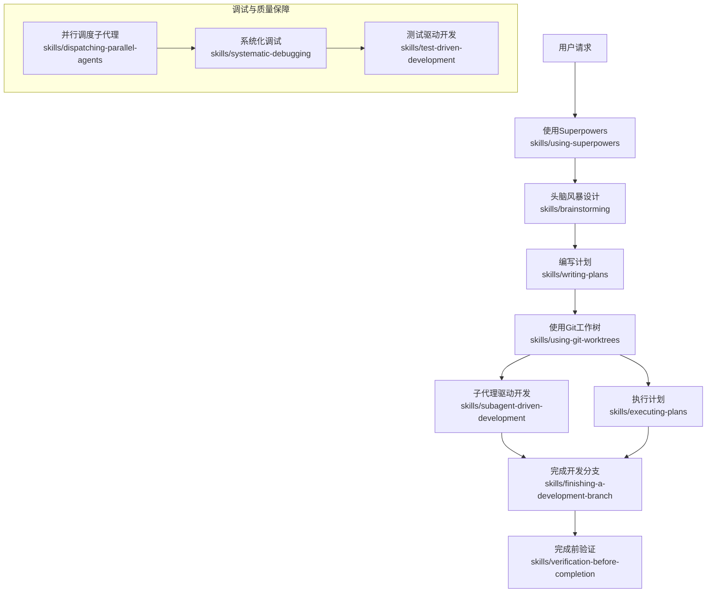

图示来源
- [README.md:108-151](file://README.md#L108-L151)
- [skills/using-superpowers/SKILL.md:1-118](file://skills/using-superpowers/SKILL.md#L1-L118)
- [skills/brainstorming/SKILL.md:1-165](file://skills/brainstorming/SKILL.md#L1-L165)
- [skills/writing-plans/SKILL.md:1-153](file://skills/writing-plans/SKILL.md#L1-L153)
- [skills/using-git-worktrees/SKILL.md:1-219](file://skills/using-git-worktrees/SKILL.md#L1-L219)
- [skills/subagent-driven-development/SKILL.md:1-278](file://skills/subagent-driven-development/SKILL.md#L1-L278)
- [skills/executing-plans/SKILL.md:1-71](file://skills/executing-plans/SKILL.md#L1-L71)
- [skills/finishing-a-development-branch/SKILL.md:1-201](file://skills/finishing-a-development-branch/SKILL.md#L1-L201)
- [skills/verification-before-completion/SKILL.md:1-140](file://skills/verification-before-completion/SKILL.md#L1-L140)
- [skills/systematic-debugging/SKILL.md:1-297](file://skills/systematic-debugging/SKILL.md#L1-L297)
- [skills/test-driven-development/SKILL.md:1-372](file://skills/test-driven-development/SKILL.md#L1-L372)
- [skills/dispatching-parallel-agents/SKILL.md:1-183](file://skills/dispatching-parallel-agents/SKILL.md#L1-L183)

## 详细组件分析

### 测试驱动开发（TDD）
- 核心流程：红（写失败测试）→绿（最小实现通过）→重构（清理与改进），循环推进。
- 关键约束：严禁“先写实现再写测试”，测试必须失败后再通过，测试通过后方可提交。
- 验证清单：是否每个新函数都有测试、是否每个测试都先失败、是否使用真实代码而非模拟等。
- 与系统化调试联动：发现缺陷即刻写失败测试，回归时验证修复与防止再发。

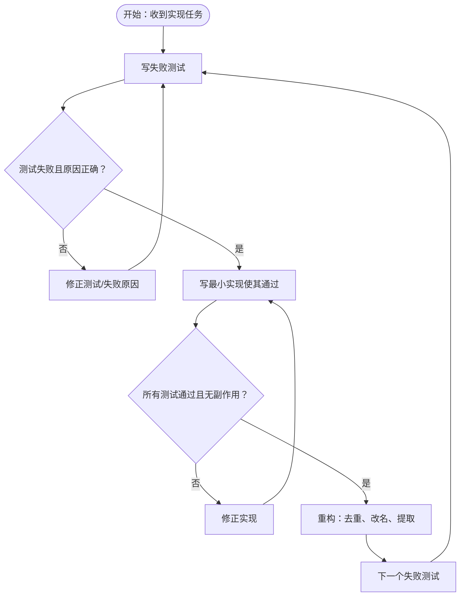

图示来源
- [skills/test-driven-development/SKILL.md:47-197](file://skills/test-driven-development/SKILL.md#L47-L197)

章节来源
- [skills/test-driven-development/SKILL.md:1-372](file://skills/test-driven-development/SKILL.md#L1-L372)

### 系统化调试
- 四阶段流程：根因调查→模式分析→假设与测试→实施与验证。
- 多层证据：在多组件链路中逐层记录输入输出与环境变量，定位失败边界。
- 数据流回溯：从异常值出发向上追踪来源，避免在症状处止步。
- 与TDD结合：实施前必须创建失败测试，确保修复可验证且可回归。

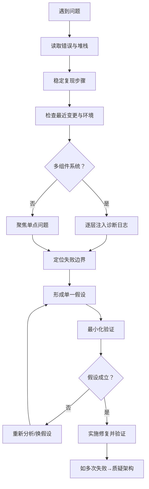

图示来源
- [skills/systematic-debugging/SKILL.md:46-214](file://skills/systematic-debugging/SKILL.md#L46-L214)

章节来源
- [skills/systematic-debugging/SKILL.md:1-297](file://skills/systematic-debugging/SKILL.md#L1-L297)

### 子代理驱动开发
- 两阶段审查：规范符合性审查（Spec Reviewer）→代码质量审查（Code Quality Reviewer）。
- 每任务一次全新上下文，避免历史污染；支持根据任务复杂度选择不同模型。
- 与计划执行配合：任务完成后自动进入最终代码审查与分支收尾。

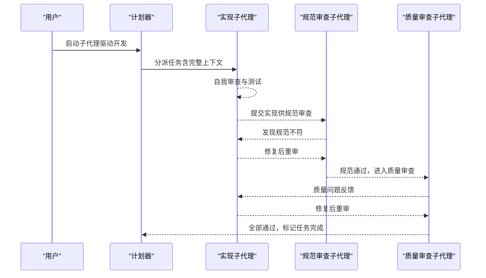

图示来源
- [skills/subagent-driven-development/SKILL.md:40-84](file://skills/subagent-driven-development/SKILL.md#L40-L84)

章节来源
- [skills/subagent-driven-development/SKILL.md:1-278](file://skills/subagent-driven-development/SKILL.md#L1-L278)

### 头脑风暴设计
- 强制前置：在任何实现技能之前，必须完成设计并通过审批。
- 设计文档化：按复杂度分段呈现，逐段获得用户确认后保存为规范文档。
- 可视化辅助：在涉及视觉内容时提供浏览器伴侔回答，提升沟通效率。

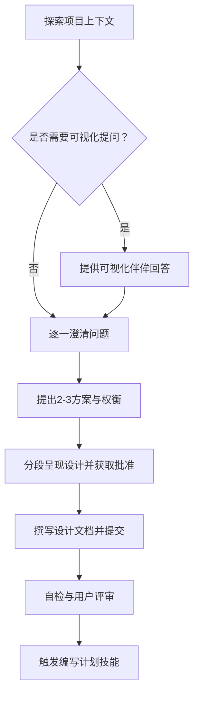

图示来源
- [skills/brainstorming/SKILL.md:34-66](file://skills/brainstorming/SKILL.md#L34-L66)

章节来源
- [skills/brainstorming/SKILL.md:1-165](file://skills/brainstorming/SKILL.md#L1-L165)

### 并行开发分支管理（Git Worktrees）
- 目录策略：优先使用项目内隐藏目录，其次全局配置，最后交互选择。
- 安全校验：创建前验证目录被忽略，避免误提交工作树内容。
- 基线验证：安装依赖并运行测试，确保工作树干净。
- 收尾清理：根据合并/PR/保留/丢弃策略清理工作树与分支。

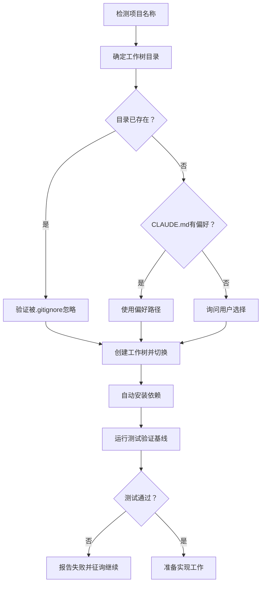

图示来源
- [skills/using-git-worktrees/SKILL.md:16-143](file://skills/using-git-worktrees/SKILL.md#L16-L143)

章节来源
- [skills/using-git-worktrees/SKILL.md:1-219](file://skills/using-git-worktrees/SKILL.md#L1-L219)

### 执行计划与并行调度
- 执行计划（跨会话）：加载计划→批判性审查→按步骤执行→关键检查点→收尾。
- 并行调度子代理：针对相互独立的问题域，一次性分派多个子代理并行调查，最后整合验证。

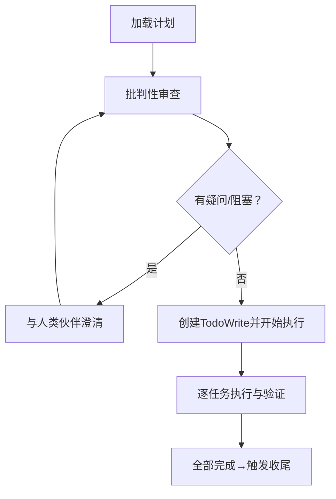

图示来源
- [skills/executing-plans/SKILL.md:16-38](file://skills/executing-plans/SKILL.md#L16-L38)
- [skills/dispatching-parallel-agents/SKILL.md:16-46](file://skills/dispatching-parallel-agents/SKILL.md#L16-L46)

章节来源
- [skills/executing-plans/SKILL.md:1-71](file://skills/executing-plans/SKILL.md#L1-L71)
- [skills/dispatching-parallel-agents/SKILL.md:1-183](file://skills/dispatching-parallel-agents/SKILL.md#L1-L183)

### 完成前验证
- 明确流程：识别→运行→阅读→验证→声明，禁止主观臆断与部分验证。
- 适用范围：测试通过、构建成功、缺陷修复、回归测试、代理报告、要求满足等。

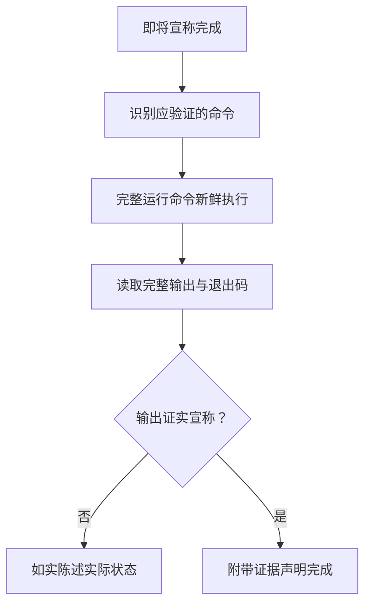

图示来源
- [skills/verification-before-completion/SKILL.md:24-38](file://skills/verification-before-completion/SKILL.md#L24-L38)

章节来源
- [skills/verification-before-completion/SKILL.md:1-140](file://skills/verification-before-completion/SKILL.md#L1-L140)

### 编写新技能（技能工程）
- 将TDD应用于技能创作：压力场景→基准行为→最小技能→重构漏洞→部署。
- 搜索优化（CSO）：描述字段仅写触发条件，关键词覆盖、命名动词化、交叉引用。
- 反理性化表格与红灯清单：系统性封堵“精神替代形式”的常见借口。

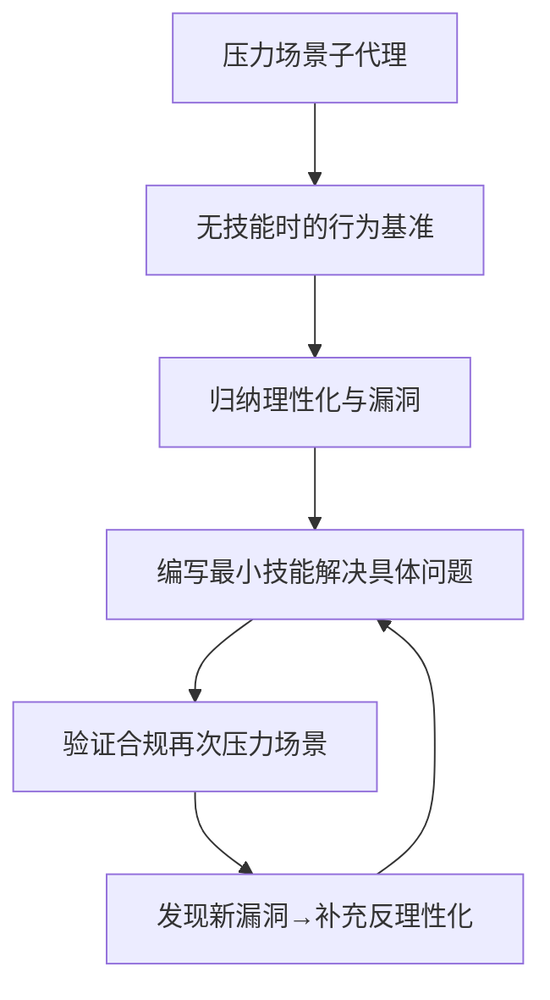

图示来源
- [skills/writing-skills/SKILL.md:30-62](file://skills/writing-skills/SKILL.md#L30-L62)

章节来源
- [skills/writing-skills/SKILL.md:1-656](file://skills/writing-skills/SKILL.md#L1-L656)

## 依赖关系分析
- 调用关系：头脑风暴设计 → 编写计划；编写计划 → 使用Git工作树；使用Git工作树 → 子代理驱动开发/执行计划；完成后 → 完成开发分支；完成前 → 完成前验证。
- 质量保障：系统化调试与TDD贯穿始终；并行调度用于多问题域并行调查；完成前验证作为最终门禁。
- 技能优先级：过程类技能（设计/调试）优先于实现类技能；当多技能可用时，按“过程技能优先”排序。

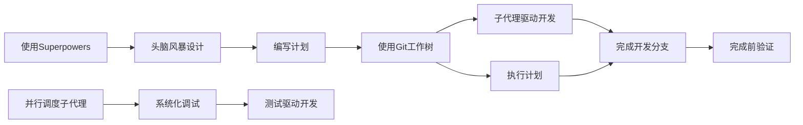

图示来源
- [README.md:108-151](file://README.md#L108-L151)
- [skills/using-superpowers/SKILL.md:97-114](file://skills/using-superpowers/SKILL.md#L97-L114)

章节来源
- [README.md:108-151](file://README.md#L108-L151)
- [skills/using-superpowers/SKILL.md:1-118](file://skills/using-superpowers/SKILL.md#L1-L118)

## 性能考量
- 子代理成本控制：按任务复杂度选择模型，机械实现用便宜模型，集成与判断用标准模型，架构与评审用最强模型。
- 并行收益：多任务并行与工作树隔离显著缩短交付周期，减少冲突与回滚。
- 验证前置：完成前验证避免无效提交与PR，降低后续返工成本。
- 测试开销：集成测试在真实会话中运行，耗时较长但能真实反映端到端效果；可通过会话转录解析与令牌分析工具评估成本。

## 故障排除指南
- 子代理未触发/技能未加载
  - 确认在插件目录运行测试，检查本地市场启用与技能存在性。
  - 参考：[docs/testing.md:180-188](file://docs/testing.md#L180-L188)
- 权限问题
  - 使用权限绕过标志与目录授权，检查临时目录权限。
  - 参考：[docs/testing.md:189-197](file://docs/testing.md#L189-L197)
- 测试超时
  - 增加超时时间，排查子代理任务复杂度与无限循环。
  - 参考：[docs/testing.md:198-206](file://docs/testing.md#L198-L206)
- 会话文件缺失
  - 在项目会话目录查找最新.jsonl文件，确认测试已执行。
  - 参考：[docs/testing.md:207-215](file://docs/testing.md#L207-L215)

章节来源
- [docs/testing.md:178-304](file://docs/testing.md#L178-L304)

## 结论
Superpowers 通过“设计-隔离-计划-执行-验证-收尾”的强制性工作流，将测试驱动、系统化调试、并行分支管理、子代理协作与完成前验证有机融合，形成可复制、可验证、可扩展的智能体开发范式。相较传统方法与现有AI工具，其优势在于：以证据驱动的完成声明、以失败测试为入口的质量门禁、以工作树隔离的并行交付、以两阶段审查的持续质量保障。建议在团队内推广“使用Superpowers”作为默认前置流程，配合技能工程与测试体系，持续提升交付质量与效率。

## 附录
- 使用示例与最佳实践
  - 设计阶段：先头脑风暴再编写计划，按复杂度分段呈现，逐段获得批准。
  - 实现阶段：优先子代理驱动开发，按任务粒度拆分，两阶段审查闭环。
  - 调试阶段：系统化调试四阶段，多层证据与数据流回溯，失败测试先行。
  - 收尾阶段：完成前验证，严格遵循“识别→运行→阅读→验证→声明”流程。
  - 技能创作：以压力场景测试技能，构建反理性化表格与红灯清单，保持描述字段仅触发条件。

- 对比与创新点
  - 对比传统软件开发：强制前置设计与测试，避免“先做后想”导致的返工。
  - 对比现有AI开发工具：以系统化调试替代“症状式修复”，以工作树隔离替代“主干污染”。
  - 创新点：技能工程的TDD范式、两阶段审查的自动化质量门禁、并行工作树的规模化交付。