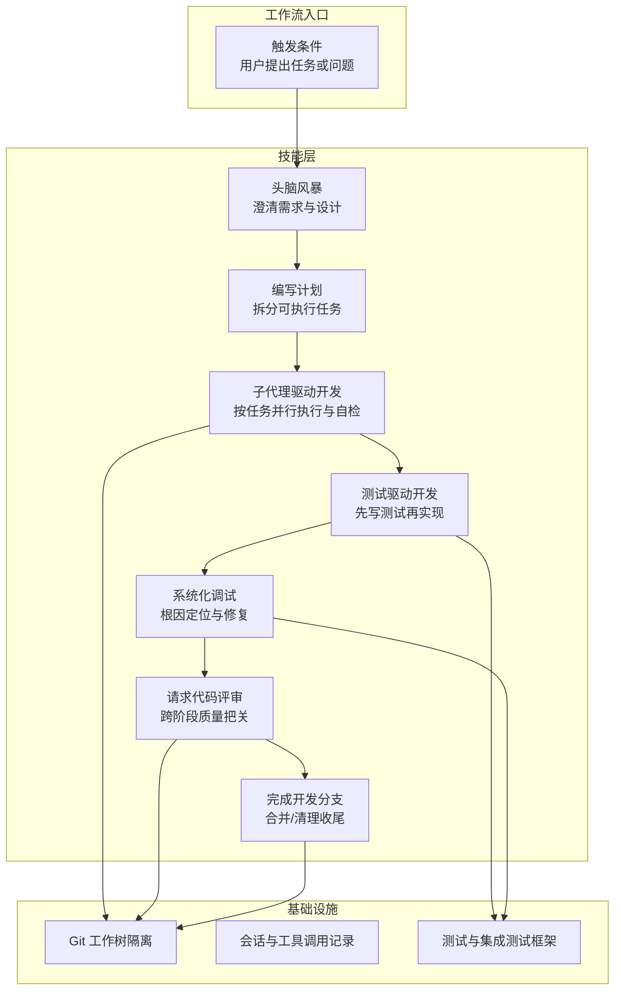
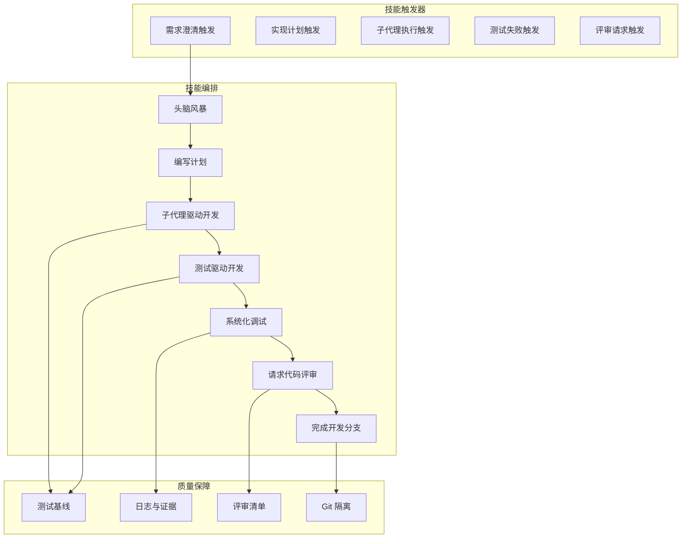
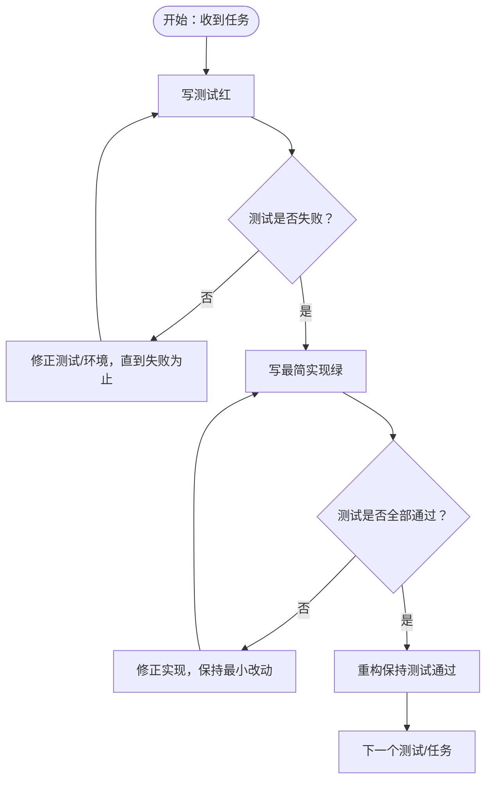
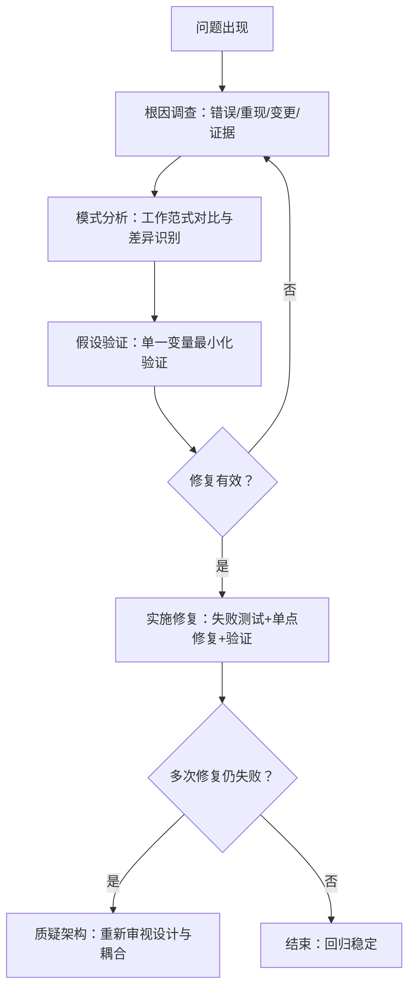
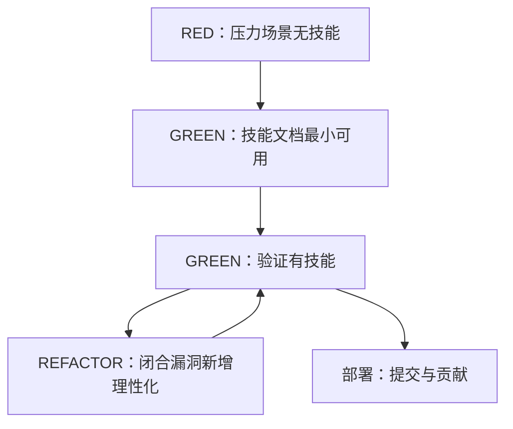
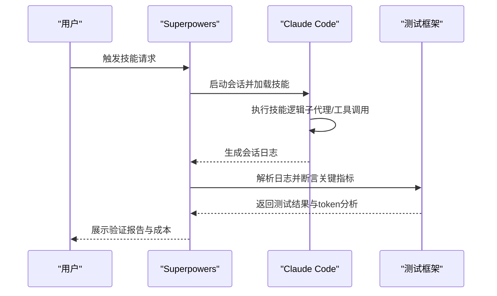
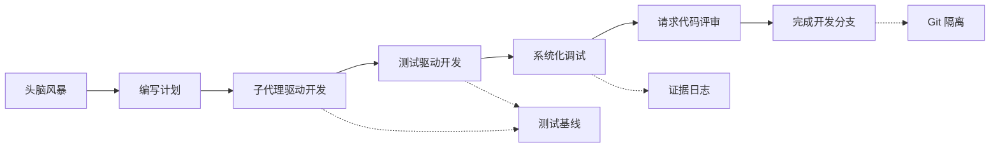

# 哲学理念

<cite>
**本文档引用的文件**
- [README.md](file://README.md)
- [docs/testing.md](file://docs/testing.md)
- [skills/test-driven-development/SKILL.md](file://skills/test-driven-development/SKILL.md)
- [skills/systematic-debugging/SKILL.md](file://skills/systematic-debugging/SKILL.md)
- [skills/systematic-debugging/root-cause-tracing.md](file://skills/systematic-debugging/root-cause-tracing.md)
- [skills/systematic-debugging/defense-in-depth.md](file://skills/systematic-debugging/defense-in-depth.md)
- [skills/systematic-debugging/condition-based-waiting.md](file://skills/systematic-debugging/condition-based-waiting.md)
- [skills/writing-skills/SKILL.md](file://skills/writing-skills/SKILL.md)
- [skills/writing-skills/anthropic-best-practices.md](file://skills/writing-skills/anthropic-best-practices.md)
- [skills/writing-skills/render-graphs.js](file://skills/writing-skills/render-graphs.js)
- [skills/writing-skills/graphviz-conventions.dot](file://skills/writing-skills/graphviz-conventions.dot)
- [skills/writing-skills/persuasion-principles.md](file://skills/writing-skills/persuasion-principles.md)
- [skills/test-driven-development/testing-anti-patterns.md](file://skills/test-driven-development/testing-anti-patterns.md)
- [tests/claude-code/test-helpers.sh](file://tests/claude-code/test-helpers.sh)
- [CHANGELOG.md](file://CHANGELOG.md)
</cite>

## 目录
1. [引言](#引言)
2. [项目结构](#项目结构)
3. [核心组件](#核心组件)
4. [架构总览](#架构总览)
5. [详细组件分析](#详细组件分析)
6. [依赖关系分析](#依赖关系分析)
7. [性能考量](#性能考量)
8. [故障排除指南](#故障排除指南)
9. [结论](#结论)
10. [附录](#附录)

## 引言
本文件系统性阐述 Superpowers 的设计哲学与核心价值观，围绕测试驱动开发（TDD）、系统化方法、复杂度降低与证据导向四大原则展开，解释它们如何指导技能设计与工作流程构建，并说明与传统软件开发实践的关系及改进之处。同时提供可操作的实践指导与应用场景，帮助读者在日常开发中有效体现这些理念。

## 项目结构
Superpowers 是一个以“可组合技能”为核心的开发工作流体系，通过一系列“技能”（Skills）实现从需求澄清到代码实现、测试验证、调试修复、评审合并的全链路自动化与半自动化协作。项目采用“技能即文档”的方式，强调可发现性、可测试性与可迭代性。

图示来源
- [README.md:108-125](file://README.md#L108-L125)
- [README.md:126-151](file://README.md#L126-L151)

章节来源
- [README.md:108-151](file://README.md#L108-L151)

## 核心组件
- 测试驱动开发（TDD）
  - 先写测试，再实现，再重构；严格禁止“测试后补写”和“参考代码”式实现。
  - 通过红-绿-重构循环确保行为正确、边界清晰、无多余功能。
- 系统化调试（Root Cause Investigation）
  - 四阶段：根因调查、模式分析、假设验证、实施修复；强调“先定位，后修复”，避免症状性修补。
- 复杂度降低（YAGNI/DRY）
  - 每个测试只覆盖一个行为；最小可用实现；消除重复与过度设计。
- 证据导向（Verification Before Completion）
  - 所有变更必须通过可重复的测试与日志证据验证，拒绝“看起来应该可行”的主观判断。

章节来源
- [README.md:152-157](file://README.md#L152-L157)
- [skills/test-driven-development/SKILL.md:31-46](file://skills/test-driven-development/SKILL.md#L31-L46)
- [skills/systematic-debugging/SKILL.md:16-23](file://skills/systematic-debugging/SKILL.md#L16-L23)

## 架构总览
Superpowers 的“技能”是可组合的工作单元，每个技能定义明确的触发条件、核心原则、流程步骤与常见陷阱。技能之间通过“触发-执行-反馈-迭代”的闭环协同，形成可扩展的开发工作流。

图示来源
- [README.md:108-125](file://README.md#L108-L125)
- [skills/writing-skills/SKILL.md:30-46](file://skills/writing-skills/SKILL.md#L30-L46)

## 详细组件分析

### 测试驱动开发（TDD）
- 基本原则
  - “没有失败的测试，就没有生产代码”；测试必须先于实现。
  - 红-绿-重构：先让测试失败，再写出刚好能通过的实现，最后重构保持简洁。
- 抗反模式清单
  - 不要测试 mock 行为，而要测试真实行为。
  - 生产类不要添加仅用于测试的方法。
  - 不要不理解依赖就进行模拟。
- 实践要点
  - 每个新函数/方法都应有对应测试。
  - 使用真实代码而非 mock（除非不可避免）。
  - 边界与错误场景必须覆盖。

图示来源
- [skills/test-driven-development/SKILL.md:47-69](file://skills/test-driven-development/SKILL.md#L47-L69)

章节来源
- [skills/test-driven-development/SKILL.md:16-46](file://skills/test-driven-development/SKILL.md#L16-L46)
- [skills/test-driven-development/testing-anti-patterns.md:13-20](file://skills/test-driven-development/testing-anti-patterns.md#L13-L20)

### 系统化调试（Root Cause Investigation）
- 四阶段流程
  - 根因调查：读取错误信息、重现问题、检查最近变更、多组件证据收集。
  - 模式分析：寻找已知工作范式、对比差异、理解依赖。
  - 假设验证：单一变量最小化验证、失败即回退。
  - 实施修复：创建失败测试、单点修复、验证效果、必要时质疑架构。
- 支撑技术
  - 根因追溯：从异常点向上回溯，找到最初触发源。
  - 防御式纵深：在多个层次增加校验，使缺陷结构上不可能发生。
  - 条件等待：基于实际条件轮询，替代任意超时。

图示来源
- [skills/systematic-debugging/SKILL.md:46-170](file://skills/systematic-debugging/SKILL.md#L46-L170)
- [skills/systematic-debugging/root-cause-tracing.md:32-152](file://skills/systematic-debugging/root-cause-tracing.md#L32-L152)
- [skills/systematic-debugging/defense-in-depth.md:20-123](file://skills/systematic-debugging/defense-in-depth.md#L20-L123)
- [skills/systematic-debugging/condition-based-waiting.md:9-116](file://skills/systematic-debugging/condition-based-waiting.md#L9-L116)

章节来源
- [skills/systematic-debugging/SKILL.md:24-45](file://skills/systematic-debugging/SKILL.md#L24-L45)
- [skills/systematic-debugging/root-cause-tracing.md:109-170](file://skills/systematic-debugging/root-cause-tracing.md#L109-L170)
- [skills/systematic-debugging/defense-in-depth.md:87-123](file://skills/systematic-debugging/defense-in-depth.md#L87-L123)
- [skills/systematic-debugging/condition-based-waiting.md:84-116](file://skills/systematic-debugging/condition-based-waiting.md#L84-L116)

### 技能创作（Writing Skills）与测试驱动的文档
- 将 TDD 应用于技能文档：先写压力场景（基线），再写技能文档，再验证合规，最后闭合漏洞。
- 关键要素
  - 描述字段聚焦“何时使用”，避免总结流程。
  - 结构化流程图仅在非显见决策时使用。
  - 使用“说服原理”强化纪律型技能的强制性语言与承诺机制。
- 可视化与可维护性
  - Graphviz 图表渲染工具与样式规范，确保流程图清晰一致。

图示来源
- [skills/writing-skills/SKILL.md:30-656](file://skills/writing-skills/SKILL.md#L30-L656)
- [skills/writing-skills/anthropic-best-practices.md:144-502](file://skills/writing-skills/anthropic-best-practices.md#L144-L502)
- [skills/writing-skills/render-graphs.js:1-169](file://skills/writing-skills/render-graphs.js#L1-L169)
- [skills/writing-skills/graphviz-conventions.dot:1-172](file://skills/writing-skills/graphviz-conventions.dot#L1-L172)
- [skills/writing-skills/persuasion-principles.md:9-134](file://skills/writing-skills/persuasion-principles.md#L9-L134)

章节来源
- [skills/writing-skills/SKILL.md:10-21](file://skills/writing-skills/SKILL.md#L10-L21)
- [skills/writing-skills/anthropic-best-practices.md:185-234](file://skills/writing-skills/anthropic-best-practices.md#L185-L234)
- [skills/writing-skills/persuasion-principles.md:126-134](file://skills/writing-skills/persuasion-principles.md#L126-L134)

### 测试与验证（Integration Tests）
- 集成测试通过真实会话运行技能，解析会话日志验证关键行为（工具调用、文件生成、测试通过、提交历史等）。
- 要求
  - 在插件目录内运行，启用本地开发市场，授予必要权限。
  - 使用 token 分析工具追踪成本与效率。
- 输出与分析
  - 验证技能被调用、子代理被派发、任务跟踪、实现文件创建、测试通过、提交历史等。
  - 提供每子代理 token 使用明细与总成本估算。

图示来源
- [docs/testing.md:20-135](file://docs/testing.md#L20-L135)
- [tests/claude-code/test-helpers.sh:1-203](file://tests/claude-code/test-helpers.sh#L1-L203)

章节来源
- [docs/testing.md:34-135](file://docs/testing.md#L34-L135)
- [tests/claude-code/test-helpers.sh:125-193](file://tests/claude-code/test-helpers.sh#L125-L193)

## 依赖关系分析
- 技能之间的触发与依赖
  - 头脑风暴 → 编写计划 → 子代理驱动开发 → 测试驱动开发 → 系统化调试 → 请求代码评审 → 完成开发分支。
- 质量保障依赖
  - 测试基线与证据日志贯穿实现与调试阶段。
  - Git 工作树隔离保证并行开发与安全回滚。
- 文档与可视化工具
  - Graphviz 渲染工具与样式规范确保技能流程图的一致性与可读性。

图示来源
- [README.md:108-125](file://README.md#L108-L125)
- [skills/writing-skills/render-graphs.js:1-169](file://skills/writing-skills/render-graphs.js#L1-L169)
- [skills/writing-skills/graphviz-conventions.dot:1-172](file://skills/writing-skills/graphviz-conventions.dot#L1-L172)

章节来源
- [README.md:108-125](file://README.md#L108-L125)

## 性能考量
- 成本控制
  - 通过 token 分析工具监控输入/输出/缓存命中，估算每次任务的成本范围，避免不必要的上下文膨胀。
- 效率优化
  - 条件等待替代任意超时，减少重试与竞态，提升稳定性与速度。
  - 防御式纵深在多层校验中提前拦截问题，降低后期修复成本。
- 可靠性
  - 严格的基线测试与会话日志解析，确保复杂流程的可重复性与可观测性。

## 故障排除指南
- 技能未加载
  - 确认在插件目录内运行、本地开发市场已启用、技能存在于 skills 目录。
- 权限错误
  - 使用权限绕过标志与目录授权，检查测试目录权限。
- 超时问题
  - 延长超时时间、排查技能逻辑中的死循环、评估子代理任务复杂度。
- 会话文件缺失
  - 检查正确的项目目录、使用查找命令定位近期会话、确认测试确实执行。

章节来源
- [docs/testing.md:178-215](file://docs/testing.md#L178-L215)

## 结论
Superpowers 的哲学以“证据导向”为核心，通过“系统化方法”确保过程可控，“测试驱动开发”保证质量，“复杂度降低”维持可维护性。技能即文档的理念与 TDD 相结合，形成可测试、可迭代、可传播的知识体系。相比传统实践，Superpowers 更强调“自动化的纪律”与“可验证的证据”，在团队协作与工程效率上提供系统性改进。

## 附录
- 实践建议
  - 在任何实现前先写测试，坚持红-绿-重构循环。
  - 遇到问题先定位根因，再实施修复，必要时质疑架构。
  - 使用 Graphviz 绘制流程图，统一命名与标签规范。
  - 通过集成测试验证技能在真实会话中的表现，并持续优化。
- 参考资源
  - 技能创作最佳实践与说服原理，帮助设计更有效的纪律型技能。

章节来源
- [skills/writing-skills/anthropic-best-practices.md:144-502](file://skills/writing-skills/anthropic-best-practices.md#L144-L502)
- [skills/writing-skills/persuasion-principles.md:135-188](file://skills/writing-skills/persuasion-principles.md#L135-L188)
- [CHANGELOG.md:1-14](file://CHANGELOG.md#L1-L14)