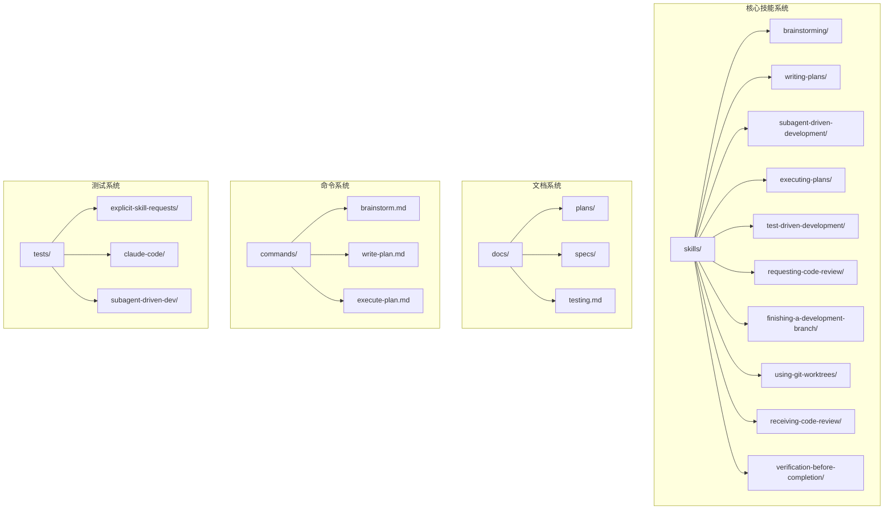
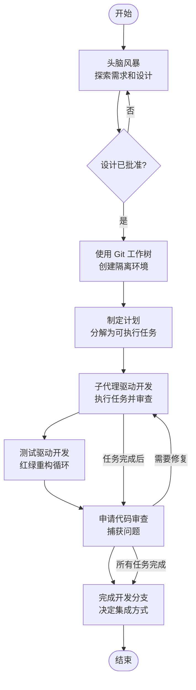
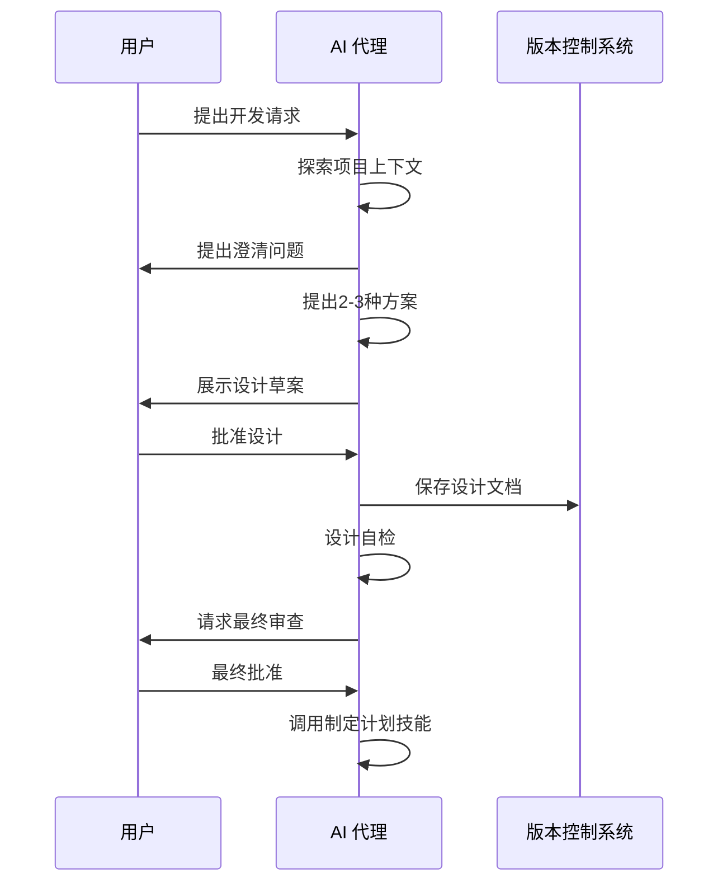
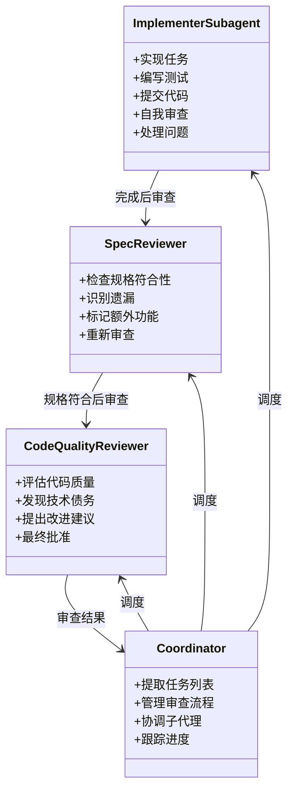
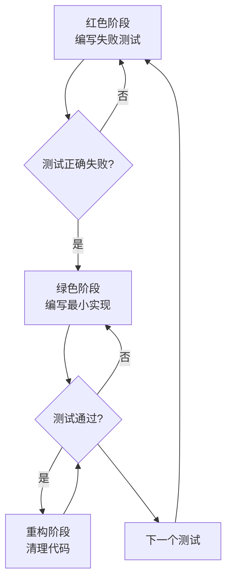
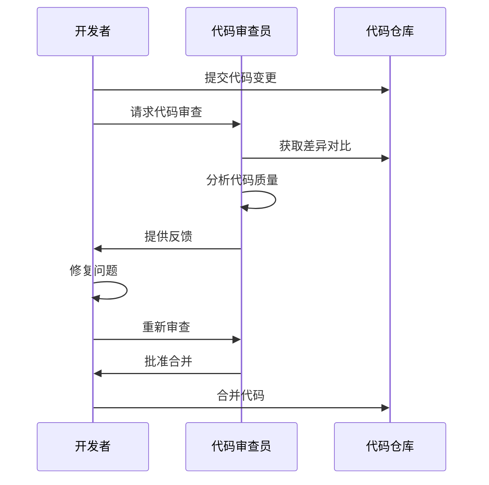
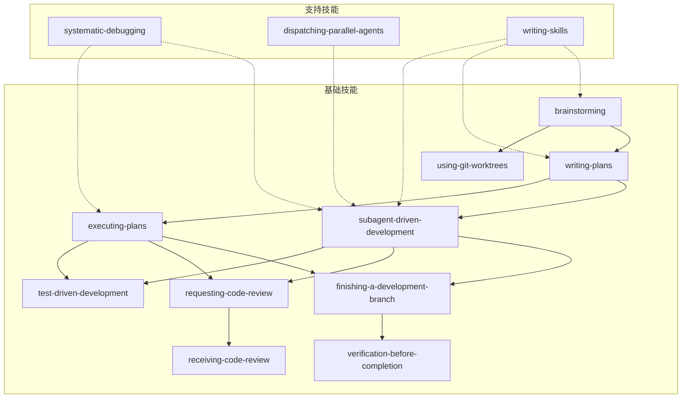

# 基础工作流程

<cite>
**本文档引用的文件**
- [README.md](file://README.md)
- [skills/brainstorming/brainstorming.md](file://skills/brainstorming/brainstorming.md)
- [skills/using-git-worktrees/using-git-worktrees.md](file://skills/using-git-worktrees/using-git-worktrees.md)
- [skills/writing-plans/writing-plans.md](file://skills/writing-plans/writing-plans.md)
- [skills/subagent-driven-development/subagent-driven-development.md](file://skills/subagent-driven-development/subagent-driven-development.md)
- [skills/executing-plans/executing-plans.md](file://skills/executing-plans/executing-plans.md)
- [skills/test-driven-development/test-driven-development.md](file://skills/test-driven-development/test-driven-development.md)
- [skills/requesting-code-review/requesting-code-review.md](file://skills/requesting-code-review/requesting-code-review.md)
- [skills/finishing-a-development-branch/finishing-a-development-branch.md](file://skills/finishing-a-development-branch/finishing-a-development-branch.md)
- [skills/receiving-code-review/receiving-code-review.md](file://skills/receiving-code-review/receiving-code-review.md)
- [skills/verification-before-completion/verification-before-completion.md](file://skills/verification-before-completion/verification-before-completion.md)
- [docs/testing.md](file://docs/testing.md)
- [tests/explicit-skill-requests/run-all.sh](file://tests/explicit-skill-requests/run-all.sh)
- [commands/brainstorm.md](file://commands/brainstorm.md)
- [commands/write-plan.md](file://commands/write-plan.md)
- [commands/execute-plan.md](file://commands/execute-plan.md)
</cite>

## 目录
1. [简介](#简介)
2. [项目结构](#项目结构)
3. [核心组件](#核心组件)
4. [架构概览](#架构概览)
5. [详细组件分析](#详细组件分析)
6. [依赖关系分析](#依赖关系分析)
7. [性能考虑](#性能考虑)
8. [故障排除指南](#故障排除指南)
9. [结论](#结论)

## 简介

Superpowers 是一个完整的软件开发工作流程系统，专为 AI 编码代理设计。该系统基于一组可组合的"技能"(skills)构建，通过强制性的七步工作流程确保高质量的软件开发。

该工作流程的核心理念是：在开始编码之前，先进行充分的需求分析和设计验证，然后制定详细的实施计划，最后通过子代理驱动的开发模式实现代码。整个过程强调测试驱动开发(TDD)、系统化方法和证据验证。

## 项目结构

Superpowers 项目采用模块化的技能系统架构，主要包含以下核心目录：

**图表来源**
- [README.md:126-151](file://README.md#L126-L151)
- [skills/brainstorming/brainstorming.md:1-165](file://skills/brainstorming/brainstorming.md#L1-L165)

**章节来源**
- [README.md:108-125](file://README.md#L108-L125)
- [README.md:126-151](file://README.md#L126-L151)

## 核心组件

Superpowers 工作流程由七个强制性技能组成，每个技能都有明确的目的、执行时机和预期输出：

### 1. 头脑风暴 (Brainstorming)
- **目的**: 在任何创造性工作之前探索用户意图、需求和设计
- **执行时机**: 项目启动时，任何功能开发前
- **预期输出**: 经过用户批准的设计规范文档
- **强制性**: 必须在设计获得批准后才能进入实现阶段

### 2. 使用 Git 工作树 (Using Git Worktrees)
- **目的**: 创建隔离的工作环境，避免污染主分支
- **执行时机**: 设计批准后，开始实现前
- **预期输出**: 隔离的工作树环境，干净的测试基线
- **安全特性**: 自动检查目录忽略配置，防止意外提交

### 3. 制定计划 (Writing Plans)
- **目的**: 将设计分解为可执行的任务清单
- **执行时机**: 获得设计批准后
- **预期输出**: 详细的实施计划文档，包含具体任务和验证步骤
- **粒度控制**: 每个任务应该在2-5分钟内完成

### 4. 子代理驱动开发 (Subagent-Driven Development)
- **目的**: 通过专门的子代理执行任务，实现快速迭代
- **执行时机**: 获得实施计划后
- **预期输出**: 完成的任务集合，每个任务都经过双重审查
- **质量保证**: 规格符合性审查 + 代码质量审查

### 5. 测试驱动开发 (Test-Driven Development)
- **目的**: 强制执行红绿重构循环，确保代码质量
- **执行时机**: 实现过程中，每个功能或修复前
- **预期输出**: 通过测试的代码，遵循 TDD 原则
- **核心原则**: 先写测试，再写实现代码

### 6. 申请代码审查 (Requesting Code Review)
- **目的**: 在合并前捕获问题，防止问题积累
- **执行时机**: 每个任务完成后，重大功能完成后，合并前
- **预期输出**: 代码审查反馈，问题修复记录
- **审查类型**: 规格符合性审查 + 代码质量审查

### 7. 完成开发分支 (Finishing a Development Branch)
- **目的**: 决定如何集成工作成果，清理开发环境
- **执行时机**: 所有任务完成后，测试通过后
- **预期输出**: 合并到主分支、创建拉取请求或清理工作树的选择结果
- **清理机制**: 自动清理工作树，避免资源浪费

**章节来源**
- [README.md:108-125](file://README.md#L108-L125)
- [skills/brainstorming/brainstorming.md:20-33](file://skills/brainstorming/brainstorming.md#L20-L33)
- [skills/using-git-worktrees/using-git-worktrees.md:14-142](file://skills/using-git-worktrees/using-git-worktrees.md#L14-L142)

## 架构概览

Superpowers 的工作流程采用流水线式架构，七个技能按顺序执行，每个技能都有明确的输入输出契约：

**图表来源**
- [README.md:108-125](file://README.md#L108-L125)
- [skills/subagent-driven-development/subagent-driven-development.md:40-85](file://skills/subagent-driven-development/subagent-driven-development.md#L40-L85)

## 详细组件分析

### 头脑风暴技能分析

头脑风暴技能是整个工作流程的入口点，具有严格的设计门禁要求：

**图表来源**
- [skills/brainstorming/brainstorming.md:36-64](file://skills/brainstorming/brainstorming.md#L36-L64)
- [skills/brainstorming/brainstorming.md:12-14](file://skills/brainstorming/brainstorming.md#L12-L14)

**章节来源**
- [skills/brainstorming/brainstorming.md:107-137](file://skills/brainstorming/brainstorming.md#L107-L137)
- [skills/brainstorming/brainstorming.md:16-18](file://skills/brainstorming/brainstorming.md#L16-L18)

### 子代理驱动开发分析

子代理驱动开发是 Superpowers 的核心执行引擎，采用双重审查机制：

**图表来源**
- [skills/subagent-driven-development/subagent-driven-development.md:120-125](file://skills/subagent-driven-development/subagent-driven-development.md#L120-L125)
- [skills/subagent-driven-development/subagent-driven-development.md:42-85](file://skills/subagent-driven-development/subagent-driven-development.md#L42-L85)

**章节来源**
- [skills/subagent-driven-development/subagent-driven-development.md:87-101](file://skills/subagent-driven-development/subagent-driven-development.md#L87-L101)
- [skills/subagent-driven-development/subagent-driven-development.md:102-119](file://skills/subagent-driven-development/subagent-driven-development.md#L102-L119)

### 测试驱动开发流程

TDD 循环确保代码质量和测试覆盖率：

**图表来源**
- [skills/test-driven-development/test-driven-development.md:49-69](file://skills/test-driven-development/test-driven-development.md#L49-L69)
- [skills/test-driven-development/test-driven-development.md:71-130](file://skills/test-driven-development/test-driven-development.md#L71-L130)

**章节来源**
- [skills/test-driven-development/test-driven-development.md:327-341](file://skills/test-driven-development/test-driven-development.md#L327-L341)
- [skills/test-driven-development/test-driven-development.md:272-289](file://skills/test-driven-development/test-driven-development.md#L272-L289)

### 代码审查集成分析

代码审查在整个工作流程中起到质量保障的作用：

**图表来源**
- [skills/requesting-code-review/requesting-code-review.md:24-48](file://skills/requesting-code-review/requesting-code-review.md#L24-L48)
- [skills/receiving-code-review/receiving-code-review.md:14-26](file://skills/receiving-code-review/receiving-code-review.md#L14-L26)

**章节来源**
- [skills/requesting-code-review/requesting-code-review.md:77-91](file://skills/requesting-code-review/requesting-code-review.md#L77-L91)
- [skills/receiving-code-review/receiving-code-review.md:164-175](file://skills/receiving-code-review/receiving-code-review.md#L164-L175)

## 依赖关系分析

Superpowers 技能系统具有清晰的依赖层次结构：

**图表来源**
- [README.md:137-146](file://README.md#L137-L146)
- [skills/subagent-driven-development/subagent-driven-development.md:265-278](file://skills/subagent-driven-development/subagent-driven-development.md#L265-L278)

**章节来源**
- [README.md:137-150](file://README.md#L137-L150)
- [skills/using-git-worktrees/using-git-worktrees.md:209-219](file://skills/using-git-worktrees/using-git-worktrees.md#L209-L219)

## 性能考虑

Superpowers 工作流程在设计时充分考虑了性能优化：

### 成本优化策略
- **模型选择优化**: 根据任务复杂度选择合适的模型，机械任务使用低成本模型，设计任务使用高性能模型
- **并行执行**: 子代理可以并行工作，提高整体效率
- **缓存利用**: 充分利用提示词缓存减少重复计算

### 时间效率
- **任务粒度控制**: 每个任务控制在2-5分钟内完成，便于快速反馈
- **自动审查**: 审查流程自动化，减少人工干预
- **增量验证**: 每个任务完成后立即验证，防止问题累积

### 资源管理
- **工作树隔离**: 使用 Git 工作树避免资源冲突
- **自动清理**: 完成后自动清理临时文件和工作树
- **权限控制**: 严格的文件系统权限管理

## 故障排除指南

### 常见问题及解决方案

**问题1: 技能未正确触发**
- 检查技能文件是否存在且格式正确
- 验证技能名称是否与调用方式匹配
- 确认插件已正确安装和启用

**问题2: 子代理无法访问文件**
- 确保使用 Task 工具传递完整上下文
- 检查文件路径是否正确
- 验证权限设置

**问题3: 审查流程卡住**
- 检查是否有未解决的问题
- 确认审查顺序是否正确
- 验证代码是否满足规格要求

**问题4: 工作树创建失败**
- 检查目录忽略配置
- 验证磁盘空间
- 确认 Git 权限

**章节来源**
- [docs/testing.md:178-215](file://docs/testing.md#L178-L215)
- [skills/using-git-worktrees/using-git-worktrees.md:194-208](file://skills/using-git-worktrees/using-git-worktrees.md#L194-L208)

## 结论

Superpowers 工作流程通过七个强制性技能的协同工作，为 AI 编码代理提供了完整的开发框架。该系统的核心优势包括：

1. **系统化方法**: 从需求分析到代码实现的完整流程
2. **质量保证**: 双重审查机制确保代码质量
3. **自动化程度高**: 减少人工干预，提高效率
4. **可扩展性**: 基于技能的模块化设计
5. **成本控制**: 智能的模型选择和资源管理

通过遵循这个工作流程，AI 代理可以在各种复杂的软件开发任务中保持一致的质量标准和高效的执行速度。每个技能都有明确的职责边界和质量标准，确保整个开发过程的可控性和可预测性。