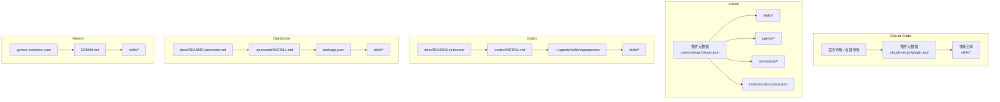
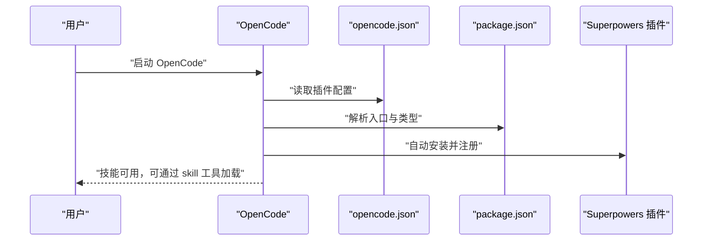
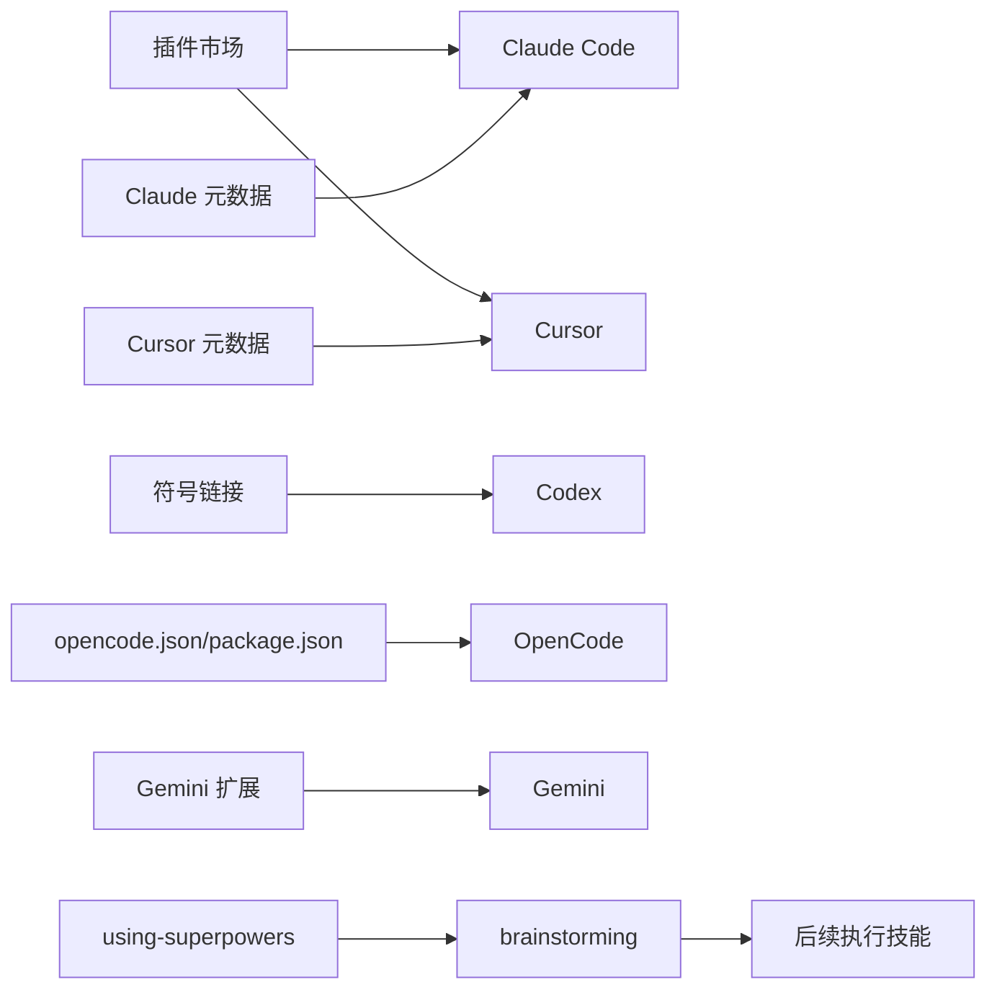

# 安装与配置

<cite>
**本文引用的文件**
- [README.md](file://README.md)
- [docs/README.codex.md](file://docs/README.codex.md)
- [.codex/INSTALL.md](file://.codex/INSTALL.md)
- [docs/README.opencode.md](file://docs/README.opencode.md)
- [.opencode/INSTALL.md](file://.opencode/INSTALL.md)
- [.claude-plugin/marketplace.json](file://.claude-plugin/marketplace.json)
- [.claude-plugin/plugin.json](file://.claude-plugin/plugin.json)
- [.cursor-plugin/plugin.json](file://.cursor-plugin/plugin.json)
- [gemini-extension.json](file://gemini-extension.json)
- [GEMINI.md](file://GEMINI.md)
- [package.json](file://package.json)
- [skills/using-superpowers/SKILL.md](file://skills/using-superpowers/SKILL.md)
- [skills/brainstorming/SKILL.md](file://skills/brainstorming/SKILL.md)
</cite>

## 目录
1. [简介](#简介)
2. [项目结构](#项目结构)
3. [核心组件](#核心组件)
4. [架构总览](#架构总览)
5. [详细组件分析](#详细组件分析)
6. [依赖关系分析](#依赖关系分析)
7. [性能考虑](#性能考虑)
8. [故障排查指南](#故障排查指南)
9. [结论](#结论)
10. [附录](#附录)

## 简介
本指南面向希望在多平台（Claude Code、Cursor、Codex、OpenCode、Gemini）上安装与配置 Superpowers 的用户。内容覆盖：
- 各平台的安装步骤与配置要点
- 插件市场使用方法与手动安装流程
- 验证安装的方法与测试建议
- 常见问题与解决方案
- 平台差异与最佳实践

Superpowers 是一套可组合的“技能”（skills）集合，旨在为你的代码代理提供完整的软件开发工作流。安装后，代理会在合适时机自动触发相关技能，无需额外干预。

章节来源
- [README.md:27-106](file://README.md#L27-L106)

## 项目结构
仓库中包含针对不同平台的安装与配置说明、插件元数据以及技能文档。关键位置如下：
- 平台安装说明：根目录 README 与 docs 子目录中的平台文档
- 插件元数据：.claude-plugin、.cursor-plugin、.opencode 目录下的 JSON 文件
- 技能与钩子：skills、hooks 目录
- 扩展入口：gemini-extension.json、GEMINI.md

图示来源
- [README.md:27-106](file://README.md#L27-L106)
- [.claude-plugin/marketplace.json:1-21](file://.claude-plugin/marketplace.json#L1-L21)
- [.cursor-plugin/plugin.json:1-26](file://.cursor-plugin/plugin.json#L1-L26)
- [.opencode/INSTALL.md:1-84](file://.opencode/INSTALL.md#L1-L84)
- [gemini-extension.json:1-7](file://gemini-extension.json#L1-L7)

章节来源
- [README.md:27-106](file://README.md#L27-L106)
- [docs/README.codex.md:1-127](file://docs/README.codex.md#L1-L127)
- [docs/README.opencode.md:1-131](file://docs/README.opencode.md#L1-L131)

## 核心组件
- 插件元数据与市场注册
  - Claude Code 官方市场与自建市场：通过 marketplace.json 与 plugin.json 提供插件描述、版本与关键字等信息
  - Cursor：通过 .cursor-plugin/plugin.json 指定 skills、agents、commands、hooks 路径
  - OpenCode：通过 package.json 指定主入口与类型，配合 .opencode/INSTALL.md 进行安装与更新
  - Gemini：通过 gemini-extension.json 指定扩展名称、描述与上下文文件；GEMINI.md 引用技能与工具参考
- 技能系统
  - using-superpowers：建立如何发现与调用技能的规则，定义优先级与流程
  - brainstorming：在实现前进行设计与规范制定，确保设计经批准后再进入计划与执行阶段

章节来源
- [.claude-plugin/marketplace.json:1-21](file://.claude-plugin/marketplace.json#L1-L21)
- [.claude-plugin/plugin.json:1-21](file://.claude-plugin/plugin.json#L1-L21)
- [.cursor-plugin/plugin.json:1-26](file://.cursor-plugin/plugin.json#L1-L26)
- [package.json:1-7](file://package.json#L1-L7)
- [gemini-extension.json:1-7](file://gemini-extension.json#L1-L7)
- [GEMINI.md:1-3](file://GEMINI.md#L1-L3)
- [skills/using-superpowers/SKILL.md:1-118](file://skills/using-superpowers/SKILL.md#L1-L118)
- [skills/brainstorming/SKILL.md:1-165](file://skills/brainstorming/SKILL.md#L1-L165)

## 架构总览
下图展示了 Superpowers 在各平台的安装与加载路径，以及技能激活的基本流程。

图示来源
- [docs/README.codex.md:1-127](file://docs/README.codex.md#L1-L127)
- [.codex/INSTALL.md:1-68](file://.codex/INSTALL.md#L1-L68)
- [docs/README.opencode.md:1-131](file://docs/README.opencode.md#L1-L131)
- [.opencode/INSTALL.md:1-84](file://.opencode/INSTALL.md#L1-L84)
- [.claude-plugin/plugin.json:1-21](file://.claude-plugin/plugin.json#L1-L21)
- [.cursor-plugin/plugin.json:1-26](file://.cursor-plugin/plugin.json#L1-L26)
- [gemini-extension.json:1-7](file://gemini-extension.json#L1-L7)
- [GEMINI.md:1-3](file://GEMINI.md#L1-L3)

## 详细组件分析

### 平台一：Claude Code（官方市场）
- 安装方式
  - 官方市场：在 Claude 中通过官方插件市场安装
  - 自建市场：先添加市场源，再从该市场安装插件
- 配置要点
  - marketplace.json 与 plugin.json 提供插件名称、版本、关键字等元信息
  - 安装后即可在 Claude Code 中通过 Skill 工具调用技能
- 验证方法
  - 新会话中请求应触发相关技能，或使用“Tell me about your superpowers”进行验证

章节来源
- [README.md:31-53](file://README.md#L31-L53)
- [.claude-plugin/marketplace.json:1-21](file://.claude-plugin/marketplace.json#L1-L21)
- [.claude-plugin/plugin.json:1-21](file://.claude-plugin/plugin.json#L1-L21)

### 平台二：Cursor（插件市场）
- 安装方式
  - 在 Cursor Agent 聊天界面中搜索并安装“superpowers”
- 配置要点
  - .cursor-plugin/plugin.json 指定 skills、agents、commands、hooks 的相对路径
- 验证方法
  - 使用“/add-plugin superpowers”或在聊天中搜索“superpowers”，随后通过技能工具调用

章节来源
- [README.md:55-63](file://README.md#L55-L63)
- [.cursor-plugin/plugin.json:1-26](file://.cursor-plugin/plugin.json#L1-L26)

### 平台三：Codex（手动安装）
- 安装方式
  - 克隆仓库到本地目录，并在 ~/.agents/skills 下创建指向 skills 的符号链接（或 Windows 下的目录连接）
  - 重启 Codex 以触发技能发现
- 特殊配置
  - 若需使用并行子代理技能，需在 Codex 配置中启用多代理功能
- 验证方法
  - 检查符号链接是否正确，重启后技能应被发现并可按需激活
- 更新与卸载
  - 更新：在克隆目录执行拉取命令
  - 卸载：删除符号链接，可选删除克隆目录

图示来源
- [.codex/INSTALL.md:9-28](file://.codex/INSTALL.md#L9-L28)
- [docs/README.codex.md:35-40](file://docs/README.codex.md#L35-L40)

章节来源
- [.codex/INSTALL.md:1-68](file://.codex/INSTALL.md#L1-L68)
- [docs/README.codex.md:1-127](file://docs/README.codex.md#L1-L127)

### 平台四：OpenCode（插件管理）
- 安装方式
  - 在 opencode.json 的 plugin 数组中添加插件条目，重启 OpenCode 后自动安装并注册所有技能
- 配置要点
  - package.json 指定模块类型与入口文件
  - docs/README.opencode.md 与 .opencode/INSTALL.md 提供完整安装与迁移指引
- 工具映射
  - 技能中使用的 Claude Code 工具会自动映射到 OpenCode 的等价工具
- 验证方法
  - 使用内置 skill 工具列出与加载技能，或询问“Tell me about your superpowers”

图示来源
- [docs/README.opencode.md:7-15](file://docs/README.opencode.md#L7-L15)
- [package.json:1-7](file://package.json#L1-L7)

章节来源
- [.opencode/INSTALL.md:1-84](file://.opencode/INSTALL.md#L1-L84)
- [docs/README.opencode.md:1-131](file://docs/README.opencode.md#L1-L131)
- [package.json:1-7](file://package.json#L1-L7)

### 平台五：Gemini（CLI 扩展）
- 安装方式
  - 使用 Gemini CLI 的扩展安装命令安装仓库
  - 支持更新命令保持版本同步
- 配置要点
  - gemini-extension.json 指定扩展名称、描述与上下文文件
  - GEMINI.md 引用技能与工具参考，帮助平台适配
- 验证方法
  - 新会话中请求应触发相关技能，或通过内置工具激活技能

章节来源
- [README.md:92-102](file://README.md#L92-L102)
- [gemini-extension.json:1-7](file://gemini-extension.json#L1-L7)
- [GEMINI.md:1-3](file://GEMINI.md#L1-L3)

### 技能系统与工作流
- using-superpowers：定义技能调用优先级、工具加载方式与流程控制，强调在任何响应前必须先调用合适的技能
- brainstorming：在实现前进行设计与规范制定，确保设计经批准后再进入计划与执行阶段

图示来源
- [skills/using-superpowers/SKILL.md:44-76](file://skills/using-superpowers/SKILL.md#L44-L76)

章节来源
- [skills/using-superpowers/SKILL.md:1-118](file://skills/using-superpowers/SKILL.md#L1-L118)
- [skills/brainstorming/SKILL.md:1-165](file://skills/brainstorming/SKILL.md#L1-L165)

## 依赖关系分析
- 平台依赖
  - Claude Code 与 Cursor：依赖插件市场与插件元数据
  - Codex：依赖本地符号链接与技能发现机制
  - OpenCode：依赖插件配置与包入口
  - Gemini：依赖 CLI 扩展安装与上下文文件
- 技能依赖
  - using-superpowers 作为引导技能，决定后续技能调用顺序
  - brainstorming 作为前置技能，影响后续计划与执行流程

图示来源
- [.claude-plugin/plugin.json:1-21](file://.claude-plugin/plugin.json#L1-L21)
- [.cursor-plugin/plugin.json:1-26](file://.cursor-plugin/plugin.json#L1-L26)
- [.codex/INSTALL.md:9-28](file://.codex/INSTALL.md#L9-L28)
- [docs/README.opencode.md:7-15](file://docs/README.opencode.md#L7-L15)
- [gemini-extension.json:1-7](file://gemini-extension.json#L1-L7)
- [skills/using-superpowers/SKILL.md:18-26](file://skills/using-superpowers/SKILL.md#L18-L26)
- [skills/brainstorming/SKILL.md:12-14](file://skills/brainstorming/SKILL.md#L12-L14)

章节来源
- [README.md:27-106](file://README.md#L27-L106)
- [skills/using-superpowers/SKILL.md:18-26](file://skills/using-superpowers/SKILL.md#L18-L26)

## 性能考虑
- 选择合适的平台：官方市场安装通常更稳定且易于更新
- 减少不必要的工具切换：在 Claude Code/Cursor/Gemini 中优先使用内置工具，避免跨平台工具映射带来的额外开销
- 合理使用并行子代理：仅在需要时启用 Codex 多代理功能，避免资源占用
- 保持技能最小化：遵循 Superpowers 的零依赖原则，减少外部依赖对性能的影响

## 故障排查指南
- 安装后技能不可见
  - Claude Code/Cursor：确认已从市场安装插件
  - Codex：检查符号链接是否存在、技能目录是否可读、是否重启了应用
  - OpenCode：检查 opencode.json 的插件条目、日志输出、版本兼容性
  - Gemini：确认扩展安装成功、上下文文件存在
- 技能未按预期触发
  - 检查 using-superpowers 的优先级与流程，确保在任何响应前调用技能
  - 确认技能描述与触发条件匹配
- 平台适配问题
  - OpenCode 与 Gemini 的工具映射不同，参考对应文档进行调整

章节来源
- [docs/README.codex.md:111-122](file://docs/README.codex.md#L111-L122)
- [docs/README.opencode.md:107-125](file://docs/README.opencode.md#L107-L125)
- [README.md:92-106](file://README.md#L92-L106)

## 结论
通过本指南，你可以在 Claude Code、Cursor、Codex、OpenCode 与 Gemini 上完成 Superpowers 的安装与配置。建议优先使用官方市场安装（Claude Code/Cursor），或采用平台提供的自动化安装流程（OpenCode）。Codex 与 Gemini 需要手动安装与验证。安装完成后，使用内置工具调用技能并进行验证，确保代理能在合适时机自动触发相关技能。

## 附录
- 安装验证清单
  - 启动新会话，请求“Tell me about your superpowers”或“help me plan this feature”
  - 在 Claude Code/Cursor/Gemini 中使用技能工具查看可用技能
  - 在 Codex/OpenCode 中使用内置工具列出并加载技能
- 常用命令路径
  - 官方市场安装：参见 README 中对应平台的安装段落
  - 手动安装：参见各平台安装文档
  - 更新：参见 README 中的更新段落与各平台安装文档

章节来源
- [README.md:27-106](file://README.md#L27-L106)
- [.codex/INSTALL.md:45-68](file://.codex/INSTALL.md#L45-L68)
- [.opencode/INSTALL.md:19-84](file://.opencode/INSTALL.md#L19-L84)
- [docs/README.codex.md:45-127](file://docs/README.codex.md#L45-L127)
- [docs/README.opencode.md:17-131](file://docs/README.opencode.md#L17-L131)