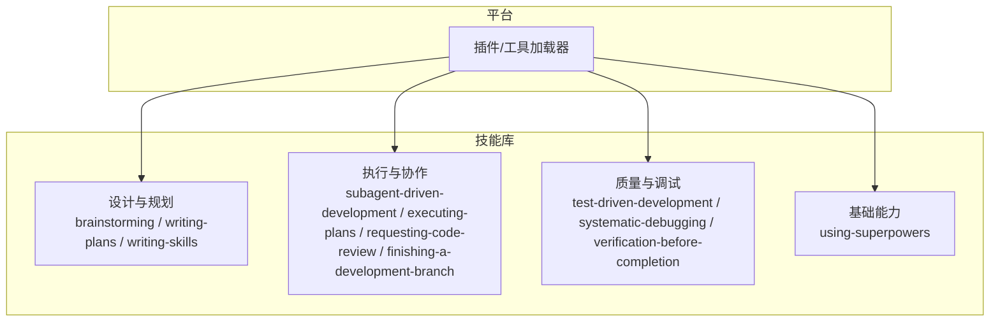
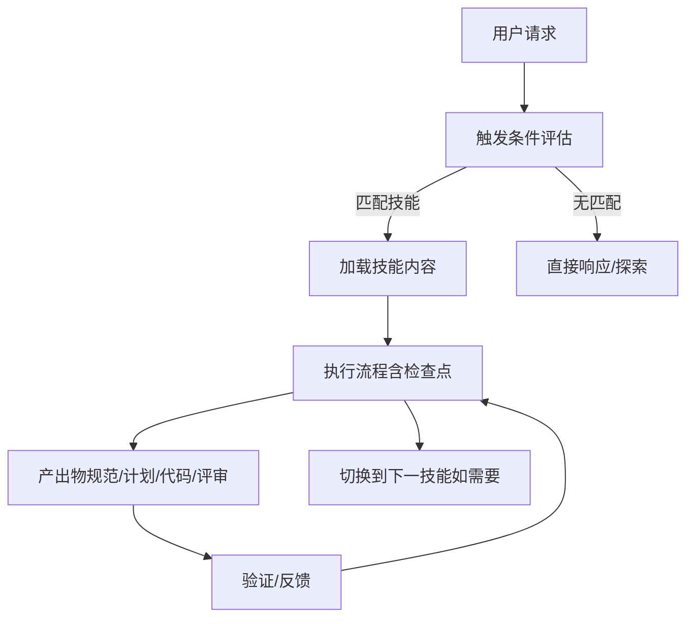
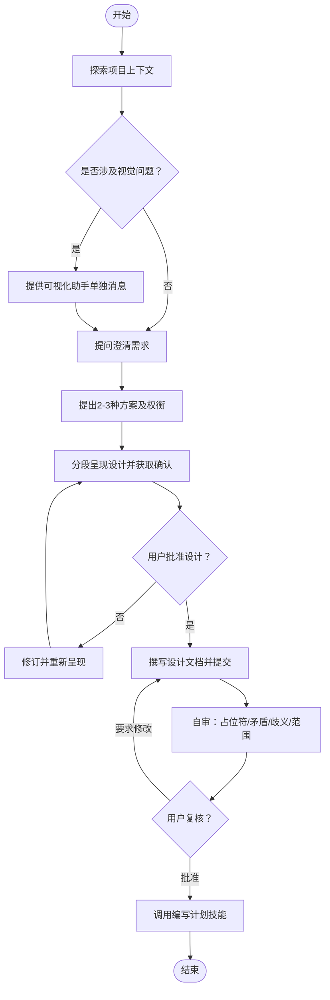
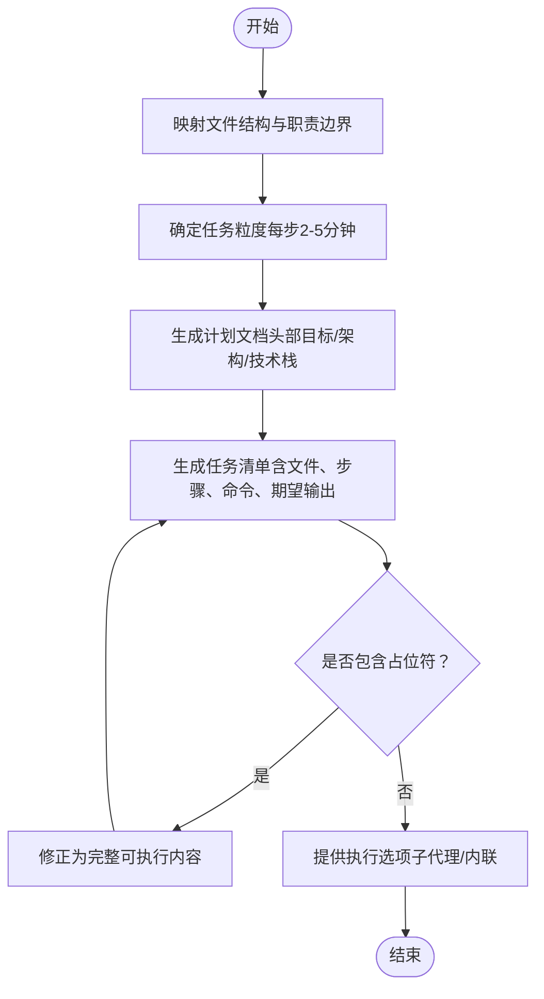
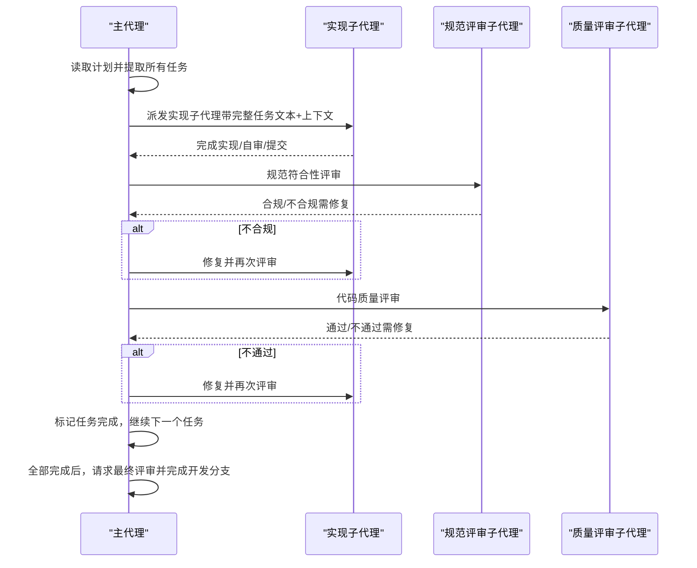
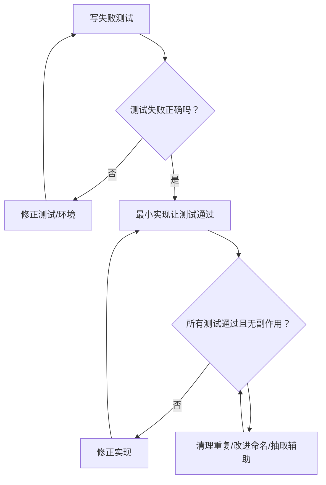
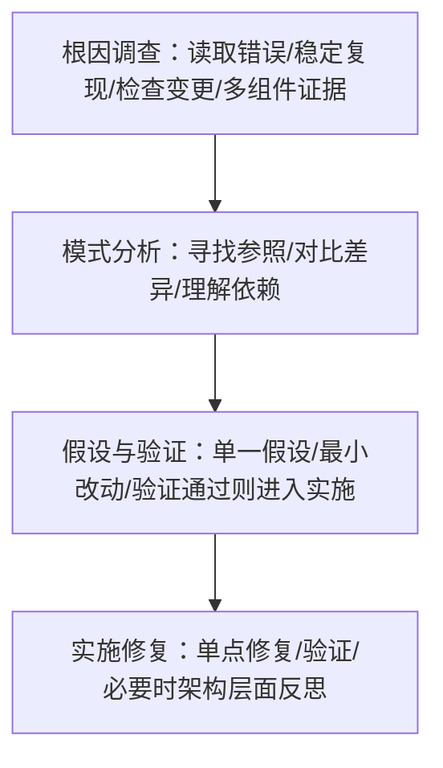
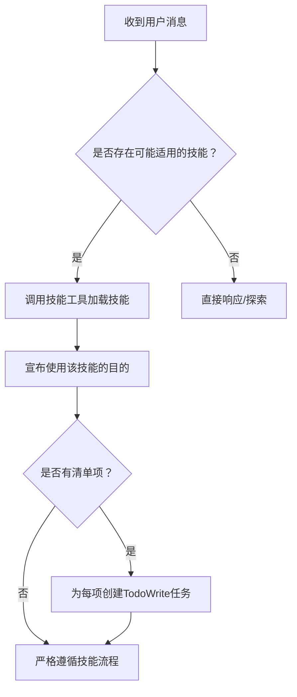

# 核心概念

<cite>
**本文引用的文件**
- [README.md](file://README.md)
- [skills/brainstorming/SKILL.md](file://skills/brainstorming/SKILL.md)
- [skills/writing-skills/SKILL.md](file://skills/writing-skills/SKILL.md)
- [skills/subagent-driven-development/SKILL.md](file://skills/subagent-driven-development/SKILL.md)
- [skills/systematic-debugging/SKILL.md](file://skills/systematic-debugging/SKILL.md)
- [skills/test-driven-development/SKILL.md](file://skills/test-driven-development/SKILL.md)
- [skills/writing-plans/SKILL.md](file://skills/writing-plans/SKILL.md)
- [skills/using-superpowers/SKILL.md](file://skills/using-superpowers/SKILL.md)
- [skills/executing-plans/SKILL.md](file://skills/executing-plans/SKILL.md)
- [skills/requesting-code-review/SKILL.md](file://skills/requesting-code-review/SKILL.md)
- [skills/systematic-debugging/root-cause-tracing.md](file://skills/systematic-debugging/root-cause-tracing.md)
- [skills/systematic-debugging/defense-in-depth.md](file://skills/systematic-debugging/defense-in-depth.md)
- [skills/systematic-debugging/condition-based-waiting.md](file://skills/systematic-debugging/condition-based-waiting.md)
- [skills/test-driven-development/testing-anti-patterns.md](file://skills/test-driven-development/testing-anti-patterns.md)
- [tests/skill-triggering/run-all.sh](file://tests/skill-triggering/run-all.sh)
- [tests/explicit-skill-requests/run-multiturn-test.sh](file://tests/explicit-skill-requests/run-multiturn-test.sh)
- [tests/explicit-skill-requests/run-extended-multiturn-test.sh](file://tests/explicit-skill-requests/run-extended-multiturn-test.sh)
</cite>

## 目录
1. [引言](#引言)
2. [项目结构](#项目结构)
3. [核心组件](#核心组件)
4. [架构总览](#架构总览)
5. [详细组件分析](#详细组件分析)
6. [依赖关系分析](#依赖关系分析)
7. [性能考量](#性能考量)
8. [故障排查指南](#故障排查指南)
9. [结论](#结论)
10. [附录](#附录)

## 引言
Superpowers 是一个面向代码代理的完整开发工作流系统，其核心是“可组合技能”（skills）。每个技能是一个可复用的方法论、模式或工具参考，帮助代理在不同阶段以一致的方式完成任务。系统通过“先触发技能、后执行动作”的原则，确保每次交互都遵循既定流程，从而提升开发效率与代码质量。

与传统 AI 开发工具不同，Superpowers 不仅提供“怎么做”，更重要的是“何时做、按什么顺序做”。它将测试驱动、系统化调试、设计评审、子代理并行执行等工程实践固化为可加载、可验证的技能，使代理在复杂任务中保持纪律性与一致性。

## 项目结构
Superpowers 的技能库位于 skills 目录下，每个技能以独立目录存放，包含技能文档 SKILL.md 以及必要的配套文件（如提示词模板、脚本等）。平台侧通过插件机制加载这些技能，并在对话中根据触发条件自动选择合适的技能。

- 技能库：skills/
  - 设计与规划类：brainstorming、writing-plans、writing-skills 等
  - 执行与协作类：subagent-driven-development、executing-plans、requesting-code-review、finishing-a-development-branch 等
  - 质量与调试类：test-driven-development、systematic-debugging、verification-before-completion 等
  - 基础能力：using-superpowers（技能使用与发现）

**图表来源**
- [README.md:126-151](file://README.md#L126-L151)
- [skills/using-superpowers/SKILL.md:42-76](file://skills/using-superpowers/SKILL.md#L42-L76)

**章节来源**
- [README.md:126-151](file://README.md#L126-L151)
- [skills/using-superpowers/SKILL.md:42-76](file://skills/using-superpowers/SKILL.md#L42-L76)

## 核心组件
- 可组合技能系统
  - 每个技能是一个独立的参考指南，描述“何时触发、如何执行、关键检查点”。
  - 技能之间通过“前置技能/集成技能”约定进行协作，形成端到端工作流。
- 触发与执行机制
  - 平台在收到用户请求时，先评估是否存在适用技能；若存在，优先加载该技能并严格遵循其流程。
  - 子代理支持时，推荐使用“子代理驱动开发”实现高吞吐、低上下文污染的迭代。
- 工作流闭环
  - 设计 → 计划 → 执行 → 审查 → 收尾，每个环节都有明确的产出物与检查点。

**章节来源**
- [skills/using-superpowers/SKILL.md:42-76](file://skills/using-superpowers/SKILL.md#L42-L76)
- [skills/subagent-driven-development/SKILL.md:40-84](file://skills/subagent-driven-development/SKILL.md#L40-L84)
- [README.md:108-125](file://README.md#L108-L125)

## 架构总览
Superpowers 的整体架构围绕“技能即流程”展开：平台负责识别触发条件并加载相应技能；技能定义了流程步骤、检查点与输出；在具备子代理能力的平台上，执行阶段由子代理承担具体实现，主代理专注于协调与审查。

**图表来源**
- [skills/using-superpowers/SKILL.md:42-76](file://skills/using-superpowers/SKILL.md#L42-L76)
- [skills/writing-skills/SKILL.md:30-45](file://skills/writing-skills/SKILL.md#L30-L45)

## 详细组件分析

### 设计与构思：头脑风暴（brainstorming）
- 目标：在任何创意工作前，先完成需求澄清、方案对比与设计确认，再进入实现。
- 关键约束：未获得设计批准前不得执行任何实现动作；必须分段呈现设计并逐段获得确认。
- 流程要点：探索项目现状 → 视觉问题决策 → 提问澄清 → 方案对比 → 分段呈现设计 → 编写规范文档 → 自审与用户复核 → 转入“编写计划”。

**图表来源**
- [skills/brainstorming/SKILL.md:34-66](file://skills/brainstorming/SKILL.md#L34-L66)

**章节来源**
- [skills/brainstorming/SKILL.md:20-32](file://skills/brainstorming/SKILL.md#L20-L32)
- [skills/brainstorming/SKILL.md:68-106](file://skills/brainstorming/SKILL.md#L68-L106)
- [skills/brainstorming/SKILL.md:107-136](file://skills/brainstorming/SKILL.md#L107-L136)

### 计划与分解：编写计划（writing-plans）
- 目标：将已批准的设计转化为可执行的实现计划，确保每一步都可被“零上下文”的工程师理解并执行。
- 关键约束：任务粒度控制在2-5分钟内；每个任务包含文件路径、完整代码、验证步骤与提交记录。
- 输出：保存到指定路径的计划文档，并提供两种执行选项（子代理驱动或内联执行）。

**图表来源**
- [skills/writing-plans/SKILL.md:25-44](file://skills/writing-plans/SKILL.md#L25-L44)
- [skills/writing-plans/SKILL.md:63-104](file://skills/writing-plans/SKILL.md#L63-L104)
- [skills/writing-plans/SKILL.md:134-153](file://skills/writing-plans/SKILL.md#L134-L153)

**章节来源**
- [skills/writing-plans/SKILL.md:8-20](file://skills/writing-plans/SKILL.md#L8-L20)
- [skills/writing-plans/SKILL.md:106-133](file://skills/writing-plans/SKILL.md#L106-L133)

### 执行与协作：子代理驱动开发（subagent-driven-development）
- 目标：为每个任务派发“新鲜上下文”的子代理，执行、自审、两阶段评审（规范符合性 → 代码质量），完成后进入下一个任务。
- 关键优势：避免上下文污染、允许子代理提问、自动化的审查回路、快速迭代。
- 集成关系：依赖“使用 Git 工作树”准备隔离工作区、“请求代码评审”作为评审模板、“完成开发分支”收尾。

**图表来源**
- [skills/subagent-driven-development/SKILL.md:42-84](file://skills/subagent-driven-development/SKILL.md#L42-L84)
- [skills/subagent-driven-development/SKILL.md:120-125](file://skills/subagent-driven-development/SKILL.md#L120-L125)

**章节来源**
- [skills/subagent-driven-development/SKILL.md:14-32](file://skills/subagent-driven-development/SKILL.md#L14-L32)
- [skills/subagent-driven-development/SKILL.md:102-118](file://skills/subagent-driven-development/SKILL.md#L102-L118)
- [skills/subagent-driven-development/SKILL.md:265-278](file://skills/subagent-driven-development/SKILL.md#L265-L278)

### 内联执行：执行计划（executing-plans）
- 适用场景：在不具备子代理能力或需要跨会话执行时，加载计划、逐项执行并在关键节点进行人工/自动化评审。
- 关键注意：遇到阻塞立即停止并请求澄清；不要在主/源分支上直接实现。

**章节来源**
- [skills/executing-plans/SKILL.md:8-15](file://skills/executing-plans/SKILL.md#L8-L15)
- [skills/executing-plans/SKILL.md:39-63](file://skills/executing-plans/SKILL.md#L39-L63)

### 请求评审：请求代码评审（requesting-code-review）
- 目标：在任务完成、重大功能实现或合并前，通过子代理评审捕获问题，避免问题累积。
- 关键流程：获取基线与当前提交 SHA → 派发评审子代理 → 处理反馈 → 继续后续任务。

**章节来源**
- [skills/requesting-code-review/SKILL.md:12-23](file://skills/requesting-code-review/SKILL.md#L12-L23)
- [skills/requesting-code-review/SKILL.md:24-48](file://skills/requesting-code-review/SKILL.md#L24-L48)

### 质量与测试：测试驱动开发（test-driven-development）
- 核心循环：红（写失败测试）→ 绿（最小实现）→ 红绿回归（重构）→ 下一测试。
- 严禁行为：先写实现、测试后置、忽略失败、添加“仅测试方法”等反模式。
- 反模式清单：测试模拟行为而非真实行为、在生产类中添加仅测试方法、无理解地模拟等。

**图表来源**
- [skills/test-driven-development/SKILL.md:47-69](file://skills/test-driven-development/SKILL.md#L47-L69)

**章节来源**
- [skills/test-driven-development/SKILL.md:31-46](file://skills/test-driven-development/SKILL.md#L31-L46)
- [skills/test-driven-development/testing-anti-patterns.md:13-19](file://skills/test-driven-development/testing-anti-patterns.md#L13-L19)

### 系统化调试：systematic-debugging
- 四阶段流程：根因调查 → 模式分析 → 假设与验证 → 实施修复。
- 根因追踪：从症状点逆向追溯至原始触发点，修复源头而非症状。
- 防御式纵深：在多个数据流转层增加校验，使问题结构上不可重现。

**图表来源**
- [skills/systematic-debugging/SKILL.md:46-87](file://skills/systematic-debugging/SKILL.md#L46-L87)
- [skills/systematic-debugging/root-cause-tracing.md:11-24](file://skills/systematic-debugging/root-cause-tracing.md#L11-L24)
- [skills/systematic-debugging/defense-in-depth.md:20-95](file://skills/systematic-debugging/defense-in-depth.md#L20-L95)

**章节来源**
- [skills/systematic-debugging/SKILL.md:16-23](file://skills/systematic-debugging/SKILL.md#L16-L23)
- [skills/systematic-debugging/root-cause-tracing.md:32-65](file://skills/systematic-debugging/root-cause-tracing.md#L32-L65)
- [skills/systematic-debugging/defense-in-depth.md:87-123](file://skills/systematic-debugging/defense-in-depth.md#L87-L123)

### 技能创作与验证：writing-skills
- 将“测试驱动开发”应用于过程文档：压力场景（子代理）→ 基线行为 → 编写技能 → 验证合规 → 修补漏洞。
- 发现优化：描述字段聚焦“触发条件”，关键词覆盖“症状/错误/工具名”，命名采用动词优先，内容压缩以降低 token 消耗。
- 红蓝条清单：列出常见“自我辩护”理由并逐一堵住漏洞。

**章节来源**
- [skills/writing-skills/SKILL.md:30-45](file://skills/writing-skills/SKILL.md#L30-L45)
- [skills/writing-skills/SKILL.md:140-198](file://skills/writing-skills/SKILL.md#L140-L198)
- [skills/writing-skills/SKILL.md:459-524](file://skills/writing-skills/SKILL.md#L459-L524)

### 技能触发机制与自动执行
- 触发原则：只要存在“1%可能适用”的技能，就应先调用技能工具加载并遵循其流程。
- 自动执行：一旦加载技能，系统会按其流程推进，包括检查点、TodoWrite 任务、两阶段评审等。
- 明确优先级：用户显式指令优先于技能；技能优先于默认系统提示；否则按技能顺序执行。

**图表来源**
- [skills/using-superpowers/SKILL.md:48-76](file://skills/using-superpowers/SKILL.md#L48-L76)

**章节来源**
- [skills/using-superpowers/SKILL.md:18-27](file://skills/using-superpowers/SKILL.md#L18-L27)
- [skills/using-superpowers/SKILL.md:97-118](file://skills/using-superpowers/SKILL.md#L97-L118)

## 依赖关系分析
- 技能间依赖
  - 设计 → 计划：必须先完成设计并通过复核，才能进入计划阶段。
  - 计划 → 执行：计划文档是执行的基础，执行前需明确任务粒度与验证步骤。
  - 执行 → 评审：子代理驱动开发中，每个任务完成后均需两阶段评审。
  - 评审 → 收尾：全部任务完成后，进入“完成开发分支”流程。
- 平台能力依赖
  - 子代理支持：显著提升执行效率与质量；若无子代理，建议使用“执行计划”替代。
  - 工具链：Git 工作树用于隔离开发；评审模板用于标准化反馈。

**图表来源**
- [README.md:108-125](file://README.md#L108-L125)
- [skills/subagent-driven-development/SKILL.md:265-278](file://skills/subagent-driven-development/SKILL.md#L265-L278)

**章节来源**
- [README.md:108-125](file://README.md#L108-L125)
- [skills/subagent-driven-development/SKILL.md:265-278](file://skills/subagent-driven-development/SKILL.md#L265-L278)

## 性能考量
- 子代理模型的优势
  - 每个任务拥有“新鲜上下文”，减少混淆与反复澄清的成本。
  - 两阶段评审在任务间自动插入，避免人工等待造成的延迟。
- 成本与收益
  - 子代理调用次数增多，但早期缺陷修复成本远低于后期调试与返工。
  - 控制任务粒度（2-5分钟）可最大化并行度与反馈速度。
- 资源分配
  - 机械实现任务使用低成本模型，复杂判断与设计任务使用更强大模型，平衡成本与效果。

**章节来源**
- [skills/subagent-driven-development/SKILL.md:87-101](file://skills/subagent-driven-development/SKILL.md#L87-L101)
- [skills/subagent-driven-development/SKILL.md:202-233](file://skills/subagent-driven-development/SKILL.md#L202-L233)

## 故障排查指南
- 常见触发问题
  - 技能未被触发：检查用户请求是否包含明确触发信号；确认平台工具可用（Skill/activate_skill 等）。
  - 流程顺序错误：例如在规范评审前进行质量评审，或跳过自审。请严格遵循技能流程图。
- 执行阶段问题
  - 子代理卡住：根据状态（需要上下文/阻塞/需要更强模型/任务过大）采取相应措施（补充上下文/更换模型/拆分任务/升级计划）。
  - 评审不通过：按严重级别处理（关键问题立即修复，重要问题在继续前解决，次要问题延后）。
- 调试与验证
  - 使用系统化调试四阶段定位根因；必要时启用条件等待替代任意超时；在多层增加防御式校验。

**章节来源**
- [tests/skill-triggering/run-all.sh:10-17](file://tests/skill-triggering/run-all.sh#L10-L17)
- [tests/explicit-skill-requests/run-multiturn-test.sh:73-97](file://tests/explicit-skill-requests/run-multiturn-test.sh#L73-L97)
- [tests/explicit-skill-requests/run-extended-multiturn-test.sh:67-97](file://tests/explicit-skill-requests/run-extended-multiturn-test.sh#L67-L97)
- [skills/subagent-driven-development/SKILL.md:102-118](file://skills/subagent-driven-development/SKILL.md#L102-L118)
- [skills/systematic-debugging/SKILL.md:215-233](file://skills/systematic-debugging/SKILL.md#L215-L233)
- [skills/systematic-debugging/condition-based-waiting.md:84-116](file://skills/systematic-debugging/condition-based-waiting.md#L84-L116)

## 结论
Superpowers 的“可组合技能”体系通过“先触发技能、后执行动作”的原则，将工程最佳实践固化为可加载、可验证、可扩展的模块。它不仅提升了代码代理的开发效率与质量，也降低了复杂任务中的认知负担与沟通成本。相比传统工具，Superpowers 更强调纪律性、可重复性与可审计性，适合在团队协作与长期演进中持续受益。

## 附录
- 术语表
  - 技能：可加载、可验证的流程参考与方法论单元。
  - 子代理：具有独立上下文与有限目标的代理实例，用于执行具体任务。
  - 评审：对实现结果进行规范符合性与代码质量的双重检查。
- 最佳实践
  - 在任何可能的任务中，先调用技能工具评估并加载最合适的技能。
  - 严格遵循技能流程图与检查点，避免跳过关键步骤。
  - 使用子代理驱动开发以获得更高的质量与更快的迭代速度。