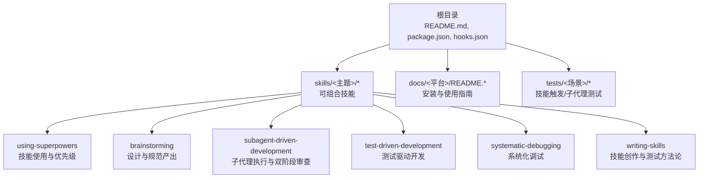
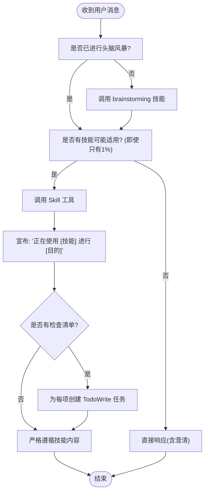
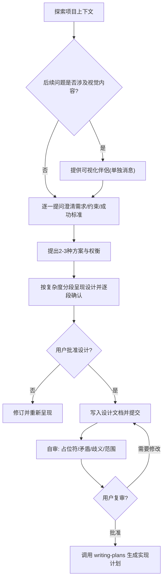
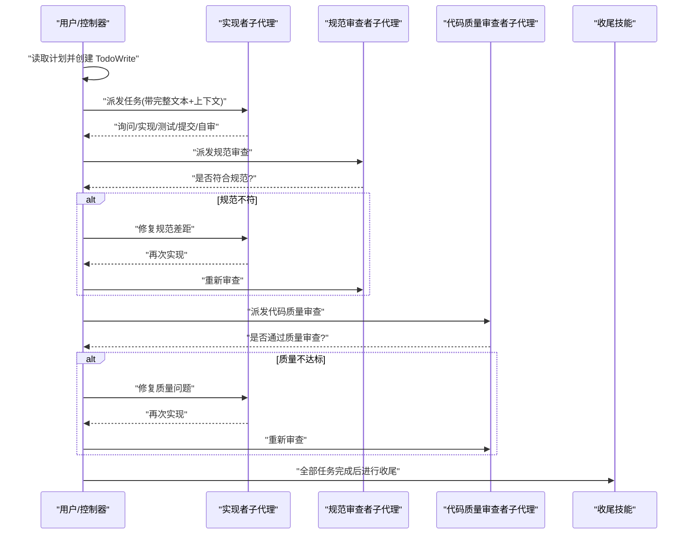
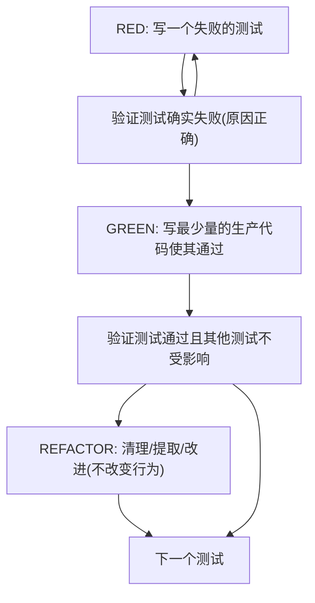
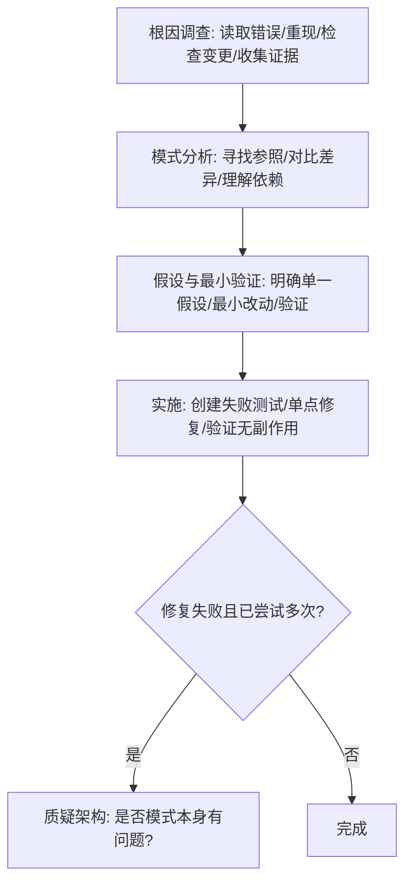
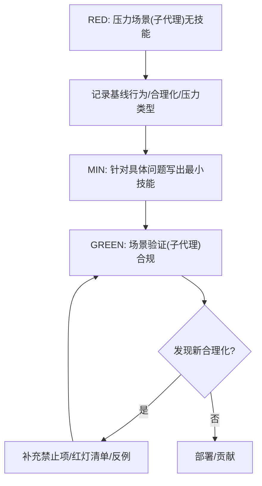
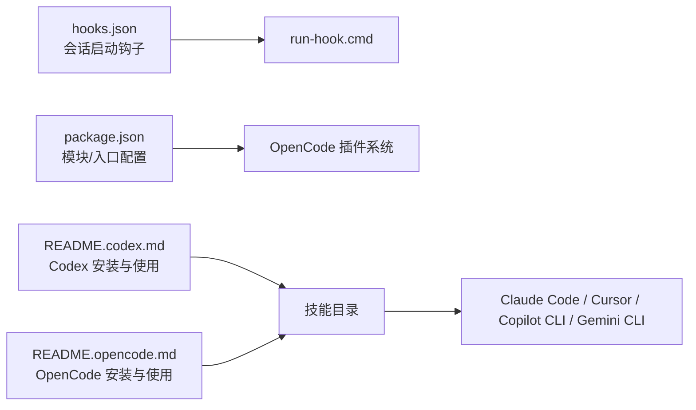

# 项目概述

<cite>
**本文档引用的文件**
- [README.md](file://README.md)
- [package.json](file://package.json)
- [CLAUDE.md](file://CLAUDE.md)
- [GEMINI.md](file://GEMINI.md)
- [skills/using-superpowers/SKILL.md](file://skills/using-superpowers/SKILL.md)
- [skills/brainstorming/SKILL.md](file://skills/brainstorming/SKILL.md)
- [skills/subagent-driven-development/SKILL.md](file://skills/subagent-driven-development/SKILL.md)
- [skills/test-driven-development/SKILL.md](file://skills/test-driven-development/SKILL.md)
- [skills/systematic-debugging/SKILL.md](file://skills/systematic-debugging/SKILL.md)
- [skills/writing-skills/SKILL.md](file://skills/writing-skills/SKILL.md)
- [hooks/hooks.json](file://hooks/hooks.json)
- [docs/README.codex.md](file://docs/README.codex.md)
- [docs/README.opencode.md](file://docs/README.opencode.md)
- [tests/skill-triggering/run-all.sh](file://tests/skill-triggering/run-all.sh)
</cite>

## 目录
1. [简介](#简介)
2. [项目结构](#项目结构)
3. [核心组件](#核心组件)
4. [架构总览](#架构总览)
5. [详细组件分析](#详细组件分析)
6. [依赖关系分析](#依赖关系分析)
7. [性能考量](#性能考量)
8. [故障排查指南](#故障排查指南)
9. [结论](#结论)
10. [附录](#附录)

## 简介
Superpowers 是面向代码代理的完整开发工作流系统，通过一组可组合的“技能”（skills）与初始指令，确保代理在执行任务时遵循严格的流程与质量标准。其核心价值主张在于：
- 将“设计-计划-实现-验证”的工程化流程自动化，避免无序编码与重复返工
- 以可测试、可迭代的方式构建“流程即代码”的技能体系，持续优化代理行为
- 在多平台（Claude Code、Cursor、Copilot CLI、Gemini CLI、Codex、OpenCode）上保持一致的使用体验与能力边界

设计理念强调“系统性优于随意性”，通过强制性的技能触发与两阶段审查（规范符合性 → 代码质量），在保证交付质量的同时提升开发效率。

与其他 AI 开发工具相比的独特定位：
- 不仅是“智能助手”，而是“可编排的工作流引擎”：每个技能都是可独立演进的模块，支持跨会话与子代理协作
- 强调“先设计后实现”和“先测试后编码”，形成闭环的质量保障
- 提供“技能创作即测试”的方法论，使技能本身具备可验证性与可维护性

## 项目结构
仓库采用按“功能域 + 平台适配 + 文档与测试”的分层组织方式：
- 根目录包含安装与平台适配说明、钩子配置、版本与包管理元数据
- skills 目录为核心“技能库”，按主题划分（如 brainstorming、subagent-driven-development、test-driven-development、systematic-debugging、writing-skills 等）
- docs 目录提供各平台的安装与使用说明
- tests 目录包含技能触发测试、子代理驱动开发测试等，用于验证技能在真实会话中的表现

图表来源
- [README.md:108-151](file://README.md#L108-L151)
- [skills/using-superpowers/SKILL.md:1-118](file://skills/using-superpowers/SKILL.md#L1-L118)
- [skills/brainstorming/SKILL.md:1-165](file://skills/brainstorming/SKILL.md#L1-L165)
- [skills/subagent-driven-development/SKILL.md:1-278](file://skills/subagent-driven-development/SKILL.md#L1-L278)
- [skills/test-driven-development/SKILL.md:1-372](file://skills/test-driven-development/SKILL.md#L1-L372)
- [skills/systematic-debugging/SKILL.md:1-297](file://skills/systematic-debugging/SKILL.md#L1-L297)
- [skills/writing-skills/SKILL.md:1-656](file://skills/writing-skills/SKILL.md#L1-L656)

章节来源
- [README.md:108-151](file://README.md#L108-L151)
- [package.json:1-7](file://package.json#L1-L7)

## 核心组件
- 技能系统（Skills）：由多个可组合的技能构成，每个技能定义明确的触发条件、执行流程与质量门禁
- 使用引导技能（using-superpowers）：建立技能优先级与使用纪律，要求在任何响应前先检查并调用适用技能
- 设计与规划（brainstorming、writing-plans）：先产出可验证的设计与计划，再进入实现阶段
- 执行与审查（subagent-driven-development、executing-plans）：以子代理并行执行任务，并进行两阶段审查（规范符合性 → 代码质量）
- 质量保障（test-driven-development、verification-before-completion）：以测试驱动与完成前验证确保正确性
- 调试与修复（systematic-debugging、requesting-code-review、receiving-code-review）：系统化定位根因并进行代码评审
- 工作分支与收尾（using-git-worktrees、finishing-a-development-branch）：隔离工作空间、合并/提 PR/清理
- 技能创作（writing-skills）：将技能创作过程本身也纳入“测试驱动”的闭环

章节来源
- [README.md:126-151](file://README.md#L126-L151)
- [skills/using-superpowers/SKILL.md:18-27](file://skills/using-superpowers/SKILL.md#L18-L27)
- [skills/brainstorming/SKILL.md:20-32](file://skills/brainstorming/SKILL.md#L20-L32)
- [skills/subagent-driven-development/SKILL.md:14-32](file://skills/subagent-driven-development/SKILL.md#L14-L32)
- [skills/test-driven-development/SKILL.md:16-28](file://skills/test-driven-development/SKILL.md#L16-L28)
- [skills/systematic-debugging/SKILL.md:24-45](file://skills/systematic-debugging/SKILL.md#L24-L45)

## 架构总览
Superpowers 的运行时架构围绕“技能触发 → 流程编排 → 子代理执行 → 审查与收尾”展开。平台通过各自的工具系统加载与激活技能；控制器负责提取任务上下文、派发子代理、协调审查与合并。

```mermaid
graph TB
subgraph "平台层"
P1["Claude Code / Cursor / Copilot CLI / Gemini CLI"]
P2["Codex / OpenCode"]
end
subgraph "技能层"
U["using-superpowers<br/>技能优先级与纪律"]
B["brainstorming<br/>设计与规范"]
W["writing-plans<br/>实现计划"]
S["subagent-driven-development<br/>子代理执行"]
T["test-driven-development<br/>测试驱动"]
D["systematic-debugging<br/>系统化调试"]
R["requesting-code-review / receiving-code-review<br/>评审"]
G["using-git-worktrees / finishing-a-development-branch<br/>分支与收尾"]
WS["writing-skills<br/>技能创作"]
end
subgraph "执行层"
C["控制器<br/>任务提取/上下文设置/审查协调"]
SA["子代理池<br/>实现者/规范审查者/质量审查者"]
end
P1 --> U
P2 --> U
U --> B --> W --> S
S --> T
S --> R
S --> G
D --> T
WS --> U
C --> SA
SA --> S
```

图表来源
- [skills/using-superpowers/SKILL.md:42-76](file://skills/using-superpowers/SKILL.md#L42-L76)
- [skills/brainstorming/SKILL.md:34-66](file://skills/brainstorming/SKILL.md#L34-L66)
- [skills/subagent-driven-development/SKILL.md:40-84](file://skills/subagent-driven-development/SKILL.md#L40-L84)
- [skills/test-driven-development/SKILL.md:8-15](file://skills/test-driven-development/SKILL.md#L8-L15)
- [skills/systematic-debugging/SKILL.md:8-14](file://skills/systematic-debugging/SKILL.md#L8-L14)
- [skills/writing-skills/SKILL.md:30-45](file://skills/writing-skills/SKILL.md#L30-L45)

## 详细组件分析

### 组件A：技能使用与优先级（using-superpowers）
该技能定义了“在任何响应或行动之前必须先检查并调用适用技能”的规则，建立了用户指令 > Superpowers 技能 > 默认系统提示的优先级顺序。它还提供了技能触发的决策流程图与“红灯清单”，防止代理陷入“合理化”陷阱。

图表来源
- [skills/using-superpowers/SKILL.md:48-76](file://skills/using-superpowers/SKILL.md#L48-L76)

章节来源
- [skills/using-superpowers/SKILL.md:18-27](file://skills/using-superpowers/SKILL.md#L18-L27)
- [skills/using-superpowers/SKILL.md:42-76](file://skills/using-superpowers/SKILL.md#L42-L76)
- [skills/using-superpowers/SKILL.md:78-96](file://skills/using-superpowers/SKILL.md#L78-L96)
- [skills/using-superpowers/SKILL.md:97-118](file://skills/using-superpowers/SKILL.md#L97-L118)

### 组件B：从创意到设计（brainstorming）
该技能要求在任何实现前先产出设计与规范，通过逐步提问、提出方案、分段呈现与自审，最终获得用户批准并生成可追踪的设计文档。其流程图展示了从探索上下文到写入规范再到过渡到实现的闭环。

图表来源
- [skills/brainstorming/SKILL.md:34-66](file://skills/brainstorming/SKILL.md#L34-L66)

章节来源
- [skills/brainstorming/SKILL.md:20-32](file://skills/brainstorming/SKILL.md#L20-L32)
- [skills/brainstorming/SKILL.md:68-137](file://skills/brainstorming/SKILL.md#L68-L137)

### 组件C：子代理驱动的实现（subagent-driven-development）
该技能在拥有实现计划且任务相对独立时启用，为每个任务派发“实现者子代理”，并在完成后进行两阶段审查：先“规范符合性审查”，再“代码质量审查”。流程图清晰展示了每轮审查与修正的循环。

图表来源
- [skills/subagent-driven-development/SKILL.md:42-84](file://skills/subagent-driven-development/SKILL.md#L42-L84)

章节来源
- [skills/subagent-driven-development/SKILL.md:14-32](file://skills/subagent-driven-development/SKILL.md#L14-L32)
- [skills/subagent-driven-development/SKILL.md:102-119](file://skills/subagent-driven-development/SKILL.md#L102-L119)
- [skills/subagent-driven-development/SKILL.md:265-278](file://skills/subagent-driven-development/SKILL.md#L265-L278)

### 组件D：测试驱动开发（TDD）
该技能将“先写测试、看其失败、再写最少代码使其通过、最后重构”的原则制度化，强调“测试失败才能证明测试有效”。流程图直观展示了红-绿-重构的循环。

图表来源
- [skills/test-driven-development/SKILL.md:49-69](file://skills/test-driven-development/SKILL.md#L49-L69)

章节来源
- [skills/test-driven-development/SKILL.md:16-28](file://skills/test-driven-development/SKILL.md#L16-L28)
- [skills/test-driven-development/SKILL.md:272-289](file://skills/test-driven-development/SKILL.md#L272-L289)

### 组件E：系统化调试（Systematic Debugging）
该技能要求在提出任何修复前先完成根因调查，四阶段流程（根因调查 → 模式分析 → 假设与最小验证 → 实施）确保一次性解决根本问题，避免症状性修复。

图表来源
- [skills/systematic-debugging/SKILL.md:46-233](file://skills/systematic-debugging/SKILL.md#L46-L233)

章节来源
- [skills/systematic-debugging/SKILL.md:24-45](file://skills/systematic-debugging/SKILL.md#L24-L45)
- [skills/systematic-debugging/SKILL.md:215-233](file://skills/systematic-debugging/SKILL.md#L215-L233)

### 组件F：技能创作（writing-skills）
该技能将“测试驱动开发”应用于“技能创作”，形成“压力场景 → 基线行为 → 最小技能 → 重构补洞”的闭环，确保技能在真实压力下仍能被严格遵守。

图表来源
- [skills/writing-skills/SKILL.md:30-45](file://skills/writing-skills/SKILL.md#L30-L45)
- [skills/writing-skills/SKILL.md:533-555](file://skills/writing-skills/SKILL.md#L533-L555)

章节来源
- [skills/writing-skills/SKILL.md:18-21](file://skills/writing-skills/SKILL.md#L18-L21)
- [skills/writing-skills/SKILL.md:596-623](file://skills/writing-skills/SKILL.md#L596-L623)

## 依赖关系分析
- 平台适配与工具映射：不同平台通过各自的工具系统加载技能（如 Claude Code 的 Skill 工具、Copilot CLI 的 skill 工具、Gemini CLI 的 activate_skill 工具）。OpenCode 通过插件自动注册技能目录，Codex 通过符号链接暴露技能集合。
- 插件生命周期钩子：hooks.json 中定义了会话启动时的命令钩子，确保初始化流程与环境准备。
- 版本与包管理：package.json 指定主入口与模块类型，便于 OpenCode 插件系统识别与加载。

图表来源
- [hooks/hooks.json:1-17](file://hooks/hooks.json#L1-L17)
- [package.json:1-7](file://package.json#L1-L7)
- [docs/README.codex.md:50-58](file://docs/README.codex.md#L50-L58)
- [docs/README.opencode.md:91-97](file://docs/README.opencode.md#L91-L97)

章节来源
- [hooks/hooks.json:1-17](file://hooks/hooks.json#L1-L17)
- [package.json:1-7](file://package.json#L1-L7)
- [docs/README.codex.md:50-58](file://docs/README.codex.md#L50-L58)
- [docs/README.opencode.md:91-97](file://docs/README.opencode.md#L91-L97)

## 性能考量
- 成本与速度平衡：子代理执行与两阶段审查带来更高的调用次数，但早期发现问题的成本远低于后期调试与回归成本
- 模型选择策略：根据任务复杂度选择合适模型（机械实现用便宜模型、集成判断用标准模型、架构设计用最强模型）
- 上下文传递优化：控制器一次性提供完整任务文本与上下文，减少子代理反复查询的时间开销
- 并行安全：同一会话内同任务串行执行，避免冲突；跨任务通过子代理隔离上下文，降低污染风险

## 故障排查指南
- 技能未触发
  - 检查 using-superpowers 是否正确加载并强制在任何响应前检查技能
  - 确认用户请求是否包含足够触发条件（描述中包含“Use when...”的触发语义）
- 子代理执行异常
  - 实现者状态处理：BLOCKED 时优先提供缺失上下文或升级模型；NEEDS_CONTEXT 时补充信息后再派发
  - 审查顺序：必须先规范符合性审查，再进行代码质量审查，严禁跳过任一环节
- 平台安装问题
  - Codex：确认符号链接存在、重启 Codex、检查技能目录结构
  - OpenCode：确认插件配置、查看日志、验证技能文件存在且 YAML frontmatter 正确
- 调试与评审
  - systematic-debugging 四阶段必须严格执行；若多次修复无效，需重新审视架构而非继续局部修补

章节来源
- [skills/using-superpowers/SKILL.md:42-76](file://skills/using-superpowers/SKILL.md#L42-L76)
- [skills/subagent-driven-development/SKILL.md:102-119](file://skills/subagent-driven-development/SKILL.md#L102-L119)
- [skills/systematic-debugging/SKILL.md:215-233](file://skills/systematic-debugging/SKILL.md#L215-L233)
- [docs/README.codex.md:111-122](file://docs/README.codex.md#L111-L122)
- [docs/README.opencode.md:107-125](file://docs/README.opencode.md#L107-L125)

## 结论
Superpowers 通过“可组合技能 + 可验证流程 + 子代理执行 + 两阶段审查”的体系，将 AI 编程从“随机编码”转变为“工程化交付”。其独特之处在于：
- 将“流程即代码”的理念落实到技能层面，支持持续演进与跨平台一致性
- 以 TDD 与系统化调试贯穿始终，确保质量与可维护性
- 通过“技能创作即测试”的闭环，保证技能在真实压力下的可靠性

对于初学者，建议从 using-superpowers 与 brainstorming 入手，理解“先设计后实现”的基本范式；对于有经验的开发者，可深入研究 subagent-driven-development 与 writing-skills，掌握规模化与可维护性的工程实践。

## 附录
- 平台安装与使用
  - Codex：通过符号链接暴露技能目录，自动发现与加载
  - OpenCode：通过插件自动注册技能目录，无需额外配置
- 贡献与治理
  - 严格的质量门槛与评审流程，强调“先测试后发布”的技能创作方法
  - 零依赖插件设计，避免引入外部耦合

章节来源
- [docs/README.codex.md:50-58](file://docs/README.codex.md#L50-L58)
- [docs/README.opencode.md:91-97](file://docs/README.opencode.md#L91-L97)
- [CLAUDE.md:29-58](file://CLAUDE.md#L29-L58)
- [skills/writing-skills/SKILL.md:533-555](file://skills/writing-skills/SKILL.md#L533-L555)